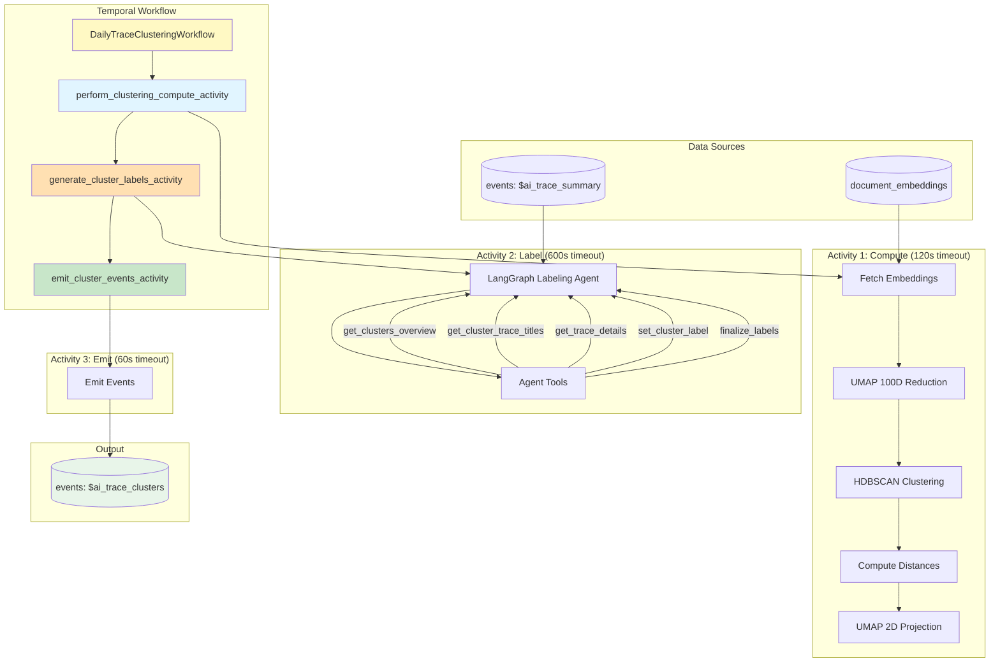

# LLM Analytics Trace Clustering

Automated workflow for clustering LLM traces based on their semantic embeddings, discovering patterns and grouping similar traces to help users understand their LLM application behavior.

## File Structure

```text
posthog/temporal/llm_analytics/trace_clustering/
├── __init__.py              # Module exports
├── workflow.py              # Temporal workflow definition (orchestrates 3 activities)
├── activities.py            # Temporal activity definitions (3 activities)
├── data.py                  # Data access layer (HogQL queries for team-scoped data)
├── clustering.py            # HDBSCAN clustering, UMAP reduction, distance calculations
├── labeling.py              # Entry point for cluster labeling (calls labeling agent)
├── event_emission.py        # Event building and emission to ClickHouse
├── models.py                # Data models (ClusteringInputs, ClusteringResult, etc.)
├── constants.py             # Configuration constants (timeouts, defaults, agent config)
├── coordinator.py           # Coordinator workflow (processes teams from allowlist)
├── schedule.py              # Temporal schedule configuration
├── test_workflow.py         # Workflow and activity tests
├── README.md                # This file
└── labeling_agent/          # LangGraph agent for cluster labeling
    ├── __init__.py
    ├── graph.py             # StateGraph assembly and entry point
    ├── state.py             # TypedDict state schema
    ├── nodes.py             # Graph nodes (agent, tools, finalize)
    ├── tools.py             # Tool definitions (6 tools)
    └── prompts.py           # System prompt for the labeling agent
```

## Overview

This workflow implements trace clustering for LLM analytics:

1. **Fetch trace IDs and embeddings** - Query trace IDs and embeddings via HogQL from the document embeddings table
2. **Dimensionality reduction** - Use UMAP to reduce embeddings to 100 dimensions for clustering
3. **HDBSCAN clustering** - Density-based clustering that automatically determines cluster count and identifies outliers
4. **Compute distances** - Calculate distance from each trace to cluster centroids
5. **2D projection** - Generate UMAP 2D coordinates for visualization
6. **Generate labels** - Use a LangGraph agent with Claude to create distinctive titles and descriptions
7. **Emit events** - Store results as `$ai_trace_clusters` events in ClickHouse

The workflow is designed to run on a schedule (daily) and is **versioned** - each run creates a fresh clustering that can be tracked over time.

## Architecture



## Workflow Details

### Main Workflow

**Name**: `llma-trace-clustering`

**Inputs** (`ClusteringWorkflowInputs`):

- `team_id` (required): Team ID to cluster traces for
- `lookback_days` (optional): Days of trace history to analyze (default: 7)
- `max_samples` (optional): Maximum traces to sample (default: 1000)
- `min_k` (optional): Minimum clusters for k-means (default: 2)
- `max_k` (optional): Maximum clusters for k-means (default: 10)
- `embedding_normalization` (optional): L2 normalize embeddings - "none" or "l2" (default: "l2")
- `dimensionality_reduction_method` (optional): Reduction method - "none", "umap", or "pca" (default: "umap")
- `dimensionality_reduction_ndims` (optional): Target dimensions for reduction (default: 100)
- `run_label` (optional): Label/tag for clustering run tracking (default: "")
- `clustering_method` (optional): Clustering algorithm - "hdbscan" or "kmeans" (default: "hdbscan")
- `clustering_method_params` (optional): Method-specific parameters (dict)
- `visualization_method` (optional): 2D projection method - "umap", "pca", or "tsne" (default: "umap")
- `trace_filters` (optional): Property filters to scope which traces to include (default: [])

### Three Activity Architecture

The workflow uses **three separate activities** with independent timeouts and retry policies:

| Activity                              | Purpose                              | Timeout | Retries | Data Size      |
| ------------------------------------- | ------------------------------------ | ------- | ------- | -------------- |
| `perform_clustering_compute_activity` | Fetch embeddings, HDBSCAN, distances | 120s    | 3       | ~150 KB output |
| `generate_cluster_labels_activity`    | LLM-based cluster labeling           | 600s    | 2       | ~4 KB output   |
| `emit_cluster_events_activity`        | Write results to ClickHouse          | 60s     | 3       | ~150 KB input  |

**Benefits:**

- **Minimized data transfer**: Embeddings (~30+ MB) stay within Activity 1, only compact results (~250 KB) passed between activities
- **Independent retries**: LLM failures don't retry compute work
- **Better observability**: Each activity visible in Temporal UI
- **Tailored timeouts**: LLM gets 5-minute timeout for API calls

**Activity 1 (Compute)** - CPU-bound work:

- Fetches embeddings via HogQL (team-scoped)
- Reduces dimensionality with UMAP (3072D → 100D for clustering)
- Performs HDBSCAN density-based clustering (auto-determines cluster count)
- Computes distance matrix and centroid coordinates
- Generates 2D UMAP projection for visualization

**Activity 2 (Label)** - LangGraph agent:

- Runs a multi-turn LangGraph agent powered by OpenAI GPT-5.1 (`gpt-5.1`)
- Agent explores clusters using tools (overview, trace titles, trace details)
- Iteratively generates distinctive labels for each cluster
- Ensures labels differentiate clusters from each other
- 10 minute timeout for full agent run (600 seconds)
- See `labeling_agent/README.md` for detailed agent architecture

**Activity 3 (Emit)** - Database write:

- Builds cluster data structures
- Emits `$ai_trace_clusters` event to ClickHouse

### Module Responsibilities

**`workflow.py`** - Temporal workflow orchestration:

- Defines `DailyTraceClusteringWorkflow` class
- Orchestrates 3 activities sequentially
- Calculates window bounds from `lookback_days`

**`activities.py`** - Temporal activity definitions:

- `perform_clustering_compute_activity()` - CPU-bound clustering work
- `generate_cluster_labels_activity()` - LLM labeling
- `emit_cluster_events_activity()` - Event emission

**`data.py`** - Data access layer (HogQL):

- `fetch_trace_embeddings_for_clustering()` - Query trace IDs and embeddings via HogQL (team-scoped, filters by product/document_type/rendering)
- `fetch_trace_summaries()` - Fetch trace summaries for LLM labeling via HogQL

**`clustering.py`** - Clustering algorithms:

- `perform_hdbscan_clustering()` - HDBSCAN density-based clustering with UMAP reduction
- `calculate_trace_distances()` - Compute distances to all centroids
- Returns `HDBSCANResult` with labels, centroids, 2D coordinates, and membership probabilities
- Automatically determines optimal cluster count and identifies noise/outliers (cluster -1)

**`labeling.py`** - Entry point for labeling:

- `generate_cluster_labels()` - Orchestrates the labeling agent
- Prepares cluster data and trace summaries for the agent
- Calls `run_labeling_agent()` from the labeling_agent module

**`labeling_agent/`** - LangGraph agent for cluster labeling:

- Multi-turn agent that explores clusters and generates distinctive labels
- Uses OpenAI GPT-5.1 with 6 tools for cluster exploration
- See `labeling_agent/README.md` for detailed architecture

**`event_emission.py`** - Event building and emission:

- `emit_cluster_events()` - Create and emit `$ai_trace_clusters` event
- Builds cluster data with traces sorted by distance rank
- Includes clustering params for debugging/analysis (`$ai_clustering_params`)

### Output Events

Each clustering run generates one `$ai_trace_clusters` event with native JSON structure:

```python
{
    "$ai_clustering_run_id": "1_trace_20250123_000000",
    "$ai_window_start": "2025-01-16T00:00:00Z",
    "$ai_window_end": "2025-01-23T00:00:00Z",
    "$ai_total_items_analyzed": 315,

    # Clustering parameters used for this run (for debugging/analysis)
    "$ai_clustering_params": {
        "clustering_method": "hdbscan",
        "clustering_method_params": {"min_cluster_size_fraction": 0.01, "min_samples": 5},
        "embedding_normalization": "l2",
        "dimensionality_reduction_method": "umap",
        "dimensionality_reduction_ndims": 100,
        "visualization_method": "umap",
        "max_samples": 1000
    },

    # Clusters array (native JSON, not string)
    "$ai_clusters": [
        {
            "cluster_id": 0,
            "size": 37,
            "title": "PostHog Documentation and Support",
            "description": "- Customer support queries about PostHog features\n- Documentation lookups...",
            "traces": {
                "trace_1": {
                    "distance_to_centroid": 0.08,
                    "rank": 0,
                    "x": -2.3,           # 2D UMAP x coordinate
                    "y": 0.9,            # 2D UMAP y coordinate
                    "timestamp": "2025-01-22T15:30:00Z"
                },
                "trace_2": {"distance_to_centroid": 0.12, "rank": 1, "x": -2.1, "y": 0.7, "timestamp": "..."},
                # ... all traces in cluster, keyed by trace_id
            },
            "centroid": [0.123, -0.456, ...],  # 100-dimensional vector (UMAP reduced)
            "centroid_x": -2.2,                # 2D centroid x coordinate
            "centroid_y": 0.8                  # 2D centroid y coordinate
        },
        {
            "cluster_id": -1,  # Noise/outliers cluster
            "size": 35,
            "title": "Outliers and Diverse Edge Cases",
            "description": "- Traces that didn't fit other clusters...",
            # ...
        },
        # ... more clusters
    ]
}
```

**Notes**:

- `$ai_clusters` is stored as **native JSON** (not a JSON string)
- `$ai_clustering_params` contains the parameters used for debugging/analysis (displayed in UI tooltip)
- `traces` is a dict keyed by trace_id for easy lookup
- Each trace includes `rank` (0-indexed, 0 = closest to centroid), `distance_to_centroid`, and 2D coordinates (`x`, `y`)
- `centroid_x` and `centroid_y` provide 2D positions for visualization
- Cluster `-1` contains noise/outliers identified by HDBSCAN
- Centroids are 100-dimensional (UMAP reduced from 3072D)

## Usage

### Manual Trigger (Development/Testing)

```bash
# Using Temporal CLI (local development)
temporal workflow start \
  --address 127.0.0.1:7233 \
  --task-queue development-task-queue \
  --type llma-trace-clustering \
  --workflow-id "trace-clustering-test-$(date +%Y%m%d-%H%M%S)" \
  --input '{"team_id": 1, "lookback_days": 7, "max_samples": 1000}'

# Check status
temporal workflow describe \
  --address 127.0.0.1:7233 \
  --workflow-id "trace-clustering-test-YYYYMMDD-HHMMSS"

# View in Temporal UI
open http://localhost:8081/namespaces/default/workflows
```

### Query Results

```python
import os
os.environ.setdefault('DJANGO_SETTINGS_MODULE', 'posthog.settings')
import django
django.setup()

import json
from posthog.clickhouse.client.execute import sync_execute

results = sync_execute('''
    SELECT
        timestamp,
        JSONExtractString(properties, '$ai_clustering_run_id') as run_id,
        JSONExtractRaw(properties, '$ai_clusters') as clusters
    FROM events
    WHERE event = '$ai_trace_clusters'
    ORDER BY timestamp DESC
    LIMIT 1
''')

if results:
    clusters = json.loads(results[0][2])
    for c in clusters:
        print(f"Cluster {c['cluster_id']}: {c['title']} ({c['size']} traces)")
```

### Scheduled Execution

The coordinator workflow (`llma-trace-clustering-coordinator`) runs on a schedule and:

1. Processes teams from the `ALLOWED_TEAM_IDS` allowlist
2. Spawns clustering workflow for each team in parallel
3. Handles failures gracefully (individual team failures don't affect others)

Team allowlist in `constants.py`:

```python
ALLOWED_TEAM_IDS: list[int] = [
    1,      # Local development
    2,      # Internal PostHog project
    112495, # Dogfooding project
]
```

To add new teams, simply add their IDs to this list.

## Configuration

Key constants in `constants.py`:

| Constant                            | Default                           | Description                                   |
| ----------------------------------- | --------------------------------- | --------------------------------------------- |
| `WORKFLOW_NAME`                     | llma-trace-clustering             | Temporal workflow name                        |
| `COORDINATOR_WORKFLOW_NAME`         | llma-trace-clustering-coordinator | Temporal coordinator workflow name            |
| `DEFAULT_LOOKBACK_DAYS`             | 7                                 | Days of trace history to analyze              |
| `DEFAULT_MAX_SAMPLES`               | 1000                              | Maximum traces to sample                      |
| `MIN_TRACES_FOR_CLUSTERING`         | 20                                | Minimum traces required for workflow          |
| `COMPUTE_ACTIVITY_TIMEOUT`          | 120s                              | Clustering compute timeout                    |
| `EMIT_ACTIVITY_TIMEOUT`             | 60s                               | Event emission timeout                        |
| `LABELING_AGENT_MODEL`              | gpt-5.1                           | OpenAI model for labeling agent               |
| `LABELING_AGENT_MAX_ITERATIONS`     | 50                                | Max agent iterations before finalization      |
| `LABELING_AGENT_RECURSION_LIMIT`    | 150                               | LangGraph recursion limit                     |
| `LABELING_AGENT_TIMEOUT`            | 600.0                             | Full agent run timeout (seconds)              |
| `DEFAULT_HDBSCAN_MIN_SAMPLES`       | 5                                 | Min samples for HDBSCAN core points           |
| `DEFAULT_MIN_CLUSTER_SIZE_FRACTION` | 0.01                              | Min cluster size as fraction of total samples |
| `DEFAULT_UMAP_N_COMPONENTS`         | 100                               | UMAP dimensions for clustering                |
| `DEFAULT_UMAP_N_NEIGHBORS`          | 15                                | UMAP neighborhood size                        |
| `DEFAULT_UMAP_MIN_DIST`             | 0.0                               | UMAP min distance (tighter for clustering)    |
| `NOISE_CLUSTER_ID`                  | -1                                | HDBSCAN noise/outlier cluster ID              |
| `LLMA_TRACE_DOCUMENT_TYPE`          | llm-trace-summary-detailed        | Document type filter for embeddings           |
| `ALLOWED_TEAM_IDS`                  | [1, 2, 112495]                    | Teams to process (allowlist approach)         |

## Processing Flow

1. **Fetch Data**
   - Query trace IDs and embeddings via HogQL (automatically team-scoped)
   - Filter by product, document_type, and rendering
   - Sample if more than `max_samples`

2. **Dimensionality Reduction**
   - Reduce embeddings from 3072D to 100D using UMAP
   - Preserves semantic structure while enabling efficient clustering

3. **HDBSCAN Clustering**
   - Density-based clustering that automatically determines cluster count
   - Identifies noise/outliers as cluster -1
   - Computes soft cluster membership probabilities
   - Calculates centroid for each cluster

4. **2D Projection**
   - Generate UMAP 2D coordinates for visualization
   - Both trace positions and centroid positions

5. **Generate Labels (Agent)**
   - LangGraph agent iteratively explores clusters
   - Uses tools to examine cluster structure and trace details
   - Generates distinctive titles and descriptions
   - Ensures labels differentiate clusters from each other

6. **Emit Events**
   - Build cluster data with traces sorted by distance rank
   - Include 2D coordinates and centroids
   - Emit single `$ai_trace_clusters` event

## Error Handling

- **Insufficient data**: Skip clustering if fewer than 20 traces
- **Compute activity retries**: 3 attempts with exponential backoff
- **LLM activity retries**: 2 attempts with longer intervals (for rate limits)
- **Emit activity retries**: 3 attempts with exponential backoff
- **LLM fallback**: If label generation fails, use "Cluster N" as title

## Testing

```bash
pytest posthog/temporal/llm_analytics/trace_clustering/test_workflow.py -v
```

Test coverage:

- `perform_hdbscan_clustering()` - HDBSCAN clustering with auto-k detection
- `perform_kmeans_with_optimal_k()` - K-means with silhouette score optimization
- `HDBSCANResult` and `KMeansResult` structure validation
- Distance calculations with `calculate_trace_distances()` and `calculate_distances_to_cluster_means()`
- UMAP dimensionality reduction with `reduce_dimensions_for_clustering()`
- 2D visualization coordinates with `compute_2d_coordinates()`
- `ClusteringWorkflowInputs` and `ClusteringActivityInputs` model validation
- Activity input/output models (`ClusteringComputeResult`, `GenerateLabelsActivityInputs`, etc.)

## Dependencies

- **hdbscan**: Density-based clustering algorithm
- **umap-learn**: Dimensionality reduction for clustering and visualization
- **numpy**: Vector operations and distance calculations
- **langchain-openai**: OpenAI API integration for labeling agent
- **langgraph**: Agent orchestration framework
- **Temporal**: Workflow orchestration

## References

- Main clustering issue: [#40787](https://github.com/PostHog/posthog/issues/40787)
- Trace summarization workflow: `posthog/temporal/llm_analytics/trace_summarization/`
- Document embeddings: `products/error_tracking/backend/embedding.py`
