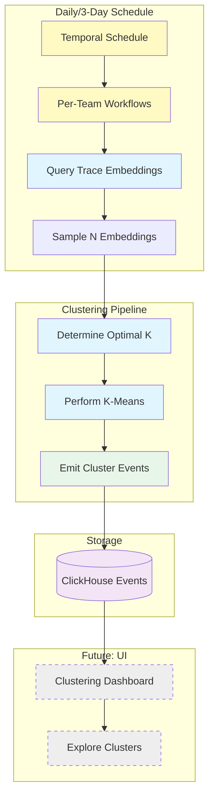

# Daily Trace Clustering

Automated workflow for clustering LLM traces based on their semantic embeddings, discovering patterns and grouping similar traces to help users understand their LLM application behavior.

## File Structure

```text
posthog/temporal/llm_analytics/trace_clustering/
├── workflow.py              # Daily clustering workflow (main orchestrator)
├── coordinator.py           # Coordinator workflow (discovers teams and spawns child workflows)
├── models.py                # Data models (ClusteringInputs, ClusterResult, etc.)
├── constants.py             # Configuration constants (timeouts, defaults, k range)
├── activities.py            # All clustering activities
├── clustering_utils.py      # K-means implementation and optimal k selection
├── schedule.py              # Temporal schedule configuration (coordinator runs daily)
├── manual_trigger.py        # Helper functions for manual workflow triggers
├── test_workflow.py         # Workflow and activity tests
└── README.md                # This file
```

## Overview

This workflow implements **Phase 4** of the clustering MVP (see [issue #40787](https://github.com/PostHog/posthog/issues/40787)):

1. **Select trace IDs** - Query and sample up to 2000 trace IDs from the last 7 days
2. **Determine optimal k** - Test k=3,4,5,6 clusters and pick best using silhouette score
3. **Perform clustering** - Run k-means clustering with optimal k
4. **Generate labels** - Use LLM to create human-readable titles and descriptions
5. **Emit events** - Store results as `$ai_trace_clusters` events in ClickHouse

> **Note**: The workflow follows Temporal best practices by passing only trace IDs through workflow history. Embeddings are fetched directly from ClickHouse within each activity to avoid payload size limits (2MB default).

The workflow only fetches trace IDs and embeddings for clustering. Trace metadata (summaries, span counts, etc.) can be fetched separately by the UI when displaying clusters.

The workflow is designed to run on a schedule (daily or every 3 days) and is **versioned** - each run creates a fresh clustering that can be tracked over time.

The clustering results will be used for:

- **Phase 5**: Clustering UI (explore clusters, view patterns, sample traces)
- **Future**: Anomaly detection, automated issue detection, pattern evolution tracking

## Architecture



## Workflow Details

### Main Workflow

**Name**: `daily-trace-clustering`

**Inputs** (`ClusteringInputs`):

- `team_id` (required): Team ID to cluster traces for
- `lookback_days` (optional): Days of trace history to analyze (default: 7)
- `max_samples` (optional): Maximum embeddings to sample (default: 2000)
- `min_k` (optional): Minimum number of clusters to test (default: 3)
- `max_k` (optional): Maximum number of clusters to test (default: 6)
- `window_start` (optional): Explicit window start in RFC3339 format (overrides lookback_days)
- `window_end` (optional): Explicit window end in RFC3339 format (overrides lookback_days)

**Flow**:

1. Queries trace IDs and embeddings from the last 7 days (no metadata)
2. Randomly samples up to 2000 embeddings (uses all if fewer available)
3. Tests k=3,4,5,6 and picks optimal k using silhouette score
4. Performs k-means clustering with optimal k
5. Emits one `$ai_trace_clusters` event with cluster assignments

### Activities

1. **`select_traces_for_clustering_activity`**
   - Queries and samples trace IDs in a single efficient operation
   - Uses `ORDER BY rand() LIMIT N` for random sampling
   - Returns list of trace ID strings (not embeddings)
   - Timeout: 5 minutes

2. **`determine_optimal_k_activity`**
   - Tests k range (default 2-4) using k-means initialization
   - Fetches embeddings by trace IDs within the activity
   - Calculates silhouette score for each k
   - Picks k with highest silhouette score
   - Returns optimal k and quality metrics
   - Timeout: 10 minutes (depends on sample size)

3. **`perform_clustering_activity`**
   - Runs k-means clustering with optimal k
   - Fetches embeddings by trace IDs within the activity
   - Uses sklearn's KMeans with reproducible random_state
   - Returns cluster assignments and centroids
   - Timeout: 5 minutes

4. **`generate_cluster_labels_activity`**
   - Generates human-readable titles and descriptions for each cluster
   - Uses LLM to analyze representative traces from each cluster
   - Selects traces nearest to cluster centroids
   - Returns dict mapping cluster_id to {title, description}
   - Timeout: 10 minutes

5. **`emit_cluster_events_activity`**
   - Emits single `$ai_trace_clusters` event with all clusters
   - Includes clustering_run_id for versioning
   - Stores cluster_id, size, centroid, labels, and all traces per cluster
   - Each trace includes distance metrics (to its centroid and all centroids)
   - Centroids are 3072-dimensional embedding vectors
   - Timeout: 1 minute

### Output Events

Each clustering run generates one `$ai_trace_clusters` event:

```python
{
    "$ai_clustering_version": "v1",
    "$ai_clustering_run_id": "team_123_2025-01-23T00:00:00Z",
    "$ai_team_id": 123,
    "$ai_timestamp": "2025-01-23T00:00:00Z",

    # Window & parameters
    "$ai_window_start": "2025-01-16T00:00:00Z",
    "$ai_window_end": "2025-01-23T00:00:00Z",
    "$ai_total_traces_analyzed": 1847,
    "$ai_sampled_traces_count": 2000,  # or fewer if less available
    "$ai_optimal_k": 4,

    # Quality metrics
    "$ai_silhouette_score": 0.42,
    "$ai_inertia": 1234.56,

    # Clusters array
    "$ai_clusters": [
        {
            "cluster_id": 0,
            "size": 523,
            "centroid": [0.123, -0.456, ...],  # 3072-dimensional centroid vector
            "traces": [
                {
                    "trace_id": "trace_1",
                    "distance_to_centroid": 0.42,  # Distance to cluster 0 centroid
                    "distances_to_all_centroids": [0.42, 0.89, 1.23, 0.67]  # Distances to all k centroids
                },
                {
                    "trace_id": "trace_2",
                    "distance_to_centroid": 0.38,
                    "distances_to_all_centroids": [0.38, 0.91, 1.19, 0.71]
                },
                # ... all traces in cluster
            ]
        },
        {
            "cluster_id": 1,
            "size": 412,
            "centroid": [0.789, 0.234, ...],
            "traces": [
                {
                    "trace_id": "trace_50",
                    "distance_to_centroid": 0.31,
                    "distances_to_all_centroids": [0.89, 0.31, 1.45, 0.52]
                },
                # ... all traces in cluster
            ]
        },
        # ... more clusters
    ]
}
```

**Notes**:

- Trace metadata (summaries, span counts, durations, etc.) is not included in the event. The UI can fetch this information separately for traces within a cluster when displaying details.
- **Centroids** enable assigning new traces to existing clusters without re-clustering by computing similarity to each centroid.
- **Distance metrics** enable:
  - Confidence scoring (traces closer to centroid are more typical of the cluster)
  - Outlier detection (traces far from their centroid or equidistant from multiple centroids)
  - Boundary analysis (traces near multiple centroids may represent edge cases)
  - UI features (sorting by typicality, highlighting outliers, visualizing cluster cohesion)

## Usage

### Manual Trigger (Development/Testing)

**Quick start using the helper script:**

```bash
# Start Django shell
python manage.py shell

# Import helper functions
>>> from posthog.temporal.llm_analytics.trace_clustering.manual_trigger import trigger_clustering, find_teams_with_embeddings

# Find teams with embedding data
>>> find_teams_with_embeddings()

# Trigger clustering for a specific team
>>> trigger_clustering(team_id=1)

# With custom parameters
>>> trigger_clustering(team_id=1, lookback_days=14, max_samples=5000)
```

**Or use the Temporal client directly:**

```python
from temporalio.client import Client
from posthog.temporal.common.client import sync_connect

# Connect to Temporal
client = sync_connect()

# Trigger for a specific team
result = client.execute_workflow(
    "daily-trace-clustering",
    ["123"],  # team_id
    id=f"trace-clustering-team-123-{datetime.now().isoformat()}",
    task_queue="llm-analytics-queue",
)

print(f"Created {result['optimal_k']} clusters from {result['traces_analyzed']} traces")
```

See `manual_trigger.py` for more examples and helper functions.

### Scheduled Execution (Automatic)

**The trace clustering runs automatically via a coordinator workflow on a schedule (daily or every 3 days).**

#### Coordinator Workflow

The coordinator workflow (`trace-clustering-coordinator`) automatically:

1. **Discovers teams** - Queries for teams with sufficient trace embeddings (≥5 by default)
2. **Spawns child workflows** - Launches a clustering workflow for each team
3. **Handles failures** - Continues processing other teams if one fails
4. **Reports results** - Returns total teams processed, clusters created, and any failures

The coordinator runs on a schedule (configured in `schedule.py`) and processes all teams with embeddings in a single run.

**No manual setup is required** - the coordinator schedule is created automatically when Temporal starts.

You can verify the schedule is running:

```bash
# Check Temporal UI at http://localhost:8233
# Look for schedule: "trace-clustering-coordinator-schedule"
```

**Team allowlist:**

By default, the workflow is limited to specific teams via `ALLOWED_TEAM_IDS` in `constants.py`:

```python
ALLOWED_TEAM_IDS: list[int] = [
    1,  # Local development
    2,  # Internal PostHog project
    112495,  # Dogfooding project
]
```

- Non-empty list: Only specified teams will be processed by the coordinator
- Empty list (`[]`): All teams with embeddings will be processed
- Manual triggers can target any team regardless of allowlist

#### Schedule Configuration

To create or update the coordinator schedule:

```python
from posthog.temporal.common.client import connect
from posthog.temporal.llm_analytics.trace_clustering.schedule import create_trace_clustering_coordinator_schedule

client = await connect()

# Daily clustering with default parameters
await create_trace_clustering_coordinator_schedule(client, interval_days=1)

# Custom configuration
await create_trace_clustering_coordinator_schedule(
    client,
    interval_days=3,  # Run every 3 days
    lookback_days=14,  # Analyze last 14 days
    max_samples=5000,  # Sample up to 5000 traces
    min_embeddings=50,  # Require at least 50 embeddings
)
```

### Configuration

Key constants in `constants.py`:

- `DEFAULT_LOOKBACK_DAYS = 7` - Days of trace history to analyze
- `DEFAULT_MAX_SAMPLES = 2000` - Maximum embeddings to sample (balance between quality and performance)
- `DEFAULT_MIN_K = 3` - Minimum number of clusters to test
- `DEFAULT_MAX_K = 6` - Maximum number of clusters to test
- `MIN_TRACES_FOR_CLUSTERING = 20` - Minimum traces needed to perform clustering
- `WORKFLOW_EXECUTION_TIMEOUT_MINUTES = 30` - Max time for workflow
- `ALLOWED_TEAM_IDS` - Team allowlist for scheduled runs (empty list = all teams allowed)
- `CLUSTERING_VERSION = "v1"` - Version identifier for clustering algorithm

## Processing Flow

1. **Query + Sample** (< 1 min)
   - Single ClickHouse query with `ORDER BY rand() LIMIT N`
   - Returns only trace IDs (~36 bytes each vs ~4KB for embeddings)
   - For 2000 traces: ~72KB vs ~8MB payload

2. **Determine Optimal K** (< 10 min)
   - Fetches embeddings by trace IDs
   - Test k=3,4,5,6 with k-means initialization
   - Calculate silhouette score for each k
   - Pick k with best score
   - Skip if insufficient traces (< 20)

3. **Cluster** (< 5 min)
   - Fetches embeddings by trace IDs
   - Run k-means with optimal k
   - Returns labels and centroids

4. **Generate Labels** (< 10 min)
   - Fetches embeddings to select representative traces
   - For each cluster, fetch trace summaries
   - Call LLM to generate title and description
   - Uses representative traces nearest to centroid

5. **Emit Events** (< 1 min)
   - Fetches embeddings to calculate distances
   - Build cluster metadata with trace assignments
   - Create single `$ai_trace_clusters` event per run

## Error Handling

- **Insufficient data**: If fewer than 20 traces with embeddings, skip clustering gracefully
- **Activity retries**: 2-3 retries with exponential backoff
- **Activity-level timeouts**:
  - Query embeddings: 5 minutes
  - Sample embeddings: 1 minute
  - Determine optimal k: 10 minutes
  - Perform clustering: 5 minutes
  - Emit events: 1 minute
- **Workflow-level timeout**: 30 minutes

## Monitoring

Workflow outputs:

```json
{
  "clustering_run_id": "team_123_2025-01-23T00:00:00Z",
  "team_id": 123,
  "traces_analyzed": 1847,
  "sampled_traces": 1847,
  "optimal_k": 4,
  "silhouette_score": 0.42,
  "clusters": [
    {"cluster_id": 0, "size": 523},
    {"cluster_id": 1, "size": 412},
    {"cluster_id": 2, "size": 589},
    {"cluster_id": 3, "size": 323}
  ],
  "duration_seconds": 245.67
}
```

Check logs for:

- `"Starting trace clustering"` - Job started
- `"Testing k={k}"` - Optimal k search progress
- `"Optimal k determined: {k}"` - Best k selected
- `"Clustering completed"` - Job finished with stats

## Dependencies

- **Trace summarization workflow**: Must run first to generate embeddings
- **document_embeddings table**: Source of embedding vectors
- **sklearn**: K-means clustering and silhouette score calculation
- **numpy**: Vector operations and distance calculations

## Next Steps

After this workflow is in production:

1. **Phase 5: Clustering UI**
   - Display clusters in LLMA dashboard
   - Explore traces within clusters
   - View cluster evolution over time
   - Filter and search within clusters

2. **Future Enhancements**
   - Hierarchical clustering for multi-level patterns
   - Anomaly detection (traces far from any cluster)
   - Automated cluster naming/descriptions using LLM
   - Cluster stability tracking (how clusters change over time)
   - Smart alerting on new cluster patterns

## Testing

Run tests:

```bash
pytest posthog/temporal/llm_analytics/trace_clustering/test_workflow.py -v
```

Test coverage:

- ✅ Embedding querying with various time windows
- ✅ Sampling with different data sizes
- ✅ Optimal k selection with silhouette scores
- ✅ K-means clustering with reproducibility
- ✅ Event emission with correct schema
- ✅ Error handling for insufficient data
- ✅ Workflow input parsing

## Cost Estimation

For daily clustering runs per team:

- **Compute**: K-means on 2000 embeddings × 4 k-tests ≈ 8000 clustering operations/day/team
- **Storage**: One event per day per team (~50KB with all trace_ids)
- **No LLM calls**: Uses pre-computed embeddings from summarization workflow

This is computationally lightweight compared to the summarization workflow, as it only processes embeddings (no LLM calls).

## References

- Main clustering issue: [#40787](https://github.com/PostHog/posthog/issues/40787)
- Trace summarization workflow: `posthog/temporal/llm_analytics/trace_summarization/`
- Document embeddings: `products/error_tracking/backend/embedding.py`
