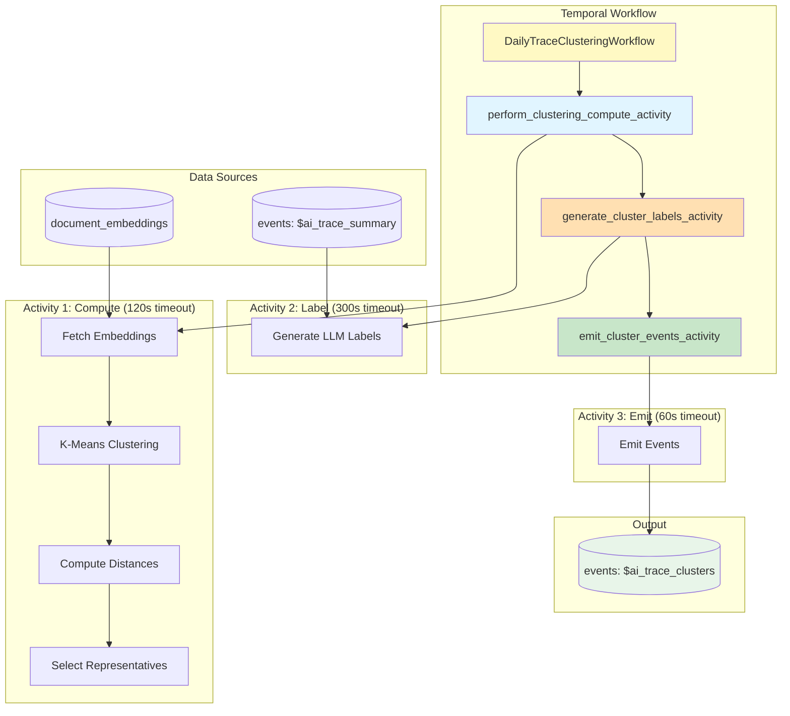

# Daily Trace Clustering

Automated workflow for clustering LLM traces based on their semantic embeddings, discovering patterns and grouping similar traces to help users understand their LLM application behavior.

## File Structure

```text
posthog/temporal/llm_analytics/trace_clustering/
├── workflow.py              # Temporal workflow definition (orchestrates 3 activities)
├── activities.py            # Temporal activity definitions (3 activities)
├── data.py                  # Data access layer (HogQL queries for team-scoped data)
├── clustering.py            # K-means implementation and distance calculations
├── labeling.py              # LLM-based cluster labeling
├── event_emission.py        # Event building and emission to ClickHouse
├── models.py                # Data models (ClusteringInputs, ClusteringResult, etc.)
├── constants.py             # Configuration constants (timeouts, defaults, k range)
├── coordinator.py           # Coordinator workflow (processes teams from allowlist)
├── schedule.py              # Temporal schedule configuration
├── test_workflow.py         # Workflow and activity tests
└── README.md                # This file
```

## Overview

This workflow implements trace clustering for LLM analytics:

1. **Fetch trace IDs and embeddings** - Query trace IDs and embeddings via HogQL from the document embeddings table
2. **Perform clustering with optimal k** - Test k values using silhouette score and return the best clustering result
3. **Compute distances** - Calculate distance from each trace to cluster centroids
4. **Select representatives** - Pick traces closest to each centroid for labeling
5. **Generate labels** - Use LLM to create human-readable titles and descriptions
6. **Emit events** - Store results as `$ai_trace_clusters` events in ClickHouse

The workflow is designed to run on a schedule (daily) and is **versioned** - each run creates a fresh clustering that can be tracked over time.

## Architecture



## Workflow Details

### Main Workflow

**Name**: `daily-trace-clustering`

**Inputs** (`ClusteringWorkflowInputs`):

- `team_id` (required): Team ID to cluster traces for
- `lookback_days` (optional): Days of trace history to analyze (default: 7)
- `max_samples` (optional): Maximum traces to sample (default: 1000)
- `min_k` (optional): Minimum number of clusters to test (default: 2)
- `max_k` (optional): Maximum number of clusters to test (default: 10)

### Three Activity Architecture

The workflow uses **three separate activities** with independent timeouts and retry policies:

| Activity                              | Purpose                              | Timeout | Retries | Data Size      |
| ------------------------------------- | ------------------------------------ | ------- | ------- | -------------- |
| `perform_clustering_compute_activity` | Fetch embeddings, k-means, distances | 120s    | 3       | ~250 KB output |
| `generate_cluster_labels_activity`    | LLM-based cluster labeling           | 300s    | 2       | ~4 KB output   |
| `emit_cluster_events_activity`        | Write results to ClickHouse          | 60s     | 3       | ~100 KB output |

**Benefits:**

- **Minimized data transfer**: Embeddings (~30+ MB) stay within Activity 1, only compact results (~250 KB) passed between activities
- **Independent retries**: LLM failures don't retry compute work
- **Better observability**: Each activity visible in Temporal UI
- **Tailored timeouts**: LLM gets 5-minute timeout for API calls

**Activity 1 (Compute)** - CPU-bound work:

- Fetches embeddings via HogQL (team-scoped)
- Performs k-means clustering with optimal k selection
- Computes distance matrix
- Selects representative traces for labeling

**Activity 2 (Label)** - External API call:

- Fetches trace summaries for representative traces
- Calls OpenAI to generate cluster titles and descriptions

**Activity 3 (Emit)** - Database write:

- Builds cluster data structures
- Emits `$ai_trace_clusters` event to ClickHouse

### Module Responsibilities

**`workflow.py`** - Temporal workflow orchestration:

- Defines `DailyTraceClusteringWorkflow` class
- Orchestrates 3 activities sequentially
- Calculates window bounds from `lookback_days`

**`activities.py`** - Temporal activity definitions:

- `perform_clustering_compute_activity()` - CPU-bound clustering work
- `generate_cluster_labels_activity()` - LLM labeling
- `emit_cluster_events_activity()` - Event emission

**`data.py`** - Data access layer (HogQL):

- `fetch_trace_embeddings_for_clustering()` - Query trace IDs and embeddings via HogQL (team-scoped, filters by product/document_type/rendering)
- `fetch_trace_summaries()` - Fetch trace summaries for LLM labeling via HogQL

**`clustering.py`** - Clustering algorithms:

- `perform_kmeans_with_optimal_k()` - Test k values using silhouette score and return `KMeansResult` with labels and centroids
- `calculate_trace_distances()` - Compute distances to all centroids
- `select_representatives_from_distances()` - Pick traces closest to centroids, returns `ClusterRepresentatives`

**`labeling.py`** - LLM label generation:

- `generate_cluster_labels()` - Create titles and descriptions
- Uses trace summaries (title, flow_diagram, bullets, interesting_notes)
- Calls OpenAI with structured output for consistent formatting

**`event_emission.py`** - Event building and emission:

- `emit_cluster_events()` - Create and emit `$ai_trace_clusters` event
- Builds cluster data with traces sorted by distance rank

### Output Events

Each clustering run generates one `$ai_trace_clusters` event with native JSON structure:

```python
{
    "$ai_clustering_run_id": "team_123_2025-01-23T00:00:00Z",
    "$ai_window_start": "2025-01-16T00:00:00Z",
    "$ai_window_end": "2025-01-23T00:00:00Z",
    "$ai_total_traces_analyzed": 1847,

    # Clusters array (native JSON, not string)
    "$ai_clusters": [
        {
            "cluster_id": 0,
            "size": 523,
            "title": "Weather Data Retrieval",
            "description": "Traces focusing on weather information queries...",
            "traces": {
                "trace_1": {"distance_to_centroid": 0.38, "rank": 0},
                "trace_2": {"distance_to_centroid": 0.42, "rank": 1},
                # ... all traces in cluster, keyed by trace_id
            },
            "centroid": [0.123, -0.456, ...]  # 3072-dimensional vector
        },
        # ... more clusters
    ]
}
```

**Notes**:

- `$ai_clusters` is stored as **native JSON** (not a JSON string)
- `traces` is a dict keyed by trace_id for easy lookup
- Each trace includes `rank` (0-indexed, 0 = closest to centroid) and `distance_to_centroid`
- Centroids enable assigning new traces to existing clusters

## Usage

### Manual Trigger (Development/Testing)

```bash
# Using Temporal CLI
temporal workflow start \
  --task-queue development-task-queue \
  --type daily-trace-clustering \
  --workflow-id "trace-clustering-test-$(date +%Y%m%d-%H%M%S)" \
  --input '{"team_id": 1, "lookback_days": 7, "max_samples": 1000, "min_k": 2, "max_k": 10}'

# Check status
temporal workflow describe --workflow-id "trace-clustering-test-YYYYMMDD-HHMMSS"
```

### Query Results

```python
import os
os.environ.setdefault('DJANGO_SETTINGS_MODULE', 'posthog.settings')
import django
django.setup()

import json
from posthog.clickhouse.client.execute import sync_execute

results = sync_execute('''
    SELECT
        timestamp,
        JSONExtractString(properties, '$ai_clustering_run_id') as run_id,
        JSONExtractRaw(properties, '$ai_clusters') as clusters
    FROM events
    WHERE event = '$ai_trace_clusters'
    ORDER BY timestamp DESC
    LIMIT 1
''')

if results:
    clusters = json.loads(results[0][2])
    for c in clusters:
        print(f"Cluster {c['cluster_id']}: {c['title']} ({c['size']} traces)")
```

### Scheduled Execution

The coordinator workflow (`trace-clustering-coordinator`) runs on a schedule and:

1. Processes teams from the `ALLOWED_TEAM_IDS` allowlist
2. Spawns clustering workflow for each team in parallel
3. Handles failures gracefully (individual team failures don't affect others)

Team allowlist in `constants.py`:

```python
ALLOWED_TEAM_IDS: list[int] = [
    1,      # Local development
    2,      # Internal PostHog project
    112495, # Dogfooding project
]
```

To add new teams, simply add their IDs to this list.

## Configuration

Key constants in `constants.py`:

| Constant                                  | Default           | Description                           |
| ----------------------------------------- | ----------------- | ------------------------------------- |
| `DEFAULT_LOOKBACK_DAYS`                   | 7                 | Days of trace history to analyze      |
| `DEFAULT_MAX_SAMPLES`                     | 1000              | Maximum traces to sample              |
| `DEFAULT_MIN_K`                           | 2                 | Minimum clusters to test              |
| `DEFAULT_MAX_K`                           | 10                | Maximum clusters to test              |
| `MIN_TRACES_FOR_CLUSTERING`               | 20                | Minimum traces required for workflow  |
| `COMPUTE_ACTIVITY_TIMEOUT`                | 120s              | Clustering compute timeout            |
| `LLM_ACTIVITY_TIMEOUT`                    | 300s              | LLM labeling timeout                  |
| `EMIT_ACTIVITY_TIMEOUT`                   | 60s               | Event emission timeout                |
| `DEFAULT_TRACES_PER_CLUSTER_FOR_LABELING` | 7                 | Representatives for LLM               |
| `LABELING_LLM_MODEL`                      | gpt-5.1           | OpenAI model for labeling             |
| `LABELING_LLM_TIMEOUT`                    | 240.0             | LLM request timeout (seconds)         |
| `LLMA_TRACE_DOCUMENT_TYPE`                | llm-trace-summary | Document type filter for embeddings   |
| `ALLOWED_TEAM_IDS`                        | [1, 2, 112495]    | Teams to process (allowlist approach) |

## Processing Flow

1. **Fetch Data**
   - Query trace IDs and embeddings via HogQL (automatically team-scoped)
   - Filter by product, document_type, and rendering
   - Sample if more than `max_samples`

2. **Cluster with Optimal K**
   - Test k values from `min_k` to `max_k`
   - Calculate silhouette score for each k
   - Return `KMeansResult` with best labels and centroids
   - Compute distance matrix (traces × centroids)
   - **Distances computed once and reused**

3. **Select Representatives**
   - For each cluster, pick N traces closest to centroid
   - Uses pre-computed distance matrix
   - Returns `ClusterRepresentatives` mapping

4. **Generate Labels**
   - Fetch trace summaries from `$ai_trace_summary` events
   - Build prompt with representative trace details
   - Call OpenAI to generate titles and descriptions

5. **Emit Events**
   - Build cluster data with traces sorted by distance
   - Emit single `$ai_trace_clusters` event

## Error Handling

- **Insufficient data**: Skip clustering if fewer than 20 traces
- **Compute activity retries**: 3 attempts with exponential backoff
- **LLM activity retries**: 2 attempts with longer intervals (for rate limits)
- **Emit activity retries**: 3 attempts with exponential backoff
- **LLM fallback**: If label generation fails, use "Cluster N" as title

## Testing

```bash
pytest posthog/temporal/llm_analytics/trace_clustering/test_workflow.py -v
```

Test coverage:

- `perform_kmeans_with_optimal_k()` - Optimal k selection and clustering
- `KMeansResult` structure validation
- Distance calculations with `calculate_trace_distances()`
- Representative selection with `select_representatives_from_distances()`
- `ClusteringWorkflowInputs` and `ClusteringActivityInputs` model validation
- Activity input/output models (`ClusteringComputeResult`, `GenerateLabelsActivityInputs`, etc.)

## Dependencies

- **sklearn**: K-means clustering and silhouette score
- **numpy**: Vector operations and distance calculations
- **OpenAI**: LLM-based cluster labeling (configured via `LABELING_LLM_MODEL`)
- **Temporal**: Workflow orchestration

## References

- Main clustering issue: [#40787](https://github.com/PostHog/posthog/issues/40787)
- Trace summarization workflow: `posthog/temporal/llm_analytics/trace_summarization/`
- Document embeddings: `products/error_tracking/backend/embedding.py`
