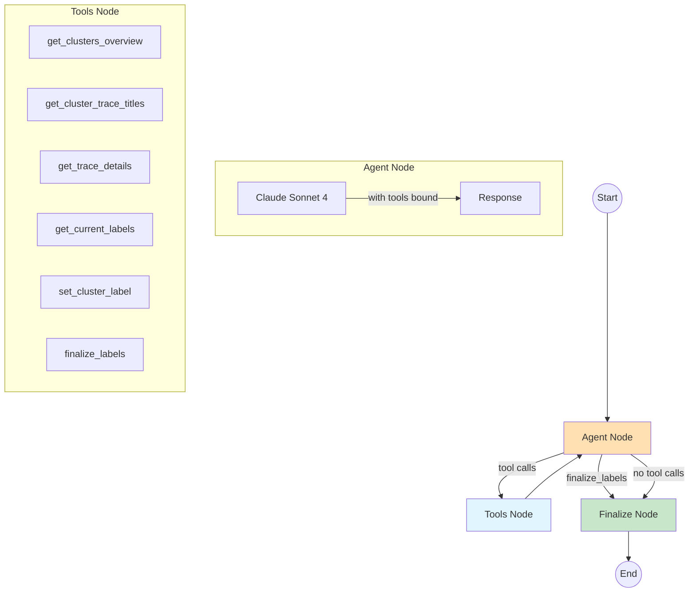

# Cluster Labeling Agent

A LangGraph-based agent that generates distinctive, high-quality labels for trace clusters. The agent iteratively explores clusters using tools and creates titles and descriptions that differentiate each cluster from the others.

## Architecture



## File Structure

```text
labeling_agent/
├── __init__.py      # Exports run_labeling_agent
├── graph.py         # StateGraph assembly and run_labeling_agent entry point
├── state.py         # ClusterLabelingState TypedDict and helper types
├── nodes.py         # Graph node functions (agent_node, tools_node, finalize_node)
├── tools.py         # Tool definitions and execute_tool dispatcher
├── prompts.py       # CLUSTER_LABELING_SYSTEM_PROMPT
└── README.md        # This file
```

## State Schema

```python
class ClusterTraceData(TypedDict):
    """All trace data for a cluster."""
    cluster_id: int
    size: int
    centroid_x: float
    centroid_y: float
    traces: dict[str, TraceMetadata]  # trace_id -> metadata

class ClusterLabelingState(TypedDict):
    # Input data (immutable during run)
    team_id: int
    cluster_data: dict[int, ClusterTraceData]      # cluster_id -> cluster info with traces
    all_trace_summaries: dict[str, TraceSummary]   # trace_id -> full summary

    # Working state (mutated by agent)
    current_labels: dict[int, ClusterLabel | None] # cluster_id -> label or None
    messages: Annotated[list, add_messages]        # LangGraph message history

    # Control flow
    iterations: int
    max_iterations: int  # Default: 50
```

## Tools

| Tool                       | Purpose                         | Input                                | Output                                                  |
| -------------------------- | ------------------------------- | ------------------------------------ | ------------------------------------------------------- |
| `get_clusters_overview`    | High-level view of all clusters | None                                 | List of {cluster_id, size, centroid_x, centroid_y}      |
| `get_cluster_trace_titles` | Scan trace titles in a cluster  | `cluster_id`, `limit` (default 30)   | List of {trace_id, title, rank, distance, x, y}         |
| `get_trace_details`        | Full trace summaries            | `trace_ids` (list)                   | List of {trace_id, title, flow_diagram, bullets, notes} |
| `get_current_labels`       | Review all labels set so far    | None                                 | Dict of {cluster_id: {title, description} or null}      |
| `set_cluster_label`        | Set/update a cluster's label    | `cluster_id`, `title`, `description` | Confirmation message                                    |
| `finalize_labels`          | Signal completion               | None                                 | Triggers transition to finalize node                    |

### Tool Details

**`get_cluster_trace_titles`** returns lightweight data for quick scanning:

- `rank`: Distance rank (1 = closest to centroid, higher = further)
- `distance_to_centroid`: Euclidean distance for understanding cluster tightness
- `x, y`: 2D UMAP coordinates for spatial awareness

**`get_trace_details`** returns full summaries for deeper analysis:

- `title`: Trace title
- `flow_diagram`: ASCII flow diagram of the trace
- `bullets`: Key observations as bullet points
- `interesting_notes`: Notable patterns or anomalies

**`get_current_labels`** enables the agent to:

- Track progress (which clusters still need labels)
- Review all labels together for distinctiveness
- Identify if labels are too similar and need refinement

## Graph Flow

1. **Agent Node**: Invokes Claude with tools bound, returns tool calls or text
2. **Router**: Routes to `tools` if tool calls present (except `finalize_labels`), otherwise to `finalize`
3. **Tools Node**: Executes tool calls, updates state for `set_cluster_label`
4. **Finalize Node**: Validates labels, fills defaults for any missing clusters

## Agent Strategy

The system prompt guides the agent to:

1. **Start with overview**: Call `get_clusters_overview()` to see all clusters
2. **Scan each cluster**: Use `get_cluster_trace_titles()` to understand trace distribution
3. **Examine strategically**: Use `get_trace_details()` for:
   - Top-ranked traces (most representative)
   - Edge traces (might reveal sub-patterns)
   - Interesting titles that stand out
4. **Generate labels**: Create distinctive title + description for each cluster
5. **Compare and refine**: Use `get_current_labels()` to ensure labels differentiate clusters
6. **Finalize**: Call `finalize_labels()` when all clusters have good labels

## Configuration

From `constants.py`:

| Constant                         | Value                      | Description                                       |
| -------------------------------- | -------------------------- | ------------------------------------------------- |
| `LABELING_AGENT_MODEL`           | `claude-sonnet-4-20250514` | Claude Sonnet 4 model for reasoning               |
| `LABELING_AGENT_MAX_ITERATIONS`  | 50                         | Max iterations before forced finalization         |
| `LABELING_AGENT_RECURSION_LIMIT` | 150                        | LangGraph recursion limit (> 2 \* max_iterations) |
| `LABELING_AGENT_TIMEOUT`         | 600.0                      | Full agent run timeout (seconds)                  |

## Usage

```python
from posthog.temporal.llm_analytics.trace_clustering.labeling_agent import run_labeling_agent

labels = run_labeling_agent(
    team_id=1,
    cluster_data={
        0: {
            "cluster_id": 0,
            "size": 50,
            "centroid_x": -2.2,
            "centroid_y": 0.8,
            "traces": {
                "trace_1": {"trace_id": "trace_1", "rank": 1, "distance_to_centroid": 0.08, "x": -2.3, "y": 0.9},
                "trace_2": {"trace_id": "trace_2", "rank": 2, "distance_to_centroid": 0.12, "x": -2.1, "y": 0.7},
            },
        },
        -1: {  # Outliers cluster
            "cluster_id": -1,
            "size": 10,
            "centroid_x": 1.5,
            "centroid_y": -0.5,
            "traces": {...},
        },
    },
    all_trace_summaries={
        "trace_1": {"title": "...", "flow_diagram": "...", "bullets": "...", "interesting_notes": "...", "trace_timestamp": "..."},
        # ...
    },
    max_iterations=50,
)

# Returns: {0: ClusterLabel(title="...", description="..."), -1: ClusterLabel(...)}
```

## Error Handling

- **Max iterations reached**: Agent is forced to finalize with current labels
- **LLM errors**: Agent finalizes gracefully with current labels
- **Tool errors**: Error message returned to agent, can retry or continue
- **Missing labels**: Finalize node fills in defaults ("Cluster N" or "Outliers")

## Logging

The agent logs key events for observability:

- `cluster_labeling_agent_starting`: Agent initialization with cluster count
- `cluster_labeling_agent_iteration_start`: Each iteration with progress
- `cluster_labeling_agent_iteration_complete`: Tool calls made
- `cluster_labeling_label_set`: When a label is assigned
- `cluster_labeling_agent_finalized`: Final label count and iterations
