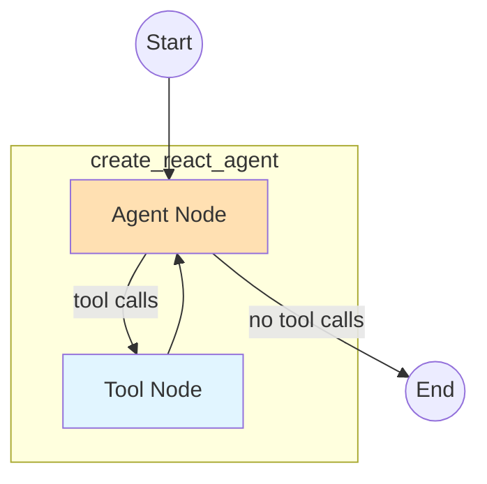

# Cluster Labeling Agent

A LangGraph-based agent that generates distinctive, high-quality labels for trace clusters. Uses the `create_react_agent` prebuilt pattern for a clean, minimal implementation.

## Architecture

The agent uses LangGraph's `create_react_agent` which implements the standard ReAct (Reasoning + Acting) loop:



The prebuilt agent handles:

- LLM invocation with tools bound
- Tool execution via `ToolNode`
- Routing between agent and tools via `tools_condition`
- Message history management

## File Structure

```text
labeling_agent/
├── __init__.py      # Exports run_labeling_agent
├── graph.py         # create_react_agent setup and run_labeling_agent entry point
├── state.py         # ClusterLabelingState TypedDict and helper types
├── tools.py         # Tool definitions using InjectedState pattern
├── prompts.py       # CLUSTER_LABELING_SYSTEM_PROMPT
└── README.md        # This file
```

## State Schema

```python
class ClusterLabelingState(TypedDict):
    # LangGraph message history (required by create_react_agent)
    messages: Annotated[list, add_messages]

    # Input data (set at start, read by tools via InjectedState)
    team_id: int
    cluster_data: dict[int, ClusterTraceData]      # cluster_id -> cluster info with traces
    all_trace_summaries: dict[str, TraceSummary]   # trace_id -> full summary

    # Working state (mutated by tools via InjectedState)
    current_labels: dict[int, ClusterLabel | None] # cluster_id -> label or None
```

## Tools

Tools use the `InjectedState` pattern to access and mutate graph state directly:

```python
from langgraph.prebuilt import InjectedState

@tool
def set_cluster_label(
    state: Annotated[dict, InjectedState],  # Injected, not exposed to LLM
    cluster_id: int,
    title: str,
    description: str,
) -> str:
    """Set or update the label for a specific cluster."""
    state["current_labels"][cluster_id] = ClusterLabel(title=title, description=description)
    return f"Label set for cluster {cluster_id}: '{title}'"
```

| Tool                                  | Purpose                          | Key Arguments                        |
| ------------------------------------- | -------------------------------- | ------------------------------------ |
| `get_clusters_overview`               | High-level view of all clusters  | None                                 |
| `get_all_clusters_with_sample_titles` | All clusters with sample titles  | `titles_per_cluster` (default 10)    |
| `get_cluster_trace_titles`            | Scan trace titles in a cluster   | `cluster_id`, `limit` (default 30)   |
| `get_trace_details`                   | Full trace summaries             | `trace_ids` (list)                   |
| `get_current_labels`                  | Review all labels set so far     | None                                 |
| `set_cluster_label`                   | Set/update a cluster's label     | `cluster_id`, `title`, `description` |
| `bulk_set_labels`                     | Set labels for multiple clusters | `labels` (list of dicts)             |
| `finalize_labels`                     | Signal completion                | None                                 |

## Agent Strategy

The system prompt guides the agent through a two-phase approach:

**Phase 1 - Initial Labeling:**

1. Call `get_all_clusters_with_sample_titles()` for a global overview
2. Use `bulk_set_labels()` to quickly label all clusters based on patterns

**Phase 2 - Refinement:**

1. Review labels with `get_current_labels()`
2. For ambiguous clusters, use `get_cluster_trace_titles()` or `get_trace_details()`
3. Update labels with `set_cluster_label()` as needed
4. Call `finalize_labels()` when satisfied

## Configuration

From `constants.py`:

| Constant                         | Value     | Description                        |
| -------------------------------- | --------- | ---------------------------------- |
| `LABELING_AGENT_MODEL`           | `gpt-5.1` | OpenAI model for reasoning         |
| `LABELING_AGENT_RECURSION_LIMIT` | 150       | Max graph steps before forced stop |
| `LABELING_AGENT_TIMEOUT`         | 600.0     | LLM request timeout (seconds)      |

## Usage

```python
from posthog.temporal.llm_analytics.trace_clustering.labeling_agent import run_labeling_agent

labels = run_labeling_agent(
    team_id=1,
    cluster_data={
        0: {
            "cluster_id": 0,
            "size": 50,
            "centroid_x": -2.2,
            "centroid_y": 0.8,
            "traces": {
                "trace_1": {"trace_id": "trace_1", "rank": 1, "distance_to_centroid": 0.08, "x": -2.3, "y": 0.9},
                "trace_2": {"trace_id": "trace_2", "rank": 2, "distance_to_centroid": 0.12, "x": -2.1, "y": 0.7},
            },
        },
        -1: {  # Outliers cluster
            "cluster_id": -1,
            "size": 10,
            "centroid_x": 1.5,
            "centroid_y": -0.5,
            "traces": {...},
        },
    },
    all_trace_summaries={
        "trace_1": {"title": "...", "flow_diagram": "...", "bullets": "...", "interesting_notes": "...", "trace_timestamp": "..."},
        # ...
    },
)

# Returns: {0: ClusterLabel(title="...", description="..."), -1: ClusterLabel(...)}
```

## Error Handling

- **Recursion limit reached**: Agent stops and returns current labels
- **LLM errors**: Caught and logged, returns current labels with defaults filled
- **Missing labels**: `_fill_missing_labels()` provides defaults ("Cluster N" or "Outliers")

## Key Design Decisions

1. **`create_react_agent` over manual `StateGraph`**: Eliminates boilerplate for agent loop, tool routing, and message handling

2. **`InjectedState` for tools**: Tools directly access/mutate state without separate execution functions

3. **`recursion_limit` over iteration counting**: Cleaner control flow, no custom iteration tracking needed

4. **Bulk operations**: `get_all_clusters_with_sample_titles` and `bulk_set_labels` reduce round-trips for initial labeling
