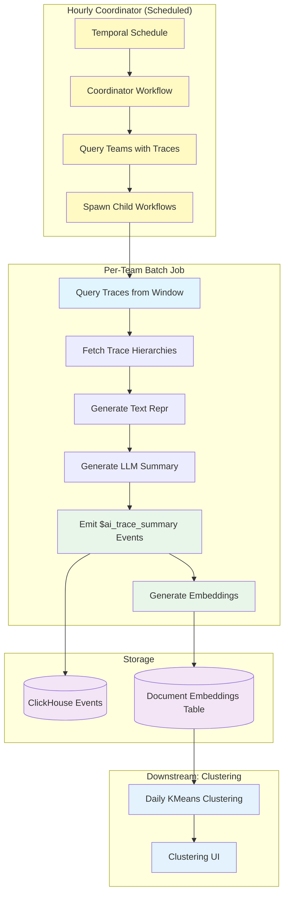

# Batch Trace Summarization

Automated workflow for generating summaries and embeddings of recent LLM traces from time windows (e.g., hourly), which will serve as inputs for clustering workflows.

## File Structure

```text
posthog/temporal/llm_analytics/trace_summarization/
├── workflow.py              # Per-team batch summarization workflow (main orchestrator)
├── coordinator.py           # Multi-team coordinator workflow (spawns child workflows)
├── schedule.py              # Temporal schedule configuration (hourly automatic runs)
├── models.py                # Data models (TraceSummary, BatchSummarizationInputs, BatchSummarizationResult, CoordinatorResult)
├── constants.py             # Configuration constants (timeouts, defaults, limits, rendering types, retry policies)
├── sampling.py              # Query traces from time window using TracesQueryRunner
├── summarization.py         # Fetch trace, generate text repr, call LLM API, and emit events to ClickHouse
├── embedding.py             # Generate embeddings for summaries via Kafka/Rust worker
├── manual_trigger.py        # Helper functions for manual workflow triggers (dev/testing)
├── test_workflow.py         # Workflow and activity tests
└── README.md                # This file
```

## Overview

This workflow implements **Phases 2 & 3** of the clustering MVP (see [issue #40787](https://github.com/PostHog/posthog/issues/40787)):

This is a **daily batch workflow** that:

1. Queries N recent traces from a time window (default: last 60 minutes)
2. For each trace:
   - Fetches full trace data from ClickHouse
   - Generates text representation and summary using LLM
   - Generates embedding for the summary
   - Stores results as `$ai_trace_summary` events

> **Note**: The workflow uses Temporal best practices by passing only trace IDs through workflow history. Heavy data (full trace objects) is fetched directly within activities to avoid payload size limits.

4. **Generate embeddings** - Create semantic embeddings from summaries and store in `document_embeddings` table

The workflow runs on a schedule (e.g., hourly) and is **idempotent** - rerunning on the same time window will regenerate the same summaries and embeddings. The workflow uses Temporal workflow time (`temporalio.workflow.now()`) for all timestamp-based queries, ensuring deterministic behavior across retries.

The summaries and embeddings are used for:

- Daily clustering jobs (using embeddings for KMeans)
- Clustering UI and reports
- Semantic search across trace summaries

## Architecture



## Workflow Details

### Coordinator Workflow (Automatic)

**Name**: `batch-trace-summarization-coordinator`

**Inputs** (`BatchTraceSummarizationCoordinatorInputs`):

- `max_traces` (optional): Maximum traces to process per team (default: 100)
- `batch_size` (optional): Batch size for processing (default: 10)
- `mode` (optional): Summary detail level - `minimal` or `detailed` (default: `detailed`)
- `window_minutes` (optional): Time window to query in minutes (default: 60)
- `model` (optional): LLM model to use (default: gpt-5-mini)
- `lookback_hours` (optional): How far back to look for team activity (default: 24)

**Flow**:

1. Captures workflow start time via `temporalio.workflow.now()` for idempotent queries
2. Queries for teams with LLM trace events in the lookback window (using workflow time for deterministic results)
3. Spawns child `batch-trace-summarization` workflow for each team
4. Aggregates results into typed `CoordinatorResult` with team/trace/summary counts
5. Teams without traces are skipped

**Returns**: `CoordinatorResult` dataclass with fields:

- `teams_processed`: Total number of teams with trace activity
- `teams_failed`: Number of teams that failed to process
- `failed_team_ids`: List of team IDs that encountered errors
- `total_traces`: Sum of traces queried across all teams
- `total_summaries`: Sum of summaries generated across all teams

### Per-Team Workflow

**Name**: `batch-trace-summarization`

**Inputs** (`BatchSummarizationInputs`):

- `team_id` (required): Team ID to process traces for
- `max_traces` (optional): Maximum traces to process in window (default: 100)
- `batch_size` (optional): Batch size for processing (default: 10)
- `mode` (optional): Summary detail level - `minimal` or `detailed` (default: `detailed`)
- `window_minutes` (optional): Time window to query in minutes (default: 60)
- `model` (optional): LLM model to use (default: gpt-5-mini for better quality)
- `window_start` (optional): Explicit window start in RFC3339 format (overrides window_minutes)
- `window_end` (optional): Explicit window end in RFC3339 format (overrides window_minutes)

**Returns**: `BatchSummarizationResult` dataclass with fields:

- `batch_run_id`: Unique identifier for this batch run (format: `team_id_timestamp`)
- `traces_queried`: Number of traces fetched from window
- `summaries_requested`: Number of summaries attempted
- `summaries_failed`: Number that failed to generate
- `summaries_generated`: Number successfully generated
- `events_emitted`: Number of `$ai_trace_summary` events written to ClickHouse
- `embeddings_requested`: Number of embedding requests sent to Kafka
- `embeddings_failed`: Number that failed to queue for embedding
- `duration_seconds`: Total workflow execution time

### Activities

1. **`query_traces_in_window_activity`**
   - Uses `TracesQueryRunner` to fetch traces from time window (reuses frontend query logic)
   - Queries from last N minutes (default: 60) or explicit window if provided
   - Enforces hard limit via `max_traces` parameter (default: 100)
   - Returns list of trace metadata (trace_id, timestamp, team_id)
   - Idempotent - same window returns same traces

2. **`generate_and_save_summary_activity`**
   - Uses `TraceQueryRunner` to fetch full trace data (creates 15-minute window around trace timestamp)
   - Generates line-numbered text representation using existing formatters
   - Calls LLM summarization API
   - Immediately emits `$ai_trace_summary` event to ClickHouse (atomically)
   - Returns success status with trace_id and metadata

3. **`embed_summaries_from_events_activity`**
   - Waits 3 seconds for ClickHouse ingestion to complete
   - Fetches `$ai_trace_summary` events from ClickHouse using timestamp filtering
     - Uses workflow start time to create narrow query window (±5-10 minutes)
     - Prevents full table scans on large event tables
   - Formats summaries for embedding (excludes line references, includes title + flow + bullets + notes)
   - Sends embedding requests to Kafka (`document_embeddings_input` topic) in parallel
   - Rust embedding worker processes requests asynchronously (calls OpenAI API)
   - Embeddings stored in ClickHouse `document_embeddings` table with rendering type (`llma_trace_minimal` or `llma_trace_detailed`)
   - Returns count of embeddings requested and failed

### Output Events

Each trace gets a `$ai_trace_summary` event with properties:

```python
{
    "$ai_trace_id": "original_trace_id",
    "$ai_batch_run_id": "team_123_2025-01-15T12:00:00Z",
    "$ai_summary_mode": "detailed",  # or "minimal"
    "$ai_summary_title": "User authentication flow",
    "$ai_summary_text_repr": "L1: TRACE...\n",  # Full text representation
    "$ai_summary_flow_diagram": "graph TD; A-->B;",  # Mermaid diagram
    "$ai_summary_bullets": "[{\"text\": \"...\", \"line_refs\": \"L1-5\"}]",
    "$ai_summary_interesting_notes": "[{\"text\": \"...\", \"line_refs\": \"L10\"}]",
    "$ai_text_repr_length": 1234,
    "$ai_event_count": 5
}
```

## Usage

### Manual Trigger (Development/Testing)

**Quick start using the helper script:**

```bash
# Start Django shell
python manage.py shell

# Import helper functions
>>> from posthog.temporal.llm_analytics.trace_summarization.manual_trigger import trigger_coordinator, trigger_single_team, find_teams_with_traces

# Find teams with trace data
>>> find_teams_with_traces()

# Trigger coordinator (processes all teams - same as scheduled run)
>>> trigger_coordinator()

# Or trigger for a single team only
>>> trigger_single_team(team_id=1)

# With custom parameters
>>> trigger_coordinator(max_traces=100, mode="detailed")
>>> trigger_single_team(team_id=1, max_traces=50, window_minutes=30)
```

**Or use the Temporal client directly:**

```python
from temporalio.client import Client
from posthog.temporal.common.client import sync_connect

# Connect to Temporal
client = sync_connect()

# Trigger for a specific team
result = client.execute_workflow(
    "batch-trace-summarization",
    ["123"],  # team_id
    id=f"batch-summarization-team-123-{datetime.now().isoformat()}",
    task_queue="llm-analytics-queue",
)

print(f"Summarized {result['summaries_generated']} traces")
```

See `manual_trigger.py` for more examples and helper functions.

### Scheduled Execution (Automatic)

The batch trace summarization runs automatically via a coordinator workflow scheduled hourly.

The coordinator workflow (`batch-trace-summarization-coordinator`):

- Runs every hour via Temporal schedules (configured in `schedule.py`)
- Discovers teams with LLM trace activity in the last 24 hours
- Spawns a child workflow for each team to process their traces
- Teams without traces are skipped

The schedule is created automatically when Temporal starts.

You can verify the schedule is running:

```bash
# Check Temporal UI at http://localhost:8233
# Look for schedule: "batch-trace-summarization-schedule"
```

**Team allowlist:**

The workflow can be limited to specific teams via `ALLOWED_TEAM_IDS` in `constants.py`:

```python
ALLOWED_TEAM_IDS: list[int] = [
    1,  # Local development
    2,  # Internal PostHog project
    112495,  # Dogfooding project
]
```

- Non-empty list: Only specified teams will be processed by the coordinator
- Empty list (`[]`): All teams with trace activity will be processed
- Manual triggers can still target any team regardless of allowlist

**Custom schedule for specific team:**

To create a separate schedule for a specific team:

```python
from temporalio.client import Schedule, ScheduleActionStartWorkflow, ScheduleSpec, ScheduleIntervalSpec
from datetime import timedelta
from posthog.temporal.llm_analytics.trace_summarization.models import BatchSummarizationInputs

# Create schedule for a team
schedule = Schedule(
    action=ScheduleActionStartWorkflow(
        "batch-trace-summarization",
        BatchSummarizationInputs(
            team_id=123,
            max_traces=100,  # Process up to 100 traces per hour
            window_minutes=60,  # Last 60 minutes
        ),
        id="batch-summarization-team-123",
        task_queue="general-purpose-queue",
    ),
    spec=ScheduleSpec(
        intervals=[ScheduleIntervalSpec(every=timedelta(hours=1))]
    ),
)

await client.create_schedule(
    id="batch-summarization-schedule-team-123",
    schedule=schedule,
)
```

The workflow is idempotent, so rerunning on the same window is safe.

### Configuration

Key constants in `constants.py`:

**Processing defaults:**

- `DEFAULT_MAX_TRACES_PER_WINDOW = 100` - Max traces to process per window (conservative for worst-case 30s/trace)
- `DEFAULT_BATCH_SIZE = 10` - Batch size for processing
- `DEFAULT_MODE = "detailed"` - Summary detail level (detailed provides more context for embeddings/clustering)
- `DEFAULT_WINDOW_MINUTES = 60` - Time window to query (matches schedule frequency)
- `DEFAULT_WORKFLOW_MODEL = "gpt-5-mini"` - Default LLM model (slower but better quality than UI default)

**Timeouts:**

- `WORKFLOW_EXECUTION_TIMEOUT_MINUTES = 90` - Max time for single team workflow (worst case: 100 traces × 30s ≈ 58min)
- `SAMPLE_TIMEOUT_SECONDS = 300` - Timeout for trace sampling activity (5 minutes)
- `GENERATE_SUMMARY_TIMEOUT_SECONDS = 120` - Timeout for summary generation activity (2 minutes)
- `EMBED_TIMEOUT_SECONDS = 60` - Timeout for embedding generation activity

**Retry policies (centralized for consistency):**

- `SAMPLE_RETRY_POLICY` - Retry configuration for trace sampling activity
- `SUMMARIZE_RETRY_POLICY` - Retry configuration for summary generation activity
- `EMBED_RETRY_POLICY` - Retry configuration for embedding activity
- `COORDINATOR_ACTIVITY_RETRY_POLICY` - Retry configuration for coordinator activities
- `COORDINATOR_CHILD_WORKFLOW_RETRY_POLICY` - Retry configuration for child workflows

**Other:**

- `ALLOWED_TEAM_IDS` - Team allowlist for coordinator (empty list = all teams allowed)
- `LLMA_TRACE_MINIMAL_RENDERING = "llma_trace_minimal"` - Rendering type for minimal mode embeddings
- `LLMA_TRACE_DETAILED_RENDERING = "llma_trace_detailed"` - Rendering type for detailed mode embeddings
- `MAX_ERROR_RATE_THRESHOLD = 0.5` - Fail workflow if >50% of summaries fail

## Processing Flow

1. **Query Window** (< 5 min)
   - Query ClickHouse for traces in time window (last N minutes)
   - Up to `max_traces` limit (default: 100)
   - Idempotent - same window returns same traces

2. **Batch Processing** (variable, depends on trace count and LLM latency)
   - Process traces with controlled concurrency using asyncio semaphore
   - Batch size controls max concurrent activities (default: 10)
   - For each trace (in parallel up to batch_size limit):
     - Fetch full hierarchy from ClickHouse (~30s timeout)
     - Generate text representation (instant)
     - Call LLM for summarization (~1-5s per trace, 2min timeout)
     - Immediately emit `$ai_trace_summary` event to ClickHouse
   - Continue on individual failures (logged but don't fail workflow)

3. **Embedding Generation** (< 1 min)
   - Wait 3 seconds for ClickHouse to ingest summary events
   - Query ClickHouse for `$ai_trace_summary` events using narrow timestamp window
   - Format summaries (exclude line refs)
   - Send all embedding requests to Kafka in parallel
   - Rust worker generates embeddings via OpenAI API asynchronously
   - Stored in `document_embeddings` table

## Error Handling

- **Individual trace failures**: Logged but don't fail the workflow (continue processing remaining traces)
- **Workflow failure threshold**: Workflow fails if >50% of summaries fail (`MAX_ERROR_RATE_THRESHOLD`)
- **Activity retries**: Configured via centralized retry policies in constants.py
  - Exponential backoff with configurable max attempts
  - Different policies for sampling, summarization, embedding, and coordinator activities
- **Activity-level timeouts**:
  - Sampling: 5 minutes (`SAMPLE_TIMEOUT_SECONDS`)
  - Generate summary: 2 minutes (`GENERATE_SUMMARY_TIMEOUT_SECONDS`)
  - Generate embeddings: 1 minute (`EMBED_TIMEOUT_SECONDS`)
- **Workflow-level timeouts**:
  - Single team workflow: 90 minutes (`WORKFLOW_EXECUTION_TIMEOUT_MINUTES`)
  - Coordinator workflow: 2 hours (manual triggers only)

## Monitoring

### Per-Team Workflow Output

Returns `BatchSummarizationResult` with:

```json
{
  "batch_run_id": "team_123_2025-01-15T12:00:00Z",
  "traces_queried": 100,
  "summaries_requested": 100,
  "summaries_failed": 2,
  "summaries_generated": 98,
  "events_emitted": 98,
  "embeddings_requested": 98,
  "embeddings_failed": 0,
  "duration_seconds": 315.23
}
```

### Coordinator Workflow Output

Returns `CoordinatorResult` with:

```json
{
  "teams_processed": 5,
  "teams_failed": 0,
  "failed_team_ids": [],
  "total_traces": 450,
  "total_summaries": 447
}
```

Check logs for:

- `"Starting batch trace summarization"` - Job started
- `"Processing batch"` - Batch progress
- `"Failed to generate summary for trace"` - Individual failures
- `"Batch trace summarization completed"` - Job finished with stats

## Cost Estimation

For `DEFAULT_MAX_TRACES_PER_WINDOW = 100` traces per hour (2,400/day):

- **LLM Calls**: 100 traces/hour × 24 hours = 2,400 calls/day
- **Model**: `gpt-5-mini` (from `DEFAULT_WORKFLOW_MODEL`)
- **Token Usage** (estimated):
  - Input: ~2000 tokens/trace (text repr + prompt)
  - Output: ~500 tokens/trace (summary)
  - Total: ~2500 tokens/trace = 6M tokens/day
- **Cost** (at $0.15/1M input, $0.60/1M output for gpt-4o-mini, adjust for actual gpt-5-mini pricing):
  - Input: 4.8M tokens × $0.15/1M = $0.72/day
  - Output: 1.2M tokens × $0.60/1M = $0.72/day
  - **Total: ~$1.44/day per team (100 traces/hour)**

This provides a representative sample for clustering while keeping costs bounded and ensuring completion within the hourly window (worst case: 100 traces × 30s ≈ 58 minutes). The pipeline is designed to scale up by:

- Increasing `max_traces` if needed (with corresponding timeout adjustments)
- Processing in predictable batches for stable resource usage
- Feeding consistent volumes to downstream embedding and clustering workflows

## Downstream Use Cases

The summaries and embeddings produced by this workflow enable:

1. **Clustering Pipeline**
   - Daily KMeans clustering on embeddings from `document_embeddings` table
   - LLM-generated cluster names and descriptions from cluster centroids
   - Cluster metadata and trace assignments

2. **Clustering UI**
   - Cluster visualization in LLMA dashboard
   - Trace exploration within clusters
   - Property filters and cluster-based analytics

3. **Additional Applications**
   - Semantic search across trace summaries using embeddings
   - Anomaly detection by comparing new traces to cluster patterns
   - Automated issue detection from recurring error patterns

## Testing

Run tests:

```bash
pytest posthog/temporal/llm_analytics/trace_summarization/test_workflow.py -v
```

Test coverage:

- ✅ Trace window querying with various scenarios
- ✅ Hierarchy fetching and error handling
- ✅ Summary generation with mocked LLM calls
- ✅ Event emission and team validation
- ✅ Summary formatting for embeddings (line refs excluded)
- ✅ Embedding generation with failure tracking
- ✅ Embedding failure threshold enforcement (>10%)
- ✅ Workflow input parsing

## Module Structure

The implementation is split into focused, single-responsibility modules:

**Core workflows:**

- `workflow.py` - Per-team workflow orchestration (~225 lines)
  - Returns typed `BatchSummarizationResult` with comprehensive metrics
  - Uses asyncio semaphore for controlled concurrency
  - Passes workflow start time to embedding activity for efficient queries
- `coordinator.py` - Coordinator workflow for multi-team processing (~200 lines)
  - Returns typed `CoordinatorResult` with aggregated metrics
  - Uses workflow time for idempotent queries (not database `now()`)
  - Spawns child workflows with proper retry policies
- `schedule.py` - Temporal schedule configuration for hourly runs (~40 lines)
- `models.py` - Type-safe data models
  - `TraceSummary`, `BatchSummarizationInputs`, `BatchSummarizationResult`
  - `CoordinatorResult`, `BatchTraceSummarizationCoordinatorInputs`
- `constants.py` - Configuration constants
  - Timeouts, defaults, property names, rendering types
  - Centralized retry policies for all activities and child workflows

**Activity modules:**

- `sampling.py` - Window-based trace querying using `TracesQueryRunner` (~80 lines)
- `summarization.py` - Trace fetching, text repr generation, LLM summarization, and event emission (~165 lines)
  - Generates and saves summaries atomically within single activity
  - No large objects passed through workflow history
- `embedding.py` - Summary formatting and embedding generation via Kafka (~180 lines)
  - Fetches summaries from ClickHouse with timestamp filtering for efficiency
  - Processes embeddings in parallel using asyncio
  - Returns comprehensive success/failure metrics

**Coordinator activities:**

- `coordinator.py:get_teams_with_recent_traces_activity` - Query teams with LLM activity
  - Uses workflow time parameter for idempotent, deterministic queries
  - Filters by allowlist if configured

**Dependencies (reused code):**

- `posthog/hogql_queries/ai/traces_query_runner.py` - Multi-trace query runner
- `posthog/hogql_queries/ai/trace_query_runner.py` - Single trace query runner
- `products/llm_analytics/backend/summarization/` - LLM summarization logic and schemas
- `products/llm_analytics/backend/text_repr/` - Text representation formatters
- `ee/hogai/llm_traces_summaries/tools/embed_summaries.py` - Embedding infrastructure (Kafka producer)
- `products/error_tracking/backend/embedding.py` - Document embeddings table schema
- `rust/embedding-worker/` - Rust service for generating embeddings via OpenAI API

## References

- Clustering issue: [#40787](https://github.com/PostHog/posthog/issues/40787)
- Summarization MVP: [#41010](https://github.com/PostHog/posthog/issues/41010)
