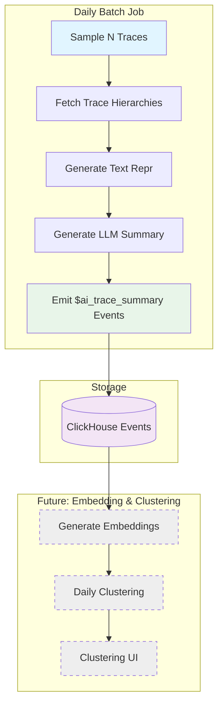

# Batch Trace Summarization

Automated daily job for generating summaries of N recent LLM traces, which will serve as inputs for embedding and clustering workflows.

## Overview

This workflow implements **Phase 2** of the clustering MVP (see [issue #40787](https://github.com/PostHog/posthog/issues/40787)):

1. **Sample N recent traces daily** - Use TracesQueryRunner to fetch traces from the past 7 days, reusing the same query logic as the frontend
2. **Summarize them** - Use text repr and LLM summarization to generate concise summaries
3. **Save as events** - Store generated summaries as `$ai_trace_summary` events in ClickHouse

The summaries will then be used as input for:

- **Phase 3**: Embedding generation
- **Phase 4**: Daily clustering jobs
- **Phase 5**: Clustering UI/reports

## Architecture



## Workflow Details

### Temporal Workflow

**Name**: `batch-trace-summarization`

**Inputs**:

- `team_id` (required): Team ID to process traces for
- `sample_size` (optional): Number of traces to sample (default: 1000)
- `batch_size` (optional): Batch size for processing (default: 100)
- `mode` (optional): Summary detail level - `minimal` or `detailed` (default: `minimal`)
- `start_date` (optional): Start of date range in RFC3339 format
- `end_date` (optional): End of date range in RFC3339 format

### Activities

1. **`sample_recent_traces_activity`**
   - Uses `TracesQueryRunner` to fetch recent traces (reuses frontend query logic)
   - Filters by date range (past 7 days by default, configurable via `SAMPLE_LOOKBACK_DAYS`)
   - Validates minimum threshold (100 traces required by default)
   - Returns empty list if insufficient traces (workflow handles gracefully)
   - Returns list of trace metadata (trace_id, timestamp, team_id)
   - Targets up to `sample_size` traces (default: 1000)

2. **`fetch_trace_hierarchy_activity`**
   - Uses `TraceQueryRunner` to fetch full trace data (reuses frontend query logic)
   - Creates 15-minute time window around trace timestamp to ensure capture
   - Converts `LLMTrace` format to text repr format
   - Returns trace metadata and hierarchy suitable for text repr

3. **`generate_summary_activity`**
   - Generates line-numbered text representation using existing formatters
   - Calls LLM summarization API
   - Returns `TraceSummary` with text_repr, summary, and metadata

4. **`emit_trace_summary_events_activity`**
   - Emits `$ai_trace_summary` events to ClickHouse
   - Includes batch run ID for tracking
   - Stores text repr, summary components, and metadata

### Output Events

Each trace gets a `$ai_trace_summary` event with properties:

```python
{
    "$ai_trace_id": "original_trace_id",
    "$ai_batch_run_id": "team_123_2025-01-15T12:00:00Z",
    "$ai_summary_mode": "minimal",  # or "detailed"
    "$ai_summary_title": "User authentication flow",
    "$ai_summary_text_repr": "L1: TRACE...\n",  # Full text representation
    "$ai_summary_flow_diagram": "graph TD; A-->B;",  # Mermaid diagram
    "$ai_summary_bullets": "[{\"text\": \"...\", \"line_refs\": \"L1-5\"}]",
    "$ai_summary_interesting_notes": "[{\"text\": \"...\", \"line_refs\": \"L10\"}]",
    "$ai_text_repr_length": 1234,
    "$ai_event_count": 5
}
```

## Usage

### Manual Trigger (Development/Testing)

```python
from temporalio.client import Client
from posthog.temporal.client import sync_connect

# Connect to Temporal
client = sync_connect()

# Trigger for a specific team
result = await client.execute_workflow(
    "batch-trace-summarization",
    ["123"],  # team_id
    id=f"batch-summarization-team-123-{datetime.now().isoformat()}",
    task_queue="llm-analytics-queue",
)

print(f"Summarized {result['summaries_generated']} traces")
```

### Scheduled Daily Job

Set up a Temporal Schedule to run daily:

```python
from temporalio.client import Schedule, ScheduleActionStartWorkflow, ScheduleSpec, ScheduleIntervalSpec
from datetime import timedelta

schedule = Schedule(
    action=ScheduleActionStartWorkflow(
        "batch-trace-summarization",
        ["123"],  # team_id
        id="batch-summarization-team-123",
        task_queue="llm-analytics-queue",
    ),
    spec=ScheduleSpec(
        intervals=[ScheduleIntervalSpec(every=timedelta(days=1))]
    ),
)

await client.create_schedule(
    id="batch-summarization-schedule-team-123",
    schedule=schedule,
)
```

### Configuration

Key constants in `constants.py`:

- `DEFAULT_SAMPLE_SIZE = 1000` - Number of traces to sample per day
- `DEFAULT_BATCH_SIZE = 100` - Batch size for parallel processing
- `DEFAULT_MODE = "minimal"` - Summary detail level

## Processing Flow

1. **Sampling** (< 5 min)
   - Query ClickHouse for N most recent traces with generations
   - Filter by date range (past 24 hours by default)

2. **Batch Processing** (variable, depends on N and LLM latency)
   - Process traces in batches of 100 (configurable)
   - For each trace:
     - Fetch full hierarchy from ClickHouse (~30s timeout)
     - Generate text representation (instant)
     - Call LLM for summarization (~1-5s per trace, 2min timeout)
   - Continue on individual failures (logged but don't fail batch)

3. **Storage** (< 1 min per batch)
   - Emit `$ai_trace_summary` events to ClickHouse
   - Batch writes for efficiency

## Error Handling

- **Individual trace failures**: Logged but don't fail the batch
- **Activity retries**: 2-3 retries with exponential backoff
- **Timeouts**:
  - Sampling: 5 minutes
  - Fetch hierarchy: 30 seconds
  - Generate summary: 2 minutes
  - Emit events: 1 minute

## Monitoring

Workflow outputs:

```json
{
  "batch_run_id": "team_123_2025-01-15T12:00:00Z",
  "traces_sampled": 1000,
  "summaries_generated": 987,  // Some may fail
  "events_emitted": 987,
  "duration_seconds": 1234.56
}
```

Check logs for:

- `"Starting batch trace summarization"` - Job started
- `"Processing batch"` - Batch progress
- `"Failed to generate summary for trace"` - Individual failures
- `"Batch trace summarization completed"` - Job finished with stats

## Cost Estimation

For `DEFAULT_SAMPLE_SIZE = 1000` traces per day:

- **LLM Calls**: 1000 summarization calls
- **Model**: `gpt-4-1106-preview` (from `SUMMARIZATION_MODEL`)
- **Token Usage** (estimated):
  - Input: ~2000 tokens/trace (text repr + prompt)
  - Output: ~500 tokens/trace (summary)
  - Total: ~2500 tokens/trace = 2.5M tokens/day
- **Cost** (at $0.01/1K input, $0.03/1K output):
  - Input: 2M tokens × $0.01/1K = $20/day
  - Output: 0.5M tokens × $0.03/1K = $15/day
  - **Total: ~$35/day per 1000 traces**

Adjust `sample_size` based on budget and data volume needs.

## Next Steps

After this workflow is in production:

1. **Phase 3: Embedding Pipeline** (see issue #40787)
   - Query `$ai_trace_summary` events without embeddings
   - Generate embeddings from summary text
   - Store in ClickHouse `document_embeddings` table

2. **Phase 4: Clustering Pipeline**
   - Daily KMeans clustering on embeddings
   - LLM-generated cluster names/descriptions
   - Store cluster metadata and assignments

3. **Phase 5: Clustering UI**
   - Display clusters in LLMA
   - Trace exploration within clusters
   - Property filters and dashboards

## Testing

Run tests:

```bash
pytest posthog/temporal/llm_analytics/trace_summarization/test_workflows.py -v
```

Test coverage:

- ✅ Trace sampling with various scenarios
- ✅ Hierarchy fetching and error handling
- ✅ Summary generation with mocked LLM calls
- ✅ Event emission and team validation
- ✅ Workflow input parsing

## Module Structure

The implementation is split into focused, single-responsibility modules:

**Core workflow:**

- `workflows.py` - Workflow orchestration (173 lines)
- `models.py` - Data models: `TraceSummary`, `BatchSummarizationInputs`
- `constants.py` - Configuration constants (timeouts, defaults, property names)

**Activity modules:**

- `sampling.py` - Trace sampling using `TracesQueryRunner` (85 lines)
- `fetching.py` - Trace fetching using `TraceQueryRunner` (79 lines)
- `summarization.py` - Text repr generation and LLM summarization (59 lines)
- `events.py` - Event emission to ClickHouse (82 lines)

**Dependencies (reused code):**

- `posthog/hogql_queries/ai/traces_query_runner.py` - Multi-trace query runner
- `posthog/hogql_queries/ai/trace_query_runner.py` - Single trace query runner
- `products/llm_analytics/backend/summarization/` - LLM summarization logic and schemas
- `products/llm_analytics/backend/text_repr/` - Text representation formatters

## References

- Main clustering issue: [#40787](https://github.com/PostHog/posthog/issues/40787)
- Summarization MVP: [#41010](https://github.com/PostHog/posthog/issues/41010)
- Text repr PR: https://github.com/PostHog/posthog/pull/41004
- Summarization backend PR: https://github.com/PostHog/posthog/pull/41006
