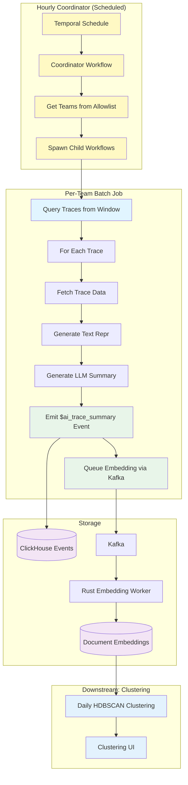

# Batch Trace Summarization

Automated workflow for generating summaries and embeddings of recent LLM traces from time windows (e.g., hourly), which will serve as inputs for clustering workflows.

## File Structure

```text
posthog/temporal/llm_analytics/trace_summarization/
├── __init__.py              # Module exports
├── workflow.py              # Per-team batch summarization workflow (main orchestrator)
├── coordinator.py           # Multi-team coordinator workflow (spawns child workflows)
├── schedule.py              # Temporal schedule configuration (hourly automatic runs)
├── models.py                # Data models (BatchSummarizationInputs, BatchSummarizationResult, CoordinatorResult, etc.)
├── constants.py             # Configuration constants (timeouts, defaults, limits, retry policies)
├── sampling.py              # Query traces from time window using TracesQueryRunner
├── summarization.py         # Fetch trace, generate text repr, call LLM API, emit events, and generate embeddings
├── test_workflow.py         # Workflow and activity tests
├── test_coordinator.py      # Coordinator workflow tests
└── README.md                # This file
```

## Overview

This workflow implements **Phases 2 & 3** of the clustering MVP (see [issue #40787](https://github.com/PostHog/posthog/issues/40787)):

This is an **hourly batch workflow** that:

1. Queries N recent traces from a time window (default: last 60 minutes)
2. For each trace:
   - Fetches full trace data from ClickHouse
   - Generates text representation and summary using LLM
   - Stores results as `$ai_trace_summary` events
   - Immediately generates and queues embedding via Kafka

> **Note**: The workflow uses Temporal best practices by passing only trace IDs through workflow history. Heavy data (full trace objects) is fetched directly within activities to avoid payload size limits.

The workflow runs on a schedule (e.g., hourly) and is **idempotent** - rerunning on the same time window will regenerate the same summaries and embeddings. The workflow uses Temporal workflow time (`temporalio.workflow.now()`) for all timestamp-based queries, ensuring deterministic behavior across retries.

The summaries and embeddings are used for:

- Daily clustering jobs (using embeddings for HDBSCAN clustering)
- Clustering UI and reports
- Semantic search across trace summaries

## Architecture



## Workflow Details

### Coordinator Workflow (Automatic)

**Name**: `batch-trace-summarization-coordinator`

**Inputs** (`BatchTraceSummarizationCoordinatorInputs`):

- `max_traces` (optional): Maximum traces to process per team (default: 100)
- `batch_size` (optional): Concurrent traces to process (default: 5)
- `mode` (optional): Summary detail level - `minimal` or `detailed` (default: `detailed`)
- `window_minutes` (optional): Time window to query in minutes (default: 60)
- `model` (optional): LLM model to use (default: gpt-4.1-mini)

**Flow**:

1. Captures workflow start time via `temporalio.workflow.now()` for idempotent queries
2. Gets list of allowed team IDs from `ALLOWED_TEAM_IDS` constant
3. Spawns child `batch-trace-summarization` workflow for each team
4. Aggregates results into typed `CoordinatorResult` with team/trace/summary counts

**Returns**: `CoordinatorResult` dataclass with fields:

- `teams_processed`: Total number of teams with trace activity
- `teams_failed`: Number of teams that failed to process
- `failed_team_ids`: List of team IDs that encountered errors
- `total_traces`: Sum of traces queried across all teams
- `total_summaries`: Sum of summaries generated across all teams

### Per-Team Workflow

**Name**: `batch-trace-summarization`

**Inputs** (`BatchSummarizationInputs`):

- `team_id` (required): Team ID to process traces for
- `max_traces` (optional): Maximum traces to process in window (default: 100)
- `batch_size` (optional): Concurrent traces to process (default: 5)
- `mode` (optional): Summary detail level - `minimal` or `detailed` (default: `detailed`)
- `window_minutes` (optional): Time window to query in minutes (default: 60)
- `model` (optional): LLM model to use (default: gpt-4.1-mini)
- `window_start` (optional): Explicit window start in RFC3339 format (overrides window_minutes)
- `window_end` (optional): Explicit window end in RFC3339 format (overrides window_minutes)

**Returns**: `BatchSummarizationResult` dataclass with fields:

- `batch_run_id`: Unique identifier for this batch run (format: `team_id_timestamp`)
- `metrics`: `BatchSummarizationMetrics` containing:
  - `traces_queried`: Number of traces fetched from window
  - `summaries_skipped`: Number skipped (e.g., text repr too large)
  - `summaries_failed`: Number that failed to generate
  - `summaries_generated`: Number successfully generated
  - `embedding_requests_succeeded`: Number of embedding requests successfully sent to Kafka
  - `embedding_requests_failed`: Number of embedding requests that failed to send
  - `duration_seconds`: Total workflow execution time

### Activities

1. **`query_traces_in_window_activity`**
   - Uses `TracesQueryRunner` to fetch traces from time window (reuses frontend query logic)
   - Queries from last N minutes (default: 60) or explicit window if provided
   - Enforces hard limit via `max_traces` parameter (default: 100)
   - Returns `list[str]` of trace IDs (randomly ordered for sampling)
   - Idempotent - same window returns same traces

2. **`generate_and_save_summary_activity`**
   - Uses `TraceQueryRunner` to fetch full trace data (uses window_start/window_end from workflow)
   - Generates line-numbered text representation using existing formatters
   - Skips traces with text repr exceeding `MAX_TEXT_REPR_LENGTH` (2M chars)
   - Calls LLM summarization API
   - Immediately emits `$ai_trace_summary` event to ClickHouse
   - Generates embedding inline and queues via Kafka (Rust worker processes asynchronously)
   - Returns `SummarizationActivityResult` with success/skipped status, embedding result, and metadata

### Output Events

Each trace gets a `$ai_trace_summary` event with properties:

```python
{
    "$ai_trace_id": "original_trace_id",
    "$ai_batch_run_id": "team_123_2025-01-15T12:00:00Z",
    "$ai_summary_mode": "detailed",  # or "minimal"
    "$ai_summary_title": "User authentication flow",
    "$ai_summary_flow_diagram": "graph TD; A-->B;",  # Mermaid diagram
    "$ai_summary_bullets": "[{\"text\": \"...\", \"line_refs\": \"L1-5\"}]",
    "$ai_summary_interesting_notes": "[{\"text\": \"...\", \"line_refs\": \"L10\"}]",
    "$ai_text_repr_length": 1234,  # Length of text repr (not stored, too large)
    "$ai_event_count": 5
}
```

## Usage

### Manual Trigger (Development/Testing)

**Using Temporal CLI:**

```bash
# Trigger for a specific team (minimal inputs)
# Use development-task-queue for local dev, llm-analytics-queue for production
temporal workflow start \
  --type batch-trace-summarization \
  --task-queue development-task-queue \
  --workflow-id "batch-summarization-team-1-$(date +%Y%m%d%H%M%S)" \
  --input '{"team_id": 1}'

# Trigger with custom parameters
temporal workflow start \
  --type batch-trace-summarization \
  --task-queue development-task-queue \
  --workflow-id "batch-summarization-team-1-$(date +%Y%m%d%H%M%S)" \
  --input '{"team_id": 1, "max_traces": 50, "window_minutes": 30, "mode": "detailed"}'

# Trigger coordinator (processes all teams)
temporal workflow start \
  --type batch-trace-summarization-coordinator \
  --task-queue development-task-queue \
  --workflow-id "batch-summarization-coordinator-$(date +%Y%m%d%H%M%S)" \
  --input '{}'

# Check workflow status
temporal workflow describe --workflow-id <workflow-id>

# View workflow result
temporal workflow show --workflow-id <workflow-id>
```

> **Note**: Local development uses `development-task-queue`. Production uses `llm-analytics-queue`.

**Using Python client:**

```python
from datetime import datetime
from temporalio.client import Client
from posthog.temporal.common.client import sync_connect
from posthog.temporal.llm_analytics.trace_summarization.models import BatchSummarizationInputs

# Connect to Temporal
client = sync_connect()

# Trigger for a specific team
inputs = BatchSummarizationInputs(team_id=123, max_traces=50, window_minutes=30)
result = client.execute_workflow(
    "batch-trace-summarization",
    inputs,
    id=f"batch-summarization-team-123-{datetime.now().isoformat()}",
    task_queue="llm-analytics-queue",
)

print(f"Summarized {result.metrics.summaries_generated} traces")
```

### Scheduled Execution (Automatic)

The batch trace summarization runs automatically via a coordinator workflow scheduled hourly.

The coordinator workflow (`batch-trace-summarization-coordinator`):

- Runs every hour via Temporal schedules (configured in `schedule.py`)
- Processes teams from the `ALLOWED_TEAM_IDS` allowlist
- Spawns a child workflow for each team to process their traces

The schedule is created automatically when Temporal starts.

You can verify the schedule is running:

```bash
# Check Temporal UI at http://localhost:8233
# Look for schedule: "batch-trace-summarization-schedule"
```

**Team allowlist:**

The workflow can be limited to specific teams via `ALLOWED_TEAM_IDS` in `constants.py`:

```python
ALLOWED_TEAM_IDS: list[int] = [
    1,  # Local development
    2,  # Internal PostHog project
    112495,  # Dogfooding project
]
```

- Non-empty list: Only specified teams will be processed by the coordinator
- Empty list (`[]`): No teams will be processed (coordinator skips)
- Manual triggers can still target any team regardless of allowlist

**Custom schedule for specific team:**

To create a separate schedule for a specific team:

```python
from temporalio.client import Schedule, ScheduleActionStartWorkflow, ScheduleSpec, ScheduleIntervalSpec
from datetime import timedelta
from posthog.temporal.llm_analytics.trace_summarization.models import BatchSummarizationInputs

# Create schedule for a team
schedule = Schedule(
    action=ScheduleActionStartWorkflow(
        "batch-trace-summarization",
        BatchSummarizationInputs(
            team_id=123,
            max_traces=100,  # Process up to 100 traces per hour
            window_minutes=60,  # Last 60 minutes
        ),
        id="batch-summarization-team-123",
        task_queue="general-purpose-queue",
    ),
    spec=ScheduleSpec(
        intervals=[ScheduleIntervalSpec(every=timedelta(hours=1))]
    ),
)

await client.create_schedule(
    id="batch-summarization-schedule-team-123",
    schedule=schedule,
)
```

The workflow is idempotent, so rerunning on the same window is safe.

### Configuration

Key constants in `constants.py`:

**Processing defaults:**

- `DEFAULT_MAX_TRACES_PER_WINDOW = 100` - Max traces to process per window (conservative for worst-case 30s/trace)
- `DEFAULT_BATCH_SIZE = 5` - Concurrent traces to process
- `DEFAULT_MODE = "detailed"` - Summary detail level (detailed provides more context for embeddings/clustering)
- `DEFAULT_WINDOW_MINUTES = 60` - Time window to query (matches schedule frequency)

**Timeouts:**

- `WORKFLOW_EXECUTION_TIMEOUT_MINUTES = 120` - Max time for single team workflow (2 hours)
- `SAMPLE_TIMEOUT_SECONDS = 300` - Timeout for trace sampling activity (5 minutes)
- `GENERATE_SUMMARY_TIMEOUT_SECONDS = 300` - Timeout for summary generation activity (5 minutes, increased for LLM API latency)

**Retry policies (centralized for consistency):**

- `SAMPLE_RETRY_POLICY` - Retry configuration for trace sampling activity (3 attempts)
- `SUMMARIZE_RETRY_POLICY` - Retry configuration for summary generation activity (2 attempts due to LLM cost)
- `COORDINATOR_CHILD_WORKFLOW_RETRY_POLICY` - Retry configuration for child workflows (2 attempts)

**Other:**

- `ALLOWED_TEAM_IDS` - Team allowlist for coordinator (empty list = no teams processed)
- `EVENT_NAME_TRACE_SUMMARY` - Event name for summary storage (`$ai_trace_summary`)
- `WORKFLOW_NAME` - Temporal workflow name (`batch-trace-summarization`)

## Processing Flow

1. **Query Window** (< 5 min)
   - Query ClickHouse for traces in time window (last N minutes)
   - Up to `max_traces` limit (default: 100)
   - Idempotent - same window returns same traces

2. **Batch Processing** (variable, depends on trace count and LLM latency)
   - Process traces with controlled concurrency using asyncio semaphore
   - Batch size controls max concurrent activities (default: 5)
   - For each trace (in parallel up to batch_size limit):
     - Fetch full hierarchy from ClickHouse
     - Generate text representation (instant)
     - Call LLM for summarization (~1-5s per trace, 5min timeout)
     - Immediately emit `$ai_trace_summary` event to ClickHouse
     - Generate embedding and queue via Kafka (Rust worker processes asynchronously)
   - Continue on individual failures (logged but don't fail workflow)
   - Embedding failures are tracked separately and don't fail the summary

## Error Handling

- **Individual trace failures**: Logged but don't fail the workflow (continue processing remaining traces)
- **Embedding failures**: Tracked separately per trace; don't fail the summary generation
- **Activity retries**: Configured via centralized retry policies in constants.py
  - Exponential backoff with configurable max attempts
  - Different policies for sampling, summarization, and coordinator activities
- **Activity-level timeouts**:
  - Sampling: 5 minutes (`SAMPLE_TIMEOUT_SECONDS`)
  - Generate summary + embedding: 5 minutes (`GENERATE_SUMMARY_TIMEOUT_SECONDS`)
- **Workflow-level timeouts**:
  - Single team workflow: 2 hours (`WORKFLOW_EXECUTION_TIMEOUT_MINUTES`)
  - Coordinator workflow: 2 hours (manual triggers only)

## Monitoring

### Per-Team Workflow Output

Returns `BatchSummarizationResult` with:

```json
{
  "batch_run_id": "team_123_2025-01-15T12:00:00Z",
  "metrics": {
    "traces_queried": 100,
    "summaries_skipped": 0,
    "summaries_failed": 2,
    "summaries_generated": 98,
    "embedding_requests_succeeded": 98,
    "embedding_requests_failed": 0,
    "duration_seconds": 315.23
  }
}
```

### Coordinator Workflow Output

Returns `CoordinatorResult` with:

```json
{
  "teams_processed": 5,
  "teams_failed": 0,
  "failed_team_ids": [],
  "total_traces": 450,
  "total_summaries": 447
}
```

Check logs for:

- `"Starting batch trace summarization"` - Job started
- `"Processing batch"` - Batch progress
- `"Failed to generate summary for trace"` - Individual failures
- `"Batch trace summarization completed"` - Job finished with stats

## Cost Estimation

For `DEFAULT_MAX_TRACES_PER_WINDOW = 100` traces per hour (2,400/day):

- **LLM Calls**: 100 traces/hour × 24 hours = 2,400 calls/day
- **Model**: `gpt-4.1-mini` (from `SUMMARIZATION_MODEL`)
- **Token Usage** (estimated):
  - Input: ~2000 tokens/trace (text repr + prompt)
  - Output: ~500 tokens/trace (summary)
  - Total: ~2500 tokens/trace = 6M tokens/day
- **Cost** (at $0.40/1M input, $1.60/1M output for gpt-4.1-mini):
  - Input: 4.8M tokens × $0.40/1M = $1.92/day
  - Output: 1.2M tokens × $1.60/1M = $1.92/day
  - **Total: ~$3.84/day per team (100 traces/hour)**

This provides a representative sample for clustering while keeping costs bounded and ensuring completion within the hourly window (worst case: 100 traces × 30s ≈ 58 minutes). The pipeline is designed to scale up by:

- Increasing `max_traces` if needed (with corresponding timeout adjustments)
- Processing in predictable batches for stable resource usage
- Feeding consistent volumes to downstream embedding and clustering workflows

## Downstream Use Cases

The summaries and embeddings produced by this workflow enable:

1. **Clustering Pipeline**
   - Daily HDBSCAN clustering on embeddings from `document_embeddings` table
   - LLM-generated cluster names and descriptions
   - Cluster metadata and trace assignments

2. **Clustering UI**
   - Cluster visualization in LLMA dashboard
   - Trace exploration within clusters
   - Property filters and cluster-based analytics

3. **Additional Applications**
   - Semantic search across trace summaries using embeddings
   - Anomaly detection by comparing new traces to cluster patterns
   - Automated issue detection from recurring error patterns

## Testing

Run tests:

```bash
# Run workflow tests
pytest posthog/temporal/llm_analytics/trace_summarization/test_workflow.py -v

# Run coordinator tests
pytest posthog/temporal/llm_analytics/trace_summarization/test_coordinator.py -v

# Run all trace summarization tests
pytest posthog/temporal/llm_analytics/trace_summarization/ -v
```

Test coverage:

- ✅ Trace window querying with various scenarios
- ✅ Hierarchy fetching and error handling
- ✅ Summary generation with mocked LLM calls
- ✅ Event emission and team validation
- ✅ Workflow input parsing
- ✅ Coordinator team allowlist retrieval
- ✅ Coordinator input parsing

## Module Structure

The implementation is split into focused, single-responsibility modules:

**Core workflows:**

- `workflow.py` - Per-team workflow orchestration (~175 lines)
  - Returns typed `BatchSummarizationResult` with comprehensive metrics
  - Uses asyncio semaphore for controlled concurrency
  - Passes workflow start time to embedding activity for efficient queries
- `coordinator.py` - Coordinator workflow for multi-team processing (~150 lines)
  - Returns typed `CoordinatorResult` with aggregated metrics
  - Uses allowlist for team discovery (avoids cross-team queries)
  - Spawns child workflows with proper retry policies
- `schedule.py` - Temporal schedule configuration for hourly runs (~50 lines)
- `models.py` - Type-safe data models (~110 lines)
  - `TraceSummary`, `BatchSummarizationInputs`, `BatchSummarizationResult`
  - `CoordinatorResult`, `BatchTraceSummarizationCoordinatorInputs`
- `constants.py` - Configuration constants (~60 lines)
  - Timeouts, defaults, property names, rendering types
  - Centralized retry policies for all activities and child workflows

**Activity modules:**

- `sampling.py` - Window-based trace querying using `TracesQueryRunner` (~50 lines)
- `summarization.py` - Trace fetching, text repr generation, LLM summarization, event emission, and embedding (~210 lines)
  - Generates and saves summaries atomically within single activity
  - Generates embeddings inline after saving summary
  - No large objects passed through workflow history

**Dependencies (reused code):**

- `posthog/hogql_queries/ai/traces_query_runner.py` - Multi-trace query runner
- `posthog/hogql_queries/ai/trace_query_runner.py` - Single trace query runner
- `products/llm_analytics/backend/summarization/` - LLM summarization logic and schemas
- `products/llm_analytics/backend/text_repr/` - Text representation formatters
- `ee/hogai/llm_traces_summaries/tools/embed_summaries.py` - Embedding infrastructure (Kafka producer)
- `products/error_tracking/backend/embedding.py` - Document embeddings table schema
- `rust/embedding-worker/` - Rust service for generating embeddings via OpenAI API

## References

- Clustering issue: [#40787](https://github.com/PostHog/posthog/issues/40787)
- Summarization MVP: [#41010](https://github.com/PostHog/posthog/issues/41010)
