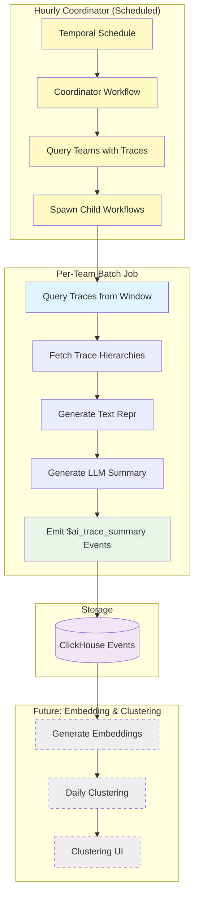

# Batch Trace Summarization

Automated workflow for generating summaries of recent LLM traces from time windows (e.g., hourly), which will serve as inputs for embedding and clustering workflows.

## Overview

This workflow implements **Phase 2** of the clustering MVP (see [issue #40787](https://github.com/PostHog/posthog/issues/40787)):

1. **Query traces from time window** - Process all traces from the last N minutes (default: 60), up to a maximum count (default: 500)
2. **Summarize them** - Use text repr and LLM summarization to generate concise summaries
3. **Save as events** - Store generated summaries as `$ai_trace_summary` events in ClickHouse

The workflow is designed to run on a schedule (e.g., hourly) and is **idempotent** - rerunning on the same time window will regenerate the same summaries.

The summaries will then be used as input for:

- **Phase 3**: Embedding generation
- **Phase 4**: Daily clustering jobs
- **Phase 5**: Clustering UI/reports

## Architecture



## Workflow Details

### Coordinator Workflow (Automatic)

**Name**: `batch-trace-summarization-coordinator`

**Inputs** (`BatchTraceSummarizationCoordinatorInputs`):

- `max_traces` (optional): Maximum traces to process per team (default: 500)
- `batch_size` (optional): Batch size for processing (default: 10)
- `mode` (optional): Summary detail level - `minimal` or `detailed` (default: `minimal`)
- `window_minutes` (optional): Time window to query in minutes (default: 60)
- `model` (optional): LLM model to use (default: gpt-5-mini)
- `lookback_hours` (optional): How far back to look for team activity (default: 24)

**Flow**:

1. Queries for teams with LLM trace events in the last 24 hours
2. Spawns child `batch-trace-summarization` workflow for each team
3. Aggregates results across all teams
4. Teams without traces are skipped efficiently

### Per-Team Workflow

**Name**: `batch-trace-summarization`

**Inputs** (`BatchSummarizationInputs`):

- `team_id` (required): Team ID to process traces for
- `max_traces` (optional): Maximum traces to process in window (default: 500)
- `batch_size` (optional): Batch size for processing (default: 10)
- `mode` (optional): Summary detail level - `minimal` or `detailed` (default: `minimal`)
- `window_minutes` (optional): Time window to query in minutes (default: 60)
- `model` (optional): LLM model to use (default: gpt-5-mini for better quality)
- `window_start` (optional): Explicit window start in RFC3339 format (overrides window_minutes)
- `window_end` (optional): Explicit window end in RFC3339 format (overrides window_minutes)

### Activities

1. **`query_traces_in_window_activity`**
   - Uses `TracesQueryRunner` to fetch traces from time window (reuses frontend query logic)
   - Queries from last N minutes (default: 60) or explicit window if provided
   - Enforces hard limit via `max_traces` parameter (default: 500)
   - Returns list of trace metadata (trace_id, timestamp, team_id)
   - Idempotent - same window returns same traces

2. **`fetch_trace_hierarchy_activity`**
   - Uses `TraceQueryRunner` to fetch full trace data (reuses frontend query logic)
   - Creates 15-minute time window around trace timestamp to ensure capture
   - Converts `LLMTrace` format to text repr format
   - Returns trace metadata and hierarchy suitable for text repr

3. **`generate_summary_activity`**
   - Generates line-numbered text representation using existing formatters
   - Calls LLM summarization API
   - Returns `TraceSummary` with text_repr, summary, and metadata

4. **`emit_trace_summary_events_activity`**
   - Emits `$ai_trace_summary` events to ClickHouse
   - Includes batch run ID for tracking
   - Stores text repr, summary components, and metadata

### Output Events

Each trace gets a `$ai_trace_summary` event with properties:

```python
{
    "$ai_trace_id": "original_trace_id",
    "$ai_batch_run_id": "team_123_2025-01-15T12:00:00Z",
    "$ai_summary_mode": "minimal",  # or "detailed"
    "$ai_summary_title": "User authentication flow",
    "$ai_summary_text_repr": "L1: TRACE...\n",  # Full text representation
    "$ai_summary_flow_diagram": "graph TD; A-->B;",  # Mermaid diagram
    "$ai_summary_bullets": "[{\"text\": \"...\", \"line_refs\": \"L1-5\"}]",
    "$ai_summary_interesting_notes": "[{\"text\": \"...\", \"line_refs\": \"L10\"}]",
    "$ai_text_repr_length": 1234,
    "$ai_event_count": 5
}
```

## Usage

### Manual Trigger (Development/Testing)

**Quick start using the helper script:**

```bash
# Start Django shell
python manage.py shell

# Import and run the trigger function
>>> from posthog.temporal.llm_analytics.trace_summarization.trigger_workflow import trigger_batch_summarization, find_teams_with_traces

# Find teams with trace data
>>> find_teams_with_traces()

# Trigger workflow for a team
>>> trigger_batch_summarization(team_id=1)

# Or with custom parameters
>>> trigger_batch_summarization(
...     team_id=1,
...     max_traces=50,
...     window_minutes=30,
...     mode="detailed"
... )
```

**Or use the Temporal client directly:**

```python
from temporalio.client import Client
from posthog.temporal.common.client import sync_connect

# Connect to Temporal
client = sync_connect()

# Trigger for a specific team
result = client.execute_workflow(
    "batch-trace-summarization",
    ["123"],  # team_id
    id=f"batch-summarization-team-123-{datetime.now().isoformat()}",
    task_queue="llm-analytics-queue",
)

print(f"Summarized {result['summaries_generated']} traces")
```

See `trigger_workflow.py` for more examples and helper functions.

### Scheduled Execution (Automatic)

**The batch trace summarization runs automatically via a coordinator workflow that is scheduled hourly.**

The coordinator workflow (`batch-trace-summarization-coordinator`):

- Runs every hour via Temporal schedules (configured in `schedule.py`)
- Automatically discovers teams with LLM trace activity in the last 24 hours
- Spawns a child workflow for each team to process their traces
- Teams without traces are skipped (no wasted compute)

**No manual setup is required** - the schedule is created automatically when Temporal starts.

You can verify the schedule is running:

```bash
# Check Temporal UI at http://localhost:8233
# Look for schedule: "batch-trace-summarization-schedule"
```

**Manual schedule for specific team (advanced):**

If you need to create a separate schedule for a specific team:

```python
from temporalio.client import Schedule, ScheduleActionStartWorkflow, ScheduleSpec, ScheduleIntervalSpec
from datetime import timedelta
from posthog.temporal.llm_analytics.trace_summarization.models import BatchSummarizationInputs

# Create schedule for a team
schedule = Schedule(
    action=ScheduleActionStartWorkflow(
        "batch-trace-summarization",
        BatchSummarizationInputs(
            team_id=123,
            max_traces=500,  # Process up to 500 traces per hour
            window_minutes=60,  # Last 60 minutes
        ),
        id="batch-summarization-team-123",
        task_queue="general-purpose-queue",
    ),
    spec=ScheduleSpec(
        intervals=[ScheduleIntervalSpec(every=timedelta(hours=1))]
    ),
)

await client.create_schedule(
    id="batch-summarization-schedule-team-123",
    schedule=schedule,
)
```

The workflow is idempotent, so rerunning on the same window is safe.

### Configuration

Key constants in `constants.py`:

- `DEFAULT_MAX_TRACES_PER_WINDOW = 500` - Max traces to process per window
- `DEFAULT_BATCH_SIZE = 10` - Batch size for processing
- `DEFAULT_MODE = "minimal"` - Summary detail level
- `DEFAULT_WINDOW_MINUTES = 60` - Time window to query (matches schedule frequency)
- `DEFAULT_WORKFLOW_MODEL = "gpt-5-mini"` - Default LLM model (slower but better quality than UI default)

## Processing Flow

1. **Query Window** (< 5 min)
   - Query ClickHouse for traces in time window (last N minutes)
   - Up to `max_traces` limit (default: 500)
   - Idempotent - same window returns same traces

2. **Batch Processing** (variable, depends on trace count and LLM latency)
   - Process traces in batches of 10 (configurable)
   - For each trace:
     - Fetch full hierarchy from ClickHouse (~30s timeout)
     - Generate text representation (instant)
     - Call LLM for summarization (~1-5s per trace, 2min timeout)
   - Continue on individual failures (logged but don't fail batch)

3. **Storage** (< 1 min per batch)
   - Emit `$ai_trace_summary` events to ClickHouse
   - Batch writes for efficiency
   - Events include `$ai_batch_run_id` for idempotency tracking

## Error Handling

- **Individual trace failures**: Logged but don't fail the batch
- **Activity retries**: 2-3 retries with exponential backoff
- **Timeouts**:
  - Sampling: 5 minutes
  - Fetch hierarchy: 30 seconds
  - Generate summary: 2 minutes
  - Emit events: 1 minute

## Monitoring

Workflow outputs:

```json
{
  "batch_run_id": "team_123_2025-01-15T12:00:00Z",
  "traces_queried": 500,
  "summaries_generated": 487,  // Some may fail
  "events_emitted": 487,
  "duration_seconds": 615.23
}
```

Check logs for:

- `"Starting batch trace summarization"` - Job started
- `"Processing batch"` - Batch progress
- `"Failed to generate summary for trace"` - Individual failures
- `"Batch trace summarization completed"` - Job finished with stats

## Cost Estimation

For `DEFAULT_MAX_TRACES_PER_WINDOW = 500` traces per hour (12,000/day):

- **LLM Calls**: 500 traces/hour × 24 hours = 12,000 calls/day
- **Model**: `gpt-5-mini` (from `DEFAULT_WORKFLOW_MODEL`)
- **Token Usage** (estimated):
  - Input: ~2000 tokens/trace (text repr + prompt)
  - Output: ~500 tokens/trace (summary)
  - Total: ~2500 tokens/trace = 30M tokens/day
- **Cost** (at $0.15/1M input, $0.60/1M output for gpt-4o-mini, adjust for actual gpt-5-mini pricing):
  - Input: 24M tokens × $0.15/1M = $3.60/day
  - Output: 6M tokens × $0.60/1M = $3.60/day
  - **Total: ~$7.20/day per team (500 traces/hour)**

This provides a representative sample for clustering while keeping costs bounded. The pipeline is designed to scale up by:

- Increasing `max_traces` if needed
- Processing in predictable batches for stable resource usage
- Feeding consistent volumes to downstream embedding and clustering workflows

## Next Steps

After this workflow is in production:

1. **Phase 3: Embedding Pipeline** (see issue #40787)
   - Query `$ai_trace_summary` events without embeddings
   - Generate embeddings from summary text
   - Store in ClickHouse `document_embeddings` table

2. **Phase 4: Clustering Pipeline**
   - Daily KMeans clustering on embeddings
   - LLM-generated cluster names/descriptions
   - Store cluster metadata and assignments

3. **Phase 5: Clustering UI**
   - Display clusters in LLMA
   - Trace exploration within clusters
   - Property filters and dashboards

## Testing

Run tests:

```bash
pytest posthog/temporal/llm_analytics/trace_summarization/test_workflow.py -v
```

Test coverage:

- ✅ Trace window querying with various scenarios
- ✅ Hierarchy fetching and error handling
- ✅ Summary generation with mocked LLM calls
- ✅ Event emission and team validation
- ✅ Workflow input parsing

## Module Structure

The implementation is split into focused, single-responsibility modules:

**Core workflows:**

- `workflow.py` - Per-team workflow orchestration (~180 lines)
- `coordinator.py` - Coordinator workflow for multi-team processing (~150 lines)
- `schedule.py` - Temporal schedule configuration for hourly runs (~40 lines)
- `models.py` - Data models: `TraceSummary`, `BatchSummarizationInputs`, `BatchTraceSummarizationCoordinatorInputs`
- `constants.py` - Configuration constants (timeouts, defaults, property names)

**Activity modules:**

- `sampling.py` - Window-based trace querying using `TracesQueryRunner` (~80 lines)
- `fetching.py` - Trace hierarchy fetching using `TraceQueryRunner` (~80 lines)
- `summarization.py` - Text repr generation and LLM summarization (~60 lines)
- `events.py` - Event emission to ClickHouse (~80 lines)

**Coordinator activities:**

- `coordinator.py:get_teams_with_recent_traces_activity` - Query teams with LLM activity

**Dependencies (reused code):**

- `posthog/hogql_queries/ai/traces_query_runner.py` - Multi-trace query runner
- `posthog/hogql_queries/ai/trace_query_runner.py` - Single trace query runner
- `products/llm_analytics/backend/summarization/` - LLM summarization logic and schemas
- `products/llm_analytics/backend/text_repr/` - Text representation formatters

## References

- Main clustering issue: [#40787](https://github.com/PostHog/posthog/issues/40787)
- Summarization MVP: [#41010](https://github.com/PostHog/posthog/issues/41010)
- Text repr PR: https://github.com/PostHog/posthog/pull/41004
- Summarization backend PR: https://github.com/PostHog/posthog/pull/41006
