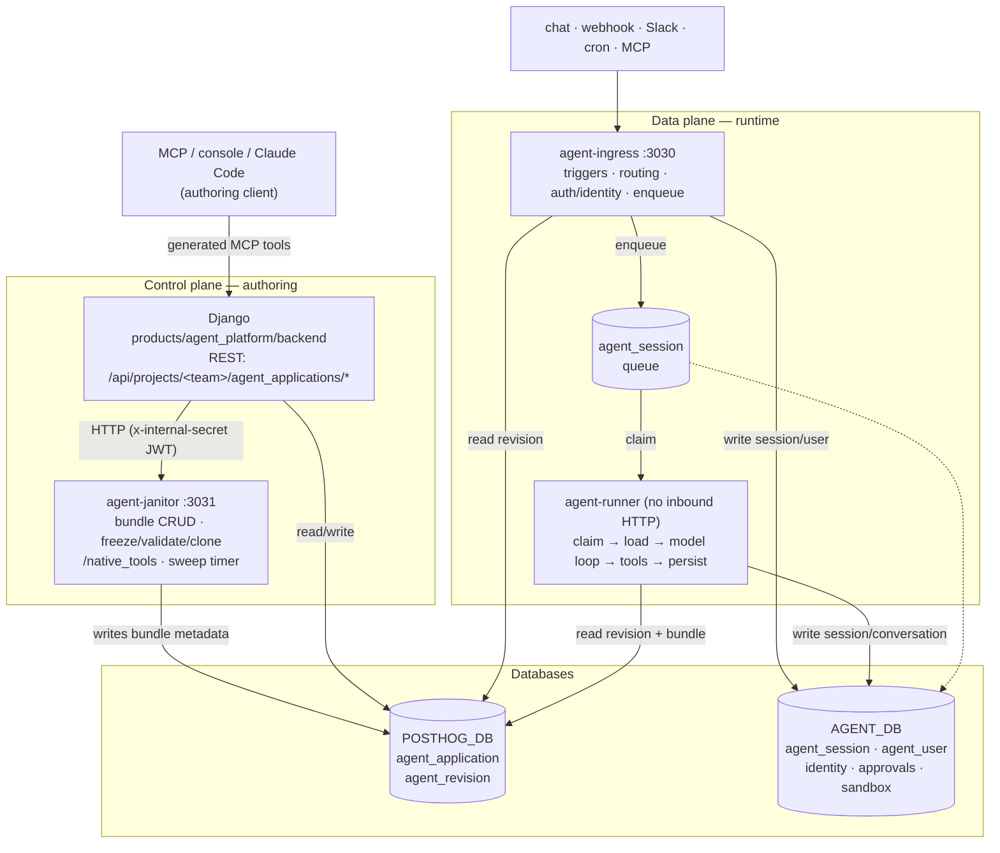
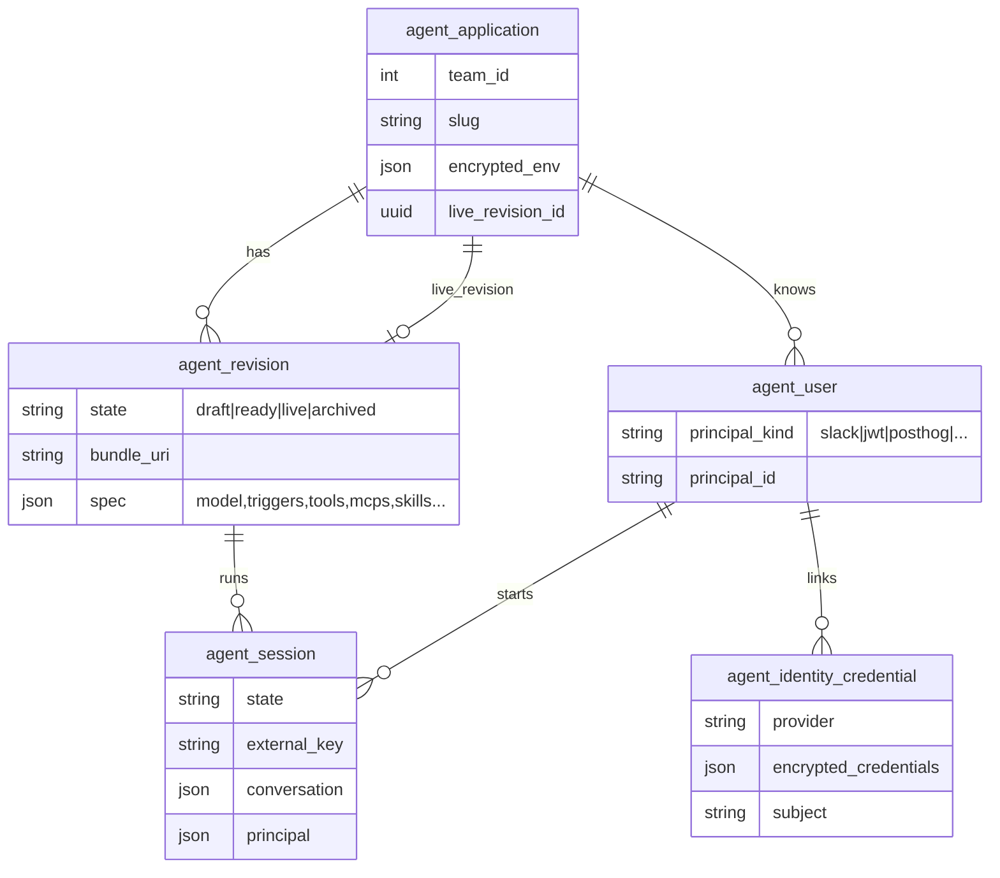
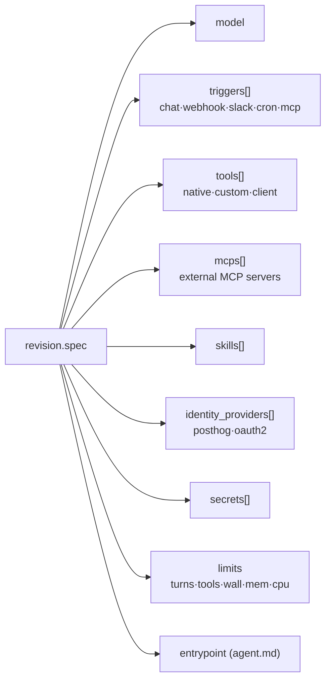
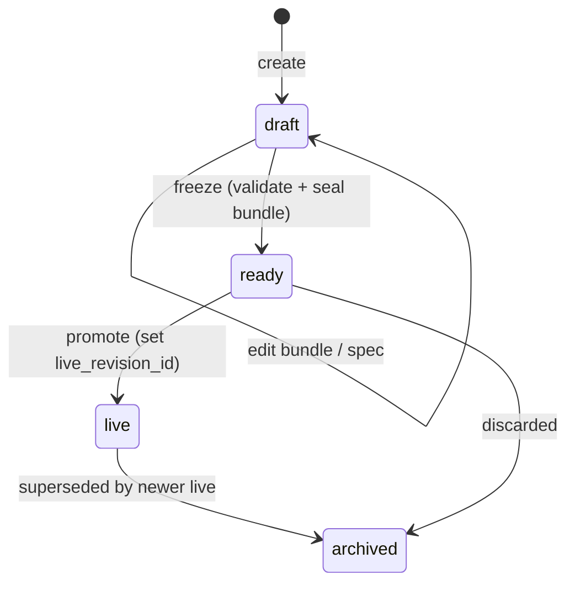

# Agent platform — architecture at a glance

The high-level shape of the v2 agent platform. Two companion docs go deeper:
[services.md](services.md) (what each process does) and
[identity-and-tools.md](identity-and-tools.md) (the request → identity → tools
flow). For hacking locally see [local-dev.md](local-dev.md).

## Two planes, one product

The platform splits into a **control plane** (author + promote agents) and a
**data plane** (run them). They share nothing but two databases.

**Rule of thumb:** authoring writes flow Django → janitor → `POSTHOG_DB`.
Runtime writes flow ingress/runner → `AGENT_DB`. Django **never** touches the
bundle filesystem or the runtime tables directly; the node side **never**
writes the application/revision tables.

## The data model

`agent_application` + `agent_revision` live in **POSTHOG_DB** (Django-owned).
Everything else lives in **AGENT_DB** (node-owned). In dev both are the same
local Postgres (`posthog` + `agent_runtime_queue`); in prod they are separate
physical instances.

## The spec is the contract

A revision's `spec` (JSONB) is the structural truth for an agent. It is
validated by `AgentSpecSchema` (zod) in
[agent-shared/src/spec/](../services/agent-shared/src/spec/) — Django validates
loosely and passes it through.

## Revision lifecycle

A revision is authored as a `draft`, frozen to `ready` (bundle becomes
immutable, spec validated server-side), promoted to `live` (the slug now
routes to it), and superseded revisions go `archived`. Ingress only enqueues
against the **live** revision.

## Supporting infrastructure

| Concern                         | Backed by                                                               | Interface (agent-shared)            |
| ------------------------------- | ----------------------------------------------------------------------- | ----------------------------------- |
| Session queue                   | Postgres (`AGENT_DB`)                                                   | `PgSessionQueue`                    |
| Bundle store                    | S3 (prod) / SeaweedFS (test)                                            | `BundleStore` / `S3BundleStore`     |
| Event bus (SSE fan-out)         | Redis                                                                   | `RedisSessionEventBus`              |
| Credential broker (per-session) | Redis / in-memory                                                       | `CredentialBroker`                  |
| Log sink                        | Kafka → ClickHouse                                                      | `KafkaLogSink`                      |
| Analytics                       | PostHog capture                                                         | `CaptureAnalyticsSink`              |
| Custom-tool sandbox             | Docker (local) / Modal (prod)                                           | `SandboxImpl` / `selectSandboxPool` |
| Model calls                     | direct providers or [ai-gateway](https://github.com/PostHog/ai-gateway) | pi-ai (`AGENT_USE_AI_GATEWAY`)      |

Every cross-process boundary is an **interface with exactly one prod impl**.
The e2e harness wires those same real classes against local services — no
in-memory fakes — so shape drift can't hide. The only test-time swap is the
in-process sandbox and pi-ai's `faux` model provider.
