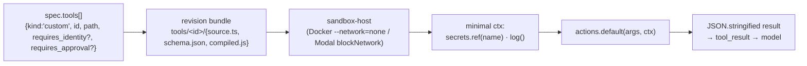

# Agent platform — custom tools

User-authored TypeScript an agent can call. Sandboxed per session, no
network, deliberately minimal `ctx`. The complement to native
`@posthog/*` tools and MCP servers — when you need behaviour the
platform doesn't ship and an external MCP server isn't the right
abstraction, write a custom tool.

See [identity-and-tools.md](identity-and-tools.md) for the broader tool
taxonomy and the credential model that the runner threads around custom
tools.

## The model



**The sandbox is the security boundary.** The sandbox runs a Node
process with no outbound network reach (`--network=none` in Docker,
`blockNetwork:true` on Modal) and dropped capabilities. In v1 a custom
tool computes over its `args`, optionally consults secret nonces, logs
what it did, and returns structured data the runner threads back to
the model. `fetch` exists but has nothing to reach; there is no
memory/table store access today.

Two things follow from where the boundary sits:

- **Custom tools are trusted code.** They are human-authored,
  reviewed, and versioned in the revision — the model only ever
  invokes them with arguments. The compile pipeline checks _shape_ (so
  authors get friendly errors at PUT time), not _reach_: there is
  deliberately no source-level allow/deny list of modules or
  constructs. What a tool can reach is an infrastructure decision made
  by the sandbox at runtime, not a lint pass over the source.
- **Egress composes rather than leaking into the model.** When an
  agent needs to call out today, wire a native tool with a host-pinned
  secret (see "Egress, identity, approval" below). The direction of
  travel is a _bridge_ — `ctx.native(...)` / `ctx.mcp(...)` accessors
  that let a custom tool invoke native tools and MCP connections from
  inside the sandbox, so an author can wrap allowlists, audit, and
  business rules around a capability without handing the model the raw
  tool. Not yet wired; see "Coming next."

## The contract

A custom tool source is a single TypeScript file whose default export
is a static object literal:

```ts
import type { CustomTool, CustomToolContext } from '@posthog/agent-shared'

type Args = { name: string; count: number }

export default {
  actions: {
    default: async (args: Args, ctx: CustomToolContext) => {
      ctx.log('info', 'greeting', { name: args.name })
      return { greeting: `hi ${args.name} × ${args.count}` }
    },
  },
} satisfies CustomTool
```

The shape is enforced by the AST check in
[`compile-custom-tools.ts`](../services/agent-janitor/src/compile-custom-tools.ts):
exactly one `export default`, an object literal, an `actions` property
that is itself an object literal, an `actions.default` that is a
function. Anything else gets a structured `ToolCompileError` at
`PUT /revisions/:id/tools/:id` — the bundle is left untouched.

The runner always dispatches `action: "default"` today (see
[`build-agent-tools.ts`](../services/agent-runner/src/loop/build-agent-tools.ts)'s
`makeCustomTool`). Additional named actions are allowed by the schema
but unused; treat them as helpers, not entry points.

Type imports (`import type { ... }`) are stripped by esbuild at compile
time, so nothing reaches the sandbox runtime. **Value imports from
`@posthog/agent-shared` or any other package will fail at runtime** —
the sandbox image doesn't bundle `node_modules`, only the compiled tool
source. Keep the body self-contained.

## The `ctx`

```ts
interface CustomToolContext {
  secrets: { ref(name: string): string }
  log(level: 'info' | 'warn' | 'error', msg: string, meta?: Record<string, unknown>): void
}
```

Mirrors `buildContext` in
[`agent-sandbox-host/src/dispatch.js`](../services/agent-sandbox-host/src/dispatch.js).
That file is the source of truth — if you're reading this and the
shape has drifted, the dispatch is authoritative.

**`ctx.secrets.ref(name)`** returns an opaque per-session nonce for a
secret declared in `spec.secrets[]`. The plaintext value never enters
the sandbox heap. Throws `secret not provisioned: <name>` if the name
isn't declared on the agent.

> **Nonces are placeholders today.** Runner-side nonce → value
> substitution at egress is not yet wired (see the note in
> `dispatch.js`). A returned nonce won't resolve to the real secret
> if you try to use it in a tool result that the runner forwards
> elsewhere. Practically: secrets aren't usable from custom tools in
> v1. Return values for the runner to act on instead.

**`ctx.log(level, msg, meta?)`** writes a structured line to the
sandbox container's stderr. Ops can read it via the container log
collector; the runner doesn't surface these in the session
conversation. Use it for tracing internal decisions, not for data the
model needs to read — return data from `actions.default` for that.

## The spec entry

```jsonc
{
  "tools": [
    {
      "kind": "custom",
      "id": "format-customer-record",
      "path": "tools/format-customer-record",
      "requires_identity": "posthog", // optional
      "requires_approval": true, // optional
      "approval_policy": {
        // optional, requires_approval=true
        "type": "principal",
        "ttl_ms": 86400000,
      },
    },
  ],
}
```

Authors don't typically write `tools[]` by hand — the typed-bundle
authoring path stamps it at freeze time from the bundle's
`tools/<id>/` contents. See
[`services/agent-janitor/src/api/typed-bundle.ts`](../services/agent-janitor/src/api/typed-bundle.ts)
for the full schema.

## Egress, identity, approval

In v1 custom tools don't make external calls — the sandbox has no
network. When an agent legitimately needs to call out — your CRM, a
webhook, a GitHub API — wire a native tool with a host-pinned secret:

```jsonc
{
  "tools": [{ "kind": "native", "id": "@posthog/http-request" }],
  "secrets": [{ "name": "CRM_TOKEN", "allowed_hosts": ["api.crm.example"] }],
}
```

The `allowed_hosts` binding is enforced at the egress hop — smokescreen
plus secret substitution in
[`http-request.v1.ts`](../services/agent-tools/src/tools/http-request.v1.ts).
A prompt-injected `${CRM_TOKEN}` against `attacker.com` refuses
substitution rather than leaking the credential.

**The bridge (direction, not yet wired).** Custom tools will reach
native tools and MCP connections through prefixed `ctx` accessors —
`ctx.native('@posthog/http-request', args)`,
`ctx.mcp('incident-io', 'create-incident', args)` — instead of raw
network. That keeps the composition property: the tool gets the
capability, the model doesn't. Bridge calls are code-facing, so they
won't inherit the model-facing `requires_approval` gates from the
spec; authors opt into gating specific sub-calls via a planned
`ctx.requestApproval(...)` primitive that reuses the existing approval
queue (same rows, same Slack/console/decision-API surfaces). The
runtime wiring — a call channel out of the one-shot sandbox dispatch —
lands in a follow-up.

**`requires_identity: "posthog"`** on a custom tool fires the identity
gate _before_ the sandbox runs. If the asker hasn't linked PostHog,
the model receives an `auth_required` result with an authorize link
and the tool body never executes. Currently the resolved credential
isn't threaded into the sandbox — the gate is a _precondition_ check
rather than a credential injection point. See the seam comment at
[`build-agent-tools.ts:440-441`](../services/agent-runner/src/loop/build-agent-tools.ts).

**`requires_approval: true`** routes every call through the approval
queue (`agent_tool_approval_request`). The model receives a synthetic
queued envelope and the session keeps going; when an approver decides
(via Slack, the decision API, or the console, depending on
`approval_policy.type`), the result is injected back into the session.
Approved decisions can include `edited_args`. See
[`approval.ts`](../services/agent-runner/src/loop/approval.ts).

## When to use a custom tool

Use a custom tool when:

- You need behaviour the platform doesn't ship and that doesn't fit an
  external MCP server (too small, too coupled to your data, too
  one-off).
- The work is computation: parsing, formatting, score calculation,
  state mutation against the agent's memory/table store (when those
  land for custom tools), shape translation between data the model
  produced and the structure your downstream tool needs.
- You want the agent to combine model output + your business rules
  before another tool acts on it.

Use `@posthog/http-request` or a dedicated native tool when:

- You need to call an external API. In v1 the sandbox has no network;
  until the bridge lands, egress goes through native tools.
- You need to send data anywhere outside the sandbox. Custom tools
  can't today — they return data to the runner.

Use an external MCP server when:

- You already have one (Linear, GitHub, Slack, your internal MCP).
- The capability is reusable across many agents.
- You want the server's owner — not the agent author — to manage
  versions and scopes.

## Authoring today

The janitor exposes per-tool authoring endpoints:

- `GET /revisions/:id/bundle` — read the draft revision's whole typed
  bundle (agent.md, skills, tools, spec slice).
- `PUT /revisions/:id/tools/:id` — body `{description, args_schema, source}`.
  AST check + esbuild compile run synchronously; 422 with structured
  diagnostics on failure; the bundle is untouched on failure.
- `POST /revisions/:id/tools/:id/dry_run` — body `{args, mock_secrets?}`.
  Executes the persisted `compiled.js` once in a single-shot sandbox
  with a stubbed `ctx`; returns `{ok, result?, error?, duration_ms}`.
  `mock_secrets` placeholders come back verbatim from
  `ctx.secrets.ref(name)` so the tool body runs deterministically.
- `DELETE /revisions/:id/tools/:id`.
- `POST /revisions/:id/validate` — pre-flight for entrypoint, tool ids,
  custom-tool files, skill paths.

Django proxies the per-tool endpoints in `AgentRevisionViewSet`
(`backend/presentation/views.py`), and the MCP authoring surface
includes `agent-applications-revisions-tools-update/destroy` generated
from those.

**Coming next** (work in flight): the native/MCP bridge
(`ctx.native` / `ctx.mcp`) with opt-in gating via
`ctx.requestApproval`; an in-app Tools tab on the revision editor;
capability summaries on each tool card; default-on approval for tools
that combine identity-gated access with mutable state.

**Deferred** (explicitly not in v1): nonce → value substitution at
egress (custom tools can prepare authenticated requests for the runner
to dispatch); a cross-agent custom-tool template registry; richer
sandbox capabilities (memory/table stores, identity-resolved
credentials). Re-evaluated after v1 usage signal.
