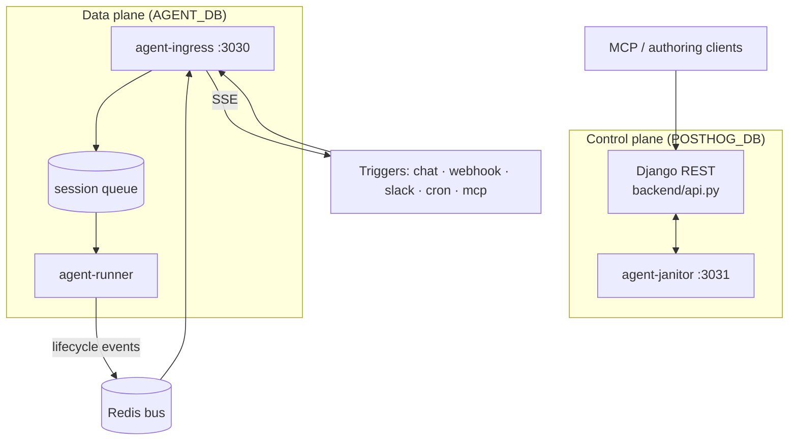
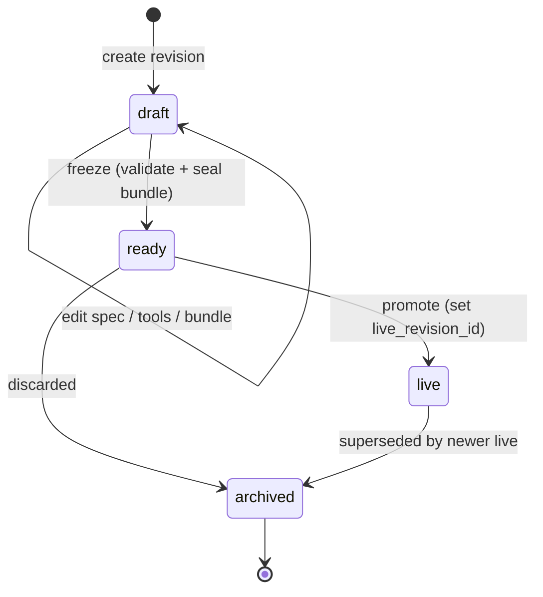
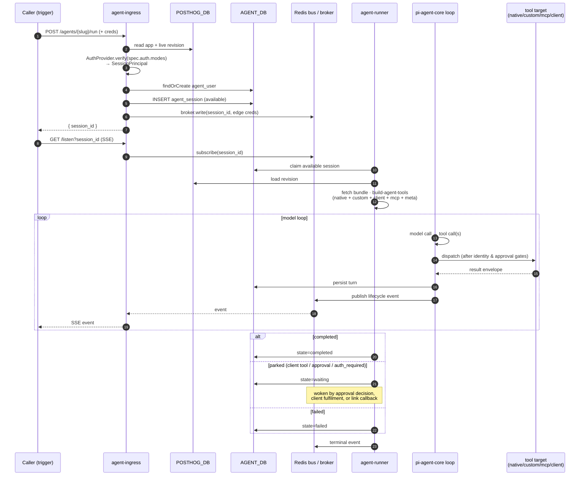
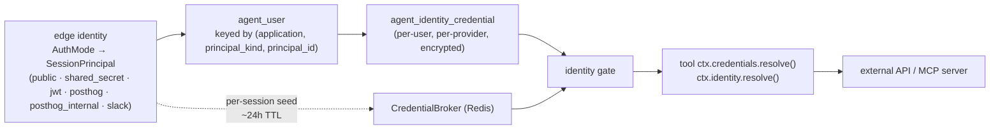
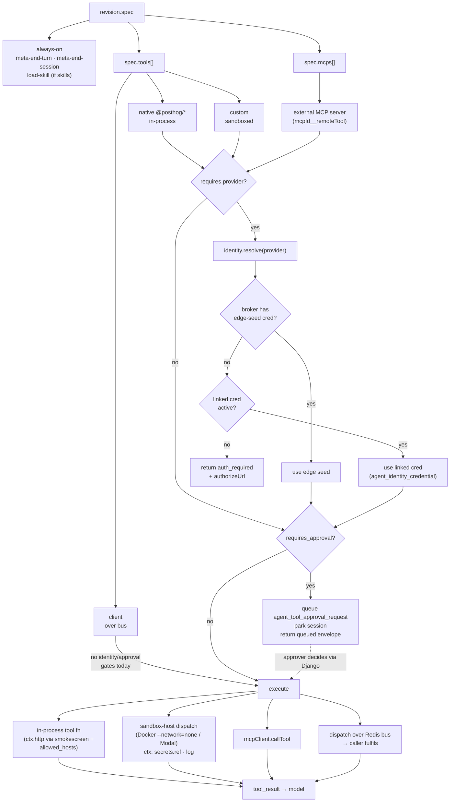

# Agent platform — full overview

A single-page tour of the whole platform: control plane + data plane, the spec,
the request lifecycle, identity & credentials, tool dispatch, and custom-tool
authoring. Companion to the targeted docs in this folder
([architecture.md](architecture.md), [services.md](services.md),
[identity-and-tools.md](identity-and-tools.md),
[custom-tools.md](custom-tools.md), [local-dev.md](local-dev.md)).

All diagrams below are [Mermaid](https://mermaid.js.org/) — GitHub, VS Code,
Obsidian, and most modern markdown renderers will draw them inline.

---

## 1. The comprehensive picture

Read in zones: **control plane** (authoring), **data plane** (runtime),
**shared libraries**, **databases & infra**, and the **tool dispatch** that
happens inside the runner loop.

```mermaid
flowchart TB
    %% ============ CLIENTS ============
    subgraph clients["Clients"]
        author["Authoring clients<br/>MCP · console · Claude Code"]
        runtime_client["Runtime clients<br/>chat · webhook · Slack · cron · MCP<br/>(ask tool)"]
        approver["Approver<br/>(team admin)"]
        linker["End user<br/>(OAuth link flow)"]
    end

    %% ============ CONTROL PLANE ============
    subgraph control["Control plane — authoring"]
        django["Django · products/agent_platform/backend<br/>REST /api/projects/&lt;team&gt;/agent_applications/*<br/>serializers · viewsets · encrypted_env<br/>janitor_client (x-internal-secret JWT)"]
        janitor["agent-janitor :3031<br/>bundle CRUD · freeze · validate · clone<br/>per-tool PUT/DELETE (AST + esbuild)<br/>/native_tools reflection<br/>sweep timer (stuck running/waiting)"]
        django -- "HTTP JWT<br/>aud=agent-janitor.rpc" --> janitor
    end

    %% ============ DATA PLANE ============
    subgraph data["Data plane — runtime"]
        ingress["agent-ingress :3030<br/>triggers: chat · webhook · slack · cron · mcp<br/>auth (AuthMode) → SessionPrincipal<br/>route slug → live revision<br/>enqueue + SSE /listen"]
        runner["agent-runner (no inbound HTTP)<br/>Worker.claim → load revision+bundle<br/>build-agent-tools → pi-agent-core loop<br/>dispatch · persist · publish events"]
    end

    %% ============ SHARED LIBS ============
    subgraph libs["Shared libraries (not deployed)"]
        shared["agent-shared<br/>AgentSpecSchema (zod) · principal types<br/>PgSessionQueue · BundleStore · CredentialBroker<br/>RedisSessionEventBus · KafkaLogSink"]
        tools_lib["agent-tools (@posthog/*)<br/>query · slack · http-request · memory<br/>table · load-skill · identity-* · meta"]
        sandbox_host["agent-sandbox-host<br/>dispatch.js · buildContext<br/>Docker (--network=none) / Modal (blockNetwork)"]
    end

    %% ============ TOOL DISPATCH ============
    subgraph dispatch["Tool dispatch (inside runner loop)"]
        meta_tools["meta (always-on)<br/>meta-end-turn · meta-end-session<br/>load-skill (if skills)"]
        native_disp["native<br/>in-process @posthog/*"]
        custom_disp["custom<br/>sandbox.invoke(toolId, args, nonces)"]
        client_disp["client<br/>dispatch over Redis bus → caller"]
        mcp_disp["mcp<br/>mcpClient.callTool (mcpId__remoteTool)"]
        approval_gate["approval gate<br/>requires_approval=true<br/>→ queue request + park"]
        identity_gate["identity gate<br/>requires.provider<br/>→ resolve or auth_required"]
    end

    %% ============ EXTERNAL ============
    subgraph external["External"]
        ext_mcp["External MCP servers<br/>(spec.mcps[])"]
        ext_api["External APIs<br/>via ctx.http + smokescreen<br/>allowed_hosts enforced"]
        ai_gw["pi-ai / ai-gateway<br/>(model providers)"]
        oauth_ext["OAuth providers<br/>PostHog · GitHub · Linear · …"]
    end

    %% ============ DATABASES & INFRA ============
    subgraph dbs["Databases"]
        pgdb[("POSTHOG_DB<br/>agent_application<br/>agent_revision")]
        agentdb[("AGENT_DB<br/>agent_session · agent_user<br/>agent_identity_credential<br/>agent_identity_link_state<br/>agent_tool_approval_request<br/>agent_sandbox_instance")]
    end

    subgraph infra["Supporting infra"]
        bundles[("Bundle store<br/>S3 (prod) · SeaweedFS (test)")]
        redis[("Redis<br/>session event bus<br/>CredentialBroker (~24h TTL)")]
        kafka[("Kafka → ClickHouse<br/>structured logs")]
        ph_capture["PostHog capture<br/>analytics"]
    end

    %% ============ EDGES — authoring ============
    author -->|generated MCP tools + REST| django
    django -- "rw application/revision" --> pgdb
    janitor -- "bundle meta" --> pgdb
    janitor -- "bundle CRUD" --> bundles
    janitor -- "sweep: requeue/fail" --> agentdb

    %% ============ EDGES — runtime ingress path ============
    runtime_client -->|POST /agents/&lt;slug&gt;/run<br/>GET /listen SSE| ingress
    ingress -- "read live revision" --> pgdb
    ingress -- "findOrCreate agent_user<br/>enqueue agent_session" --> agentdb
    ingress -- "broker.write(session_id, creds)" --> redis
    ingress -- "subscribe(session_id)" --> redis

    %% ============ EDGES — runner path ============
    agentdb -. "claim available session" .-> runner
    runner -- "read revision + bundle" --> pgdb
    runner -- "fetch bundle" --> bundles
    runner -- "persist conversation/outcome" --> agentdb
    runner -- "publish lifecycle events" --> redis
    runner -- "structured logs" --> kafka
    runner -- "capture" --> ph_capture
    runner -- "model calls" --> ai_gw

    %% ============ EDGES — libs wired into services ============
    shared --- django
    shared --- ingress
    shared --- runner
    shared --- janitor
    tools_lib --- runner
    sandbox_host --- runner

    %% ============ EDGES — loop dispatch ============
    runner --> meta_tools
    runner --> identity_gate
    runner --> approval_gate
    identity_gate --> native_disp
    identity_gate --> custom_disp
    identity_gate --> mcp_disp
    approval_gate -. "queued envelope" .-> runner
    approval_gate -- "agent_tool_approval_request" --> agentdb
    approver -- "decide (allow_edit)" --> django
    django -- "wake session" --> runner

    native_disp --> tools_lib
    custom_disp --> sandbox_host
    client_disp --> redis
    redis -- "client tool fulfilment" --> runtime_client

    %% ============ EDGES — external ============
    mcp_disp --> ext_mcp
    tools_lib -- "ctx.http (proxied)" --> ext_api
    sandbox_host -. "no network<br/>(--network=none)" .-x ext_api

    %% ============ EDGES — identity & linked creds ============
    linker -->|OAuth callback| ingress
    identity_gate -- "get(agent_user, provider)" --> agentdb
    identity_gate -.->|link_required + authorizeUrl| runtime_client
    runtime_client -.-> oauth_ext
    oauth_ext -.->|tokens| agentdb

    %% ============ SSE fan-out back ============
    redis -. "session events" .-> ingress
    ingress -. "SSE stream" .-> runtime_client
```

---

## 2. System topology + revision lifecycle

Two planes, one product. They share **two databases** and nothing else.

A revision is authored as a `draft`, frozen to `ready` (bundle immutable, spec
validated server-side), promoted to `live` (the slug now routes to it), and
superseded revisions go `archived`. **Ingress only enqueues against the live
revision.**

---

## 3. Runtime request flow — trigger to result

A trigger arrives at ingress, which authenticates and enqueues a session row.
The runner claims it asynchronously, runs the model loop, and streams lifecycle
events back over Redis so `/listen` (SSE) can tail them.

---

## 4. Identity, credentials, tool dispatch

There are **two distinct credential axes** — keep them separate in your head:

- **Edge identity** — who is calling the agent right now (the `AuthMode`).
  Produces a `SessionPrincipal` and, for some modes, a short-lived per-session
  credential held in the `CredentialBroker` (Redis, ~24h TTL).
- **Linked identity** — who that caller is on some external system (GitHub,
  Linear, PostHog). A durable, per-`agent_user` OAuth link stored encrypted in
  `agent_identity_credential`.

The runner assembles one `AgentTool[]` for the model from four sources, then
gates every call through identity-resolution and approval before dispatch:

### Auth modes at a glance

| Use case                                             | `AuthMode`         | Principal                                          | Per-session credential |
| ---------------------------------------------------- | ------------------ | -------------------------------------------------- | ---------------------- |
| Single upstream integration (Stripe, GitHub webhook) | `shared_secret`    | one per agent (`team_id` only)                     | none                   |
| Embedded / multi-tenant chat, per-caller isolation   | `jwt`              | `sub` + `claims` (upstream-signed)                 | `self` (the JWT)       |
| A PostHog user calling their own agent               | `posthog`          | the PostHog user (validated via `/api/users/@me/`) | `posthog_api` bearer   |
| PostHog backend → ingress, server-to-server          | `posthog_internal` | the platform itself                                | none                   |
| Genuinely public surface                             | `public`           | anonymous (opt-in `acknowledge_public_exposure`)   | none                   |

---

## 5. Custom-tool authoring & runtime

User-authored TypeScript an agent can call. Sandboxed per session,
**deliberately no network**. Authoring goes through Django → janitor; runtime
goes through the runner → sandbox-host.

```mermaid
flowchart LR
    subgraph A["Authoring"]
        src["tools/&lt;id&gt;/source.ts<br/>default export<br/>{ actions: { default(args, ctx) } }"]
        put["PUT /revisions/:id/tools/:id<br/>(via Django → janitor)"]
        ast["compile-custom-tools.ts<br/>AST check + esbuild"]
        bundle[("revision bundle<br/>tools/&lt;id&gt;/source.ts<br/>schema.json · compiled.js")]
        freeze["POST /revisions/:id/freeze<br/>(stamps spec.tools[])"]
        src --> put --> ast --> bundle --> freeze
    end

    subgraph R["Runtime"]
        load["runner: load bundle for live revision"]
        build["build-agent-tools makeCustomTool"]
        invoke["sandbox.invoke(toolId, args, nonces)"]
        host["agent-sandbox-host<br/>Docker --network=none / Modal blockNetwork"]
        ctx["minimal ctx:<br/>secrets.ref(name) · log()"]
        action["actions.default(args, ctx)"]
        result["JSON-stringified result → model"]
        load --> build --> invoke --> host --> ctx --> action --> result
    end
    freeze -. live revision .-> load
```

**Key invariants worth remembering:**

- Custom tools have **no outbound network** (`--network=none` / `blockNetwork`).
  When egress is needed, wire a native tool (e.g. `@posthog/http-request`) with
  a host-pinned secret — `smokescreen` + `allowed_hosts` enforce the
  destination at the boundary.
- `ctx.secrets.ref(name)` returns an **opaque nonce**, not the plaintext. The
  runner-side nonce → value substitution at egress is not yet wired in v1.
- The `identity gate` runs **before** the sandbox for `requires_identity` —
  it's a precondition check; the resolved credential isn't currently threaded
  into the sandbox.

---

## Reading order

If you're new to the platform and want the full picture in narrative form:

1. [architecture.md](architecture.md) — the two-plane shape and data model.
2. [services.md](services.md) — what each process owns.
3. [identity-and-tools.md](identity-and-tools.md) — request → identity → tool flow.
4. [custom-tools.md](custom-tools.md) — the author-side custom-tool contract.
5. [local-dev.md](local-dev.md) — running it all locally.
