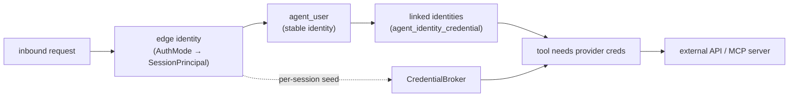
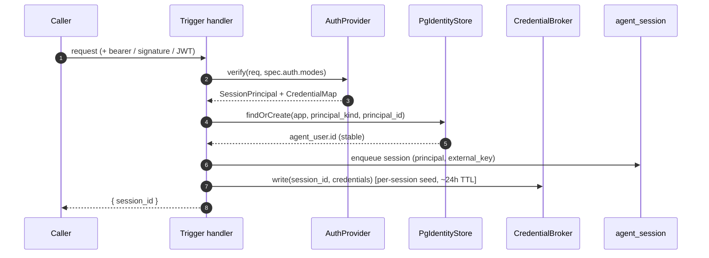
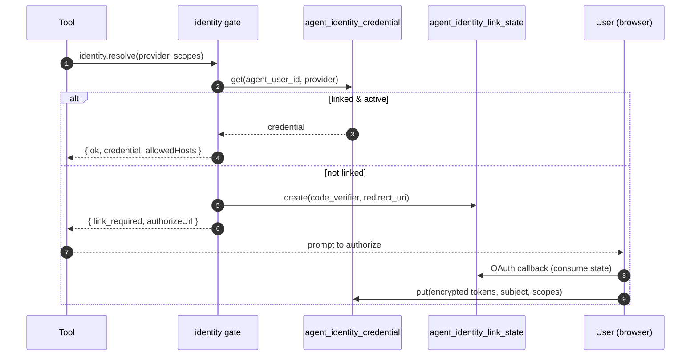
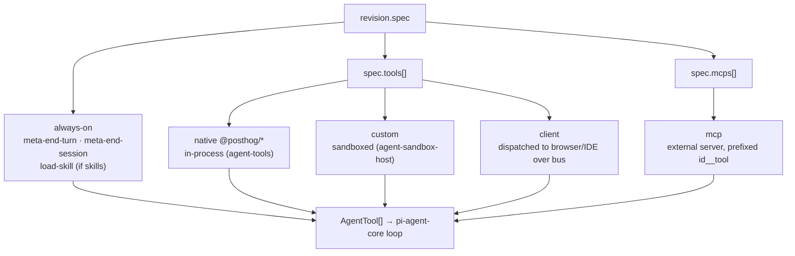
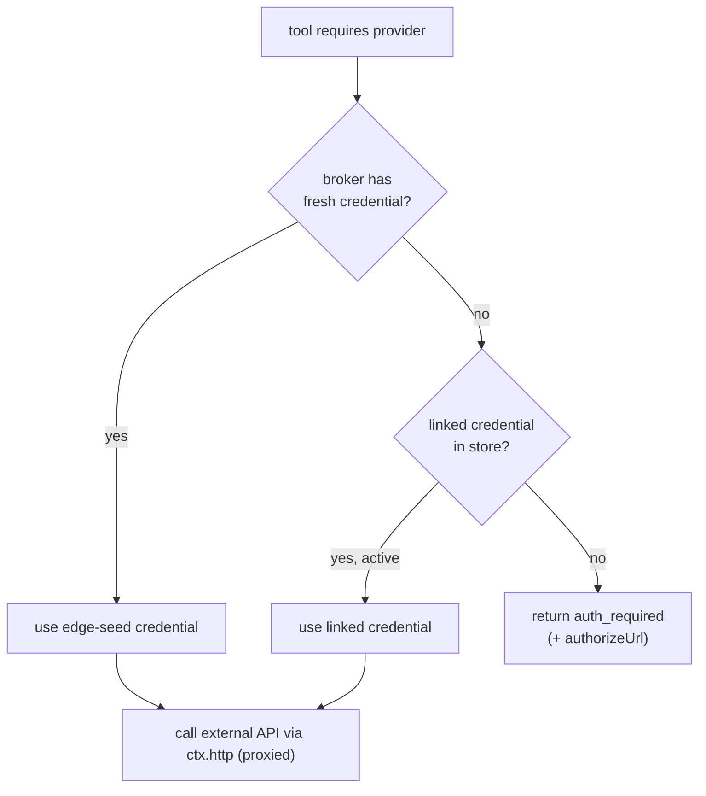
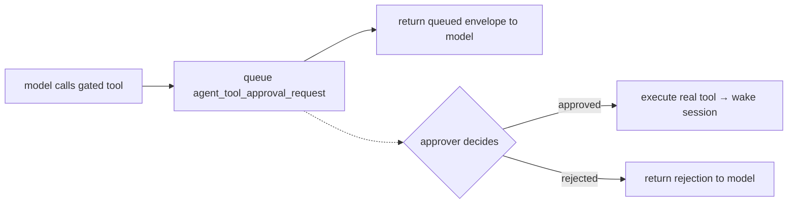
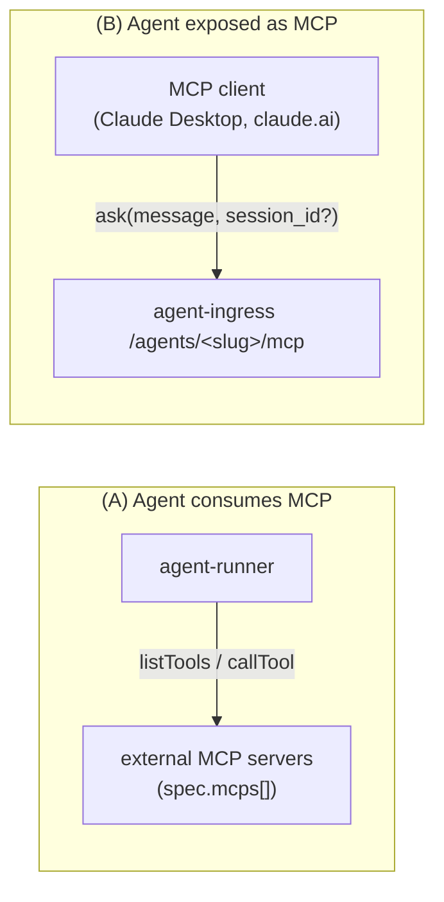

# Agent platform — identity, credentials & tools

How a request becomes an authenticated principal, how that principal links to
external identities, and how tools (native, custom, MCP) get the credentials
they need. See [architecture.md](architecture.md) and [services.md](services.md)
for the surrounding structure.

There are **two distinct credential axes** — keep them separate in your head:

- **Edge identity** — _who is calling the agent right now_ (the `AuthMode`).
  Produces a `SessionPrincipal` and, for some modes, a short-lived per-session
  credential.
- **Linked identity** — _who that caller is on some external system_ (GitHub,
  Linear, PostHog). A durable, per-user OAuth link the agent acts as when a
  tool needs it.

## Edge identity: the five auth modes

Each trigger with an `AuthConfig` accepts a list of `AuthMode`s; first
successful match wins. The mode chosen _is_ the trust model — you can't fake
one mode's isolation on top of another.

| Use case                                             | `AuthMode`         | Principal                                          | Per-session credential |
| ---------------------------------------------------- | ------------------ | -------------------------------------------------- | ---------------------- |
| Single upstream integration (Stripe, GitHub webhook) | `shared_secret`    | one per agent (`team_id` only)                     | none                   |
| Embedded / multi-tenant chat, per-caller isolation   | `jwt`              | `sub` + `claims` (upstream-signed)                 | `self` (the JWT)       |
| A PostHog user calling their own agent               | `posthog`          | the PostHog user (validated via `/api/users/@me/`) | `posthog_api` bearer   |
| PostHog backend → ingress, server-to-server          | `posthog_internal` | the platform itself                                | none                   |
| Genuinely public surface                             | `public`           | anonymous (opt-in `acknowledge_public_exposure`)   | none                   |

`SessionPrincipal` is a discriminated union (`anonymous · posthog · jwt ·
slack · posthog_internal · shared_secret · service`) defined in
[agent-shared/src/spec/spec.ts](../services/agent-shared/src/spec/spec.ts).

> **`shared_secret` is single-principal by design.** Every holder of the secret
> is the _same_ principal; `x-external-key` is a routing tag, **not** a
> credential. Per-caller isolation is `jwt`'s job. (We tried adding a
> self-asserted caller header twice and reverted both — re-introducing it needs
> a threat-model write-up.)

`principalsMatch(stored, incoming)` decides whether an inbound request may
resume/append to an existing session: Slack matches on `(workspace_id,
slack_user_id)`, JWT on `sub`, posthog on `(user_id, team_id)`, shared_secret
on `team_id`.

## From request to a running session

The **principal** is stored on the session row; the **agent_user** is the
durable identity behind it (keyed by `application_id · principal_kind ·
principal_id`); the **CredentialBroker** holds the short-lived edge credential
(e.g. the PostHog bearer the caller presented) keyed by `session_id`.

## Linked identities

A principal (say a Slack user) can act as themselves on external systems once
they've **linked**. Linking is an OAuth dance whose transient state lives in
`agent_identity_link_state` and whose durable result lives in
`agent_identity_credential` (encrypted at rest, per `agent_user` per provider).

Providers are declared in `spec.identity_providers[]` (`kind: posthog` or
`oauth2`, `binding: principal` (per-asker, default) or `agent`). Identity-
establishing providers (e.g. PostHog OAuth) record a `subject` — the proven
external identity — which is how a Slack user gets bridged to "their PostHog
person".

## The tool taxonomy

The runner assembles one `AgentTool[]` for the model from four sources, in
[agent-runner/src/loop/build-agent-tools.ts](../services/agent-runner/src/loop/build-agent-tools.ts):

| Kind       | Sourced from                        | Executed                              | Notes                                                                                |
| ---------- | ----------------------------------- | ------------------------------------- | ------------------------------------------------------------------------------------ |
| **native** | `@posthog/*` registry (agent-tools) | in the runner process                 | `@posthog/query`, `@posthog/slack-*`, `@posthog/http-request`, memory/table tools, … |
| **meta**   | always-on                           | intercepted, never `run()`            | control-flow: `end-turn`, `end-session`, `emit-event`                                |
| **custom** | revision bundle (`tools/<id>/`)     | in a **sandbox** (Docker/Modal)       | author code; secrets injected via nonce at the boundary                              |
| **client** | `spec.tools[] kind:client`          | dispatched to the caller over the bus | browser/IDE fulfils it; may park the session                                         |
| **mcp**    | `spec.mcps[]`                       | remote MCP server over HTTP           | model sees `<mcpId>__<remoteTool>`                                                   |

Each native tool's schema may declare `requires.provider` (`{ id, scopes }`);
that's the hook the identity gate uses to resolve a credential **before** the
tool runs. If resolution needs a link, the model gets an `auth_required` result
instead of the tool failing.

### What a tool receives — `ToolContext`

Threaded through to every tool: `teamId · applicationId · sessionId`,
`secret(name)` (decrypted `encrypted_env`),
`credentials.resolve(target)` (the per-session broker), `identity.resolve(provider)`
(linked-identity gate), `resolvedIdentities` (pre-resolved for gated tools),
`memoryStore` / `tabularStore`, and `http` (the proxy-bound `HttpClient` — the
only outbound path agent-influenced code may take).

## Tool credential resolution

When a tool needs a provider credential, the gate checks the **edge seed
first** (the per-session broker — e.g. the bearer the caller presented), then
falls back to the **persistent linked credential**, and only then asks the user
to link:

## Approval gating

Any tool ref (native / custom / mcp) can set `requires_approval` with an
`approval_policy` (`approvers`, `allow_edit`, `ttl_ms`). A gated call doesn't
execute — it writes an `agent_tool_approval_request` row and returns a synthetic
"queued" envelope the model can read. The janitor/approver decides out of band;
on approval the runner executes the real tool and wakes the session with the
result.

Open (queued) requests are capped per session by
`spec.limits.max_open_approvals` (default 10).
Args-hash dedupe collapses identical re-asks onto their existing row without consuming budget,
but a model looping on a gated tool with distinct args would otherwise flood approvers —
one Slack post per queued row.
At the cap, further gated calls return a synthetic `approval_budget_exhausted` error to the model instead of queueing;
decisions and TTL expiry free budget.

## The two MCP directions

MCP shows up on **both** sides of an agent — don't conflate them:

- **(A) Consuming** — `spec.mcps[]` servers are opened at session start (in
  parallel, partial-failure tolerated), their tools listed and exposed to the
  loop as `<mcpId>__<remoteTool>`. Auth per server is an `integration` (team
  OAuth bearer, host-validated), a `provider` (per-asker linked identity), or
  `secrets[]` substituted into the URL/headers.
- **(B) Exposing** — ingress also serves the agent itself as an MCP server with
  a single `ask` tool, so an MCP client can talk to a deployed agent.
  Separately, the **Django authoring REST API** is generated into MCP tools
  (`agent-applications-*`) so an authoring client can create/edit/promote
  agents, plus `agent-applications-invoke` / `agent-applications-send` /
  `agent-applications-listen` to talk to a live agent (see [local-dev.md](local-dev.md)).
