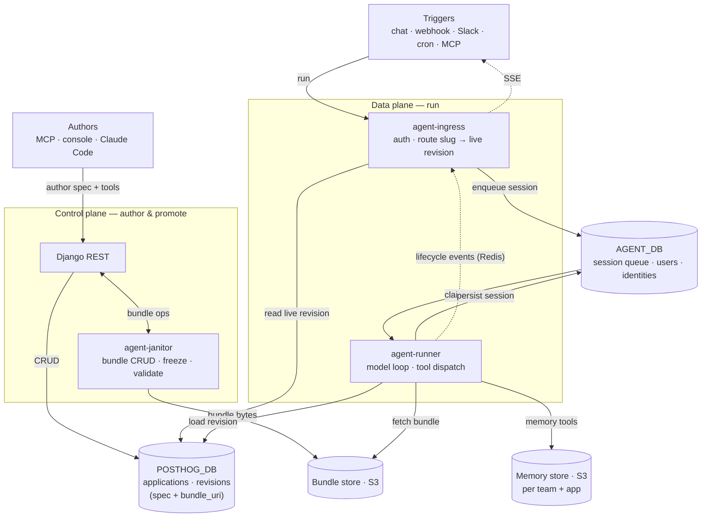

# Agent platform — overview

The 30-second map. One diagram, the whole platform.
For the annotated single-page tour see [full-overview.md](full-overview.md);
for the data model and lifecycle see [architecture.md](architecture.md).

The platform is two halves that share two databases and nothing else:
a **control plane** that authors and promotes agents, and a **data plane**
that runs them.

The whole flow in one breath:

1. **Author** an agent through Django (spec + tools); the janitor seals its
   bundle into the store and Django records the revision in `POSTHOG_DB`.
2. **Promote** a revision to `live` — the slug now routes to it.
3. A **trigger** hits ingress, which authenticates, resolves the live revision,
   and enqueues a session into `AGENT_DB`.
4. The **runner** claims the session, loads the revision + bundle, runs the
   model loop dispatching tools, and persists the result — streaming lifecycle
   events back to the caller over Redis (SSE).

Read next: [architecture.md](architecture.md) for the data model and revision
lifecycle, then the targeted docs listed in the [README](README.md).
