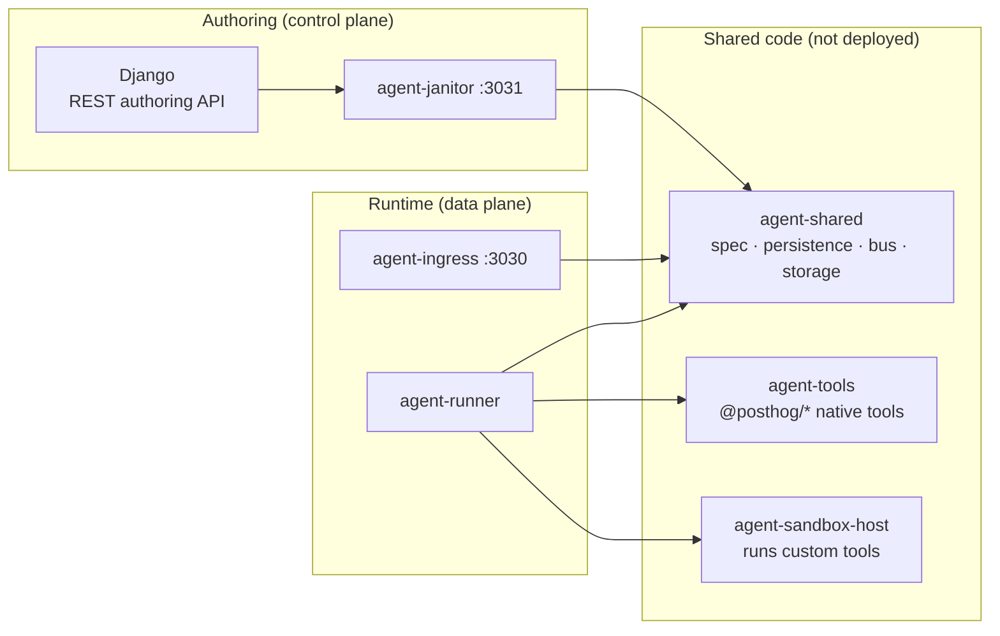
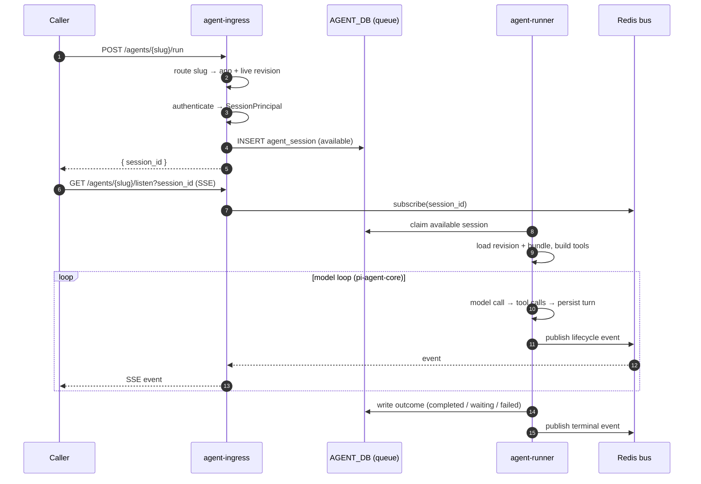
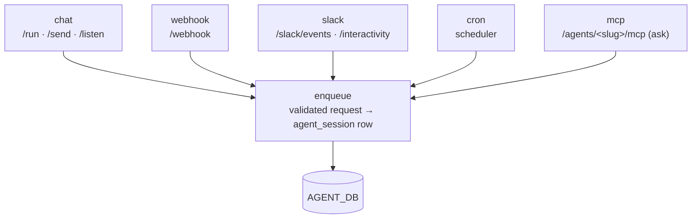
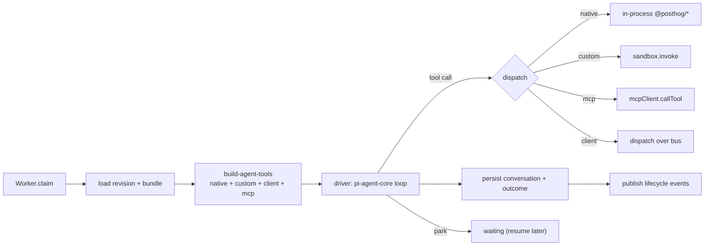
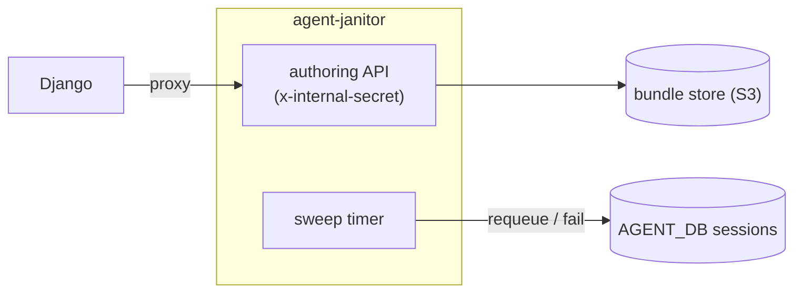

# Agent platform — the services

What each process owns and how they hand off. Start with
[architecture.md](architecture.md) for the big picture; this doc zooms into the
moving parts. Source for each lives under
[products/agent_platform/services/](../services/).

## Who does what

| Service                   | Inbound                              | Owns                                                                             | Touches DB                                                                      |
| ------------------------- | ------------------------------------ | -------------------------------------------------------------------------------- | ------------------------------------------------------------------------------- |
| **Django** (`backend/`)   | REST `/api/.../agent_applications/*` | authoring surface, `encrypted_env`, proxies bundle reads                         | `POSTHOG_DB` (rw)                                                               |
| **agent-janitor** `:3031` | HTTP (internal-secret)               | bundle CRUD, freeze/validate/clone, `/native_tools`, **sweep timer**             | `POSTHOG_DB` (bundle meta), `AGENT_DB` (sweep)                                  |
| **agent-ingress** `:3030` | HTTP (public-facing)                 | triggers, routing, auth/identity, enqueue                                        | reads revision (`POSTHOG_DB`); writes `agent_session`/`agent_user` (`AGENT_DB`) |
| **agent-runner**          | none (`/healthz` only)               | claim → run model loop → dispatch tools → persist → publish events               | reads revision+bundle; writes session/conversation (`AGENT_DB`)                 |
| **agent-shared**          | —                                    | library: spec schema, Pg stores, bundle store, event bus, brokers, sandbox iface | —                                                                               |
| **agent-tools**           | —                                    | library: `@posthog/*` native tool impls                                          | —                                                                               |
| **agent-sandbox-host**    | —                                    | executes author-defined custom tools in isolation                                | —                                                                               |

## The request → result path

A trigger arrives at ingress, which authenticates and enqueues a session row.
The runner claims it asynchronously off the queue, runs the model loop, and
streams lifecycle events back over Redis so `/listen` (SSE) can tail them.

`bin/run-agent` exercises exactly this path end-to-end in one command — reach
for it first when anything in the three services changes.

## agent-ingress — every way in

One module per trigger under
[agent-ingress/src/triggers/](../services/agent-ingress/src/triggers/). Each is
skinny: **look up app → resolve secrets → verify → resolve identity → enqueue
→ return.** Long work belongs in the runner, never in the request thread.

Triggers `chat` / `webhook` / `mcp` carry an `AuthConfig` (a list of accepted
`AuthMode`s); `slack` / `cron` authenticate via their own protocol. Identity
resolution is covered in [identity-and-tools.md](identity-and-tools.md).

## agent-runner — the worker loop

The runner is queue-driven and has **no product HTTP**. Concurrency lives in
the outer `Worker`; the `driver` runs exactly one session at a time and drives
pi-agent-core's agent loop. Every branch publishes a lifecycle event (so SSE +
Kafka logs never go dark) and every side effect goes through an injected
interface.

## agent-janitor — authoring proxy + sweeper

Two unrelated jobs in one process. Django proxies bundle access through it
(`/revisions/:id/{manifest,file,bundle,freeze,validate,clone_from}`) so Django
never touches the bundle filesystem; `/native_tools` reflects exactly what
`agent-tools` exports right now. Separately, a timer **re-queues stuck
`running` sessions and fails stuck `waiting` ones** — thresholds are env-tuned
(`STUCK_RUNNING_MS`, `STUCK_WAITING_MS`, `MAX_RETRIES`, `SWEEP_INTERVAL_MS`).

## Validate twice, same schema

What the janitor accepts at **freeze** the runner must accept at **session
start** — both check against the same `AgentSpecSchema`. Tighten one side
without the other and the runner rejects sessions for revisions the janitor
already froze. The Django serializer shape, the MCP tool surface, and the
frontend types all regenerate from the OpenAPI spec, so **rerun `hogli
build:openapi`** after any serializer/viewset change.
