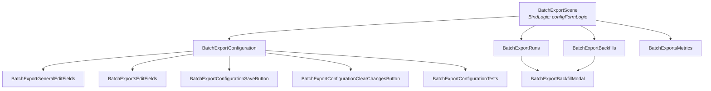
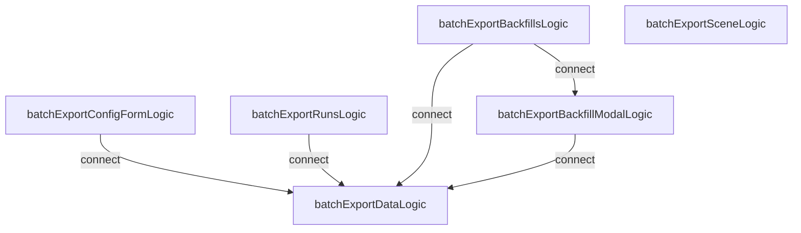

# Batch exports frontend

The batch exports frontend code currently lives in `frontend/src/scenes/data-pipelines/batch-exports/`.

## Architecture

### Component tree



| Component                                    | Logics used                                           | Description                                                                                                              |
| -------------------------------------------- | ----------------------------------------------------- | ------------------------------------------------------------------------------------------------------------------------ |
| `BatchExportScene`                           | `batchExportConfigFormLogic`, `batchExportSceneLogic` | Top-level scene. Mounts `batchExportConfigFormLogic` via `BindLogic`, renders tabs.                                      |
| `BatchExportConfiguration`                   | `batchExportConfigFormLogic`                          | Configuration/editing form.                                                                                              |
| `BatchExportConfigurationSaveButton`         | `batchExportConfigFormLogic`                          | Save button for the config form.                                                                                         |
| `BatchExportConfigurationClearChangesButton` | `batchExportConfigFormLogic`                          | Clear-changes button for the config form.                                                                                |
| `BatchExportConfigurationTests`              | `batchExportConfigFormLogic`                          | Destination-specific configuration tests.                                                                                |
| `BatchExportGeneralEditFields`               | —                                                     | General form fields (name, interval, model).                                                                             |
| `BatchExportsEditFields`                     | —                                                     | Destination-specific form fields.                                                                                        |
| `BatchExportRuns`                            | `batchExportRunsLogic`                                | Runs tab — table of latest runs.                                                                                         |
| `BatchExportBackfills`                       | `batchExportBackfillsLogic`                           | Backfills tab — table of backfills with cancel/create actions.                                                           |
| `BatchExportBackfillModal`                   | `batchExportBackfillModalLogic`                       | Modal for creating a new backfill with date range picker. Rendered by both `BatchExportRuns` and `BatchExportBackfills`. |
| `BatchExportsMetrics`                        | `appMetricsLogic`                                     | Metrics tab — batch export metrics charts.                                                                               |
| `RenderBatchExportIcon`                      | —                                                     | Renders the icon for a batch export destination type.                                                                    |

### Logic dependencies

Each arrow represents a `connect()` call (the source logic reads values/actions from the target).



| Logic                           | Description                                                                                                                                                            |
| ------------------------------- | ---------------------------------------------------------------------------------------------------------------------------------------------------------------------- |
| `batchExportDataLogic`          | Loads and caches a batch export's configuration from the API. Keyed by export ID. All other logics connect here for config data.                                       |
| `batchExportConfigFormLogic`    | Form logic for creating/editing batch export configurations. Owns form state, validation, test steps, save, and delete. Mounted by `BatchExportScene` via `BindLogic`. |
| `batchExportRunsLogic`          | Loads and manages batch export runs. Handles grouping by date, retry, cancel, and pagination.                                                                          |
| `batchExportBackfillsLogic`     | Loads and manages batch export backfills. Handles listing, cancellation, and polling for row count estimates after creation.                                           |
| `batchExportBackfillModalLogic` | Form logic for the backfill creation modal. Manages date range selection, schedule display, and submission.                                                            |
| `batchExportSceneLogic`         | Tab navigation and URL sync for the batch export scene. Defined inline in `BatchExportScene.tsx`.                                                                      |

### External consumers

`HogFunctionBackfills` (in `scenes/hog-functions/backfills/`) renders the backfills tab
for hog function destinations backed by a batch export. It mounts `batchExportDataLogic`
and `batchExportBackfillsLogic` via `BindLogic` — this works because these logics only
depend on the data logic, not the form logic.

## Tests

### Kea logic tests

```sh
pnpm --filter=@posthog/frontend jest batchExportConfigFormLogic --no-coverage
```

Covers: default configuration per service, required field validation, S3 bucket name validation, create/update flows, and API loading.

If tests fail with `Cannot find module 'react'` from `kea-router`, run `pnpm install --force` to fix broken pnpm symlinks.

### Storybook stories

```sh
pnpm storybook
```

Then navigate to **Scenes-App / BatchExports** in the sidebar. Stories: `NewS3Export`, `NewPostgresExport`, `ExistingBigQueryExport`.

### Playwright E2E tests

```sh
pnpm --filter=playwright test e2e/batch-exports.spec.ts
```

Covers creating a new S3 export and validating required fields.

Requires a running backend (`./bin/start`).

You will also need to install Playwright using `pnpm exec playwright install`.
