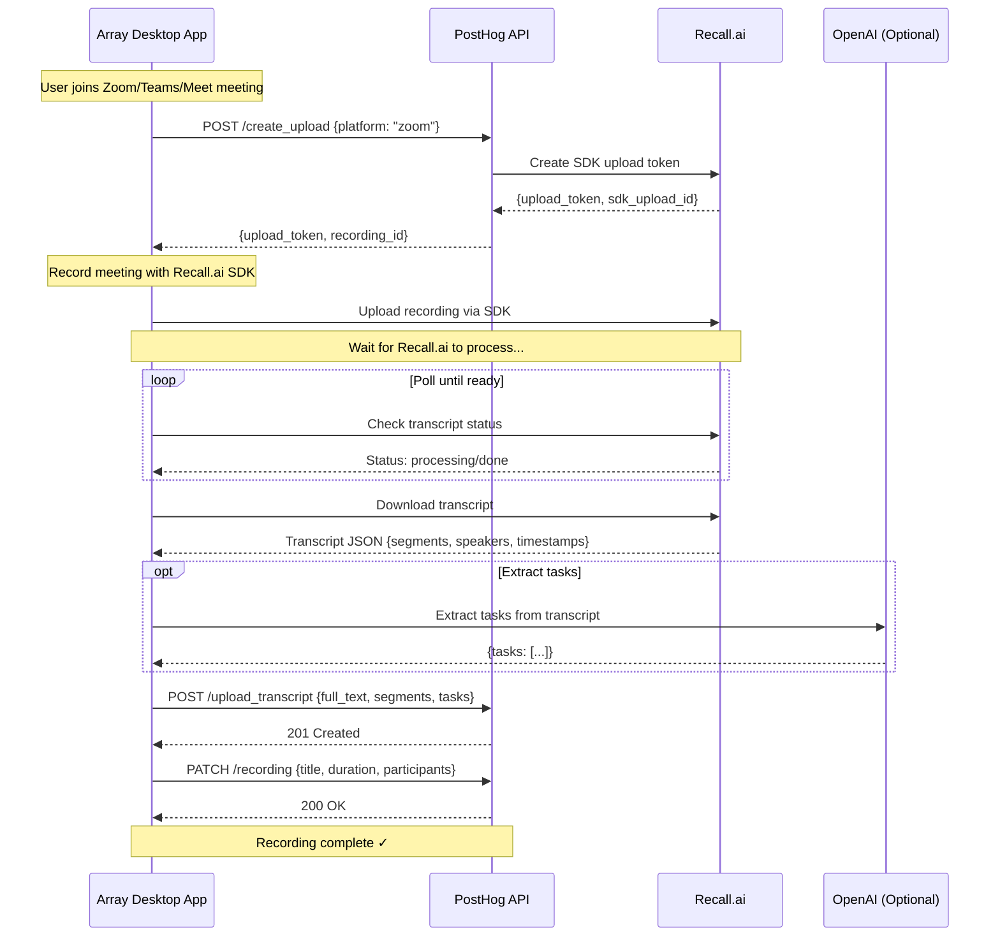

# Array Integration Spec - Desktop Recordings

> **For Array Desktop App Developers**
> This document describes how Array integrates with PostHog's Desktop Recordings backend.

## Overview

PostHog provides a **storage backend** for desktop meeting recordings. Array handles all the recording workflow (using Recall.ai SDK) and sends the results to PostHog for storage.

### Responsibilities

**PostHog Backend (Storage Layer):**
- Create Recall.ai SDK upload tokens
- Store recording metadata (title, duration, participants, etc.)
- Store transcripts and extracted tasks
- Provide REST API for CRUD operations
- Team-based access control

**Array Desktop App (Your Responsibility):**
- Detect when user joins a meeting
- Get upload token from PostHog
- Record meeting using Recall.ai SDK
- Wait for/poll Recall.ai until transcript is ready
- Download transcript from Recall.ai
- Extract tasks from transcript (using OpenAI or your preferred method)
- Upload transcript + tasks to PostHog
- Update recording metadata in PostHog

---

## Integration Workflow



---

## API Reference

### Base URL

```
https://app.posthog.com/api/environments/{team_id}/desktop_recordings/
```

### Authentication

Use **Personal API Keys** with `desktop_recording:write` scope.

```bash
Authorization: Bearer <your-personal-api-key>
```

---

## API Endpoints

### 1. Create Upload Token

**Endpoint:** `POST /api/environments/{team_id}/desktop_recordings/create_upload/`

**Purpose:** Get a Recall.ai upload token to start recording.

**Request:**
```json
{
  "platform": "zoom"  // Options: "zoom", "teams", "meet", "slack", "desktop_audio"
}
```

**Response:**
```json
{
  "upload_token": "eyJhbGc...",  // Pass this to Recall.ai SDK
  "recording_id": "018c2e4a-..."  // Use this for subsequent API calls
}
```

**Example:**
```typescript
const response = await fetch(
  `https://app.posthog.com/api/environments/${teamId}/desktop_recordings/create_upload/`,
  {
    method: 'POST',
    headers: {
      'Authorization': `Bearer ${personalApiKey}`,
      'Content-Type': 'application/json',
    },
    body: JSON.stringify({ platform: 'zoom' })
  }
);

const { upload_token, recording_id } = await response.json();

// Use upload_token with Recall.ai SDK
RecallAiSdk.startRecording({ uploadToken: upload_token });
```

---

### 2. Upload Transcript

**Endpoint:** `POST /api/environments/{team_id}/desktop_recordings/{recording_id}/upload_transcript/`

**Purpose:** Upload transcript and extracted tasks after downloading from Recall.ai.

**Request:**
```json
{
  "full_text": "Complete meeting transcript text...",
  "segments": [
    {
      "text": "Hello everyone",
      "start": 0.0,
      "end": 1.5,
      "speaker": "Alice",
      "speaker_id": "spk_001"
    },
    {
      "text": "Thanks for joining",
      "start": 1.5,
      "end": 3.0,
      "speaker": "Bob",
      "speaker_id": "spk_002"
    }
  ],
  "extracted_tasks": [
    {
      "title": "Send proposal to client",
      "description": "Follow up with client about Q4 pricing",
      "assigned_to": "Alice",
      "due_date": "2024-01-15"
    }
  ],
  "summary": "Team discussed Q4 strategy and client proposals"  // Optional
}
```

**Response:**
```json
{
  "full_text": "Complete meeting transcript text...",
  "segments": [...],
  "extracted_tasks": [...],
  "summary": "...",
  "created_at": "2024-01-10T14:30:00Z",
  "updated_at": "2024-01-10T14:30:00Z"
}
```

**Status Codes:**
- `201 Created` - Transcript created successfully
- `200 OK` - Transcript updated (idempotent, can call multiple times)
- `404 Not Found` - Recording doesn't exist

**Example:**
```typescript
// After downloading transcript from Recall.ai
const recallTranscript = await recallClient.getTranscript(recallRecordingId);

// Extract tasks (using OpenAI or your preferred method)
const tasks = await extractTasks(recallTranscript.full_text);

// Upload to PostHog
await fetch(
  `https://app.posthog.com/api/environments/${teamId}/desktop_recordings/${recordingId}/upload_transcript/`,
  {
    method: 'POST',
    headers: {
      'Authorization': `Bearer ${personalApiKey}`,
      'Content-Type': 'application/json',
    },
    body: JSON.stringify({
      full_text: recallTranscript.full_text,
      segments: recallTranscript.segments,
      extracted_tasks: tasks,
    })
  }
);
```

---

### 3. Update Recording Metadata

**Endpoint:** `PATCH /api/environments/{team_id}/desktop_recordings/{recording_id}/`

**Purpose:** Update recording metadata (title, duration, participants, etc.)

**Request (all fields optional):**
```json
{
  "recall_recording_id": "018c2e4a-...",  // Recall.ai's recording ID
  "meeting_title": "Q4 Planning Meeting",
  "meeting_url": "https://zoom.us/j/123456789",
  "duration_seconds": 1800,
  "participants": [
    {
      "name": "Alice Johnson",
      "email": "alice@example.com",
      "role": "organizer"
    },
    {
      "name": "Bob Smith",
      "role": "participant"
    }
  ],
  "video_url": "https://recall.ai/download/video/...",
  "video_size_bytes": 45000000,
  "status": "complete"  // Options: "recording", "uploading", "processing", "complete", "failed"
}
```

**Response:**
```json
{
  "id": "018c2e4a-...",
  "team": 123,
  "created_by": 456,
  "sdk_upload_id": "018c2e4a-...",
  "recall_recording_id": "018c2e4a-...",
  "platform": "zoom",
  "meeting_title": "Q4 Planning Meeting",
  "meeting_url": "https://zoom.us/j/123456789",
  "duration_seconds": 1800,
  "status": "complete",
  "participants": [...],
  "video_url": "...",
  "started_at": "2024-01-10T14:00:00Z",
  "completed_at": "2024-01-10T14:30:00Z",
  "created_at": "2024-01-10T14:00:00Z",
  "updated_at": "2024-01-10T14:35:00Z",
  "transcript": {
    "full_text": "...",
    "segments": [...],
    "extracted_tasks": [...]
  }
}
```

**Example:**
```typescript
// After Recall.ai completes processing
const recallRecording = await recallClient.getRecording(recallRecordingId);

await fetch(
  `https://app.posthog.com/api/environments/${teamId}/desktop_recordings/${recordingId}/`,
  {
    method: 'PATCH',
    headers: {
      'Authorization': `Bearer ${personalApiKey}`,
      'Content-Type': 'application/json',
    },
    body: JSON.stringify({
      recall_recording_id: recallRecordingId,
      meeting_title: recallRecording.meeting_metadata?.title,
      duration_seconds: recallRecording.duration_seconds,
      participants: recallRecording.participants,
      video_url: recallRecording.media_shortcuts?.video_mixed?.data?.download_url,
      status: 'complete'
    })
  }
);
```

---

### 4. Get Recording

**Endpoint:** `GET /api/environments/{team_id}/desktop_recordings/{recording_id}/`

**Purpose:** Get recording details including transcript (if uploaded).

**Response:**
```json
{
  "id": "018c2e4a-...",
  "platform": "zoom",
  "meeting_title": "Q4 Planning Meeting",
  "status": "complete",
  "duration_seconds": 1800,
  "participants": [...],
  "started_at": "2024-01-10T14:00:00Z",
  "transcript": {
    "full_text": "...",
    "segments": [...],
    "extracted_tasks": [...],
    "created_at": "2024-01-10T14:30:00Z"
  }
}
```

---

### 5. Get Transcript Only

**Endpoint:** `GET /api/environments/{team_id}/desktop_recordings/{recording_id}/transcript/`

**Purpose:** Get just the transcript data.

**Response:**
```json
{
  "full_text": "Complete meeting transcript...",
  "segments": [...],
  "extracted_tasks": [...],
  "summary": "...",
  "created_at": "2024-01-10T14:30:00Z",
  "updated_at": "2024-01-10T14:30:00Z"
}
```

**Status Codes:**
- `200 OK` - Transcript exists
- `404 Not Found` - Transcript not yet uploaded

---

### 6. List Recordings

**Endpoint:** `GET /api/environments/{team_id}/desktop_recordings/`

**Query Parameters:**
- `platform` - Filter by platform (zoom, teams, meet, etc.)
- `status` - Filter by status (recording, complete, failed, etc.)
- `user_id` - Filter by user who created recording
- `search` - Search transcript text

**Response:**
```json
{
  "count": 42,
  "next": "https://...",
  "previous": null,
  "results": [
    {
      "id": "018c2e4a-...",
      "platform": "zoom",
      "meeting_title": "Q4 Planning",
      "status": "complete",
      "started_at": "2024-01-10T14:00:00Z",
      "transcript": {...}
    }
  ]
}
```

---

## Complete Integration Example

```typescript
import { RecallAiSdk } from '@recall-ai/sdk';
import { OpenAI } from 'openai';

class PostHogRecordingIntegration {
  constructor(
    private posthogApiKey: string,
    private teamId: string,
    private recallSdk: RecallAiSdk,
    private openai: OpenAI
  ) {}

  async startRecording(platform: 'zoom' | 'teams' | 'meet') {
    // 1. Get upload token from PostHog
    const { upload_token, recording_id } = await this.createUpload(platform);

    // 2. Start recording with Recall.ai SDK
    await this.recallSdk.startRecording({
      uploadToken: upload_token,
      windowTitle: 'Meeting Window'
    });

    return recording_id;
  }

  async onRecordingComplete(recordingId: string, recallRecordingId: string) {
    // 1. Poll Recall.ai until transcript is ready
    const recallRecording = await this.waitForTranscript(recallRecordingId);

    // 2. Download transcript from Recall.ai
    const transcriptUrl = recallRecording.media_shortcuts.transcript.data.download_url;
    const transcript = await fetch(transcriptUrl).then(r => r.json());

    // 3. Extract tasks using OpenAI
    const tasks = await this.extractTasks(transcript);

    // 4. Upload transcript to PostHog
    await this.uploadTranscript(recordingId, {
      full_text: transcript.map(s => s.text).join(' '),
      segments: transcript,
      extracted_tasks: tasks
    });

    // 5. Update recording metadata
    await this.updateRecording(recordingId, {
      recall_recording_id: recallRecordingId,
      meeting_title: recallRecording.meeting_metadata?.title,
      duration_seconds: recallRecording.duration_seconds,
      participants: recallRecording.participants,
      status: 'complete'
    });
  }

  private async createUpload(platform: string) {
    const response = await fetch(
      `https://app.posthog.com/api/environments/${this.teamId}/desktop_recordings/create_upload/`,
      {
        method: 'POST',
        headers: {
          'Authorization': `Bearer ${this.posthogApiKey}`,
          'Content-Type': 'application/json',
        },
        body: JSON.stringify({ platform })
      }
    );
    return response.json();
  }

  private async uploadTranscript(recordingId: string, data: any) {
    await fetch(
      `https://app.posthog.com/api/environments/${this.teamId}/desktop_recordings/${recordingId}/upload_transcript/`,
      {
        method: 'POST',
        headers: {
          'Authorization': `Bearer ${this.posthogApiKey}`,
          'Content-Type': 'application/json',
        },
        body: JSON.stringify(data)
      }
    );
  }

  private async updateRecording(recordingId: string, data: any) {
    await fetch(
      `https://app.posthog.com/api/environments/${this.teamId}/desktop_recordings/${recordingId}/`,
      {
        method: 'PATCH',
        headers: {
          'Authorization': `Bearer ${this.posthogApiKey}`,
          'Content-Type': 'application/json',
        },
        body: JSON.stringify(data)
      }
    );
  }

  private async waitForTranscript(recallRecordingId: string, maxRetries = 30): Promise<any> {
    for (let i = 0; i < maxRetries; i++) {
      const recording = await this.recallSdk.getRecording(recallRecordingId);
      const status = recording.media_shortcuts?.transcript?.status?.code;

      if (status === 'done') {
        return recording;
      }

      // Wait 10 seconds before next check
      await new Promise(resolve => setTimeout(resolve, 10000));
    }

    throw new Error('Transcript not ready after max retries');
  }

  private async extractTasks(transcript: any[]): Promise<any[]> {
    const fullText = transcript.map(s => s.text).join(' ');

    const completion = await this.openai.chat.completions.create({
      model: 'gpt-4o-mini',
      messages: [
        {
          role: 'system',
          content: 'Extract actionable tasks from this meeting transcript. Return as JSON array.'
        },
        {
          role: 'user',
          content: fullText
        }
      ],
      response_format: { type: 'json_object' }
    });

    return JSON.parse(completion.choices[0].message.content).tasks;
  }
}
```

---

## Error Handling

### Common Errors

**503 Service Unavailable**
```json
{
  "detail": "Recall.ai API key not configured"
}
```
→ PostHog admin needs to configure Recall.ai API key

**404 Not Found**
```json
{
  "detail": "No DesktopRecording matches the given query."
}
```
→ Recording ID doesn't exist or belongs to different team

**401 Unauthorized**
```json
{
  "detail": "Authentication credentials were not provided."
}
```
→ Missing or invalid Personal API Key

**403 Forbidden**
```json
{
  "detail": "You do not have permission to perform this action."
}
```
→ API key doesn't have `desktop_recording:write` scope

---

## Data Models

### Recording Status Flow

```
recording → uploading → processing → complete
                                   ↘ failed
```

### Platform Options

- `zoom` - Zoom meetings
- `teams` - Microsoft Teams
- `meet` - Google Meet
- `slack` - Slack huddles
- `desktop_audio` - Generic desktop audio

### Transcript Segment Format

```typescript
interface TranscriptSegment {
  text: string;           // Spoken text
  start: number;          // Start time in seconds
  end: number;            // End time in seconds
  speaker?: string;       // Speaker name (if available)
  speaker_id?: string;    // Speaker ID for grouping
  confidence?: number;    // Transcription confidence 0-1
}
```

### Extracted Task Format

```typescript
interface ExtractedTask {
  title: string;              // Short task title
  description?: string;       // Detailed description
  assigned_to?: string;       // Person responsible
  due_date?: string;          // ISO date string
  priority?: 'low' | 'medium' | 'high';
  [key: string]: any;         // Custom fields allowed
}
```

---

## Testing

### Create Test Personal API Key

1. Go to PostHog → Settings → Personal API Keys
2. Create new key with `desktop_recording:write` scope
3. Use in your Array integration

### Test Endpoints

```bash
# Test create upload
curl -X POST https://app.posthog.com/api/environments/123/desktop_recordings/create_upload/ \
  -H "Authorization: Bearer phx_..." \
  -H "Content-Type: application/json" \
  -d '{"platform": "zoom"}'

# Test upload transcript
curl -X POST https://app.posthog.com/api/environments/123/desktop_recordings/{id}/upload_transcript/ \
  -H "Authorization: Bearer phx_..." \
  -H "Content-Type: application/json" \
  -d '{
    "full_text": "Test transcript",
    "segments": [],
    "extracted_tasks": []
  }'
```

---

## Questions?

If you have questions about the PostHog integration:
- Check the [main SPEC.md](./SPEC.md) for backend implementation details
- File an issue in the PostHog repo
- Ask in #team-array Slack channel
