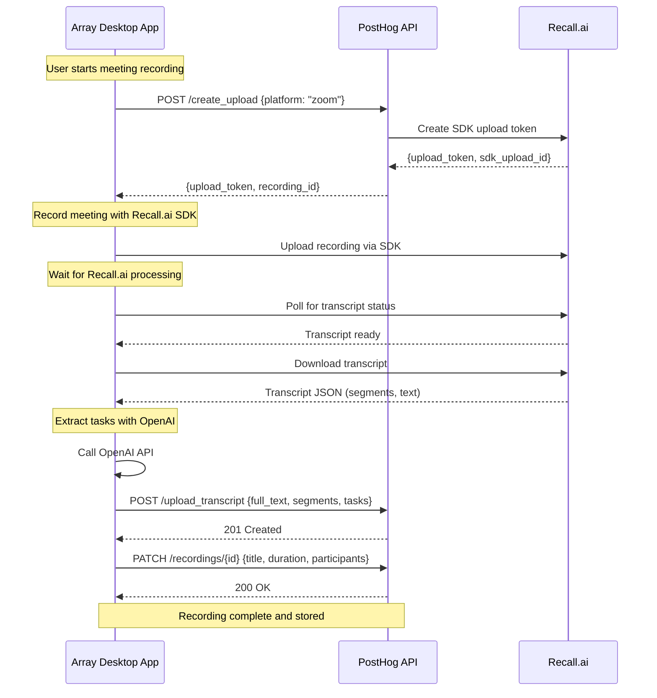

# Desktop Recordings Product Spec

> **🎯 Current Focus: Phase 1 (MVP)**
> This spec describes the full vision for desktop recordings, but **Phase 1 is the immediate priority**: backend integration with Recall.ai for Array desktop users only. The PostHog web UI (frontend) is deferred to Phase 2.

## Overview

Add desktop meeting recording capabilities to PostHog, allowing Array desktop users to record Zoom/Teams/Meet calls locally, upload them to PostHog, and automatically transcribe + extract actionable tasks.

**Phase 1 MVP Features:**
- 🎥 Record Zoom, MS Teams, Google Meet calls via Array desktop app
- 📝 Automatic transcription powered by Recall.ai
- 💾 Backend storage in PostHog (no web UI yet)
- 🔌 API-only access (Array desktop consumes API)
- ✅ Task extraction handled by Array app (PostHog stores tasks sent by Array)

**Future Features (Phase 2+):**
- 🌐 Web UI to view/manage recordings in PostHog
- 👥 Team-level access and sharing
- 🔗 Integration with PostHog Tasks product
- 🔍 Search across all transcripts

---

## Architecture

### Responsibilities

**PostHog Backend (Storage Layer):**
- Create Recall.ai SDK upload tokens for Array
- Store recording metadata (title, duration, participants, etc.)
- Store transcripts and extracted tasks sent by Array
- Provide REST API for CRUD operations
- Filter/search recordings by team

**Array Desktop App (Recording & Processing):**
- Record meetings using Recall.ai SDK
- Poll/wait for Recall.ai to complete transcription
- Download transcript from Recall.ai
- Extract tasks from transcript (using OpenAI or other methods)
- Send transcript + tasks to PostHog for storage
- Update recording metadata in PostHog

### Product Structure

```
/products/desktop_recordings/
├── backend/                    # ✅ Phase 1 (MVP)
│   ├── __init__.py
│   ├── models.py              # DesktopRecording, RecordingTranscript models
│   ├── api.py                 # REST API ViewSet
│   ├── serializers.py         # DRF serializers
│   ├── services/
│   │   └── recall_client.py   # Recall.ai SDK upload token creation
│   ├── migrations/
│   └── tests/
│       ├── test_api.py        # API endpoint tests
│       └── test_models.py     # Model tests
├── frontend/                   # ⏸️ Phase 2 (Deferred - Not needed yet)
│   ├── RecordingsList.tsx     # List view with filters
│   ├── RecordingDetail.tsx    # Detail view with video + transcript
│   ├── RecordingPlayer.tsx    # Video player component
│   ├── TranscriptView.tsx     # Searchable transcript
│   └── logic/
│       └── recordingsLogic.ts # Kea logic for state management
├── manifest.tsx               # Product metadata
├── migrations/
└── README.md
```

### Workflow



---

## Backend Implementation

### 1. Models (`backend/models.py`)

```python
from django.db import models
from django.utils import timezone
from posthog.models.team.team import Team
from posthog.models.user import User
from posthog.models.utils import UUIDModel


class DesktopRecording(UUIDModel):
    """User's desktop meeting recordings"""

    class Status(models.TextChoices):
        RECORDING = "recording", "Recording"
        UPLOADING = "uploading", "Uploading"
        PROCESSING = "processing", "Processing Transcript"
        COMPLETE = "complete", "Complete"
        FAILED = "failed", "Failed"

    class Platform(models.TextChoices):
        ZOOM = "zoom", "Zoom"
        TEAMS = "teams", "Microsoft Teams"
        MEET = "meet", "Google Meet"
        DESKTOP_AUDIO = "desktop_audio", "Desktop Audio"
        SLACK = "slack", "Slack Huddle"

    # Ownership
    team = models.ForeignKey(Team, on_delete=models.CASCADE, related_name="desktop_recordings")
    created_by = models.ForeignKey(User, on_delete=models.SET_NULL, null=True, blank=True)

    # Recall.ai IDs
    sdk_upload_id = models.UUIDField(unique=True, db_index=True)
    recall_recording_id = models.UUIDField(null=True, blank=True, db_index=True)

    # Recording metadata
    platform = models.CharField(max_length=20, choices=Platform.choices)
    meeting_title = models.CharField(max_length=255, null=True, blank=True)
    meeting_url = models.URLField(null=True, blank=True)
    duration_seconds = models.IntegerField(null=True, blank=True)

    # Status
    status = models.CharField(max_length=20, choices=Status.choices, default=Status.RECORDING)
    error_message = models.TextField(null=True, blank=True)

    # Files (from Recall.ai)
    video_url = models.URLField(null=True, blank=True, help_text="Recall.ai video download URL")
    video_size_bytes = models.BigIntegerField(null=True, blank=True)

    # Participants (from Recall.ai metadata)
    participants = models.JSONField(
        default=list,
        help_text="List of meeting participants with metadata"
    )

    # Timestamps
    started_at = models.DateTimeField(default=timezone.now)
    completed_at = models.DateTimeField(null=True, blank=True)
    created_at = models.DateTimeField(auto_now_add=True)
    updated_at = models.DateTimeField(auto_now=True)

    class Meta:
        db_table = "posthog_desktop_recording"
        ordering = ["-started_at"]
        indexes = [
            models.Index(fields=["team", "-started_at"]),
            models.Index(fields=["created_by", "-started_at"]),
            models.Index(fields=["status"]),
        ]

    def __str__(self):
        return f"{self.meeting_title or 'Recording'} ({self.platform})"


class RecordingTranscript(models.Model):
    """Transcript and extracted tasks for a recording"""

    recording = models.OneToOneField(
        DesktopRecording,
        on_delete=models.CASCADE,
        related_name="transcript"
    )

    # Transcript data
    full_text = models.TextField(help_text="Complete transcript text")
    segments = models.JSONField(
        default=list,
        help_text="Timestamped transcript segments with speaker labels"
    )

    # AI-extracted data
    summary = models.TextField(
        null=True,
        blank=True,
        help_text="AI-generated meeting summary"
    )
    extracted_tasks = models.JSONField(
        default=list,
        help_text="Tasks extracted by AI: [{'title': '...', 'description': '...', 'assigned_to': '...'}]"
    )

    # Search
    search_vector = models.TextField(
        null=True,
        blank=True,
        help_text="Full-text search index"
    )

    created_at = models.DateTimeField(auto_now_add=True)
    updated_at = models.DateTimeField(auto_now=True)

    class Meta:
        db_table = "posthog_recording_transcript"

    def __str__(self):
        return f"Transcript for {self.recording}"
```

---

### 2. API Endpoints (`backend/api.py`)

**Key Endpoints for Array:**

- `POST /api/environments/{team_id}/desktop_recordings/create_upload/` - Get Recall.ai upload token
- `POST /api/environments/{team_id}/desktop_recordings/{id}/upload_transcript/` - Upload transcript + tasks
- `PATCH /api/environments/{team_id}/desktop_recordings/{id}/` - Update recording metadata
- `GET /api/environments/{team_id}/desktop_recordings/{id}/` - Get recording details
- `GET /api/environments/{team_id}/desktop_recordings/{id}/transcript/` - Get transcript
- `GET /api/environments/{team_id}/desktop_recordings/` - List recordings (with filters)

```python
from rest_framework import viewsets, status
from rest_framework.decorators import action
from rest_framework.response import Response
from rest_framework.authentication import SessionAuthentication
from rest_framework.permissions import IsAuthenticated
from drf_spectacular.utils import extend_schema

from posthog.api.routing import TeamAndOrgViewSetMixin
from posthog.auth import PersonalAPIKeyAuthentication
from posthog.permissions import APIScopePermission

from .models import DesktopRecording, RecordingTranscript
from .serializers import (
    DesktopRecordingSerializer,
    CreateUploadResponseSerializer,
    RecordingTranscriptSerializer,
)
from .services.recall_client import RecallAIClient


@extend_schema(tags=["desktop_recordings"])
class DesktopRecordingViewSet(TeamAndOrgViewSetMixin, viewsets.ModelViewSet):
    """
    API for managing desktop meeting recordings.

    Recordings are created by the Array desktop app via the create-upload endpoint,
    then managed through standard CRUD operations.
    """

    serializer_class = DesktopRecordingSerializer
    authentication_classes = [SessionAuthentication, PersonalAPIKeyAuthentication]
    permission_classes = [IsAuthenticated, APIScopePermission]
    scope_object = "desktop_recording"
    queryset = DesktopRecording.objects.all()

    def safely_get_queryset(self, queryset):
        """Filter recordings to current team"""
        qs = queryset.filter(team=self.team).select_related("transcript")

        # Filter by user
        user_id = self.request.query_params.get("user_id")
        if user_id:
            qs = qs.filter(created_by_id=user_id)

        # Filter by platform
        platform = self.request.query_params.get("platform")
        if platform:
            qs = qs.filter(platform=platform)

        # Filter by status
        status_param = self.request.query_params.get("status")
        if status_param:
            qs = qs.filter(status=status_param)

        # Search transcript text
        search = self.request.query_params.get("search")
        if search:
            qs = qs.filter(transcript__full_text__icontains=search)

        return qs

    @extend_schema(
        request=None,
        responses={200: CreateUploadResponseSerializer},
        description="Create a Recall.ai SDK upload token for the Array desktop app to start recording"
    )
    @action(detail=False, methods=["POST"])
    def create_upload(self, request):
        """
        Create a new recording and return Recall.ai upload token.

        Called by Array desktop app when a meeting is detected.
        """
        from django.conf import settings

        recall_client = RecallAIClient(
            api_key=settings.RECALL_AI_API_KEY,
            api_url=settings.RECALL_AI_API_URL
        )

        # Create upload with Recall.ai
        upload_response = recall_client.create_sdk_upload(
            recording_config={
                "transcript": {
                    "provider": {
                        "assembly_ai_v3_streaming": {}
                    }
                }
            }
        )

        # Create recording in our DB
        recording = DesktopRecording.objects.create(
            team=self.team,
            created_by=request.user,
            sdk_upload_id=upload_response["id"],
            status=DesktopRecording.Status.RECORDING,
            platform=request.data.get("platform", DesktopRecording.Platform.DESKTOP_AUDIO)
        )

        return Response({
            "upload_token": upload_response["upload_token"],
            "recording_id": str(recording.id)
        })

    @extend_schema(
        request=None,
        responses={200: RecordingTranscriptSerializer},
        description="Get transcript and extracted tasks for a recording"
    )
    @action(detail=True, methods=["GET"])
    def transcript(self, request, pk=None):
        """Get transcript data for a recording"""
        recording = self.get_object()

        if not hasattr(recording, "transcript"):
            return Response(
                {"detail": "Transcript not yet available"},
                status=status.HTTP_404_NOT_FOUND
            )

        serializer = RecordingTranscriptSerializer(recording.transcript)
        return Response(serializer.data)
```

---

### 3. Webhook Handler (`backend/webhooks.py`)

```python
import logging
from django.http import HttpResponse
from django.views.decorators.csrf import csrf_exempt
from django.views.decorators.http import require_http_methods
from rest_framework.decorators import api_view, authentication_classes

from .models import DesktopRecording
from .tasks import process_recording_transcript

logger = logging.getLogger(__name__)


@csrf_exempt
@require_http_methods(["POST"])
def recall_webhook(request):
    """
    Handle webhooks from Recall.ai

    Events:
    - sdk_upload.uploading: Recording started uploading
    - sdk_upload.complete: Recording upload finished
    - sdk_upload.failed: Recording upload failed
    """
    try:
        payload = request.json()
        event = payload.get("event")
        data = payload.get("data", {})

        sdk_upload_id = data.get("sdk_upload", {}).get("id")

        if not sdk_upload_id:
            logger.warning("Webhook missing sdk_upload.id")
            return HttpResponse(status=400)

        try:
            recording = DesktopRecording.objects.get(sdk_upload_id=sdk_upload_id)
        except DesktopRecording.DoesNotExist:
            logger.warning(f"Recording not found for sdk_upload_id: {sdk_upload_id}")
            return HttpResponse(status=404)

        if event == "sdk_upload.uploading":
            recording.status = DesktopRecording.Status.UPLOADING
            recording.save(update_fields=["status", "updated_at"])

        elif event == "sdk_upload.complete":
            recording.recall_recording_id = data.get("recording", {}).get("id")
            recording.status = DesktopRecording.Status.PROCESSING
            recording.save(update_fields=["recall_recording_id", "status", "updated_at"])

            # Trigger async processing
            process_recording_transcript.delay(recording.id)

        elif event == "sdk_upload.failed":
            recording.status = DesktopRecording.Status.FAILED
            recording.error_message = data.get("data", {}).get("message", "Upload failed")
            recording.save(update_fields=["status", "error_message", "updated_at"])

        return HttpResponse(status=200)

    except Exception as e:
        logger.exception(f"Error processing Recall webhook: {e}")
        return HttpResponse(status=500)
```

---

### 4. Celery Task (`backend/tasks.py`)

```python
import logging
from celery import shared_task
from django.conf import settings

from .models import DesktopRecording, RecordingTranscript
from .services.recall_client import RecallAIClient
from .services.task_extraction import extract_tasks_from_transcript

logger = logging.getLogger(__name__)


@shared_task(bind=True, max_retries=3)
def process_recording_transcript(self, recording_id):
    """
    Download recording from Recall.ai, extract tasks, create transcript
    """
    try:
        recording = DesktopRecording.objects.get(id=recording_id)

        recall_client = RecallAIClient(
            api_key=settings.RECALL_AI_API_KEY,
            api_url=settings.RECALL_AI_API_URL
        )

        # 1. Get recording data from Recall.ai
        recall_recording = recall_client.get_recording(str(recording.recall_recording_id))

        # 2. Update recording metadata
        recording.duration_seconds = recall_recording.get("duration_seconds")
        recording.meeting_title = recall_recording.get("meeting_metadata", {}).get("title")
        recording.meeting_url = recall_recording.get("meeting_metadata", {}).get("url")
        recording.participants = recall_recording.get("participants", [])

        # 3. Get video URL
        video_data = recall_recording.get("media_shortcuts", {}).get("video_mixed", {})
        if video_data.get("status", {}).get("code") == "done":
            recording.video_url = video_data.get("data", {}).get("download_url")
            recording.video_size_bytes = video_data.get("data", {}).get("size_bytes")

        # 4. Download transcript
        transcript_data = recall_recording.get("media_shortcuts", {}).get("transcript", {})
        if transcript_data.get("status", {}).get("code") != "done":
            raise Exception("Transcript not ready yet")

        transcript_url = transcript_data.get("data", {}).get("download_url")
        transcript_json = recall_client.download_transcript(transcript_url)

        full_text = " ".join([seg.get("text", "") for seg in transcript_json])

        # 5. Extract tasks using OpenAI
        extracted_tasks = extract_tasks_from_transcript(full_text, settings.OPENAI_API_KEY)

        # 6. Create transcript record
        RecordingTranscript.objects.create(
            recording=recording,
            full_text=full_text,
            segments=transcript_json,
            extracted_tasks=extracted_tasks
        )

        # 7. Mark recording as complete
        recording.status = DesktopRecording.Status.COMPLETE
        recording.save()

        logger.info(f"Successfully processed recording {recording_id}")

    except Exception as exc:
        logger.exception(f"Error processing recording {recording_id}: {exc}")

        recording.status = DesktopRecording.Status.FAILED
        recording.error_message = str(exc)
        recording.save(update_fields=["status", "error_message"])

        # Retry with exponential backoff
        raise self.retry(exc=exc, countdown=2 ** self.request.retries)
```

---

### 5. Services

#### `backend/services/recall_client.py`

```python
import requests
from typing import Dict, Any


class RecallAIClient:
    """Client for Recall.ai API"""

    def __init__(self, api_key: str, api_url: str = "https://us-west-2.recall.ai"):
        self.api_key = api_key
        self.base_url = api_url.rstrip("/")
        self.session = requests.Session()
        self.session.headers.update({"Authorization": f"Token {api_key}"})

    def create_sdk_upload(self, recording_config: Dict[str, Any] = None) -> Dict[str, Any]:
        """Create SDK upload and return upload token"""
        payload = {}
        if recording_config:
            payload["recording_config"] = recording_config

        response = self.session.post(
            f"{self.base_url}/api/v1/sdk-upload/",
            json=payload
        )
        response.raise_for_status()
        return response.json()

    def get_recording(self, recording_id: str) -> Dict[str, Any]:
        """Get recording metadata and download URLs"""
        response = self.session.get(
            f"{self.base_url}/api/v1/recording/{recording_id}/"
        )
        response.raise_for_status()
        return response.json()

    def download_transcript(self, transcript_url: str) -> Any:
        """Download transcript JSON"""
        response = requests.get(transcript_url)
        response.raise_for_status()
        return response.json()
```

#### `backend/services/task_extraction.py`

```python
from ai import openai
from ai.core import generateObject
from zod import z


def extract_tasks_from_transcript(
    transcript: str,
    openai_api_key: str
) -> list[dict]:
    """
    Extract actionable tasks from meeting transcript using OpenAI

    Returns:
        [
            {
                "title": "Fix login bug",
                "description": "Users can't log in on Safari",
                "assigned_to": "John"  # Optional
            },
            ...
        ]
    """
    schema = z.object({
        "tasks": z.array(z.object({
            "title": z.string().describe("Short, actionable task title"),
            "description": z.string().describe("Detailed description of what needs to be done"),
            "assigned_to": z.string().optional().describe("Person assigned to this task, if mentioned")
        }))
    })

    prompt = f"""
    Extract all actionable tasks from this meeting transcript.
    Only include concrete action items that someone needs to do.
    Ignore pleasantries, questions, and general discussion.

    Transcript:
    {transcript}
    """

    result = generateObject(
        model=openai("gpt-4o-mini", apiKey=openai_api_key),
        schema=schema,
        prompt=prompt
    )

    return result.object["tasks"]
```

---

## Frontend Implementation (Phase 2 - Not Needed Yet)

> **Note**: The frontend is deferred to Phase 2. This section is included for completeness but will not be implemented in the initial MVP.

### 1. Recordings List (`frontend/RecordingsList.tsx`)

```tsx
import { LemonTable, LemonTag, LemonInput } from '@posthog/lemon-ui'
import { useValues, useActions } from 'kea'
import { recordingsLogic } from './logic/recordingsLogic'

export function RecordingsList(): JSX.Element {
    const { recordings, recordingsLoading, filters } = useValues(recordingsLogic)
    const { setFilters, loadRecordings } = useActions(recordingsLogic)

    return (
        <div>
            <div className="flex gap-2 mb-4">
                <LemonInput
                    type="search"
                    placeholder="Search transcripts..."
                    value={filters.search}
                    onChange={(search) => setFilters({ search })}
                />
                <LemonSelect
                    options={[
                        { value: 'all', label: 'All platforms' },
                        { value: 'zoom', label: 'Zoom' },
                        { value: 'teams', label: 'Teams' },
                        { value: 'meet', label: 'Google Meet' },
                    ]}
                    value={filters.platform}
                    onChange={(platform) => setFilters({ platform })}
                />
            </div>

            <LemonTable
                dataSource={recordings}
                loading={recordingsLoading}
                columns={[
                    {
                        title: 'Meeting',
                        render: (_, recording) => (
                            <div>
                                <div className="font-semibold">
                                    {recording.meeting_title || 'Untitled Recording'}
                                </div>
                                <div className="text-muted text-xs">
                                    {recording.platform} • {formatDuration(recording.duration_seconds)}
                                </div>
                            </div>
                        ),
                    },
                    {
                        title: 'Status',
                        render: (_, recording) => (
                            <LemonTag type={getStatusColor(recording.status)}>
                                {recording.status}
                            </LemonTag>
                        ),
                    },
                    {
                        title: 'Recorded by',
                        render: (_, recording) => recording.created_by?.email,
                    },
                    {
                        title: 'Date',
                        render: (_, recording) => formatDate(recording.started_at),
                    },
                    {
                        title: 'Tasks',
                        render: (_, recording) => (
                            recording.transcript?.extracted_tasks?.length || 0
                        ),
                    },
                ]}
                onRow={(recording) => ({
                    onClick: () => router.push(`/recordings/${recording.id}`),
                })}
            />
        </div>
    )
}
```

### 2. Recording Detail (`frontend/RecordingDetail.tsx`)

```tsx
import { LemonTabs, LemonButton } from '@posthog/lemon-ui'
import { useValues, useActions } from 'kea'
import { recordingDetailLogic } from './logic/recordingDetailLogic'
import { RecordingPlayer } from './RecordingPlayer'
import { TranscriptView } from './TranscriptView'
import { TasksList } from './TasksList'

export function RecordingDetail({ recordingId }: { recordingId: string }): JSX.Element {
    const { recording, transcript } = useValues(recordingDetailLogic({ recordingId }))
    const { createTasksFromRecording } = useActions(recordingDetailLogic({ recordingId }))

    return (
        <div className="space-y-4">
            <div className="flex justify-between items-start">
                <div>
                    <h1>{recording.meeting_title || 'Untitled Recording'}</h1>
                    <div className="text-muted">
                        {recording.platform} • {formatDate(recording.started_at)} •
                        {formatDuration(recording.duration_seconds)}
                    </div>
                </div>
                {transcript?.extracted_tasks?.length > 0 && (
                    <LemonButton
                        type="primary"
                        onClick={createTasksFromRecording}
                    >
                        Create {transcript.extracted_tasks.length} Tasks
                    </LemonButton>
                )}
            </div>

            {recording.video_url && (
                <RecordingPlayer
                    videoUrl={recording.video_url}
                    duration={recording.duration_seconds}
                />
            )}

            <LemonTabs
                tabs={[
                    {
                        key: 'transcript',
                        label: 'Transcript',
                        content: <TranscriptView transcript={transcript} />,
                    },
                    {
                        key: 'tasks',
                        label: `Extracted Tasks (${transcript?.extracted_tasks?.length || 0})`,
                        content: <TasksList tasks={transcript?.extracted_tasks || []} />,
                    },
                    {
                        key: 'participants',
                        label: 'Participants',
                        content: <ParticipantsList participants={recording.participants} />,
                    },
                ]}
            />
        </div>
    )
}
```

---

## Array Desktop Integration

### API Client Updates

```typescript
// src/api/posthogClient.ts

class PostHogAPIClient {
  // ... existing methods ...

  async createDesktopRecordingUpload(platform: string = 'desktop_audio') {
    const teamId = await this.getTeamId();
    const data = await this.api.post(
      `/api/projects/{project_id}/desktop-recordings/create-upload/`,
      {
        path: { project_id: teamId.toString() },
        body: { platform }
      }
    );
    return data; // { upload_token, recording_id }
  }

  async getDesktopRecording(recordingId: string) {
    const teamId = await this.getTeamId();
    const data = await this.api.get(
      `/api/projects/{project_id}/desktop-recordings/{id}/`,
      {
        path: { project_id: teamId.toString(), id: recordingId },
      }
    );
    return data;
  }

  async listDesktopRecordings(filters?: {
    platform?: string;
    status?: string;
    search?: string;
  }) {
    const teamId = await this.getTeamId();
    const data = await this.api.get(
      `/api/projects/{project_id}/desktop-recordings/`,
      {
        path: { project_id: teamId.toString() },
        query: filters || {}
      }
    );
    return data.results ?? [];
  }
}
```

### Recall SDK Integration

```typescript
// src/main/services/recallRecording.ts

import RecallAiSdk from '@recallai/desktop-sdk';

export function initializeRecallSDK(apiUrl: string) {
  RecallAiSdk.init({
    apiUrl,
    acquirePermissionsOnStartup: ['accessibility', 'screen-capture', 'microphone'],
    restartOnError: true
  });

  RecallAiSdk.addEventListener('meeting-detected', async (evt) => {
    const { uploadToken, recordingId } = await posthogClient.createDesktopRecordingUpload(
      detectPlatform(evt.window)
    );

    await RecallAiSdk.startRecording({
      windowId: evt.window.id,
      uploadToken: uploadToken
    });

    // Store recordingId for status updates
    storeRecordingId(recordingId);
  });

  RecallAiSdk.addEventListener('recording-ended', async (evt) => {
    await RecallAiSdk.uploadRecording({ windowId: evt.window.id });
  });

  RecallAiSdk.addEventListener('upload-progress', (evt) => {
    updateProgressUI(evt.progress);
  });
}
```


---

## Implementation Phases

> **Note**: This spec is split into phases. **Phase 1 is the immediate priority** - enabling Recall.ai integration for Array desktop users. The PostHog web UI (frontend) is deferred to Phase 2.

---

### Phase 1: Recall.ai Backend Integration (MVP - Week 1-2)

**Goal**: Enable Array desktop app to record meetings via Recall.ai, with recordings stored in PostHog backend.

**Scope**:
- Backend models and API only
- No PostHog web UI
- Users interact only through Array desktop app

**Tasks**:
- [ ] Create `/products/desktop_recordings/backend/` structure (skip `/frontend/` for now)
- [ ] Implement models (`DesktopRecording`, `RecordingTranscript`)
- [ ] Create migrations
- [ ] Add minimal API endpoints:
  - `POST /api/projects/{id}/desktop-recordings/create-upload/` (for Array)
  - `GET /api/projects/{id}/desktop-recordings/{id}/` (get recording status)
  - `GET /api/projects/{id}/desktop-recordings/{id}/transcript/` (get transcript)
- [ ] Implement Recall.ai webhook handler (`/webhooks/recall/`)
- [ ] Create Recall.ai service (`services/recall_client.py`)
- [ ] Create task extraction service (`services/task_extraction.py`)
- [ ] Add Celery task for processing transcripts
- [ ] Write backend tests
- [ ] Deploy webhook endpoint to production
- [ ] Configure environment variables

**Array Desktop Integration**:
- [ ] Install Recall Desktop SDK (`pnpm add @recallai/desktop-sdk`)
- [ ] Add methods to `PostHogAPIClient`
- [ ] Initialize Recall SDK in main process
- [ ] Handle meeting detection flow
- [ ] Handle recording lifecycle (start, upload, status polling)
- [ ] Test end-to-end: Meeting → Recording → Transcript → Tasks

**Environment Variables** (PostHog backend):
```python
RECALL_AI_API_KEY=your-key
RECALL_AI_API_URL=https://us-west-2.recall.ai
OPENAI_API_KEY=your-openai-key  # Already exists
```

**Deliverables**:
- ✅ Users can record meetings in Array desktop
- ✅ Recordings upload to PostHog automatically
- ✅ Transcripts are processed and stored
- ✅ Tasks extracted from transcripts
- ❌ No web UI yet (users can't view recordings in PostHog web app)

---

### Phase 2: PostHog Web UI (Future - Week 3-4)

**Goal**: Add web interface in PostHog to view, search, and manage recordings.

**Scope**:
- Frontend components in `/products/desktop_recordings/frontend/`
- Recordings page in PostHog web app
- Searchable transcript viewer
- Integration with PostHog Tasks product

**Tasks**:
- [ ] Create `/products/desktop_recordings/frontend/` structure
- [ ] Add recordings list view (filterable, searchable)
- [ ] Add recording detail view with video player
- [ ] Implement transcript viewer with timestamps
- [ ] Add extracted tasks UI
- [ ] Create "Convert to Tasks" button (creates tasks in PostHog Tasks)
- [ ] Add Kea logic for state management
- [ ] Write frontend tests
- [ ] Add navigation menu item

**Deliverables**:
- ✅ Team members can view all team recordings in PostHog web
- ✅ Search across all transcripts
- ✅ Watch recording videos in browser
- ✅ Create PostHog Tasks from extracted tasks

---

### Phase 3: Polish & Advanced Features (Future - Week 5+)

**Goal**: Production-ready features for scaling and enterprise use.

**Tasks**:
- [ ] Team permissions (who can view/delete recordings)
- [ ] Usage tracking and billing (storage, transcript minutes)
- [ ] Real-time transcription (show transcript while recording)
- [ ] Speaker diarization (identify different speakers)
- [ ] Meeting insights and analytics
- [ ] Slack integration (auto-post summaries)
- [ ] Calendar integration (auto-detect meetings)
- [ ] Search optimization (Elasticsearch if needed)
- [ ] Performance testing
- [ ] Documentation and user guides

**Deliverables**:
- ✅ Enterprise-ready recording solution
- ✅ Scalable to 1000s of recordings
- ✅ Rich analytics and insights

---

## Testing Requirements

### Backend Tests
```python
# products/desktop_recordings/backend/tests/test_api.py

def test_create_upload_generates_token():
    """Test that create-upload endpoint returns valid token"""
    response = client.post("/api/projects/1/desktop-recordings/create-upload/")
    assert response.status_code == 200
    assert "upload_token" in response.data
    assert "recording_id" in response.data

def test_webhook_updates_recording_status():
    """Test Recall webhook updates recording status"""
    # ... test webhook handler
```

### Frontend Tests
```typescript
// products/desktop_recordings/frontend/__tests__/RecordingsList.test.tsx

describe('RecordingsList', () => {
    it('displays recordings list', () => {
        // ... test component rendering
    })

    it('filters by platform', () => {
        // ... test filtering
    })
})
```

---

## Configuration & Deployment

### Django Settings

```python
# posthog/settings.py

# Recall.ai Configuration
RECALL_AI_API_KEY = os.getenv('RECALL_AI_API_KEY')
RECALL_AI_API_URL = os.getenv('RECALL_AI_API_URL', 'https://us-west-2.recall.ai')
RECALL_WEBHOOK_SECRET = os.getenv('RECALL_WEBHOOK_SECRET')  # For webhook verification

# OpenAI Configuration (already exists)
OPENAI_API_KEY = os.getenv('OPENAI_API_KEY')
```

### URL Routing

```python
# posthog/urls.py

from products.desktop_recordings.backend.api import DesktopRecordingViewSet
from products.desktop_recordings.backend.webhooks import recall_webhook

# API endpoints (auto-registered via router)
router.register(
    r'projects/(?P<project_id>\w+)/desktop-recordings',
    DesktopRecordingViewSet,
    basename='desktop-recording'
)

# Webhook endpoint (public, no auth)
urlpatterns += [
    path('webhooks/recall/', recall_webhook, name='recall-webhook'),
]
```

---

## Security Considerations

1. **API Key Storage**: Recall.ai API key stored in environment variables (never in code)
2. **Webhook Verification**: Verify Recall.ai webhooks using signature (if provided)
3. **Team Isolation**: Recordings filtered by team (users can only see their team's recordings)
4. **Video URLs**: Use signed URLs with expiration for video downloads
5. **Permissions**: Respect PostHog's existing permission system (APIScopePermission)

---

## Questions & Decisions Needed

1. **Video Storage**: Keep URLs from Recall.ai or download+store in PostHog's S3?
   - **Recommendation**: Keep Recall URLs initially, they expire after 7 days

2. **Task Creation**: Auto-create tasks in PostHog Tasks product, or require user action?
   - **Recommendation**: Require user action (button in UI)

3. **Transcript Search**: Use Postgres full-text search or Elasticsearch?
   - **Recommendation**: Start with Postgres, move to ES if needed

4. **Billing**: How to track/bill for recording usage?
   - **Recommendation**: Track storage + transcript length, add to existing billing

---

## Success Metrics

- Number of recordings created per week
- Transcript accuracy/quality (user feedback)
- Number of tasks extracted → created
- Video playback success rate
- Search usage and relevance

---

## Future Enhancements

- **Real-time transcription**: Show transcript while recording
- **Speaker diarization**: Identify different speakers
- **Action item tracking**: Mark tasks as "done" from transcript
- **Meeting insights**: Analytics on meeting patterns
- **Slack integration**: Auto-post summaries to Slack
- **Calendar integration**: Auto-detect meetings from calendar
