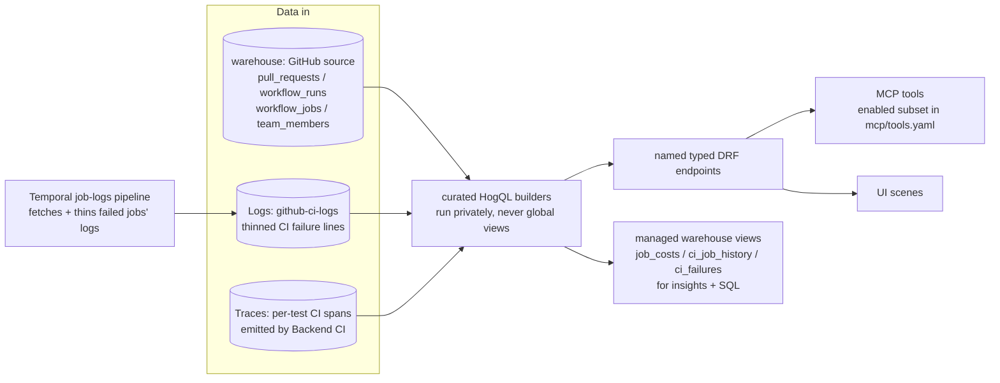

# Engineering analytics

Owner: team-devex. Engineering contract: [SPEC.md](./SPEC.md).

## The one-sentence version

**It's product analytics, but the "users" are pull requests and the "events" are what happens to them on the way to production.**

Everything else is mechanics.

## The analogy

If you understand PostHog product analytics, you understand this. Map it one-to-one:

| Product analytics                        | Engineering analytics                          |
| ---------------------------------------- | ---------------------------------------------- |
| A **person** does things in your app     | A **PR** moves through your pipeline           |
| Events: `pageview`, `signup`, `purchase` | Events: `opened`, `ready_for_review`, `merged` |
| "How long from signup to purchase?"      | "How long from opened to merged?"              |
| "What % of signups convert?" (funnel)    | "What % of PRs make it to prod?" (funnel)      |
| "Is conversion getting better?" (trend)  | "Is CI getting faster?" (trend)                |
| Segment by country, plan, browser        | Segment by repo, workflow, file path           |

Same product, different noun.

## The shape of the thing

```text
A PR's life, as a stream of timestamped events:

opened ──> ready_for_review ──> ci_passed ──> approved ──> merged ──> deployed
  │              │                  │            │           │           │
t=0          t=2h              t=2h15m        t=4h        t=4h30m      t=5h

Engineering analytics measures every gap:
  opened→ready     = how long it sat as a draft
  ready→merged     = THE NORTH STAR (shorten this)
  any→ci_passed    = how long CI took to go green
  merged→deployed  = ship latency

Then averages each gap across all PRs, and trends it over weeks.
DevEx's job: watch those gaps shrink.
```

The product is: **measure every gap in a PR's life, average it, and watch it shrink.**

## Why this exists

The middle of PostHog's AI-to-prod loop (CI / review / merge / deploy) is invisible to both ends. This product fills it:

```text
PostHog Code              engineering_analytics            PostHog product analytics
(generates code,      →   (CI / review / merge / deploy) →  (events, errors, flags,
 opens PRs)                                                  surveys, replays)
        ↑                                                            │
        └───────────  Signals feed back to PostHog Code  ───────────┘
```

Two consumer classes, one tool set: engineers driving an agent (Claude Code, Cursor, PostHog AI) over their monorepo (we dogfood on `PostHog/posthog`), and PostHog Code calling the same tools autonomously on its own PRs.
Return shapes are typed contracts whose caveats ride in honest field names (`open_to_merge_seconds`, never `cycle_time`): legible to an agent, never free-form prose it might paraphrase wrong.

## The system



- Job-level CI: per-job duration, queue time, runner tier, and dollar cost ride `workflow_jobs` (webhook stream plus bounded backfill).
- One write surface: test quarantine. The UI files a tracking issue plus a PR against the repo's checked-in `.test_quarantine.json` through the team's GitHub App. Everything else is read-only.
- Access control: per-user warehouse RBAC at the source resolver, `engineering_analytics:read` scopes on tools, feature-flag gated.

## The goal: CI Signals for PostHog Code

Valuable CI conditions ("this check is flaky", "master went red at SHA X", "this PR is wedged on a failing required check") become [Signals](../signals): grouped, researched against the repository, and handed to PostHog Code for autonomous remediation.
Detection is defined once in `logic/` over the read layer, so the emitter and the MCP tools share one definition.
Shortening ready-for-review-to-merge is the headline metric this serves.

## The data boundary

| Question                                                                     | Substrate                                                            |
| ---------------------------------------------------------------------------- | -------------------------------------------------------------------- |
| CI and job durations, queue time, cost, failure logs, flaky and broken tests | Warehouse + Logs + Traces                                            |
| Open to merge time (coarse: `open_to_merge_seconds`)                         | PR snapshot                                                          |
| Draft/ready transitions, time-in-review, approvals                           | PR lifecycle events (webhooks to events, PR as group type): deferred |
| Deploys and DORA                                                             | Deploy data: deferred                                                |

The warehouse snapshots overwrite state on update, so transition timing is unrecoverable from them.
Immutable lifecycle events are the only thing the deferred events destination is for.

## Locked decisions

Change one only in a separate PR with a written reason. Engineering-level decisions live in [SPEC.md](./SPEC.md) → Locked decisions.

- Two motivations: (A) DevEx dogfood, (B) close the dark middle of PostHog's AI-to-prod loop. Every design decision serves both.
- Unit of value = the open PR. Phase model: draft (low rigor) vs ready-for-review (high stakes).
- North star: actionable CI Signals for PostHog Code. Ready-for-review-to-merge time is the headline metric, not the end in itself.
- Two first-class surfaces, one endpoint set: the in-app UI and MCP tools. Named typed endpoints run the curated read layer privately (no global HogQL views, core imports only the viewset); keep `mcp/tools.yaml` current whenever endpoints change.
- One sanctioned write: the test-health sidecar (quarantine, as an issue plus PR through the team's GitHub App), carved out because this UI is the fastest surface to iterate on it. No saved views or stateful filters; persisted surfaces are a separate decision.
- Data path: HogQL over the warehouse, plus reads from Logs and Traces. PR lifecycle event ingestion deferred. Product Postgres DB stays empty.
- No author leaderboards or per-developer performance rankings, ever. The author page (own PRs plus own CI cost, reached only from PR-row author links) is allowed; ranking people against each other is not.
- Bots and drafts excluded by default in throughput / cycle-time reads; bot detection = `handle.endswith("[bot]") OR handle in KNOWN_BOT_HANDLES`.
- Author identity = `Author{handle, display_name, avatar_url, is_bot}`. No PostHog-user mapping.
- Time to merge = `open_to_merge_seconds` = `merged_at - created_at`: coarse until state-transition events exist, and named so.
- The GitHub `reviews` endpoint syncs, but review reads stay deferred until a wedge tool needs them.

## Glossary

| Term                | Definition                                                                                |
| ------------------- | ----------------------------------------------------------------------------------------- |
| Good / bad friction | Checks that catch real problems (keep, optimize) vs checks engineers ignore (remove)      |
| Wedge               | End-to-end code visibility, served via MCP to PostHog Code and engineers driving agents   |
| The dark middle     | The CI / review / merge / deploy steps between PostHog Code and PostHog product analytics |
