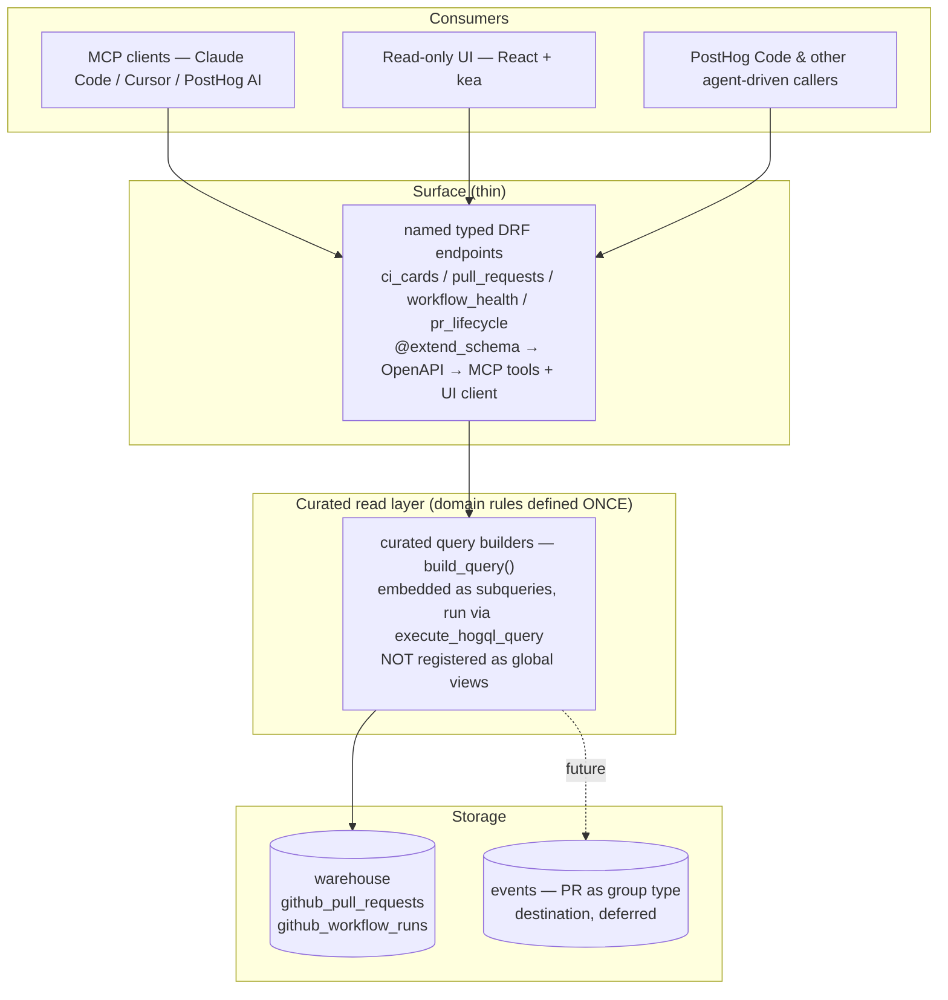
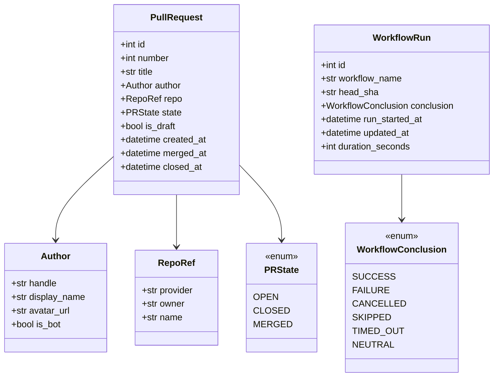

# engineering_analytics — Engineering Spec

Owner: team-devex
Sibling doc: [README.md](./README.md) — read that first for the product picture, motivations, and the wedge. This file is the engineering contract: architecture, canonical types, file layout, ordering.

## 1. Purpose

Engineering contract for the `products/engineering_analytics/` product. The product surfaces PR + CI lifecycle data from the warehouse (`github_pull_requests`, `github_workflow_runs`) through **named, typed read endpoints** that run curated HogQL privately. **MCP is the official surface** (the endpoints are exposed as MCP tools); a read-only UI consumes the same endpoints. Nothing is registered as a global HogQL view, so the product stays isolated and off the per-query catalog hot path — core imports only the viewset, exactly like `visual_review`. Consumers and motivations are in the README.

The **goal** is to surface these as **Signals** for PostHog Code: valuable CI conditions are emitted into PostHog's [Signals](../signals) product, grouped and researched against the repository, and acted on autonomously when a finding is actionable. The read substrate + MCP serve that goal directly — what counts as a valuable CI Signal is defined once in `logic/` over the read layer, reused by both the surface and the emitter — and the UI is a showcase over the same layer.

## 2. Non-goals

- Per-developer surveillance metrics or rankings. Analytics aggregate at team/repo level only; author is display metadata on a PR (attribution), never a unit of analysis. No author-level pages, tabs, leaderboards, rankings, or per-author cost, ever.
- Real-time alerting on individual PRs. That's notification surface, not analytics.
- Replacing GitHub's own UI. We surface signal, not the raw PR thread.
- Code-quality static analysis. Different product space.

## 3. Architecture

One general **curated read layer** that every surface composes. The curated query builders are the deep, reusable layer where all domain knowledge lives once; the named endpoints, MCP, and the UI are thin consumers above it. Crucially the product runs this layer **privately** — it is never registered as a global HogQL view, so core's HogQL layer never imports it and no per-team query pays for it. The only core→product edge is the viewset registration in `posthog/api/`, the standard product edge that every viewset has. (APOSD: general-purpose lower layer, thin surfaces, domain rules defined once.)

Rules:

- **Curated read layer = curated query builders** over the warehouse tables: `backend/logic/views/{pull_requests,workflow_runs}.py` each expose `build_query(table_name)` returning a curated `SELECT` over the team's GitHub table. The table's real name is `ExternalDataSource.prefix + "github_<endpoint>"` and the prefix is user-chosen, so the name is **resolved per-team at request time** by `backend/logic/sources.py` (walking the team's GitHub source → its `pull_requests`/`workflow_runs` schemas → `schema.table.name`) — never hardcoded. Query modules (`backend/logic/queries/`) embed the builders as parenthesised subqueries (via `_curated`) and run them with `execute_hogql_query`. Repo identity (`base.repo.full_name`), labels, `is_bot`, and the PR↔CI head-SHA join are mapped here **from the JSON the source already lands — no new ingestion**. Domain rules (bot detection, default exclusions, the join, honest metric naming) are defined exactly **once**, here. **Nothing is registered in `Database.create_for`** — the product is not a global-catalog citizen, which keeps it off the per-query hot path and means `posthog/hogql` never imports it (the viewset registration in `posthog/api/` is the normal product edge, loaded once at URL-conf time).
- **MCP is the official surface, via named typed endpoints.** Each capability is a DRF action with `@extend_schema` that flows to an MCP tool through OpenAPI codegen (`ci_cards`, `pull_requests`, `workflow_health`, `pr_lifecycle`). This is the `visual_review` shape: core imports only the viewset; everything else stays in the product.
- **The UI reads the same endpoints** via the generated typed API client (kea loaders) — not client-side HogQL, and not bespoke report endpoints distinct from the MCP ones. One endpoint set, two consumers.
- HogQL only, via `execute_hogql_query`. No raw ClickHouse `sync_execute()`. No product Postgres DB.
- Warehouse table names are resolved per-team in `logic/sources.py`; the curated builders (and `logic/queries/`) are the only place that maps GitHub-shaped columns. Canonical types stay above them.
- Every named-tool PR ships a matching `skills/<name>/SKILL.md` teaching tool selection and carrying the metric caveats — same pattern as `products/visual_review/skills/triaging-visual-review-runs/`.
- Provider abstraction (`CodeHostProvider` Protocol) is **deferred**. GitHub-specific HogQL lives in the curated builders; when a second provider lands, the Protocol is extracted then. See §7.

## 4. Canonical types

Defined in `backend/facade/contracts.py` as `pydantic.dataclasses.dataclass(frozen=True)` — same `is_dataclass()` semantics as the stdlib variant (so `DataclassSerializer` works) but with runtime validation at construction. No Django imports. These back **every endpoint** and any cross-product use — the named endpoints return these typed contracts (objects or lists), so there is no untyped row surface.

`is_bot` on `Author` is set inside the read layer: `is_bot = handle.endswith("[bot]") OR handle in KNOWN_BOT_HANDLES`.

`pr_lifecycle` returns a `metric_quality` field where the caveat is load-bearing (`partial`). The aggregate endpoints carry their caveats in **honest field names** (`open_to_merge_seconds`) plus serializer/tool docs (see §7).

Types named in the README but not yet modeled (reviewers, deploys, file paths) wait until the corresponding data lands.

## 5. Curated read layer & surface

### Curated read layer

Two curated `build_query()` SELECTs over the existing warehouse data — columns mapped from JSON we already store, **no new ingestion, no global view registration**. Column names encode caveats so a misread is defined out of existence (`open_to_merge_seconds`, never `cycle_time`).

- pull-requests builder — `number`, `title`, `author_handle`, `is_bot`, `repo_owner` / `repo_name` (from `base.repo.full_name`), `labels`, `state`, `is_draft`, `created_at`, `merged_at`, `closed_at`, `head_sha`, `open_to_merge_seconds` (coarse — see §7).
- workflow-runs builder — `workflow_name`, `head_sha`, `head_branch`, `conclusion`, `status`, `run_started_at`, `updated_at`, `duration_seconds`, `repo_owner` / `repo_name`.

A PR's current CI status is the head-SHA join between the two (the `ci_rollup` CTE in `_curated`); defined once.

### Surface

**MCP (official):** named typed tools, each a DRF endpoint returning a typed contract:

- `ci_cards` — open-PR backlog counts (open / repos / stuck >7d / failing CI).
- `pull_requests` — PR list with head-SHA CI rollup; `date_from` recency window. Capped (newest first) and returned as `{items, truncated, limit}` so the page never silently under-counts against `ci_cards`.
- `workflow_health` — per-workflow run count, success rate, p50/p95 duration, last failure over a `date_from`/`date_to` window, optionally scoped to a single git `branch` (`head_branch`).
- `pr_lifecycle` — PR header + ordered CI-run timeline (a genuine assembly; `metric_quality = "partial"` until reviews/deploys land).
- `ci_failure_logs` — the thinned failure log lines for a PR's CI, grouped by job. Resolves the PR to its run_ids via the same `pull_requests` attribution as `pr_runs`, then reads the Logs product (`service.name = github-ci-logs`) joined on `run_id`. Reads from Logs, not the warehouse.

**UI:** a read-only scene on the same endpoints via the generated API client — a PR list (CI status, CI duration, age), the count cards (open / stuck >7d / failing CI), and a workflow-health view. Read-only; **no saved views or stateful filters in this phase** (persisted/stateful surfaces are a later, separate decision). Columns that need deferred data — time-in-review, reviewers/approvals, per-check counts, DORA — are out until the event substrate lands (§9).

All time-windowed access uses `date_from` / `date_to` per PostHog convention (relative `-30d` or ISO8601).

## 6. Delivery shape

Vertical slices, each independently mergeable. The near-term path:

1. scaffold — **done**.
2. `github_workflow_runs` warehouse source — **done**.
3. **curated read layer + named endpoints** (`ci_cards` / `pull_requests` / `workflow_health` / `pr_lifecycle`), run privately — no global registration — plus the in-product skill.
4. read-only UI scene on those endpoints (PR list + cards + workflow health).
5. job-level CI: the `github_workflow_jobs` warehouse source (webhook stream + bounded backfill poll) — unlocks per-PR Depot **cost**, queue time, and re-run cost (§9).
6. lifecycle events (PR as group type) — transition timing, reviews/approvals, deploys/DORA — the deferred destination the snapshots can't hold (§9).

The earlier explorations — three bespoke `*_report` RPC tools, then a generic `query` / `execute_sql` surface over globally-registered views — are **superseded** by named typed endpoints that run the curated builders privately. The named endpoints serve both MCP and the UI, keep domain rules defined once, and (unlike registered views) leave the product isolated and off the per-query hot path. See §7 for why.

The goal these slices build toward: emit valuable CI Signals from the curated read layer into the Signals product for PostHog Code. That emission rides on the curated builders — it does not wait on the events destination — and reuses the `logic/` detection that backs the MCP surface.

## 7. Locked decisions

Engineering-specific decisions. Product-level decisions live in README → Locked decisions. If you want to change one, do it in a separate PR with a written reason.

- **Signals emission for PostHog Code is the goal; the substrate is shaped for it.** Valuable CI conditions are surfaced as Signals via the Signals product's `emit_signal()` for PostHog Code to act on. Detection of what counts as a valuable Signal is defined once in `logic/` over the read layer, so the emitter and the MCP/SQL surface share one definition — never re-derived in the UI. The emission contract (source taxonomy, thresholds, autonomy priority) is owned by the Signals product; nothing in the read substrate or surfaces may foreclose it.
- **Curated read layer, run privately; MCP is the official surface via named typed endpoints.** _(Changed — reason:)_ registering the curated views in the global HogQL catalog (`Database.create_for`, the `revenue_analytics` precedent) inverts the dependency — core imports the product — and runs on the per-query hot path for **every** team. Running the curated `build_query()` as subqueries from the product's own DRF endpoints keeps domain rules defined once while leaving the product isolated and off the hot path: core imports only the viewset, exactly like `visual_review`. The endpoints back both the MCP tools and the UI, so there is no parallel read path. (This restructure is the written reason for changing the prior "registered substrate + generic SQL surface" decision.)
- **`metric_quality` is a typed field on `pr_lifecycle`; aggregate endpoints carry caveats in field names + docs.** _(Changed — reason:)_ the aggregate endpoints return typed lists, so the coarse/staleness caveats ride in honest field names (`open_to_merge_seconds`) and serializer/tool descriptions — structurally hard to misread. `pr_lifecycle` keeps the typed `metric_quality` field (`partial`) where the assembly's incompleteness is load-bearing.
- **No new ingestion to support v1 UI.** Repo identity, labels, and `is_bot` are mapped from the warehouse JSON already landed; the PR↔CI status is a head-SHA join. All in the read layer.
- **HogQL only for analytics data.** No raw ClickHouse.
- **No product Postgres DB.** Tool calls are stateless; saved/stateful state is a later, separate decision. No `db_routing.yaml` entry — analytics data lives in the warehouse / ClickHouse. If a product-config model is ever needed, it goes on the **main** DB as a team-scoped model (`TeamScopedRootMixin`), not a separate DB.
- **Provider abstraction deferred.** No `CodeHostProvider` Protocol in v1. GitHub-shaped HogQL lives in the read layer; that boundary is the future Protocol seam — keep canonical types above it, GitHub-isms below.
- **Canonical types live in `facade/contracts.py`** as frozen dataclasses (for the named deep tools). No Django imports, no provider-specific fields.
- **CI granularity = workflow level** (`github_workflow_runs`). Per-check/job breakdown requires a new warehouse endpoint (`github_workflow_jobs`) and is deferred — it is the prerequisite for honest per-PR Depot **cost** (cost is job-level: a run fans into parallel jobs on different runner tiers, so run-level data carries no tier and undercounts). Until it lands, the read layer exposes per-PR **pushes** (distinct head SHAs that triggered CI) and **re-run cycles** (`run_attempt > 1`), attributing runs to a PR via each run's `pull_requests` association — an equality join on PR number, not a head-SHA join (the snapshot is current-state, so a SHA join drops prior pushes). `estimated_cost_usd` is a typed scaffold (always null) until then; the cost model (tier-rate ladder + label→tier parser) lives in `logic/cost.py`.
- **CI ↔ PR linkage is by PR number (the run's `pull_requests` association), never by head SHA — one rule, every surface.** The curated `ci_rollup` / `runs_by_pr`, `pr_runs` / `pr_cost` / `pr_lifecycle`, and the CI **failure-logs** surface all attribute the same way. Three keys, three roles:
  - **`pr_number`** — _the attribution key_. Taken from each run's `pull_requests`, keyed on `(repo_owner, repo_name, pr_number)` with `pr_number > 0`. Stable across pushes; a head-SHA join silently drops every push but the latest, because the `github_pull_requests` snapshot retains only the current head — undercounting exactly the multi-push PRs.
  - **`head_branch`** — _capture-time / pre-PR / fork fallback_. The agent (and the LLM-cost join) can stamp the branch before a PR exists, and fork-originated runs carry a branch even though GitHub leaves their `pull_requests` **empty** (a documented, unresolved security limitation). Branch is reused across PRs over time, so branch-keyed reads must be time-bounded.
  - **`head_sha`** — _per-commit precision only_, never the attribution key. Always the run/job webhook head SHA (the branch tip = `gh pr view --json headRefOid`); **never** the ephemeral `pull_request` merge SHA (`refs/pull/N/merge`), which is checked out but is not a real commit.
  - Cardinality: a run ↔ PR is **0..N** (push-only runs and fork PRs have no association; one commit can head several PRs). Treat pr_number attribution as a possibly-empty, possibly-multi set, never a guaranteed single value. v1 credits a run to the **first** PR in its association (see `pr_runs`).
  - **The Logs surface inherits this.** Emitted CI failure logs carry `attributes['run_id']` (plus `job_id` / `branch` / `conclusion`); `ci_failure_logs` resolves a PR to its run_ids through the same `pull_requests` attribution (reusing `pr_runs`), then filters the Logs product by `run_id` — no head-SHA join, no merge SHA, all pushes captured. Fork PRs (no association) degrade to a run_id / branch lookup.
- **Warehouse columns are strings + Nullable JSON; the builders parse and `ifNull`-guard.** The real GitHub source lands timestamps as strings and the nested objects (`user`/`head`/`base`/`labels`/`repository`/`pull_requests`) as Nullable. Curated builders therefore parse every timestamp with HogQL `parseDateTimeBestEffort` (which maps to ClickHouse `parseDateTime64BestEffortOrNull` — that raw CH name is not exposed in HogQL) and `ifNull`-unwrap any Nullable column before an array function (`JSONExtractArrayRaw` / `splitByChar`), because ClickHouse rejects an Array nested inside a Nullable. `source_schema.py` mirrors these exact types so the seed and tests exercise the real path — violating this contract 500'd every endpoint on real data while idealized-fixture tests stayed green.
- **Analytics aggregate at team/repo level only — no author-level surface, ever.** _(Changed — reason:)_ the v1 UI grew an authors tab, author list/detail pages, hub leaderboards, and an `author_workflow_costs` endpoint; all were removed. Per-author aggregation is per-developer surveillance (§2), and every such surface invites ranking people. Author stays on the `PullRequest` contract as display metadata (attribution on a PR row) and as a list _filter_ for finding work — never as an aggregation level, a page, or a cost rollup. Don't re-add an author-scoped aggregate endpoint or UI surface.
- **Bot detection** defined once in the read layer: `handle.endswith("[bot]") OR handle in KNOWN_BOT_HANDLES`. Hardcoded allowlist for v1; per-team config deferred.
- **Bots and drafts excluded by default** in throughput / cycle-time recipes (an explicit column flag + a default filter the skill applies). First-class in any future bot-impact analysis — don't strip them at the substrate.
- **Time to merge v1** = `open_to_merge_seconds` = `merged_at - created_at`, coarse (combines draft + ready-for-review time). The precise companion lands with state-transition data.

## 8. Deferred (engineering) decisions

Use the current default; revisit when the relevant data lands (§9).

- Team taxonomy (CODEOWNERS vs config file vs author allowlist) — defer until team-level rollups are asked for.
- Cycle time variants (first-commit, ready-for-review, first-approval) — need review + state-transition data.
- Deploy definition (deployment events vs named workflow vs tag push) — decide when deploy data lands.
- Path-based filtering (which files a PR touched) — not in the current snapshot; comes with the lifecycle-event data.
- Commits-till-merged — same; comes with the lifecycle-event data.
- Provider Protocol — wait for a second provider. The read-layer boundary is already drawn to make extraction mechanical.
- Stateful / persisted UI (saved views, persisted filters) — a separate decision once the read-only scene proves out.
- Cost attribution (agent-token and CI-minute cost per PR) — deferred. Token cost is an LLM analytics join: the `$ai_*_cost_usd` properties on generation events, resolved to a PR by **branch** (head ref → `github_pull_requests.head.ref`), not `head_sha` — the PR snapshot is current-state-only, so a SHA join matches only the latest push and drops every earlier one (undercount). The agent can stamp the branch at capture time even though the PR doesn't exist yet. The grouping is LLM analytics' own; this product owns the branch→PR join plus outcome/lifecycle enrichment. The lever is _cost per outcome_, which needs the lifecycle + git history data above (revert/fixup graph, changed files). See README → "What pays for the destination".

## 9. Data sources

Available now (warehouse snapshots, read via the curated query builders):

- `github_pull_requests` — PR snapshot: number, title, author, state, created_at, merged_at, closed_at, draft flag, base/head refs, **labels and `base.repo.full_name` in the raw JSON** (mapped in the read layer, not new ingestion). Current state only — transitions are overwritten on update.
- `github_workflow_runs` — CI runs: workflow name, status, conclusion, run_started_at, updated_at, head SHA, **`run_attempt` and the `pull_requests` association** (the per-PR push / re-run rollup keys on these). Each run is immutable, so durations and their trends are precise.

Landing (the cost substrate, via a new warehouse source):

- `github_workflow_jobs` — per-job CI: `run_id` (joins back to `github_workflow_runs` for per-PR attribution), `run_attempt`, `name`, `workflow_name`, `status`, `conclusion`, `head_sha`, `head_branch`, `labels` (runner tier → cost), `runner_name`, `runner_group_name`, `created_at` / `started_at` / `completed_at` (queue + duration), nested `steps`. Each job is immutable, so per-job duration, queue wait, retries, and cost are precise. The locked column/type contract is `source_schema.py:WORKFLOW_JOBS_COLUMNS` — the source must land exactly that shape (string timestamps, Nullable JSON) or the curated builders 500 on real data (§7). It lands in the **warehouse**, not events: a steady-state **webhook stream** plus a **bounded-lookback backfill poll**. An unbounded continuous poll is rejected — one `/jobs` call per run is infeasible at this repo's run volume — so backfill is window-limited and the webhook carries steady state.

These bound v1 to coarse PR timing (no transition history); per-check/job CI arrives with `github_workflow_jobs`.

**Freshness caveat:** `github_workflow_runs` syncs on a `created_at` watermark and does not refresh the conclusion of a run that completes after newer runs land — so a PR's "failing / running" CI status can be stale until the `workflow_run` webhook ships. The read layer should surface the run's `status` honestly rather than imply a settled conclusion.

Two distinct future needs, with two distinct substrates — don't conflate them:

- **Job-level CI (cost / queue / retry / runner) → the warehouse**, via the `github_workflow_jobs` source above. Jobs are immutable, so the warehouse is the right home: a webhook stream for steady state plus a bounded backfill poll. This is the plan for cost and it is landing now; the read layer wires `estimated_cost_usd` from its typed-null scaffold to a real figure once the table is populated. What was rejected is an **unbounded continuous poll** (one `/jobs` call per run, infeasible at this repo's volume) — not the warehouse as a destination.
- **Lifecycle data the snapshots genuinely can't hold** — PR state transitions (draft↔ready), reviews and approvals, deploys, DORA — needs immutable timestamped **events** (GitHub webhooks → PostHog events, PR as group type). No warehouse snapshot or poll can recover transition timing, so this is the _only_ thing the events destination is for, and it stays deferred until prioritized. When it lands, the deferred UI columns (time-in-review, reviewers/approvals, DORA) open up on the same read layer. See README → "v1 vs the destination".

## 10. Reference reading

- [README.md](./README.md) — product picture, motivations, locked decisions, glossary (read this first)
- `docs/published/handbook/engineering/ai/implementing-mcp-tools.md` — MCP tool design (DRF endpoint → OpenAPI → MCP tool)
- `products/visual_review/backend/presentation/` — the precedent for a facade product whose DRF endpoints back both MCP tools and the UI, with core importing only the viewset (no global-catalog registration)
- `posthog/hogql/query.py` (`execute_hogql_query`) — how the product runs its curated HogQL privately, without a `Database.create_for` registration
- `products/architecture.md` — folder structure, isolation rules, tach + import-linter
- `posthog/models/scoping/README.md` — `TeamScopedRootMixin` contract (main-DB team-scoped model, for whenever the first config model lands)
