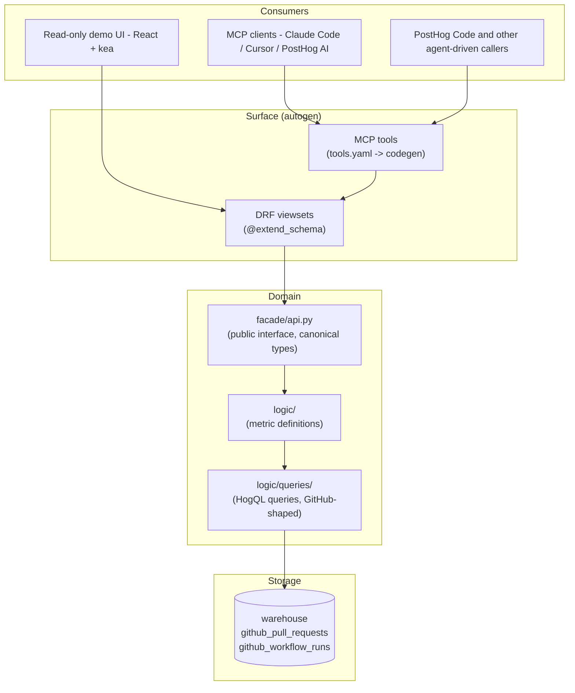
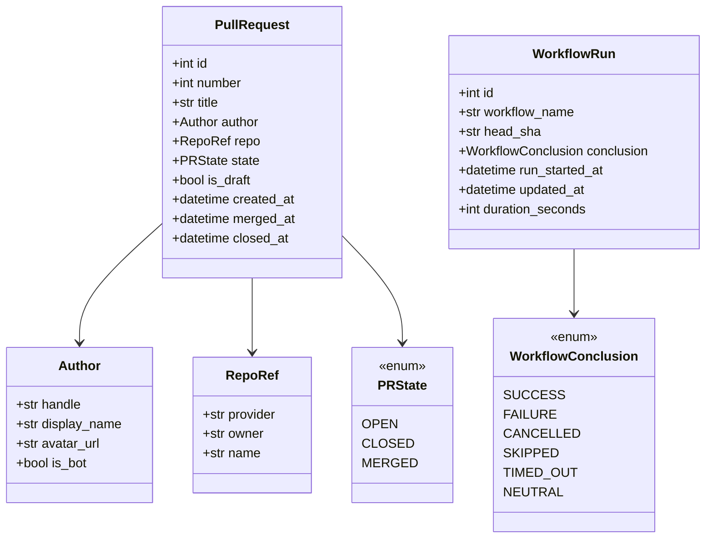

# engineering_analytics — Engineering Spec

Owner: team-devex
Sibling doc: [README.md](./README.md) — read that first for the product picture, motivations, and the wedge. This file is the engineering contract: architecture, canonical types, file layout, ordering.

## 1. Purpose

Engineering contract for the `products/engineering_analytics/` product. The product surfaces PR + CI lifecycle data from the warehouse (`github_pull_requests`, `github_workflow_runs`) as MCP tools and DRF endpoints. Consumers and motivations are in the README.

## 2. Non-goals

- Per-developer surveillance metrics or rankings. Filters operate at cohort level by default.
- Real-time alerting on individual PRs. That's notification surface, not analytics.
- Replacing GitHub's own UI. We surface signal, not the raw PR thread.
- Code-quality static analysis. Different product space.

## 3. Architecture

Rules:

- HogQL via `execute_hogql_query()` is the only data access pattern. No raw ClickHouse `sync_execute()`.
- Django ORM is not used by this product. There is no product Postgres DB in v1 — see README → Locked decisions.
- `logic/queries/` is the only module that names warehouse tables (`github_pull_requests`, `github_workflow_runs`). Logic and facade work with canonical types only.
- One contract feeds both surfaces: DRF viewsets with `@extend_schema` produce OpenAPI → TypeScript types AND MCP tool descriptions. Logic functions are called by both.
- Every MCP-tools PR ships with a matching in-product skill at `skills/<name>/SKILL.md` so the dogfooder has an installed playbook for chaining tool calls — same pattern as `products/visual_review/skills/triaging-visual-review-runs/`.
- Provider abstraction (`CodeHostProvider` Protocol) is **deferred**. GitHub-specific HogQL lives in `logic/queries/` directly; when a second provider lands, the Protocol is extracted then. See §7.

## 4. Canonical types

Defined in `backend/facade/contracts.py` as `pydantic.dataclasses.dataclass(frozen=True)` — same `is_dataclass()` semantics as the stdlib variant (so `DataclassSerializer` works) but with runtime validation at construction. No Django imports.

`is_bot` on `Author` is set inside the query / mapping layer:
`is_bot = handle.endswith("[bot]") OR handle in KNOWN_BOT_HANDLES`.

Tool-specific return types (`WorkflowReport`, `TimeToMerge`, `PRLifecycle`) live in `facade/contracts.py` alongside the canonical types. They wrap rows + a `metric_quality` field per README → Locked decisions.

Types named in the README but not in v1 contracts (reviewers, deploys, file paths) wait until the corresponding warehouse data lands.

## 5. v1 tool catalog

Tools live in `products/engineering_analytics/mcp/tools.yaml`. Each tool description is prompt-engineered — it explains to the calling LLM **when** and **why** to call it, not just the parameter list. Tool return shapes are typed contracts, not free-form prose (README → Locked decisions).

| Tool              | Source data            | Returns                                                                                                    | Quality                                                |
| ----------------- | ---------------------- | ---------------------------------------------------------------------------------------------------------- | ------------------------------------------------------ |
| `workflow_report` | `github_workflow_runs` | `list[WorkflowReportRow]` — workflow name, total runs, success rate, median + p95 duration, last failed at | precise                                                |
| `time_to_merge`   | `github_pull_requests` | `list[TimeToMergeRow]` — `bucket` (overall or per author), pr_count, median + p95 seconds                  | coarse (combines draft + ready-for-review time)        |
| `pr_lifecycle`    | both                   | `PRLifecycle` — PR header + timeline of CI run events                                                      | partial (no reviews/comments until reviews data lands) |

All tools accept `date_from` / `date_to` per PostHog convention (relative `-7d` or ISO8601). Optional `repo` filter on the first two.

UI: one read-only scene rendering `workflow_report` as a horizontal bar chart of slowest workflows. Design system showcase only. No filters, no kea forms, no saved views.

## 6. Delivery shape

Vertical slices, each independently mergeable — a feature PR delivers a complete read path (HogQL → logic → facade → DRF → MCP), not a horizontal layer. The near-term path: this scaffold, then the `github_workflow_runs` source, then the first MCP tools (`workflow_report` + `time_to_merge` + `pr_lifecycle`) with a matching `skills/<name>/SKILL.md`, then the read-only UI scene. Beyond that, sequencing follows the data — see §9.

## 7. Locked decisions

Engineering-specific decisions. Product-level decisions live in README → Locked decisions. If you want to change one, do it in a separate PR with a written reason.

- **HogQL only for analytics data.** No raw ClickHouse.
- **No product Postgres DB.** Saved state lives in the agent's memory; tool calls are stateless. No `db_routing.yaml` entry — analytics data is in the warehouse / ClickHouse (shared infra, nothing to provision). If a product-config model is ever needed, it goes on the **main** DB as a team-scoped model (`TeamScopedRootMixin`), not a separate DB.
- **Provider abstraction deferred.** No `CodeHostProvider` Protocol in v1. GitHub-shaped HogQL lives in `logic/queries/`. The boundary between `logic/queries/` and `logic/` is the future Protocol seam — keep canonical types above it, GitHub-isms below.
- **Canonical types live in `facade/contracts.py`** as frozen dataclasses. No Django imports, no provider-specific fields.
- **CI granularity = workflow level** (`github_workflow_runs`). Job-level breakdown requires a new warehouse endpoint and is deferred.
- **Bot detection** lives in the query / mapping layer: `handle.endswith("[bot]") OR handle in KNOWN_BOT_HANDLES`. Hardcoded allowlist for v1; per-team config deferred.
- **Bots and drafts excluded by default** in PR-listing / cycle-time tools. They are first-class in any future bot-impact analysis (don't strip them everywhere).
- **`time_to_merge` v1** = `merged_at - created_at`. Marked `metric_quality = "coarse"`. Precise companion lands when state-transition data exists.
- **Tool return shapes** = typed pydantic / dataclasses with explicit `metric_quality` marker (`"precise" | "coarse" | "partial"`). Repo convention.

## 8. Deferred (engineering) decisions

Use the current default; revisit when the relevant data lands (§9).

- Team taxonomy (CODEOWNERS vs config file vs author allowlist) — defer until team-level rollups are asked for.
- Cycle time variants (first-commit, ready-for-review, first-approval) — need review + state-transition data.
- Deploy definition (deployment events vs named workflow vs tag push) — decide when deploy data lands.
- Path-based filtering (which files a PR touched) — not in the current snapshot; comes with the lifecycle-event data.
- Commits-till-merged — same; comes with the lifecycle-event data.
- Provider Protocol — wait for a second provider. The query-layer boundary is already drawn to make extraction mechanical.

## 9. Data sources

Available now (warehouse snapshots, queried via HogQL):

- `github_pull_requests` — PR snapshot: number, title, author, state, created_at, merged_at, closed_at, draft flag, base/head refs. Current state only — transitions are overwritten on update.
- `github_workflow_runs` — CI runs: workflow name, status, conclusion, run_started_at, updated_at, head SHA. Each run is immutable, so durations and their trends are precise.

These bound v1 to coarse PR timing (no transition history) and workflow-level CI (no per-check detail).

Beyond v1 the product needs lifecycle data the snapshots can't hold: PR state transitions (draft↔ready), reviews and approvals, per-check/job CI, and deploys. The likely path is **GitHub webhooks → PostHog events, with the PR as a group type** — one mechanism that delivers all of these as immutable timestamped events, while the warehouse snapshots stay as the current-state/backfill layer. PostHog already runs a GitHub App webhook receiver, so this is an analytics handler on existing infra, not new infra. A per-primitive warehouse-source poll is the heavier alternative and still can't recover transition timing, so it's not the plan. See README → "v1 vs the destination".

## 10. Reference reading

- [README.md](./README.md) — product picture, motivations, locked decisions, glossary (read this first)
- `products/architecture.md` — folder structure, isolation rules, tach + import-linter
- `products/README.md` — how to scaffold a product
- `posthog/models/scoping/README.md` — `TeamScopedRootMixin` contract (main-DB team-scoped model, for whenever the first config model lands)
