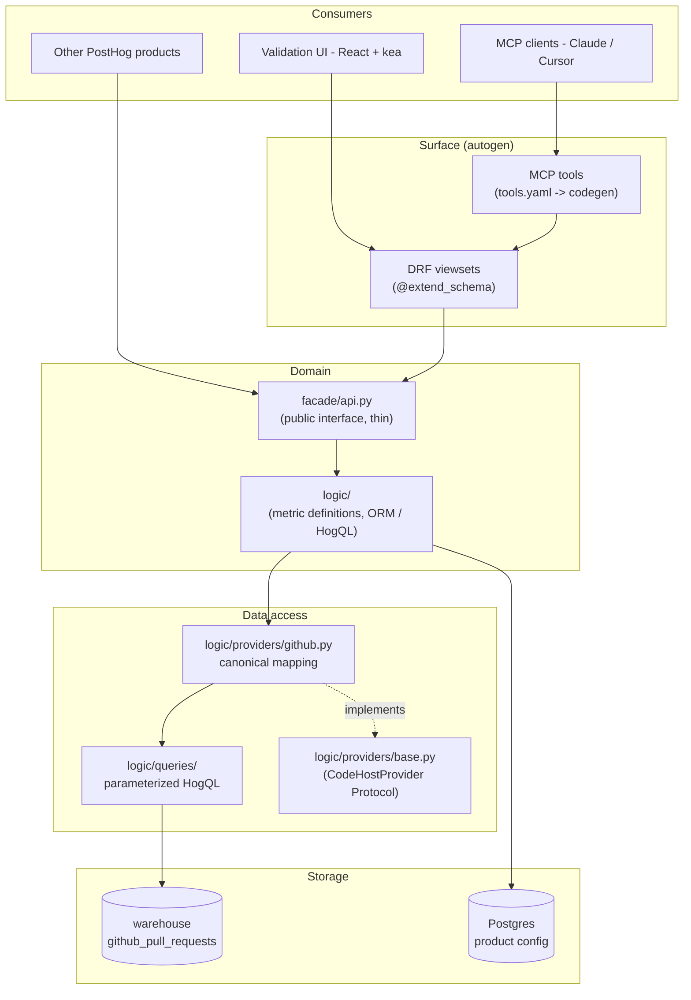
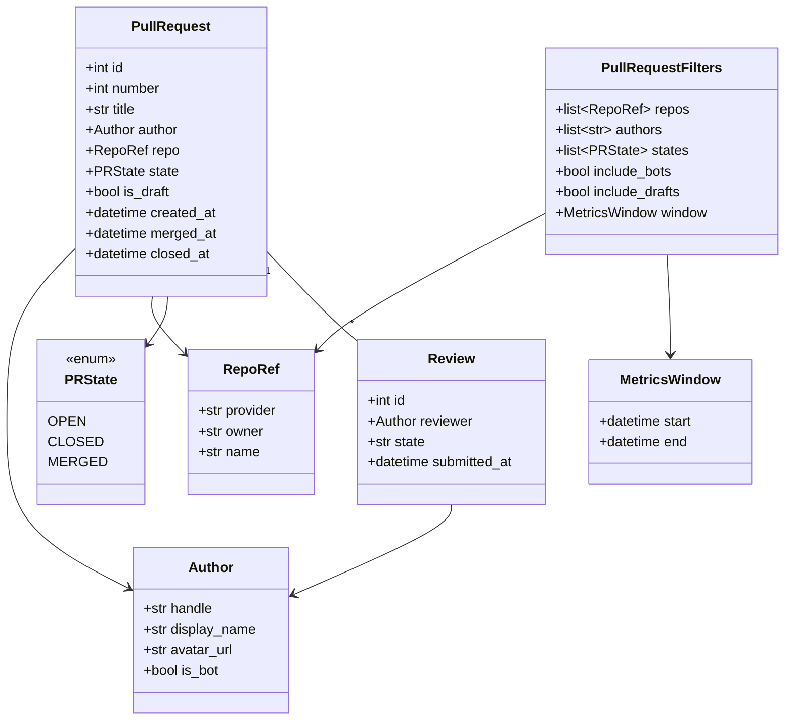
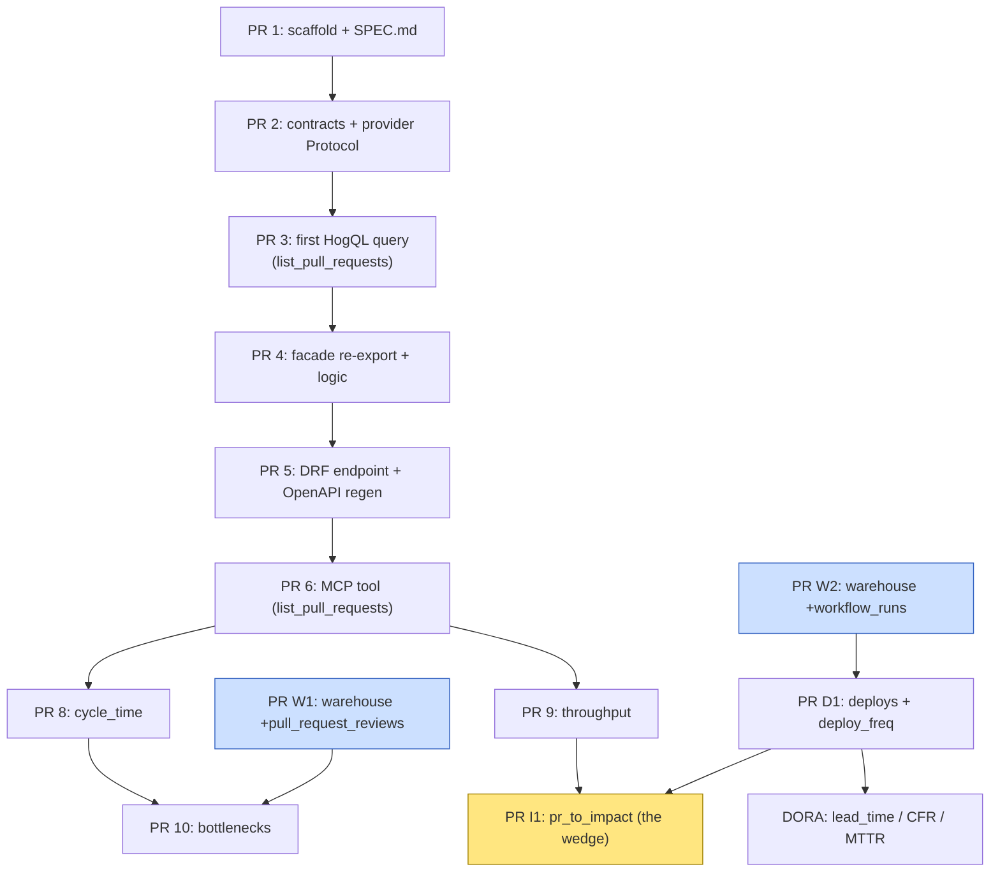

# engineering_analytics — Spec

Owner: team-devex

## 1. Purpose

Build a PostHog product surface over GitHub / GitLab pull-request, CI, and deploy data. Internally dogfooded on PostHog/posthog first. The product is MCP-first — most user interaction happens through MCP tools called from agents (Claude, Cursor). A thin UI exists only to validate that the MCP tools return useful results.

The first surface is PR analytics. Subsequent surfaces add CI / test signals and DORA-style delivery metrics. The long-term wedge — what no competitor (LinearB, Jellyfish, Swarmia, Faros) can ship — is **ship-to-impact**: join PRs and deploys to feature flags, error tracking, surveys, and replays via HogQL to answer "did the code we shipped this week make the product better?"

## 2. Non-goals

- Per-developer surveillance metrics or rankings. Filters are at the cohort level by default.
- Real-time alerting on individual PRs. That's notification surface, not analytics.
- Replacing GitHub's own UI. We surface signal, not the raw PR thread.
- Cross-team benchmarks against external industry data.
- Code-quality static analysis. Different product space.

## 3. Architecture



Rules:

- HogQL via `execute_hogql_query()` is the only data access pattern for analytics data. No raw ClickHouse `sync_execute()`.
- Django ORM is only for product config (saved filters, team settings) — never for warehouse data.
- The provider boundary is semantic, not syntactic. Provider methods return canonical contracts. Provider-specific quirks live entirely inside the provider module — never in `logic/` (above) or `facade/` / `presentation/` (further above).
- One contract feeds both surfaces. DRF viewsets with `@extend_schema` produce OpenAPI → TypeScript types AND MCP tools. Metric definitions live in `logic/` and are called by both.

## 4. Canonical data model

Defined in `backend/facade/contracts.py` (added in PR 2). Frozen dataclasses, no Django imports.



`is_bot` on `Author` is set inside the provider mapping using the rule:
`is_bot = (provider_user_type == "Bot") OR handle.endswith("[bot]") OR handle in KNOWN_BOT_HANDLES`.

## 5. Provider strategy

```mermaid
graph LR
    Proto["CodeHostProvider Protocol<br/>list_pull_requests<br/>get_pull_request<br/>list_reviews<br/>list_workflow_runs<br/>list_deployments<br/>provider_key"]

    GH["GithubProvider<br/>(PR 3)"]
    GL["GitlabProvider<br/>(later)"]
    BB["BitbucketProvider<br/>(if asked)"]

    GHT[(github_pull_requests)]
    GLT[(gitlab_merge_requests)]
    BBT[(bitbucket_pull_requests)]

    Proto <-.implements.- GH
    Proto <-.implements.- GL
    Proto <-.implements.- BB

    GH --> GHT
    GL --> GLT
    BB --> BBT
```

Adding a new provider = implement the Protocol against that provider's warehouse tables. Services and MCP tools must not change.

## 6. PR stack



| PR                               | Status         | Notes                                                                   |
| -------------------------------- | -------------- | ----------------------------------------------------------------------- |
| PR 1 — scaffold + SPEC.md        | open (this PR) | `bin/hogli product:bootstrap` output stripped to clean stubs + this doc |
| PR 2 — contracts + Protocol      | pending        | Real types from §4. Stub `GithubProvider` returns empty lists           |
| PR 3 — first HogQL query         | pending        | `logic/queries.py` + provider impl against `github_pull_requests`       |
| PR 4 — facade + logic            | pending        | `facade/api.py` re-export, narrow public surface                        |
| PR 5 — DRF endpoint              | pending        | `list` action only, `@extend_schema`, regen OpenAPI                     |
| PR 6 — MCP tool                  | pending        | `mcp/tools.yaml` entry, codegen, tool test                              |
| PR W1 — warehouse +reviews       | pending        | Coordinate with Data Warehouse team                                     |
| PR W2 — warehouse +workflow_runs | pending        | Same                                                                    |

Rule: each PR is independently mergeable. Bottom of the stack must be merged before the next is opened for review. Draft PRs only — manual approval to mark ready.

## 7. Locked decisions

These are settled. Do not re-litigate without a written reason in this section.

- **Author identity** — handle-only `Author{handle, display_name, avatar_url, is_bot}`. No mapping to PostHog users in v1.
- **Bot filtering** — `PullRequestFilters.include_bots: bool = False` (default exclude). Detection rule lives inside provider mapping: `type == "Bot" OR handle.endswith("[bot]") OR handle in KNOWN_BOT_HANDLES`. Allowlist seeds: `posthog-bot`, `dependabot[bot]`, `renovate[bot]`, `pre-commit-ci[bot]`.
- **Draft PRs** — `PullRequestFilters.include_drafts: bool = False` (default exclude). Same default across MCP, DRF, UI.
- **Repo scope** — `list[RepoRef]` always. No single-repo assumption baked anywhere.
- **Cycle time** (when we get there) — v1 is `merged_at - created_at`. Variants deferred.
- **Window semantics** — `merged_at` for cycle/throughput; `created_at` for backlog views.
- **Data path** — HogQL on warehouse tables. No raw ClickHouse for analytics. ORM only for product config.

## 8. Deferred decisions

Use the default; revisit when the relevant PR lands.

- Team taxonomy (CODEOWNERS vs config file vs author allowlist) — defer until a user asks for team-level rollups.
- Cycle time variants (first-commit, ready-for-review, first-approval) — deferred until commits + reviews data lands and we have user feedback.
- Deploy definition (Deployments API vs named workflow vs tag push) — defer until PR W2 lands and we see what's most reliable.
- Change failure attribution (revert PR heuristic vs explicit incident link) — defer; default to revert/hotfix-title heuristic in v1.
- Mapping GitHub handles to PostHog users — deferred until "ship-to-impact" PR I1.
- AI-authored PR detection — deferred to the AI-impact surface.

## 9. Data sources

Today:

- GitHub Data Warehouse source connected in the DevEx PostHog project against `PostHog/posthog`. Backfilling `pull_requests` (table `github_pull_requests`), `commits`, `releases`. Sync interval 6h, incremental.

Missing (needs warehouse-source extension):

- `pull_request_reviews` — for review time, bottleneck analysis.
- `workflow_runs` — for CI duration, proper DORA deploys.
- `deployments` — alternative DORA source.

These are tracked as PR W1 / PR W2 in §6 and require the `implementing-warehouse-sources` skill.

## 10. MCP surface (planned)

Tools live in `products/engineering_analytics/mcp/tools.yaml` (added in PR 6). Each tool description is treated as prompt-engineered text — it must explain to the calling LLM **when** and **why** to call it, not just what parameters it accepts.

Initial tool catalog:

| Tool                       | Purpose                                                               |
| -------------------------- | --------------------------------------------------------------------- |
| `list_pull_requests`       | filter by author / repo / state / window — drilldown queries          |
| `get_pull_request_details` | one PR with reviews + checks + linked deploy (post-W1)                |
| `compute_pr_metrics`       | cycle time, review time, size, throughput for a window                |
| `compute_dora_metrics`     | deploy freq, lead time, CFR, MTTR (post-W2)                           |
| `find_bottlenecks`         | where PRs are stuck — waiting review / CI / merge (post-W1)           |
| `compare_windows`          | this week vs last — trend questions                                   |
| `pr_to_impact`             | the wedge — join PR / deploy to feature flag exposure + funnel deltas |

## 11. Lessons from prior closed stacks

This is the **third** PostHog attempt at a related product. The first two abandoned without merging anything:

- **Stack #51818 / #51820 / #51824** (closed 2026-04-21) — CI monitoring v1. Empty test files, scope creep, abandoned.
- **Stack #55316 → #55322** (closed 2026-04-27) — CI monitoring v2 rebuild. 7-PR Graphite rope. Bottom PR (#55316) had ~80 failing Django jobs because v0 declared six models in one initial migration with a separate-DB app without full plumbing. No reviewer ever engaged. Whole stack died together when nothing could build on a red base. The empty `products/ci_monitoring/` directory left on master is the husk of this attempt.

Antibodies we are encoding into this stack:

1. **Each PR mergeable independently.** PR 1 must be on master before PR 2 is opened for review. Graphite makes the stack feel continuous; that's a trap.
2. **PR 1 ships zero business logic.** Just structure, stubs, and this spec. Nothing to be "wrong" about. No new models in v0; defer until ingestion pressure proves the shape.
3. **Vertical slices, not horizontal layers.** Each "feature PR" delivers a complete read path (HogQL → service → DRF → MCP), not a layer.
4. **Draft-only by default.** Reviewer attention is the rate limit; opening 10 drafts is fine, opening 10 "ready for review" is not.
5. **Salvageable nuggets > rope.** If a stack stalls, single PRs land standalone. JUnit parser (from #55322) is the salvage candidate that should ship independently when CI surface needs it.

## 12. Reference reading

- `products/architecture.md` — folder structure, isolation rules, tach + import-linter
- `products/README.md` — how to scaffold a product
- `posthog/models/scoping/README.md` — ProductTeamModel contract
- Closed-stack PRs #55316–#55322 — what not to do
