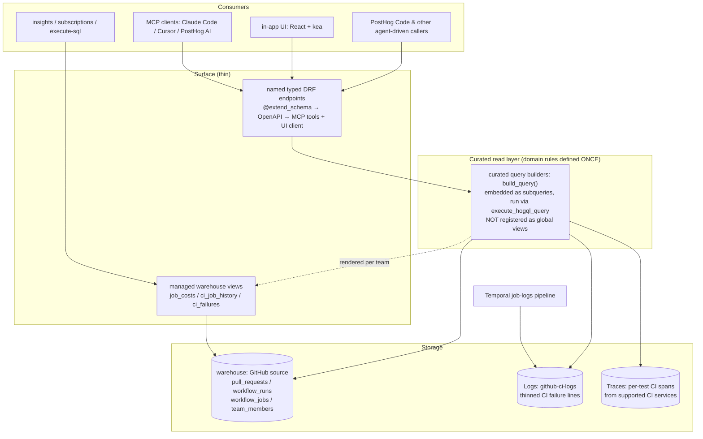

# engineering_analytics: Engineering Spec

Owner: team-devex
Sibling doc: [README.md](./README.md), read that first for the product picture and motivations. This file is the engineering contract: architecture, contracts, locked decisions.

## 1. Purpose

The product surfaces PR + CI data through **named, typed endpoints** that run curated HogQL privately over the warehouse (`github_*` tables), Logs, and Traces. Two first-class surfaces consume the same endpoints: the in-app UI and **MCP tools**. Nothing is registered as a global HogQL view, so the product stays isolated and off the per-query catalog hot path; core imports only the viewset, exactly like `visual_review`.

Reads are the product. The one write is the test-health sidecar (quarantine: issue plus PR through the team's GitHub App), carved out here because this UI is the fastest surface to iterate on it.

The goal is Signals for PostHog Code (README → "The goal"): Signal detection is defined once in `logic/` over the read layer, shared by the surfaces and the Signal emitter. Emission rides the curated builders; it does not wait on lifecycle events.

## 2. Non-goals

- Per-developer surveillance _rankings_, ever. They exist only to compare people.
  - No author leaderboards or cross-author rankings.
  - No per-developer performance/cycle-time scores: no author-scoped "median open→merge", no flaky-rate scoreboard.
  - The author-scoped _page_ is allowed: the author-filtered PR list plus that author's own CI **cost** (transparent spend, not a performance judgement), reachable only from the author links on PR rows.
- Real-time alerting on individual PRs. That's notification surface, not analytics.
- Replacing GitHub's own UI. We surface signal, not the raw PR thread.
- Code-quality static analysis. Different product space.

## 3. Architecture

One general **curated read layer** that every surface composes. The curated query builders are the deep, reusable layer where all domain knowledge lives once; the named endpoints, MCP tools, and the UI are thin consumers above it. The layer runs privately (§1); the only core→product edge is the viewset registration in `posthog/api/`, the standard edge every viewset has. (APOSD: general-purpose lower layer, thin surfaces, domain rules defined once.)

Rules, when adding or changing a capability:

- **Domain knowledge is defined once, in `logic/`.** Bot detection, attribution joins, metric naming, default exclusions: never re-derive them in an endpoint, tool, or the UI.
- **Never hardcode warehouse table names.** The GitHub source prefix is user-chosen; resolve per team and repo via `logic/sources.py`.
- **Never register anything in `Database.create_for`.** Run the builders privately via `execute_hogql_query`; a global view puts the product on every team's per-query hot path.
- **One endpoint set for every consumer.** A capability is a named typed endpoint returning `facade/contracts.py` types; the UI and MCP tools consume that same endpoint (no client-side HogQL, no UI-only read paths), and its `mcp/tools.yaml` entry is set in the same PR.
- **When tools change, update the family skill in `skills/`.** Skills teach tool selection and carry the metric caveats.

## 4. Canonical types

Defined in `backend/facade/contracts.py` as `pydantic.dataclasses.dataclass(frozen=True)`: stdlib `is_dataclass()` semantics (so `DataclassSerializer` works) with runtime validation at construction. No Django imports. Every endpoint returns these typed contracts (objects or lists); there is no untyped row surface.
Caveats ride in the contracts themselves: honest field names (`open_to_merge_seconds`, never `cycle_time`) and, where load-bearing, a typed `metric_quality` field. `contracts.py` is the source of truth for what's modeled.

## 5. Curated read layer & surface

### Curated read layer

One `build_query()` builder per source table in `logic/views/`, embedded as subqueries by the query modules in `logic/queries/` (via `_curated`), mapping columns from the JSON the source already lands.
`source_schema.py` is the locked shape contract for those tables (see §6); the builder code is the source of truth for columns.

### Surface

The endpoint catalog is `presentation/views.py`; the agent-facing descriptions live in `mcp/tools.yaml`. Those are the source of truth, not this file. Every endpoint follows the same design practices:

- Time windows are `date_from` / `date_to`, relative (`-30d`) or ISO8601.
- Capped list contracts that include a sibling aggregate return `{items, truncated, limit}` so they never silently undercount against it.
- Span-derived reads (flaky tests, team CI health) report absolute counts, never rates: sub-threshold runs aren't emitted, so denominators are biased.
- Test evidence is counted per CI run, never per span or run attempt, and all span-derived reads group the same `run_evidence()` so the grain and the meaning of flaky cannot drift. A test is `confirmed_flake` only on same-commit recovery within the same job/configuration: a re-run attempt going green, or an in-job retry. A pass from another shard, segment, configuration, or workflow run proves nothing. Unproven failures rank as `suspected_regression` by blast radius.
- Reads over optional data (e.g. `team_members`) degrade honestly (`has_membership_data: false`), never 500.

### Exposed warehouse views

Three per-team managed views (`DataWarehouseSavedQuery`, kind `engineering_analytics`) expose the curated CI substrate to insights, subscriptions, other products, and `execute-sql`: the only surface where the read layer is reachable as data rather than through the named endpoints.
One gate for all three: a team gets them only when a GitHub source has **both** `workflow_runs` and `workflow_jobs` synced, so they appear together or not at all.
They are non-materialized: the rendered SQL is persisted per team and re-synced on every runs/jobs load, so a builder change reaches active teams within one sync cycle.

#### `engineering_analytics_job_costs`

- Grain: one row per job attempt (a retry appears once per attempt; correct for cost). Jobs whose run row is missing keep NULL attribution rather than being dropped.
- NULL cost is disambiguated by `provider` (non-billable: github-hosted, non-Linux, unclassifiable) vs `completed_at` (unsettled). A queued job is never shown as `$0.00`.
- Cost is defined once, in `logic/cost.py`, rendered to HogQL; a ClickHouse-backed parity test asserts the view equals the Python model. The endpoint cost queries read the same rendered SELECT (via `_curated.job_cost_source()`), so there is no second cost path to drift.

#### `engineering_analytics_ci_job_history`

- The per-job-attempt history with commit attribution, for green/red boundary analysis ("master went red at SHA X, authored by Y, via PR Z").
- Column order is the locked contract (it fixes the UNION ALL order and the saved-query schema): append, never reorder.
- Two PR keys, by design (§6): `pr_number` is the run's `pull_requests` association (0 when absent: master pushes, fork PRs); `commit_pr_number` is parsed from the head commit's squash-merge suffix, which is how a master push gets PR attribution at all.
- Commit attribution joins the raw runs table on `run_id` alone, never `run_attempt`: the runs snapshot upserts by id so only the newest attempt's row exists, and attribution is attempt-invariant (a re-run is the same commit).

#### `engineering_analytics_ci_failures`

- Row-level fingerprinted CI failure lines read from the **Logs** product, one row per pytest `FAILED <nodeid>` line. Team-global (logs aren't source-scoped) but gated with the other two views.
- `fingerprint` = test id plus normalized error signature (volatile hex/digits collapsed): the group key across runs.
- The recipe lives in code, not a stored materialization, on purpose: it is pytest-only and must evolve by PR as more runners (jest, playwright, cargo) get covered.

## 6. Locked decisions

Engineering-specific decisions. Product-level decisions live in README → Locked decisions. If you want to change one, do it in a separate PR with a written reason.

- **CI ↔ PR linkage is by PR number, never by head SHA: one rule, every surface, including the Logs reads.**
  - `pr_number` (the run's `pull_requests` association, keyed with repo, `> 0`) is the attribution key. The PR snapshot keeps only the current head, so a head-SHA join silently drops every push but the latest.
  - `head_branch` is the capture-time / pre-PR / fork fallback (fork runs have an empty association). Branches are reused, so branch-keyed reads must be time-bounded.
  - `head_sha` is per-commit precision only, and always the webhook head SHA, never the ephemeral `refs/pull/N/merge` SHA.
  - Attribution is a possibly-empty, possibly-multi set (a run ↔ PR is 0..N); the read layer credits a run to the first PR in its association.
- **Warehouse columns are strings + Nullable JSON; the builders parse and `ifNull`-guard.** Timestamps parse via `parseDateTimeBestEffort`; Nullable columns unwrap before any array function (ClickHouse rejects an Array inside a Nullable). `source_schema.py` mirrors the real landed types so seed and tests exercise the real path; violating this 500'd every endpoint on real data while idealized fixtures stayed green.
- **The warehouse views are managed data, not code registration.** "No global HogQL views" locks out `Database.create_for` (core importing the product, every team's per-query hot path). A per-team `DataWarehouseSavedQuery`, synced only for qualifying teams, reopens nothing: it exists so cost and CI history are queryable by insights, subscriptions, and `execute-sql`.
- **CI Signals use immutable evidence.** Flaky checks require job rows from `github_workflow_jobs` showing a failed attempt followed by a successful later attempt for the same `(run_id, job)`. The run snapshot alone cannot prove this transition. Broken-default-branch detection reads GitHub's reported `repository.default_branch` and gates on the rate over runs that reached a verdict (cancelled and skipped runs decide nothing). Duration comparisons require enough successful samples because the percentiles exclude failed and cancelled runs. All three conditions carry a week-stable `source_id`, and the coordinator records each emitted key in `SignalEmissionRecord` so an hourly sweep doesn't re-emit the same standing condition within its week. For broken-default-branch that means one signal per week per workflow, accepting that a distinct second breakage of the same workflow inside one week dedupes into the first rather than minting a signal (and a ledger row) per completed run.
- **HogQL only for analytics data.** No raw ClickHouse.
- **No product Postgres DB.** Analytics data lives in the warehouse / ClickHouse; any product-config model goes on the main DB as a team-scoped model (`TeamScopedRootMixin`), never a separate DB.
- **No author leaderboards or per-developer performance rankings; the author page is allowed.** The surveillance risk is ranking people against each other, not an engineer viewing their own PRs and CI cost. The page is reachable only from PR-row author links; `author_workflow_costs` stays a UI-only read (MCP `enabled: false`).
- **Bot detection, defined once:** `handle.endswith("[bot]") OR handle in KNOWN_BOT_HANDLES`. Hardcoded allowlist; per-team config deferred.
- **Bots and drafts excluded by default** in throughput / cycle-time reads; first-class in bot-impact analysis, so never strip them at the substrate.
- **Time to merge** = `open_to_merge_seconds` = `merged_at - created_at`, coarse (draft + ready combined) until state-transition events exist.
- **Team ownership is stamped at CI emission time, never mirrored server-side.** The CI emitter resolves repository-relative test paths with `OwnersResolver` over distributed `owners.yaml` files (`products/*/product.yaml` is an alias) and stamps the first active team owner as `test.owner_team`. `.github/CODEOWNERS` is only an approval gate and is never parsed for this product. Unstamped spans aggregate as the first-class telemetry bucket `unowned`. Capture-time truth is intentional: a test belongs to whoever owned it when the signal was captured. A bounded trusted-master heartbeat emits the active primary team catalog once per run so the Teams page also includes code-owning teams with zero recent spans. The server reads the catalog; it does not reimplement ownership resolution. Team surfaces stay team-level: author→team joins (via the `team_members` snapshot) produce aggregates only, never per-member figures or cross-team rankings; missing membership degrades with `has_membership_data: false` and never removes a code-owning team.
- **No provider abstraction until a second code host lands.** GitHub-isms stay below the builder boundary, canonical types above it; that seam makes extracting a `CodeHostProvider` Protocol mechanical.

## 7. Data sources

Warehouse tables (GitHub source):

- `github_pull_requests`: PR snapshot. Current state only; transitions are overwritten on update.
- `github_workflow_runs`: CI runs. Webhook-only (the webhook is the source of truth; history is a deliberate one-off backfill). A settled run never changes, so durations and trends are precise; until settled, `status` / `conclusion` mutate (see the freshness caveat).
- `github_workflow_jobs`: per-job attempts (runner labels, queue and duration timestamps), the cost substrate. Webhook stream plus a window-limited backfill poll; per-run polling is infeasible at this volume.
- `github_team_members`: org team membership, the author→team key. Optional at the source; every read that touches it must degrade gracefully when unsynced.

Other products read as sources:

- Logs: the thinned CI failure lines this product's job-logs pipeline emits (`service.name = github-ci-logs`), keyed by `run_id`.
- Traces: per-test CI spans emitted by supported backend (`pytest`) and frontend (`jest`) CI services, plus the ownership-catalog heartbeat (`trace_spans`), behind recent test-health signals and team CI health. Fast ordinary passes are omitted, so the product exposes absolute counts only.

### Test reporter follow-ups

1. Playwright: adapt `.github/workflows/ci-e2e-playwright.yml`'s `junit-results-playwright` artifact (`playwright/junit-results.xml`) to the shared reporter. Normalize the Playwright project/browser and retry into the job/configuration key, and preserve attempt-suffixed artifacts before enabling cross-attempt recovery.
2. Rust: upload `.github/workflows/ci-rust.yml`'s `rust/junit-nextest-*.xml` files for the shared reporter. Normalize package, test binary, test identity, ignored outcomes, and nextest retry semantics, then add attempt preservation before recognizing recovery.

Both adapters must reuse repository-relative ownership, run-attempt emission, and the existing surface queries. Neither should change the API vocabulary.

**Freshness caveat:** a run's `conclusion` settles via the `workflow_run` webhook, which can lag or miss deliveries; the read layer surfaces `status` honestly rather than implying a settled conclusion.

Lifecycle data the snapshots can't hold (PR state transitions, reviews/approvals, deploys, DORA) needs immutable timestamped events (GitHub webhooks → PostHog events, PR as group type). That is the only thing the deferred events destination is for. See README → "The data boundary".

## 8. Reference reading

- `docs/published/handbook/engineering/ai/implementing-mcp-tools.md`: MCP tool design (DRF endpoint → OpenAPI → MCP tool)
- `products/visual_review/backend/presentation/`: the precedent for a facade product whose DRF endpoints back both MCP tools and the UI, with core importing only the viewset
- `products/architecture.md`: folder structure, isolation rules, tach + import-linter
