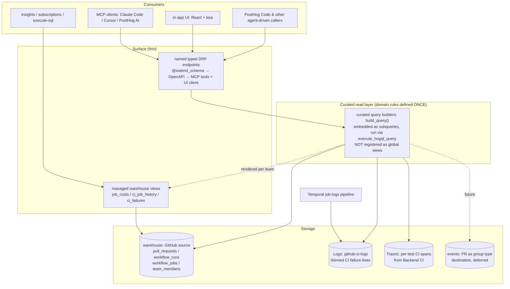

# engineering_analytics — Engineering Spec

Owner: team-devex
Sibling doc: [README.md](./README.md) — read that first for the product picture, motivations, and the wedge. This file is the engineering contract: architecture, canonical types, file layout, ordering.

## 1. Purpose

The product surfaces PR + CI data through **named, typed endpoints** that run curated HogQL privately over the warehouse (`github_*` tables), Logs, and Traces. Two first-class surfaces consume the same endpoints: the in-app UI and **MCP tools**; keep `mcp/tools.yaml` current whenever endpoints change. Nothing is registered as a global HogQL view, so the product stays isolated and off the per-query catalog hot path; core imports only the viewset, exactly like `visual_review`.

Reads are the product. The one write is the test-health sidecar (quarantine: issue plus PR through the team's GitHub App), carved out here because this UI is the fastest surface to iterate on it.

The goal is Signals for PostHog Code (README → "The goal"): Signal detection is defined once in `logic/` over the read layer, shared by the surfaces and the future emitter. Emission rides the curated builders; it does not wait on lifecycle events.

## 2. Non-goals

- Per-developer surveillance _rankings_, ever. They exist only to compare people.
  - No author leaderboards or cross-author rankings.
  - No per-developer performance/cycle-time scores: no author-scoped "median open→merge", no flaky-rate scoreboard.
  - The author-scoped _page_ is allowed: the author-filtered PR list plus that author's own CI **cost** (transparent spend, not a performance judgement), reachable only from the author links on PR rows.
- Real-time alerting on individual PRs. That's notification surface, not analytics.
- Replacing GitHub's own UI. We surface signal, not the raw PR thread.
- Code-quality static analysis. Different product space.

## 3. Architecture

One general **curated read layer** that every surface composes. The curated query builders are the deep, reusable layer where all domain knowledge lives once; the named endpoints, MCP tools, and the UI are thin consumers above it. The layer runs privately (§1); the only core→product edge is the viewset registration in `posthog/api/`, the standard edge every viewset has. (APOSD: general-purpose lower layer, thin surfaces, domain rules defined once.)

Rules, when adding or changing a capability:

- **Domain knowledge is defined once, in `logic/`.** Bot detection, attribution joins, metric naming, default exclusions: never re-derive them in an endpoint, tool, or the UI.
- **Never hardcode warehouse table names.** The GitHub source prefix is user-chosen; resolve per team and repo via `logic/sources.py`.
- **Never register anything in `Database.create_for`.** Run the builders privately via `execute_hogql_query`; a global view puts the product on every team's per-query hot path.
- **One endpoint set for every consumer.** A capability is a named typed endpoint returning `facade/contracts.py` types; the UI and MCP tools consume that same endpoint (no client-side HogQL, no UI-only read paths), and its `mcp/tools.yaml` entry is set in the same PR.
- **When tools change, update the family skill in `skills/`.** Skills teach tool selection and carry the metric caveats.

## 4. Canonical types

Defined in `backend/facade/contracts.py` as `pydantic.dataclasses.dataclass(frozen=True)`: stdlib `is_dataclass()` semantics (so `DataclassSerializer` works) with runtime validation at construction. No Django imports. Every endpoint returns these typed contracts (objects or lists); there is no untyped row surface.
Caveats ride in the contracts themselves: honest field names (`open_to_merge_seconds`, never `cycle_time`) and, where load-bearing, a typed `metric_quality` field. `contracts.py` is the source of truth for what's modeled.

## 5. Curated read layer & surface

### Curated read layer

One `build_query()` builder per source table in `logic/views/`, embedded as subqueries by the query modules in `logic/queries/` (via `_curated`), mapping columns from the JSON the source already lands.
`source_schema.py` is the locked shape contract for those tables (see §6); the builder code is the source of truth for columns.

### Surface

The endpoint catalog is `presentation/views.py`; the agent-facing descriptions live in `mcp/tools.yaml`. Those are the source of truth, not this file. Every endpoint follows the same design practices:

- Time windows are `date_from` / `date_to`, relative (`-30d`) or ISO8601.
- Capped lists return `{items, truncated, limit}`; never silently undercount against a sibling aggregate.
- Span-derived reads (flaky tests, team CI health) report absolute counts, never rates: sub-threshold runs aren't emitted, so denominators are biased.
- Reads over optional data (e.g. `team_members`) degrade honestly (`has_membership_data: false`), never 500.

### Exposed warehouse views

Three per-team managed views (`DataWarehouseSavedQuery`, kind `engineering_analytics`) expose the curated CI substrate to insights, subscriptions, other products, and `execute-sql`: the only surface where the read layer is reachable as data rather than through the named endpoints.
One gate for all three: a team gets them only when a GitHub source has **both** `workflow_runs` and `workflow_jobs` synced, so they appear together or not at all.
They are non-materialized: the rendered SQL is persisted per team and re-synced on every runs/jobs load, so a builder change reaches active teams within one sync cycle.

#### `engineering_analytics_job_costs`

- Grain: one row per job attempt (a retry appears once per attempt; correct for cost). Jobs whose run row is missing keep NULL attribution rather than being dropped.
- NULL cost is disambiguated by `provider` (non-billable: github-hosted, non-Linux, unclassifiable) vs `completed_at` (unsettled). A queued job is never shown as `$0.00`.
- Cost is defined once, in `logic/cost.py`, rendered to HogQL; a ClickHouse-backed parity test asserts the view equals the Python model. The endpoint cost queries read the same rendered SELECT (via `_curated.job_cost_source()`), so there is no second cost path to drift.

#### `engineering_analytics_ci_job_history`

- The per-job-attempt history with commit attribution, for green/red boundary analysis ("master went red at SHA X, authored by Y, via PR Z").
- Column order is the locked contract (it fixes the UNION ALL order and the saved-query schema): append, never reorder.
- Two PR keys, by design (§6): `pr_number` is the run's `pull_requests` association (0 when absent: master pushes, fork PRs); `commit_pr_number` is parsed from the head commit's squash-merge suffix, which is how a master push gets PR attribution at all.
- Commit attribution joins the raw runs table on `run_id` alone, never `run_attempt`: the runs snapshot upserts by id so only the newest attempt's row exists, and attribution is attempt-invariant (a re-run is the same commit).

#### `engineering_analytics_ci_failures`

- Row-level fingerprinted CI failure lines read from the **Logs** product, one row per pytest `FAILED <nodeid>` line. Team-global (logs aren't source-scoped) but gated with the other two views.
- `fingerprint` = test id plus normalized error signature (volatile hex/digits collapsed): the group key across runs.
- The recipe lives in code, not a stored materialization, on purpose: it is pytest-only today and must evolve by PR as more runners (jest, playwright, cargo) get covered.

## 6. Locked decisions

Engineering-specific decisions. Product-level decisions live in README → Locked decisions. If you want to change one, do it in a separate PR with a written reason.

- **Signals emission for PostHog Code is the goal; the substrate is shaped for it.** Valuable CI conditions are surfaced as Signals via the Signals product's `emit_signal()` for PostHog Code to act on. Detection of what counts as a valuable Signal is defined once in `logic/` over the read layer, so the emitter and the MCP/SQL surface share one definition — never re-derived in the UI. The emission contract (source taxonomy, thresholds, autonomy priority) is owned by the Signals product; nothing in the read substrate or surfaces may foreclose it.
- **Curated read layer, run privately; MCP is the official surface via named typed endpoints.** _(Changed — reason:)_ registering the curated views in the global HogQL catalog (`Database.create_for`, the `revenue_analytics` precedent) inverts the dependency — core imports the product — and runs on the per-query hot path for **every** team. Running the curated `build_query()` as subqueries from the product's own DRF endpoints keeps domain rules defined once while leaving the product isolated and off the hot path: core imports only the viewset, exactly like `visual_review`. The endpoints back both the MCP tools and the UI, so there is no parallel read path. (This restructure is the written reason for changing the prior "registered substrate + generic SQL surface" decision.)
- **`metric_quality` is a typed field on `pr_lifecycle`; aggregate endpoints carry caveats in field names + docs.** _(Changed — reason:)_ the aggregate endpoints return typed lists, so the coarse/staleness caveats ride in honest field names (`open_to_merge_seconds`) and serializer/tool descriptions — structurally hard to misread. `pr_lifecycle` keeps the typed `metric_quality` field (`partial`) where the assembly's incompleteness is load-bearing.
- **The `engineering_analytics_job_costs` warehouse view does not reopen "no global HogQL view registration".** The locked-out thing is `Database.create_for` _code_ registration that inverts the dependency (core imports the product) and runs on every team's per-query hot path. This view is the opposite: team-scoped managed _data_ (a `DataWarehouseSavedQuery` synced only for teams with a GitHub source), created by the same managed-viewset mechanism revenue analytics uses. Core never imports the product to serve it, and teams without a synced GitHub source have no view at all. The cost model stays defined once in `logic/cost.py` (rendered to HogQL, guarded by a parity test); the view exists so cost is queryable by insights / subscriptions / other products / `execute-sql`, which the named endpoints alone don't cover. See §5 → Exposed warehouse view.
- **No new ingestion to support v1 UI.** Repo identity, labels, and `is_bot` are mapped from the warehouse JSON already landed; the PR↔CI status is a head-SHA join. All in the read layer.
- **HogQL only for analytics data.** No raw ClickHouse.
- **No product Postgres DB.** Tool calls are stateless; saved/stateful state is a later, separate decision. No `db_routing.yaml` entry — analytics data lives in the warehouse / ClickHouse. If a product-config model is ever needed, it goes on the **main** DB as a team-scoped model (`TeamScopedRootMixin`), not a separate DB.
- **Provider abstraction deferred.** No `CodeHostProvider` Protocol in v1. GitHub-shaped HogQL lives in the read layer; that boundary is the future Protocol seam — keep canonical types above it, GitHub-isms below.
- **Canonical types live in `facade/contracts.py`** as frozen dataclasses (for the named deep tools). No Django imports, no provider-specific fields.
- **CI granularity = workflow level** (`github_workflow_runs`). Per-check/job breakdown requires a new warehouse endpoint (`github_workflow_jobs`) and is deferred — it is the prerequisite for honest per-PR Depot **cost** (cost is job-level: a run fans into parallel jobs on different runner tiers, so run-level data carries no tier and undercounts). Until it lands, the read layer exposes per-PR **pushes** (distinct head SHAs that triggered CI) and **re-run cycles** (`run_attempt > 1`), attributing runs to a PR via each run's `pull_requests` association — an equality join on PR number, not a head-SHA join (the snapshot is current-state, so a SHA join drops prior pushes). `estimated_cost_usd` is a typed scaffold (always null) until then; the cost model (tier-rate ladder + label→tier parser) lives in `logic/cost.py`.
- **CI ↔ PR linkage is by PR number (the run's `pull_requests` association), never by head SHA — one rule, every surface.** The curated `ci_rollup` / `runs_by_pr`, `pr_runs` / `pr_cost` / `pr_lifecycle`, and the CI **failure-logs** surface all attribute the same way. Three keys, three roles:
  - **`pr_number`** — _the attribution key_. Taken from each run's `pull_requests`, keyed on `(repo_owner, repo_name, pr_number)` with `pr_number > 0`. Stable across pushes; a head-SHA join silently drops every push but the latest, because the `github_pull_requests` snapshot retains only the current head — undercounting exactly the multi-push PRs.
  - **`head_branch`** — _capture-time / pre-PR / fork fallback_. The agent (and the LLM-cost join) can stamp the branch before a PR exists, and fork-originated runs carry a branch even though GitHub leaves their `pull_requests` **empty** (a documented, unresolved security limitation). Branch is reused across PRs over time, so branch-keyed reads must be time-bounded.
  - **`head_sha`** — _per-commit precision only_, never the attribution key. Always the run/job webhook head SHA (the branch tip = `gh pr view --json headRefOid`); **never** the ephemeral `pull_request` merge SHA (`refs/pull/N/merge`), which is checked out but is not a real commit.
  - Cardinality: a run ↔ PR is **0..N** (push-only runs and fork PRs have no association; one commit can head several PRs). Treat pr_number attribution as a possibly-empty, possibly-multi set, never a guaranteed single value. v1 credits a run to the **first** PR in its association (see `pr_runs`).
  - **The Logs surface inherits this.** Emitted CI failure logs carry `attributes['run_id']` (plus `job_id` / `branch` / `conclusion`); `ci_failure_logs` resolves a PR to its run_ids through the same `pull_requests` attribution (reusing `pr_runs`), then filters the Logs product by `run_id` — no head-SHA join, no merge SHA, all pushes captured. Fork PRs (no association) degrade to a run_id / branch lookup.
- **Warehouse columns are strings + Nullable JSON; the builders parse and `ifNull`-guard.** The real GitHub source lands timestamps as strings and the nested objects (`user`/`head`/`base`/`labels`/`repository`/`pull_requests`) as Nullable. Curated builders therefore parse every timestamp with HogQL `parseDateTimeBestEffort` (which maps to ClickHouse `parseDateTime64BestEffortOrNull` — that raw CH name is not exposed in HogQL) and `ifNull`-unwrap any Nullable column before an array function (`JSONExtractArrayRaw` / `splitByChar`), because ClickHouse rejects an Array nested inside a Nullable. `source_schema.py` mirrors these exact types so the seed and tests exercise the real path — violating this contract 500'd every endpoint on real data while idealized-fixture tests stayed green.
- **No author leaderboards or per-developer performance rankings — but the author page and its cost breakdown are allowed.** _(Changed — reason:)_ the v1 UI first grew an authors tab, hub leaderboards, per-author _performance_ tiles (median open→merge, re-run cycles), and an `author_workflow_costs` endpoint; a follow-up removed **all** of it, including the author page and its cost breakdown, and locked "no author surface, ever". That over-corrected: the surveillance risk is in _ranking people against each other_ (leaderboards, cross-author cycle-time/flaky scores), not in an engineer opening their own page to see their PRs and what their CI runs cost. So the line is drawn at rankings, not at the author page:
  - **Removed and kept out:** the authors tab/list, hub author leaderboards, and per-developer _performance_ metrics (median open→merge, flaky/re-run scores) as author-scoped surfaces. Don't re-add a ranked, cross-author aggregate.
  - **Restored:** the author page — the shared PR table filtered to one author, plus that author's own CI **cost** (windowed spend tiles + the `author_workflow_costs` split-by-workflow breakdown). Cost is transparent spend, not a performance judgement, and the page is reachable only from the author links on PR rows (no list, no ranking of one author against another). The `author_workflow_costs` endpoint stays a UI-only read (its MCP tool is `enabled: false`); attribution is by PR number (SPEC §6), same as every other cost surface.
- **Bot detection** defined once in the read layer: `handle.endswith("[bot]") OR handle in KNOWN_BOT_HANDLES`. Hardcoded allowlist for v1; per-team config deferred.
- **Bots and drafts excluded by default** in throughput / cycle-time recipes (an explicit column flag + a default filter the skill applies). First-class in any future bot-impact analysis — don't strip them at the substrate.
- **Time to merge v1** = `open_to_merge_seconds` = `merged_at - created_at`, coarse (combines draft + ready-for-review time). The precise companion lands with state-transition data.

## 7. Deferred (engineering) decisions

Use the current default; revisit when the relevant data lands (§8).

- Team taxonomy: **resolved** (team-level rollups were asked for). Ownership is the repo's own map (`products/*/product.yaml` + CODEOWNERS, first listed owner on the rare multi-owner path), resolved **at CI emission time** where the repo is checked out and stamped onto the emitted spans (`test.owner_team`). No server-side ownership mirror, no per-team config model, no author allowlist. Capture-time truth is intentional: a test is attributed to whoever owned it when it flaked. Unstamped spans aggregate as `unowned`. Team surfaces aggregate owned code surfaces, plus one sanctioned member-level aggregation. _(Changed, reason:)_ the earlier "never member activity" line predates the warehouse `team_members` snapshot (GitHub org team membership) landing as a source endpoint; a DevEx reader prioritizing CI work needs the team's delivery context (time to merge), and code-surface ownership cannot attribute a PR to a team until changed-file data lands. `team_merge_trend` therefore joins PR author login to GitHub team membership, under hard limits that keep §2 intact: team-level aggregates only (median/average), no per-member figures or splits inside a team page, no cross-team rankings, bots excluded. The GitHub team slug is a second namespace beside the ownership slug; they are matched by exact slug and a mismatch yields an empty team series, never another team's data.
- Cycle time variants (first-commit, ready-for-review, first-approval) — need review + state-transition data.
- Deploy definition (deployment events vs named workflow vs tag push) — decide when deploy data lands.
- Path-based filtering (which files a PR touched) — not in the current snapshot; comes with the lifecycle-event data.
- Commits-till-merged — same; comes with the lifecycle-event data.
- Provider Protocol — wait for a second provider. The read-layer boundary is already drawn to make extraction mechanical.
- Stateful / persisted UI (saved views, persisted filters) — a separate decision once the read-only scene proves out.
- Cost attribution (agent-token and CI-minute cost per PR). Token cost is an LLM analytics join: the `$ai_*_cost_usd` properties on generation events, resolved to a PR by **branch** (head ref → `github_pull_requests.head.ref`), not `head_sha` — the PR snapshot is current-state-only, so a SHA join matches only the latest push and drops every earlier one (undercount). The agent can stamp the branch at capture time even though the PR doesn't exist yet. _(Changed — reason: the cost lens on the PR page needs the PR lifetime window + head_ref, both owned here, so this product now owns the branch→PR token-spend rollup on `pr_cost` — the `llm_spend` component. LLM analytics keeps the trace-level cost surfaces.)_ The lever is _cost per outcome_, which needs the lifecycle + git history data above (revert/fixup graph, changed files).
  `llm_spend` attribution propagates within an AI session (`$ai_session_id`, falling back to `$ai_trace_id`), not just per-event: when a session's first non-base-branch stamp is the PR's head ref, the pre-branch lead-in (unstamped or base-ref-stamped events) counts too, and later unstamped events follow the most recently stamped branch. The full rule — and why base-ref stamps are neutral — is stated once in `logic/queries/llm_spend.py`; the PR-lifetime window + repo guard stay the outer filter on every counted event.
  The branch → PR resolution this join relies on exists as the `resolve_branch` endpoint: a cross-product caller (LLM analytics) passes a git branch and gets back the PR(s) it belongs to, resolving against `head.ref` — the one place that attribution is defined, so callers don't re-derive it. It is the read seam for linking a git branch to a PR.

## 8. Data sources

Available now (warehouse snapshots, read via the curated query builders):

- `github_pull_requests` — PR snapshot: number, title, author, state, created_at, merged_at, closed_at, draft flag, base/head refs, **labels and `base.repo.full_name` in the raw JSON** (mapped in the read layer, not new ingestion). Current state only — transitions are overwritten on update.
- `github_workflow_runs` — CI runs: workflow name, status, conclusion, run_started_at, updated_at, head SHA, **`run_attempt` and the `pull_requests` association** (the per-PR push / re-run rollup keys on these). Each run is immutable, so durations and their trends are precise.
- `github_team_members`: GitHub org team membership (member login with the parent team's id/slug/name injected per row), the author→team key behind `team_merge_trend`. Optional and off by default at the source (needs the org Members: Read grant), so every read that touches it must degrade gracefully when it isn't synced.

Landing (the cost substrate, via a new warehouse source):

- `github_workflow_jobs` — per-job CI: `run_id` (joins back to `github_workflow_runs` for per-PR attribution), `run_attempt`, `name`, `workflow_name`, `status`, `conclusion`, `head_sha`, `head_branch`, `labels` (runner tier → cost), `runner_name`, `runner_group_name`, `created_at` / `started_at` / `completed_at` (queue + duration), nested `steps`. Each job is immutable, so per-job duration, queue wait, retries, and cost are precise. The locked column/type contract is `source_schema.py:WORKFLOW_JOBS_COLUMNS` — the source must land exactly that shape (string timestamps, Nullable JSON) or the curated builders 500 on real data (§6). It lands in the **warehouse**, not events: a steady-state **webhook stream** plus a **bounded-lookback backfill poll**. An unbounded continuous poll is rejected — one `/jobs` call per run is infeasible at this repo's run volume — so backfill is window-limited and the webhook carries steady state.

These bound v1 to coarse PR timing (no transition history); per-check/job CI arrives with `github_workflow_jobs`.

**Freshness caveat:** `github_workflow_runs` syncs on a `created_at` watermark and does not refresh the conclusion of a run that completes after newer runs land — so a PR's "failing / running" CI status can be stale until the `workflow_run` webhook ships. The read layer should surface the run's `status` honestly rather than imply a settled conclusion.

Two distinct future needs, with two distinct substrates — don't conflate them:

- **Job-level CI (cost / queue / retry / runner) → the warehouse**, via the `github_workflow_jobs` source above. Jobs are immutable, so the warehouse is the right home: a webhook stream for steady state plus a bounded backfill poll. This is the plan for cost and it is landing now; the read layer wires `estimated_cost_usd` from its typed-null scaffold to a real figure once the table is populated. What was rejected is an **unbounded continuous poll** (one `/jobs` call per run, infeasible at this repo's volume) — not the warehouse as a destination.
- **Lifecycle data the snapshots genuinely can't hold** — PR state transitions (draft↔ready), reviews and approvals, deploys, DORA — needs immutable timestamped **events** (GitHub webhooks → PostHog events, PR as group type). No warehouse snapshot or poll can recover transition timing, so this is the _only_ thing the events destination is for, and it stays deferred until prioritized. When it lands, the deferred UI columns (time-in-review, reviewers/approvals, DORA) open up on the same read layer. See README → "v1 vs the destination".

## 9. Reference reading

- [README.md](./README.md) — product picture, motivations, locked decisions, glossary (read this first)
- `docs/published/handbook/engineering/ai/implementing-mcp-tools.md` — MCP tool design (DRF endpoint → OpenAPI → MCP tool)
- `products/visual_review/backend/presentation/` — the precedent for a facade product whose DRF endpoints back both MCP tools and the UI, with core importing only the viewset (no global-catalog registration)
- `posthog/hogql/query.py` (`execute_hogql_query`) — how the product runs its curated HogQL privately, without a `Database.create_for` registration
- `products/architecture.md` — folder structure, isolation rules, tach + import-linter
- `posthog/models/scoping/README.md` — `TeamScopedRootMixin` contract (main-DB team-scoped model, for whenever the first config model lands)
