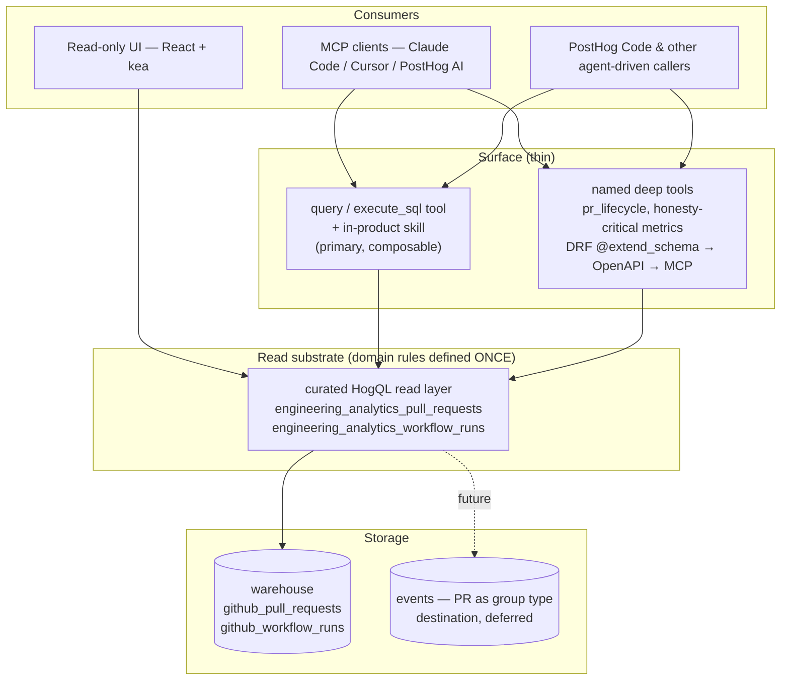
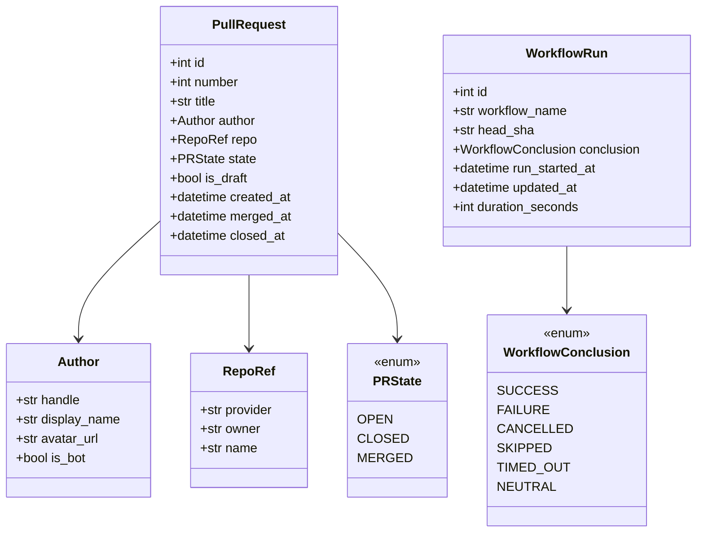

# engineering_analytics — Engineering Spec

Owner: team-devex
Sibling doc: [README.md](./README.md) — read that first for the product picture, motivations, and the wedge. This file is the engineering contract: architecture, canonical types, file layout, ordering.

## 1. Purpose

Engineering contract for the `products/engineering_analytics/` product. The product surfaces PR + CI lifecycle data from the warehouse (`github_pull_requests`, `github_workflow_runs`) through a curated HogQL read layer. **MCP is the official surface**; a read-only UI is built on the same read layer. Consumers and motivations are in the README.

The **goal** is to surface these as **Signals** for PostHog Code: valuable CI conditions are emitted into PostHog's [Signals](../signals) product, grouped and researched against the repository, and acted on autonomously when a finding is actionable. The read substrate + MCP serve that goal directly — what counts as a valuable CI Signal is defined once in `logic/` over the read layer, reused by both the surface and the emitter — and the UI is a showcase over the same layer.

## 2. Non-goals

- Per-developer surveillance metrics or rankings. Filters operate at cohort level by default.
- Real-time alerting on individual PRs. That's notification surface, not analytics.
- Replacing GitHub's own UI. We surface signal, not the raw PR thread.
- Code-quality static analysis. Different product space.

## 3. Architecture

One general **read substrate** that every surface composes. The substrate is the deep, reusable layer where all domain knowledge lives once; MCP, the UI, and any named tools are thin consumers above it. (APOSD: general-purpose lower layer, thin surfaces, domain rules defined once.)

Rules:

- **Read substrate = a curated HogQL read layer** over the warehouse tables: two per-team `SavedQuery` views (`engineering_analytics_pull_requests`, `engineering_analytics_workflow_runs`) built in `backend/logic/views/` and registered in `Database.create_for`, following the `revenue_analytics` precedent (`build_all_*_views(team)` gated on the team having the `github_*` source tables). Repo identity (`base.repo.full_name`), labels, `is_bot`, and the PR↔CI head-SHA join are mapped here **from the JSON the source already lands — no new ingestion**. Domain rules (bot detection, default exclusions, the join, honest metric naming) are defined exactly **once**, here. The contract is "one named HogQL surface the query tool and the UI can both `SELECT` from".
- **MCP is the official surface.** The generic `query` / `execute_sql` tool over the read layer, paired with the in-product skill, is the primary composable surface — the repo's prescribed analytics-MCP path (`docs/.../implementing-mcp-tools.md` step 3). A small set of **named deep tools** sits on top only for genuine assembly (`pr_lifecycle`) or where a metric caveat is load-bearing; these are DRF viewsets with `@extend_schema` that flow to MCP via OpenAPI codegen.
- **The UI reads the same read layer** via HogQL query runners (kea) — not bespoke report endpoints. This is what makes a richer read-only scene reachable later without rearchitecting.
- HogQL only. No raw ClickHouse `sync_execute()`. No product Postgres DB.
- The curated read layer (and `logic/queries/`) is the only place that names warehouse tables or GitHub-shaped columns. Canonical types stay above it.
- Every named-tool PR ships a matching `skills/<name>/SKILL.md`. The skill is also where composition recipes **and metric caveats for the SQL surface** live — same pattern as `products/visual_review/skills/triaging-visual-review-runs/`.
- Provider abstraction (`CodeHostProvider` Protocol) is **deferred**. GitHub-specific HogQL lives in the read layer; when a second provider lands, the Protocol is extracted then. See §7.

## 4. Canonical types

Defined in `backend/facade/contracts.py` as `pydantic.dataclasses.dataclass(frozen=True)` — same `is_dataclass()` semantics as the stdlib variant (so `DataclassSerializer` works) but with runtime validation at construction. No Django imports. These back the **named deep tools** and any cross-product use; the SQL surface returns rows shaped by the read layer's columns.

`is_bot` on `Author` is set inside the read layer: `is_bot = handle.endswith("[bot]") OR handle in KNOWN_BOT_HANDLES`.

Named deep tools return typed contracts (e.g. `PRLifecycle`) carrying a `metric_quality` field where the caveat is load-bearing. For the SQL surface, metric quality is carried by **honest column naming + the skill** (see §7).

Types named in the README but not yet modeled (reviewers, deploys, file paths) wait until the corresponding data lands.

## 5. Read substrate & surface

### Read layer (the substrate)

Two curated HogQL tables over the existing warehouse data — columns mapped from JSON we already store, **no new ingestion**. Column names encode caveats so a misread is defined out of existence (`open_to_merge_seconds`, never `cycle_time`).

- `engineering_analytics_pull_requests` — `number`, `title`, `author_handle`, `is_bot`, `repo_owner` / `repo_name` (from `base.repo.full_name`), `labels`, `state`, `is_draft`, `created_at`, `merged_at`, `closed_at`, `head_sha`, `open_to_merge_seconds` (coarse — see §7).
- `engineering_analytics_workflow_runs` — `workflow_name`, `head_sha`, `conclusion`, `status`, `run_started_at`, `updated_at`, `duration_seconds`, `repo_owner` / `repo_name`.

A PR's current CI status is the head-SHA join between the two; defined once in the read layer.

### Surface

- **MCP (official):** `query` / `execute_sql` over the two tables, guided by the skill — the primary, composable surface. Plus named deep tools where they earn their keep:
  - `pr_lifecycle` — PR header + ordered CI-run timeline (a genuine assembly; `metric_quality = "partial"` until reviews/deploys land).
  - a typed time-to-merge tool **only if** the coarse caveat needs to be un-loseable in a typed return; otherwise it's a documented query recipe in the skill.
- **UI:** a read-only scene built on HogQL over the read layer — a PR list (CI status, CI duration, age), the count cards (open / stuck >7d / failing CI), and a workflow-health view. Read-only; **no saved views or stateful filters in this phase** (persisted/stateful surfaces are a later, separate decision). Columns that need deferred data — time-in-review, reviewers/approvals, per-check counts, DORA — are out until the event substrate lands (§9).

All time-windowed access uses `date_from` / `date_to` per PostHog convention (relative `-7d` or ISO8601).

## 6. Delivery shape

Vertical slices, each independently mergeable. The near-term path:

1. scaffold — **done**.
2. `github_workflow_runs` warehouse source — **done**.
3. **read substrate** (the two curated HogQL tables, domain rules defined once) + the in-product skill + the `pr_lifecycle` deep tool.
4. read-only UI scene on the substrate (PR list + cards + workflow health).
5. destination: GitHub webhooks → events (PR as group type) — unlocks the deferred columns (§9).

The earlier "three report endpoints" approach (`workflow_report` / `time_to_merge` / `pr_lifecycle` as bespoke RPC tools) is **superseded** by the substrate-plus-SQL surface; `pr_lifecycle` survives as the one genuine deep tool. See §7 for why.

The goal these slices build toward: emit valuable CI Signals from the read substrate into the Signals product for PostHog Code. That emission rides on the read layer — it does not wait on the events destination — and reuses the `logic/` detection that backs the MCP surface.

## 7. Locked decisions

Engineering-specific decisions. Product-level decisions live in README → Locked decisions. If you want to change one, do it in a separate PR with a written reason.

- **Signals emission for PostHog Code is the goal; the substrate is shaped for it.** Valuable CI conditions are surfaced as Signals via the Signals product's `emit_signal()` for PostHog Code to act on. Detection of what counts as a valuable Signal is defined once in `logic/` over the read layer, so the emitter and the MCP/SQL surface share one definition — never re-derived in the UI. The emission contract (source taxonomy, thresholds, autonomy priority) is owned by the Signals product; nothing in the read substrate or surfaces may foreclose it.
- **Read substrate = curated HogQL read layer; MCP is the official surface.** _(Changed — reason:)_ the repo's MCP convention is atomic capabilities composed by agents, with skills teaching composition (`implementing-mcp-tools.md`), and its prescribed analytics path is a HogQL system table + a `querying-posthog-data` reference. A SQL-over-substrate surface is also more APOSD-faithful (one deep general mechanism, thin surfaces, domain rules defined once — no information leakage across per-report endpoints) and is the only shape that lets the read-only UI consume the **same** data without a parallel read path. Bespoke `*_report` RPC tools are not the surface.
- **`metric_quality` is carried by honest column naming + the skill, plus a typed field on named deep tools where load-bearing.** _(Changed — reason:)_ a SQL/substrate surface returns rows, not typed contracts, so the "typed `metric_quality` field on every tool" rule cannot hold there. Encoding the caveat in the column name (`open_to_merge_seconds`) makes the misread structurally impossible, and the skill carries the nuance for composition. The typed field stays on named deep tools (e.g. `pr_lifecycle`) where free composition can't be trusted to preserve it.
- **No new ingestion to support v1 UI.** Repo identity, labels, and `is_bot` are mapped from the warehouse JSON already landed; the PR↔CI status is a head-SHA join. All in the read layer.
- **HogQL only for analytics data.** No raw ClickHouse.
- **No product Postgres DB.** Tool calls are stateless; saved/stateful state is a later, separate decision. No `db_routing.yaml` entry — analytics data lives in the warehouse / ClickHouse. If a product-config model is ever needed, it goes on the **main** DB as a team-scoped model (`TeamScopedRootMixin`), not a separate DB.
- **Provider abstraction deferred.** No `CodeHostProvider` Protocol in v1. GitHub-shaped HogQL lives in the read layer; that boundary is the future Protocol seam — keep canonical types above it, GitHub-isms below.
- **Canonical types live in `facade/contracts.py`** as frozen dataclasses (for the named deep tools). No Django imports, no provider-specific fields.
- **CI granularity = workflow level** (`github_workflow_runs`). Per-check/job breakdown requires a new warehouse endpoint and is deferred.
- **Bot detection** defined once in the read layer: `handle.endswith("[bot]") OR handle in KNOWN_BOT_HANDLES`. Hardcoded allowlist for v1; per-team config deferred.
- **Bots and drafts excluded by default** in throughput / cycle-time recipes (an explicit column flag + a default filter the skill applies). First-class in any future bot-impact analysis — don't strip them at the substrate.
- **Time to merge v1** = `open_to_merge_seconds` = `merged_at - created_at`, coarse (combines draft + ready-for-review time). The precise companion lands with state-transition data.

## 8. Deferred (engineering) decisions

Use the current default; revisit when the relevant data lands (§9).

- Team taxonomy (CODEOWNERS vs config file vs author allowlist) — defer until team-level rollups are asked for.
- Cycle time variants (first-commit, ready-for-review, first-approval) — need review + state-transition data.
- Deploy definition (deployment events vs named workflow vs tag push) — decide when deploy data lands.
- Path-based filtering (which files a PR touched) — not in the current snapshot; comes with the lifecycle-event data.
- Commits-till-merged — same; comes with the lifecycle-event data.
- Provider Protocol — wait for a second provider. The read-layer boundary is already drawn to make extraction mechanical.
- Stateful / persisted UI (saved views, persisted filters) — a separate decision once the read-only scene proves out.

## 9. Data sources

Available now (warehouse snapshots, queried via the curated HogQL read layer):

- `github_pull_requests` — PR snapshot: number, title, author, state, created_at, merged_at, closed_at, draft flag, base/head refs, **labels and `base.repo.full_name` in the raw JSON** (mapped in the read layer, not new ingestion). Current state only — transitions are overwritten on update.
- `github_workflow_runs` — CI runs: workflow name, status, conclusion, run_started_at, updated_at, head SHA. Each run is immutable, so durations and their trends are precise.

These bound v1 to coarse PR timing (no transition history) and workflow-level CI (no per-check detail).

**Freshness caveat:** `github_workflow_runs` syncs on a `created_at` watermark and does not refresh the conclusion of a run that completes after newer runs land — so a PR's "failing / running" CI status can be stale until the `workflow_run` webhook ships. The read layer should surface the run's `status` honestly rather than imply a settled conclusion.

Beyond v1 the product needs lifecycle data the snapshots can't hold: PR state transitions (draft↔ready), reviews and approvals, per-check/job CI, and deploys. The likely path is **GitHub webhooks → PostHog events, with the PR as a group type** — one mechanism that delivers all of these as immutable timestamped events, while the warehouse snapshots stay as the current-state/backfill layer. PostHog already runs a GitHub App webhook receiver, so this is an analytics handler on existing infra, not new infra. When it lands, the deferred UI columns (time-in-review, reviewers/approvals, per-check, DORA) become available on the same read layer. A per-primitive warehouse-source poll is the heavier alternative and still can't recover transition timing, so it's not the plan. See README → "v1 vs the destination".

## 10. Reference reading

- [README.md](./README.md) — product picture, motivations, locked decisions, glossary (read this first)
- `docs/published/handbook/engineering/ai/implementing-mcp-tools.md` — MCP tool design (atomic capabilities; query-over-tables + skill for analytics data)
- `products/posthog_ai/skills/querying-posthog-data/` — the precedent for a query-over-tables + skill analytics surface
- `products/revenue_analytics/backend/views/` (`RevenueAnalyticsBaseView(SavedQuery)` + `orchestrator.build_all_revenue_analytics_views`) — the precedent for code-shipped, per-team HogQL views over warehouse data
- `posthog/hogql/database/models.py` (`SavedQuery`) and `posthog/hogql/database/database.py` (`Database.create_for` registration hook) — where the curated views are defined and registered
- `products/architecture.md` — folder structure, isolation rules, tach + import-linter
- `posthog/models/scoping/README.md` — `TeamScopedRootMixin` contract (main-DB team-scoped model, for whenever the first config model lands)
