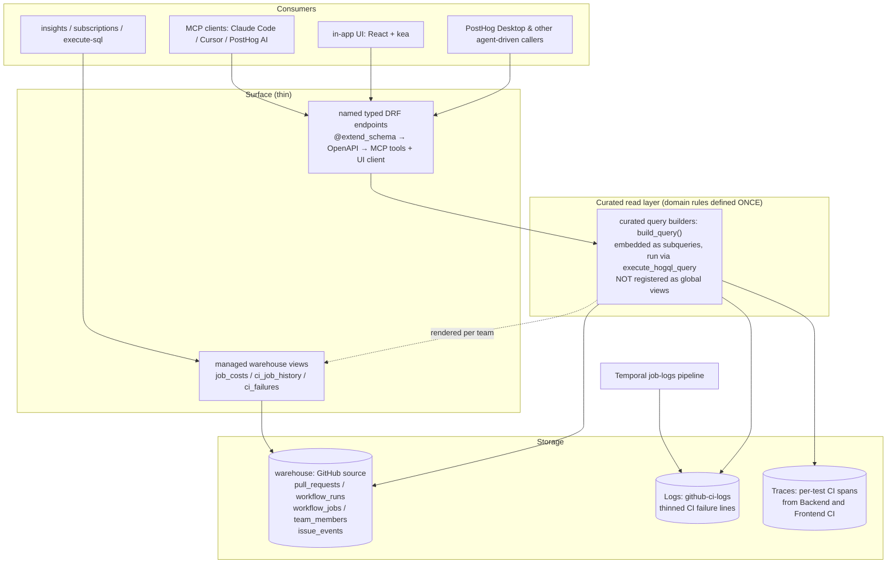

# engineering_analytics: Engineering Spec

Owner: team-devex
Sibling doc: [README.md](./README.md), read that first for the product picture and motivations. This file is the engineering contract: architecture, contracts, locked decisions.

## 1. Purpose

The product surfaces PR + CI data through **named, typed endpoints** that run curated HogQL privately over the warehouse (`github_*` tables), Logs, and Traces. Two first-class surfaces consume the same endpoints: the in-app UI and **MCP tools**. Nothing is registered as a global HogQL view, so the product stays isolated and off the per-query catalog hot path; core imports only the viewset, exactly like `visual_review`.

Reads are the product. The one write is the test-health sidecar (quarantine: issue plus PR through the team's GitHub App), reachable via the API and MCP tool; the test-health UI itself is the Trunk quarantine debt scoreboard.

The goal is Signals for PostHog Desktop (README → "The goal"): Signal detection is defined once in `logic/` over the read layer, shared by the surfaces and the Signal emitter. Emission rides the curated builders; it does not wait on lifecycle events.

## 2. Non-goals

- Per-developer surveillance _rankings_, ever. They exist only to compare people.
  - No author leaderboards or cross-author rankings.
  - No per-developer performance/cycle-time scores: no author-scoped "median open→merge", no flaky-rate scoreboard.
  - The author-scoped _page_ is allowed: the author-filtered PR list plus that author's own CI **cost** (transparent spend, not a performance judgement), reachable only from the author links on PR rows.
- Real-time alerting on individual PRs. That's notification surface, not analytics.
- Replacing GitHub's own UI. We surface signal, not the raw PR thread.
- Code-quality static analysis. Different product space.

## 3. Architecture

One general **curated read layer** that every surface composes. The curated query builders are the deep, reusable layer where all domain knowledge lives once; the named endpoints, MCP tools, and the UI are thin consumers above it. The layer runs privately (§1); the only core→product edge is the viewset registration in `posthog/api/`, the standard edge every viewset has. (APOSD: general-purpose lower layer, thin surfaces, domain rules defined once.)

```mermaid
graph TB
    subgraph Consumers
        MCP["MCP clients: Claude Code / Cursor / PostHog AI"]
        UI["in-app UI: React + kea"]
        Other["PostHog Desktop & other agent-driven callers"]
        SQL["insights / subscriptions / execute-sql"]
    end

    subgraph "Surface (thin)"
        Endpoints["named typed DRF endpoints<br/>@extend_schema → OpenAPI → MCP tools + UI client"]
        WV["managed warehouse views<br/>job_costs / ci_job_history / ci_failures"]
    end

    subgraph "Curated read layer (domain rules defined ONCE)"
        Sys["curated query builders: build_query()<br/>embedded as subqueries, run via execute_hogql_query<br/>NOT registered as global views"]
    end

    subgraph Storage
        WH[("warehouse: GitHub source<br/>pull_requests / workflow_runs<br/>workflow_jobs / team_members<br/>issue_events")]
        LOGS[("Logs: github-ci-logs<br/>thinned CI failure lines")]
        TRACES[("Traces: per-test CI spans<br/>from Backend and Frontend CI")]
    end

    JL["Temporal job-logs pipeline"] --> LOGS
    MCP --> Endpoints
    UI --> Endpoints
    Other --> Endpoints
    SQL --> WV
    Endpoints --> Sys
    Sys -. "rendered per team" .-> WV
    WV --> WH
    Sys --> WH
    Sys --> LOGS
    Sys --> TRACES
```

Rules, when adding or changing a capability:

- **Domain knowledge is defined once, in `logic/`.** Bot detection, attribution joins, metric naming, default exclusions: never re-derive them in an endpoint, tool, or the UI.
- **Never hardcode warehouse table names.** The GitHub source prefix is user-chosen; resolve per team and repo via `logic/sources.py`.
- **Never register anything in `Database.create_for`.** Run the builders privately via `execute_hogql_query`; a global view puts the product on every team's per-query hot path.
- **One endpoint set for every consumer.** A capability is a named typed endpoint returning `facade/contracts.py` types; the UI and MCP tools consume that same endpoint (no client-side HogQL, no UI-only read paths), and its `mcp/tools.yaml` entry is set in the same PR.
- **When tools change, update the family skill in `skills/`.** Skills teach tool selection and carry the metric caveats.

## 4. Canonical types

Defined in `backend/facade/contracts.py` as `pydantic.dataclasses.dataclass(frozen=True)`: stdlib `is_dataclass()` semantics (so `DataclassSerializer` works) with runtime validation at construction. No Django imports. Every endpoint returns these typed contracts (objects or lists); there is no untyped row surface.
Caveats ride in the contracts themselves: honest field names (`open_to_merge_seconds`, never `cycle_time`) and, where load-bearing, a typed `metric_quality` field. `contracts.py` is the source of truth for what's modeled.

## 5. Curated read layer & surface

### Curated read layer

One `build_query()` builder per source table in `logic/views/`, embedded as subqueries by the query modules in `logic/queries/` (via `_curated`), mapping columns from the JSON the source already lands.
`source_schema.py` is the locked shape contract for those tables (see §6); the builder code is the source of truth for columns.

### Surface

The endpoint catalog is `presentation/views.py`; the agent-facing descriptions live in `mcp/tools.yaml`. Those are the source of truth, not this file. Every endpoint follows the same design practices:

- Time windows are `date_from` / `date_to`, relative (`-30d`) or ISO8601.
- Capped list contracts that include a sibling aggregate return `{items, truncated, limit}` so they never silently undercount against it.
- Span-derived reads (flaky tests, team CI health) report absolute counts, never rates: sub-threshold runs aren't emitted, so denominators are biased.
- Test evidence is counted per CI run, never per span or run attempt (one run fans a test across matrix legs, and every attempt re-tests the same commit), and both span-derived reads group the same `run_evidence()` so the grain and the meaning of flaky cannot drift. A test is `confirmed_flake` only on same-commit recovery proof: a re-run attempt going green, or an in-job retry. Unproven failures rank as `suspected_regression` by blast radius.
- Reads over optional data (e.g. `team_members`) degrade honestly (`has_membership_data: false`), never 500.

### Exposed warehouse views

Three per-team managed views (`DataWarehouseSavedQuery`, kind `engineering_analytics`) expose the curated CI substrate to insights, subscriptions, other products, and `execute-sql`: the only surface where the read layer is reachable as data rather than through the named endpoints.
One gate for all three: a team gets them only when a GitHub source has **both** `workflow_runs` and `workflow_jobs` synced, so they appear together or not at all.
They are non-materialized: the rendered SQL is persisted per team and re-synced on every runs/jobs load, so a builder change reaches active teams within one sync cycle.

#### `engineering_analytics_job_costs`

- Grain: one row per job attempt (a retry appears once per attempt; correct for cost). Jobs whose run row is missing keep NULL attribution rather than being dropped.
- Joins jobs to runs on `run_id` alone, never `(run_id, run_attempt)` — same key and same reason as `ci_job_history`: the runs snapshot keeps only the newest attempt's row, so attempt equality blanks attribution for every earlier-attempt job, which after a partial re-run is exactly the population that executed. Attribution is attempt-invariant.
- NULL cost is disambiguated by `provider` (non-billable: github-hosted, non-Linux, unclassifiable), `completed_at` (unsettled), or `is_rerun_copy` (never executed). A queued job is never shown as `$0.00`.
- `is_rerun_copy` marks the rows GitHub re-lists but never ran (see §6). They are kept, not dropped — the grain and the row count stay identical to `ci_job_history` — but carry no `billable_seconds` / `estimated_cost_usd`.
- Cost runs off Depot's billed clock, not `duration_seconds` (§6). `billable_seconds` is that clock; `duration_seconds` stays the full wall-clock GitHub reports.
- Cost is defined once, in `logic/cost.py`, rendered to HogQL; a ClickHouse-backed parity test asserts the view equals the Python model. The endpoint cost queries read the same rendered SELECT (via `_curated.job_cost_source()`), so there is no second cost path to drift.
- `is_merge_queue` splits merge-queue gate spend from the rest without anyone re-deriving what a gate branch is. Both this view and `ci_job_history` carry it, so neither answers "what does the queue cost" by pattern-matching a branch name.
- **The view carries no scan floor, so filter it tightly.** It is stored SQL with no window of its own, and the `is_rerun_copy` window means an unfiltered `SELECT` sorts the team's whole job history. Insights and `execute-sql` should bound `created_at` (and, for a scan the engine can actually prune, keep the bound close). The product's own endpoint queries pass `created_floor` instead (§6).

#### `engineering_analytics_ci_job_history`

- The per-job-attempt history with commit attribution, for green/red boundary analysis ("master went red at SHA X, authored by Y, via PR Z").
- Column order is the locked contract (it fixes the UNION ALL order and the saved-query schema): append, never reorder.
- `is_rerun_copy` rides here too (§6), so a green/red boundary or duration read can drop the re-listed rows instead of counting one execution twice.
- Two PR keys, by design (§6): `pr_number` is the run's `pull_requests` association (0 when absent: master pushes, fork PRs), or the PR a merge-queue gate branch was landing when `is_merge_queue`; `commit_pr_number` resolves the merged PR that produced the head commit, which is how a master push gets PR attribution at all.
- Commit attribution joins the raw runs table on `run_id` alone, never `run_attempt`: the runs snapshot upserts by id so only the newest attempt's row exists, and attribution is attempt-invariant (a re-run is the same commit).

#### `engineering_analytics_ci_failures`

- Row-level fingerprinted CI failure lines read from the **Logs** product, one row per pytest `FAILED <nodeid>` line. Team-global (logs aren't source-scoped) but gated with the other two views.
- `fingerprint` = test id plus normalized error signature (volatile hex/digits collapsed): the group key across runs.
- The recipe lives in code, not a stored materialization, on purpose: it is pytest-only and must evolve by PR as more runners (jest, playwright, cargo) get covered.

## 6. Locked decisions

Engineering-specific decisions. Product-level decisions live in README → Locked decisions. If you want to change one, do it in a separate PR with a written reason.

- **CI ↔ PR linkage is by PR number, never by head SHA: one rule, every surface, including the Logs reads.**
  - `pr_number` (the run's `pull_requests` association, keyed with repo, `> 0`) is the attribution key. The PR snapshot keeps only the current head, so a head-SHA join silently drops every push but the latest.
  - `head_branch` is the capture-time / pre-PR / fork fallback (fork runs have an empty association). Branches are reused, so branch-keyed reads must be time-bounded.
  - `head_sha` is per-commit precision only, and always the webhook head SHA, never the ephemeral `refs/pull/N/merge` SHA.
  - Attribution is a possibly-empty, possibly-multi set (a run ↔ PR is 0..N); the read layer credits a run to the first PR in its association.
  - **Only association entries whose `base.repo.id` is the run's own `repository.id` count.** GitHub lists every PR in the fork network sharing the run's head SHA, so a default-branch push arrives carrying downstream forks' "sync from upstream" PRs; reading the first entry unfiltered attributed those runs to a stranger's PR number under our own owner/name.
  - `commit_pr_number` is the complementary key and the only PR attribution a default-branch push has. It resolves through the merged PR's `merge_commit_sha` (the commit GitHub records at merge _is_ the run's `head_sha`), and falls back to the head commit's `(#NNNN)` squash-merge suffix when the PR snapshot can't serve it: a repo with no `pull_requests` endpoint synced, or a PR row not landed yet. Consumers read `pr_number` first and fall back to `commit_pr_number`; both are defined once in the `workflow_runs` builder.
  - **The `merge_commit_sha` lookup is not the head-SHA join banned above.** That ban is about resolving a run through a PR's _current head_, which the snapshot overwrites on every push. `merge_commit_sha` on a **merged** PR is terminal: written once at merge, one commit per PR, so it drops nothing. It must be gated on `merged_at`, because GitHub also fills it on an open PR with the throwaway commit from a test merge. The index is deduped to one row per SHA, because a raw join on a non-unique key fans one run row into several and multiplies every downstream count.
- **Merge-queue gate branches are CI artifacts, not work — defined once in `logic/merge_queue.py`.** A merge queue (Trunk's `/trunk merge`, GitHub's native queue) lands a PR by pushing a throwaway branch with that PR's commits rebased onto trunk, running the full suite there, and merging only if it stays green. GitHub records that branch as a pull request, so on this repo a third of PR rows and ~13% of CI spend belong to gate attempts.
  - Gate PRs are dropped in the `pull_requests` builder. They carry no diff, never merge, and no PR surface can act on one, so they are not the bot/draft case (which stays a per-read default so bot-impact analysis can still see bots).
  - A gate run's `pr_number` resolves through its branch (`trunk-merge/pr-<n>/…`), not its `pull_requests` association — the association names the throwaway PR. This is not the head-SHA join banned above: the branch name is immutable for the branch's life and names exactly one PR. `ci_job_history.is_merge_queue` keeps the two populations separable. The same resolution runs over the CI test spans, where the emitter stamps the gate PR from the webhook payload and would otherwise make one test failing across N merge attempts read as N distinct PRs in every blast-radius count.
  - A failure on a gate branch that never reached trunk classifies as `blocking_merge_queue`, not `pr_only`: the commit had already passed the PR's own CI, which is the semantic-conflict class the queue exists to catch.
  - A queue that batched several PRs onto one gate branch would break the one-PR assumption; that needs a new branch shape in `merge_queue.py`, not a new rule at each call site.
- **Depot bills from the first step, not from `started_at` — the cost model uses a billed clock.** GitHub stamps a job's `started_at` the moment Depot accepts it; the machine then boots before "Set up job" runs, and Depot bills only the time after the job started running. The gap is tens of seconds per job (the other end, last step -> `completed_at`, is negligible), a few percent of billed minutes at scale. So `billed_elapsed = duration_seconds - provisioning_seconds` (clamped >= 0).
  - `provisioning_seconds` (the curated jobs builder) is `started_at` -> the first `steps` entry's `started_at`, and NULL when the `steps` payload is missing or empty. NULL subtracts nothing: an under-correction is honest, an over-correction is not.
  - `duration_seconds` is deliberately left alone — queue and duration UX is about the window GitHub reports. Only the cost columns read the billed clock, and `logic/cost.py` defines it once for both the Python model and the rendered SQL.
- **A GitHub "re-run failed jobs" copy is not an execution — flagged once, in the `workflow_jobs` builder.** When a run is partially re-run, GitHub's jobs API lists every already-passed job again under the new `run_attempt` with new job ids but the earlier attempt's exact `started_at` / `completed_at` (`filter=latest` returns them too, so the source can't drop them). A row is a copy when the same `(run_id, name, started_at, completed_at)` exists at a lower `run_attempt`; `is_rerun_copy` says so, and `logic/cost.py`'s `render_is_billable_job` is the one predicate every cost consumer partitions on. Copies are a few percent of job rows and minutes; counting them over-reported CI spend, retry pressure, and duration samples by that much.
  - Copies are flagged, never filtered at the substrate: the exposed views keep one row per job attempt, matching what GitHub shows for the run, and each consumer decides. Cost drops them; so do the per-job aggregates (a copy would double every duration sample and report a retry nobody performed). Red/green reads keep them — a copy is a green re-listing of a green job, so it changes no verdict.
  - The flag is a window over `(run_id, name, started_at, completed_at)`, which blocks a caller's outer `created_at_raw` predicate from pruning the scan. Windowed callers pass `created_floor=True` so the same coarse floor lands **below** the window instead (see the `workflow_jobs` builder); `job_costs.build_query` and `_curated.job_cost_source()` thread it through for the cost surfaces.
  - The floor's slack depends on which clock the query windows (`_workflow_filters`). One day when it filters the job's own `created_at` — that only absorbs a timezone offset. A week when it filters the RUN's start, which every cost surface does: a re-run's runs row carries only its newest attempt's `run_started_at`, so its earlier attempts' job rows — the ones that actually ran — were created before the window. A tight floor there would cut them and silently under-report the re-run, undoing the `run_id`-only join above.
  - Two cost queries stay unfloored on purpose: single-PR cost and the PR-list cost rollup are keyed by PR number, not a window, and no cheap date bound exists for either (see `pr_cost.py`). The per-run job breakdown is unfloored too — it filters `run_id`, the window's leading partition column.
- **Warehouse columns are strings + Nullable JSON; the builders parse and `ifNull`-guard.** Timestamps parse via `parseDateTimeBestEffort`; Nullable columns unwrap before any array function (ClickHouse rejects an Array inside a Nullable). `source_schema.py` mirrors the real landed types so seed and tests exercise the real path; violating this 500'd every endpoint on real data while idealized fixtures stayed green.
- **The warehouse views are managed data, not code registration.** "No global HogQL views" locks out `Database.create_for` (core importing the product, every team's per-query hot path). A per-team `DataWarehouseSavedQuery`, synced only for qualifying teams, reopens nothing: it exists so cost and CI history are queryable by insights, subscriptions, and `execute-sql`.
- **CI Signals use immutable evidence.** Flaky checks require job rows from `github_workflow_jobs` showing a failed attempt followed by a successful later attempt for the same `(run_id, job)`. The run snapshot alone cannot prove this transition. Broken-default-branch detection reads GitHub's reported default branch from the PR snapshot's `base.repo`, the only full repository object in the tables this product reads (`query_default_branches` documents why the runs snapshot cannot answer it). A repo with no PR rows resolves nothing and is skipped: `repo_overview`'s master/main run-volume guess stays a display approximation, because a P1 needs GitHub's report, not inference. Detection gates on the rate over runs that reached a verdict (cancelled and skipped runs decide nothing). Duration comparisons require enough successful samples because the percentiles exclude failed and cancelled runs. All three conditions carry a week-stable `source_id`, and the coordinator records each emitted key in `SignalEmissionRecord` so an hourly sweep doesn't re-emit the same standing condition within its week. For broken-default-branch that means one signal per week per workflow, accepting that a distinct second breakage of the same workflow inside one week dedupes into the first rather than minting a signal (and a ledger row) per completed run.
- **HogQL only for analytics data.** No raw ClickHouse.
- **No product Postgres DB.** Analytics data lives in the warehouse / ClickHouse; any product-config model goes on the main DB as a team-scoped model (`TeamScopedRootMixin`), never a separate DB.
- **No author leaderboards or per-developer performance rankings; the author page is allowed.** The surveillance risk is ranking people against each other, not an engineer viewing their own PRs and CI cost. The page is reachable only from PR-row author links; `author_workflow_costs` stays a UI-only read (MCP `enabled: false`).
- **Bot detection, defined once:** `handle.endswith("[bot]") OR handle in KNOWN_BOT_HANDLES`. Hardcoded allowlist; per-team config deferred.
- **Bots and drafts excluded by default** in throughput / cycle-time reads; first-class in bot-impact analysis, so never strip them at the substrate.
- **Time to merge** = `open_to_merge_seconds` = `merged_at - created_at`, coarse (draft + ready combined). The precise companion is `ready_to_merge_seconds` = `merged_at` minus the last observed `ready_for_review` issue event (only the last draft/ready switch counts; a draft can't merge), falling back to `created_at` for a merged PR verifiably never drafted (no transition rows and its whole open-to-merge span inside the observed issue-event window, so the transitions can't merely be unsynced). NULL means "not observed", never zero: GitHub caps the issue-events history walk, so coverage grows forward from the first sync.
- **Team ownership is stamped at CI emission time, never mirrored server-side.** The CI emitter stamps `test.owner_team` from the repo's ownership map (`products/*/product.yaml` + CODEOWNERS, first listed owner); unstamped spans aggregate as the first-class team `unowned`. Capture-time truth is intentional: a test belongs to whoever owned it when it flaked. Team surfaces stay team-level: author→team joins (via the `team_members` snapshot) produce aggregates only, never per-member figures or cross-team rankings; a slug mismatch yields an empty series, never another team's data.
- **No provider abstraction until a second code host lands.** GitHub-isms stay below the builder boundary, canonical types above it; that seam makes extracting a `CodeHostProvider` Protocol mechanical.

## 7. Data sources

Warehouse tables (GitHub source):

- `github_pull_requests`: PR snapshot. Current state only; transitions are overwritten on update.
- `github_workflow_runs`: CI runs. Webhook-only (the webhook is the source of truth; history is a deliberate one-off backfill). A settled run never changes, so durations and trends are precise; until settled, `status` / `conclusion` mutate (see the freshness caveat).
- `github_workflow_jobs`: per-job attempts (runner labels, queue and duration timestamps), the cost substrate. Webhook stream plus a window-limited backfill poll; per-run polling is infeasible at this volume.
- `github_team_members`: org team membership, the author→team key. Optional at the source; every read that touches it must degrade gracefully when unsynced.
- `github_issue_events`: immutable issue/PR state transitions, landed raw with every event type kept (a source-side filter would pin the desc-walk watermark). The draft/ready transitions in them back `ready_to_merge_seconds` and the lifecycle timeline. GitHub caps the endpoint's history walk, so rows cover a bounded recent window growing forward from the first sync; optional, and reads must degrade gracefully when unsynced.

Other products read as sources:

- Logs: the thinned CI failure lines this product's job-logs pipeline emits (`service.name = github-ci-logs`), keyed by `run_id`.
- Traces: per-test CI spans emitted by the main Backend pytest and Frontend Jest suites (`trace_spans`), behind flaky tests and team CI health. Jest covers both legacy `frontend/` tests and isolated product frontends through the shared root config; its quarantine adapter records tolerated failures beside JUnit so the trusted reporter can retain that evidence. Package-specific Jest and Vitest jobs are outside this signal.

**Freshness caveat:** a run's `conclusion` settles via the `workflow_run` webhook, which can lag or miss deliveries; the read layer surfaces `status` honestly rather than implying a settled conclusion.

- `github_deployments` + `github_deployment_statuses`: deploy requests and their status history (webhook-fed; statuses append one row per transition, with a bounded reconciliation fan-out for the `inactive` transitions GitHub never webhooks). The DORA substrate. Optional at the source, so reads must degrade gracefully when unsynced.

Lifecycle data the snapshots can't hold and no synced endpoint records needs immutable timestamped events (GitHub webhooks → PostHog events, PR as group type). That is the only thing the deferred events destination is for. Reviews and approvals are not in that bucket: the GitHub `reviews` endpoint already syncs review submissions with their timestamps — only the reads stay deferred until a wedge tool needs them (README → Locked decisions). Deploys and DORA left the deferral the same way: `github_deployment_statuses` already holds the immutable transition history, so those reads run on the warehouse like everything else. See README → "The data boundary".

## 8. Reference reading

- `docs/published/handbook/engineering/ai/implementing-mcp-tools.md`: MCP tool design (DRF endpoint → OpenAPI → MCP tool)
- `products/visual_review/backend/presentation/`: the precedent for a facade product whose DRF endpoints back both MCP tools and the UI, with core importing only the viewset
- `products/architecture.md`: folder structure, isolation rules, tach + import-linter
