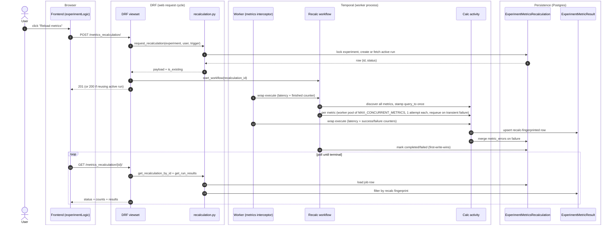

# Recalculation workflow architecture

This document describes the **recalculation workflow** for experiment metrics: what it does, how it's built, and why we made the design choices we made. For the daily timeseries family of workflows (the cache-warming ones in `posthog/temporal/experiments/`), see that package's `README.md`.

## What it does

When a user opens an experiment and the cached results look stale, they click **Reload metrics**. The recalculation workflow takes a snapshot of all that experiment's metrics, runs them against ClickHouse in parallel, and stores the results so the UI can show the user a frozen "as of now" view of their experiment.

It's distinct from the daily timeseries workflows in two ways:

- **On-demand, not scheduled.** Triggered by the user (or by experiment lifecycle events like launch/stop), not by a cron schedule.
- **Snapshot per run, not cache warming.** Each click creates a new run with its own results, identifiable by `recalculation_id`. The timeseries family overwrites cached values; we preserve them.

## End-to-end flow

## Key design decisions

### One `query_to` for the whole run

Every metric in a single recalc shares one `query_to` timestamp, stamped by the workflow's start activity. Without this, two metrics calculated 90 seconds apart in the same run would have slightly different time windows, making them not directly comparable. The start activity stamps `query_to` exactly once under a first-write-wins guard (`UPDATE ... WHERE query_to IS NULL`), so even Temporal retries can't shift the window.

### Recalc fingerprint, not config fingerprint

Every result row is keyed by a `recalc_fp = sha256(config_fp + recalculation_id)`. The config part is the standard fingerprint used by the daily timeseries workflows (it encodes metric definition + start_date + stats config + exposure criteria). Mixing in `recalculation_id` gives each run its own fingerprint family.

This matters because the recalc workflow shares the `ExperimentMetricResult` table with the timeseries workflows. If we used the config fingerprint, every recalc would overwrite the cached daily timeseries row — wrecking the timeseries reads. With the recalc fingerprint, the two families coexist on the same table and never collide.

### No FK from results to the recalc row

`ExperimentMetricResult` has no foreign key pointing back to `ExperimentMetricsRecalculation`. The scoping key lives entirely in the fingerprint. This kept PR1 small (no migration on a shared table to add a nullable column) and makes the two workflow families uniform in how they write results.

The trade-off: reads have to recompute the fingerprint set to find a run's results (`get_run_results` walks each metric, recomputes its `config_fp`, mixes in `recalculation_id`, then `WHERE fingerprint IN (...)`). If the experiment's `start_date` / `exposure_criteria` / stats config changes between the write and the read, the recomputed fingerprints don't match the on-disk ones — results "disappear." Documented inline as the fingerprint-divergence hazard.

### Counters are derived, not stored

`completed_metrics` and `failed_metrics` aren't columns on the recalc row. They're computed at read time from `ExperimentMetricResult` rows (`status=COMPLETED` for completed, `status=FAILED` plus discovery-step failures from `metric_errors` for failed). This eliminates a class of bug: when Temporal retries an activity, there's no counter to double-increment. The only thing that matters is whether the result row exists.

### Idempotency + concurrency at the API boundary

Two safeguards on the POST endpoint:

- **Idempotent reuse.** If an active recalc (pending or in-progress) exists for this experiment and is younger than 30 minutes, the POST returns it instead of creating a new one. Frontend can click Reload twice and get the same `recalculation_id`.
- **Per-experiment lock.** The service runs inside `transaction.atomic()` with `Experiment.objects.select_for_update()` to serialize concurrent POSTs. Without this, two simultaneous clicks would both see no active row, both reach `.create()`, and the second would hit the per-experiment unique constraint and return HTTP 500.

### Activity-aware staleness

The "still active" check uses different timestamps depending on the row's status: PENDING anchors on `created_at` (workflow never reached the start activity), IN_PROGRESS anchors on `started_at` (workflow began executing then stalled). Past the 30-minute threshold, the row is treated as dead — marked FAILED and a fresh run is allowed. This protects against the failure mode where a Temporal-connect failure leaves a PENDING row behind and the rollback UPDATE also fails: without this, the experiment would be permanently locked out of recalculations.

### Snapshot semantics for the user

The user doesn't see the cache. They see a specific run, identified by `recalculation_id`. If they bookmark the URL or share it, anyone who follows it sees the same numbers — frozen at the run's `query_to`, independent of cache state. This is the fundamental difference from the timeseries family, which is essentially "what does the query engine say right now."

## Eviction

We don't currently delete old recalcs or their results. Power users compound rows fast: 50 clicks × 10 metrics × 90 days = 45k rows for one team. The plan is a bi-weekly Temporal Schedule that deletes both tables past a cutoff:

- `DELETE FROM ExperimentMetricResult WHERE experiment_id = X AND query_to < cutoff`
- `DELETE FROM ExperimentMetricsRecalculation WHERE experiment_id = X AND created_at < cutoff`

No fingerprint recompute needed — the table has `experiment_id` and timestamps directly, so eviction is trivial. The two deletes don't need to be transactional with each other; nothing reads results "through" the recalc row.

## Observability

Two parallel surfaces:

- **Prometheus / Grafana.** The worker-side interceptor (`recalculation_metrics.py`) emits per-activity and end-to-end latency histograms, success/failure counters per activity type, and a `workflow_finished{status}` counter. These power dashboards and alerts about worker health (latency p95, recalc success rate, infrastructure failure rate). The `status` attribute on `workflow_finished` uses the business-level outcome (any failed metric → `"failed"`), so a 9-of-10-failed run is correctly counted as a failure.
- **PostHog events.** Frontend captures a consolidated `experiment metric recalculation` event with a `status` property (`triggered` / `polled` / `completed` / `failed`) at each lifecycle moment. These power user-behavior dashboards (how often do users click Reload, what fraction of recalcs end in failure from the user's perspective). See `docs/superpowers/specs/2026-06-04-experiment-metric-recalculation-events.md`.

The split is intentional: Grafana tells you about the worker process, PostHog tells you about the user experience. Alerts can live in either depending on what's being monitored.

## Performance notes

- **Worker pool per run, retries owned by the workflow.** The workflow runs `MAX_CONCURRENT_METRICS=14` worker coroutines that drain a shared requeue queue, rather than firing all metrics under a semaphore. The constant sizes the per-run fan-out so a typical experiment recalculates in a single concurrent wave; cross-run ClickHouse load is bounded separately by the dedicated recalc worker's activity-slot cap, not by this constant. The workflow runs on its own `experiments-recalculation-task-queue` (see `EXPERIMENTS_RECALCULATION_TASK_QUEUE`), served by a dedicated worker deployment, so recalc load can be scaled and throttled independently of the general-purpose worker.

  Crucially, the calc activity runs with `RetryPolicy(maximum_attempts=1)`: the workflow owns retries, not Temporal. Why: a single `execute_activity(..., retry_policy=...)` await does not resolve until the whole retry chain finishes (Temporal handles backoff at the service level and the workflow stays suspended). With the old `asyncio.Semaphore` + `maximum_attempts=5`, a failing metric held its concurrency slot for the entire ~75s backoff chain (5s, 10s, 20s, 40s), starving healthy metrics queued behind it and wrecking perceived load time when several metrics failed. Note this was a _workflow-level_ semaphore problem; Temporal frees the _worker_ activity slot during backoff, so the starvation was self-inflicted by the semaphore, not by Temporal's concurrency.

  Now: each worker pulls a metric, runs one attempt, and frees its slot the moment that attempt returns or raises. A transient failure (the activity raises) requeues the metric at the **back** of the queue with a `not_before` backoff delay, so a waiting metric runs before the failed one's next attempt. A permanent failure (`StatisticError`/`ZeroDivisionError`, returned with `success=False`, never raised) is terminal on the first trip. A metric is marked failed only after `MAX_METRIC_ATTEMPTS=3` trips. This is the standard Temporal "start N, launch more as each completes" pattern (the `splitmerge-selector` shape), with requeue-on-failure layered on top.

  The `_backoff` helper computes `5s * 2^(attempts-1)` capped at 60s (5s, 10s, 20s, 40s, 60s, ...). At the current `MAX_METRIC_ATTEMPTS=3` only the first two legs are ever reached: a metric requeues after attempt 1 (5s) and after attempt 2 (10s), then attempt 3 is final and never requeues. The formula stays generic so raising the cap extends the schedule without code changes.

  The loop is deterministic for replay: all time comes from `temporalio.workflow.now()` and waits use `temporalio.workflow.sleep()`; workers block on `wait_condition` rather than busy-spinning; and the single-threaded asyncio model guarantees no interleaving between dequeue and the in-flight counter bump.

- **`is_final_attempt` is passed by the workflow.** Because the activity runs `maximum_attempts=1`, it can't infer "last try" from `activity.info().attempt` (always 1). The workflow's requeue loop knows the real attempt count and passes `is_final_attempt` as an activity argument. The activity persists a transient failure (FAILED row + `metric_errors`) only on the final attempt, so a metric still being retried stays in its loading/dim state on the frontend instead of flashing an error that may yet resolve.

- **5-minute per-attempt budget.** `start_to_close_timeout=timedelta(minutes=5)` on the calc activity is the real per-attempt ceiling. We deliberately don't set a heartbeat timeout: the activity has no progress hooks inside the ClickHouse query, so the heartbeat couldn't fire mid-query anyway.
- **No saved-metric snapshot.** Each calc activity that processes a saved/shared metric re-queries the M2M through-model to resolve the metric definition. For a 5–10 metric experiment this is fine; for larger experiments the per-call query starts to add up. Tracked as a deferred optimization (snapshot resolved metric dicts on the recalc row at discovery time).

## What this doc doesn't cover

- The legacy timeseries family of workflows (`posthog/temporal/experiments/` — three workflows that share the daily cache-warming pattern). See that package's `README.md`.
- The Temporal SDK basics. See `posthog/temporal/README.md`.
- Frontend polling and rendering. Will be documented alongside PR6 when the kea logic lands.
- Eviction implementation. The plan above is design intent; the actual workflow is a separate PR.
