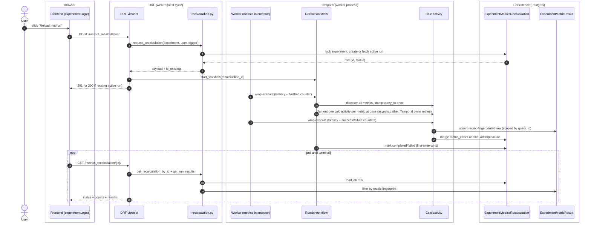

# Recalculation workflow architecture

This document describes the **recalculation workflow** for experiment metrics: what it does, how it's built, and why we made the design choices we made. For the daily timeseries family of workflows (the cache-warming ones in `posthog/temporal/experiments/`), see that package's `README.md`.

## What it does

When a user opens an experiment and the cached results look stale, they click **Reload metrics**. The recalculation workflow takes a snapshot of all that experiment's metrics, runs them against ClickHouse in parallel, and stores the results so the UI can show the user a frozen "as of now" view of their experiment.

It's distinct from the daily timeseries workflows in two ways:

- **On-demand, not scheduled.** Triggered by the user (or by experiment lifecycle events like launch/stop), not by a cron schedule.
- **Snapshot per run, not cache warming.** Each click creates a new run with its own results, identifiable by `recalculation_id`. The timeseries family overwrites cached values; we preserve them. (One exception: a stopped experiment has a fixed window, so its runs share a result row rather than each getting a distinct snapshot. See "Snapshot semantics for the user".)

## End-to-end flow

```mermaid
sequenceDiagram
    autonumber
    actor User

    box Browser
        participant FE as Frontend (experimentLogic)
    end
    box DRF (web request cycle)
        participant API as DRF viewset
        participant Service as recalculation.py
    end
    box Temporal (worker process)
        participant Worker as Worker (metrics interceptor)
        participant Workflow as Recalc workflow
        participant Activity as Calc activity
    end
    box Persistence (Postgres)
        participant DB as ExperimentMetricsRecalculation
        participant Result as ExperimentMetricResult
    end

    User->>FE: click "Reload metrics"
    FE->>API: POST /metrics_recalculation/
    API->>Service: request_recalculation(experiment, user, trigger)
    Service->>DB: lock experiment, create or fetch active run
    DB-->>Service: row (id, status)
    Service-->>API: payload + is_existing
    API->>Workflow: start_workflow(recalculation_id)
    API-->>FE: 201 (or 200 if reusing active run)

    Worker->>Workflow: wrap execute (latency + finished counter)
    Workflow->>Activity: discover all metrics, stamp query_to once
    Workflow->>Activity: fan out one calc activity per metric at once (asyncio.gather, Temporal owns retries)
    Worker->>Activity: wrap execute (latency + success/failure counters)
    Activity->>Result: upsert recalc-fingerprinted row (scoped by query_to)
    Activity->>DB: merge metric_errors on final-attempt failure
    Workflow->>DB: mark completed/failed (first-write-wins)

    loop poll until terminal
        FE->>API: GET /metrics_recalculation/{id}/
        API->>Service: get_recalculation_by_id + get_run_results
        Service->>DB: load job row
        Service->>Result: filter by recalc fingerprint
        API-->>FE: status + counts + results
    end
```

## Key design decisions

### One `query_to` for the whole run

Every metric in a single recalc shares one `query_to` timestamp, stamped by the workflow's start activity. Without this, two metrics calculated 90 seconds apart in the same run would have slightly different time windows, making them not directly comparable. The start activity stamps `query_to` exactly once under a first-write-wins guard (`UPDATE ... WHERE query_to IS NULL`), so even Temporal retries can't shift the window.

### Recalc fingerprint, not config fingerprint

Every result row is keyed by a `recalc_fp = sha256(config_fp + "recalculation")` (`recalc_fingerprint.py`). The config part is the standard fingerprint used by the daily timeseries workflows (it encodes metric definition + start_date + stats config + exposure criteria). The salt is a fixed string, so the recalc fingerprint is deterministic per config, not per run.

This matters because the recalc workflow shares the `ExperimentMetricResult` table with the timeseries workflows. If we used the config fingerprint, every recalc would overwrite the cached daily timeseries row, wrecking the timeseries reads. The constant salt keeps the recalc family distinct from the timeseries family on the same table, so they never collide.

Runs of a **running** experiment are told apart by `query_to`, not by the fingerprint. Each run advances `query_to` toward "now", so it accumulates one row per run under the same fingerprint, one per window end. `get_run_results` filters `fingerprint__in=(...) AND query_to=recalc.query_to`, so a read returns exactly the rows for that run's window. A same-config re-run at the same window updates the existing row rather than colliding on the unique key.

**Stopped experiments are the exception, and they do not get per-run isolation.** A stopped experiment has a fixed window: `_resolve_query_to` returns `end_date` for every run (`recalculation_logic.py`). So repeated recalcs of a stopped experiment share one `(fingerprint, query_to)` key, and a later run overwrites the earlier run's result row in place. The snapshot for such an experiment is effectively "the latest recomputation of this fixed window", not a distinct frozen copy per `recalculation_id`. This is acceptable because a stopped experiment's data no longer changes, so a re-run recomputes the same numbers over the same window; the row is updated, not meaningfully changed. The one case it does matter is a re-run after a config or stats change, where the fingerprint changes and the row lands under a new key anyway.

### No FK from results to the recalc row

`ExperimentMetricResult` has no foreign key pointing back to `ExperimentMetricsRecalculation`. The scoping key lives entirely in the fingerprint plus `query_to`. This avoided a migration on a shared table to add a nullable column, and makes the two workflow families uniform in how they write results.

The trade-off: reads have to recompute the fingerprint set to find a run's results (`get_run_results` walks each metric, recomputes its `config_fp`, applies the recalc salt, then `WHERE fingerprint IN (...) AND query_to = recalc.query_to`). If the experiment's `start_date` / `exposure_criteria` / stats config changes between the write and the read, the recomputed fingerprints don't match the on-disk ones, and results "disappear." Documented inline as the fingerprint-divergence hazard.

### Counters are derived, not stored

`completed_metrics` and `failed_metrics` aren't columns on the recalc row. They're computed at read time from `ExperimentMetricResult` rows (`status=COMPLETED` for completed, `status=FAILED` plus discovery-step failures from `metric_errors` for failed). This eliminates a class of bug: when Temporal retries an activity, there's no counter to double-increment. The only thing that matters is whether the result row exists.

### Idempotency + concurrency at the API boundary

Two safeguards on the POST endpoint:

- **Idempotent reuse.** If an active recalc (pending or in-progress) exists for this experiment and is younger than 30 minutes, the POST returns it instead of creating a new one. Frontend can click Reload twice and get the same `recalculation_id`.
- **Per-experiment lock.** The service runs inside `transaction.atomic()` with `Experiment.objects.select_for_update()` to serialize concurrent POSTs. Without this, two simultaneous clicks would both see no active row, both reach `.create()`, and the second would hit the per-experiment unique constraint and return HTTP 500.

### Activity-aware staleness

The "still active" check uses different timestamps depending on the row's status: PENDING anchors on `created_at` (workflow never reached the start activity), IN_PROGRESS anchors on `started_at` (workflow began executing then stalled). Past the 30-minute threshold, the row is treated as dead, marked FAILED, and a fresh run is allowed. This protects against the failure mode where a Temporal-connect failure leaves a PENDING row behind and the rollback UPDATE also fails: without this, the experiment would be permanently locked out of recalculations.

### Terminal-failure backstop

The workflow body is wrapped so any unhandled exception, or a finalize write that exhausts its own retries, still tries to mark the row terminal before the workflow fails (`_best_effort_mark_terminal`). This closes the gap where a run really finished but the finish write failed, leaving a non-terminal row that would otherwise report the wrong status until the staleness TTL reaps it. The backstop is gated on `workflow.patched("recalc-terminal-fail-on-error-2026-07")` so it does not break the replay of executions that started before it landed. If the backstop write also fails, the workflow re-raises rather than reporting success on a non-terminal row, and the staleness TTL is the last line of defense.

### Snapshot semantics for the user

The user doesn't see the cache. They see a specific run, identified by `recalculation_id`. If they bookmark the URL or share it, anyone who follows it reads that run's numbers at the run's `query_to`, independent of cache state. This is the fundamental difference from the timeseries family, which is essentially "what does the query engine say right now."

The snapshot is immutable only while the experiment is running, where each run pins a distinct `query_to`. For a **stopped** experiment the window is fixed at `end_date`, so all same-config runs share one result row and a later run overwrites the numbers an earlier `recalculation_id` pointed at (see "Recalc fingerprint" above). Since a stopped experiment's data is frozen, the recomputed numbers are the same, so this is a shared row rather than a lost snapshot; but a shared `recalculation_id` URL for a stopped experiment is not guaranteed to keep showing the exact values it showed at first load.

### Triggers and the cold-start payload

A recalc row records what caused it, in `trigger` (`Trigger` on the model). The set is more than a manual click: `MANUAL`, `AGENT_MCP`, `COLD_RUN`, `STALE_REFRESH`, `AUTO_REFRESH`, config-change triggers (`EXPERIMENT_CONFIG_CHANGE`, `METRIC_CONFIG_CHANGE`), and experiment lifecycle triggers (`EXPERIMENT_LAUNCH`, `EXPERIMENT_STOP`, `EXPERIMENT_UPDATE`). This lets the analytics and the UI tell a user click apart from an automatic refresh.

`GET /metrics_recalculation/latest` returns a synthetic "completed" payload built from each metric's latest timeseries point (`build_timeseries_cold_start_payload`) when no real recalc run exists yet. This is the cold-start placeholder: the user sees the freshest cached timeseries values instead of a bare 404 on first open, with `query_to` pinned to the freshest point so the frontend's own staleness path can fire a real recompute. The GET path never triggers a recompute itself; it only reads.

### Live query progress on the GET path

For an in-progress run, `get_live_query_progress` reads `system.processes` and `system.query_log` by client-query-id prefix to surface cumulative ClickHouse `rows_read` while the run executes. Nothing is stored: each metric query is tagged with a deterministic `client_query_id`, so the progress is reconstructable from ClickHouse alone. It is best-effort and decorative; a failure there returns null and never sinks the core status payload.

## Eviction

We don't currently delete old recalcs or their results. Power users compound rows fast: 50 clicks × 10 metrics × 90 days = 45k rows for one team. The plan is a bi-weekly Temporal Schedule that deletes both tables past a cutoff:

- `DELETE FROM ExperimentMetricResult WHERE experiment_id = X AND query_to < cutoff`
- `DELETE FROM ExperimentMetricsRecalculation WHERE experiment_id = X AND created_at < cutoff`

No fingerprint recompute needed: the table has `experiment_id` and timestamps directly, so eviction is trivial. The two deletes don't need to be transactional with each other; nothing reads results "through" the recalc row.

## Observability

Two parallel surfaces:

- **Prometheus / Grafana.** The worker-side interceptor (`recalculation_metrics.py`) emits per-activity and end-to-end latency histograms, success/failure counters per activity type, and a `workflow_finished{status}` counter. These power dashboards and alerts about worker health (latency p95, recalc success rate, infrastructure failure rate). The `status` attribute on `workflow_finished` uses the business-level outcome (any failed metric → `"failed"`), so a 9-of-10-failed run is correctly counted as a failure.
- **PostHog events.** Frontend captures a consolidated `experiment metric recalculation` event with a `status` property (`triggered` / `polled` / `completed` / `failed`) at each lifecycle moment. These power user-behavior dashboards (how often do users click Reload, what fraction of recalcs end in failure from the user's perspective). See `docs/superpowers/specs/2026-06-04-experiment-metric-recalculation-events.md`.

The split is intentional: Grafana tells you about the worker process, PostHog tells you about the user experience. Alerts can live in either depending on what's being monitored.

## Performance notes

- **Fan out all metrics at once, Temporal owns retries.** The workflow schedules one calc activity per metric in a single `asyncio.gather` (`recalculation_workflow.py`), with no concurrency of its own. Pacing is owned by the layers that actually constrain it: the worker's activity slots (`MAX_CONCURRENT_ACTIVITIES`, autoscaled on task-queue backlog) bound compute, and the per-org ClickHouse app-query limiter bounds query fan-out. Scheduling every metric up front also keeps the task-queue backlog honest for the autoscaler. The workflow runs on its own `experiments-recalculation-task-queue` (see `EXPERIMENTS_RECALCULATION_TASK_QUEUE`), served by a dedicated worker deployment, so recalc load can be scaled and throttled independently of the general-purpose worker.

  Retries live in Temporal's `RetryPolicy` on the calc activity, not in the workflow. The policy is exponential: `initial_interval=5s`, `backoff_coefficient=2.0`, `maximum_interval=60s`, `maximum_attempts=MAX_METRIC_ATTEMPTS` (currently 8). So a metric backs off 5s, 10s, 20s, 40s, 60s, 60s, 60s across its retries, then the eighth attempt is final. `asyncio.gather(..., return_exceptions=True)` lets healthy metrics finish while a failing one retries; a retrying metric never blocks the others, because each activity retries on its own worker slot rather than holding a shared queue slot.

  A permanent failure fails fast rather than burning the retry budget. `NON_RETRYABLE_ERROR_TYPES` (`out_of_memory`, `byte_limit`, `validation_error`) plus `ValueError` are raised non-retryable, so the metric is terminal on the first trip. A different bucket, the per-org ClickHouse concurrency limiter and the cluster at-capacity guard, is retried on a fixed 60s delay (`CONCURRENCY_LIMIT_RETRY_DELAY_SECONDS`) via `ApplicationError(next_retry_delay=...)`, out-of-band from the exponential schedule, because that error means "come back later", not "this query is wrong".

- **`is_final_attempt` is derived inside the activity.** Because Temporal now owns retries, the activity reads its own attempt count from `activity.info().attempt` and compares it against `MAX_METRIC_ATTEMPTS` (the same constant the workflow's `RetryPolicy` is built from, so both sides agree on which attempt is last). The activity persists a transient failure (FAILED row + `metric_errors`) only on the final attempt, so a metric still being retried stays in its loading/dim state on the frontend instead of flashing an error that may yet resolve. Non-final transient state is tracked separately in the `metric_retries` column for the UI.

- **Per-org fairness.** Each calc activity is dispatched with `priority=Priority(fairness_key=inputs.fairness_key)`, where the key is the org id. Under backlog, Temporal round-robins across orgs so one org's large recalc does not starve another's. It is a no-op on namespaces without fairness support.

- **In-query execution guard.** The calc activity sets ClickHouse `max_execution_time=270s` (`METRIC_CALC_MAX_EXECUTION_TIME_SECONDS`), deliberately below the 300s activity timeout. A slow query then fails inside the activity with a typed ClickHouse timeout error, so the FAILED result row and the terminal event still get written, instead of Temporal killing the attempt from the outside and losing all of that.

- **5-minute per-attempt budget.** `start_to_close_timeout=timedelta(minutes=5)` on the calc activity is the real per-attempt ceiling. We deliberately don't set a heartbeat timeout: the activity has no progress hooks inside the ClickHouse query, so the heartbeat couldn't fire mid-query anyway.
- **Calc queries run on the online ClickHouse cluster.** The calc activity builds its `ExperimentQueryRunner` with `workload=Workload.ONLINE`, so the queries hit the same replicas that serve interactive product traffic rather than the offline cluster that heavy background jobs use.

  This is a deliberate trade-off against the offline default that most background scans take. The offline replicas can trail ingestion, disable hedged requests (higher and more variable latency, higher failure rate), and share one global concurrency limit across every product. A recalc is a user-initiated snapshot the person is waiting on, so it wants the freshest data and the most reliable, lowest-latency path, which is the online cluster. The cost is that recalc scans now compete with live user queries instead of being isolated from them; the worker's activity-slot cap and the per-org ClickHouse app-query limiter are what keep that load bounded.

  The workload is set explicitly rather than left to the default. The base `QueryRunner` default is `Workload.DEFAULT`, which resolves to online today but flips to offline whenever the process default is offline (Celery pins every task to offline process-wide, and API-key traffic is forced offline). Passing `Workload.ONLINE` keeps the routing stable regardless of how the activity is invoked. Note that only US Cloud has a real offline cluster; EU, self-hosted, dev, and test all resolve offline back to the online host, so this change is a no-op outside US Cloud.

- **No saved-metric snapshot.** Each calc activity that processes a saved/shared metric re-queries the M2M through-model to resolve the metric definition. For a 5–10 metric experiment this is fine; for larger experiments the per-call query starts to add up. Tracked as a deferred optimization (snapshot resolved metric dicts on the recalc row at discovery time).

## What this doc doesn't cover

- The legacy timeseries family of workflows (`posthog/temporal/experiments/`, three workflows that share the daily cache-warming pattern). See that package's `README.md`.
- The Temporal SDK basics. See `posthog/temporal/README.md`.
- Frontend polling and rendering in depth. The kea logic has landed (`experimentMetricsLogic.ts`, with `RecalculationStatus.tsx` for rendering); this doc covers only the backend contract it polls. See the "GET path" decisions above and the poll loop in that logic.
- Eviction implementation. The plan above is design intent; the actual workflow is a separate PR.
