# Foundry

Foundry is a bet portfolio: a hypothesis becomes a `Bet` with one success
metric, guardrails, and an append-only event log that carries it through
`drafted → funded → building → gated → exposed → verdict → archived`.
Integration safety comes from a machine gate (ReviewHog), knowledge transfer
from a git-backed memory repo, and consensus from the market — a feature
flag plus an experiment created the moment a bet is funded.

See `backend/` for the API (models, facade, presentation, Temporal
workflow) and `frontend/` for the portfolio and bet-detail scenes.

## The closed loop

A bet moves through the same seven stages every time, and every stage leaves
a typed event on the bet's append-only log:

```mermaid
flowchart LR
    Fund["Fund<br/>drafted to funded"] -->|run.started| Build["Build<br/>a coding agent,<br/>gated by the gauntlet"]
    Build -->|artifact.ready| Gauntlet["Gauntlet<br/>tests, coverage,<br/>protected paths"]
    Gauntlet -->|"gate.result (fail)"| Build
    Gauntlet -->|"gate.result (pass)<br/>then exposure.started"| Expose["Expose<br/>flag rollout ramp"]
    Expose -->|"exposure.advanced<br/>(steps complete)"| Scout["Scout<br/>guardrails, experiment<br/>significance, TTL"]
    Expose -->|exposure.halted| Scout
    Scout -->|verdict.proposed| Verdict["Verdict<br/>a human decides"]
    Verdict -->|"promoted or rolled_back"| Memory["Memory<br/>git-backed learning"]
    Verdict -->|iterate| Build
```

- **Fund** creates the feature flag and a draft experiment (`run.started`
  starts a managed bet's build).
- **Build** runs a real coding agent (or an external orchestrator) against
  the bet's target repo; `artifact.ready` hands its diff to the gauntlet.
- **Gauntlet** runs the constraint battery a builder can't weaken —
  `gate.result` either sends the builder back with violations as feedback,
  or gates the bet.
- **Expose** ramps the flag's rollout percentage step by step
  (`exposure.advanced`), halting and zeroing the rollout on a guardrail
  breach (`exposure.halted`) — automatic when `exposure_plan` asks for it,
  otherwise entirely manual flag edits.
- **Scout** sweeps exposed bets on a schedule, evaluating guardrails,
  experiment significance, and TTL against the evidence already on the
  timeline, and proposes a conclusion (`verdict.proposed`) — a
  recommendation only, never a decision.
- **Verdict** is always a human act: `promoted`/`rolled_back` archives the
  bet, `iterate` sends it back to build with the iteration counter bumped.
- **Memory** records what was learned in a git-backed repo, so the next bet
  (on this hypothesis or a related one) starts from what the last one found.

## Running a bet

The canonical way to drive a bet's lifecycle is the
[`/bet` Claude Code skill](../../.claude/skills/bet/SKILL.md) — create, fund,
check status, record a verdict, and list the portfolio, all from
conversation or from small non-interactive scripts, without reading this
product's code. It talks to the same REST API any external orchestrator
uses (`POST .../bets/`, `.../bets/:id/fund`, `.../bets/:id/events`,
`.../bets/:id/verdict`, `.../bets/:id/nodes`), authenticated with a personal
API key scoped to `bet:write` plus whatever the optional KPI-dashboard step
needs — see the skill's `references/setup.md` for the exact scope list and
how to mint one.
