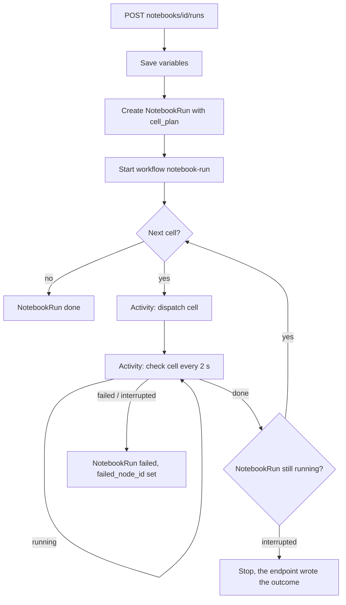

# Running a whole notebook

How the backend runs every SQL and Python cell of a markdown notebook in one action, for the editor and for an agent over MCP.
The design and the reasoning behind it are in `products/notebooks/plan/notebooks_run_all_plan.md`.

## Why the backend owns the loop

A client could dispatch the cells itself, the way the stale-cell chain does today.
Two things rule that out.
An MCP tool call has about a 45 second budget, and a notebook of ten cells does not fit it.
And a direct (pure HogQL) cell only reaches a terminal state when somebody polls it, so a run whose client walked away would stay `running` for good.

So one `NotebookRun` record and one Temporal workflow drive the cells.
Both clients call the same three endpoints, and both write the results into the document themselves, as they do for a single cell.
The backend never edits the document.

## The loop

Rules the loop follows:

- Document order is dependency order, because a cell can only read exports of earlier cells. The plan needs no sorting.
- The plan freezes at start. A cell added while the run works does not join it. A cell deleted while it works still runs, and its result has no cell to land in.
- The cell's **code** is read fresh at dispatch, so a person who edits a later cell during the run gets what they can see.
- The run stops at the first cell that does not finish `done`.
- Before each dispatch the workflow reads the run's status. That is how an interrupt reaches the loop.
- A dispatch that meets a busy notebook (409) or a full project (429) retries for two minutes. A person clicking Run on one cell is the case worth waiting out.
- The whole run is bounded at one hour. On timeout the workflow writes `failed` with the `timed_out` outcome and stops the cell still in flight.

## Endpoints

All three are gated on `revamped-py-notebooks`, the same way `sql_v2/run` is, and all three need query access.

| Method and path | Scopes | Body | Response |
| --- | --- | --- | --- |
| `POST notebooks/{short_id}/runs/` | `notebook:write`, `query:read` | `{variables?: [...]}` | `{run_id, cell_count, starts_sandbox, sandbox_hourly_price}` |
| `GET notebooks/{short_id}/runs/{run_id}/` | `notebook:read`, `query:read` | | `{run_id, status, trigger, variables, cell_count, current_index, current_node_id, failed_node_id, error, cells, created_at, finished_at}` |
| `POST notebooks/{short_id}/runs/{run_id}/interrupt/` | `notebook:write` | | `{interrupted, status}` |

- `POST runs/` with `variables` saves them through the notebook's own serializer first, so a run and a plain PATCH apply the same limits and the same duplicate-name rule. The run then snapshots what the notebook holds.
- A notebook with no runnable cell returns 400. A notebook that already has a run returns 409.
- `starts_sandbox` is true when the plan holds a Python cell and no kernel is live for the caller. Both clients must tell the user the hourly price.
- `GET runs/{run_id}/` is cheap: no result envelopes. A client fetches the one cell it wants from `GET sql_v2/runs/{run_id}`.

## Records

`NotebookRun` holds the trigger (`ui` or `mcp`), the status, the variable snapshot, the frozen `cell_plan`, `current_index`, and the cell that stopped it.
A partial unique constraint allows one `running` row per notebook, so the database enforces "one whole-notebook run at a time" without a lock.

Each cell's `NotebookNodeRun` points back through `notebook_run`, so the status endpoint reads the whole run with one join, and a cell run started from the editor stays distinguishable from one the orchestrator started.

## Related notes

- `sql_v2_result_delivery.md` — how a single cell's result reaches a client.
- `sql_v2_observability.md` — the metrics and logs, including this run's own.
- `sql_v2_kernel_architecture.md` — the sandbox the Python cells run in.
