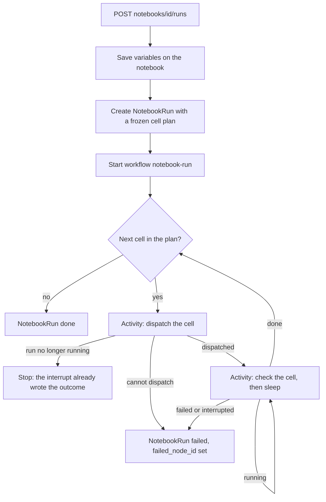

# Running a whole notebook

A person, or an agent over MCP, runs every SQL and Python cell of a markdown notebook in one
action. This note covers what the backend does. The clients write each cell's result back into
the document themselves, exactly as they do for a single cell — the backend never edits the
document.

## The shape

One `NotebookRun` row and one Temporal workflow drive the cells.

## What runs

`SQLV2` and `PythonV2` cells with non-empty code, in document order. `Query` cells, widgets, and
every legacy node are documents rather than code, so they never run.

Document order is dependency order: a cell may only read what an earlier cell exports. The
orchestrator builds each cell's refs from the frozen plan the way the editor does — every earlier
SQL cell with a valid dataframe name is a `hogql` ref, every earlier Python cell a `local` one,
and a SQL cell wins a name collision.

The run stops at the first cell that fails or is interrupted. Cells after it do not run.

## The two clocks

The plan is frozen when the run starts; the code is read when each cell's turn comes.

- A cell added during the run does not join it.
- A cell deleted during the run still has its slot in the plan, and it is skipped, because the
  document no longer carries its code.
- A cell edited during the run executes what the editor shows, not what it held at the start.

Variables are the other way round: `POST runs/` saves them on the notebook and snapshots them onto
the run, so every cell binds the same values however the notebook changes underneath.

## Why the workflow polls

A kernel run (Python, DuckDB) finishes through the sandbox callback. A direct run (pure HogQL)
finishes only when somebody reads it, because the read is what syncs the async query manager's
status onto the row. In a headless run nobody reads it, so the workflow's `check` activity is that
reader. It also fires the kernel lane's stale-callback watchdog, which is a no-op for the other
lane.

Each poll is a short activity with a Temporal timer between them, so a long cell holds a timer
rather than a worker slot. The interval is 2 seconds for the first 15 polls and 5 seconds after,
because every poll costs two history events.

## Concurrency and stopping

A partial unique index on `NotebookRun` allows one row per notebook with `status = running`, so two
racing start requests cannot both open a run and the endpoint needs no lock.

Below that, the existing per-cell slots still apply. Somebody running one cell by hand holds the
notebook's slot, so the run's dispatch retries with backoff for two minutes before giving up.

`POST runs/{id}/interrupt/` marks the run row interrupted with a status-guarded update, then stops
the cell in flight. The workflow reads the run's status before every dispatch, so the row is what
ends the loop. The endpoint owns the outcome in that case, and the workflow writes nothing over it.

A run that reaches an hour without finishing is stuck rather than slow, so the workflow gives it a
terminal status and a reason of its own. The Temporal execution timeout sits five minutes past
that, as a backstop that cannot leave a message.

## The API

| Method and path                                      | Scopes                         | Body                  | Response                                                                                                                      |
| ---------------------------------------------------- | ------------------------------ | --------------------- | ----------------------------------------------------------------------------------------------------------------------------- |
| `POST notebooks/{short_id}/runs/`                    | `notebook:write`, `query:read` | `{variables?: [...]}` | `{run_id, cell_count, starts_sandbox, sandbox_hourly_price}`                                                                  |
| `GET notebooks/{short_id}/runs/{run_id}/`            | `notebook:read`, `query:read`  |                       | `{run_id, status, trigger, variables, current_node_id, current_index, failed_node_id, error, cells, created_at, finished_at}` |
| `POST notebooks/{short_id}/runs/{run_id}/interrupt/` | `notebook:write`               |                       | `{interrupted, status}`                                                                                                       |

Every endpoint is behind `revamped-py-notebooks`, the same gate as the single-cell endpoints.

`POST runs/` answers 400 for a notebook with nothing to run and 409 when a run is already going.

The status read carries no result envelopes. It names each planned cell and the cell run it
produced, and a client fetches that run's rows from `GET sql_v2/runs/{run_id}/`. This keeps the
status read one small query however large the results are.

`starts_sandbox` and `sandbox_hourly_price` are resolved once, at the start, from whether the plan
holds a Python cell and whether a kernel is already live for the caller. Both clients disclose the
price before the run proceeds.

## Related notes

- [sql_v2_result_delivery.md](./sql_v2_result_delivery.md) — how one cell's result reaches a client.
- [sql_v2_kernel_architecture.md](./sql_v2_kernel_architecture.md) — the sandbox and its kernel.
- [sql_v2_observability.md](./sql_v2_observability.md) — the metrics this run reports.
