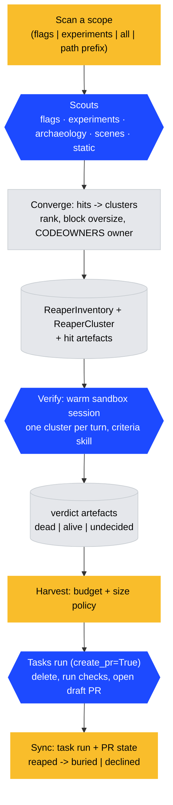
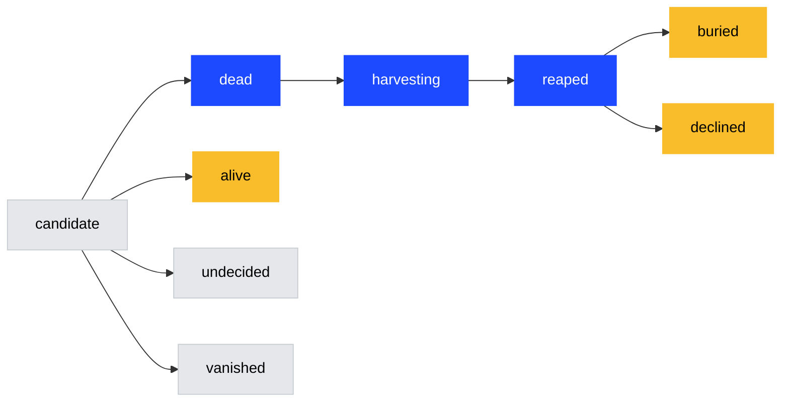

# ReaperHog architecture

ReaperHog (`products/reaperhog`) finds dead code, verifies it in a sandbox session and opens draft PRs that delete it, with the evidence in the PR body.
It never merges anything.
[PLAN.md](./PLAN.md) carries the why and the roadmap; this file is what exists today.

It is a separate-database product (`reaperhog` route in `products/db_routing.yaml`), models on `ProductTeamModel`, no frontend.

## Pipeline



**Scan** (`logic/scan.py`) runs every scout that applies to the scope against a local checkout (`RepoIndex`, `logic/repo.py`: ripgrep with a pattern file for references, git for history).
A failing scout is reported in the run summary and skipped; the scan only fails when every scout fails.
Scouts read production data through facades: `list_flag_summaries` (feature_flags), `list_concluded_experiments` (experiments), `$pageview` and `$feature_flag_called` counts over HogQL.
Convergence (`logic/converge.py`) groups hits by root, ranks them (decisive hit or two scouts = strong), blocks oversize clusters and assigns a CODEOWNERS owner.
`logic/inventory.py` upserts clusters idempotently: a re-scan refreshes rows, reopens `declined` clusters whose files changed and marks missing roots `vanished`.

**Verify** (`logic/verification.py`) loads unblocked candidates strong-first, opens one warm sandbox session through the Tasks facade (`MultiTurnSession`) and judges one cluster per turn against the `reaperhog-verification-criteria` skill, which `logic/skill.py` seeds into `LLMSkill` rows.
Verdicts persist as artefacts; the cluster becomes `dead` only on `is_dead` with high confidence.

**Harvest** (`logic/harvest.py`) selects dead clusters under `MAX_OPEN_REAPER_PRS` and `MAX_FILES_PER_PR`, renders the evidence PR body and dispatches a Tasks coding-agent run with `create_pr=True` (the experiments flag-cleanup path).
The prompt pins the deletion plan, the checks to run, the hard floors, the branch name and the draft PR title and label.
`sync_harvest` maps the task run's PR into `reaped`, then polls the PR through the GitHub egress transport into `buried` (merged) or `declined` (closed).

## Cluster lifecycle



`declined` (a human closed the PR) sticks until the cluster's file set changes.
`reaped` and `buried` are never vanished by a re-scan.

## Data model

- `ReaperInventory`: one row per `(team, repository, scope)`, with the last scan SHA and an `active`/`idle` status.
- `ReaperCluster`: one row per root, unique on `(inventory, hash)` where the hash is `root_kind:root`. Carries rank, blocked reason, files, counts, owner, status, the harvest `task_id` and the PR.
- `ReaperArtefact`: append-only log per inventory or cluster: `hit`, `verdict`, `note` (pydantic content models in `logic/artefacts.py`).

## Entry points

```bash
python manage.py run_reaper --scope flags --team-id 1                       # scan only
python manage.py run_reaper --scope products/desktop --team-id 1 \
  --verify --user-id 1                                                      # scan + sandbox verification
python manage.py run_reaper --scope flags --team-id 1 --skip-scan \
  --sync --harvest --user-id 1                                              # sync PR state, then dispatch harvests
```

The `reap-scope` Temporal workflow (`backend/temporal/`) runs scan, verify, sync and harvest as activities.
A weekly schedule per scope is created when `REAPERHOG_SCOPES`, `REAPERHOG_TEAM_ID`, `REAPERHOG_USER_ID` and `REAPERHOG_REPO_PATH` are all set (`posthog/settings/access.py`).
The scan activity needs a checkout with `rg` on the worker, so the schedule is only useful where `REAPERHOG_REPO_PATH` points at one; moving the repo-reading scouts into a sandbox turn is the open path to a cloud deployment.

## Tests

`pnpm --filter=@posthog/products-reaperhog backend:test`, or `pytest products/reaperhog/backend/tests`.
Sandbox sessions and the Tasks facade are mocked; scan and repo tests run against throwaway git repositories.
