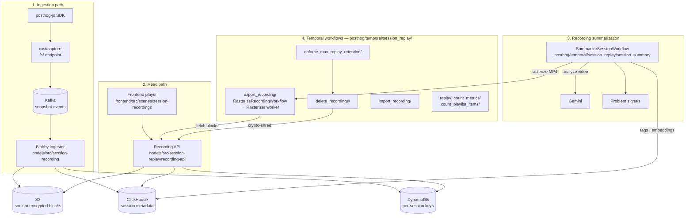

# Session Replay — Architecture

_Last updated: 2026-04-22_

## Diagram

Sections: **ingestion path**, **read path**, **recording summarization**, **Temporal workflows**. Storage sits in the middle — written by ingestion, read via the Recording API.

## Tiers

| Tier                                                  | Path                                                                                                                                                                            | Runtime             |
| ----------------------------------------------------- | ------------------------------------------------------------------------------------------------------------------------------------------------------------------------------- | ------------------- |
| Capture                                               | `rust/capture/` + `posthog-js`                                                                                                                                                  | Rust / JS           |
| Ingestion (Blobby)                                    | `nodejs/src/session-recording/`                                                                                                                                                 | Node.js             |
| Shared (crypto, keystore, metadata, retention, teams) | `nodejs/src/session-replay/shared/`                                                                                                                                             | Node.js             |
| Recording API                                         | `nodejs/src/session-replay/recording-api/`                                                                                                                                      | Node.js / Express   |
| Rasterizer                                            | `nodejs/src/session-replay/recording-rasterizer/`                                                                                                                               | Node.js + Chromium  |
| Temporal workflows                                    | `posthog/temporal/session_replay/{session_summary,delete_recordings,enforce_max_replay_retention,export_recording,import_recording,replay_count_metrics,count_playlist_items}/` | Python              |
| Frontend player                                       | `frontend/src/scenes/session-recordings/`                                                                                                                                       | React + Kea + rrweb |

## Capture

- SDK: `posthog-js` records rrweb snapshots and ships them to the `/s/` endpoint.
- Capture service: `rust/capture` validates and forwards to Kafka.
- Output topics: `session_recording_snapshot_item_events` (main) and `session_recording_snapshot_item_overflow` (fallback).

## Ingestion (Blobby)

- Consumer: `SessionRecordingIngester` in `nodejs/src/session-recording/consumer.ts`.
- Consumer group: `session-recordings-blob-v2`.
- Pipeline: restrictions → team enrichment → parse/decompress → lib-version monitor → session batch recorder.
- Writes Snappy-compressed JSONL blocks to S3. Each line is `[windowId, rrwebEvent]`.
- Emits metadata to Kafka → ClickHouse:
  - `clickhouse_session_replay_events` (session summary rows)
  - `clickhouse_session_replay_features` (ML features)
  - `log_entries` (console logs)
- DLQ: `session-recording-snapshot-item-dlq`.

## Storage

- **S3** — `{prefix}/{retention}/{timestamp}-{blockId}`. Retention buckets: `30d`, `90d`, `1y`, `5y`. Sodium-encrypted on cloud, cleartext on self-hosted.
- **ClickHouse** — `sharded_session_replay_events` (AggregatingMergeTree, keyed on session), `session_console_log_entries`, `session_replay_embeddings`.
- **Postgres** — `SessionRecording`, `SessionRecordingPlaylist`, `SessionRecordingPlaylistItem`, `SessionRecordingViewed`, team settings (retention, encryption, sampling).
- **DynamoDB** — per-session encryption keys. Cloud only. Deletion is crypto-shredding.
- **Redis** — session tracker (48h TTL), session blocklist, keystore cache.

## Recording API

Node.js/Express service under `nodejs/src/session-replay/recording-api/`. Rolled out to 100% and the legacy Django playback path is gone.

- `GET /api/projects/:team_id/recordings/:session_id/block?key=&start_byte=&end_byte=&decompress=` — range fetch from S3, decrypt via keystore, optionally decompress.
- `GET /api/projects/:team_id/recordings/:session_id/blocks` — list available blocks from ClickHouse metadata.
- `POST /api/projects/:team_id/recordings/delete` — crypto-shred: drop the key in DynamoDB and mark `is_deleted=1` in ClickHouse.

## Playback

- Entry: `sessionRecordingDataCoordinatorLogic` coordinates meta + snapshot loading.
- `snapshotDataLogic` owns the `SnapshotStore` (from `@posthog/replay-shared`) and calls the recording-api via `api.get`.
- `rrweb-player` renders DOM snapshots. Multi-window recordings route through `windowIdRegistryLogic`.
- Polling: idle recordings poll for new blocks with an inactivity timeout.

## AI / Analysis

Temporal workflows under `posthog/temporal/session_replay/`:

- `session_summary/` — `SummarizeSingleSessionWorkflow`, `SummarizeSessionGroupWorkflow`. Video-based summarization is primary (rasterize → upload to Gemini → consolidate → tag/highlight → emit problem signals). The event-streaming variant has been removed.
- `delete_recordings/` — batch deletion driven by admin actions or retention policy.
- `enforce_max_replay_retention/` — daily retention sweep.
- `export_recording/` — `RasterizeRecordingWorkflow` (replacement for the old `VideoExportWorkflow`), dispatches to the Node rasterizer on `rasterization-task-queue`.
- `import_recording/` — ingest external recordings.
- `replay_count_metrics/`, `count_playlist_items/` — background stats.

## Rasterizer

- Location: `nodejs/src/session-replay/recording-rasterizer/`.
- Temporal task queue: `rasterization-task-queue`.
- Chromium browser-pool with `beginFrame`-based deterministic frame capture.
- Loads blocks via the recording-api (`block-proxy`), not directly from S3.
- Postprocesses with `ffmpeg` to MP4 / WebM / GIF, uploads to S3.

## Deletion semantics

Deletion is **crypto-shredding**, not object deletion:

1. Drop the per-session key from DynamoDB.
2. Write a tombstone to `clickhouse_session_replay_events` setting `is_deleted=1`.
3. S3 blocks are left in place and expire via lifecycle policy aligned with the retention bucket they were written into.

The recording becomes unreadable as soon as the key is gone, regardless of whether the S3 object still exists.
