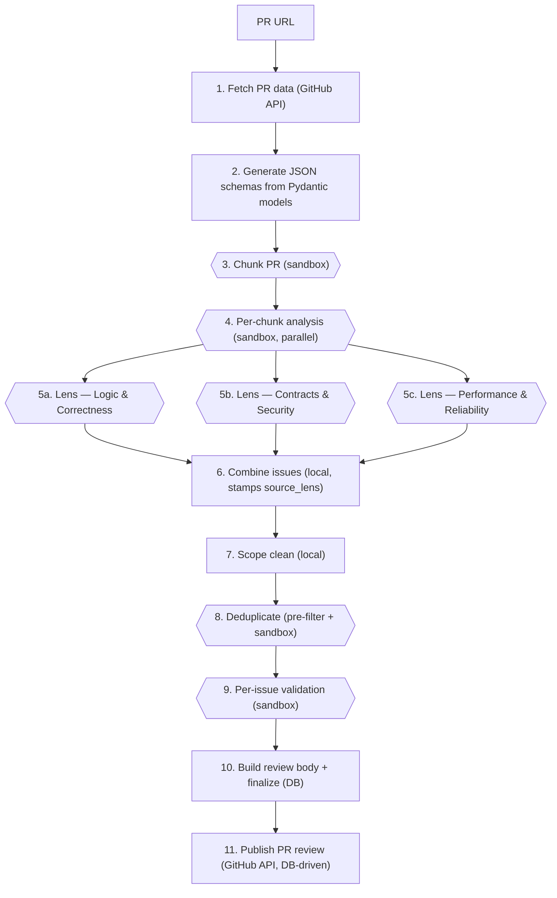

# ReviewHog Architecture

## Overview

**ReviewHog** (`products/review_hog`) is an automated GitHub PR code reviewer. It is a Django app
(`backend/apps.py`, label `review_hog`, module `products.review_hog.backend`) driven by a single
management command — there is **no API, viewset, model, or frontend** yet. A run fetches a PR from
GitHub, splits it into logically reviewable **chunks**, runs a **three-lens parallel LLM review** of each
chunk inside **sandbox agents**, then combines → scope-cleans → deduplicates → validates the findings, renders
a markdown report, and posts inline review comments back to the PR.

Every LLM step runs inside a **sandbox agent** spawned through the shared `products/tasks` infrastructure
(`Task`/`TaskRun` → Temporal `ProcessTaskWorkflow` → Modal/Docker sandbox → agent-server). ReviewHog does
**not** call an LLM SDK directly and does **not** own any sandbox/Temporal code — it composes a prompt,
hands it to the Tasks runner, and gets back the validated model. Run state is persisted to Postgres
(`ReviewReport` + `ReviewReportArtefact`) — there is **no on-disk store**; the only external side effect is
the GitHub review it posts.

This document is the living architecture reference for the product and the working tracker for the
multi-stage effort to bring this (originally March 2026) branch up to date with `master`. See
[Current state & roadmap](#current-state--roadmap) for what is done and what is next.

> **Keep this doc in sync.** It is the source of truth for ReviewHog's architecture and its merge
> tracker, so if something it describes is seriously updated, update the doc in the same change.
> That covers the pipeline shape, the sandbox/contract surface it binds to in `products/tasks`, the
> data models, the prompts, the artifacts layout, and the roadmap stages. A merge or refactor that
> moves or renames what ReviewHog depends on is exactly such a change — re-point the affected
> sections here, don't leave them stale.

---

## Current state & roadmap

This work (now on `signals/reviewhog`, originally `signals/custom-prompt-to-sandbox`) predates several
months of `master` evolution. The work is staged; keep this section updated as stages land.

### ✅ Stage 1 — mergeability + docs (current)

- **Merged `origin/master`** (6 conflicts, all in shared infra — resolved, staged, **not committed**):
  `products/tasks/backend/services/{sandbox,docker_sandbox,modal_sandbox}.py` and
  `.../temporal/process_task/activities/get_sandbox_for_repository.py` took **master's** versions (the
  branch's `branch`-aware `clone_repository` is superseded — master refactored the sandbox into an
  abstract base class and now checks out the PR branch via a `git fetch … && git checkout -B … FETCH_HEAD`
  block in `get_sandbox_for_repository.py`, driven by `ctx.branch`). `pyproject.toml` took master + re-added
  `pygithub==2.7.0` (ReviewHog needs it; master had dropped it); `uv.lock` relocked with `uv lock`.
- **Rewired the sandbox runner integration** (this was the "won't run end-to-end" breakage): master deleted
  `custom_prompt_runner.py` + `custom_prompt_executor.py` and replaced them with `custom_prompt_internals.py`
  - `custom_prompt_multi_turn_runner.py`. `sandbox/executor.py` now uses `MultiTurnSession.start_raw(...)`
    (single-turn: `start_raw` + `session.end()`) and imports `CustomPromptSandboxContext` +
    `extract_json_from_text` from `custom_prompt_internals`. The `resolve_sandbox_context_for_local_dev`
    helper (not on master's import path at the time) is inlined into `executor.py` — later re-exposed via the
    Tasks facade, see Stage 1.5. The `_run_prompt` seam returns just the agent's final message — it
    does **not** re-read the S3 log (the runner already reads `task_run.log_url` internally; the old local
    `_logs.txt` artifact was dropped as a redundant second read). Imports cleanly under Django;
    `tests/test_executor.py` passes (7/7); lint clean. **Note: this is still single-turn-per-call — Stage 2
    replaces it (below).**
- **Replaced the stale `AGENTS.md`** (it referenced a `sandbox/runner.py` that never existed) with this
  `ARCHITECTURE.md`, modeled on `products/signals/ARCHITECTURE.md`.

### ✅ Stage 1.5 — re-merge with `master`: Tasks moved behind a facade

A later `origin/master` merge (commit `adc5cbe79b6`, _"feat(tasks): isolate behind a facade with
contracts"_) made `products/tasks` an **isolated product** and **relocated** the custom-prompt agent
machinery from `products/tasks/backend/services/` to `products/tasks/backend/logic/services/`, exposing it
through a facade at **`products/tasks/backend/facade/agents.py`**. The sole merge conflict
(`products/tasks/backend/temporal/client.py`) kept **both** newly-added params — master's `prewarmed` and
the branch's `workflow_id_prefix` (the merged function bodies already referenced both). ReviewHog was
re-pointed accordingly:

- `sandbox/executor.py` and `tests/test_executor.py` now import `MultiTurnSession`,
  `CustomPromptSandboxContext`, and `extract_json_from_text` from **`products.tasks.backend.facade.agents`**
  — the only sanctioned cross-product path now that Tasks is isolated. `tach check --dependencies
--interfaces` enforces it; importing the `logic/services` internals directly would fail the boundary check.
- The facade also **re-exports `resolve_sandbox_context_for_local_dev`**, so the executor's inlined
  `_resolve_context_for_local_dev` is now redundant — Stage 2 can drop it and call the facade helper.
- `tests/test_run.py` gained the missing `publish_review` mock. Its absence was a **pre-existing branch
  gap, not a merge effect**: a later branch commit wired real `publish_review` into `main()` without
  updating the integration fixture, so 6 tests hit the real publish and failed on a missing
  `pr_files.jsonl`. With the mock added, the full reviewer suite is green (**119 passed**); the touched
  files lint clean and `tach check` passes.

### ⏭️ What's next — Stage 2 (START HERE on "continue")

> **✅ Landed so far (subset of Stage 2):** the review now runs the **three lenses in parallel** per chunk
> with **no cross-lens context** (`review_chunks` → `asyncio.gather` over `(lens × chunk)`;
> `load_previous_pass_results` / `PassContext` / the `PREVIOUS_PASSES_CONTEXT` prompt block are **deleted**);
> the **dedupe** is hardened with a deterministic positional pre-filter (`_select_dedup_candidates` — only
> file+line colliders reach the LLM, and a zero-candidate run skips the LLM call); and each issue carries a
> **`source_lens`** attribution (stamped by `combine_issues`). **Still TODO in Stage 2:** conditional chunking
> (the chunk gate), the per-chunk batched validator, and explicit `--team-id`/`--user-id`/`--repository`
> config. _(The `MultiTurnSession.start(model=)` migration below is also still pending — the executor remains
> on `start_raw`.)_

> **Goal (agreed with the maintainer):** restructure the review into **parallel, isolated specialist
> reviewers** — for every `(chunk × specialty)` spawn its own **single-turn** sandbox session via the
> `MultiTurnSession` API — plus **conditional chunking**, a **per-chunk batched validator**, and **explicit
> team/user/repo config** in place of today's hardcoded-context scaffolding.

**Decided design principles (do not re-litigate):**

- **Isolation over reuse.** Every LLM call is its own fresh sandbox session: `MultiTurnSession.start(prompt,
context, model=Shape)` then `await session.end()`. A **single-turn** session is intended and fine — clean
  isolation, no cross-talk between reviewers/chunks. We are **not** sharing a warm clone across steps, and the
  higher sandbox count is an accepted tradeoff for isolation.
- **Specialists run in parallel with no shared context.** The three reviewers (Logic & Correctness,
  Contracts & Security, Performance & Reliability) run **concurrently** per chunk. Today's **sequential**
  passes and their forward-context plumbing (`load_previous_pass_results` / `PassContext` /
  `PREVIOUS_PASSES_CONTEXT`) are **removed** — overlap is handled by the dedupe step, not by chaining passes.
- **`start(model=)` does the parsing.** It runs `extract_json_from_text` + `model_validate` internally, so the
  executor stops doing manual JSON extraction.

**Target pipeline:**

1. **Fetch PR data** (GitHub API) — unchanged.
2. **Chunk gate → chunk only if needed.** Chunk when `changed_files > MAX_FILES_BEFORE_CHUNKING` **OR**
   `changed_lines > MAX_LINES_BEFORE_CHUNKING` (new tunable constants; start ~8 files / ~400 lines). Below the
   gate, treat the whole PR as a single chunk and **skip the chunker agent entirely**. Above it, run the
   existing meaning/area chunker (sandbox).
3. **Per-chunk analysis** (KEEP) — one isolated analysis sandbox per chunk; its `goal` text is injected into
   that chunk's reviewers (analysis finishes before the chunk's reviewers start).
4. **Parallel specialist review** — for each `(chunk × specialty)` spawn an isolated single-turn sandbox
   (≈ `3 × num_chunks`, all concurrent, bounded by the semaphore). Each reviewer gets the chunk's files + diff
   - `@path#L…` code-context refs + the chunk analysis + its specialty focus. **No** cross-specialty /
     cross-chunk context.
5. **Combine** all findings (local).
6. **Scope-clean** (KEEP, local) — drop findings off the PR's changed lines.
7. **Dedupe** (sandbox) — across all chunks/specialties (and vs prior bot comments). This is what absorbs the
   overlap from running specialists in parallel.
8. **Validate — one agent per chunk** (KEEP, simplified). Group the surviving deduped in-scope issues by chunk
   and send **all** of a chunk's issues in **one** sandbox call that returns a per-issue valid/invalid verdict
   (`O(chunks)` calls, not `O(issues)`). Keeps each chunk's code context for accuracy.
9. **Build report** (markdown, local).
10. **Publish** (GitHub API).

**Concrete changes vs current code:**

- `tools/issues_review.py`: replace the 3 **sequential** passes with a single **parallel** fan-out over
  `(chunk × specialty)`. Delete `load_previous_pass_results`, `PassContext`, the `PREVIOUS_PASSES_CONTEXT`
  prompt block. **Keep** the three `prompts/issues_review/pass_contexts/pass{1,2,3}_focus.jinja` as the
  specialist focuses.
- `run.py` (or the chunking tool): add the **chunk gate**; put `MAX_FILES_BEFORE_CHUNKING` /
  `MAX_LINES_BEFORE_CHUNKING` in `constants.py`.
- `tools/issue_validation.py`: rewrite from **per-issue** to **per-chunk batched** (one call, list-in /
  list-out). Update the schema to a list of `{id, is_valid, argumentation, category}`. This also retires the
  "neutered parallelism" bug.
- `sandbox/executor.py`: switch `run_sandbox_review` to `MultiTurnSession.start(prompt, context, model=…)` +
  `end()` (drop `start_raw` + the manual `extract_json_from_text` / `model_validate`). It stays as the
  single-turn isolated-call helper.
- Config: delete `_resolve_context`, `_resolve_context_for_local_dev`, and `_CLOUD_TEAM_ID` / `_CLOUD_USER_ID`
  / `_CLOUD_REPOSITORY` / `_LOCAL_REPOSITORY`. Add `--team-id` / `--user-id` / `--repository` to `run_review`
  (or settings) and thread them `run.py` → executor. The sandbox repo to clone is a real input, not a
  `DEBUG`-switched default. _(This is the direct answer to "why do we need `_resolve_context_for_local_dev`" —
  we don't, once ids are explicit.)_

**Helpers — drop vs keep:**

- **Drop:** `_resolve_context*`, the hardcoded id/repo constants, the executor's direct `extract_json_from_text`
  import, and the sequential-pass context machinery (`load_previous_pass_results` / `PassContext`).
- **Keep:** `sandbox/code_context.py` (`@path#L…` refs), `run_sandbox_review` (simplified to `start(model=)`),
  the three specialist focus templates, scope-cleaning, combine, dedupe, markdown, publish.

**Read these first (reference implementations):** `products/tasks/backend/logic/services/mts_example/runner.py`
(canonical `MultiTurnSession.start(model=)` + `end()`), and
`products/tasks/backend/logic/services/custom_prompt_multi_turn_runner.py` (`start(model=)` returns a validated
model; `start_raw` for raw text). `products/signals/backend/report_generation/research.py` shows the
production pattern — it's multi-turn; here we use the **single-turn subset**.

**Acceptance:** the 3 specialists run **in parallel** (no `load_previous_pass_results`); small PRs **skip** the
chunker (gate works); validation is **one call per chunk**; `executor.py` uses `start(model=)` and no longer
calls `extract_json_from_text`; no `_resolve_context*` / hardcoded ids remain and `run_review` takes explicit
team/user/repository; tests updated & green; `ruff check products/review_hog/` clean.

**Out of scope for Stage 2 (later stages):** productize beyond the CLI (Temporal parent workflow / API trigger
/ Postgres run state — `run.py` carries the `TODO: Make it a parent workflow…`); the remaining
[Known issues](#known-issues--tech-debt) (duplicate report-generation logic; `is_directy_…` /
`detected_in_pass` prompt-schema typos); product isolation (contracts + facade). Durable Postgres run
state + cloud persistence is its own effort — now **Stage 3** below.

### 🔭 Stage 3 — durable persistence & the loop-y review (cloud)

> **Status: Stage 3 complete (steps 1–8 built & green).** Foundation, persist-after-success, explicit
> team/user identity, the per-turn **point-in-time diff snapshot**, and now **step 8 — Postgres is the
> single source of truth and the on-disk `reviews/<pr>/` store is gone**. The pipeline passes objects
> in-process within a run and persists every stage to rows; a head*sha-scoped **DB-driven resume** reuses
> the turn-stable sandbox stages (chunk / analyze / lens review) on a re-run. The sandbox executor returns a
> validated model (via `MultiTurnSession.start(model=…)`) instead of writing a file, and publish is
> **DB-driven** (body from `ReviewReport.report_markdown`, inline comments from the finding/verdict rows). No
> object storage. Lint + tach + the ReviewHog backend suite (125) + the Signals artefact suite pass. What
> remains: the **loop itself** (Temporal + the re-check), the deferred `task_run` / `note` work-log
> artefacts, and cross-turn finding identity (semantic, not the per-turn positional `issue_key`). See the
> step list and \_Deferred / future* below.

**Why.** Today every run writes Pydantic-serialized JSON/MD to a gitignored `reviews/<pr_number>/` tree — no
DB, no `team_id`, no run identity (a "run" is just the PR-number directory). That blocks two things: running
in the cloud, and the intended **loop-y** behavior — after the first pass ReviewHog should re-check the PR for
new commits and new comments (from humans or other bots) and take **another turn**, repeating until nothing
significant has changed. A PR review is therefore a **living document**, not a one-shot job — which is exactly
the shape Signals' report/artefact store was built for, so we reuse that design.

**Decided design (final — implement, don't re-litigate).** Settled across a research pass; the placement,
the "not a SignalReport", and the "reuse the leaf, own the model" calls are made — build them.

##### Placement & boundaries

- **ReviewHog stays a top-level peer product** (`products/review_hog/`). It is **not** nested under
  `products/signals/` — the repo has zero precedent for a product inside another, and the exact precedent for
  "an agentic product that feeds Signals" is **`products/replay_vision/`**, a sibling that emits findings
  through Signals' facade. ReviewHog is the same shape.
- **A PR review is NOT a `SignalReport`.** SignalReport's lifecycle (ClickHouse embeddings → similarity
  grouping → `total_weight` accrual → `signals_at_run` promotion gate → autonomy auto-start) answers "is this
  worth acting on, and which group does it join?" — a PR answers both by its identity `(repo, pr_number)`.
  Modeling reviews as SignalReports would mean faking embeddings/weight, defeating the promotion gate, and
  polluting the Status enum. So: **separate parent entities, shared substrate only.**
- **Reuse path = "peer + reuse the leaf"** (chosen over extracting a shared abstract base). Import mechanics
  decided it: Signals' `artefact_schemas.py` is dependency-light (pydantic + one tasks-facade DTO,
  `RepoSelectionResult` — no Django/core/temporal), so ReviewHog imports the content models from it cheaply.
  The Django artefact _model_ (funnel + fields + a `tasks.Task` FK) is the entangled part — hoisting it into
  core would invert the dependency (core→product FK) and force re-parenting migrations, and the repo rule is
  **nest-then-promote** (don't pre-build shared infra). So ReviewHog **reuses the leaf models and owns its own
  model**; a shared abstract base is deferred (see below).
  - **Correction from the build:** the registry _helpers_ `artefact_type_for` / `parse_artefact_content` are
    **not reusable** — they close over Signals' module-global `ARTEFACT_CONTENT_SCHEMAS` and take no registry
    argument, so they can't see ReviewHog's types. ReviewHog therefore defines its **own ~6-line copies** over
    its own registry (`reviewer/artefact_content.py`). Only the content _models_ + `ArtefactContentValidationError`
    are imported from the leaf. (Cleaner anyway — zero shared mutable state.)
- **Signals stays untouched at the table & behavior level.** So far the only Signals change is a **pure code
  move**: `ArtefactAttribution` was relocated from `products/signals/backend/models.py` into a new
  **zero-dependency** leaf `products/signals/backend/artefact_attribution.py` (stdlib only — leaner than
  `artefact_schemas.py`, which drags the tasks facade) and re-exported from `models.py` for the 9 existing
  importers — no migration, no table change. ReviewHog imports attribution from that module with no transitive
  weight. **Allowed exception (step 7):** a Signals-schema edit is permitted _only_ when it is a **minor,
  additive, optional** field that Signals never populates and that cannot change Signals behavior — e.g. the
  optional `diff: str | None = None` on `Commit` (default `None`; old rows still parse). Anything beyond that
  shape stays off-limits.

##### What ReviewHog reuses vs owns

- **Reuse directly (shared infra, already legal):** `MultiTurnSession` via the Tasks facade
  (`products.tasks.backend.facade.agents`, already imported by `executor.py`); `GitHubIntegration.get_diff` /
  `first_for_team_repository` (the latter for cloud auth; `get_diff` only for the _next_ turn's current diff).
- **Reuse from Signals' leaf** (`products.signals.backend.artefact_schemas`): the content models `Commit`,
  `CodeReference`, `TaskRunArtefact`, `NoteArtefact`, plus `ArtefactContentValidationError` (and
  `ArtefactAttribution` from the new `artefact_attribution` leaf, after the move above). **Not** the registry
  helpers `artefact_type_for` / `parse_artefact_content` — they close over Signals' module-global registry, so
  ReviewHog defines its own (see the correction above).
- **ReviewHog owns:** `ReviewReport` + `ReviewReportArtefact` (own tables + funnel mirroring
  `SignalReportArtefact`) and its product-specific content schemas (`ReviewIssueFinding`, `ValidationVerdict`).
  The per-turn diff snapshot (step 7) reuses the `commit` artefact via a minor optional `diff` field on Signals'
  `Commit` — not a new owned type.

##### Data model (`products/review_hog/backend/models.py`)

Both models are **fail-closed team-scoped** (CLAUDE.md IDOR rule) using the proven base order
`class X(UUIDModel, TeamScopedRootMixin)` — see `products/wizard/backend/models.py::WizardSession` and
`products/mcp_analytics/backend/models.py::MCPSession`. `UUIDModel` gives the UUID7 PK; `TeamScopedRootMixin`
gives the fail-closed `TeamScopedManager` + canonical-team `save()`; the subclass declares its own `team` FK.

- **`ReviewReport(UUIDModel, TeamScopedRootMixin)`** — the living per-PR document:
  - `team` FK → `posthog.Team` (CASCADE); `repository` (`owner/repo`); `pr_number`; `pr_url`; `head_branch`;
    `base_branch`.
  - `status` TextChoices — `active` / `idle` / `closed` (job/lifecycle state, _not_ SignalReport's machine).
  - `run_count` (default 0); `last_run_at` (null); `created_at` / `updated_at`.
  - **Watermark:** `head_sha` + `last_seen_comment_id` — what a turn has already reviewed, so the loop knows
    what's new.
  - Rendered report markdown: inline `TextField` (TOAST transparently compresses / out-of-lines large values;
    `.defer()` keeps it off hot reads — no object storage).
  - **Unique** on `(team, repository, pr_number)` — one living report per PR; this is the idempotency key, so
    re-runs append turns rather than create a new report.
- **`ReviewReportArtefact(UUIDModel, TeamScopedRootMixin)`** — the append-only work log, mirroring
  `SignalReportArtefact`:
  - `team` FK; `report` FK → `ReviewReport` (CASCADE, `related_name="artefacts"`); `type` CharField(choices);
    `content` TextField (JSON via `model_dump_json()`); `created_at`; `updated_at` (null); `created_by` FK →
    `posthog.User` (SET_NULL, null); `task` FK → `tasks.Task` (SET_NULL, null).
  - `ArtefactType`: `issue_finding`, `validation_verdict`, `task_run`, `commit`, `code_reference`, `note`.
  - **Funnel** (adapted from `SignalReportArtefact`): `_create` derives `type` from the content-model class via
    `artefact_type_for`, serializes `content.model_dump_json()`, and maps `ArtefactAttribution` →
    `created_by_id`/`task_id`; public appenders are `append_finding` / `append_verdict` / `add_log` (no generic
    `append`/status routing — ReviewHog has no status types). **No** Signals auto-start hook.
    - **Fail-closed divergence:** unlike `SignalReportArtefact` (plain `UUIDModel`), `ReviewReportArtefact` is
      fail-closed, so `_create` writes via `cls.objects.for_team(team_id).create(...)` — the cloud/Temporal
      orchestrator has no ambient team scope and the bare manager would raise `TeamScopeError`. `for_team` is the
      CLAUDE.md-blessed out-of-request write path; `team_id` is still passed explicitly (queryset filters don't
      propagate into row creation).
  - **Registry + helpers:** a ReviewHog-local `ARTEFACT_CONTENT_SCHEMAS` mapping its type strings → content models
    (reused `Commit`/`CodeReference`/`TaskRunArtefact`/`NoteArtefact` + own `ReviewIssueFinding`/`ValidationVerdict`),
    plus ReviewHog's own `artefact_type_for` / `parse_artefact_content` over that registry (the Signals helpers
    can't take a foreign registry — see the correction above). A test asserts the registry keys equal the
    `ArtefactType` enum exactly.
  - Indexes mirroring Signals: `(report)`, `(report, type)`, `(report, type, -created_at)` for latest-wins seeks.
    Index names are kept ≤30 chars (Django `E034`) and `reviewhog_*`-prefixed to avoid colliding with Signals'.

Content schemas (`products/review_hog/backend/reviewer/artefact_content.py`, pydantic):

- **`ReviewIssueFinding`** — `file`, `lines`, an `issue_key`, `title`, `body`, `suggestion`, `priority`,
  `source_lens`, `is_directly_related_to_changes`. A verdict reuses its finding's `issue_key` so **latest-wins
  per `issue_key`** pairs them 1:1. The key is `file:start:lens:{pass}-{chunk}-{issue}` — the trailing
  pipeline id keeps it **unique within a turn** (two distinct findings on the same line from the same lens must
  not collapse and shadow each other). Robust **cross-turn** identity (still-valid / resolved / newly-appeared)
  needs semantic matching, not a positional id that's reassigned each turn — deferred to the loop phase.
- **`ValidationVerdict`** — `issue_key`, `is_valid`, `category`, `argumentation` (latest-wins per issue).
- Reuse `Commit` / `CodeReference` / `TaskRunArtefact` / `NoteArtefact` from the Signals leaf for the
  commit / code-pointer / turn / note entries.

**Loop-y mapping:** issue → `issue_finding` (latest-wins per `issue_key`); validation → `validation_verdict`
(latest-wins); a review **turn** → `task_run` (the sandbox `Task`, already created by `MultiTurnSession`);
triggering commits + the reviewed **diff snapshot** → a per-turn `commit` artefact (head-commit metadata
tagged with `head_sha`, plus the point-in-time diff in `Commit`'s new optional `diff` field); triggering
comments → `note` entries.

##### Storage split — Postgres-first, point-in-time

Everything lives in Postgres; there is no object storage. Structured results (findings, verdicts, the rendered
report) are JSON/text in `TextField`s — Postgres TOAST transparently compresses and out-of-lines large values,
and `.defer()` / `.only()` keep those columns off hot reads. **The reviewed diff snapshot is persisted, not
re-fetched on demand.** A review is a point-in-time judgment: a finding's line numbers only make sense against
the code as of the reviewed commit. Re-fetching later returns the _current_ code (wrong once new commits land),
and even re-fetching pinned at `head_sha` isn't durable — a force-push can orphan and GC that commit. So each
turn stores its own snapshot (the reviewed files' raw unified patch at that turn's `head_sha`, captured to
`pr_diff.patch` at fetch time) as an **append-only per-turn `commit` artefact**, the append gated on the
report's `head_sha` watermark so re-runs of an unchanged PR are idempotent. This is identical for a single
review (turn 1) and the loop (turn N appends its own snapshot only when the head moved), so the full per-turn
history is reconstructable regardless of later force-pushes. The snapshot rides on a per-turn `commit`
artefact: the reused Signals `Commit` schema gained one minor optional `diff` field (default `None`,
Signals-neutral — see step 7) to carry the point-in-time diff alongside the head-commit metadata. `get_diff`
re-fetch is reserved for the **next** turn's _current_ diff — never for reconstructing a past turn. The data is moderate (tens–hundreds of KB per turn) and Postgres handles
it comfortably (the team-scoped worktree cache stores far larger blobs in Postgres successfully); object storage
is reserved for a blob that is both large _and_ irreproducible, of which ReviewHog has none. There is **no
on-disk store** — step 8 made the DB authoritative for inter-stage state too; per-stage prompts/outputs are
either DB rows, in-process values within the run, or the S3 agent log (`task_run.log_url`).

##### Implementation steps (ordered)

1. ✅ **Signals leaf move (no migration):** `ArtefactAttribution` moved to the new zero-dep
   `products/signals/backend/artefact_attribution.py`, re-exported from `models.py` (the now-unused `dataclass` /
   `Literal` imports were dropped from `models.py`). No behavior/table change; the re-export keeps all 9
   importers working (verified by import smoke + green Signals suite).
2. ✅ **tach:** added the `[[modules]] path = "products.review_hog"` block with
   `depends_on = ["ee", "posthog", "products.signals", "products.tasks"]`; `tach check --dependencies --interfaces`
   is clean. (Signals isn't interface-gated; the tasks-facade import in `executor.py` satisfies the `backend.facade.*`
   interface — no `[[interfaces]]` entry needed.)
3. ✅ **Models:** added `products/review_hog/backend/models.py` (`ReviewReport` + `ReviewReportArtefact` + funnel)
   and `reviewer/artefact_content.py` (content schemas + local registry/helpers). Both fail-closed via
   `TeamScopedRootMixin`. Tests in `backend/tests/test_models.py` (5, green).
4. ✅ **Migration:** `0001_initial` generated via `makemigrations review_hog` (two additive `CREATE TABLE`s + indexes
   - the `(team, repository, pr_number)` unique constraint); `sqlmigrate` clean, drift check clean, `max_migration.txt`
     pinned. Fail-closed by birth via `TeamScopedRootMixin` (nothing added to `baseline_unmigrated.txt`).
5. ✅ **Persist-after-success:** added `reviewer/persistence.py`, wired into `run.py` (the file-based
   `reviews/<pr>/` tree stays as sandbox scratch). After fetch it resolves the team via the now-public
   `executor.resolve_sandbox_context` and `upsert_review_report` (idempotent on `(team, repository, pr_number)`,
   via `for_team` since the orchestrator is outside request context). After dedup it persists the canonical
   `issues_found.json` as `issue_finding` artefacts; after validation, the verdicts as `validation_verdict`s;
   after the report builds, `finalize_review_report` stores the markdown and bumps `run_count` / `last_run_at`.
   Each append batch runs in a narrow `transaction.atomic()`; the async orchestrator calls the sync helpers via
   `sync_to_async`. **Attribution is `system()`** — a combined/deduped finding is aggregated across many sandbox
   tasks, so no single task produced it. A shared `_persistable_findings` gate means a verdict is only written
   for an issue that produced a finding (the finding schema is stricter), and the verdict reuses that finding's
   `issue_key`. **Deferred (data not yet plumbed):** the `task_run` / `commit` / `note` work-log artefacts and
   the `head_sha` / `last_seen_comment_id` watermark — they need per-call task ids, commit SHAs, and comment ids
   that the current pipeline doesn't surface; they land with the loop-y turn tracking.
6. ✅ **team/user:** `team_id` / `user_id` are now **required `--team-id` / `--user-id` CLI args** on
   `run_review`, threaded `run_review → main(pr_url, *, team_id, user_id)`. The hardcoded `_CLOUD_TEAM_ID` /
   `_CLOUD_USER_ID`, `_resolve_context_for_local_dev`, and the `settings.DEBUG` branch are **deleted**. The
   executor now holds a **run-scoped `contextvars.ContextVar` identity**: `main` calls
   `bind_sandbox_identity(team_id, user_id)` once (it validates the team's `kind="github"` integration via
   `aexists()`, then `.set()`s the identity in the orchestrator's task context, so the `asyncio.gather`
   fan-out inherits it); every sandbox call builds its context via `_sandbox_context_for(repository)`, which
   reads the identity. The 5 review tools are unchanged — they still thread only `repository`. (The Temporal
   trigger will later supply the PR's author + their team; for now the CLI does.)
7. ✅ **Point-in-time review snapshot (Postgres, per-turn).** Each turn's reviewed diff is captured _at review
   time, in the fetch boundary_ and persisted as a per-turn **`commit` artefact**, so a finding stays anchored
   to the exact code reviewed even after later force-pushes (never re-fetched). Concretely:
   - **Capture (fetch layer).** `PRMetadata` gained `head_sha` (`pr.head.sha` — the exact commit a review
     judges) and `PRComment` gained `id` (`comment.id`, for the comment watermark); both optional so a stale
     pre-snapshot `pr_meta.json` / `pr_comments.jsonl` still parses. `PRFetcher.fetch_pr_files` writes the
     reviewed (filtered) files' **raw unified patch** (`file.patch`) to a dedicated **`pr_diff.patch`** —
     deliberately _not_ a field on `PRFile`, which `split_pr_into_chunks` dumps wholesale into a prompt
     (`PR_FILES=[x.model_dump_json() …]`), so the raw patch never bloats the prompts. It is written **before**
     `pr_files.jsonl` (the idempotency cache key) so an interrupted fetch re-runs fully next time rather than
     caching a snapshot-less state.
   - **Schema.** Signals' `Commit` gained **one optional, Signals-neutral `diff: str | None = None`** field
     (default `None`; the Signals pipeline never sets it, old rows still parse) to carry that patch. The
     fallback, if that ever became undesirable, is a ReviewHog-owned `diff_snapshot` type — but reuse is
     preferred.
   - **Persist (`persist_commit_snapshot`, called in `run.py` right after `upsert_review_report`).** Appends
     the `commit` artefact — `commit_sha = head_sha`, `branch` / `message` from PR metadata, `diff` =
     `pr_diff.patch`, `system()` attribution — **only when `head_sha` differs from the report's watermark**
     (a re-run with no new commits records nothing; a real new commit appends its own snapshot, never mutating
     earlier ones — exactly the loop's "new commits → new turn" trigger), advancing **both** `head_sha` and
     `last_seen_comment_id` in the same transaction. Missing `head_sha` skips cleanly. A genuinely **missing**
     `pr_diff.patch` (incomplete capture) **defers** — appends nothing and leaves the watermark unadvanced, so
     a later fresh run still captures that commit (advancing past it would lose the diff forever); a
     legitimately **empty** patch (all files filtered) records the commit with `diff=None`.

   Works for a single review (turn 1) and under looping (turn N appends). Stays in Postgres (`TextField` +
   TOAST); **no object storage**. The remaining per-turn `task_run` / `note` work-log artefacts are deferred to
   the loop — they need per-call task ids / comment-driven notes the pipeline doesn't surface yet.

8. ✅ **Postgres is the single source of truth; the on-disk `reviews/<pr>/` store is removed.** The pipeline
   no longer writes any durable files — every piece of inter-stage state is a DB row or an in-process value
   passed within the run. What was built:
   - **Three new working-state artefact types** (`ReviewReportArtefact`): `chunk_set`, `chunk_analysis`,
     `lens_result`, each carrying the turn's `head_sha`. Their content schemas live in `artefact_content.py`
     (they embed the live `Chunk` / `ChunkAnalysis` / `IssuesReview` pipeline models — per-turn scaffolding, not
     cross-turn-stable findings, so tracking the live shape is fine). A new `add_working_state` appender + the
     `WORKING_STATE_ARTEFACT_TYPES` set gate them, mirroring `add_log`. Migration `0002` adds the enum values
     (state-only, no SQL).
   - **DB-driven, head_sha-scoped resume** (`persistence.py`: `persist_/load_chunk_set`, `…chunk_analyses`,
     `…lens_results`, with `_load_working_state` latest-wins per key for the current head). `split_pr_into_chunks`
     / `analyze_chunks` / `review_chunks` now take `team_id` / `report_id` / `head_sha`, check the rows first, run
     the sandbox only for missing items, persist, and return objects. A re-run on the same head reuses these
     **turn-stable** sandbox stages. **Dedup and validation recompute** on a re-run — their post-dedup issue set
     (and the per-issue ids) isn't stable across runs, so per-issue resume would be unreliable; this is a
     deliberate scope boundary (the costliest stage, validation, therefore re-runs — acceptable until the loop).
   - **Fetch is in-process.** `PRFetcher.fetch_pr_data()` returns `(pr_metadata, pr_comments, pr_files, diff)` and
     writes nothing; the reviewed diff snapshot rides back as the `diff` string and is persisted by
     `persist_commit_snapshot(…, diff=…)` (the watermark guard is unchanged). `pr_files_scope.jsonl` and its
     generator are deleted (no reader). Combine → scope-clean → dedup chain entirely in-process (`list[Issue]`).
   - **Executor returns a model.** `run_sandbox_review(...) -> Model | None` via
     `MultiTurnSession.start(model=…)` — no `output_path`, no `_error.txt`, no manual `extract_json_from_text`.
     This also closes the pending Stage-2 `start(model=)` item; the session is ended on the success path and
     `start` ends its own session on failure.
   - **Publish is DB-driven & unified.** The body is `ReviewReport.report_markdown` (rendered once in-process by
     `build_review_body` and stored at finalize); inline comments are rebuilt from the **finding/verdict rows**
     via `load_valid_findings` (latest-wins per `issue_key`, valid-only), positioned against the current diff.
     The old second from-disk report rebuild is gone. A chunk whose (best-effort) analysis failed but that has a
     validated issue is shown in the body with a placeholder, so the body and the posted inline comments stay
     consistent.
   - **Cleanup:** `reviews/<pr>/` is gone; the orphaned `reviewer/utils/json_utils.py` (+ empty `utils/`) deleted.

   **Debuggability** is the three durable, queryable, cross-worker stores the plan called for: the **artefact
   rows** (inter-stage + output state), the **Temporal workflow history** (later), and the **S3 agent logs** at
   `task_run.log_url` (full prompt + conversation per sandbox call). Nothing on the orchestrator host is
   load-bearing — the natural companion to the Temporal migration (each stage an activity exchanging **row ids by
   reference**; see _Cloud host, Temporal_ below).

   **Known follow-ups (deferred to the loop):** findings/verdicts are read report-wide and keyed by the per-turn
   positional `issue_key`, so cross-turn supersession (resolved / still-open / newly-appeared) is **not** yet
   modeled — correct for the single-turn run today (publish is disabled), but the loop must add **semantic**
   cross-turn identity before it re-reviews across commits. The `task_run` / `note` work-log artefacts and
   validation resume also land with the loop.

##### Cloud host, Temporal & GitHub (assumed / later)

- **Cloud host assumed.** The orchestrator (`run.py main()`, a management-command coroutine — `run.py` carries
  `TODO: Make it a parent workflow`) is to be reworked into a **Temporal parent workflow** in a later pass; for
  now assume a cloud host runs it. On Temporal, persist large artifacts (e.g. the per-turn diff snapshot)
  **inside** the activity and pass **Postgres row ids by reference** (~2 MiB payload cap) — the payload cap is
  a Temporal serialization limit, orthogonal to the store, so Postgres-first stands.
- **GitHub auth stays basic.** Keep the `GITHUB_TOKEN` path; move PR-fetch/publish onto the team-scoped
  `GitHubIntegration` (`get_diff` / `first_for_team_repository`) only when genuine per-team cloud auth is needed.

##### Deferred / future (do not build now)

- **Shared abstract artefact base.** If a second consumer proves it out (nest-then-promote), extract an abstract
  `AttributedArtefact` (funnel + fields, with `task` / `report` FKs declared per-subclass to avoid a core→tasks
  FK) into a shared home; Signals would converge onto it via a **mixin only** (no table change). Not now.
- **Everything on Temporal.** The whole orchestrator (`run.py main()`, the `TODO: Make it a parent workflow`)
  moves onto Temporal: a **parent workflow** with each pipeline stage (chunk → analyze → parallel lenses →
  combine/clean → dedupe → validate → persist → publish) as a **child workflow / activity**, so retries,
  visibility, and the global sandbox throttle are durable rather than in-process. The **loop-y re-check** (after
  a turn, re-poll the PR for new commits/comments and take another turn until nothing significant changes) is
  modeled as a **long-running workflow** — timer-driven, `continue-as-new` per turn to bound history — keyed by
  the `ReviewReport` and advanced via its `head_sha` / `last_seen_comment_id` watermark. The **trigger** (a
  Temporal schedule or a signal from a GitHub webhook) supplies `team_id` / `user_id` = the PR's author and
  their team, replacing the CLI args. Large artifacts (e.g. the per-turn diff snapshot) are persisted **inside**
  the activity and passed **by reference** (Postgres row id) to respect the ~2 MiB payload cap. (See _Cloud
  host, Temporal & GitHub_ above.)
- **Lenses as LLMA skills, not jinja.** Today the three review lenses are static jinja focus templates
  (`prompts/issues_review/pass_contexts/pass{1,2,3}_focus.jinja`). The direction is to author each lens as an
  **LLMA skill** — the same mechanism **Signals Scouts** use (the `signals-scout-*` skills) — so a lens becomes
  a first-class, independently authored / versioned / discoverable unit instead of a hardcoded prompt fragment.
  A run would **select and load** the relevant lens skills (potentially per-repo or per-team) rather than always
  running the fixed three, and new lenses ship as new skills with no pipeline change. Replicate the Scouts
  pattern (skill registry + selection) rather than reinventing it.
- **API viewset + frontend** to browse reviews (`/improving-drf-endpoints`).
- **Emit into the Signals inbox.** Like `replay_vision`, ReviewHog could emit notable findings into Signals via
  the facade `emit_signal` so they surface in the inbox — a product feature, separate from this storage work.

**Reuse ledger:** _reuse directly_ — `MultiTurnSession` (Tasks facade), `GitHubIntegration.get_diff` (next
turn's current diff only); _reuse from the Signals leaf_ — `Commit` / `CodeReference` / `TaskRunArtefact` /
`NoteArtefact` content models + `ArtefactContentValidationError` (from `artefact_schemas`), and
`ArtefactAttribution` (from the new `artefact_attribution` leaf); _ReviewHog-owned_ — `ReviewReport` +
`ReviewReportArtefact`, the funnel, **its own registry + `artefact_type_for` / `parse_artefact_content` helpers**
(the Signals helpers close over Signals' module-global registry and can't take ours), the
`ReviewIssueFinding` / `ValidationVerdict` schemas, and the working-state schemas
(`ChunkSetArtefact` / `ChunkAnalysisArtefact` / `LensResultArtefact`). There is no on-disk store.

---

## Pipeline

The orchestration lives in `backend/reviewer/run.py` (`async def main(pr_url, *, team_id, user_id)`), a flat
sequential async function. State is passed **in-process** between stages and persisted to Postgres
(`ReviewReport` + `ReviewReportArtefact`); there is **no on-disk store**. Steps that fan out over chunks use
`asyncio.gather`; all sandbox calls are globally throttled to `MAX_CONCURRENT_SANDBOXES` (`constants.py`) via
one module-level semaphore in `executor.py`. The expensive, turn-stable sandbox stages (chunk / analyze /
lens review) are **idempotent via a head_sha-scoped DB resume** — a re-run reuses their rows instead of
re-calling the sandbox; dedup and validation recompute.

See `ARCHITECTURE_DIAGRAM.mmd` (rendered: `ARCHITECTURE_DIAGRAM.png`) for the visual flow. Compact form:



### Step-by-step (as coded in `run.py`)

1. **Parse PR URL** — `PRParser.parse_github_pr_url` regex-extracts `owner/repo/pr_number`; raises on a
   malformed URL.
2. **Fetch PR data** — `PRFetcher(owner, repo, pr_number).fetch_pr_data()` (`tools/github_meta.py`, PyGithub,
   needs `GITHUB_TOKEN`) returns `(pr_metadata, pr_comments, pr_files, diff)` **in-process** — no files. The
   `diff` is the reviewed files' raw unified patch (the point-in-time snapshot). Lockfiles, minified assets,
   snapshots, `*.schema.py`, `*.txt`, build dirs, and test files are filtered out. `branch =
pr_metadata.head_branch` is threaded into every sandbox step. Then `bind_sandbox_identity` validates the
   team's GitHub integration, `upsert_review_report` opens the living `ReviewReport`, and
   `persist_commit_snapshot(…, diff=…)` records this turn's snapshot (gated on the `head_sha` watermark).
3. **Generate schemas** — `generate_all_schemas()` materializes `Model.model_json_schema()` for the five
   LLM-facing models into `prompts/<stage>/schema.json` (static package assets, **not** per-run state); the
   prompt templates embed these. Must run before any prompt rendering.
4. **Chunk the PR** — `split_pr_into_chunks` (1 sandbox call, validates `ChunksList`) groups changed files
   into logically reviewable chunks ordered by review priority. Returns the `ChunksList`; persists a
   `chunk_set` row (and resumes from it on a re-run of the same head).
5. **Per-chunk analysis** — `analyze_chunks` (1 sandbox call per chunk, **parallel** via `asyncio.gather`)
   returns a `dict[chunk_id, ChunkAnalysis]` (a `goal` narrative per chunk). Informational; best-effort (logs
   and continues on partial failure). Persists/resumes per-chunk `chunk_analysis` rows.
6. **Parallel lens review** — `review_chunks` runs **three independent specialist lenses concurrently** per
   chunk (`asyncio.gather` over `(lens × chunk)`, bounded by the global semaphore), each with **no cross-lens
   context** — overlap is left to dedup (8):
   - **Logic & Correctness** (`PassType.LOGIC_CORRECTNESS`)
   - **Contracts & Security** (`PassType.CONTRACTS_SECURITY`)
   - **Performance & Reliability** (`PassType.PERFORMANCE_RELIABILITY`)

   Each lens×chunk is one sandbox call validating `IssuesReview` (step name `issues-review-p{lens}-c{chunk}`),
   with the chunk's `ChunkAnalysis.goal` injected as `CHUNK_ANALYSIS_CONTEXT`. Returns
   `dict[(pass, chunk), IssuesReview]`; persists/resumes per-pair `lens_result` rows.

7. **Combine + scope-clean** — `combine_issues(lens_results)` flattens every lens×chunk `Issue` (stamping
   `source_lens`), then `clean_issues(issues, pr_files)` drops issues whose file/lines don't overlap the PR
   diff. Both pure, in-process.
8. **Deduplicate** — `deduplicate_issues(issues, pr_metadata, pr_comments, …)` first runs a **deterministic
   positional pre-filter** (`_select_dedup_candidates`): only issues sharing a file + overlapping lines with
   another issue or a prior bot comment can be duplicates, so isolated issues survive **without** an LLM call
   (and a zero-candidate run skips the sandbox). Colliding candidates go to the single sandbox dedupe call
   (`IssueDeduplication`), which also drops issues already raised by a competing bot's prior comments
   (`greptile-apps[bot]`). Returns the canonical post-dedup `list[Issue]`; `persist_findings` mirrors them to
   `issue_finding` rows.
9. **Validate** — `validate_issues` (1 sandbox call per issue, all concurrent under the semaphore) returns a
   `dict[issue.id, IssueValidation]`; `persist_verdicts` mirrors them to `validation_verdict` rows (paired to
   findings by `issue_key`).
10. **Build report + finalize** — `build_review_body(chunks, analyses, issues, validations)` renders the
    public body in-process; `finalize_review_report` stores it as `ReviewReport.report_markdown` and bumps the
    run watermark.
11. **Publish** — `publish_review` (PyGithub, **DB-driven**) reads the body from `ReviewReport.report_markdown`
    and the inline comments from the valid finding/verdict rows (`load_valid_findings`), posts a standalone
    "ReviewHog Alpha 🦔" feedback comment, then a PR review (`event="COMMENT"`) with inline comments for
    `is_valid` `MUST_FIX`/`SHOULD_FIX` findings that land on a line present in the current diff (`CONSIDER`
    dropped). Falls back to a body-only review on `GithubException`. Disabled by `PUBLISH_REVIEW_ENABLED=False`.

---

## Sandbox execution layer

All LLM work funnels through one helper, `run_sandbox_review(...)`, in
`backend/reviewer/sandbox/executor.py`. The five LLM steps (chunking, chunk analysis, issues review,
deduplication, validation) call it with a prompt, the Pydantic model to validate against, and a `step_name`.

`run_sandbox_review(prompt, system_prompt, branch, repository, model_to_validate, step_name) -> Model | None`:

1. Acquires the global `_sandbox_semaphore` (`asyncio.Semaphore(MAX_CONCURRENT_SANDBOXES)`), so at most
   `MAX_CONCURRENT_SANDBOXES` sandbox agents run at once **per process** (in-memory; not cross-worker).
2. Concatenates `full_prompt = f"{system_prompt}\n\n{prompt}"` — there is no separate system role; the agent
   receives one combined prompt.
3. Builds a `CustomPromptSandboxContext` via `_sandbox_context_for(repository)`, which combines the PR's
   `repository` with the run-scoped identity bound once at the start of the run by
   `bind_sandbox_identity(team_id, user_id)` (a `contextvars.ContextVar`; the `asyncio.gather` fan-out
   inherits it). The `team_id` / `user_id` are explicit inputs threaded from the entry point — the
   `run_review` `--team-id` / `--user-id` CLI args today, the Temporal trigger (the PR's author + their team)
   later. `bind_sandbox_identity` validates the team's `kind="github"` `Integration` up front.
4. Spawns the agent via `_run_prompt(...)` → **`MultiTurnSession.start(prompt, context, model=…, branch, step_name)`**
   (imported from the Tasks facade `products.tasks.backend.facade.agents`; impl at
   `products.tasks.backend.logic.services.custom_prompt_multi_turn_runner`). `start` runs the agent **and
   validates its end-of-turn JSON against `model_to_validate` internally**, returning `(session, model)`. On
   success the caller **`session.end()`s** (the runner keeps the workflow/sandbox alive between turns, so a
   single-turn caller must end it) and returns the validated model; on a sandbox error or a parse/validation
   failure `start` ends its own session and raises, so the helper logs and returns **`None`**. There is no
   `output_path` / `_error.txt` and no manual JSON extraction — persistence is the caller's job. The runner
   persists the full agent log at `task_run.log_url` (S3 / Tasks UI), so the executor never copies it locally.

`backend/reviewer/sandbox/code_context.py` is pure-local: `prepare_code_context(chunk_filenames, pr_files)`
emits Claude-Code-style `@path#Lstart-end` references for the changed line ranges of each file (merging
adjacent ranges), so the agent reads exactly the changed lines. These are embedded into the prompts.

### Downstream chain (owned by `products/tasks`, current `master`)

```python
run_sandbox_review (executor.py)
  → imports MultiTurnSession / CustomPromptSandboxContext
      from products.tasks.backend.facade.agents   (facade re-export; impl under logic/services/)
  → MultiTurnSession.start(model=…)       (logic/services/custom_prompt_multi_turn_runner.py)
    → create_task_and_trigger             (logic/services/custom_prompt_internals.py)
      → Task.create_and_run(..., create_pr=False, mode="background", branch=…)
        → Temporal ProcessTaskWorkflow
          → get_sandbox_for_repository activity
            → Sandbox.create() (Modal default; Docker when SANDBOX_PROVIDER=docker)
            → clone_repository(...)  +  git fetch --depth 1 origin <branch> && git checkout -B <branch> FETCH_HEAD
          → agent-server runs the prompt, streams JSONL (ACP session/update) to S3 (TaskRun.log_url)
  → start() polls S3 for the end-of-turn message, parses + validates against the model internally
  → returns (session, model); caller ends the session and returns the model (None on failure)
```

The PR-branch checkout that ReviewHog depends on is performed by master's
`get_sandbox_for_repository.py` block (driven by `ctx.branch`, which originates from `TaskRun.branch`), **not**
by ReviewHog. The contract surface ReviewHog binds to — **imported only through the Tasks facade
`products.tasks.backend.facade.agents`** (Tasks is an isolated product; `tach` enforces the boundary) and
that any future merge must preserve: `MultiTurnSession.start(prompt, context, model, *, branch, step_name)
-> (session, model)`, `CustomPromptSandboxContext(team_id, user_id, repository)`, and `session.end()`.

---

## Data models

All Pydantic. `models/__init__.py` is the authoritative registry that generates the five LLM-facing
`schema.json` files from `Model.model_json_schema()` — **`schema.json` files are generated artifacts; edit
the model and regenerate, never hand-edit.**

| Model                                                                 | File                                    | Schema-backed?                    | Role                                                                                               |
| --------------------------------------------------------------------- | --------------------------------------- | --------------------------------- | -------------------------------------------------------------------------------------------------- |
| `ChunksList` / `Chunk` / `FileInfo`                                   | `models/split_pr_into_chunks.py`        | ✅ chunking                       | PR → reviewable chunks (`chunk_type`, `key_changes`)                                               |
| `ChunkAnalysis` / `ChunkMeta`                                         | `models/chunk_analysis.py`              | ✅ chunk_analysis                 | per-chunk `goal` narrative                                                                         |
| `Issue` / `IssuesReview` / `LineRange` / `IssuePriority` / `PassType` | `models/issues_review.py`               | ✅ issues_review (`IssuesReview`) | **`Issue` is the shared currency** of stages 7–12; `Issue.source_lens` records which lens found it |
| `IssueDeduplication` / `DuplicateIssue`                               | `models/issue_deduplicator.py`          | ✅ issue_deduplicator             | ids of issues to drop                                                                              |
| `IssueValidation`                                                     | `models/issue_validation.py`            | ✅ issue_validation               | `is_valid` + `category` per issue                                                                  |
| `IssueCombination`                                                    | `models/issue_combination.py`           | — internal                        | flat merged issue list                                                                             |
| `ValidationMarkdownReport*`                                           | `models/prepare_validation_markdown.py` | — internal                        | report tree (Chunk × Analysis × Issue × Validation)                                                |
| `PRMetadata` / `PRComment` / `PRFile` / `PRFileUpdate`                | `models/github_meta.py`                 | — internal                        | raw GitHub ingestion                                                                               |

`Issue.id` encodes provenance as `"{pass_number}-{chunk_id}-{issue_number}"` and is parsed back throughout
the pipeline to route validations and group the report. `IssuePriority` is `MUST_FIX` / `SHOULD_FIX` /
`CONSIDER`.

---

## Prompts

Under `backend/reviewer/prompts/`, one directory per LLM stage, each with `prompt.jinja` + (generated)
`schema.json`. All prompts embed their schema via `{{ ... | safe }}` and demand "Return ONLY the JSON
content". Most begin with `{{ CLAUDE_CODE_CONTEXT | safe }}` (the `@path#L…` references).

- `chunking/prompt.jinja` — group changed files into logical, independently reviewable chunks by cohesion /
  imports / layer boundaries; order by review priority. → `ChunksList`.
- `chunk_analysis/prompt.jinja` — analyze one chunk's purpose and how it fits the PR (architecture mapping,
  dependency tracing); informational. → `ChunkAnalysis`.
- `issues_review/prompt.jinja` — the core review prompt, run once per pass per chunk; 10-step process with
  mandatory codebase investigation and cross-pass dedup. Splices the per-pass focus via
  `{{ PASS_SPECIFIC_CONTENT }}`. → `IssuesReview`.
  - `issues_review/pass_contexts/pass1_focus.jinja` — **Logic & Correctness** (defers security→P2,
    perf→P3).
  - `issues_review/pass_contexts/pass2_focus.jinja` — **Contracts & Security** (API breaking changes,
    injection/authz, validation, schema/migration alignment).
  - `issues_review/pass_contexts/pass3_focus.jinja` — **Performance & Reliability** (N+1/indexes/memory,
    error handling, scalability, operational readiness; defines a severity rubric).
  - _Future:_ these three lens focuses are slated to move out of jinja into **LLMA skills** (the Signals
    Scouts pattern), so lenses become independently authored/selected units — see _Deferred / future_ above.
- `issue_deduplicator/prompt.jinja` — mark duplicates (same file + overlapping lines + similar root cause)
  and issues matching prior review comments; keep the single most comprehensive representative. →
  `IssueDeduplication`.
- `issue_validation/prompt.jinja` — validate one issue against the live codebase; "DO NOT implement fixes,
  ONLY assess." → `IssueValidation`.

---

## Persistence (Postgres — no on-disk store)

There is **no `reviews/<pr>/` tree** (removed in step 8). A run's state is in-process within `main()` and
mirrored to Postgres on `ReviewReport` / `ReviewReportArtefact` (see [Data model](#data-model-productsreview_hogbackendmodelspy)).
Per-run state by kind:

- **Fetch outputs** (`pr_metadata`, `pr_comments`, `pr_files`) — in-process return values, never persisted
  (re-fetchable from GitHub). The reviewed unified `diff` rides back as a string and becomes the per-turn
  **`commit`** artefact (the durable point-in-time snapshot).
- **Working state** (the resume substrate, head_sha-scoped): `chunk_set`, `chunk_analysis`, `lens_result`
  artefacts. The raw/cleaned/combined issue sets are in-process values down the combine→clean→dedup chain.
- **Outputs:** `issue_finding` + `validation_verdict` artefacts (the canonical findings/verdicts) and
  `ReviewReport.report_markdown` (the rendered review body) + the `head_sha` / `last_seen_comment_id`
  watermark.
- **Prompts / agent logs:** rendered in-process and sent to the sandbox; the full prompt + conversation is in
  the S3 agent log at `task_run.log_url` (the executor never copies it locally). Generated `prompts/<stage>/schema.json`
  are static package assets in the source tree, not per-run state.

---

## Entry point, commands & configuration

- **Run a review:** `python manage.py run_review --pr-url <github_pr_url> --team-id <id> --user-id <id>`
  (`backend/management/commands/run_review.py` → `asyncio.run(main(pr_url=…, team_id=…, user_id=…))`). All
  three are required.
- **Lint:** `ruff check products/review_hog/ --fix && ruff format products/review_hog/`
- **Tests:** `pytest products/review_hog/backend/reviewer/tests/` (sandbox calls are mocked; fixtures under
  `tests/fixtures/`).

**Configuration read at runtime:**

- `GITHUB_TOKEN` (env) — required to fetch the PR and to publish the review. `split_pr_into_chunks.py` calls
  `load_dotenv()`, so a `.env` works.
- `--team-id` / `--user-id` (CLI, required) — the team the review runs and persists under, and the user the
  sandbox tasks run as. `bind_sandbox_identity` binds them as a run-scoped identity (`contextvars`) after
  validating the team's `kind="github"` `Integration`. No `settings.DEBUG` branch or hardcoded ids remain.
  The sandbox `repository` is the PR's own `owner/repo`, derived from the PR URL.

---

## Known issues & tech debt

Found during Stage 1 analysis and the first parallel run (PR #65862); **documented, not fixed**:

- **TODO — transient sandbox timeout silently drops a review.** On the #65862 run, the Performance lens ×
  chunk-1 returned `API Error: The operation timed out.` and was dropped (11/12 `(lens × chunk)` reviews
  landed). There is **no retry** for transient sandbox/agent errors, and the failure is swallowed by the
  "log-and-return on partial failure" behavior below — so one timed-out lens silently removes a whole
  specialty's view of a chunk. Fix: bounded retry on transient sandbox errors in `run_sandbox_review`, and
  surface the dropped `(lens × chunk)` loudly (or fail the stage) rather than swallowing it.
- **TODO — lens fan-out back-loads the last lens.** `review_chunks` builds the gather in lens order (all
  Logic chunks, then all Contracts, then all Performance); with a FIFO semaphore the 3rd lens queues at the
  back, so on #65862 the Performance reviews finished last (+183/+444/+514s vs Logic/Contracts up front). It
  is genuinely parallel, but not balanced per-chunk. Fix: interleave the task list by chunk
  (`L1c1, L2c1, L3c1, L1c2, …`) so a chunk's three lenses co-schedule. (Raising `MAX_CONCURRENT_SANDBOXES`
  partly mitigates by leaving fewer tasks queued.)
  _(Step 8 fixed several Stage-1 issues: the neutered validation batching is gone — `validate_issues` now
  fans out one `asyncio.gather` over all issues under the semaphore; and the duplicate report build is gone —
  publish is DB-driven and the report is rendered once.)_
- **Inconsistent failure handling** — chunk analysis (step 5) and lens review (step 6) log and continue on
  partial chunk failure (pipeline proceeds with incomplete results — by design, those stages are
  best-effort), whereas chunking and dedup raise `RuntimeError`.
- **Prompt/schema mismatch** — the `Issue` field is still misspelled `is_directy_related_to_changes` (in
  both the model and the generated schema). _(The durable `ReviewIssueFinding` maps it to the correctly-spelled
  `is_directly_related_to_changes`.)_
- **Diff-parser gap** — `parse_patch` only emits `addition`/`deletion`/`context`, never `modification`, yet
  `issue_cleaner._build_modified_files_map` looks for `modification` ranges (dead branch; only `addition`
  ranges are ever used for scope).
- **Hardcoded reviewer assumption** — deduplication only recognizes `greptile-apps[bot]` (now the
  `_PRIOR_REVIEWER_BOT` constant) as the prior reviewer.
- **Alpha maturity** — the published comment literally says "ReviewHog Alpha" and asks users to reply
  "valid"/"invalid"; identity/config is hardcoded (see above).
- **Flat orchestration** — `run.py` is a single async function with a top-of-file
  `TODO: Make it a parent workflow and spawn steps as child workflows`.
