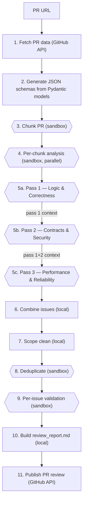

# ReviewHog Architecture

## Overview

**ReviewHog** (`products/review_hog`) is an automated GitHub PR code reviewer. It is a Django app
(`backend/apps.py`, label `review_hog`, module `products.review_hog.backend`) driven by a single
management command — there is **no API, viewset, model, or frontend** yet. A run fetches a PR from
GitHub, splits it into logically reviewable **chunks**, runs a **three-pass LLM review** of each chunk
inside **sandbox agents**, then combines → scope-cleans → deduplicates → validates the findings, renders
a markdown report, and posts inline review comments back to the PR.

Every LLM step runs inside a **sandbox agent** spawned through the shared `products/tasks` infrastructure
(`Task`/`TaskRun` → Temporal `ProcessTaskWorkflow` → Modal/Docker sandbox → agent-server). ReviewHog does
**not** call an LLM SDK directly and does **not** own any sandbox/Temporal code — it composes a prompt,
hands it to the Tasks runner, and parses the agent's final message. All run artifacts are written to a
gitignored `reviews/<pr_number>/` directory; the only external side effect is the GitHub review it posts.

This document is the living architecture reference for the product and the working tracker for the
multi-stage effort to bring this (originally March 2026) branch up to date with `master`. See
[Current state & roadmap](#current-state--roadmap) for what is done and what is next.

---

## Current state & roadmap

This branch (`signals/custom-prompt-to-sandbox`) predates ~3 months of `master` evolution. The work is
staged; keep this section updated as stages land.

### ✅ Stage 1 — mergeability + docs (current)

- **Merged `origin/master`** (6 conflicts, all in shared infra — resolved, staged, **not committed**):
  `products/tasks/backend/services/{sandbox,docker_sandbox,modal_sandbox}.py` and
  `.../temporal/process_task/activities/get_sandbox_for_repository.py` took **master's** versions (the
  branch's `branch`-aware `clone_repository` is superseded — master refactored the sandbox into an
  abstract base class and now checks out the PR branch via a `git fetch … && git checkout -B … FETCH_HEAD`
  block in `get_sandbox_for_repository.py`, driven by `ctx.branch`). `pyproject.toml` took master + re-added
  `pygithub==2.7.0` (ReviewHog needs it; master had dropped it); `uv.lock` relocked with `uv lock`.
- **Rewired the sandbox runner integration** (this was the "won't run end-to-end" breakage): master deleted
  `custom_prompt_runner.py` + `custom_prompt_executor.py` and replaced them with `custom_prompt_internals.py`
  + `custom_prompt_multi_turn_runner.py`. `sandbox/executor.py` now uses `MultiTurnSession.start_raw(...)`
  and imports `CustomPromptSandboxContext` + `extract_json_from_text` from `custom_prompt_internals`. The
  removed `resolve_sandbox_context_for_local_dev` helper is inlined into `executor.py`. Imports cleanly under
  Django; `tests/test_executor.py` passes (8/8); lint clean.
- **Replaced the stale `AGENTS.md`** (it referenced a `sandbox/runner.py` that never existed) with this
  `ARCHITECTURE.md`, modeled on `products/signals/ARCHITECTURE.md`.

### ⏭️ Stage 2+ — candidate next steps (not yet started)

ReviewHog now imports and runs against current `master`, but it is still an **alpha CLI tool**. Likely next
stages, roughly ordered:

1. **Productize beyond the CLI.** Today the only entry point is `manage.py run_review --pr-url …`. Bring it
   in line with how Signals operates: a Temporal workflow (the top of `run.py` even carries a
   `TODO: Make it a parent workflow and spawn steps as child workflows`), triggered by an API/webhook rather
   than a hand-run command, with run state persisted in Postgres instead of loose files under `reviews/`.
2. **Adopt the multi-turn session properly.** Each pipeline step currently spawns a **fresh single-turn
   sandbox** (one `MultiTurnSession.start_raw` + `end()` per call). `MultiTurnSession` is built for
   multi-turn flows (`send_followup`) — chunk-analysis → review → validation of one chunk could share a
   session (and its warm clone) instead of re-cloning the repo per call, the way `mts_example/runner.py` and
   the Signals research flow do.
3. **De-hardcode identity/config.** `executor.py` bakes in cloud `team_id=2`, `user_id=196695`,
   `repository="posthog/posthog"`, and a personal fork `sortafreel/posthog` as the local default. These
   should come from config/request context.
4. **Fix the known bugs / tech debt** listed in [Known issues](#known-issues--tech-debt) — notably the
   neutered validation parallelism, the duplicate report-generation logic, and the prompt/schema mismatches.
5. **Tests + isolation.** The product is not isolated (no `backend:contract-check`) and has no API/models;
   if it grows those, follow `products/architecture.md` (contracts + facade).

> **Scope discipline:** Stage 1 deliberately changed only what was needed for mergeability + a working
> import. The behavioral bugs below were found during analysis and documented, **not** fixed.

---

## Pipeline

The orchestration lives in `backend/reviewer/run.py` (`async def main(pr_url)`), a flat sequential async
function. Steps that fan out over chunks use `asyncio.gather`; all sandbox calls are globally throttled to
`MAX_CONCURRENT_SANDBOXES = 5` (`constants.py`) via one module-level semaphore in `executor.py`. Most steps
are **idempotent** — they skip work whose output file already exists, so a failed run can be re-run and will
resume.

See `ARCHITECTURE_DIAGRAM.mmd` (rendered: `ARCHITECTURE_DIAGRAM.png`) for the visual flow. Compact form:



### Step-by-step (as coded in `run.py`)

1. **Parse PR URL** — `PRParser.parse_github_pr_url` regex-extracts `owner/repo/pr_number`; raises on a
   malformed URL.
2. **Create output dir** — `reviews/<pr_number>/` under `_REVIEW_HOG_DIR` (which resolves to
   `products/review_hog/backend/`, so artifacts land in `backend/reviews/<pr_number>/`).
3. **Fetch PR data** — `PRFetcher.fetch_pr_data` (`tools/github_meta.py`, PyGithub, needs `GITHUB_TOKEN`)
   writes `pr_meta.json`, `pr_comments.jsonl`, `pr_files.jsonl`, `pr_files_scope.jsonl`. Lockfiles, minified
   assets, snapshots, `*.schema.py`, `*.txt`, build dirs, and test files are filtered out. `branch =
   pr_metadata.head_branch` is threaded into every sandbox step so the agent reviews the PR branch.
4. **Generate schemas** — `generate_all_schemas()` materializes `Model.model_json_schema()` for the five
   LLM-facing models into `prompts/<stage>/schema.json`; the prompt templates embed these. Must run before
   any prompt rendering.
5. **Chunk the PR** — `split_pr_into_chunks` (1 sandbox call, validates `ChunksList`) groups changed files
   into logically reviewable chunks ordered by review priority. Writes `chunks.json`.
6. **Per-chunk analysis** — `analyze_chunks` (1 sandbox call per chunk, **parallel** via `asyncio.gather`)
   writes a `goal` narrative per chunk to `chunk-{id}-analysis.json` (`ChunkAnalysis`). Informational, not
   issue-finding. On partial failure it logs and returns (does not raise).
7. **Multi-pass issue review** — `review_chunks` runs **3 sequential passes**, each chunk parallel within a
   pass. Each pass focuses on a different concern and is fed the prior passes' findings:
   - **Pass 1 — Logic & Correctness** (`PassType.LOGIC_CORRECTNESS`)
   - **Pass 2 — Contracts & Security** (`PassType.CONTRACTS_SECURITY`)
   - **Pass 3 — Performance & Reliability** (`PassType.PERFORMANCE_RELIABILITY`)

   Each pass×chunk is one sandbox call validating `IssuesReview`. Context flows forward via
   `load_previous_pass_results` → `PREVIOUS_PASSES_CONTEXT`, and each chunk's `ChunkAnalysis.goal` is
   injected as `CHUNK_ANALYSIS_CONTEXT`. The prompt also instructs cross-pass duplicate avoidance. Output:
   `pass{N}_results/chunk-{id}-issues-review.json`.
8. **Combine** — `combine_issues` (local) flattens every pass×chunk `Issue` into `issues_found_raw.json`.
9. **Scope clean** — `clean_issues` (local) drops issues whose file/lines don't overlap the PR diff. Writes
   `issues_cleaned.json` + `issues_outside_scope.json`.
10. **Deduplicate** — `deduplicate_issues` (1 sandbox call, `IssueDeduplication`) removes cross-pass/chunk
    duplicates **and** issues already raised by a competing bot's prior comments (currently hardcoded to
    `greptile-apps[bot]`). Survivors → `issues_found.json` (the canonical post-dedup set).
11. **Validate** — `validate_issues` (1 sandbox call per issue) asks the agent whether each surviving issue
    is real, writing `…/validation/summaries/chunk-{c}-issue-{i}-validation-summary.json` (`IssueValidation`,
    `is_valid` + `category`).
12. **Build report** — `prepare_validation_markdown` (local) joins chunks + analyses + valid issues into
    `review_report.md`.
13. **Publish** — `publish_review` (PyGithub) rebuilds the report from disk, posts a standalone
    "ReviewHog Alpha 🦔" feedback-solicitation comment, then a PR review (`event="COMMENT"`) with inline
    comments for `is_valid` `MUST_FIX`/`SHOULD_FIX` issues that land on a line present in the diff
    (`CONSIDER` is dropped from inline comments). Falls back to a body-only review on `GithubException`.

> The `run.py` numbering differs slightly from the prose above (it counts schema generation and the report
> step separately); the logical flow is identical.

---

## Sandbox execution layer

All LLM work funnels through one helper, `run_sandbox_review(...)`, in
`backend/reviewer/sandbox/executor.py`. The five LLM steps (chunking, chunk analysis, issues review,
deduplication, validation) call it with a prompt, the Pydantic model to validate against, and a `step_name`.

`run_sandbox_review(prompt, system_prompt, branch, output_path, model_to_validate, step_name)`:

1. Acquires the global `_sandbox_semaphore` (`asyncio.Semaphore(MAX_CONCURRENT_SANDBOXES)`), so ≤5 sandbox
   agents run at once **per process** (in-memory; not cross-worker).
2. Concatenates `full_prompt = f"{system_prompt}\n\n{prompt}"` — there is no separate system role; the agent
   receives one combined prompt.
3. Resolves a `CustomPromptSandboxContext` via `_resolve_context()`:
   - **Local dev** (`settings.DEBUG`): `_resolve_context_for_local_dev("sortafreel/posthog")` picks the first
     `Team` and first org membership's user from the DB and requires a `kind="github"` `Integration`
     (raising with setup guidance if absent). *(Inlined into `executor.py` in Stage 2; master removed the
     shared helper.)*
   - **Cloud** (`DEBUG=False`): hardcoded `team_id=2, user_id=196695, repository="posthog/posthog"`.
4. Spawns the agent via `_run_prompt(...)` → **`MultiTurnSession.start_raw(prompt, context, branch, step_name)`**
   (from `products.tasks.backend.services.custom_prompt_multi_turn_runner`), reads the agent's full S3 log
   best-effort (`object_storage.read(session.task_run.log_url)`), then **always `session.end()`s** the
   session (the runner keeps the workflow/sandbox alive between turns, so a single-turn caller must end it).
   Returns `(last_message, full_log)`.
5. Writes `full_log` to `<output>_logs.txt`, then `extract_json_from_text(last_message)` →
   `model_to_validate.model_validate(...)` → writes pretty JSON to `output_path`. On extraction/validation
   failure it writes the raw message to `<output>_error.txt` and returns `False`.

`backend/reviewer/sandbox/code_context.py` is pure-local: `prepare_code_context(chunk_filenames, pr_files)`
emits Claude-Code-style `@path#Lstart-end` references for the changed line ranges of each file (merging
adjacent ranges), so the agent reads exactly the changed lines. These are embedded into the prompts.

### Downstream chain (owned by `products/tasks`, current `master`)

```
run_sandbox_review (executor.py)
  → MultiTurnSession.start_raw            (custom_prompt_multi_turn_runner.py)
    → create_task_and_trigger             (custom_prompt_internals.py)
      → Task.create_and_run(..., create_pr=False, mode="background", branch=…)
        → Temporal ProcessTaskWorkflow
          → get_sandbox_for_repository activity
            → Sandbox.create() (Modal default; Docker when SANDBOX_PROVIDER=docker)
            → clone_repository(...)  +  git fetch --depth 1 origin <branch> && git checkout -B <branch> FETCH_HEAD
          → agent-server runs the prompt, streams JSONL (ACP session/update) to S3 (TaskRun.log_url)
  → MultiTurnSession polls S3 for the agent's end-of-turn message
  → extract_json_from_text + model_validate → write output_path(.json) / _logs.txt / _error.txt
```

The PR-branch checkout that ReviewHog depends on is performed by master's
`get_sandbox_for_repository.py` block (driven by `ctx.branch`, which originates from `TaskRun.branch`), **not**
by ReviewHog. The contract surface ReviewHog binds to (and that any future merge must preserve):
`MultiTurnSession.start_raw(...) -> (session, last_message)`, `CustomPromptSandboxContext(team_id, user_id,
repository)`, `session.task_run.log_url`, `session.end()`, and `extract_json_from_text(text, label)`.

---

## Data models

All Pydantic. `models/__init__.py` is the authoritative registry that generates the five LLM-facing
`schema.json` files from `Model.model_json_schema()` — **`schema.json` files are generated artifacts; edit
the model and regenerate, never hand-edit.**

| Model | File | Schema-backed? | Role |
| --- | --- | --- | --- |
| `ChunksList` / `Chunk` / `FileInfo` | `models/split_pr_into_chunks.py` | ✅ chunking | PR → reviewable chunks (`chunk_type`, `key_changes`) |
| `ChunkAnalysis` / `ChunkMeta` | `models/chunk_analysis.py` | ✅ chunk_analysis | per-chunk `goal` narrative |
| `Issue` / `IssuesReview` / `LineRange` / `IssuePriority` / `PassType` / `PassContext` | `models/issues_review.py` | ✅ issues_review (`IssuesReview`) | **`Issue` is the shared currency** of stages 7–12 |
| `IssueDeduplication` / `DuplicateIssue` | `models/issue_deduplicator.py` | ✅ issue_deduplicator | ids of issues to drop |
| `IssueValidation` | `models/issue_validation.py` | ✅ issue_validation | `is_valid` + `category` per issue |
| `IssueCombination` | `models/issue_combination.py` | — internal | flat merged issue list |
| `ValidationMarkdownReport*` | `models/prepare_validation_markdown.py` | — internal | report tree (Chunk × Analysis × Issue × Validation) |
| `PRMetadata` / `PRComment` / `PRFile` / `PRFileUpdate` | `models/github_meta.py` | — internal | raw GitHub ingestion |

`Issue.id` encodes provenance as `"{pass_number}-{chunk_id}-{issue_number}"` and is parsed back throughout
the pipeline to route validations and group the report. `IssuePriority` is `MUST_FIX` / `SHOULD_FIX` /
`CONSIDER`.

`utils/json_utils.py` holds JSONL helpers (`load_jsonl`, `process_jsonl`, `filter_jsonl`) and a local
`extract_json_from_text` (note: the executor uses the Tasks-layer one, not this).

---

## Prompts

Under `backend/reviewer/prompts/`, one directory per LLM stage, each with `prompt.jinja` + (generated)
`schema.json`. All prompts embed their schema via `{{ ... | safe }}` and demand "Return ONLY the JSON
content". Most begin with `{{ CLAUDE_CODE_CONTEXT | safe }}` (the `@path#L…` references).

- `chunking/prompt.jinja` — group changed files into logical, independently reviewable chunks by cohesion /
  imports / layer boundaries; order by review priority. → `ChunksList`.
- `chunk_analysis/prompt.jinja` — analyze one chunk's purpose and how it fits the PR (architecture mapping,
  dependency tracing); informational. → `ChunkAnalysis`.
- `issues_review/prompt.jinja` — the core review prompt, run once per pass per chunk; 10-step process with
  mandatory codebase investigation and cross-pass dedup. Splices the per-pass focus via
  `{{ PASS_SPECIFIC_CONTENT }}`. → `IssuesReview`.
  - `issues_review/pass_contexts/pass1_focus.jinja` — **Logic & Correctness** (defers security→P2,
    perf→P3).
  - `issues_review/pass_contexts/pass2_focus.jinja` — **Contracts & Security** (API breaking changes,
    injection/authz, validation, schema/migration alignment).
  - `issues_review/pass_contexts/pass3_focus.jinja` — **Performance & Reliability** (N+1/indexes/memory,
    error handling, scalability, operational readiness; defines a severity rubric).
- `issue_deduplicator/prompt.jinja` — mark duplicates (same file + overlapping lines + similar root cause)
  and issues matching prior review comments; keep the single most comprehensive representative. →
  `IssueDeduplication`.
- `issue_validation/prompt.jinja` — validate one issue against the live codebase; "DO NOT implement fixes,
  ONLY assess." → `IssueValidation`.

---

## Artifacts (`reviews/<pr_number>/` layout)

Root: `products/review_hog/backend/reviews/<pr_number>/` (gitignored via the product-root `.gitignore`
entry `reviews/`). Per-run files:

- **Fetch:** `pr_meta.json`, `pr_comments.jsonl`, `pr_files.jsonl`, `pr_files_scope.jsonl`
- **Chunking:** `chunking_prompt.md`, `chunks.json`
- **Analysis:** `prompts/chunk-{id}-prompt.md`, `chunk-{id}-analysis.json`
- **Review passes:** `pass{N}_prompts/chunk-{id}-code-prompt.md`,
  `pass{N}_results/chunk-{id}-issues-review.json`, `pass{N}_results/validation/{prompts,summaries,combined}/`
- **Aggregate:** `issues_found_raw.json` → `issues_cleaned.json` / `issues_outside_scope.json` →
  `deduplication_prompt.md` / `deduplicator.json` / `issues_found.json`
- **Validation:** `…/validation/summaries/chunk-{c}-issue-{i}-validation-summary.json`
- **Report:** `review_report.md`
- **Sandbox side-artifacts** (next to each output JSON): `<name>_logs.txt` (full agent log) and
  `<name>_error.txt` (raw message when JSON extraction/validation fails)

---

## Entry point, commands & configuration

- **Run a review:** `python manage.py run_review --pr-url <github_pr_url>`
  (`backend/management/commands/run_review.py` → `asyncio.run(main(pr_url=…))`).
- **Lint:** `ruff check products/review_hog/ --fix && ruff format products/review_hog/`
- **Tests:** `pytest products/review_hog/backend/reviewer/tests/` (sandbox calls are mocked; fixtures under
  `tests/fixtures/`).

**Configuration read at runtime:**

- `GITHUB_TOKEN` (env) — required to fetch the PR and to publish the review. `split_pr_into_chunks.py` calls
  `load_dotenv()`, so a `.env` works.
- `settings.DEBUG` — selects local-dev vs cloud sandbox context.
- Hardcoded in `executor.py`: cloud `team_id=2`, `user_id=196695`, `repository="posthog/posthog"`; local
  default repo `sortafreel/posthog`. *(Stage 2 candidate: de-hardcode.)*

---

## Known issues & tech debt

Found during the Stage 1 analysis; **documented, not fixed** (most are Stage 2+ work):

- **Neutered validation parallelism** — `issue_validation.create_validation_task` is `async` and `await`s
  `run_validation` while the task list is being *built*, so the "batches of 10" `asyncio.gather` operates on
  already-resolved booleans. Effective per-issue concurrency is only the global semaphore (5); the batching
  does nothing.
- **Duplicate report generation** — step 12 (`prepare_validation_markdown`) and step 13 (`publish_review`)
  independently rebuild essentially the same validation report from disk, with **divergent strictness**: the
  markdown step **raises** `FileNotFoundError` on a missing validation summary, while publish only **warns
  and skips**.
- **Inconsistent failure handling** — chunk analysis (step 6) and issue review (step 7) log and `return` on
  partial chunk failure (pipeline silently proceeds with incomplete results), whereas chunking and dedup
  raise `RuntimeError`.
- **Prompt/schema mismatches** — the `Issue` field is misspelled `is_directy_related_to_changes` (in both
  the model and the generated schema); the issues_review prompt instructs setting a `detected_in_pass` field
  that doesn't exist in the `Issue` model/schema.
- **Diff-parser gap** — `parse_patch` only emits `addition`/`deletion`/`context`, never `modification`, yet
  `issue_cleaner._build_modified_files_map` looks for `modification` ranges (dead branch; only `addition`
  ranges are ever used for scope).
- **Dead scaffolding** — `pass{N}_results/validation/combined/` directories are created but never
  written/read; commented-out `wakawaka` debug code remains in `prepare_validation_markdown.py`;
  `constants.py` has an orphaned `# ISSUE CLEANER` header.
- **Hardcoded reviewer assumption** — deduplication only recognizes `greptile-apps[bot]` as the prior
  reviewer.
- **Alpha maturity** — the published comment literally says "ReviewHog Alpha" and asks users to reply
  "valid"/"invalid"; identity/config is hardcoded (see above).
- **Flat orchestration** — `run.py` is a single async function with a top-of-file
  `TODO: Make it a parent workflow and spawn steps as child workflows`.
