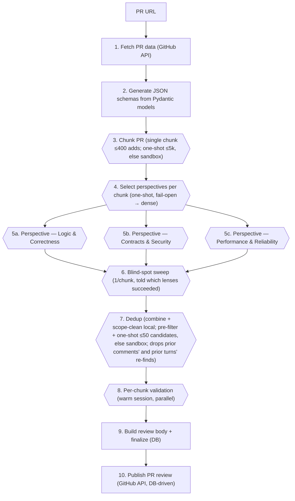

# ReviewHog Architecture

## Overview

**ReviewHog** (`products/review_hog`) is an automated GitHub PR code reviewer. It is a Django app
(`backend/apps.py`, label `review_hog`, module `products.review_hog.backend`). A run fetches a PR from
GitHub, splits it into logically reviewable **chunks**, picks which perspectives each chunk actually needs
(**perspective selection**, a cheap one-shot), runs the selected **perspective reviews in parallel** on each
chunk inside **sandbox agents**, then combines → scope-cleans → deduplicates → validates the findings, renders
a markdown report, and posts inline review comments back to the PR. Each review **perspective** (Logic &
Correctness, Contracts & Security, Performance & Reliability) is a DB-synced **LLMA skill** the sandbox agent
pulls over MCP — the same canonical-skill pattern the Signals scouts use.

The repo-access LLM steps (perspective review, blind-spot check, validation) run inside **sandbox agents**
spawned through the shared `products/tasks` infrastructure (`Task`/`TaskRun` → Temporal
`ProcessTaskWorkflow` → Modal/Docker sandbox → agent-server) — ReviewHog composes a prompt, hands it to the
Tasks runner, and gets back the validated model, owning no sandbox/Temporal code. The pure-text steps
(**chunking, perspective selection, dedup**) run within size gates as **one-shot direct LLM-gateway calls**
(`reviewer/sandbox/direct_llm.py`, structured outputs against the same pydantic models; chunking/dedup fall
back to the sandbox above their gates, selection falls back to running everything). Run state is persisted to
Postgres (`ReviewReport` + `ReviewReportArtefact`) — there is **no on-disk store**; the only external side
effect is the GitHub review it posts.

This document is the present-tense architecture reference — what ReviewHog _is today_. Its companion
**[DECISIONS.md](./DECISIONS.md)** is the full record of _why_ it got there: the staged build history, the
design decisions (with the alternatives weighed and rejected), the gotchas, the grounded implementation maps,
and the roadmap — including the designed-but-unbuilt loop. Nothing is summarized away; go there to check the
reasoning behind any part of this reference. [Status & next](#status--next) below is a short summary of what's
in flight, with the detail in DECISIONS.md.

> **Keep the docs in sync, each in its lane.** This reference is the source of truth for ReviewHog's
> architecture — the pipeline shape, the sandbox/contract surface it binds to in `products/tasks`, the data
> models, the prompts, the artefact layout. A merge or refactor that moves or renames what ReviewHog depends on
> is exactly such a change: re-point the affected sections here, don't leave them stale. Land the reasoning,
> build history, and roadmap updates in [DECISIONS.md](./DECISIONS.md) — that's the record that grows over time,
> so this reference stays lean and present-tense. Don't let the build log grow back into this file.

---

## Status & next

ReviewHog runs end-to-end: label / UI / inbox triggers → the Temporal pipeline → published PR review. The
current focus is productionizing the reviewer-topology eval and tightening the finder/validator balance
(validator strictness, fewer junk candidates, the coverage gap); the **loop** — a living, multi-turn review that
re-checks on new commits/comments and implements fixes — is designed but not built. The single-turn pipeline
below is its per-turn body. The **resolution stage** — a post-review, standalone-capable stage that triages every
unresolved review thread and implements the worth-and-safe ones directly on the PR branch — is **built and
live-qualified** (e2e on its own PR #72074, 2026-07-18 — verdicts, findings, and the GO call in
`eval/experiments/2026-07-resolution-e2e/FINAL_REPORT.md`): `ResolvePRWorkflow` (`backend/temporal/resolution.py`) drives one warm writable sandbox
session per PR (one thread per turn, humans → ReviewHog → other bots), persists per-thread `thread_verdict`
artefacts on the living report, replies/resolves server-side from verdicts (bot threads only; humans keep the
final word). **Reviewing includes resolving**: a published review chains into the stage when the acting user's
`resolve_comments` setting is on (default on; the toggle sits with the trigger opt-outs on the Code review scene,
which also carries a single-active resolution-criteria skill block and a split Review button with
review-without-resolving / resolve-only side actions). Standalone entry: `POST /api/review_hog/resolve`, the
`run_resolution` command, or the UI's resolve-only action. Design + decision record: DECISIONS.md Stage 7;
vocabulary: CONTEXT.md; the live-e2e qualification plan (the resolver fixes its own PR):
`eval/experiments/2026-07-resolution-e2e/PLAN.md`.

**TODO — check whether the reviewers sweep too wide, and how to move them closer to the validation bar.**
The resolution e2e's review leg found 55 raw issues, dedup kept 48, and the validator kept **12** — a 75% kill
rate, with every raw `must_fix` downgraded on the way through. Either the finders are paying for breadth the
validator just throws away (wasted sandbox spend + validation load), or wide-then-strict is the correct division
of labor and the funnel is healthy. Decide with data, not taste: measure per-perspective precision (share of a
perspective's finds that survive validation — the e2e run splits 12 survivors as security 4 / logic 3 /
blind-spot 3 / performance 2), then try pulling the validation-criteria bar into the perspective skills
themselves (the reviewer reads the same skill the validator applies, so it self-filters before emitting) and
compare survivor count, coverage, and cost against the wide baseline. Ties into the topology-experiment
conclusion that skill content + validator strictness — not topology — is the binding constraint.

The full roadmap — every open thread with its reasoning, the loop design, the grounded implementation maps, and
the experiment backlog — is in [DECISIONS.md](./DECISIONS.md) (start at its "🎯 NEXT" section) and `eval/`
(`RUN_LOG.md`, `POTENTIAL_EXPERIMENTS.md`, `experiments/`).

**Before real users:** settle the "ReviewHog Alpha" published-comment wording (see
[Known issues](#known-issues--tech-debt)).

---

## Preflight — is everything ready for a local review?

Check these four things before a local `run_review`; don't re-derive them from code each time.

1. **Temporal worker up** — the dev-stack (phrocs) process `temporal-worker` must be `running`
   (phrocs MCP `get_process_status`, or the `hogli` TUI). It hot-reloads via nodemon on any
   `products/**/*.py` edit — **never start a second worker** (it dies on port 8001 already-in-use).
   The `backend` process must be running too.
2. **ngrok tunnels up** (only the user can start ngrok): `curl -s http://localhost:4040/api/tunnels`
   must list all three — `django` → :8010, `gateway` → :3308 (LLM gateway), `mcp` → :8787.
   Without them the Modal sandboxes can't reach the local backend / gateway / MCP.
3. **Target PR is reviewable** — non-fork (fork PRs are rejected at fetch) and open. Drafts ARE
   reviewed and published (there is no draft gate) — warn the user before publishing on someone's
   draft. The PR's reviewable additions count picks the chunking path: ≤400 single chunk (no
   chunking LLM), ≤5000 one-shot LLM chunking, above that sandbox chunking (slowest).
4. **Prior state** — check for an existing report so you know whether this is a fresh r1 or a
   re-review (same-SHA re-runs no-op at publish via the marker + `published_head_sha`):

   ```bash
   PGPASSWORD=posthog psql -h localhost -p 5432 -d posthog -U posthog -c \
     "SELECT pr_number, status, run_count, head_sha, published_head_sha \
      FROM review_hog_reviewreport WHERE repository='PostHog/posthog' AND pr_number=<N> AND team_id=1;"
   ```

Run it (no `GITHUB_TOKEN` env — fetch and publish resolve the team's GitHub App installation token
server-side; publishing is opt-in per run via `--publish`):

```bash
flox activate -- bash -c "DJANGO_SETTINGS_MODULE=posthog.settings python manage.py \
  run_review --pr-url https://github.com/PostHog/posthog/pull/<N> --team-id 1 --user-id 1 [--publish]"
```

Verify a run: `review_hog_reviewreport.run_count` bumps once per finalized turn (status returns to
`idle`), or inspect activity-level progress in Temporal:

```bash
docker exec posthog-temporal-1 tctl --address temporal:7233 --ns default workflow show \
  --workflow_id "review-pr:<team>:<owner>/<repo>:<pr>"
```

---

## Pipeline

The orchestration is a Temporal workflow: `ReviewPRWorkflow` (`backend/temporal/workflow.py`) drives the setup
activities → two fan-out **child workflows** (perspective review / validate) → finishing activities, each stage an
activity in `backend/temporal/activities.py`. Only small values cross boundaries (`report_id` + `head_sha` + unit
keys / JSON issue slices); every activity reloads its inputs from the per-turn `pr_snapshot` artefact, so no big
payload hits Temporal's ~2 MiB cap. State persists to Postgres (`ReviewReport` + `ReviewReportArtefact`); there is
**no on-disk store**. Each fan-out child bounds its per-unit sandbox activities with a fresh
`asyncio.Semaphore(MAX_CONCURRENT_SANDBOXES)` (`constants.py`) + `gather(return_exceptions=True)` — there is no
module-level semaphore. The expensive, turn-stable sandbox stages (chunk / perspective review) are **idempotent via
a head_sha-scoped DB resume** — a re-run reuses their rows instead of re-calling the sandbox; dedup recomputes,
while validation resumes per issue off its persisted verdicts (`load_run_validations`). The validator runs one warm
multi-turn session per chunk (one verdict per turn); there is **no separate analyze stage** (the reviewer
self-investigates from the diff + the PR intent).

Visual flow (this compact diagram is the only one — a full-detail `ARCHITECTURE_DIAGRAM.mmd` existed and was
deleted deliberately; every attempt to keep it readable and current failed, so don't recreate it):



### Step-by-step (as orchestrated by `ReviewPRWorkflow`)

1. **Parse PR URL** — `PRParser.parse_github_pr_url` regex-extracts `owner/repo/pr_number`; raises on a
   malformed URL.
2. **Fetch PR data** — `PRFetcher(owner, repo, pr_number, token, installation_id).fetch_pr_data()`
   (`tools/github_meta.py`, GitHub REST via the gated egress transport — see `tools/github_client.py`;
   `token` is the team's GitHub App installation token, resolved server-side in the activity — no env `GITHUB_TOKEN`)
   returns `(pr_metadata, pr_comments, pr_files, diff)` **in-process** — no files. The fetch activity rejects fork PRs
   (`PRMetadata.is_fork`) non-retryably before opening the report. The
   `diff` is the reviewed files' raw unified patch (the point-in-time snapshot). Lockfiles, minified assets,
   snapshots, `*.schema.py`, `*.txt`, build dirs, and test files are filtered out. `branch =
pr_metadata.head_branch` is threaded (as explicit kwargs, alongside `team_id` / `user_id`) into every sandbox
   activity — there is no ContextVar identity. The team's GitHub integration is validated up front by
   `validate_github_integration_activity`; `upsert_review_report` opens the living `ReviewReport`, and
   `persist_commit_snapshot(…, diff=…)` records this turn's snapshot (gated on the `head_sha` watermark).
3. **Generate schemas** — `generate_all_schemas()` materializes `Model.model_json_schema()` for the five
   LLM-facing models into `prompts/<stage>/schema.json` (static package assets, **not** per-run state); the
   prompt templates embed these. Must run before any prompt rendering.
4. **Chunk the PR** — `split_pr_into_chunks` (1 LLM call, validates `ChunksList`) groups changed files
   into logically reviewable chunks ordered by review priority. Within
   `CHUNKING_ONESHOT_MAX_ADDITIONS` (5000 reviewable added lines) the call is a **one-shot gateway call**
   (`run_oneshot_review`, Sonnet 5 @ xhigh, structured outputs — the prompt embeds metadata + comments +
   patches inline, so no repo access is needed); above the gate it stays a sandbox call, pinned to the
   same Sonnet 5 @ xhigh via the `CHUNKING_*` constants (identical prompt — the sandbox only adds repo
   access the agent may not use). Returns the
   `ChunksList`; persists a `chunk_set` row (and resumes from it on a re-run of the same head).
5. **Parallel perspective review** — `review_chunks` runs **three independent specialist perspectives
   concurrently** per chunk (one sandbox activity per `(perspective × chunk)`, bounded by the child workflow's `asyncio.Semaphore`),
   each with **no cross-perspective context** — overlap is left to dedup (7):
   - **Logic & Correctness** (`PerspectiveType.LOGIC_CORRECTNESS`)
   - **Contracts & Security** (`PerspectiveType.CONTRACTS_SECURITY`)
   - **Performance & Reliability** (`PerspectiveType.PERFORMANCE_RELIABILITY`)

   The three perspectives come from the ordered `PERSPECTIVES` registry (`reviewer/skill_loader.py`);
   `load_perspectives_for_run(team_id)` pins each one's current `LLMSkill` version for the run. Delivery is
   **pull** — the prompt instructs the sandbox agent to `skill-get(review-hog-perspective-…, version=N)` over
   MCP and apply that perspective's focus, rather than splicing the focus text into the prompt. Each
   perspective×chunk is one sandbox call validating `IssuesReview` (step name `issues-review-p{pass}-c{chunk}`);
   the reviewer self-investigates the chunk from the diff + `<pr_intent>` (no separate analysis pass is fed in).
   Returns `dict[(pass, chunk), IssuesReview]`; persists/resumes per-pair `perspective_result` rows. (The `pass`
   ordinal = the perspective's 1-based position in `PERSPECTIVES`.) A **blind-spot sweep** then runs once per
   chunk under a reserved pass number, told which lenses already ran, to catch what none of them surfaced.

6. **Combine + scope-clean** — `combine_issues(perspective_results)` flattens every perspective×chunk `Issue`
   (stamping `source_perspective` from the ordinal), then `clean_issues(issues, pr_files)` drops issues whose
   file/lines don't overlap the PR diff. Both pure, in-process.
7. **Deduplicate** — `deduplicate_issues(issues, pr_metadata, pr_comments, …)` first runs a **deterministic
   positional pre-filter** (`_select_dedup_candidates`): only issues sharing a file + overlapping lines with
   another issue or **any prior inline comment** can be duplicates, so isolated issues survive **without** an LLM
   call (and a zero-candidate run skips the LLM entirely). Colliding candidates go to the single LLM dedupe call
   (`IssueDeduplication`) — a **one-shot gateway call** within `DEDUP_ONESHOT_MAX_FINDINGS` (50 issues entering
   dedup; the prompt is pure text), the sandbox path above it pinned to the same Sonnet 5 @ xhigh via the
   `DEDUP_*` constants — which also drops findings any prior inline
   comment already raised — every reviewer (bot
   or human, ReviewHog's own included) treated uniformly, the author handle passed through for context.
   Returns the canonical post-dedup `list[Issue]`; `persist_findings` mirrors them to
   `issue_finding` rows.
8. **Validate** — the `ValidateIssuesWorkflow` child groups the survivors by chunk and fans out **one warm
   multi-turn session per chunk** (concurrent across chunks, bounded by its `asyncio.Semaphore`):
   `validate_chunk_activity` opens one sandbox, validates the chunk's issues as **sequential turns (one verdict per
   turn)**, and persists each `validation_verdict` row via `persist_verdict` (paired to findings by `issue_key`).
   **Resume-aware:** `load_run_validations` splits the chunk's issues into already-judged / pending, so a retry
   re-researches only the pending ones. The keep/drop **criteria are pulled, not baked**: the prompt instructs the
   agent to `skill-get` the team's `review-hog-validation-criteria` skill (version pinned by
   `load_validation_skill_for_run`), so the bar for "this issue matters" is team-owned, like the perspectives.
9. **Build report + finalize** — `build_review_body(chunks, issues, validations, pr_files)` renders the public body
   in-process (verdicts sourced from the DB via `load_run_validations`, the same rows publish reads); chunks with
   no validated finding are skipped, and valid `MUST_FIX`/`SHOULD_FIX` findings whose line isn't on the diff are
   appended as an **"Other findings (outside the changed lines)"** section so they aren't silently dropped at publish.
   `finalize_review_report` stores it as `ReviewReport.report_markdown` and bumps the run watermark.
10. **Publish** — `publish_review` (GitHub REST via the gated egress transport, **DB-driven**) reads the body from
    `ReviewReport.report_markdown` and the inline comments from the valid finding/verdict rows (`load_valid_findings`),
    posts a standalone "ReviewHog Alpha 🦔" feedback comment, then a PR review (`event="COMMENT"`, **pinned to the
    reviewed `head_sha`** via `commit_id`) with inline comments for `is_valid` `MUST_FIX`/`SHOULD_FIX` findings that
    land on a line present in the current diff (`CONSIDER` dropped). It posts whenever there's ≥1 valid publishable
    finding — if all are off-diff (no inline comments resolve) the body still posts, carrying them in the
    Other-findings section, so a review is never dropped wholesale. Falls back to a body-only review when
    posting with inline comments fails. Authenticates with the team's installation token. Gated **per run** by `inputs.publish` (the workflow only dispatches this stage
    when publishing is on); the eval CLI defaults it off, the label trigger sets it on.

---

## Sandbox execution layer

Most LLM work funnels through one helper, `run_sandbox_review(...)`, in `backend/reviewer/sandbox/executor.py`.
The single-turn steps (issues review, plus chunking/deduplication above their one-shot gates) call it with a
prompt, the Pydantic model to validate against, and a `step_name`. Validation instead drives a **warm multi-turn
session** per chunk via the sibling helpers `start_sandbox_session` / `continue_sandbox_session` /
`end_sandbox_session` (one verdict per turn). The sandbox-free counterpart for the gated chunking/dedup calls is
`run_oneshot_review(...)` in `backend/reviewer/sandbox/direct_llm.py` (same call shape minus
`repository`/`branch`; one gateway Messages call, structured outputs, no sandbox).

`run_sandbox_review(team_id, user_id, repository, branch, prompt, system_prompt, model_to_validate, step_name) -> Model | None`:

1. Does **not** own concurrency — the caller bounds it: each fan-out child workflow wraps its per-unit sandbox
   activities in a fresh `asyncio.Semaphore(MAX_CONCURRENT_SANDBOXES)` (`constants.py`). The old module-level
   `_sandbox_semaphore` was removed in the Temporal migration.
2. Concatenates `full_prompt = f"{system_prompt}\n\n{prompt}"` — there is no separate system role; the agent
   receives one combined prompt.
3. Builds a `CustomPromptSandboxContext` **inline** from the explicit `team_id` / `user_id` / `repository` it
   receives — there is no ContextVar identity (the migration deleted `bind_sandbox_identity` /
   `_sandbox_context_for`). `team_id` / `user_id` are threaded as explicit activity inputs from the entry point —
   the `run_review` `--team-id` / `--user-id` CLI args, or the production trigger (the PR's author + their team).
   The team's `kind="github"` `Integration` is validated up front by a separate
   `validate_github_integration_activity`, not here.
4. Spawns the agent via `_run_prompt(...)` → **`MultiTurnSession.start(prompt, context, model=…, branch, step_name)`**
   (imported from the Tasks facade `products.tasks.backend.facade.agents`; impl at
   `products.tasks.backend.logic.services.custom_prompt_multi_turn_runner`). `start` runs the agent **and
   validates its end-of-turn JSON against `model_to_validate` internally**, returning `(session, model)`. On
   success the caller **`session.end()`s** (the runner keeps the workflow/sandbox alive between turns, so a
   single-turn caller must end it) and returns the validated model; on a sandbox error or a parse/validation
   failure `start` ends its own session and raises, so the helper logs and returns **`None`**. There is no
   `output_path` / `_error.txt` and no manual JSON extraction — persistence is the caller's job. The runner
   persists the full agent log at `task_run.log_url` (S3 / Tasks UI), so the executor never copies it locally.

The perspective review runs on a different model family than the rest — **OpenAI Codex `gpt-5.5` @ `xhigh`**,
pinned by `REVIEW_{RUNTIME_ADAPTER,MODEL,REASONING_EFFORT}` constants and passed as optional kwargs to
`run_sandbox_review`; chunking, dedup, and the validator stay on the Claude default. See [DECISIONS.md](./DECISIONS.md)
for why (and the `full-access` permission-mode gotcha headless Codex needs), and
[Selecting the sandbox model & reasoning effort](#selecting-the-sandbox-model--reasoning-effort) below for the
two-repo path that applies these knobs.

`backend/reviewer/sandbox/code_context.py` is pure-local: `prepare_code_context(chunk_filenames, pr_files)`
emits Claude-Code-style `@path#Lstart-end` references for the changed line ranges of each file (merging
adjacent ranges), so the agent reads exactly the changed lines. These are embedded into the prompts.

### Downstream chain (owned by `products/tasks`, current `master`)

```python
run_sandbox_review (executor.py)
  → imports MultiTurnSession / CustomPromptSandboxContext
      from products.tasks.backend.facade.agents   (facade re-export; impl under logic/services/)
  → MultiTurnSession.start(model=…)       (logic/services/custom_prompt_multi_turn_runner.py)
    → create_task_and_trigger             (logic/services/custom_prompt_internals.py)
      → Task.create_and_run(..., create_pr=False, mode="background", branch=…)
        → Temporal ProcessTaskWorkflow
          → get_sandbox_for_repository activity
            → Sandbox.create() (Modal default; Docker when SANDBOX_PROVIDER=docker)
            → clone_repository(...)  +  git fetch --depth 1 origin <branch> && git checkout -B <branch> FETCH_HEAD
          → agent-server runs the prompt, streams JSONL (ACP session/update) to S3 (TaskRun.log_url)
  → start() polls S3 for the end-of-turn message, parses + validates against the model internally
  → returns (session, model); caller ends the session and returns the model (None on failure)
```

The PR-branch checkout that ReviewHog depends on is performed by master's
`get_sandbox_for_repository.py` block (driven by `ctx.branch`, which originates from `TaskRun.branch`), **not**
by ReviewHog. The contract surface ReviewHog binds to — **imported only through the Tasks facade
`products.tasks.backend.facade.agents`** (Tasks is an isolated product; `tach` enforces the boundary) and
that any future merge must preserve: `MultiTurnSession.start(prompt, context, model, *, branch, step_name)
-> (session, model)`, `CustomPromptSandboxContext(team_id, user_id, repository)`, and `session.end()`.

### Selecting the sandbox model & reasoning effort

Read this before testing another model (Sonnet, a new Codex model, a different effort). It is a **two-repo path**:
`posthog/posthog` _sets_ the knobs and the `@posthog/agent` package _applies_ them. A pinned run is three values —
`runtime_adapter` + `model` + `reasoning_effort`; `provider` is _derived_ from the adapter (`claude → anthropic`,
`codex → openai`), never set by hand.

**`posthog/posthog` — where the knobs are set + validated.**

- **Pick the values (ReviewHog):** `reviewer/constants.py` `REVIEW_{RUNTIME_ADAPTER,MODEL,REASONING_EFFORT}` →
  passed at the `review_chunk_activity` `run_sandbox_review(...)` call → `run_sandbox_review`
  (`reviewer/sandbox/executor.py`) threads them onto the `CustomPromptSandboxContext`. To test another model, change
  these constants (the executor kwargs exist for every single-turn stage).
- **The registry (source of truth for what's allowed)** — `products/tasks/backend/temporal/process_task/utils.py`,
  re-exported framework-free from the facade `products/tasks/backend/facade/run_config.py` (import from the facade):
  `RuntimeAdapter` (`claude|codex`), `LLMProvider`, `ReasoningEffort`, `RUNTIME_PROVIDER_BY_ADAPTER`,
  `CLAUDE_REASONING_EFFORTS_BY_MODEL`, `CODEX_MODELS` + `CODEX_REASONING_EFFORTS` + `CODEX_XHIGH_REASONING_MODELS`
  (only `gpt-5.5` allows `xhigh`), and the pure checks `get_provider_for_runtime_adapter` /
  `get_supported_reasoning_efforts` / `get_reasoning_effort_error`. A new model/effort must be added here or the combo
  is rejected. `test_constants.py` locks the ReviewHog combo to this registry at unit time.
- **Transport into the sandbox:** `Task._build_task` writes `extra_state[{runtime_adapter, provider, model,
reasoning_effort}]` → `get_task_processing_context` reads it back → `start_agent_server` →
  `build_agent_runtime_env_prefix` (`logic/services/sandbox.py`) emits
  `POSTHOG_CODE_{RUNTIME_ADAPTER,PROVIDER,MODEL,REASONING_EFFORT}` env prefixed onto the agent launch command.

**`@posthog/agent` — where they are consumed + applied** (the PostHog Code monorepo, _not_ this repo; clone via
`LOCAL_POSTHOG_CODE_MONOREPO_ROOT`, package `packages/agent`, baked into `Dockerfile.sandbox-base`).

- **Entry `src/server/bin.ts`** reads + zod-validates `POSTHOG_CODE_{RUNTIME_ADAPTER,MODEL,REASONING_EFFORT}`, guards
  with `isSupportedReasoningEffort` (`src/adapters/reasoning-effort.ts` — the agent-side mirror of the Python
  registry; hard-errors server startup on an unsupported combo), then constructs the `AgentServer`.
- **Adapter split `src/server/agent-server.ts`:** Codex → `src/adapters/codex/spawn.ts::buildConfigArgs` pushes
  `-c model="…"` **and** `-c model_reasoning_effort="…"` onto the Codex CLI (this is the line that applies `xhigh` to
  `gpt-5.5`); Claude → `buildClaudeCodeSessionMeta` sets `options.model` + `options.effort` (effort only for the
  claude adapter). `agent.ts` fetches the gateway model allow-list and **silently drops the model if it isn't served**
  (`sanitizedModel` / `allowedModelIds`), so a typo'd/unavailable model falls back to a default rather than erroring —
  verify `$ai_model` on every run when switching.

**Recipe — testing e.g. Sonnet.** Set `runtime_adapter = "claude"`, `model` a key in `CLAUDE_REASONING_EFFORTS_BY_MODEL`,
and an effort that model supports; provider auto-derives to `anthropic`. For a new Codex model: `runtime_adapter =
"codex"`, `model` in `CODEX_MODELS`, effort in `CODEX_REASONING_EFFORTS` (`xhigh` only if the model is in
`CODEX_XHIGH_REASONING_MODELS`). A brand-new model/effort must be added to the registry in **both** repos (`utils.py`
here + `reasoning-effort.ts` / the gateway model list in `@posthog/agent`) or startup validation rejects it on one side.

---

## Data models

All Pydantic. `models/__init__.py` is the authoritative registry that generates the five LLM-facing
`schema.json` files from `Model.model_json_schema()` — **`schema.json` files are generated artifacts; edit
the model and regenerate, never hand-edit.**

| Model                                                                        | File                                    | Schema-backed?                    | Role                                                                                                                                       |
| ---------------------------------------------------------------------------- | --------------------------------------- | --------------------------------- | ------------------------------------------------------------------------------------------------------------------------------------------ |
| `ChunksList` / `Chunk` / `FileInfo`                                          | `models/split_pr_into_chunks.py`        | ✅ chunking                       | PR → reviewable chunks (`chunk_type`, `key_changes`)                                                                                       |
| `Issue` / `IssuesReview` / `LineRange` / `IssuePriority` / `PerspectiveType` | `models/issues_review.py`               | ✅ issues_review (`IssuesReview`) | **`Issue` is the shared currency** of the dedup → validate → publish stages; `Issue.source_perspective` records which perspective found it |
| `IssueDeduplication` / `DuplicateIssue`                                      | `models/issue_deduplicator.py`          | ✅ issue_deduplicator             | ids of issues to drop                                                                                                                      |
| `IssueValidation`                                                            | `models/issue_validation.py`            | ✅ issue_validation               | `is_valid` + `category` (+ optional `adjusted_priority`) per issue                                                                         |
| `ValidationMarkdownReport*`                                                  | `models/prepare_validation_markdown.py` | — internal                        | report tree (Chunk × Issue)                                                                                                                |
| `PRMetadata` / `PRComment` / `PRFile` / `PRFileUpdate`                       | `models/github_meta.py`                 | — internal                        | raw GitHub ingestion                                                                                                                       |

`Issue.id` encodes provenance as `"{pass_number}-{chunk_id}-{issue_number}"` and is parsed back throughout
the pipeline to route validations and group the report. `IssuePriority` is `MUST_FIX` / `SHOULD_FIX` /
`CONSIDER`. The validator may override a finding's priority via `adjusted_priority` (validator-wins, resolved at
read time by `effective_priority`); see [DECISIONS.md](./DECISIONS.md).

---

## Prompts

Under `backend/reviewer/prompts/`, one directory per LLM stage, each with `prompt.jinja` + (generated)
`schema.json`. All prompts embed their schema via `{{ ... | safe }}` and demand "Return ONLY the JSON
content". Most begin with `{{ CLAUDE_CODE_CONTEXT | safe }}` (the `@path#L…` references).

- `chunking/prompt.jinja` — group changed files into logical, independently reviewable chunks by cohesion /
  imports / layer boundaries; order by review priority. → `ChunksList`.
- `issues_review/prompt.jinja` — the core review prompt, run once per perspective per chunk; 10-step process
  with mandatory codebase investigation. The per-perspective focus is **no longer spliced in** — the
  `<your_review_perspective>` block instructs the agent to `skill-get(PERSPECTIVE_SKILL_NAME, version=N)` over
  MCP and apply that perspective's focus (pull delivery). → `IssuesReview`. The perspective focuses themselves
  live as **DB-synced LLMA skills** at
  `products/review_hog/skills/review-hog-perspective-{logic-correctness,contracts-security,performance-reliability}/SKILL.md`.
- `issue_deduplicator/prompt.jinja` — mark duplicates (same file + overlapping lines + similar root cause)
  and issues matching prior review comments; keep the single most comprehensive representative. →
  `IssueDeduplication`.
- `issue_validation/prompt.jinja` — validate one issue against the live codebase; "DO NOT implement fixes,
  ONLY assess." **Criteria-agnostic**: a `<your_validation_criteria>` block tells the agent to
  `skill-get(review-hog-validation-criteria, version=N)` over MCP and apply that team-owned bar for the keep/drop
  (`is_valid`) decision — default bar: keep real user-affecting correctness / security / data-loss / contract /
  performance issues; drop overengineering, speculation, defensive paranoia, never-gonna-happen edges, and style.
  The criteria live as a DB-synced LLMA skill at
  `products/review_hog/skills/review-hog-validation-criteria/SKILL.md`. → `IssueValidation`.

A separate **blind-spots** skill (`skills/review-hog-blind-spots-general/SKILL.md`) drives the per-chunk sweep;
it is pull-delivered the same way. The perspective / validation / blind-spot skills are all team-owned and
customizable — see [DECISIONS.md](./DECISIONS.md) (the customizable-perspectives / per-user-enablement sections).
The invariant that keeps this safe: **the output schema is fixed (code), only the skill body (logic) is editable**,
so editing a skill can never change the output format the downstream pipeline depends on.

---

## Persistence (Postgres — no on-disk store)

There is **no `reviews/<pr>/` tree**. A run's state is in-process within the workflow and
mirrored to Postgres on `ReviewReport` / `ReviewReportArtefact`.
Per-run state by kind:

- **Fetch outputs** (`pr_metadata`, `pr_comments`, `pr_files`) — in-process return values, never persisted
  (re-fetchable from GitHub). The reviewed unified `diff` rides back as a string and becomes the per-turn
  **`commit`** artefact (the durable point-in-time snapshot).
- **Working state** (the resume substrate, head_sha-scoped): `chunk_set`, `perspective_result`, and the
  `pr_snapshot` artefacts. The raw/cleaned/combined issue sets are in-process values down the
  combine→clean→dedup chain.
- **Outputs:** `issue_finding` + `validation_verdict` artefacts (the canonical findings/verdicts) and
  `ReviewReport.report_markdown` (the rendered review body) + the `head_sha` / `last_seen_comment_id`
  watermark.
- **Prompts / agent logs:** rendered in-process and sent to the sandbox; the full prompt + conversation is in
  the S3 agent log at `task_run.log_url` (the executor never copies it locally). Generated `prompts/<stage>/schema.json`
  are static package assets in the source tree, not per-run state.

**Data model** (`products/review_hog/backend/models.py`). Both models are **fail-closed team-scoped** (CLAUDE.md
IDOR rule) via `class X(UUIDModel, TeamScopedRootMixin)`:

- **`ReviewReport`** — the living per-PR document, unique on `(team, repository, pr_number)` (the idempotency
  key, so re-runs append turns rather than create a new report; branch-only targets key on
  `(team, repository, head_branch) WHERE pr_number IS NULL`). Carries `status` (`active`/`idle`/`closed`),
  `run_count`, `last_run_at`, the `head_sha` + `last_seen_comment_id` watermark, `published_head_sha`, the
  rendered `report_markdown`, `acting_user`, and the `signal_report_id` / `trigger_source` provenance.
- **`ReviewReportArtefact`** — the append-only work log mirroring `SignalReportArtefact`, with a funnel that
  derives `type` from the content-model class and maps `ArtefactAttribution` → `created_by_id` / `task_id`.
  `ArtefactType`: `issue_finding`, `validation_verdict`, `task_run`, `commit`, `code_reference`, `note`, plus
  the working-state types `chunk_set`, `perspective_result`, `perspective_selection`, `pr_snapshot`.

Content schemas (`reviewer/artefact_content.py`, pydantic): `ReviewIssueFinding` and `ValidationVerdict` are
ReviewHog-owned; `Commit` / `CodeReference` / `TaskRunArtefact` / `NoteArtefact` are reused from the Signals leaf.
See [DECISIONS.md](./DECISIONS.md) for the "reuse the leaf, own the model" boundary and why a PR review is not a
`SignalReport`.

---

## Entry point, commands & configuration

- **Run a review:** `python manage.py run_review --pr-url <github_pr_url> --team-id <id> --user-id <id>`
  (`backend/management/commands/run_review.py`, blocking `execute_review_pr_workflow`, default no-publish, with an
  optional `--publish`). All three args are required.
  - **Default local-testing PR:** an **origin-branch** PR — its head branch must live on `PostHog/posthog`,
    because the sandbox clones the **base** repo and checks out the head branch **by name**
    (`get_sandbox_for_repository`, owned by `products/tasks`), so a **fork** PR fails at the checkout step. Until
    the sandbox learns to fetch `refs/pull/N/head`, test against origin-branch PRs.
- **Publish a computed review without recomputing:** `python manage.py publish_review --pr-url <url> --team-id <id>`
  publishes the latest completed turn at its reviewed `head_sha` (DB-driven; no Temporal, no sandbox).
- **Reset local state:** `DEBUG=1 python manage.py reset_review_hog [--dry-run] [--yes]` wipes all ReviewHog rows
  across every team (DEBUG-only; GitHub comments untouched).
- **Lint:** `ruff check products/review_hog/ --fix && ruff format products/review_hog/`
- **Tests:** the product's `backend:test` script covers **both** `backend/tests` and `backend/reviewer/tests`
  (sandbox calls mocked, fixtures under `reviewer/tests/fixtures/`; persistence/model tests hit the test DB). Verify
  against that script, not a hand-picked path — `backend/reviewer/tests/` is easy to forget.

**Configuration read at runtime:**

- **GitHub auth** — the team's **GitHub App installation token**, resolved server-side per activity via
  `GitHubIntegration.first_for_team_repository(team_id, repo)` (`_installation_auth` returns
  `(get_access_token(), github_installation_id)`, auto-refreshing). No `GITHUB_TOKEN` env var; the worker no longer
  needs one. All calls route through `posthog.egress.github.transport.github_request` (via
  `reviewer/tools/github_client.py`), metered against the installation's shared egress budget.
- `--team-id` / `--user-id` (CLI, required) — the team the review runs and persists under, and the user the
  sandbox tasks run as. They are threaded as **explicit activity inputs** (no ContextVar identity); the team's
  `kind="github"` `Integration` is validated up front by `validate_github_integration_activity`.
  The sandbox `repository` is the PR's own `owner/repo`, derived from the PR URL.
- **Prod label trigger** (settings, `posthog/settings/access.py`) — `REVIEWHOG_TRIGGER_TOKEN` (shared secret),
  `REVIEWHOG_TEAM_ID` (the run team), `REVIEWHOG_RUN_USER_ID` (optional; falls back to the integration creator).

**Triggers.** Four entry points drive the same `ReviewPRWorkflow`: the `run_review` CLI (manual / eval), the
`reviewhog` **label** on a `PostHog/posthog` PR (a thin GitHub Action → `POST /api/review_hog/trigger`), a **UI**
"Review this PR" field in the Code review scene (session-authed, any installation-accessible PR), and an **inbox**
trigger (a `TaskRun` receiver auto-reviews self-driving Signals implementations). See [DECISIONS.md](./DECISIONS.md)
for each trigger's auth / scope / identity rules.

---

## Known issues & tech debt

- **✅ RESOLVED — transient sandbox timeout silently drops a review.** Superseded by the Temporal migration
  and later hardening: every review unit is an activity with `RetryPolicy(maximum_attempts=2)`, failed units
  are counted and logged per stage (never silent), and a fan-out stage losing more than
  `FAN_OUT_FAILURE_FLOOR = 0.70` of its units fails the run loudly (`_enforce_failure_floor`,
  `temporal/workflow.py`). Validation turn failures additionally retry with skip-resume.
- **TODO — perspective fan-out back-loads the last perspective.** `ReviewPerspectivesWorkflow.run` builds the
  wave gather in perspective order (`units = [(p, c) for p in ordered for c in inputs.chunk_ids]`,
  `temporal/workflow.py`); with a FIFO semaphore the last perspective queues at the back, so the Performance
  reviews tend to finish last. It is genuinely parallel, but not balanced per-chunk. Fix: interleave the task
  list by chunk (`P1c1, P2c1, P3c1, P1c2, …`) so a chunk's perspectives co-schedule. (Raising
  `MAX_CONCURRENT_SANDBOXES` partly mitigates by leaving fewer tasks queued.)
- **Per-stage failure policy (deliberate).** Chunking, selection, and dedup run under `_ONESHOT_RETRY`
  (5 spaced, escalating attempts — provider-overload spells last minutes, so back-to-back retries all land inside
  the same spell); chunking and dedup fail the run once retries exhaust (single-unit stages, nothing to degrade
  to), while selection fails open to the dense product. The perspective wave and blind-spot sweep are best-effort
  under the 70% failure floor; validation retries per chunk, and only the final attempt degrades to skipping the
  failing issue. Every best-effort stage is floor-bounded and logs its losses.
- **Resume identity residual — working-state cache is roster-blind.** The per-head `perspective_result` /
  `perspective_selection` rows resume on positional `(pass_number, chunk_id)` keys, so if a different acting user
  (different enabled-perspective roster) resumes a turn that persisted working state **without** stamping
  `published_head_sha` (a zero-findings or crashed turn), slots can silently mis-map. Identical rosters are always
  safe. Fix belongs with cross-turn finding identity: key results by `skill_name`(+version) instead of slot, and
  drop persisted selection/results whose recorded roster differs from the run's.
- **Alpha maturity** — the published comment still says "ReviewHog Alpha" and asks users to reply
  "valid"/"invalid" (`reviewer/tools/publish_review.py`, the `post_promo` block). Publish is now live
  per-run (the trigger endpoint posts with `publish=true`), so settle the prod wording before real users
  see it.
