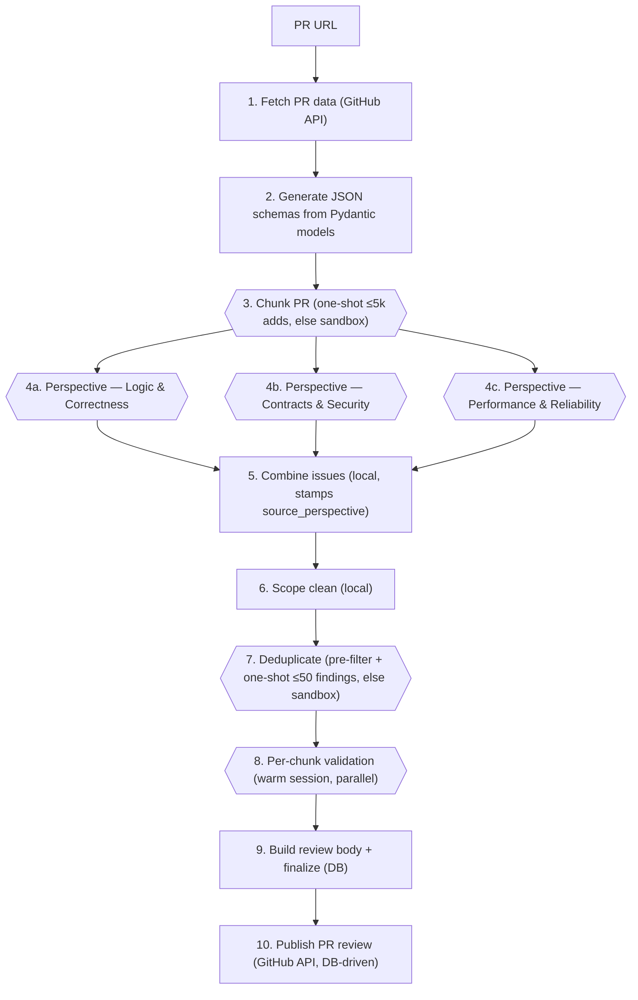

# ReviewHog Architecture

## Overview

**ReviewHog** (`products/review_hog`) is an automated GitHub PR code reviewer. It is a Django app
(`backend/apps.py`, label `review_hog`, module `products.review_hog.backend`) driven by a single
management command — there is **no API, viewset, model, or frontend** yet. A run fetches a PR from
GitHub, splits it into logically reviewable **chunks**, picks which perspectives each chunk actually needs
(**perspective selection**, a cheap one-shot), runs the selected **perspective reviews in parallel** on each
chunk inside **sandbox agents**, then combines → scope-cleans → deduplicates → validates the findings, renders
a markdown report, and posts inline review comments back to the PR. Each review **perspective** (Logic &
Correctness, Contracts & Security, Performance & Reliability) is a DB-synced **LLMA skill** the sandbox agent
pulls over MCP — the same canonical-skill pattern the Signals scouts use.

The repo-access LLM steps (perspective review, blind-spot check, validation) run inside **sandbox agents**
spawned through the shared `products/tasks` infrastructure (`Task`/`TaskRun` → Temporal
`ProcessTaskWorkflow` → Modal/Docker sandbox → agent-server) — ReviewHog composes a prompt, hands it to the
Tasks runner, and gets back the validated model, owning no sandbox/Temporal code. The pure-text steps
(**chunking, perspective selection, dedup**) run within size gates as **one-shot direct LLM-gateway calls**
(`reviewer/sandbox/direct_llm.py`, structured outputs against the same pydantic models; chunking/dedup fall
back to the sandbox above their gates, selection falls back to running everything — see
"✅ BUILT 2026-07-03" below). Run state is persisted to Postgres
(`ReviewReport` + `ReviewReportArtefact`) — there is **no on-disk store**; the only external side effect is
the GitHub review it posts.

This document is the living architecture reference for the product and the working tracker for the
multi-stage effort to bring this (originally March 2026) branch up to date with `master`. See
[Current state & roadmap](#current-state--roadmap) for what is done and what is next.

> **Keep this doc in sync.** It is the source of truth for ReviewHog's architecture and its merge
> tracker, so if something it describes is seriously updated, update the doc in the same change.
> That covers the pipeline shape, the sandbox/contract surface it binds to in `products/tasks`, the
> data models, the prompts, the artifacts layout, and the roadmap stages. A merge or refactor that
> moves or renames what ReviewHog depends on is exactly such a change — re-point the affected
> sections here, don't leave them stale.

---

## Current state & roadmap

This work (now on `signals/reviewhog`, originally `signals/custom-prompt-to-sandbox`) predates several
months of `master` evolution. The work is staged; keep this section updated as stages land.

### 🎯 NEXT — productionize the 2026-07 reviewer-topology eval (CURRENT start-here; older START-HERE markers below are historical)

**Context:** a 17-run topology experiment (8 configs, frozen PR #62096, LLM-judged vs the old reviewer's
10-finding yardstick) is archived at `products/review_hog/eval/experiments/2026-07-reviewer-topology/` —
read `FINAL_REPORT.md` there first (config glossary + coverage matrix + ranking). Reusable dump harness:
`eval/scripts/dump_result.py` (OUT_DIR-overridable). The winning shape: semantic chunking for mid-size PRs

- parallel perspectives + one "what did everyone miss?" **blind-spot check** per chunk (C4/C7 — most
  consistent and highest-output config; the eval and its archive call this unit the "gap pass" — same thing,
  renamed below). Expected prod delta on a ~500-addition PR: ~5–6 valid findings / ~19M in /
  ~23 min, vs today's ~3–4 / ~11M / ~14 min. **The experiment code for all topologies sits UNCOMMITTED in
  the working tree behind default-off `EXPERIMENT_*` constants (297 review_hog tests + ruff green)** — the
  items below convert the winners into prod code and delete the losers. Decisions locked with the user
  2026-07-02:

1. **✅ DONE 2026-07-02 — chunking numbers: dual-duty constant split.** `CHUNK_TARGET_ADDITIONS=1000`
   served as BOTH the single-chunk gate and the chunker's size guidance. Now split (as planned):
   `SINGLE_CHUNK_GATE_ADDITIONS = 400` (≤400 reviewable additions → one chunk, no chunking LLM) and
   `CHUNK_TARGET_ADDITIONS = 300` / `CHUNK_SOFT_MAX_ADDITIONS = 600` (chunker guidance; the prompt already
   forbids single-file fragments and refuses to split atomic concerns — that's the anti-micro-chunk guard).
   `EXPERIMENT_FORCE_CHUNKING`, `EXPERIMENT_CHUNK_TARGET/SOFT_MAX_ADDITIONS`, and the `effective_*()`
   helpers are deleted; `plan_deterministic_chunks` reads the gate constant and the prompt renders the two
   guidance constants directly (`eval/scripts/dump_result.py` config snapshot updated to match). The C6
   pinned-chunks instrument (`EXPERIMENT_PINNED_CHUNKS` + `plan_pinned_chunks()` + the pre-resume
   short-circuit in `split_chunks_activity`) was **removed too** — the earlier "keep as eval instrument"
   call was reversed (nothing experimental ships; only the winners land). A future eval round that needs
   chunk structure held constant re-derives it from the eval archive — and must re-learn its one gotcha:
   the pin has to be checked BEFORE the persisted-chunk-set resume, or a stale set silently voids it.
   Net behavior change: PRs at 401–1000 reviewable additions now reach the semantic chunker (previously
   one chunk), aiming at ~300-line chunks.
2. **✅ DONE 2026-07-02 — Blind-spot check in prod, always-on** (every review, incl. single-chunk PRs).
   Naming: this is the eval's **"gap pass"** — renamed because "blind spots" pairs with "perspectives" in
   the same seeing metaphor. Built exactly as locked; as-built notes inline:
   - **Always-on second round inside `ReviewPerspectivesWorkflow`** (wave → blind-spot check), flag gone;
     `EXPERIMENT_COMPLETENESS_PASS` + `COMPLETENESS_GAP_PERSPECTIVE` deleted, the `gap_pass` activity flag
     is now `ReviewChunkInput.blind_spot_check`. A separate child workflow was considered with the user
     and rejected as overengineering: the round shares the review activity/fan-out/persistence, is
     conditioned on the wave (max pass + lens list, in scope in-workflow), and per-activity retries + DB
     skip-resume already give child-workflow-grade recovery. Revisit only if the sweep needs its own
     lifecycle (e.g. a "re-run blind spots" action). Own failure floor ("Blind spots").
   - **Own step, NOT a fourth perspective** — it consumes the wave's findings, so perspective-prefix
     tricks would still need an ordering layer while contorting the multi-enable semantics.
   - **Customizable single-active blind-spots skill**, exactly the validator pattern: third prefix
     `review-hog-blind-spots-*` in `ReviewSkillConfig` (canonical: `review-hog-blind-spots-general`, on
     disk under `skills/`), `load_blind_spots_skill_for_run` mirroring the validator loader (canonical
     fallback, hard-raise on missing selected skill; shared `_load_single_active_skill` /
     `_register_missing_configs` helpers now back both), sibling `ReviewBlindSpotsConfigViewSet` at
     `/blind_spots`, seeded by the cold-start sync. (2026-07-02 follow-up, scout-coordinator-style:
     the cold-start sync now runs `prune=True` — disk-removed canonicals tombstone on the team's next
     review — and the `sync_review_hog_skills` command was DELETED as redundant with it; the run path
     is the one sync moment.) Findings run under the
     **reserved `BLIND_SPOT_PASS_NUMBER = 1000`** — NOT max(wave pass)+1 as originally planned: the
     adversarial review showed max+1 collides with the persisted `(pass, chunk)` resume keys when the
     enabled-perspective set changes between executions at the same head (a newly enabled perspective
     lands on the stale blind-spot row and is silently skipped, or the sweep lands on an occupied wave
     pass and silently never runs). A fixed reserved pass can never collide with wave enumeration and
     keeps the `prior_pass < pass_number` same-turn filter working. (Residual, pre-existing: wave passes
     are positional over the sorted enabled set, so wave-vs-wave keys can still mis-match across
     executions if the enabled set changes mid-head — belongs to the finding-identity work, not this
     change.) `source_perspective` = the blind-spots skill name (falls out of the existing stamp);
     sandbox `step_name="blind-spots-c{chunk}"`. UI label: "Blind spots" (sentence case).
   - **Canonical blind-spots skill v1 = PURE GENERIC** — exactly the eval-proven C4/C7 shape: wave
     findings in, "find real issues NONE of the lenses surfaced", empty-list-over-padding. **No category
     checklist** (locked with the user after iteration: static content here is fourth-perspective drift
     and breaks under per-user perspective customization — anything static belongs in perspectives; the
     five never-surfaced finding categories go to the content round, item 5). The skill's unique power is
     being conditioned on the run's actual output.
   - **Prompt changes:** the hardcoded `GAP_PASS` jinja branch is gone — the skill-get block is now
     unconditional, and blind-spot units additionally get the enabled perspectives' names + descriptions
     ("these lenses already ran") via `WAVE_PERSPECTIVES`, threaded from the loaded rows
     (`LoadedPerspective` gained `description`; `ReviewChunkInput.wave_perspectives`) — per-user correct
     (a low-risk addition beyond what the eval measured — the C4/C7 prompt worked without it). Two prompt
     fixes out of the adversarial review, both beyond the eval'd C4/C7 text: the intro's
     parallel-isolation paragraph ("report every issue… without worrying about overlap") now has a
     blind-spot branch — it actively licensed the wave-restating duplicates the dedup nudge exists to
     mop up — and the lens lead-in only points at "already_covered_findings_for_chunk" when that block
     actually rendered, saying "they raised no findings on this chunk" otherwise (a clean chunk is a
     normal wave outcome; the eval prompt dangled there).
   - **Dedup nudge:** blind-spot-check output overlaps the wave more than perspectives overlap each other
     — 3 duplicate pairs slipped through dedup in the C7 runs. The dedup prompt now tells the agent to
     compare blind-spot findings (`source_perspective` prefix `review-hog-blind-spots-`) against the
     wave's on the same chunk first.
   - Tests (312 review_hog total): loader prefix-isolation + canonical fallback + hard-raise, config-API
     single-active + cross-prefix scoping, workflow wave→blind-spot routing (reserved pass, skill + lens
     threading, strictly-after ordering), prompt skill-get + lens injection + no-findings lead-in,
     activity (pass, chunk) same-turn scoping + step name. A 4-lens adversarial review (Temporal
     correctness / prefix scoping / prompt content / data flow, 15 agents) confirmed 4 issues — the
     max+1 collision, the two prompt contradictions above, and one flaky order-sensitive test assertion
     — all fixed; 3 further claims refuted. **e2e ✅ 2026-07-02 on frozen #62096** (no-publish, clean DB):
     2 chunks (new 400-gate engaged the semantic chunker) · 8 units (6 wave + `blind-spots-c1/c2`
     strictly after) · 10 raw → 8 dedup → 4 valid · ~26 min effective / ~13.1M input tokens. Canonical
     skill auto-seeded (v1, `review_hog` category); pass-1000 ids flowed through dedup + validation;
     chunk 2's wave found nothing → its blind-spot unit exercised the "they raised no findings" branch
     and still swept (its 1 finding deduped out). **1 of the 4 valid findings is blind-spots-only**
     (over-length action name → unhandled `DataError` instead of a retryable tool error, should_fix) —
     the eval-predicted uplift, live. First chunking sandbox failed (cold start) and the activity retry
     absorbed it (+~6 min).
3. **✅ DONE 2026-07-02 — losing experiment paths deleted (no dead code).** Executed the full warm-session
   removal list: `EXPERIMENT_WARM_REVIEW_SESSION` + its workflow branch, `review_perspective_session_activity` +
   `ReviewPerspectiveSessionInput` + the `temporal/__init__.py` registration, `build_review_followup_prompt`,
   the three C5 tests, and reverted `start_sandbox_session`'s model-pin kwargs (the warm session was
   their only consumer; validate sessions run the default model). Also deleted
   `EXPERIMENT_SEQUENTIAL_PERSPECTIVES` + its workflow branch (2× wall-clock, no coverage gain); the
   gap unit's `same_turn_findings`/`dig_deeper` plumbing stays (the completeness-gap unit is now its
   only trigger, pending item 2).
   **Decision note (keep this):** warm per-perspective review sessions (chunks as turns) were built and
   evaluated 2026-07-02 — mechanics work (P×C sandboxes → P sessions), but anchoring replicated in both
   runs (later chunk-turns near-silent: 2–3 valid vs 4–6 for isolated sandboxes at equal tokens).
   Intentionally not adopted; revisit only with an explicit anti-anchoring device and a re-eval against
   the archived yardstick.
4. **Validator round (after the topology ships).** The strict validator killed real findings repeatedly
   (yardstick #6 in 7 of 8 runs that surfaced it, #2 in 4 of 9) on "speculative/reachability" grounds.
   Locked plan: (a) first the FREE observational check — valid-rate and argumentation depth **by turn
   position** across the archived dumps + prod verdicts (data already persisted; no runs) — to see if
   session mode itself induces dismissal momentum; (b) the experiment: **warm-session turns vs isolated
   per-issue validation, ×2 runs each, same strict criteria**, on the frozen PR via the archived harness —
   compare valid-rate, #6/#2 survival, positional effects; (c) only then decide criteria loosening
   (the strictness may be partly mode-induced).
5. **Perspective-skill content round (later).** Five yardstick findings — incl. both must_fix security
   ones — never surfaced in ANY of 17 runs under ANY topology: the lenses simply don't hunt those grounds
   (agent-tool privilege wiring, write-path authz ordering, output-channel injection, payload limits,
   attribution). A legitimate outcome is a **fourth canonical perspective** (e.g. agent-safety &
   privilege) rather than diluting the existing three — NOT content for the blind-spots skill (see item
   2). Use the eval's coverage matrix as the acceptance test.
6. **Investigate potential experiments (seed list — investigation task, don't run now):** per-stage
   model/effort tiers (xhigh only where it pays — review; cheaper for chunking/dedup/body); best-of-N or
   count-guided chunker (kill the 2-vs-3-chunk coin flip); dedup quality at higher finding volume;
   **dynamic blind-spots-skill generation** — "look at the PR and the perspectives that ran, generate what
   would make sense to sweep for", replicating the Signals scout-authoring skill pattern where possible
   (volatile, +1 LLM step, needs its own eval round — explicitly worth the experiment per the user);
   per-stage token
   attribution then context/payload trimming (runs consume 11–21M input tokens — find where); reviewer
   model retry (gpt-5.5 when its harness stabilizes, Sonnet-tier for cost floors); single-chunk blind-spot-check
   value (always-on assumed but unmeasured on 1-chunk PRs); warm sessions revisited with an
   anti-anchoring device; **per-chunk review→validate pipelining** — when one chunk's review units
   (wave + blind-spot) are done, dedup THAT chunk and spawn its validation session immediately instead of
   waiting for every chunk: **per-chunk dedup** first, a **cross-chunk dedup pass** later (cross-chunk
   dupes are rare — chunks are distinct concerns), and dedup as **plain LLM calls** instead of a sandbox
   agent (it compares finding texts + prior comments, no repo access needed) — faster for sure
   **(BUILT 2026-07-03 for the size-gated case, chunking included — see the section below)**.
7. **🎯 ACTIVE — prompt caching / review-stage cost (investigated 2026-07-03, program locked 2026-07-06;
   next experiment: the warm-up+fork build).** Everything lives in `eval/experiments/2026-07-prompt-caching/`:
   `INVESTIGATION.md` (caching mechanics, what's measured as true, the V1-V3 harness violations forking must
   fix), `CANDIDATES.md` (locked constraints 1-9, candidate roster + graveyard so kills aren't re-proposed),
   `HARNESS.md` (the proven local two-repo patch loop, T2/T3 patch surfaces, the 1h-TTL findings, ops
   lessons), `PLAN.md` (Gate 0, closed — its metrology shipped: the cache-aware `dump_result.py` split,
   validated at Δ +0.0% vs gateway costs; naive token math overstates true cost ~4.8×).
   The locked program: **one neutral warm-up agent per chunk does the investigation once; every perspective
   (user-extensible, could be 20) forks its cached session at 0.1× and skips re-investigating, while keeping
   full tools — quality is the moat, one-shot code investigation is permanently vetoed.** No overlap
   measurement gates the build; gates are mechanics (follower turn-1 cache reads), cost (follower turns
   drop), and quality (yardstick parity + anchoring guard) on frozen PR #62096. TTL: sandboxes run the 5m
   cache (proven); `ENABLE_PROMPT_CACHING_1H=1` per sandbox enforces 1h when needed. Working mode
   (amended 2026-07-07): everything on `signals/reviewhog`, experiment code behind on/off constants,
   losers reverted — no per-experiment branches.
8. **Try dedup at `effort=high` instead of `xhigh` (noted 2026-07-07).** Measured (local ClickHouse,
   `ai_stage=dedup`, 14d): dedup's output tokens are dominated by adaptive thinking at
   `ONESHOT_REASONING_EFFORT=xhigh`, NOT by the answer — the schema is ids-only (`{duplicates:[{id}]}`,
   ≤~700 tokens even at the 50-finding cap). Worst observed 28,899 output tokens / $0.35 on a 36-finding
   PR; typical PRs $0.02–0.18, so this is a tail trim worth pennies per review, not a headline saving.
   Mechanics when picked up: add an `effort` param to `run_oneshot_review` and pass `"high"` from
   `deduplicate_issues` only — chunking stays at xhigh. Acceptance: on a frozen-PR set, survivor id-sets
   match the xhigh control (or diffs hand-adjudicated as defensible merges); kill if it collapses
   non-duplicates or misses obvious dupes. (The related stale `direct_llm.py` comment, which claimed dedup
   "re-emits every surviving issue's full JSON", was corrected 2026-07-07: ids-only since Jun 25.)
9. **Make the reviewers strict-er — stop spamming the validator with findings it refuses anyway (noted
   2026-07-08).** Live evidence (posthog#69066 e2e): 35 post-dedup candidates → 8 valid / **27 dismissed
   (77% refusal)**, and validation was the run's wall-clock long pole (~24 of ~61 min) — each dismissed
   finding costs an opus-@-xhigh verdict, so most validation time+spend went to findings the validator
   was always going to refuse. Raise the FINDER-side bar, not the validator's: the perspectives already
   speak the validator's "concrete trigger + concrete consequence" language (2026-07-07 skill-form pass),
   so the lever is tightening each perspective skill's finding bar with negative guidance mined from real
   refusals. Mechanics: aggregate persisted `validation_verdict.argumentation` for dismissed findings by
   `source_perspective` (data already in Postgres; no runs needed), distill the recurring dismissal
   patterns (speculative reachability, style-adjacent, pre-existing-not-worsened, …) into per-skill
   "do NOT report" examples. **Tension to respect:** item 4 suspects the validator is itself
   over-strict (killed real yardstick findings) — the goal here is fewer junk candidates, not fewer real
   ones; don't tune finders against a validator bar that item 4 may later loosen. Acceptance: dismissal
   rate drops materially (toward ≤50%) on frozen-PR evals with the valid-finding set intact (item 5's
   coverage matrix as the guard); kill if valid findings drop with the noise.

### ✅ BUILT 2026-07-07 — canonical skill bodies rewritten to the writing-great-skills form (uncommitted)

Form-only pass over the six `skills/*/SKILL.md` canonicals applying [mattpocock/skills → writing-great-skills](https://github.com/mattpocock/skills/tree/main/skills/productivity/writing-great-skills): single source of truth vs the review harness (the perspectives' parallel-topology/dedup paragraph, the non-test-files rule, and the perf skill's severity guide all restated `issues_review/prompt.jinja` — cut from the skills, the harness owns them), in-skill duplication collapsed (each perspective said its scope 3×: investigation areas → "Key questions" → "valid finding" noun list), sediment deleted ("Investigation commands" — repo-wide `rg` in a chunk-anchored review, with a broken `--type tsx` flag; buffer-overflow/GraphQL template leftovers), no-op virtues pruned ("verify calculations are correct"). Added per the doc: a **checkable completion criterion** on every perspective ("done when every changed file is flagged or affirmatively cleared against every hunting ground") and shared leading words — "lane"/"hunting grounds"/"negative space" (blind-spots), and the validator's "concrete trigger + concrete consequence" now IS the finder-side finding bar, so finder and judge speak one language. **Bar semantics untouched**: validator body intact except one restatement collapse (strictness round is item 4); blind-spots stays pure-generic (item 2's lock); NOT the content-coverage round (item 5 — new grounds/4th perspective still pending). `review-hog-authoring` updated so customs get authored to the same shape (and told not to restate harness mechanics). Skill bodies ~halved; canonical sync picks the new bodies up on next run for unedited teams. **Not e2e'd — next live run should sanity-check finding volume/quality didn't regress; the real acceptance test stays the eval yardstick (item 5's coverage matrix).**

### ✅ BUILT 2026-07-07 — sandbox workflow ids branded with review + step (Temporal debuggability) (uncommitted)

Temporal used to show every ReviewHog sandbox run as `task-processing-<task_uuid>-<run_uuid>` — undebuggable next to the well-named `review-pr:{team}:{owner}/{repo}:{pr}` parent (+`/review`, `/validate` children); the readable `step_name` only reached the Task title.
Now every sandbox run's workflow id is `{activity's workflow id}:{step}-{task_id}-{run_id}`, e.g. `review-pr:1:posthog/posthog:67451/validate:validation-c3-<task>-<run>` — one lowercase Temporal-UI search by PR number surfaces the whole review, and a failed workflow is self-describing. Scope: ReviewHog only (Signals etc. keep the default id); decided with the maintainer: **no schema changes** (state JSON only), full-context prefix, lowercase everywhere.

- **products/tasks:** the previously dead `workflow_id_prefix` on `execute_task_processing_workflow{,_async}` is now threaded through `Task.create_and_run` → `create_task_and_trigger` → `MultiTurnSession.start/start_raw`, and rides `pending_dispatch` so the orphaned-run reconciler rebuilds the same id. Because a prefixed id is not derivable from `(task_id, run_id)`, dispatch persists it in the run's **`state` JSON** (`_record_prefixed_workflow_id`, before `start_workflow`) and `TaskRun.workflow_id` returns persisted-or-derived — keeping every row→workflow lookup working (the agent-heartbeat relay `models.heartbeat_workflow`, follow-up signals, `temporal_ui_url`). In-workflow consumers (`provision_sandbox` Modal tags, `relay_sandbox_events` heartbeat handle) now use `activity.info().workflow_id` instead of re-deriving. Default (non-prefixed) dispatches are byte-identical to before — no state write, derived id.
- **ReviewHog:** `_sandbox_workflow_id_prefix(step)` (activities.py) brands all four sandbox stages (chunking sandbox path, review/blind-spot units, dedup sandbox path, validation sessions) via a `workflow_id_prefix` kwarg on `run_sandbox_review` / `start_sandbox_session` / `deduplicate_issues`. `review_pr_workflow_id` / `review_branch_workflow_id` now **lowercase** (GitHub owner/repo are case-insensitive) so parent, children, and sandbox ids search as one casing. Temporal id constraints checked: `:` and `/` already proven in this cluster's ids; ~130 chars ≪ the 1000-byte server cap.
- Tests: `products/tasks/backend/tests/test_workflow_id_prefix.py` (property persisted-or-derived; dispatch starts under the id it records, default writes nothing; reconciler rebuilds the prefixed id from `pending_dispatch`) + prefix assertions in `test_review_activity.py` / `test_validate_activity.py` (activity tests now run under `ActivityEnvironment`) + a mixed-case id test in `test_branch_targets.py`.
- **Follow-up, same day — spawned-task attribution (the Signals pattern, all reused fields):** every ReviewHog sandbox spawn now passes `origin_product=TaskOriginProduct.REVIEW_HOG` (new enum member, choices-only tasks migration **0047**, SQL no-op), `internal=True` (`Task.internal` — not exposed to end users), and `ai_stage=step_name` (existing field → run state → stamped on `$ai_generation`, giving per-stage sandbox cost attribution like the one-shot calls already had). Set once in the executor (`_run_prompt` + `start_sandbox_session`), asserted in `test_executor.py`. **No new fields** — review linkage is already carried by the branded `state["workflow_id"]`; threading `signal_report_id` for inbox-triggered reviews is a possible later reuse (needs stage-input plumbing).

### ✅ BUILT 2026-07-07 — findings cross Temporal stages by reference, not by value (uncommitted)

Prod-readiness fix (the Temporal-audit "finding C"). The full post-review issue list used to cross five payload boundaries by value (combine result → dedup input → dedup result → validate child input → build-body input) with nothing bounding it: no max PR size, no per-unit issue cap, no text-length caps. Measured density (local runs): ~2 KB per serialized issue, ~9 issues/chunk worst case — a ~14-chunk PR (~4–5K additions, realistic here) crosses the repo's ~256 KB pass-by-reference rule, and a pathological PR would hit Temporal's ~2 MiB cap as a `PayloadSizeError` at the combine→dedup handoff, after all sandbox spend.
Now only **issue ids** cross stage boundaries; content reloads from the persisted rows:

- **Combine + scope-clean folded into `dedup_activity`** (they were consecutive, both DB-local; the standalone `combine_and_clean_activity` and its by-value return are gone — stages renumbered to /7). Dedup persists survivors as before and returns `DedupResult.issue_ids` only.
- `persist_findings` returns the persisted issues' live ids (the by-reference handle); new `load_run_issues(team_id, report_id, run_index, issue_ids)` + `_from_finding` (inverse of `_to_finding`; the live id is the `issue_key`'s last `:`-segment) reconstruct the live `Issue`s. Round-trip is exact — `_issue_key` regenerates identically, so validate's skip-resume keys are unaffected.
- `ValidateIssuesWorkflow` takes `issue_ids`, groups chunks by parsing the id string directly; `validate_chunk_activity` and `build_body_activity` reload their issues from the finding rows.
- Side effect, strictly better: a survivor that failed durable-finding validation (never persisted → could never publish) no longer reaches validation at all — previously it burned a sandbox verdict that `persist_verdict` then dropped.
- Tests: workflow stubs updated to the id contract; a persistence round-trip test guards `_to_finding`/`_from_finding` drift and the id reconstruction (silent-empty-validation regression). 205 backend tests + ruff green.

### ✅ BUILT 2026-07-07 — validation turn failures retry instead of silently skipping (uncommitted)

Resilience fix, observed on a real run: a validation turn died mid-session (upstream API timeout → the sandbox task ended `failed`), `validate_chunk_activity` best-effort skipped the issue, returned success, and the run finalized without the verdict — the failed validation was never retried.
Now a failed turn **fails the activity so Temporal retries it** — cheap by design, since skip-resume (`load_run_validations` → `done`/`pending`) re-validates only the issues without a persisted verdict, on a fresh session.
Only the **final attempt** degrades to the old skip, and it also resets to a fresh session for the remaining issues (the failed one may be wedged after a dead turn), so one persistently failing issue can't sink the chunk — or, through the failure floor, a single-chunk run.
Session-OPEN failure still raises on every attempt (the outage signal the floor counts).

- `reviewer/constants.py`: `VALIDATION_MAX_ATTEMPTS = 2` (the uniform "1 retry" policy); `workflow.py` builds `_VALIDATE_RETRY` from it and `validate_chunk_activity` keys its final-attempt check off the same constant, so the policy and the fallback can't drift.
- Tests: `test_validate_activity.py` (turn failure raises + prior verdicts persisted + done issues not re-sent; final attempt skips + fresh session for the rest; open failure raises even on the final attempt) + a workflow-level retry-wiring test in `test_temporal_workflow.py`.

### ✅ BUILT 2026-07-07 — per-chunk perspective selection (one-shot; cost gate before the wave) (uncommitted)

A tiny PR (title change) used to pay every enabled perspective on every chunk — pointless specialist sandbox sessions. Now a **cheap one-shot selection** (`select_perspectives_activity`, same `run_oneshot_review` infra as chunking/dedup, `ai_stage="perspective_selection"`) runs inside `ReviewPerspectivesWorkflow` between `load_perspectives_activity` and the fan-out, and only the selected `(perspective, chunk)` pairs run. Design grilled + locked with the user 2026-07-07:

- **Standalone step, NOT folded into the chunking LLM** — the ≤400-addition deterministic path (the motivating tiny-PR case) never reaches the chunker, and `chunk_set` is keyed by head_sha while the roster is per-user config. Also rejected: static `chunk_type → perspective` mapping (custom perspectives break it) and in-sandbox early bail (cost already spent).
- **Selector input:** PR intent + the **prunable-perspective menu** (frontmatter `description` — an empty-description custom skill never enters the menu and always runs; the selector can't rule out a lens it can't read) + per-chunk context: chunker metadata (files/stats/`chunk_type`/`key_changes`) on the LLM path, raw file changes on the deterministic path (bounded by the same `SINGLE_CHUNK_GATE_ADDITIONS` gate). Prompt is inclusion-biased ("in doubt, KEEP"). If selection quality disappoints, sharpen the skill descriptions (the blind-spot prompt reads the same ones) — not the prompt.
- **Zero perspectives per chunk is allowed** — the always-on blind-spot sweep guarantees ≥1 pass per chunk and is told per-chunk which lenses ran (`wave_perspectives` is now the chunk's ran-list, with an explicit `IS_BLIND_SPOT` "you are the only reviewer" prompt branch for zero-lens chunks). **Coverage invariant** (future-proofing a possible blind-spot off switch): `apply_selection(..., blind_spot_runs=)` deterministically ignores the selection for any chunk that would end with zero units of any kind — today the guard never fires.
- **Fail-open everywhere:** the workflow catches selection `ActivityError` → dense product with a warning; unknown skill names drop; a chunk missing from the LLM output runs everything; duplicate chunk entries union. The failure floor counts dispatched units, so pruning can't trip it. A run is never failed (or thinned) by its optimizer.
- **Persistence + observability:** the activity **normalizes the raw LLM output** (`normalize_selection` — the persisted plan IS what the fan-out runs) and stores it with the roster as a `perspective_selection` working-state artefact (head_sha-scoped resume like `chunk_set`; migration 0012, choices-only). `_expected_reads` reads the plan when present (exact progress totals; dense estimate until it lands). UI (reworked 2026-07-08 with the user): the review DETAIL endpoint exposes the per-chunk plan (`perspective_selection {roster, chunks[{chunk_id, chunk_type, files, perspectives, skipped, reason}]}`, joined with the chunk set's metadata server-side) and the findings drawer has a **"Chunks" tab** rendering it per chunk (expandable file lists). A first cut put a review-level "Perspectives run: N of M + fully-skipped rows" line in the expanded list row — dropped: the row panel was overloaded, and review-level aggregation is blind to partial (per-chunk) drops, which are the common outcome on multi-chunk PRs (observed live on posthog#69066: contracts-security dropped on 1 of 5 chunks, invisible at review level).
- Temporal boundary carries a dataclass `PerspectiveSelectionDTO` (the pydantic model stays the LLM/persistence shape — the worker's pydantic converter is deploy-flag-dependent).
- **In-flight progress (follow-up, 2026-07-08):** the progress ladder now covers the full pipeline — `_REVIEW_STAGES` = fetching → chunking → **selecting** (chunk set exists, no plan, no reads) → reviewing n/m → **deduplicating** (all planned reads in, findings not yet persisted; was a client-side inference) → validating n/m → **finalizing** (every verdict in; body build + publish). The UI renders it as a 6-step label. Known mislabel windows, both benign: a fallback (selection-less) run shows "selecting" until its first read lands, and best-effort unit failures skip "deduplicating" (reads never reach the plan).
- Tests: `reviewer/tests/test_select_perspectives.py` (apply/normalize matrix + prompt gates), activity tests in `test_review_activity.py` (normalized persist + roster, resume skips the LLM, nothing-prunable skips everything), workflow tests (sparse fan-out + per-chunk blind-spot lenses; dense fallback on selector failure), API tests (payload aggregation + head-matching, full progress-stage ladder).
- **Measured (e2e 2026-07-08, posthog#69066, ~2.6k additions, --publish):** selector cost **$0.043** (10,359 in / 2,184 out — confirming the metadata-only path on a chunked PR); kept 14/15 units — the frontend-only chunk dropped contracts-security with a sound reason ("no new API contracts, injection, or authz surface at this UI-only layer") while all four backend/billing chunks kept all three lenses. Full run: 35 candidates → 8 valid / 27 dismissed, published, ~61 min. A title-change PR (deterministic path, diff-in-prompt selection) is covered by tests but not yet observed live — expected: 1 sandbox session (blind spot only) instead of 4+.
- **Scaling limit — selection cannot prune the blind-spot floor (by design, see the invariant above):** the sweep runs one sandbox session on EVERY chunk, so per-review sandbox cost is bounded below by the chunk count no matter how aggressively lenses are pruned. On a very large PR this floor dominates: e.g. PR #64651 (~28k additions, ~26% markdown) chunks to ~50–90 chunks → ~that many blind-spot sessions even if every doc chunk gets zero perspectives, on top of wave units for the code chunks — a multi-hour, 100–250-session run. Selection makes such runs _safe and cheaper_, not cheap. If doc-only/trivial chunks should ever skip the sweep too, that's a deliberate weakening of the coverage invariant — decide it together with roadmap item 6's "single-chunk blind-spot value" question, not ad hoc.

### ✅ BUILT 2026-07-03 — One-shot (sandbox-free) chunking + dedup on Sonnet 5 @ xhigh (uncommitted; eval round DONE — see the experiment's FINAL_REPORT)

`eval/POTENTIAL_EXPERIMENTS.md` item 7, refined per the user: chunking and dedup are pure text tasks (their
prompts carry everything inline; dedup renders `CLAUDE_CODE_CONTEXT=""`), so within size gates they now run
as **single direct LLM-gateway calls** instead of sandbox agents — removing ~55s provisioning per stage on
the serial critical path and two failure classes (Modal provisioning flakes; the 29% chunking
schema-failure class, killed structurally by structured outputs).

- **Gates (`reviewer/constants.py`, 0 = disabled):** `CHUNKING_ONESHOT_MAX_ADDITIONS = 5000` (reviewable
  added lines, consistent with the other chunking gates) / `DEDUP_ONESHOT_MAX_FINDINGS = 50` (issues
  entering dedup, inclusive). Above a gate the stage takes the previous sandbox path unchanged (same
  prompt, agent-default model).
- **Executor:** `reviewer/sandbox/direct_llm.py` → `run_oneshot_review(...)` —
  `get_async_anthropic_gateway_client(product="review_hog")` (product registered in
  `posthog/llm/gateway_client.py` + the llm-gateway config), `ONESHOT_MODEL = "claude-sonnet-5"` with
  adaptive thinking + `output_config.effort = "xhigh"` (the API-native expression of the sandbox pins),
  **structured outputs** from the stage's pydantic model (schema-guaranteed JSON), an `ai_stage` header
  stamped on the captured `$ai_generation` for dump/cost attribution, Anthropic errors re-raised as compact
  `ApplicationError`s (4xx non-retryable except 408/409/429), Bedrock fallback off (that gateway path
  strips `output_config`).
- **Branch points:** `split_chunks_activity` (additions gate) and `deduplicate_issues` (issue-count gate);
  prompts byte-identical on both paths.
- Smoke-verified end-to-end 2026-07-03 against the local gateway (sonnet-5 generation captured with
  `ai_product=review_hog` + `ai_stage`). Eval round:
  `eval/experiments/2026-07-oneshot-chunking-dedup/` (2 unpinned e2e runs on frozen PR #62096 + an offline
  chunk-plan sample; kill = set the two gates to 0, which restores sandbox behavior byte-identically).

### ✅ BUILT 2026-07-02 — Inbox "Code review" tab: onboarding/settings UI + `ReviewUserSettings` backend

The first ReviewHog UI surface (uncommitted): one scrollable onboarding-and-settings page, live from load
(no save step), per the Claude Design handoff at `playground/reviewhog-ui/design_handoff_reviewhog_onboarding`
— concept kept, all components swapped for LemonUI. Decisions locked with the user: staff-only tab +
**Alpha** tag; label trigger **default ON** (opt-out — default-off would have halted the posthog/posthog
label flow); urgency threshold = pure **priority** filter (not placement); perspectives keep the min-1
floor and blind-spots/validator are **exactly-one-active with deactivation blocked on BE and FE**.

- **Placement:** new `'code-review'` `InboxTabKey` after `'archived'`, staff-gated via
  `INBOX_STAFF_ONLY_TAB_KEYS`, tag from the new `INBOX_TAB_TAG` map ("Alpha" vs "Staff"). Body =
  `CodeReviewTab` (hero → pipeline diagram → trigger toggles → urgency slider → perspectives →
  blind-spot check → validation criteria → read-only skill drawer). The tab body sits behind the Inbox
  onboarding takeover like every tab — on a fresh dev project, enable one scout/source to see it.
- **Where the code lives (and why not `products/review_hog/frontend/`):** `frontend/src/scenes/inbox/`
  (`components/tabs/CodeReviewTab.tsx`, `logics/reviewHogSettingsLogic.ts`) — the Inbox precedent
  (signals' whole inbox UI lives there; products contribute only `frontend/generated/`). The
  products-dir attempt required adding kea deps to `products/review_hog/package.json`, and
  `pnpm install` hard-failed on `ERR_PNPM_TRUST_DOWNGRADE` for kea's `reselect@5.1.1` (a supply-chain
  guard — not bypassed).
- **`ReviewUserSettings`** (migration 0008; one row per team+user, `db_constraint=False` FKs):
  `review_inbox_prs` (default off; consumed by the Stage-6 inbox trigger since 2026-07-02),
  `review_labeled_prs` (default on), `urgency_threshold` (`consider`/`should_fix`/`must_fix`, default
  `should_fix`, values mirror `IssuePriority`). GET/PATCH singleton at `review_hog/settings` — the
  action method is `user_settings` because a method named `settings` shadows DRF's `APIView.settings`
  and breaks the whole view (found by test).
- **Label gate:** `resolve_acting_user_activity` now returns the acting user's settings snapshot
  (fixed at resolve time, so mid-run edits can't flip gates between stages). The workflow skips —
  before any sandbox spend — when `inputs.acting_user_id is None` (cloud label path) and the PR
  author's `review_labeled_prs` is off; explicit CLI/eval runs stay ungated.
- **Urgency threshold:** `PUBLISHED_PRIORITIES` is gone → `published_priorities_for(threshold)` in
  `constants.py` (+ `DEFAULT_URGENCY_THRESHOLD`); the derived set is a required param through
  `build_review_body` and `publish_persisted_review`/`publish_review`/`_build_inline_comments`, fed
  from `BuildBodyInput.urgency_threshold` / `PublishInput.urgency_threshold` (dataclass defaults keep
  in-flight payloads deserializing) on the **workflow** path. "All issues" publishes `consider`
  findings inline too. The standalone `publish_review` command always uses `DEFAULT_URGENCY_THRESHOLD`
  (should_fix) — see the adversarial-review follow-up below for why it doesn't take a per-user
  threshold.
- **Skill lists feed the drawer:** the three config list endpoints (+ PATCH responses) now include the
  skill `body`; "Edit skill ↗" links to `/skills/review-hog`.
- **"Create your own …":** task kickoff mirroring Inbox "Make a scout" (`api.tasks.create` →
  `urls.taskDetail`), origin `USER_CREATED`. The frontend prompts are thin scout-style pointers; the
  actual authoring guide (naming contract `review-hog-{perspective,blind-spots,validation}-<slug>`,
  category `review_hog`, per-kind body shape, `posthog:skill-create` flow, activation steps) lives in
  the canonical **`review-hog-authoring`** skill — see the follow-up below.
- **Verified:** 321 review_hog tests (`backend/tests` + `backend/reviewer/tests`, the product's actual
  `backend:test` scope) + ruff + tach; jest inbox suite; oxlint/tsgo clean on the touched files
  (repo-wide `pnpm format` is a footgun: its `--fix-dangerously` pass mangled 5 unrelated files —
  reverted; lint targeted paths instead). Live smoke on dev: tab renders with real synced skills,
  drawer shows the canonical SKILL.md body, threshold click PATCHes and persists (`must_fix` verified in
  DB, then reset), blind-spot deactivation blocked with the toast. New workflow tests cover the opt-out
  skip, the CLI-override bypass, and threshold threading into body+publish.
- **Still deferred:** reset-to-canonical (needs the force-re-pull helper in `lazy_seed`); non-staff
  rollout. (The "Review all your Inbox PRs" behavior is **BUILT** — see Stage 6.)

#### ✅ Follow-up 2026-07-02 — adversarial review (partial) caught a real regression; fixed 2, reverted 1 as overengineered

A 5-lens adversarial-review workflow (temporal/version-skew, threshold-plumbing, API/tenancy,
frontend-logic, test-adequacy — each finding cross-checked by 3 independent verifiers) was launched
against the change above. **It was aborted mid-run** when the session branched — only the
"threshold" dimension's findings finished full verification; **temporal, API, frontend, and tests
dimensions never completed** (one finder hadn't even returned; three others' findings were never
verified). Treat this feature as reviewed only on the threshold-plumbing axis, not the other four.

Two confirmed findings, handled differently:

1. **Real regression, fixed.** Making `published_priorities` a required param on `build_review_body` /
   `publish_review` / `_build_inline_comments` broke 17 tests in
   `backend/reviewer/tests/{test_prepare_validation_markdown,test_publish_review}.py` (`TypeError:
missing required argument`) — those call sites were never updated. Caught only because the
   adversarial reviewer ran the product's real `backend:test` script (`backend/tests` **+**
   `backend/reviewer/tests`); my own verification during the build had only run `backend/tests`,
   silently skipping the second directory the whole session. Fixed: all 8 call sites now pass a
   `_DEFAULT_PUBLISHED = published_priorities_for(IssuePriority.SHOULD_FIX)` test constant (matching
   prior implicit behavior), plus two comments that assumed the old "consider never publishes"
   absolute rule reworded to "below the default threshold." **Lesson: verify against a product's
   `package.json` `backend:test` script, not a hand-picked test path** — `backend/reviewer/tests/` is
   easy to forget since `backend/tests/` alone still "looks" green.
2. **Real but low-severity, first over-fixed then right-sized.** The standalone `publish_review`
   command rebuilt inline comments/the publish gate from a threshold derived at publish time
   (`--user-id`'s _current_ settings, or the default), while the frozen `report_markdown` body had
   been rendered at run time with whatever threshold the acting user had _then_ — the two can diverge
   if settings change between a run and a later manual publish, posting a body and comments that
   silently disagree. First fix: persisted the build-time threshold on `ReviewReport`
   (`built_urgency_threshold`, migration 0009) and had the command read it back. **Reverted per the
   user's call — a schema migration is disproportionate for a manual, local-only ops tool.**
   Right-sized fix instead: dropped the `--user-id` flag entirely (the flag was the source of the
   drift, added earlier in this same session) and made the command always publish at
   `DEFAULT_URGENCY_THRESHOLD` — deterministic, no per-run tracking, small residual accepted (a run
   built at a non-default threshold and republished manually still gates on the default going
   forward; acceptable for a dev-only tool, unlike the production workflow path which snapshots one
   threshold to both `BuildBodyInput` and `PublishInput` and has no such gap).

All 321 tests green after both changes. `makemigrations --check` confirms zero model/migration drift
(migration 0009 was generated, applied, unapplied, and deleted in the same session — nothing landed).

#### ✅ Follow-up 2026-07-02 — full 10-agent adversarial review (qa-team); all five axes now covered

The aborted partial review above was rerun in full: 8 specialists (security, database, reliability,
performance, frontend, compatibility, data-integrity, copy) + 2 independent generalists over the whole
staged diff. Full report with convergence analysis in repo-root `QAREPORT.md`. Fixed this session:

- **Environments 500 (real bug, database agent).** `settings.py::_get_or_create` mixed a canonicalized
  `for_team` filter with a raw-URL-id create kwarg — on a child (environment) team the get never
  matches, the row lands on the parent (`RootTeamMixin.save` rewrite), and every call after the first
  500s on the unique constraint. Fixed by resolving `resolve_effective_team_id` once and using it for
  both; regression test creates a child team and reads twice. **The three sibling config viewsets share
  the latent pattern in their upserts (pre-existing) — follow-up, ideally together with a decision on
  how `LLMSkill` (env-scoped lookups) and `ReviewSkillConfig` (root-scoped) should interact under
  environments.**
- **Slider PATCH flood (5 agents converged).** `LemonSlider.onChange` fires per mousemove; it was wired
  straight to the `updateSettings` loader → dozens of PATCHes per drag plus out-of-order responses
  overwriting newer state. Fixed: dispatch only on a stop change, and a trailing `breakpoint()` in the
  loader drops stale responses (take-latest). Trigger switches got `settingsLoading` disabled-guards
  (double-submission rule); slider/stop-buttons stay drag-friendly by design.
- **Enum lockstep (4 agents).** `UrgencyThreshold` ↔ `IssuePriority` mirrored by comment only; drift
  fails at `IssuePriority(...)` in build/publish — after all sandbox spend — or silently unpublishes a
  priority class (a member missing from `_PRIORITY_RANK` drops out of every set). Locked with two
  cheap tests in `test_constants.py` (value-set equality; `consider` set == every `IssuePriority`).
- **Load-failure dead-end (5 agents).** A failed initial load left permanent skeletons + an untrue
  "Loading…" with no retry. Added `loadAll` (mount + retry) and an error `LemonBanner` with Retry.
- **`text-2xs` doesn't exist** (frontend agent; the token is `text-xxs`) — pipeline fine print and
  slider hints rendered at inherited size. Fixed (3 spots).
- **Papercuts:** DRF bare-string 400s now surface in toasts (`error?.data?.[0]` fallback — `ApiError.detail`
  is null for list bodies); dropped the duplicate generic toast in `updateSettingsFailure` (global
  loaders toast already carries the detail); drawer no longer blanks mid-close (open flag separate from
  content); switch `aria-label`s + stop-button `aria-pressed`/load-guard; copy fixes (coming-soon leads
  the inert-toggle blurb, "One validator always runs" grammar, per-user-toggles vs team-wide-skill-edit
  disclosure, de-jargoned slider/pipeline lines); workflow gate comment now warns the next trigger must
  add a source input instead of reusing `acting_user_id is None`.
- **Right-sized on user review:** a serializer `update(update_fields=…)` override (concurrent-PATCH
  lost-update guard) and dropping `required=False` (typed-required GET responses) were built, then
  reverted as overengineering for a 3-field self-scoped row — the narrow lost-update window and
  all-optional response types are accepted.

Reviewed and deliberately not fixed (see QAREPORT.md): skill `body` on INTERNAL config endpoints
bypasses `llm_analytics` RBAC (LOW — same-team only; route through the skills API or add the resource
check before non-staff rollout); endpoints not staff-gated (intentional, self-scoped — docstring says
so now); `workflow.patched()` for the gate's deploy-window nondeterminism edge (vanishingly rare for a
staff alpha); unpaginated list responses carrying every skill body (fine at ~5 skills, serve on demand
before GA); single-active double-click can transiently leave two rows enabled cross-tab (alphabetical
loader pick is the backstop); redundant standalone `team_id` index (sibling-consistent); Title-Case
enum labels leaking into generated docs; the opt-out skips review compute but not PR-snapshot ingestion.

Verified after fixes: 324 backend tests (both dirs), 31 inbox jest tests, ruff + targeted oxlint/oxfmt,
tsgo clean on touched files (whole-app tsgo fails on unrelated stale-typegen in other products),
`hogli build:openapi` round-trips with zero generated drift.

#### ✅ BUILT 2026-07-02 — "Your recent reviews" block + `ReviewReport.acting_user`

Compact proof-of-life block at the top of the Code review tab (between hero and pipeline, **hidden
until the user has completed reviews** — placement picked by the user from proposed variants), plus UI
polish from the same session: single-active accent border removed (cards identical to perspectives),
"Edit skill" links go to the skill's own page (`urls.skill(name)`, card + drawer footer via
`ViewedSkill.skillName`), the Inbox-PRs trigger row uses the real `Logomark`, and the three-bar
`ReviewHogMark` is deleted.

- **`ReviewReport.acting_user`** (migration 0009, nullable FK, `db_constraint=False`, SET_NULL):
  stamped in `_resolve_acting_user` via a new defaulted `ResolveActingUserInput.report_id`. It's "whose
  configuration drove this run", not "PR author" — so it survives future non-PR (branch-only)
  triggers, which was the user's design question. Old reports are null until their next run.
- **`GET review_hog/reviews/`** (`ReviewRecentReviewsViewSet`): the requesting user's 10 most recent
  completed reports (`acting_user=me, last_run_at set`), newest first. Per row: repo, pr_number,
  head_branch, `github_url` (**pr_url, falling back to the branch tree URL** — both PR and branch are
  valid cases), run_count, last_run_at, published, and valid-finding counts by **effective** priority
  from `load_valid_findings(run_index=run_count)` (latest turn only). No `status` field — a `status`
  ChoiceField would collide with existing OpenAPI enum names, and the UI doesn't need it. PR title
  deliberately omitted (only lives in the heavy pr_snapshot JSON).
- **UI:** rows show `repo#number`, colored severity counts, "Not published" tag when applicable,
  relative time, and a "View PR"/"View branch" button to `github_url`.
- Tests: resolve stamping; list scoping (mine + completed only); counts scoped to the latest run with
  validator priority overrides applied + branch-URL fallback. 327 backend tests + 31 inbox jest green;
  migration verified lock-free via sqlmigrate (no `REFERENCES`, plain nullable ADD COLUMN).

#### ✅ BUILT 2026-07-07 — rich review rows + findings drawer + live pipeline trace (demo polish)

Supersedes "PR title deliberately omitted" above: the list now extracts PR facts **DB-side via jsonb**
(`Cast(content, JSONField)` + `KeyTransform`/`jsonb_array_length` — never pulls the ~100KB `pr_files`
payload into Python) from the turn's working-state artefacts, preferring the snapshot matching
`report.head_sha` so a fetch for a never-reviewed head can't displace the reviewed one.

- **List enrichment** (`ReviewRecentReviewSerializer`): `id`, `pr_title`, `pr_author`,
  `additions`/`deletions`/`changed_files` (pr_snapshot meta), `files_reviewed` (len pr_files),
  `chunk_count` (chunk_set), `perspective_count`/`perspective_issue_count`/`blind_spot_issue_count`
  (perspective_result rows, latest-wins per (pass, chunk), pass 1000 = blind spots), and the funnel
  `candidate_count`/`dismissed_count` from the new `load_turn_findings` (all judged+unjudged pairs;
  `load_valid_findings` is now a filter over it). `pr_number` became nullable in the schema (branch
  targets). Enum pin: `ReviewIssuePriorityEnum` in `ENUM_NAME_OVERRIDES` (two fields share the set).
- **`GET review_hog/reviews/<id>/`** (`retrieve`, same viewset, same acting-user scoping → 404
  otherwise): full `ReviewDetailSerializer` = list row + `report_markdown` + `findings` (valid, most
  urgent first, `effective_priority` + `reviewer_priority` + `validator_note`) + `dismissed_findings`
  (with the validator's argumentation). Unjudged findings appear in neither list.
- **UI (CodeReviewTab), after two user-feedback iterations (fonts too small / published-vs-not
  unclear / messy row; then: don't conflate below-threshold with dismissed, revert live pipeline
  numbers, nest finding text):** rows are **collapsible** — collapsed shows title + repo#number +
  counts + time with an explicit chevron button next to "View PR"; expanding reveals
  author/±diff/files/reviewed/chunks/turns, the raised→kept→dismissed funnel, and a "View findings"
  button that opens `ReviewDetailDrawer` (kea: `openReviewDetail` stores the row for an instant
  header, `expandedReviewIds` + `toggleReviewRowExpanded` drive rows). Drawer (640px, text-sm/base
  body copy) has a persistent funnel line and **four tabs**: **Published (N)** (findings at/above the
  CURRENT threshold — the run's own snapshot isn't stored, split via the `reviewFindingsSplit`
  selector), **Below threshold (K)** (validated but under the user's bar), **Dismissed (M)** (failed
  validation), and **Review body** (`LemonMarkdown`). Finding cards mirror the published PR comment:
  tags + title + file:lines visible, with **Description / Suggested fix / Why we think it's a valid
  issue** (or **Why it was dismissed**) as collapsed `LemonCollapse` sections — the validator's
  argumentation now shows for valid findings too, not just dismissed ones. The "How we review your
  PRs" section is **static** — the per-step live numbers were built and then reverted on user
  feedback ("looks meh"); `perspective_issue_count`/`blind_spot_issue_count` remain in the API,
  currently unconsumed.
- Tests (`test_reviews_api.py`): jsonb enrichment + head-matching, retrieve findings split +
  scoping/garbage-id 404s. Verified live: #67451 = 19 files → 15 kept → 4 chunks → 3 perspectives ×
  30 issues + 6 blind-spot → 33 candidates → 10 valid / 20 dismissed, md 3.5KB. 392 backend green.
- **Third iteration (same day): live in-progress rows + perspective scoreboard + GitHub deep links.**
  The list now surfaces **running reviews**: `in_progress` + nested `progress`
  (`review_stage` ∈ fetching/chunking/reviewing/validating + done/total), derived from which
  working-state artefacts exist at the report's head — findings-at-`run_count+1` → validating
  (judged/total), chunk_set → reviewing (units done / chunks × (enabled perspectives + blind spot,
  canonical-3 fallback)), head-matched snapshot → chunking, else fetching. ACTIVE-but-quiet runs age
  out via `IN_PROGRESS_STALE_AFTER` (30 min since newest artefact / report update) so a crashed run
  never shows a stuck spinner; first-turn runs appear only while fresh, ordered before completed
  rows. FE: first-turn running reviews render a spinner row with the stage label ("Reviewing chunks
  · 7 of 12"), re-reviews get a warning pill on their normal row; the logic polls the list every 10s
  via `cache.disposables` while anything is in progress (auto-pauses on hidden tabs). Drawer adds a
  **"Found by" scoreboard** (surviving findings per source perspective, blind-spot skills collapsed
  to one "Blind spots" label) and each finding's `file:lines` deep-links to
  `github.com/<repo>/blob/<head_sha>/<file>#L…` (detail now returns `head_sha`). Test-helper note:
  `_report` stamps status IDLE for completed reports (model default ACTIVE reads as "running").
- **Reviewer effectiveness chart (same day, iterated):** `GET review_hog/reviews/perspective_stats/`
  (`@action`, `ReviewPerspectiveStatsSerializer`) aggregates the user's last 50 completed reviews'
  latest turns: per `source_perspective` → raised / kept / dismissed. UI: THREE "Effectiveness"
  cards, one per section via `SingleActiveSection.preamble` — Perspectives (per-perspective bars),
  Blind-spot check (per-sweep bars, each custom sweep its own row), Validation criteria (single
  "Your quality bar" bar, flipped headline "N of M dismissed" — the validator's job is filtering).
  Bars: green `bg-success` = kept, muted = dismissed, 2px gap, widths share one scale (global max
  raised); tooltip with exact counts; legend. Card headers are an uppercase `text-xxs` OVERLINE
  ("EFFECTIVENESS"), deliberately distinct from skill-card titles — user feedback: the stats block
  must not masquerade as another skill card. Hidden until data exists. In-progress row label format:
  "Step k/4 · <stage> · NN%" (stages fetching/chunking/reviewing/validating numbered 1-4).

#### ✅ BUILT 2026-07-02 — authoring guide moved to a canonical skill (`review-hog-authoring`)

The "Create your own …" frontend prompts were fat, self-describing instruction sets — an
anti-pattern (knowledge duplicated in FE strings, editable only via deploy, undiscoverable to other
agents). Reworked to the **scout pattern** (`authoring-scouts`): the FE prompts in
`reviewHogSettingsLogic.ts` are now thin kickoff pointers ("use the review-hog-authoring skill from
the PostHog MCP … follow its <kind> path", plus a skill-unavailable fallback), and the actual guide
is the canonical **`review-hog-authoring`** skill at `products/review_hog/skills/review-hog-authoring/`.

- **The skill** covers all three kinds in one guide: pipeline context, the naming/category contract,
  ground-first flow (`skill-list` / `skill-get` the canonicals), per-kind body-shape guidance, and —
  matching scouts — instructs the agent to **create the row itself via `posthog:skill-create`**
  (iterate with `skill-update`; never `skill-duplicate` a canonical — seeded metadata rides along and
  the sync may overwrite/prune the copy). Activation stays a human step in the tab (per-user
  enablement; the config API is INTERNAL-scoped, deliberately not agent-writable — the one divergence
  from scouts' `signals-scout-config-create`).
- **Seeding:** `REVIEW_HOG_AUTHORING_PREFIX`/`_SKILL_NAME` (`skill_loader.py`),
  `discover_canonical_authoring` + `sync_canonical_authoring` (`lazy_seed.py` — same
  prefix-and-category reconcile), synced in two moments: the run path (`_sync_review_skills`,
  prune=True) and — because the guide must exist **before any review has run** — the settings GET
  (`_seed_authoring_skill` in `api/settings.py`, tolerant, effective-team id), the Code review tab's
  always-called endpoint. Not a run skill: no `ReviewSkillConfig` rows, no loader.
- Tests: `test_authoring_skill.py` (discover name-contract guard + run-path seed) and a settings-GET
  idempotent-seed case in `test_settings_api.py`.

### ✅ Stage 1 — mergeability + docs (current)

- **Merged `origin/master`** (6 conflicts, all in shared infra — resolved, staged, **not committed**):
  `products/tasks/backend/services/{sandbox,docker_sandbox,modal_sandbox}.py` and
  `.../temporal/process_task/activities/get_sandbox_for_repository.py` took **master's** versions (the
  branch's `branch`-aware `clone_repository` is superseded — master refactored the sandbox into an
  abstract base class and now checks out the PR branch via a `git fetch … && git checkout -B … FETCH_HEAD`
  block in `get_sandbox_for_repository.py`, driven by `ctx.branch`). `pyproject.toml` took master + re-added
  `pygithub==2.7.0` (ReviewHog needs it; master had dropped it); `uv.lock` relocked with `uv lock`.
- **Rewired the sandbox runner integration** (this was the "won't run end-to-end" breakage): master deleted
  `custom_prompt_runner.py` + `custom_prompt_executor.py` and replaced them with `custom_prompt_internals.py`
  - `custom_prompt_multi_turn_runner.py`. `sandbox/executor.py` now uses `MultiTurnSession.start_raw(...)`
    (single-turn: `start_raw` + `session.end()`) and imports `CustomPromptSandboxContext` +
    `extract_json_from_text` from `custom_prompt_internals`. The `resolve_sandbox_context_for_local_dev`
    helper (not on master's import path at the time) is inlined into `executor.py` — later re-exposed via the
    Tasks facade, see Stage 1.5. The `_run_prompt` seam returns just the agent's final message — it
    does **not** re-read the S3 log (the runner already reads `task_run.log_url` internally; the old local
    `_logs.txt` artifact was dropped as a redundant second read). Imports cleanly under Django;
    `tests/test_executor.py` passes (7/7); lint clean. **Note: this is still single-turn-per-call — Stage 2
    replaces it (below).**
- **Replaced the stale `AGENTS.md`** (it referenced a `sandbox/runner.py` that never existed) with this
  `ARCHITECTURE.md`, modeled on `products/signals/ARCHITECTURE.md`.

### ✅ Stage 1.5 — re-merge with `master`: Tasks moved behind a facade

A later `origin/master` merge (commit `adc5cbe79b6`, _"feat(tasks): isolate behind a facade with
contracts"_) made `products/tasks` an **isolated product** and **relocated** the custom-prompt agent
machinery from `products/tasks/backend/services/` to `products/tasks/backend/logic/services/`, exposing it
through a facade at **`products/tasks/backend/facade/agents.py`**. The sole merge conflict
(`products/tasks/backend/temporal/client.py`) kept **both** newly-added params — master's `prewarmed` and
the branch's `workflow_id_prefix` (the merged function bodies already referenced both). ReviewHog was
re-pointed accordingly:

- `sandbox/executor.py` and `tests/test_executor.py` now import `MultiTurnSession`,
  `CustomPromptSandboxContext`, and `extract_json_from_text` from **`products.tasks.backend.facade.agents`**
  — the only sanctioned cross-product path now that Tasks is isolated. `tach check --dependencies
--interfaces` enforces it; importing the `logic/services` internals directly would fail the boundary check.
- The facade also **re-exports `resolve_sandbox_context_for_local_dev`**, so the executor's inlined
  `_resolve_context_for_local_dev` is now redundant — Stage 2 can drop it and call the facade helper.
- `tests/test_run.py` gained the missing `publish_review` mock. Its absence was a **pre-existing branch
  gap, not a merge effect**: a later branch commit wired real `publish_review` into `main()` without
  updating the integration fixture, so 6 tests hit the real publish and failed on a missing
  `pr_files.jsonl`. With the mock added, the full reviewer suite is green (**119 passed**); the touched
  files lint clean and `tach check` passes.

### ⏭️ What's next — Stage 2 (START HERE on "continue")

> **✅ Landed so far (subset of Stage 2):** the review now runs the **three perspectives in parallel** per chunk
> with **no cross-perspective context** (`review_chunks` → `asyncio.gather` over `(perspective × chunk)`;
> `load_previous_pass_results` / `PassContext` / the `PREVIOUS_PASSES_CONTEXT` prompt block are **deleted**);
> the **dedupe** is hardened with a deterministic positional pre-filter (`_select_dedup_candidates` — only
> file+line colliders reach the LLM, and a zero-candidate run skips the LLM call); and each issue carries a
> **`source_perspective`** attribution (stamped by `combine_issues`). **Still TODO in Stage 2:** conditional chunking
> (the chunk gate), the per-chunk batched validator, and explicit `--team-id`/`--user-id`/`--repository`
> config. _(The `MultiTurnSession.start(model=)` migration below is also still pending — the executor remains
> on `start_raw`.)_

> **Goal (agreed with the maintainer):** restructure the review into **parallel, isolated specialist
> reviewers** — for every `(chunk × specialty)` spawn its own **single-turn** sandbox session via the
> `MultiTurnSession` API — plus **conditional chunking**, a **per-chunk batched validator**, and **explicit
> team/user/repo config** in place of today's hardcoded-context scaffolding.

**Decided design principles (do not re-litigate):**

- **Isolation over reuse.** Every LLM call is its own fresh sandbox session: `MultiTurnSession.start(prompt,
context, model=Shape)` then `await session.end()`. A **single-turn** session is intended and fine — clean
  isolation, no cross-talk between reviewers/chunks. We are **not** sharing a warm clone across steps, and the
  higher sandbox count is an accepted tradeoff for isolation.
- **Specialists run in parallel with no shared context.** The three reviewers (Logic & Correctness,
  Contracts & Security, Performance & Reliability) run **concurrently** per chunk. Today's **sequential**
  passes and their forward-context plumbing (`load_previous_pass_results` / `PassContext` /
  `PREVIOUS_PASSES_CONTEXT`) are **removed** — overlap is handled by the dedupe step, not by chaining passes.
- **`start(model=)` does the parsing.** It runs `extract_json_from_text` + `model_validate` internally, so the
  executor stops doing manual JSON extraction.

**Target pipeline:**

1. **Fetch PR data** (GitHub API) — unchanged.
2. **Chunk gate → chunk only if needed.** _(Superseded — now BUILT, see "✅ BUILT 2026-06-29 — size-aware
   chunk gate" below: the final gate is additions-only (1000 as built; split into
   `SINGLE_CHUNK_GATE_ADDITIONS=400` on 2026-07-02 — see that section's note), no file-count gate,
   and the chunker prompt was rewritten for semantic, uncapped-count, size-targeted chunks. The original
   ~8-files / ~400-lines `MAX_\*`sketch never landed.)_ Chunk when`changed_files > MAX_FILES_BEFORE_CHUNKING`**OR**`changed_lines > MAX_LINES_BEFORE_CHUNKING`. Below the gate, treat the whole PR as a single chunk and
   **skip the chunker agent entirely**. Above it, run the existing meaning/area chunker (sandbox).
3. **Per-chunk analysis** (KEEP) — one isolated analysis sandbox per chunk; its `goal` text is injected into
   that chunk's reviewers (analysis finishes before the chunk's reviewers start).
4. **Parallel specialist review** — for each `(chunk × specialty)` spawn an isolated single-turn sandbox
   (≈ `3 × num_chunks`, all concurrent, bounded by the semaphore). Each reviewer gets the chunk's files + diff
   - `@path#L…` code-context refs + the chunk analysis + its specialty focus. **No** cross-specialty /
     cross-chunk context.
5. **Combine** all findings (local).
6. **Scope-clean** (KEEP, local) — drop findings off the PR's changed lines.
7. **Dedupe** (sandbox) — across all chunks/specialties (and vs prior bot comments). This is what absorbs the
   overlap from running specialists in parallel.
8. **Validate — one agent per chunk** (KEEP, simplified). Group the surviving deduped in-scope issues by chunk
   and send **all** of a chunk's issues in **one** sandbox call that returns a per-issue valid/invalid verdict
   (`O(chunks)` calls, not `O(issues)`). Keeps each chunk's code context for accuracy.
9. **Build report** (markdown, local).
10. **Publish** (GitHub API).

**Concrete changes vs current code:**

- `tools/issues_review.py`: replace the 3 **sequential** passes with a single **parallel** fan-out over
  `(chunk × specialty)`. Delete `load_previous_pass_results`, `PassContext`, the `PREVIOUS_PASSES_CONTEXT`
  prompt block. **Keep** the three `prompts/issues_review/pass_contexts/pass{1,2,3}_focus.jinja` as the
  specialist focuses.
- `run.py` (or the chunking tool): add the **chunk gate**; put `MAX_FILES_BEFORE_CHUNKING` /
  `MAX_LINES_BEFORE_CHUNKING` in `constants.py`.
- `tools/issue_validation.py`: rewrite from **per-issue** to **per-chunk batched** (one call, list-in /
  list-out). Update the schema to a list of `{id, is_valid, argumentation, category}`. This also retires the
  "neutered parallelism" bug.
- `sandbox/executor.py`: switch `run_sandbox_review` to `MultiTurnSession.start(prompt, context, model=…)` +
  `end()` (drop `start_raw` + the manual `extract_json_from_text` / `model_validate`). It stays as the
  single-turn isolated-call helper.
- Config: delete `_resolve_context`, `_resolve_context_for_local_dev`, and `_CLOUD_TEAM_ID` / `_CLOUD_USER_ID`
  / `_CLOUD_REPOSITORY` / `_LOCAL_REPOSITORY`. Add `--team-id` / `--user-id` / `--repository` to `run_review`
  (or settings) and thread them `run.py` → executor. The sandbox repo to clone is a real input, not a
  `DEBUG`-switched default. _(This is the direct answer to "why do we need `_resolve_context_for_local_dev`" —
  we don't, once ids are explicit.)_

**Helpers — drop vs keep:**

- **Drop:** `_resolve_context*`, the hardcoded id/repo constants, the executor's direct `extract_json_from_text`
  import, and the sequential-pass context machinery (`load_previous_pass_results` / `PassContext`).
- **Keep:** `sandbox/code_context.py` (`@path#L…` refs), `run_sandbox_review` (simplified to `start(model=)`),
  the three specialist focus templates, scope-cleaning, combine, dedupe, markdown, publish.

**Read these first (reference implementations):** `products/tasks/backend/logic/services/mts_example/runner.py`
(canonical `MultiTurnSession.start(model=)` + `end()`), and
`products/tasks/backend/logic/services/custom_prompt_multi_turn_runner.py` (`start(model=)` returns a validated
model; `start_raw` for raw text). `products/signals/backend/report_generation/research.py` shows the
production pattern — it's multi-turn; here we use the **single-turn subset**.

**Acceptance:** the 3 specialists run **in parallel** (no `load_previous_pass_results`); small PRs **skip** the
chunker (gate works); validation is **one call per chunk**; `executor.py` uses `start(model=)` and no longer
calls `extract_json_from_text`; no `_resolve_context*` / hardcoded ids remain and `run_review` takes explicit
team/user/repository; tests updated & green; `ruff check products/review_hog/` clean.

**Out of scope for Stage 2 (later stages):** productize beyond the CLI (Temporal parent workflow / API trigger
/ Postgres run state — `run.py` carries the `TODO: Make it a parent workflow…`); the remaining
[Known issues](#known-issues--tech-debt); product isolation (contracts + facade). Durable Postgres run
state + cloud persistence is its own effort — now **Stage 3** below.

### 🔭 Stage 3 — durable persistence & the loop-y review (cloud)

> **Status: Stage 3 complete (steps 1–14 built & green; 15–16 remaining).** Foundation, persist-after-success, explicit
> team/user identity, the per-turn **point-in-time diff snapshot**, **step 8 — Postgres is the
> single source of truth and the on-disk `reviews/<pr>/` store is gone**, and **step 9 — `reset_review_hog`**
> (DEBUG-only full wipe). The pipeline passes objects in-process within a run and persists every stage to rows;
> a `head_sha`-scoped **DB-driven resume** reuses the turn-stable sandbox stages (chunk / analyze / perspective
> review) on a re-run. The sandbox executor returns a validated model (via `MultiTurnSession.start(model=…)`)
> instead of writing a file, and publish is **DB-driven** (body from `ReviewReport.report_markdown`, inline
> comments from the finding/verdict rows). No object storage. **Step 10 — perspectives as LLMA skills** is now
> built: the review "lens" is renamed **perspective** throughout, and the three jinja focus templates are gone —
> each perspective is a DB-synced `LLMSkill` (`products/review_hog/skills/review-hog-perspective-*/SKILL.md`,
> the Signals-scout canonical-skill pattern) that the sandbox agent **pulls** over MCP via `skill-get`; the
> three couple into one ordered `PERSPECTIVES` registry. Lint + tach + the ReviewHog backend suite (138) + the
> Signals artefact suite pass. **Step 11 — prompt iteration** is now built (A-lite): all three review prompts
> (chunking, chunk-analysis, issues-review) are **perspective-agnostic** (the perspective's identity + focus live
> entirely in the pulled skill) and inject only **what the agent can't self-derive** — the per-chunk change-set
> plus the PR's **title + description** as intent; the full `PRMetadata` dump is gone. A lead-in tells the agent
> the repo is checked out (read files freely) but shallow + single-branch (no base ref / history → don't
> `git diff`). The reviewed-commit **`head_sha` pin** was deliberately deferred to the Temporal step, where it's
> independently load-bearing. **Step 12 — pre-Temporal cleanup** is done: there were **no** duplicate model
> definitions to collapse (the premise was wrong — `tools/github_meta.py` imports the models from `models/`). The
> real smell was an inconsistent import path (four consumers reached the `github_meta` models through `tools/`
> instead of `models/`); fixed that, folded five copy-pasted prompt-asset loaders + the `pr_intent` one-liner +
> the per-chunk context block into a shared `tools/prompt_helpers.py`, and removed two dead-code spots (an
> unreachable `i += 1`; a never-emitted `"modification"` change-type branch). **Step 13 — validator-as-skills**
> is now built: the validation keep/drop criteria are a team-pulled `review-hog-validation-criteria` skill (the
> `issue_validation` prompt is criteria-agnostic); the step-10 sync was generalized (one `review_hog` category for
> both review skill sets → a single **"Code review"** Skills-UI tab; command renamed `sync_review_hog_skills`);
> e2e ✅ on #63625. **Step 14 — dedup cleanup** is now built (Variant A: prior-reviewer dedup generalized off the
> hardcoded bot to all prior inline comments, any author, treated uniformly; aggressive + uniform). What remains:
> **(15)** the **Temporal migration** — `run.py main()` → a **single-turn**
> `ReviewPRWorkflow` with the fan-out stages as child workflows, landed as a **single change** (decided
> 2026-06-25); the reviewed-`head_sha` checkout pin is split to **conditional step 16**. The loop-y re-check,
> cross-turn lifecycle (resolve/update), and the `task_run` / `note` work-log artefacts are deferred to a follow-up after
> the single-turn workflow lands. The full Temporal conventions + integration map (file:line cites) is captured
> in _Everything on Temporal_ below. See the step list and the Deferred / future section below.

**Why.** Today every run writes Pydantic-serialized JSON/MD to a gitignored `reviews/<pr_number>/` tree — no
DB, no `team_id`, no run identity (a "run" is just the PR-number directory). That blocks two things: running
in the cloud, and the intended **loop-y** behavior — after the first pass ReviewHog should re-check the PR for
new commits and new comments (from humans or other bots) and take **another turn**, repeating until nothing
significant has changed. A PR review is therefore a **living document**, not a one-shot job — which is exactly
the shape Signals' report/artefact store was built for, so we reuse that design.

**Decided design (final — implement, don't re-litigate).** Settled across a research pass; the placement,
the "not a SignalReport", and the "reuse the leaf, own the model" calls are made — build them.

##### Placement & boundaries

- **ReviewHog stays a top-level peer product** (`products/review_hog/`). It is **not** nested under
  `products/signals/` — the repo has zero precedent for a product inside another, and the exact precedent for
  "an agentic product that feeds Signals" is **`products/replay_vision/`**, a sibling that emits findings
  through Signals' facade. ReviewHog is the same shape.
- **A PR review is NOT a `SignalReport`.** SignalReport's lifecycle (ClickHouse embeddings → similarity
  grouping → `total_weight` accrual → `signals_at_run` promotion gate → autonomy auto-start) answers "is this
  worth acting on, and which group does it join?" — a PR answers both by its identity `(repo, pr_number)`.
  Modeling reviews as SignalReports would mean faking embeddings/weight, defeating the promotion gate, and
  polluting the Status enum. So: **separate parent entities, shared substrate only.**
- **Reuse path = "peer + reuse the leaf"** (chosen over extracting a shared abstract base). Import mechanics
  decided it: Signals' `artefact_schemas.py` is dependency-light (pydantic + one tasks-facade DTO,
  `RepoSelectionResult` — no Django/core/temporal), so ReviewHog imports the content models from it cheaply.
  The Django artefact _model_ (funnel + fields + a `tasks.Task` FK) is the entangled part — hoisting it into
  core would invert the dependency (core→product FK) and force re-parenting migrations, and the repo rule is
  **nest-then-promote** (don't pre-build shared infra). So ReviewHog **reuses the leaf models and owns its own
  model**; a shared abstract base is deferred (see below).
  - **Correction from the build:** the registry _helpers_ `artefact_type_for` / `parse_artefact_content` are
    **not reusable** — they close over Signals' module-global `ARTEFACT_CONTENT_SCHEMAS` and take no registry
    argument, so they can't see ReviewHog's types. ReviewHog therefore defines its **own ~6-line copies** over
    its own registry (`reviewer/artefact_content.py`). Only the content _models_ + `ArtefactContentValidationError`
    are imported from the leaf. (Cleaner anyway — zero shared mutable state.)
- **Signals stays untouched at the table & behavior level.** So far the only Signals change is a **pure code
  move**: `ArtefactAttribution` was relocated from `products/signals/backend/models.py` into a new
  **zero-dependency** leaf `products/signals/backend/artefact_attribution.py` (stdlib only — leaner than
  `artefact_schemas.py`, which drags the tasks facade) and re-exported from `models.py` for the 9 existing
  importers — no migration, no table change. ReviewHog imports attribution from that module with no transitive
  weight. **Allowed exception (step 7):** a Signals-schema edit is permitted _only_ when it is a **minor,
  additive, optional** field that Signals never populates and that cannot change Signals behavior — e.g. the
  optional `diff: str | None = None` on `Commit` (default `None`; old rows still parse). Anything beyond that
  shape stays off-limits.

##### What ReviewHog reuses vs owns

- **Reuse directly (shared infra, already legal):** `MultiTurnSession` via the Tasks facade
  (`products.tasks.backend.facade.agents`, already imported by `executor.py`); `GitHubIntegration.get_diff` /
  `first_for_team_repository` (the latter for cloud auth; `get_diff` only for the _next_ turn's current diff).
- **Reuse from Signals' leaf** (`products.signals.backend.artefact_schemas`): the content models `Commit`,
  `CodeReference`, `TaskRunArtefact`, `NoteArtefact`, plus `ArtefactContentValidationError` (and
  `ArtefactAttribution` from the new `artefact_attribution` leaf, after the move above). **Not** the registry
  helpers `artefact_type_for` / `parse_artefact_content` — they close over Signals' module-global registry, so
  ReviewHog defines its own (see the correction above).
- **ReviewHog owns:** `ReviewReport` + `ReviewReportArtefact` (own tables + funnel mirroring
  `SignalReportArtefact`) and its product-specific content schemas (`ReviewIssueFinding`, `ValidationVerdict`).
  The per-turn diff snapshot (step 7) reuses the `commit` artefact via a minor optional `diff` field on Signals'
  `Commit` — not a new owned type.

##### Data model (`products/review_hog/backend/models.py`)

Both models are **fail-closed team-scoped** (CLAUDE.md IDOR rule) using the proven base order
`class X(UUIDModel, TeamScopedRootMixin)` — see `products/wizard/backend/models.py::WizardSession` and
`products/mcp_analytics/backend/models.py::MCPSession`. `UUIDModel` gives the UUID7 PK; `TeamScopedRootMixin`
gives the fail-closed `TeamScopedManager` + canonical-team `save()`; the subclass declares its own `team` FK.

- **`ReviewReport(UUIDModel, TeamScopedRootMixin)`** — the living per-PR document:
  - `team` FK → `posthog.Team` (CASCADE); `repository` (`owner/repo`); `pr_number`; `pr_url`; `head_branch`;
    `base_branch`.
  - `status` TextChoices — `active` / `idle` / `closed` (job/lifecycle state, _not_ SignalReport's machine).
  - `run_count` (default 0); `last_run_at` (null); `created_at` / `updated_at`.
  - **Watermark:** `head_sha` + `last_seen_comment_id` — what a turn has already reviewed, so the loop knows
    what's new.
  - Rendered report markdown: inline `TextField` (TOAST transparently compresses / out-of-lines large values;
    `.defer()` keeps it off hot reads — no object storage).
  - **Unique** on `(team, repository, pr_number)` — one living report per PR; this is the idempotency key, so
    re-runs append turns rather than create a new report.
- **`ReviewReportArtefact(UUIDModel, TeamScopedRootMixin)`** — the append-only work log, mirroring
  `SignalReportArtefact`:
  - `team` FK; `report` FK → `ReviewReport` (CASCADE, `related_name="artefacts"`); `type` CharField(choices);
    `content` TextField (JSON via `model_dump_json()`); `created_at`; `updated_at` (null); `created_by` FK →
    `posthog.User` (SET_NULL, null); `task` FK → `tasks.Task` (SET_NULL, null).
  - `ArtefactType`: `issue_finding`, `validation_verdict`, `task_run`, `commit`, `code_reference`, `note`.
  - **Funnel** (adapted from `SignalReportArtefact`): `_create` derives `type` from the content-model class via
    `artefact_type_for`, serializes `content.model_dump_json()`, and maps `ArtefactAttribution` →
    `created_by_id`/`task_id`; public appenders are `append_finding` / `append_verdict` / `add_log` (no generic
    `append`/status routing — ReviewHog has no status types). **No** Signals auto-start hook.
    - **Fail-closed divergence:** unlike `SignalReportArtefact` (plain `UUIDModel`), `ReviewReportArtefact` is
      fail-closed, so `_create` writes via `cls.objects.for_team(team_id).create(...)` — the cloud/Temporal
      orchestrator has no ambient team scope and the bare manager would raise `TeamScopeError`. `for_team` is the
      CLAUDE.md-blessed out-of-request write path; `team_id` is still passed explicitly (queryset filters don't
      propagate into row creation).
  - **Registry + helpers:** a ReviewHog-local `ARTEFACT_CONTENT_SCHEMAS` mapping its type strings → content models
    (reused `Commit`/`CodeReference`/`TaskRunArtefact`/`NoteArtefact` + own `ReviewIssueFinding`/`ValidationVerdict`),
    plus ReviewHog's own `artefact_type_for` / `parse_artefact_content` over that registry (the Signals helpers
    can't take a foreign registry — see the correction above). A test asserts the registry keys equal the
    `ArtefactType` enum exactly.
  - Indexes mirroring Signals: `(report)`, `(report, type)`, `(report, type, -created_at)` for latest-wins seeks.
    Index names are kept ≤30 chars (Django `E034`) and `reviewhog_*`-prefixed to avoid colliding with Signals'.

Content schemas (`products/review_hog/backend/reviewer/artefact_content.py`, pydantic):

- **`ReviewIssueFinding`** — `file`, `lines`, an `issue_key`, a `run_index`, `title`, `body`, `suggestion`,
  `priority`, `source_perspective`, `is_directly_related_to_changes`. A verdict reuses its finding's `issue_key` so
  **latest-wins per `issue_key`** pairs them 1:1. The key is `r{run_index}:file:start:perspective:{pass}-{chunk}-{issue}`
  — the `run_index` prefix makes it **turn-unique** (a later turn can't collide with an earlier one's key) and the
  trailing pipeline id keeps it unique within the turn. It's an **occurrence** id, not a cross-turn problem identity;
  recognizing the same problem across turns (for resolve/update) is the dedup's same-problem match, deferred to the loop.
- **`ValidationVerdict`** — `issue_key`, `is_valid`, `category`, `argumentation` (latest-wins per issue).
- Reuse `Commit` / `CodeReference` / `TaskRunArtefact` / `NoteArtefact` from the Signals leaf for the
  commit / code-pointer / turn / note entries.

**Loop-y mapping:** issue → `issue_finding` (latest-wins per `issue_key`); validation → `validation_verdict`
(latest-wins); a review **turn** → `task_run` (the sandbox `Task`, already created by `MultiTurnSession`);
triggering commits + the reviewed **diff snapshot** → a per-turn `commit` artefact (head-commit metadata
tagged with `head_sha`, plus the point-in-time diff in `Commit`'s new optional `diff` field); triggering
comments → `note` entries.

##### Storage split — Postgres-first, point-in-time

Everything lives in Postgres; there is no object storage. Structured results (findings, verdicts, the rendered
report) are JSON/text in `TextField`s — Postgres TOAST transparently compresses and out-of-lines large values,
and `.defer()` / `.only()` keep those columns off hot reads. **The reviewed diff snapshot is persisted, not
re-fetched on demand.** A review is a point-in-time judgment: a finding's line numbers only make sense against
the code as of the reviewed commit. Re-fetching later returns the _current_ code (wrong once new commits land),
and even re-fetching pinned at `head_sha` isn't durable — a force-push can orphan and GC that commit. So each
turn stores its own snapshot (the reviewed files' raw unified patch at that turn's `head_sha`, captured to
`pr_diff.patch` at fetch time) as an **append-only per-turn `commit` artefact**, the append gated on the
report's `head_sha` watermark so re-runs of an unchanged PR are idempotent. This is identical for a single
review (turn 1) and the loop (turn N appends its own snapshot only when the head moved), so the full per-turn
history is reconstructable regardless of later force-pushes. The snapshot rides on a per-turn `commit`
artefact: the reused Signals `Commit` schema gained one minor optional `diff` field (default `None`,
Signals-neutral — see step 7) to carry the point-in-time diff alongside the head-commit metadata. `get_diff`
re-fetch is reserved for the **next** turn's _current_ diff — never for reconstructing a past turn. The data is moderate (tens–hundreds of KB per turn) and Postgres handles
it comfortably (the team-scoped worktree cache stores far larger blobs in Postgres successfully); object storage
is reserved for a blob that is both large _and_ irreproducible, of which ReviewHog has none. There is **no
on-disk store** — step 8 made the DB authoritative for inter-stage state too; per-stage prompts/outputs are
either DB rows, in-process values within the run, or the S3 agent log (`task_run.log_url`).

##### Implementation steps (ordered)

1. ✅ **Signals leaf move (no migration):** `ArtefactAttribution` moved to the new zero-dep
   `products/signals/backend/artefact_attribution.py`, re-exported from `models.py` (the now-unused `dataclass` /
   `Literal` imports were dropped from `models.py`). No behavior/table change; the re-export keeps all 9
   importers working (verified by import smoke + green Signals suite).
2. ✅ **tach:** added the `[[modules]] path = "products.review_hog"` block with
   `depends_on = ["ee", "posthog", "products.signals", "products.tasks"]`; `tach check --dependencies --interfaces`
   is clean. (Signals isn't interface-gated; the tasks-facade import in `executor.py` satisfies the `backend.facade.*`
   interface — no `[[interfaces]]` entry needed.)
3. ✅ **Models:** added `products/review_hog/backend/models.py` (`ReviewReport` + `ReviewReportArtefact` + funnel)
   and `reviewer/artefact_content.py` (content schemas + local registry/helpers). Both fail-closed via
   `TeamScopedRootMixin`. Tests in `backend/tests/test_models.py` (5, green).
4. ✅ **Migration:** `0001_initial` generated via `makemigrations review_hog` (two additive `CREATE TABLE`s + indexes
   - the `(team, repository, pr_number)` unique constraint); `sqlmigrate` clean, drift check clean, `max_migration.txt`
     pinned. Fail-closed by birth via `TeamScopedRootMixin` (nothing added to `baseline_unmigrated.txt`).
5. ✅ **Persist-after-success:** added `reviewer/persistence.py`, wired into `run.py` (the file-based
   `reviews/<pr>/` tree stays as sandbox scratch). After fetch it resolves the team via the now-public
   `executor.resolve_sandbox_context` and `upsert_review_report` (idempotent on `(team, repository, pr_number)`,
   via `for_team` since the orchestrator is outside request context). After dedup it persists the canonical
   `issues_found.json` as `issue_finding` artefacts; after validation, the verdicts as `validation_verdict`s;
   after the report builds, `finalize_review_report` stores the markdown and bumps `run_count` / `last_run_at`.
   Each append batch runs in a narrow `transaction.atomic()`; the async orchestrator calls the sync helpers via
   `sync_to_async`. **Attribution is `system()`** — a combined/deduped finding is aggregated across many sandbox
   tasks, so no single task produced it. A shared `_persistable_findings` gate means a verdict is only written
   for an issue that produced a finding (the finding schema is stricter), and the verdict reuses that finding's
   `issue_key`. **Deferred (data not yet plumbed):** the `task_run` / `commit` / `note` work-log artefacts and
   the `head_sha` / `last_seen_comment_id` watermark — they need per-call task ids, commit SHAs, and comment ids
   that the current pipeline doesn't surface; they land with the loop-y turn tracking.
6. ✅ **team/user:** `team_id` / `user_id` are now **required `--team-id` / `--user-id` CLI args** on
   `run_review`, threaded `run_review → main(pr_url, *, team_id, user_id)`. The hardcoded `_CLOUD_TEAM_ID` /
   `_CLOUD_USER_ID`, `_resolve_context_for_local_dev`, and the `settings.DEBUG` branch are **deleted**. The
   executor now holds a **run-scoped `contextvars.ContextVar` identity**: `main` calls
   `bind_sandbox_identity(team_id, user_id)` once (it validates the team's `kind="github"` integration via
   `aexists()`, then `.set()`s the identity in the orchestrator's task context, so the `asyncio.gather`
   fan-out inherits it); every sandbox call builds its context via `_sandbox_context_for(repository)`, which
   reads the identity. The 5 review tools are unchanged — they still thread only `repository`. (The Temporal
   trigger will later supply the PR's author + their team; for now the CLI does.)
7. ✅ **Point-in-time review snapshot (Postgres, per-turn).** Each turn's reviewed diff is captured _at review
   time, in the fetch boundary_ and persisted as a per-turn **`commit` artefact**, so a finding stays anchored
   to the exact code reviewed even after later force-pushes (never re-fetched). Concretely:
   - **Capture (fetch layer).** `PRMetadata` gained `head_sha` (`pr.head.sha` — the exact commit a review
     judges) and `PRComment` gained `id` (`comment.id`, for the comment watermark); both optional so a stale
     pre-snapshot `pr_meta.json` / `pr_comments.jsonl` still parses. `PRFetcher.fetch_pr_files` writes the
     reviewed (filtered) files' **raw unified patch** (`file.patch`) to a dedicated **`pr_diff.patch`** —
     deliberately _not_ a field on `PRFile`, which `split_pr_into_chunks` dumps wholesale into a prompt
     (`PR_FILES=[x.model_dump_json() …]`), so the raw patch never bloats the prompts. It is written **before**
     `pr_files.jsonl` (the idempotency cache key) so an interrupted fetch re-runs fully next time rather than
     caching a snapshot-less state.
   - **Schema.** Signals' `Commit` gained **one optional, Signals-neutral `diff: str | None = None`** field
     (default `None`; the Signals pipeline never sets it, old rows still parse) to carry that patch. The
     fallback, if that ever became undesirable, is a ReviewHog-owned `diff_snapshot` type — but reuse is
     preferred.
   - **Persist (`persist_commit_snapshot`, called in `run.py` right after `upsert_review_report`).** Appends
     the `commit` artefact — `commit_sha = head_sha`, `branch` / `message` from PR metadata, `diff` =
     `pr_diff.patch`, `system()` attribution — **only when `head_sha` differs from the report's watermark**
     (a re-run with no new commits records nothing; a real new commit appends its own snapshot, never mutating
     earlier ones — exactly the loop's "new commits → new turn" trigger), advancing **both** `head_sha` and
     `last_seen_comment_id` in the same transaction. Missing `head_sha` skips cleanly. A genuinely **missing**
     `pr_diff.patch` (incomplete capture) **defers** — appends nothing and leaves the watermark unadvanced, so
     a later fresh run still captures that commit (advancing past it would lose the diff forever); a
     legitimately **empty** patch (all files filtered) records the commit with `diff=None`.

   Works for a single review (turn 1) and under looping (turn N appends). Stays in Postgres (`TextField` +
   TOAST); **no object storage**. The remaining per-turn `task_run` / `note` work-log artefacts are deferred to
   the loop — they need per-call task ids / comment-driven notes the pipeline doesn't surface yet.

8. ✅ **Postgres is the single source of truth; the on-disk `reviews/<pr>/` store is removed.** The pipeline
   no longer writes any durable files — every piece of inter-stage state is a DB row or an in-process value
   passed within the run. What was built:
   - **Three new working-state artefact types** (`ReviewReportArtefact`): `chunk_set`, `chunk_analysis`,
     `perspective_result` (renamed from `lens_result` in step 10), each carrying the turn's `head_sha`. Their
     content schemas live in `artefact_content.py`
     (they embed the live `Chunk` / `ChunkAnalysis` / `IssuesReview` pipeline models — per-turn scaffolding, not
     cross-turn-stable findings, so tracking the live shape is fine). A new `add_working_state` appender + the
     `WORKING_STATE_ARTEFACT_TYPES` set gate them, mirroring `add_log`. Migration `0002` adds the enum values
     (state-only, no SQL).
   - **DB-driven, head_sha-scoped resume** (`persistence.py`: `persist_/load_chunk_set`, `…chunk_analyses`,
     `…perspective_results`, with `_load_working_state` latest-wins per key for the current head). `split_pr_into_chunks`
     / `analyze_chunks` / `review_chunks` now take `team_id` / `report_id` / `head_sha`, check the rows first, run
     the sandbox only for missing items, persist, and return objects. A re-run on the same head reuses these
     **turn-stable** sandbox stages. **Dedup and validation recompute** on a re-run — their post-dedup issue set
     (and the per-issue ids) isn't stable across runs, so per-issue resume would be unreliable; this is a
     deliberate scope boundary (the costliest stage, validation, therefore re-runs — acceptable until the loop).
   - **Fetch is in-process.** `PRFetcher.fetch_pr_data()` returns `(pr_metadata, pr_comments, pr_files, diff)` and
     writes nothing; the reviewed diff snapshot rides back as the `diff` string and is persisted by
     `persist_commit_snapshot(…, diff=…)` (the watermark guard is unchanged). `pr_files_scope.jsonl` and its
     generator are deleted (no reader). Combine → scope-clean → dedup chain entirely in-process (`list[Issue]`).
   - **Executor returns a model.** `run_sandbox_review(...) -> Model | None` via
     `MultiTurnSession.start(model=…)` — no `output_path`, no `_error.txt`, no manual `extract_json_from_text`.
     This also closes the pending Stage-2 `start(model=)` item; the session is ended on the success path and
     `start` ends its own session on failure.
   - **Publish is DB-driven & unified.** The body is `ReviewReport.report_markdown` (rendered once in-process by
     `build_review_body` and stored at finalize); inline comments are rebuilt from the **finding/verdict rows**
     via `load_valid_findings` (latest-wins per `issue_key`, valid-only), positioned against the current diff.
     The old second from-disk report rebuild is gone. A chunk whose (best-effort) analysis failed but that has a
     validated issue is shown in the body with a placeholder, so the body and the posted inline comments stay
     consistent.
   - **Cleanup:** `reviews/<pr>/` is gone; the orphaned `reviewer/utils/json_utils.py` (+ empty `utils/`) deleted.

   **Debuggability** is the three durable, queryable, cross-worker stores the plan called for: the **artefact
   rows** (inter-stage + output state), the **Temporal workflow history** (later), and the **S3 agent logs** at
   `task_run.log_url` (full prompt + conversation per sandbox call). Nothing on the orchestrator host is
   load-bearing — the natural companion to the Temporal migration (each stage an activity exchanging **row ids by
   reference**; see _Cloud host, Temporal_ below).

   **Known follow-ups (deferred to the loop):** `load_valid_findings` is now `run_index`-scoped, so publish posts only
   the current turn's findings (no cross-turn accumulation). What's still unmodeled is **supersession** (resolve /
   still-open / newly-appeared) — the dedup already matches a finding to a prior comment each turn; the loop persists
   that match + the comment id to resolve/update, no semantic key needed. The `task_run` / `note` work-log artefacts
   and validation resume also land with the loop.

9. ✅ **`reset_review_hog` management command — wipe ReviewHog's DB state for a clean slate.** A one-shot
   `python manage.py reset_review_hog` deletes **all** ReviewHog rows across every team — every
   `ReviewReportArtefact` (findings, verdicts, commit snapshots, and the `chunk_set` / `chunk_analysis` /
   `perspective_result` working state) and every `ReviewReport` — so a re-run starts genuinely fresh instead of
   resuming or accumulating against stale turns. Now that Postgres is the single source of truth, this is the
   _entire_ "clean state" story — there are no files left to remove. **Local iteration helper only:** it
   refuses to run unless `DEBUG=True` (the only guard — a full wipe is intentionally non-prod), and is
   deliberately **unscoped** — no `--team-id` / `--pr-url`, it just clears everything. `--dry-run` previews the
   counts without touching the DB; `--yes` skips the interactive confirm for scripted runs. The wipe goes
   through the fail-closed managers' cross-team escape hatch (`ReviewReport.objects.unscoped()` /
   `ReviewReportArtefact.objects.unscoped()`), not raw SQL. (Tests in `backend/tests/test_reset_review_hog.py`:
   the DEBUG gate, the cross-team wipe, and `--dry-run` safety.)
10. ✅ **Perspectives as LLMA skills — rename "lens" → "perspective" + DB-synced skill pipeline (before
    Temporal).** The three review "lenses" (Logic & Correctness / Contracts & Security / Performance &
    Reliability) are renamed **perspectives** — "lens" collided with Replay Vision, which already abandoned it
    (migration `0006_rename_lens_to_scanner`; "scanner" is taken too). The rename touched the model
    (`PassType` → `PerspectiveType`, `Issue.source_lens` → `source_perspective`), the durable artefact
    (`LensResultArtefact` → `PerspectiveResultArtefact`, the `lens_result` → `perspective_result` choice via
    migration `0003`), and `persist_/load_lens_results` → `…_perspective_results`. The static jinja focus
    templates (`prompts/issues_review/pass_contexts/pass{1,2,3}_focus.jinja`, now **deleted**) became
    first-class **LLMA skills** at `products/review_hog/skills/review-hog-perspective-*/SKILL.md`, synced into
    per-team `LLMSkill` rows by `reviewer/lazy_seed.sync_canonical_perspectives` (`seeded_by="review_hog"`,
    `category="review_perspective"`) — driven by the `sync_review_hog_skills` command and a cold-start
    sync at run start. Delivery flipped to **pull**: `issues_review/prompt.jinja` instructs the agent to
    `skill-get(review-hog-perspective-…, version=N)` over MCP (the sandbox's default `full` scope carries
    `llm_skill:read`). The three couple into one ordered `PERSPECTIVES` registry (`reviewer/skill_loader.py`)
    the Temporal fan-out will iterate. Per-team custom perspectives stay a later iteration. The perspectives
    surface in the **Skills UI** under a **Review perspectives** tab (`category="review_perspective"` →
    `SKILL_CATEGORY_TABS` in `products/skills/frontend/llmSkillsLogic.ts` + the `/skills/perspectives` route in
    `products/skills/manifest.tsx`; mirrors the Signals "Scouts" tab — shows only when the team has ≥1
    perspective row). **Superseded by step 13:** perspectives + validation now share the unified `review_hog`
    category under one **"Code review"** tab (`/skills/review-hog`); the perspective rows were re-tagged from
    `review_perspective` by the sync's category self-heal. Full design in _Perspectives as LLMA skills_ under
    Deferred / future below.
11. ✅ **Iterate on the review prompt — perspective-agnostic base + leaner context (A-lite).** Both coupled
    changes shipped across **all three** review prompts (chunking, chunk-analysis, issues-review): **(a)** the
    prompts are **perspective-agnostic** — `PASS_NAME` / `PASS_NUMBER` are gone from the prose and the renderers;
    the only perspective-specific input is the `skill-get(name, version)` line, and the skill owns the
    perspective's identity + focus (forward-compat for per-team custom perspectives). **(b)** the injected context
    is trimmed to **what the agent can't self-derive**: the per-chunk change-set (the diff — the only source of
    removed lines, which aren't in the working tree) plus the PR's **title + description** as intent
    (`<pr_intent>`); the full `PRMetadata` dump — process state, identity (bias), timestamps, size counts, and git
    refs/SHAs the shallow clone can't act on — is dropped. A `<pr_file_changes_for_chunk>` lead-in tells the agent
    the repo is checked out (read files freely + grep) but **shallow + single-branch** (no base ref, no history →
    rely on the injected change-set, don't `git diff` / `git log`). **Option B (agent self-derives the diff) was
    ruled out**: the depth-1 single-branch checkout gives no base ref and no history, so the agent _can't_ derive a
    diff — B would need a deeper-clone infra change strictly larger than the `head_sha` pin that was already
    declined. **The `head_sha` pin is deferred to step 16 (its own conditional change)**, where pinning the reviewed commit is
    independently load-bearing (by-reference activities + the loop both need it); until then the injected
    change-set is the authoritative record and branch-tip drift stays the same rare edge case as today.
    **Data-hygiene audit (done):** A-lite changed prompt _construction_ only — no persisted artefact (`commit`
    diff snapshot, `chunk_set` / `chunk_analysis` / `perspective_result`, findings / verdicts) carries new or
    now-excessive data; the one hygiene finding (the duplicate `github_meta` modules) became step 12. Full
    as-built record in _Prompt iteration_ under Deferred / future below.
12. ✅ **(done) Pre-Temporal cleanup — clear duplications + dead code.** The roadmap premise here was wrong:
    `reviewer/tools/github_meta.py` does **not** redefine the models — it `import`s `PRMetadata` / `PRComment` /
    `PRFile` / `PRFileUpdate` from `reviewer/models/github_meta.py` (their single home) and only adds `PRFetcher` /
    `PRParser` / `PRFilter`. The real smell was an **inconsistent import path**: four consumers
    (`split_pr_into_chunks`, `sandbox/code_context`, `tests/conftest`, `tests/test_split_pr_into_chunks`) reached
    the models _through_ `tools.github_meta` instead of `models.github_meta`. As-built: (a) re-pointed those four to
    `models.github_meta` (`run.py` / `test_github_meta` stay on `tools` — they use the IO classes); (b) folded the
    **five** copy-pasted prompt-asset loaders (chunk-analysis / issues-review / validation / dedup / chunking), the
    thrice-inlined `pr_intent` one-liner, and the duplicated per-chunk context block into a shared
    `tools/prompt_helpers.py` (`load_template_and_schema` / `format_pr_intent` / `build_chunk_prompt_context`);
    (c) removed two dead-code spots — an unreachable `i += 1` after `continue` in `parse_patch`, and the
    never-emitted `"modification"` branch in `issue_cleaner`. Behavior-preserving (the chunking loader's
    template-failure now raises `FileNotFoundError` like the others — the caller already caught both; one test
    assertion updated to the unified contract). 138 tests green, ruff + tach clean. Full record in _Pre-Temporal
    cleanup_ under Deferred / future below.
13. ✅ **(done) Make the validator a team-customizable skill.** Move the validation stage's keep/drop **criteria** out of
    `prompts/issue_validation/*` into a **DB-synced LLMA skill** the validator agent **pulls** (the step-10
    pattern), so the bar for "this issue matters" is **owned by the team, not the prompt** — different teams care
    about different things. The prompt keeps the I/O contract (deduped issues in → per-issue verdict out) and the
    `skill-get` line; the skill owns "what matters". The default criteria **keep** real correctness / security /
    data-loss / contract / performance issues that plausibly affect users and **drop** overengineering, speculative
    "what if", defensive paranoia, never-gonna-happen edge cases, and pure style (bias to drop when uncertain — a
    noisy reviewer gets ignored). A team retunes the bar by editing its row, no code change. **As built:** the
    criteria live in one canonical `review-hog-validation-criteria` SKILL.md, pulled via `skill-get`; the step-10
    sync was generalized (one `review_hog` category for both skill sets, command renamed `sync_review_hog_skills`);
    a single **"Code review"** Skills-UI tab covers perspectives + validation. 221 backend tests + ruff + tach
    green; **e2e ✅** on #63625 (9/9 stages; the agent confirmed-pulled the criteria skill via `skill-get`
    [`success:true`] and **dropped** an "unreachable" finding the criteria-less baseline kept — see
    `eval/RUN_LOG.md`). Full design in _Validator as a team-customizable skill_ under Deferred / future below.
14. ✅ **Dedup cleanup — prior-reviewer dedup generalized off the hardcoded bot (Variant A).** The dedup stage
    used to recognize one competing reviewer (`_PRIOR_REVIEWER_BOT = "greptile-apps[bot]"`), missing CodeRabbit /
    Copilot / a team's own bots. **As built (2026-06-25):** dropped the hardcoded handle **and** the
    `_previous_bot_issues` author filter — `deduplicate_issues` now feeds **every** prior inline comment, **with its
    author handle** (already serialized on `PRComment.user`), to both the deterministic positional gate
    (`_select_dedup_candidates`, which already only sees comments resolving to a file+line, so top-level chatter is
    excluded) and the LLM input (the prompt var renamed `PREVIOUS_ISSUES_JSON` → `PRIOR_COMMENTS_JSON`, block
    `<previous_issues>` → `<prior_comments>`). **User decision (2026-06-25): aggressive + uniform** — keep collapsing
    hard, but treat all authors the same (no ours-vs-theirs branching; the author is context, not a rule). The
    rewritten prompt (and the realigned `_SYSTEM_PROMPT`, which used to say "be conservative") anchors "duplicate" on
    **same concrete problem, not bare co-location** — so a useful finding isn't dropped just for sitting near an
    unrelated comment, while genuine same-problem findings still collapse to the single most comprehensive one.
    **Self-dedup stays uniform** (our own prior comment is just another comment → don't re-post it); the richer
    **cross-turn finding lifecycle** (resolve / update our own findings, matched against the **DB** findings not the
    comment text) is the loop's job, deferred with the loop. Also tightened the `IssueDeduplication` model/schema
    description (no "explanations" field exists). 221 backend tests (incl. a regression test that a prior comment
    from a non-privileged author still drops a colliding finding — guarding against re-introducing a single-reviewer
    filter) + ruff + tach green. **e2e:** only bites when the reviewed PR carries prior inline comments from other
    reviewers, so a fresh e2e shows nothing on a comment-free PR — verify opportunistically. Full design in
    _Dedup cleanup_ under Deferred / future below.
15. ✅ **(after the dedup cleanup) Made the pipeline Temporal — single-turn workflow, landed as one change
    (2026-06-25; 201 backend tests + ruff + tach green; e2e ✅ #63625 ran end-to-end through Temporal,
    exit 0 — workflow executed in the worker, `pr_snapshot` reload + resume confirmed, behavior-preserving).** `run.py main()` is now a single-turn **`ReviewPRWorkflow`**
    parent (`backend/temporal/workflow.py`) orchestrating: `validate-integration` → `fetch` → `sync-skills` →
    `schema-gen` → `split-chunks` activities, then the three fan-out stages **`AnalyzeChunksWorkflow` /
    `ReviewPerspectivesWorkflow` / `ValidateIssuesWorkflow`** (child workflows, kebab names `review-pr` /
    `review-analyze-chunks` / `review-perspectives` / `review-validate-issues`), then `combine+clean` →
    `dedup+persist-findings` → `build-body+finalize` → gated `publish` activities. **As built / decisions that
    landed:** - **Everything by reference via a new `pr_snapshot` working-state artefact** (`{head_sha, pr_metadata,
pr_comments, pr_files}`, migration `0004`) — the fetch activity persists it once; every stage activity reloads
    its inputs from the DB by `(report_id, head_sha)`. So only `report_id` + `head_sha` + small unit keys / JSON
    issue slices cross any boundary — no `pr_files` / diff / perspective-results ever do (respects the ~2 MiB cap).
    This **subsumes** the planned "narrow validate to one file" optimization: narrowing happens _inside_ the
    validate activity, nothing big crosses at all. - **Identity is explicit** — deleted `executor.py`'s `_sandbox_identity` ContextVar / `bind_sandbox_identity` /
    `_sandbox_context_for` and the module-global `_sandbox_semaphore`; `run_sandbox_review(team_id, user_id,
repository, branch, …)` builds `CustomPromptSandboxContext` inline. Each fan-out child bounds its sandbox-turn
    activities with a fresh `asyncio.Semaphore(MAX_CONCURRENT_SANDBOXES)` + `gather(return_exceptions=True)`. - **Best-effort** partial-unit failure (per the decision); per-unit activities are idempotent (check-and-skip
    already-persisted units) so resume + Temporal retries are safe. **Publish stays gated off.** - **Tool modules** keep only their pure prompt builders (`build_analysis_prompt` / `build_review_prompt` /
    `build_validation_prompt` / `generate_chunking_prompt` + `*_SYSTEM_PROMPT`); the fan-out orchestrators and
    `run.py` are deleted (`deduplicate_issues` kept as a callable the dedup activity wraps, now taking explicit
    identity). New `persist_pr_snapshot` / `load_pr_snapshot` / `persist_verdict` helpers. - **Trigger:** `run_review` calls `backend/temporal/client.py:execute_review_pr_workflow` which **blocks**
    (`client.execute_workflow`, `id_reuse_policy=ALLOW_DUPLICATE`) so the CLI eval loop stays intact; stage
    progress streams in the worker log via `workflow.logger`. Registered on **`video-export-task-queue`**
    (`start_temporal_worker.py` + `tach.toml` `posthog → products.review_hog` + the `container-images-cd.yml`
    video-export change-detection grep). **The worker now needs `GITHUB_TOKEN` in its env** (fetch runs there). - The reviewed-`head_sha` **checkout pin** stays **conditional step 16**; the **loop-y re-check**, cross-turn
    finding identity, and `task_run` / `note` artefacts remain deferred. Design + grounded map (file:line cites)
    in _Everything on Temporal_ below.
16. ⏭️ **(conditional) Pin the sandbox checkout to the reviewed `head_sha` (`products/tasks` change).** Only if
    actually needed — resume-correctness, re-enabling publish, or the loop: thread a reviewed-commit SHA through the
    Tasks sandbox chain so the working tree == the injected change-set == the persisted snapshot == the finding
    line-anchors ("reviewed == recorded"). Additive + backward-compatible (every hop an optional
    `head_sha: str | None = None`, default → today's branch-tip behavior), but it crosses the **isolated**
    `products/tasks` facade and touches a shared model + migration, so it lands as its **own self-contained,
    tasks-owned change** ahead of ReviewHog consuming it. Full chain in the grounded map under _Everything on
    Temporal_. **May be skipped entirely** if the single-turn workflow (publish off) never needs reviewed-vs-tip
    consistency.

##### Evaluating review quality — the run log (pseudo-evals)

`products/review_hog/eval/RUN_LOG.md` is a committed, agent-maintained log of every end-to-end
`run_review`, so we can tell whether a prompt/code change actually moved review quality instead of
iterating blind. **After each e2e run, append an entry** (read `ReviewReport` + `ReviewReportArtefact`
on team 1): the codebase-state label (what changed in the reviewer + the reviewed PR's `head_sha`),
the pipeline shape (stages, chunk count, `perspective_result` count), the findings (perspective /
file:line / priority / title), and the validator's kept/dropped verdict per finding. Then **diff it
against prior entries** to judge the delta.

**Reproducibility caveat:** the findings are a judgment over one specific commit, so quality is only
comparable across runs that reviewed the **same** `head_sha`. If the PR moves between runs the
comparison is confounded — it happened in practice (#65862 moved mid-iteration; runs #2 vs #4 reviewed
different commits, so only the structural verdict-pairing fix was clean signal, not the finding count).
**So point the eval at a stale PR** (a branch that hasn't moved in a while) — every run then reviews
identical code. The standing sample is **#63625** (`posthog-code/fix-stickiness-dw-timestamp-field`,
head `243ddf40295c` frozen since 2026-06-15). This is a deliberate stopgap while the eval is a
temporary tool; the eventual proper
fix is the **step-16 `head_sha` pin** (review a fixed commit, not "current head"), which makes any PR
reproducible and is independently required for resume and the loop.

##### Cloud host, Temporal & GitHub (assumed / later)

- **Cloud host assumed.** The orchestrator (`run.py main()`, a management-command coroutine — `run.py` carries
  `TODO: Make it a parent workflow`) is to be reworked into a **Temporal parent workflow** in a later pass; for
  now assume a cloud host runs it. On Temporal, persist large artifacts (e.g. the per-turn diff snapshot)
  **inside** the activity and pass **Postgres row ids by reference** (~2 MiB payload cap) — the payload cap is
  a Temporal serialization limit, orthogonal to the store, so Postgres-first stands.
- **GitHub auth stays basic.** Keep the `GITHUB_TOKEN` path; move PR-fetch/publish onto the team-scoped
  `GitHubIntegration` (`get_diff` / `first_for_team_repository`) only when genuine per-team cloud auth is needed.

##### Deferred / future (do not build now)

- **Shared abstract artefact base.** If a second consumer proves it out (nest-then-promote), extract an abstract
  `AttributedArtefact` (funnel + fields, with `task` / `report` FKs declared per-subclass to avoid a core→tasks
  FK) into a shared home; Signals would converge onto it via a **mixin only** (no table change). Not now.
- **Perspectives as LLMA skills — built in step 10** (landed _before_ Temporal; design record here).
  Two coupled changes, both shipped:
  - **Rename "lens" → "perspective" everywhere.** The word "lens" collides with Replay Vision, which already
    abandoned it (migration `0006_rename_lens_to_scanner`; its replacement "scanner" is now taken too). "perspective"
    is collision-clear and idiomatic. The rename touches `Issue.source_lens` → `source_perspective`, `PassType`
    → `PerspectiveType` (the `{pass}-{chunk}-{issue}` id keeps "pass" — a separate ordinal index, not the
    perspective name), the pydantic `LensResultArtefact` → `PerspectiveResultArtefact`, the
    `ARTEFACT_CONTENT_SCHEMAS` key + the stored DB choice `ReviewReportArtefact.ArtefactType.LENS_RESULT =
"lens_result"` → `PERSPECTIVE_RESULT = "perspective_result"` (a **Django migration** generated via
    `makemigrations` — not a pure code rename), and `persist_lens_results` / `load_lens_results` →
    `persist_perspective_results` / `load_perspective_results`.
  - **Move the three perspectives into DB-synced LLMA skills (the full Signals-scout pattern, "v2").** On disk,
    `products/review_hog/skills/review-hog-perspective-{logic-correctness,contracts-security,performance-reliability}/SKILL.md`
    (frontmatter `name` under a `REVIEW_HOG_PERSPECTIVE_PREFIX = "review-hog-perspective-"` constant + `description`;
    body = the perspective text moved out of the jinja focus blocks and **reworded to standalone perspective
    framing** — the pass-numbered "three-pass" wording was wrong once they run in parallel; substance kept).
    A `sync_review_hog_skills` command (ported from Signals' `sync_canonical_skills` / `lazy_seed.py`) mirrors
    each disk `SKILL.md` into **per-team `LLMSkill` / `LLMSkillFile` rows** (content-hashed; buckets
    created/updated/diverged/tombstoned/pruned; ownership guard `metadata.seeded_by == "review_hog"`,
    `category = "review_perspective"`), driven both by `manage.py sync_review_hog_skills`
    (`--team-id` / `--all-teams` / `--dry-run`) and a **lazy cold-start sync** at the start of a review run
    (mirroring the scout runner — no Temporal coordinator needed yet). Reuses the shared `LLMSkill` model, so
    add `products.skills` to `products.review_hog`'s `tach` `depends_on` (skills is un-isolated; no facade).
    Delivery flips to **pull**: the issues-review prompt stops splicing the focus text and instead instructs the
    sandbox agent to `skill-get(skill_name="review-hog-perspective-…", version=N)` over the PostHog MCP (the
    sandbox context already carries `llm_skill:read` via the default `full` scope); the version is pinned per run,
    `references/` load on demand via `skill-file-get`.
  - **Selection: fixed three for now.** A registry-driven loader loads the three canonical perspective skills
    (pinned versions) and every run executes all three — preserving the stable **ordinal** source attribution
    (the `{pass}-{chunk}-{issue}` id + `source_perspective` derived from registry order) and its test.
    **Per-team custom perspectives** (a `ReviewPerspectiveConfig` per `(team, perspective)` + a
    `register_missing_configs` prefix-scan, exactly like Signals' `SignalScoutConfig`, so a team runs a chosen
    subset or authors its own) is a **next-iteration** follow-up — it breaks the positional attribution (issues
    would key by perspective name, not ordinal), so it's deferred until that capability is actually needed.
  - **Why before Temporal:** v2 collapses the three pass→perspective couplings (`PASS_ENUM_MAP`, the
    `pass{N}_focus.jinja` filename convention, and the positional `list(PassType)[n-1]`) into one ordered
    `PERSPECTIVES` registry — the single source of truth the Temporal "perspective review" fan-out
    (`ReviewPerspectivesWorkflow`) iterates — so the perspective-loading code isn't touched twice.
  - **Acceptance gate — ✅ passed.** The e2e `run_review` against PR **#65862** (`--team-id 1 --user-id 1`,
    `reset_review_hog` run first) completed the full 9-stage pipeline (exit 0): 5 findings + 5 verdicts, a
    12.5 KB rendered body. The cold-start sync seeded the three perspectives into team 1's `LLMSkill` rows
    (v1, `seeded_by="review_hog"`, `category="review_perspective"`), and the sandbox agents **pull-delivered**
    them — the prompt rendered `skill-get(review-hog-perspective-…, version=1)`, the agents loaded and invoked
    `skill-get`/`skill-file-get` over MCP with no `isError`/`SkillNotFound`/`403`, and produced
    perspective-specialized output (9 `perspective_result` rows = 3 perspectives × 3 chunks; e.g. a Contracts &
    Security finding on `serializers.py` keyed `…:Contracts & Security:1-1-1`). The unit suite (the
    `PERSPECTIVES`-vs-enum order assert, the sync buckets, and the loader test) guards the wiring (138 backend
    tests green).

- **Prompt iteration — step 11 (✅ built, A-lite).** _Design detail + analysis below; what shipped is summarized
  here._ Two coupled prompt changes, both also de-risking Temporal. **As built:** both (a) and (b) landed across
  **all three** review prompts (chunking, chunk-analysis, issues-review), not just `issues_review`. (a) The prompts
  are fully perspective-agnostic — `PASS_NAME` / `PASS_NUMBER` removed from prose and renderers; the only
  perspective-specific input is the `skill-get(name, version)` line. (b) **Option A-lite** was chosen: keep
  injecting the per-chunk change-set (load-bearing — see the git-access note below), trim `PRMetadata` to a
  `<pr_intent>` block of **title + description** only, and add a `<pr_file_changes_for_chunk>` lead-in. **The
  `head_sha` pin was deferred to step 16 (its own conditional change)** — independently load-bearing there, and A-lite is correct
  without it (the injected change-set is the record; drift stays a rare edge case). **Option B was ruled out** by
  the git-access reality: the sandbox checkout is `git fetch --depth 1 origin -- <branch>` — **depth-1,
  single-branch** — so the agent has the full working tree (reads / greps any file) but **no base ref and no
  history**; it cannot `git diff base..head` or `git log` / `blame`, and removed lines aren't in the tree. The
  injected change-set is therefore the _only_ source of "what changed", which is why A-lite keeps it and B
  (self-derive) would need a deeper-clone infra change larger than the declined pin. **Data-hygiene audit (done):**
  prompt-construction-only change; no persisted artefact gained excessive data; the duplicate `github_meta`
  modules became step 12. The original analysis follows:

  **(a) Make the base review prompt fully perspective-agnostic.** _Analysis — is this worth it or
  over-engineering?_ Today `issues_review/prompt.jinja` already keeps the perspective's **focus** out of the
  prompt (it's pulled from the skill), but still names the perspective in the prose — `PASS_NAME`
  ("Contracts & Security") in ~4 spots and `PASS_NUMBER` ("perspective 2"). None of that is load-bearing: the
  agent pulls the skill as its first move (the skill body announces its own name + focus), and the pipeline
  stamps `source_perspective` from the **registry ordinal** in `combine_issues` — _not_ from anything the agent
  emits (the e2e proved this: the Contracts agent emitted issue ids `1-1-…` with pass=1 while it was ordinal 2,
  and attribution was still correct). So the only perspective-specific input the prompt actually needs is the
  `skill-get(name, version)` line. **Verdict: worth doing, low-effort, low-stakes _now_ — but not
  over-engineering; it's strictly _less_ coupling.** The real payoff is forward-compat: per-team **custom
  perspectives** (the deferred `ReviewPerspectiveConfig` iteration) must not have the base prompt hardcode the
  three canonical names. Change: drop the `PASS_NAME`/`PASS_NUMBER` prose, keep the generic "you are one of
  several parallel perspectives, report everything, dedup happens later" framing + the `skill-get` line; remove
  `PASS_NAME` from `_render_prompt` (the issue-id ordinal can stay agent-chosen — we don't depend on it).

  **(b) Settle the context-injection strategy (the wordiness concern).** Today the prompt injects, per chunk:
  `@path#L…` change refs **+** the full `<pr_file_changes_for_chunk>` diff hunks **+** `PR_METADATA` **+**
  `PR_COMMENTS` **+** the `ChunkAnalysis` goal — and the sandbox _also_ has the cloned working tree. That's the
  same changes represented three ways (refs, hunks, tree), which is the real over-engineering risk — not the
  idea of injecting context per se. _The injected diff is not gratuitous:_ it's currently the **only** reliable
  source of the base→head changes, because the sandbox checkout is **`git fetch --depth 1 origin -- <branch> &&
git checkout -B <branch> FETCH_HEAD`** (`products/tasks` `get_sandbox_for_repository.py`) — i.e. the **moving
  branch tip**, shallow, single-branch. Two consequences: (1) the working tree can **drift** from the
  `head_sha` we snapshotted (a commit landing between our GitHub fetch and sandbox boot — exactly the "changed
  15 min later" case, and worse under the loop), so the `@path#L` line numbers and the agent's reading can
  disagree with the reviewed/persisted diff; (2) with only the branch fetched shallowly, the agent **cannot**
  self-`git diff <base>..<head>` (no base ref, no history). **Consistency principle:** the reviewed artifact is
  one pinned commit — the working tree, the injected context (or pointers), the persisted `commit`-artefact
  snapshot, and finding line-anchors must all agree on `head_sha`. "Let the agent fetch its own diff from a
  moving branch" is the anti-pattern (reviewed ≠ recorded); self-derivation is only safe **after** the checkout
  is pinned. Two options:
  - **Option A — inject, but pin + dedupe (recommended; lower risk, no deep infra ask).** Ask `products/tasks`
    to check out the exact **`head_sha`** (not the branch tip) so tree == snapshot (fixes line-drift + the loop
    staleness). Keep injecting the reviewed diff as the consistency contract, but stop triple-representing it:
    keep the `@path#L…` pointers + changed-file list + a trimmed diff, trim `PR_METADATA` to intent-bearing
    fields (title/body/author/base/head), keep `PR_COMMENTS` (dedup signal). Leaner prompt, fully consistent.
  - **Option B — pin + let the agent self-derive (leanest prompt, more infra).** Pin to `head_sha` **and** fetch
    the base ref / enough history so the agent can `git diff <base>..<head_sha>` and read files itself; then drop
    the big diff injection, inject only pointers (changed files, base/head SHA, PR title/body, prior comments).
    Costs a deeper clone (boot time) + spends agent turns running git, and depends on `products/tasks` for both
    the SHA pin and the base fetch.

  Recommendation: **Option A** — the `head_sha` pin is the keystone (independently required for the loop and for
  Temporal's by-reference activities), and dedupe captures most of the token win without the deeper-clone cost.
  Revisit Option B only if prompt size is still a problem after dedupe.

  **Data-hygiene audit (do as part of this step):** once the context approach changes, re-check that the
  models/artefacts don't persist now-excessive or redundant data. Specifically audit: the `commit`-artefact
  `diff` snapshot (still needed as the point-in-time record? size?), the `chunk_set` / `chunk_analysis` /
  `perspective_result` working-state rows (do they embed more of the chunk/PR payload than the resume needs once
  the agent reads from the pinned tree?), and whether `PRFile`/`pr_files` carry fields no longer used. Trim
  anything stored only to feed the old injection path.

- **Pre-Temporal cleanup — this was step 12 (✅ done).** Audited the whole reviewer package for clear duplication
  - dead code (a parallel multi-lens sweep, each finding adversarially verified) to shrink the surface before the
    Temporal rewrite threads through it. **Correction to the original premise:** there were **no** duplicate model
    definitions — `tools/github_meta.py` `import`s `PRMetadata` / `PRComment` / `PRFile` / `PRFileUpdate` from
    `models/github_meta.py` (their only home) for its `PRFetcher` / `PRParser` / `PRFilter` IO classes. The actual
    smell was an inconsistent **import path**: four consumers (`split_pr_into_chunks.py`, `sandbox/code_context.py`,
    `tests/conftest.py`, `tests/test_split_pr_into_chunks.py`) reached the models _through_ `tools.github_meta`
    rather than `models.github_meta`. **As-built:**
  - Re-pointed those four imports to `models.github_meta` (canonical home). `run.py` / `test_github_meta.py` keep
    importing the IO classes from `tools.github_meta` — correct, those genuinely live there.
  - New `tools/prompt_helpers.py` holds the prompt-construction logic that was copy-pasted across stages:
    `load_template_and_schema(subdir)` (replaces **five** near-identical Jinja-template+schema loaders in
    chunk-analysis / issues-review / validation / dedup / chunking), `format_pr_intent(meta)` (replaces the
    thrice-inlined title+description one-liner), and `build_chunk_prompt_context(...)` (the per-chunk
    file-filter → code-context → comments/files-serialization block that was byte-identical in the two
    `_render_prompt`s). The `id` / `created_at` comment-exclusion (watermark contract) is preserved in the shared
    builder.
  - Removed two dead-code spots: an unreachable `i += 1` after `continue` in `parse_patch`, and the
    `"modification"` change-type branch in `issue_cleaner` that `parse_patch` never emits (only
    addition / deletion / context).
  - Unifying the five loaders made the chunking loader raise `FileNotFoundError` on template-load failure (it used
    to raise `RuntimeError`); `split_pr_into_chunks` already caught both, so end-to-end behavior is unchanged — one
    test assertion was updated to the unified contract. Behavior-preserving overall; 138 tests green, ruff + tach
    clean.
  - **Deliberately left alone** (not duplication / dead-code; touching them would be speculative refactor):
    `PRFilter` / `PRParser` as static-method classes vs free functions, `PRFetcher`'s single-use statefulness, and
    the dead-but-harmless `ReviewReportArtefact.updated_at` column (removing it is migration churn for no Temporal
    benefit). The two `split_pr_into_chunks` modules are **not** a duplicate either — `models/` is the `Chunk` /
    `ChunksList` schema, `tools/` is the logic; legitimate split, kept.
  - **PostHog-conformance pass (same window, 7-dimension adversarially-verified audit).** Removed import-time
    side effects from library modules (`load_dotenv()` in both `split_pr_into_chunks` modules → relocated to the
    `run_review` command; `logging.basicConfig()` in `run.py` → relocated to the command; three stray shebangs) —
    hidden global-state hazards once `run.py` is the Temporal-imported workflow module. Closed strict-typing gaps
    (`run_review.handle(*args: Any, **options: Any)`, `_load_working_state -> list[ReviewArtefactContent]`, a
    test-helper return type), deleted `# Configure logging` / `# Load environment variables` what-comments and
    name-restating test docstrings (house rule), parameterized `test_github_meta.py`'s hand-rolled case-loops, fixed
    the `is_directy_related_to_changes` → `is_directly_…` field typo (model + regenerated `issues_review/schema.json`
    - refs), and **added `products/review_hog/package.json`** (`name` + `backend:test`; no `backend:contract-check`
      since it's non-isolated) so the suite is discoverable by Turborepo/CI selective testing. Left
      `parse_artefact_content`'s bare `dict`/`list` param alone (verbatim mirror of Signals' helper — changing only our
      copy would diverge it). The heavy Temporal-structural items the audit surfaced (the `_sandbox_identity`
      ContextVar, by-value `pr_files`/diff payloads, `GITHUB_TOKEN`-vs-team-integration) are **deferred to step 15** —
      they're the documented workflow rewrite, not standalone debt. 215 tests green, ruff + tach clean.

- **Validator as a team-customizable skill — step 13 (✅ built; as-built + original design here).** _As built:_ the
  validation keep/drop criteria moved to a canonical
  `products/review_hog/skills/review-hog-validation-criteria/SKILL.md` mirrored into per-team `LLMSkill` rows by
  `lazy_seed.sync_canonical_validation`. The step-10 sync was **generalized, not duplicated**: `_sync_canonicals`
  / `_discover_canonical` are prefix+category-driven and back both `sync_canonical_perspectives` and
  `sync_canonical_validation`; the management command was generalized + renamed
  `sync_review_hog_perspectives` → **`sync_review_hog_skills`** (syncs both sets; `--all-teams` keys off
  `seeded_by="review_hog"`). `skill_loader.load_validation_skill_for_run` pins the run's version;
  `validate_issues(team_id=…)` threads it into the render; the `issue_validation` prompt is **criteria-agnostic**
  (keeps the deduped-issues-in / per-issue-verdict-out contract + a `skill-get(review-hog-validation-criteria,
version=N)` block — the agent pulls the bar over MCP). Cold-start sync (`run.py _sync_review_skills_for_team`)
  seeds both skill sets per run.
  **Skills-UI grouping (decided with the maintainer 2026-06-25):** both review-hog skill sets share **one**
  category **`review_hog`** (constant `REVIEW_HOG_SKILL_CATEGORY`) and surface under a single **"Code review"** tab
  (`/skills/review-hog`); the perspective-vs-validation split is carried by the skill-name prefix
  (`review-hog-perspective-*` vs `review-hog-validation-*`), which the skills UI groups on. A category _is_ a tab
  here (the list endpoint filters one exact `category=`; `products/skills/backend/api/skills.py:283`), so "two
  categories in one tab" would have needed a `category__in` endpoint change + a frontend `tab→categories[]`
  generalization — not worth it when the name prefix already distinguishes the sets. This **superseded** step 10's
  separate `review_perspective` category / "Review perspectives" tab; the sync now **owns** the category tag and
  **self-heals** a seeded row whose category drifted (in-place re-stamp, no version bump), so the rename propagated
  to existing perspective rows on the next sync. 221 backend tests + ruff + tach green. _Original design:_
  Today the validation stage (`tools/issue_validation.py` + `prompts/issue_validation/*`) sends each chunk's
  deduped, in-scope issues to a sandbox agent that returns a per-issue keep/drop verdict — but the **criteria for
  "keep"** are baked into the prompt. Different teams care about different things: one wants only
  shipping-blockers, another wants style and docs too; the bar for "overengineering / too paranoid / will never
  happen" is a judgment call that should be **owned by the team, not the prompt**. So move the validation criteria
  into a **DB-synced LLMA skill** the validator agent **pulls** — the exact step-10 pattern (canonical `SKILL.md`
  → per-team `LLMSkill` via `lazy_seed.sync_*`, `category="review_validation"`, pull-delivered via `skill-get`,
  surfaced under its own Skills-UI tab). The validator prompt becomes **criteria-agnostic** (it owns the I/O
  contract — list of deduped issues in / per-issue verdict out — and the `skill-get` line; the skill owns "what
  matters"). The default canonical skill encodes the house bar: **keep** real correctness / security / data-loss /
  contract / performance issues that plausibly affect users; **drop** overengineering, speculative "what if",
  defensive-coding paranoia, never-gonna-happen edge cases, and pure style — biased toward dropping when uncertain
  (precision over recall, since a noisy reviewer gets ignored). A team edits its row to retune the bar without
  touching code. **"Any relevant cases" audit:** the validator is the primary judgment gate; scope-cleaning is
  deterministic (positional, no LLM — leave it), dedup criteria are mechanical "same issue?" (skill-ify only if a
  team asks), and report-building is formatting. So this step is **one** validation-criteria skill + the
  criteria-agnostic prompt; per-perspective validation skills are a later refinement if needed. Reuses step 10's
  `lazy_seed` / sync-command / pull machinery, so it's cheap once that exists — and landing it before Temporal
  means the workflow threads the final skill set, not a half-migrated one.

- **Dedup cleanup — step 14, ✅ as built (2026-06-25).** `tools/issue_deduplicator.py` used to dedupe ReviewHog's
  findings against exactly one competing reviewer — `_PRIOR_REVIEWER_BOT = "greptile-apps[bot]"`, applied by a
  `_previous_bot_issues` author filter — feeding two places: (1) the deterministic positional gate
  `_select_dedup_candidates` (a finding sharing a file + overlapping line with a prior comment becomes an LLM dedup
  candidate; the rest are kept **without** an LLM call), and (2) the LLM dedup input. That single handle missed
  CodeRabbit / Copilot / a team's own bots. **As built (Variant A):**
  - **Dropped the hardcoded handle _and_ the `_previous_bot_issues` filter entirely** (not renamed). `pr_comments`
    from `fetch_pr_comments` is **already inline-only** (`pr.get_review_comments()`), so `deduplicate_issues` now
    builds `prior_comment_lines` and the LLM input straight from `pr_comments` — every prior inline comment, every
    author (other bots, humans, ReviewHog's own), uniformly. (`_comment_line` already drops comments with no
    resolvable file+line, so top-level "LGTM" chatter never reaches the gate.)
  - **Both the gate and the LLM input get all inline comments, with author handles** — already serialized on
    `PRComment.user`, so no data-flow change. The prompt instructs the agent to **use the author to read what a
    comment is**: a code-review bot's comment is usually a formal finding (so a bot already raising the same problem
    is strong duplicate evidence), a human's may be a question / nit / discussion (weaker evidence) — without
    privileging or excluding any reviewer. The prompt var was renamed `PREVIOUS_ISSUES_JSON` → `PRIOR_COMMENTS_JSON`
    and the block `<previous_issues>` → `<prior_comments>` for clarity.
  - **User decision (2026-06-25): aggressive + uniform.** Keep collapsing hard (fewer, useful findings is the goal).
    **Uniform** means our deterministic code privileges/excludes no reviewer — no hardcoded handle, no ours-vs-theirs
    branching, the positional gate is author-blind — but the **LLM still uses** the author as a bot-vs-human signal
    (above). The prompt was rewritten and `_SYSTEM_PROMPT` realigned (it used to say "be conservative", contradicting
    the prompt's "AGGRESSIVE MODE"). The anchor is **same concrete problem, not bare co-location** — two findings on
    the same line flagging _different_ problems are kept; a finding near an unrelated comment (a nit, a question,
    praise) is kept; genuine same-problem findings still collapse to the single most comprehensive one.
  - **Self-dedup is uniform here; lifecycle is the loop's job.** Not re-posting our own prior finding is handled by
    turn-scoped publish + treating our comment as just-another-prior-comment in dedup. The richer behavior — knowing a
    finding was _resolved_ across turns and updating/closing our own comment — needs the dedup's **same-problem match
    persisted against the DB findings** (lifecycle-aware) plus the comment id, not re-parsing comment text; ships with
    the loop. The DB is the source of truth for "what we already raised"; comments are the GitHub-side reflection.
  - **Also tightened** the `IssueDeduplication` model/schema description (no "explanations" field exists; the prompt
    no longer asks for one) and added a regression test that a prior comment from a **non-privileged author** still
    drops a colliding finding — guarding against re-introducing a single-reviewer filter. (No author parameterization:
    the dedup never branches on `c.user`, so enumerating handles would just re-run the same path; one arbitrary
    non-special author is the meaningful case.)
  - **Out of scope (config, not this step):** if a team wants to _exclude_ a specific reviewer from dedup, that's a
    team-config allowlist later — not needed now.
  - **Verification:** 221 backend tests + ruff + tach green. e2e only bites when the reviewed PR carries prior inline
    comments from other reviewers, so a comment-free PR shows no behavior delta — verify opportunistically.

- **Everything on Temporal — this is step 15** (the major step after the validator-skill + dedup-cleanup work; design detail here).
  Rework `run.py main()` into a **single-turn `ReviewPRWorkflow`** parent workflow (one run = one review turn);
  the **loop** is a deferred follow-up (below). Topology, all on a new `products/review_hog/backend/temporal/`
  package:
  - **Parent `ReviewPRWorkflow`** — pure orchestration mirroring today's `main()`: inline `parse_github_pr_url`
    → activities → three child workflows → activities. Stages exchange only `report_id` + `head_sha` (+ small
    unit-key lists); every consumer reloads its inputs from artefact rows (`persistence.load_*`), so no
    diff / `pr_files` / perspective-results ever cross the workflow boundary (respects the ~2 MiB cap).
  - **Pin the checkout to `head_sha` — split out to conditional step 16 (decided 2026-06-25).** Threading the
    reviewed commit SHA so `products/tasks` checks it out instead of the moving branch tip
    (`get_sandbox_for_repository.py`) makes the working tree == the injected change-set == the persisted snapshot ==
    the finding line-anchors ("reviewed == recorded"). It is **no longer part of the step-15 (Temporal) PR**: it crosses the
    isolated `products/tasks` boundary (model + migration) and has **no user-facing effect while publish is off**,
    so the single-turn workflow ships on today's branch-tip checkout and the pin lands as its own tasks-owned change
    only if/when resume-correctness, re-enabling publish, or the loop actually needs it. Full chain in the grounded
    map below.
  - **Per-step split:** parse = inline workflow-code; fetch + diff snapshot = one **activity** (writes the diff
    - a **new `pr_files` artefact** internally, returns a small `ReviewMeta`); validate-integration, schema-gen,
      split-into-chunks, combine+scope-clean, dedup+persist-findings, build-body+finalize, and publish = **activities**;
      the three fan-out stages **analyze chunks**, **perspective review** (3 perspectives × N chunks), and **validate**
      = **child workflows** (`AnalyzeChunksWorkflow` / `ReviewPerspectivesWorkflow` / `ValidateIssuesWorkflow`), each
      dispatching its per-unit sandbox-turn **activities** in bounded batches and persisting per-unit artefacts.
  - **Per-unit activity inputs carry only that unit's slice (flow-analysis 2026-06-25):** when the fan-out stages
    become activities, dispatch each unit its own data, not the whole list. Most concretely, the **validate** activity
    needs only the issue's own file context, never the full `pr_files` — today `_validate_one` threads all of `pr_files`
    but only reads `prepare_code_context([issue.file], pr_files)`, so pre-narrow to the single file (preserving
    first-match semantics) before dispatch. In-process today this is a no-op (the list is shared by reference); it only
    matters once it crosses the activity boundary, so it lands **with** the rewrite, not before.
  - **Identity (delete the contextvar):** remove `executor.py`'s `_sandbox_identity` ContextVar + `bind_sandbox_identity`
    - `_sandbox_context_for`; thread `(team_id, user_id, repository, branch)` **explicitly** into every sandbox-turn
      activity input and build `CustomPromptSandboxContext` inline — a ContextVar doesn't cross worker boundaries and
      risks cross-tenant bleed.
  - **Throttle:** the in-process `asyncio.Semaphore(MAX_CONCURRENT_SANDBOXES)` is removed from any workflow-reachable
    code; each fan-out child dispatches its sandbox-turn activities in **bounded batches** (width =
    `MAX_CONCURRENT_SANDBOXES`, repurposed as a fan-out width). The true global ceiling stays the `tasks-task-queue`
    worker's own concurrency — where the sandbox `ProcessTaskWorkflow`s actually execute.
  - **Task queue:** register the orchestrator + child workflows + ReviewHog activities on
    **`video-export-task-queue`** (`settings.VIDEO_EXPORT_TASK_QUEUE`) for now — it already hosts Signals' product
    workflows, so ReviewHog co-locates with its mirror; a dedicated **`reviewhog-task-queue`** is a later split.
    Sandbox `ProcessTaskWorkflow`s stay on `tasks-task-queue`. Wire it via a new
    `products/review_hog/backend/temporal/__init__.py` (`WORKFLOWS` / `ACTIVITIES`) + a facade re-export, append to
    the `video-export-task-queue` tuple in `start_temporal_worker.py`, and update the CI worker-trigger.
  - **Trigger:** `run_review` starts `ReviewPRWorkflow` via the Temporal client (locally the dev worker on the
    collapsed `development-task-queue` handles both the orchestrator and the sandbox sub-workflows). **Publish stays
    disabled** through the migration; its idempotency guard (a `published_head_sha` watermark + comment-dedup) ships
    with the loop.
  - **Deferred to a follow-up (after the single-turn workflow):** the **loop-y re-check** — a per-PR singleton
    `continue-as-new` workflow, timer-driven + `signal-with-start` on a GitHub webhook, advanced by the report's
    `head_sha` / `last_seen_comment_id` watermark, the trigger supplying `team_id` / `user_id` = the PR's author and
    their team — plus **cross-turn matching** (the dedup's same-problem judgment, not a new key) and the
    `task_run` / `note` work-log artefacts. (See _Cloud host, Temporal & GitHub_ above.)

  **Grounded implementation map (researched 2026-06-25 — file:line cites for the rewrite).** A 6-reader sweep of
  PostHog's Temporal subsystems confirmed the conventions and the exact hook points; captured here so the rewrite
  (and any future agent picking it up) starts from facts, not re-derivation.

  _Conventions ReviewHog must follow:_
  - **Workflow shape:** inherit `PostHogWorkflow` + `@temporalio.workflow.defn(name="…")` with explicit kebab names,
    each mapping to its class: `review-pr` (`ReviewPRWorkflow`), `review-analyze-chunks` (`AnalyzeChunksWorkflow`),
    `review-perspectives` (`ReviewPerspectivesWorkflow`), `review-validate-issues` (`ValidateIssuesWorkflow`). The
    `review-` prefix keeps the registered names globally unique on the shared `video-export-task-queue` even where the
    class name omits it. Activities are bare `@temporalio.activity.defn async def`. `posthog/temporal/common/base.py:5-37`;
    `posthog/temporal/delete_teams/workflows.py:70-71`; Signals' `products/signals/backend/temporal/summary.py:125-141`
    (dataclass inputs + `parse_inputs` + a `workflow_id_for(team_id, artefact_id)` classmethod).
  - **Inputs:** `@dataclass` (not Pydantic), with an optional `@property properties_to_log -> dict` to keep sensitive
    fields out of ClickHouse `log_entries` (`posthog/temporal/delete_teams/types.py:13-14`). ReviewHog's inputs
    (`team_id` / `user_id` / `repository` / `pr_url`) carry nothing secret but follow the convention.
  - **Determinism (the rewrite's biggest hazard):** workflow `@run` is pure — no clock / `random` / IO / ORM
    (`posthog/temporal/README.md:24-29`). All ORM in activities via `database_sync_to_async(..., thread_sensitive=False)`
    / `@asyncify` (`products/signals/backend/temporal/summary.py:429`; `posthog/temporal/common/utils.py:49-93`).
    ReviewHog's `persistence.py` helpers are already sync and called via `sync_to_async` today → each wraps as an
    activity body cleanly. Audit `run.py main()` for any clock read / direct ORM before it becomes the workflow body.
  - **Idempotency:** state-mutating activities `select_for_update()` + guard on status + atomic transition + return an
    idempotency flag; keep the `head_sha` watermark guard so a retry can't double-advance
    (`products/signals/backend/temporal/summary.py:408-460,474-531`). `upsert_review_report` /
    `persist_commit_snapshot` / `finalize_review_report` already hold narrow `transaction.atomic()` blocks.
  - **Bounded fan-out (replaces `executor.py`'s module-global `_sandbox_semaphore` — illegal inside a workflow):**
    create `asyncio.Semaphore(N)` **fresh inside `@run`**, `async with` it around each `execute_activity`,
    `gather(*tasks, return_exceptions=True)`, then inspect with `isinstance(r, BaseException)`.
    `posthog/temporal/session_replay/session_summary/workflow.py:431-469`;
    `posthog/temporal/experiments/workflows.py:60-88`; `posthog/temporal/data_modeling/workflows/execute_dag.py:272-377`.
    Width = `MAX_CONCURRENT_SANDBOXES`, repurposed as the per-child fan-out width; the true global ceiling stays the
    `tasks-task-queue` worker's own concurrency (where the sandbox `ProcessTaskWorkflow`s execute).
  - **Child workflows:** the parent `await`s its three children (they return results it persists — **NOT**
    fire-and-forget `ParentClosePolicy.ABANDON`, which is the deferred-loop/notification pattern). Deterministic child
    ids anchored to `workflow.info().workflow_id`. `products/signals/backend/temporal/agentic/scout_coordinator.py:448,490-516`;
    `posthog/temporal/data_modeling/workflows/execute_dag.py:331`.
  - **Timeouts / retries / heartbeats:** every `execute_activity` sets `start_to_close_timeout` + an explicit
    `RetryPolicy(maximum_attempts=…)` (never the infinite default) + `non_retryable_error_types` (class-name strings);
    long sandbox-turn activities add `heartbeat_timeout` + `async with Heartbeater():`, modeled on Signals'
    `run_agentic_report_activity` (4h start-to-close + 5m heartbeat) — `products/signals/backend/temporal/agentic/report.py:256-268`;
    `posthog/temporal/common/heartbeat.py:17-108`; `posthog/temporal/delete_teams/workflows.py:40-58,94-114`.
  - **DB-connection scoping:** decorate activities with Signals' `@scoped_temporal()` + `@close_db_connections`
    (`products/signals/backend/temporal/summary.py:409-410`) — the closer mirror than core's `database_sync_to_async_pool()`.
  - **Testing:** `WorkflowEnvironment.start_time_skipping()` + `env.client.execute_workflow(..., runner=UnsandboxedWorkflowRunner())`
    with activities mocked as `@activity.defn`-decorated stand-ins (**not** `unittest.mock`);
    `@pytest.mark.django_db(transaction=True)` for ORM-touching async tests.
    `posthog/temporal/tests/test_alerts_workflows.py:127-148`; `products/tasks/backend/temporal/code_workstreams/test_workflow.py:26-53`;
    `posthog/temporal/README.md:498-541`. (Today's `tests/test_run.py` patches `run.main()` — that target moves once
    `main()` becomes the workflow body.)

  _Files to create (all ReviewHog-owned, additive):_
  - `products/review_hog/backend/temporal/__init__.py` — module-level `WORKFLOWS = [ReviewPRWorkflow,
AnalyzeChunksWorkflow, ReviewPerspectivesWorkflow, ValidateIssuesWorkflow]` + `ACTIVITIES = [...]` (mirror
    `products/signals/backend/temporal/__init__.py:75-137`).
  - `…/temporal/workflow.py` — parent + 3 children. Parent body mirrors today's `main()`: inline `parse_github_pr_url`
    → fetch+snapshot activity → validate-integration / schema-gen / split-chunks activities → 3 child workflows →
    combine+scope-clean / dedup+persist-findings / build-body+finalize / publish activities. Only `report_id` +
    `head_sha` (+ small unit-key lists) cross boundaries; every consumer reloads its inputs from artefact rows.
  - `…/temporal/activities.py` — wrap the `run.py` / `persistence.py` stage functions as `@activity.defn`; the three
    children dispatch per-unit **sandbox-turn activities** calling `run_sandbox_review` in bounded batches.
  - `…/temporal/client.py` — `execute_review_pr_workflow(...)` (`sync_connect()` + `asyncio.run(client.start_workflow(...))`,
    `WorkflowIDReusePolicy.ALLOW_DUPLICATE_FAILED_ONLY`, start-retry `maximum_attempts=3`, deterministic id,
    Team-existence check), modeled on `products/tasks/backend/temporal/client.py:219-306`.

  _Files to modify:_
  - `…/management/commands/run_review.py:35-43` — replace `asyncio.run(main(...))` with `execute_review_pr_workflow(...)`.
  - `…/reviewer/sandbox/executor.py` — delete `_sandbox_identity` ContextVar + `bind_sandbox_identity` +
    `_sandbox_context_for` + the module-global `_sandbox_semaphore`; `run_sandbox_review` takes
    `(team_id, user_id, repository, branch[, head_sha])` explicitly and builds `CustomPromptSandboxContext` inline
    (a ContextVar doesn't cross worker boundaries → cross-tenant-bleed risk).
  - `posthog/management/commands/start_temporal_worker.py:324-333` — append ReviewHog's `WORKFLOWS` / `ACTIVITIES` to
    the existing `VIDEO_EXPORT_TASK_QUEUE` tuple (queue constant `posthog/settings/temporal.py:111`; DEBUG collapses
    to `development-task-queue`, so one local worker runs the orchestrator **and** the sandbox `ProcessTaskWorkflow`s).
    Core importing a product's temporal lists is the established Signals exception.
  - `.github/workflows/container-images-cd.yml` (~356-363) — add `^products/review_hog/backend/temporal` to the
    video-export-worker change-detection grep so the pod redeploys on ReviewHog temporal changes.
  - `tach`: no new `depends_on` — the pin goes through `products.tasks.backend.facade.*`; re-run
    `tach check --dependencies --interfaces` after wiring.

  _The head_sha pin chain (conditional step 16 — researched end-to-end against the real code; the existing hops below
  are cited as they are today, and the `head_sha` field / property / checkout branch are the **additions to make**
  (none of the head_sha code exists yet). Additive `head_sha: str | None = None` at each
  hop, default → today's branch-tip; precedence: `head_sha` wins over `branch` at the checkout):_
  `facade/agents.py` (contract surface) → `MultiTurnSession.start` (`custom_prompt_multi_turn_runner.py:52-101`) →
  `create_task_and_trigger` (`custom_prompt_internals.py:114-154`) → `Task.create_and_run`
  (`products/tasks/backend/models.py:522-587`) → `TaskRun.create_run` (`:266-307`) → **new `TaskRun.head_sha`
  CharField** (`:702-784`, **Django migration**) → `TaskProcessingContext._head_sha` + property
  (`get_task_processing_context.py:43-80,169-178,555`; old in-flight workflows replay `head_sha=None` → degrade
  gracefully) → **`get_sandbox_for_repository.py:288-322`** (`git fetch --depth 1 origin <sha> && git checkout <sha>`
  when set, else fall back to branch). Carrier = an explicit `head_sha` kwarg parallel to `branch` (keeps
  `CustomPromptSandboxContext` stable; the precedence rule lives in one place at the checkout activity).

  _Resolved decisions (2026-06-25):_ steps **13 (validator-as-skill) and 14 (dedup cleanup) land first** — both now
  done; step 15 ships as a **single change** (not incremental); partial-unit failure stays **best-effort** (`gather(return_exceptions=True)` →
  placeholder, matching today — publish is off, so a partial review has no blast radius); the head_sha pin is
  **conditional step 16**, its own tasks-owned change, skipped unless actually needed.

- **Cost optimization — collapse per-call sandboxes into warm multi-step sessions (PARTLY BUILT).** A single review
  fans out N single-turn `run_sandbox_review` sandboxes, each paying a cold-start + repo-checkout. The fix is to run
  a stage's calls as **sequential turns inside one long-lived warm session** (`start_sandbox_session` →
  `continue_sandbox_session` → `end_sandbox_session`, the executor helpers) so checkout + agent boot amortize and
  context stays warm across turns. **✅ Realized for VALIDATE (2026-06-29):** one warm session **per chunk**, fixing
  the chunk and walking its issues as turns (one verdict/turn, resume-aware via `load_run_validations`) — collapsed
  per-issue → per-chunk-with-findings. The analyze→review candidate is **moot** (analyze stage removed entirely).
  - **NEXT candidate — per-PERSPECTIVE warm review session (the mirror of the validate change).** Today review fans
    out `P × C` isolated single-turn sandboxes (e2e #66840: 3 perspectives × 4 chunks = **12** review sandboxes).
    Instead, run **one warm session per perspective**, fixing the perspective and walking the chunks as sequential
    turns (turn 1 = chunk 1, turn 2 = chunk 2, …; stable chunk-id order). Collapses `P × C → P` warm sessions
    (#66840: 12 → 3), checkout/boot paid once per perspective. **Why it's safe:** the perspective stays **constant**
    within a session — this is NOT the rejected "merge all perspectives into one pass" (that bled the lenses together);
    each chunk is still its own turn with its own `IssuesReview` output, exactly like the per-issue verdicts in the
    validate session. **The context win the maintainer flagged:** chunks of one PR are related, so when the session
    reaches chunk N the agent has already seen chunks 1..N-1 (shared types, cross-chunk contracts, the PR's overall
    shape) — new files, still related, so each turn re-establishes less context. Reuses the warm-session executor
    helpers AND the **existing** resume infra: `perspective_result` artefacts are already keyed by `(pass_number,
chunk_id)`, so `load_perspective_results` already gives per-chunk skip-resume for free (split done/pending chunks
    like the validator splits done/pending issues). First chunk = full `build_review_prompt`; later chunks = a lean
    follow-up (the perspective skill + prior chunks are already in-session). Tensions to weigh: cross-chunk context
    **within** a perspective is mostly a feature (catches cross-chunk issues / shared-contract violations) but could
    anchor — measure finding quality; chunks are reviewed **sequentially per perspective** (slower per perspective,
    far fewer sandboxes; cross-perspective stays parallel — 3 sessions at once); the failure floor becomes
    per-perspective (coarser); dedup still runs after across perspectives + chunks. **Do not implement now — note
    only**; sequel to the validate change once its cost/quality is measured.
- **Evaluate GPT-5.5 (or non-Claude models) as the sandbox model for some steps (not scheduled).** Every sandbox
  step runs on Claude today; the executor already takes a per-call `model` (`MultiTurnSession.start(model=…)`), so
  A/B-ing GPT-5.5 as the main model for specific steps (e.g. chunking or validation) where a cheaper/different model
  may match quality is a per-step config experiment, not a refactor. Measure finding quality + cost per step.
- **Split the sandbox model by step — PARTLY DONE (perspective review on Codex; dedup still deferred).** The **perspective review** now runs on OpenAI Codex `gpt-5.5` @ `xhigh` while chunking, **dedup**, and the validators stay Claude — see "✅ BUILT 2026-07-01 — Codex reviews" below. Remaining candidate ("one by one", not scheduled): move **dedup** to Codex too (issue-consolidation / code reading) and A/B finding quality + cost before committing. Validators stay Claude (keep/drop judgment against the team's criteria, where Claude's calibration is the current baseline).
- **Improve the chunking prompt — it over-splits small PRs (not scheduled).** Observed: a ~155-line PR was split
  into 2 chunks needlessly, doubling the per-chunk fan-out (2× agents / tokens / sandboxes across analyze + every
  perspective + validate). Bias `CHUNKING_SYSTEM_PROMPT` / `prompts/chunking/` toward fewer, larger chunks — a small
  PR should usually be one chunk; pairs with the conditional "skip chunking below a size threshold" gate. Pure
  prompt/heuristic tuning; measure chunk count vs PR size.
- **Re-tune (or drop) `MAX_CONCURRENT_SANDBOXES` for review speed — it is NOT a global team cap (investigated, no urgent fix).** The worry was that merging would throttle the whole team's concurrent sandboxes to 10. It won't: `MAX_CONCURRENT_SANDBOXES = 10` (`constants.py`) is a **fresh `asyncio.Semaphore` constructed inside each child-workflow `run()`** (`workflow.py:118` review fan-out, `:195` validate fan-out), so it bounds **one review's per-stage fan-out**, per execution. Two concurrent PR reviews each get their own semaphore; nothing is shared across reviews, and the two stages run sequentially (so it's 10-at-a-time within a stage, not additive). **The real global ceiling lives elsewhere:** the parent + children run on `VIDEO_EXPORT_TASK_QUEUE`, but every sandbox turn triggers a `ProcessTaskWorkflow` on the **tasks** queue where the Modal sandbox actually runs — bounded by that worker's `max_concurrent_activities` / `max_concurrent_workflow_tasks` (default **50**, `posthog/temporal/common/worker.py`) and Modal's account-level sandbox concurrency. So even with no semaphore, a big review's fan-out queues at the worker/Modal level, not unboundedly.
  - **For speed:** the cap serializes a large review (e.g. 3 perspectives × 8 chunks = 24 review activities → 14 queue behind the first 10), and "spawn now, not later" is right _up to_ the worker/Modal ceiling. Options: **(a) raise it** — the Tasks product's own `code_workstreams` fan-out uses `TEAM_FANOUT_CONCURRENCY = 20`, so 10 is conservative; **(b) drop it** and let the tasks worker + Modal be the only throttle.
  - **Weigh before dropping:** the per-review cap is a **fairness / blast-radius** control — the tasks worker (50 slots) + Modal are **shared** with every other review and all other Tasks-product work (signals scouts, code workstreams). Without a per-review cap, one giant review can monopolize that shared capacity and stall concurrent reviews. Likely best: **keep a per-review cap but size it right**, not remove it.
  - **Before picking a number, get real data:** the PROD tasks worker's actual `max_concurrent_activities` (the 50 default, or overridden?) and the Modal account's sandbox-concurrency limit. Target roughly `MAX_CONCURRENT_SANDBOXES ≈ min(worker slots, Modal limit) / expected concurrent reviews`. Pure constant tune (+ maybe lift the cap into per-team config later).
- **Let the validator adjust a finding's priority (raise/lower), not just keep/drop (not scheduled).** Today **priority is set once, at review time**: each perspective stamps `Issue.priority` (`IssuePriority` = `must_fix` / `should_fix` / `consider`, `models/issues_review.py`), it's frozen onto the durable finding (`_to_finding` → `ReviewIssueFinding.priority`), and the **validator can't touch it** — `IssueValidation` is only `is_valid` + `category` + `argumentation`, a binary keep/drop. This matters because priority gates publishing: `consider` is excluded from inline comments (`PUBLISHED_PRIORITIES = {MUST_FIX, SHOULD_FIX}`, dropped at `publish_review.py:250`), so the perspective's first-pass severity directly decides whether a finding ever posts. The validator does the **deepest per-issue investigation**, yet it has no middle gear between "keep at the reviewer's level" and "kill entirely." **Concrete case (wizard #760):** the validator dropped a `should_fix` path-traversal finding as below-the-bar when the _right_ action was arguably to **downgrade it to `consider`** (keep it, lower it) — and the reverse gap exists too (a reviewer's `consider` the validator realizes is serious can't be **upgraded** to `should_fix`, so it stays unpostable even when valid). Investigate: add an optional `priority` (or `adjusted_priority`) to `IssueValidation`, carry it onto the verdict, and let it **override** the finding's review-time priority at body-render + publish (the publish gate then reads the validator's level). Weigh: it gives the validator a softer lever than drop and uses its better-informed judgment, but it widens the validator's contract (it's currently a pure keep/drop calibrator) and means two stages can disagree on severity — decide precedence (validator-wins is the natural default since it investigated last). Schema + a few consumers; measure whether validator re-rating tightens the kept set vs the perspective's raw priorities.
- **NEXT-NEXT — surface valid findings that can't be positioned on a diff line (the step after the per-perspective
  review session above).** A valid finding on a **changed file but an unchanged line** (e.g. `email.py:240` when the
  PR's diff only touches 220–227) survives scope-cleaning (its file is in the diff) but is **silently dropped at
  publish**: `_find_valid_comment_position` requires the finding's start line to be one of the diff's changed lines,
  so no inline comment is built. The finding still lives in the report DB — it's correct and important, it just has
  nowhere on the diff to anchor. Observed twice now: #66456 (2 `should_fix` findings on `email.py:240` — transaction
  rollback, row-lock hold) and **#66840 (2 of 6 valid findings — `serializers.py:704` unvalidated Slack target, the
  verbatim agent-draft render — posted only 4 of 6 inline)**. Find a way to still surface these line-less-but-valid
  findings: a **file-level review comment** (GitHub's `subject_type=file`), **anchoring to the nearest changed line**
  in the finding's range, or rolling them into a **"Findings outside the changed lines" section of the review body**
  rather than dropping them. Weigh the noise trade-off (off-diff findings are more likely to be context the author
  didn't touch) — favor the body-section option first (lowest risk, no mis-anchored inline comments). The count of
  dropped findings is already knowable at publish time (valid findings minus posted inline), so the gap is measurable.
- **Emit into the Signals inbox.** Like `replay_vision`, ReviewHog could emit notable findings into Signals via
  the facade `emit_signal` so they surface in the inbox — a product feature, separate from this storage work.

**Reuse ledger:** _reuse directly_ — `MultiTurnSession` (Tasks facade), `GitHubIntegration.get_diff` (next
turn's current diff only); _reuse from the Signals leaf_ — `Commit` / `CodeReference` / `TaskRunArtefact` /
`NoteArtefact` content models + `ArtefactContentValidationError` (from `artefact_schemas`), and
`ArtefactAttribution` (from the new `artefact_attribution` leaf); _ReviewHog-owned_ — `ReviewReport` +
`ReviewReportArtefact`, the funnel, **its own registry + `artefact_type_for` / `parse_artefact_content` helpers**
(the Signals helpers close over Signals' module-global registry and can't take ours), the
`ReviewIssueFinding` / `ValidationVerdict` schemas, and the working-state schemas
(`ChunkSetArtefact` / `ChunkAnalysisArtefact` / `PerspectiveResultArtefact`). There is no on-disk store.

---

### 🔁 Stage 4 — the loop (design — not yet built)

> **Status: design only — nothing here is built.** The single-turn `ReviewPRWorkflow` (Stage 3, step 15) is the
> **per-turn body**; the loop wraps it so a PR review becomes a **living, multi-turn** process instead of a
> one-shot job. This section is the **canonical** loop design — it supersedes the scattered "deferred to the loop"
> notes above and the _Cloud host, Temporal & GitHub_ stub. Researched 2026-06-26 against the real code (a parallel
> reader sweep of every subsystem the loop touches + the Tasks write/push path verified directly); cites are to
> current `master` / `signals/reviewhog`. **Triggers (a `reviewhog` label, à la Stamphog) and the publish identity
> are assumed inputs, deferred** — the maintainer wires the label trigger later and supplies the publish identity
> (the team's GitHub App installation token, or a service user + project API key). This section designs the **loop
> itself**. Variants are presented with a **decision** each (the maintainer is not in the loop to answer questions).

**The target (maintainer's words).** Today users hand-run a sandbox agent and put it on `/loop` every 15 min from a
chat window — workable but blunt. ReviewHog should do it properly. One turn of the loop:

1. **Route** — decide if the PR passes through (Stamphog-style approve / skip) or needs review, and **which
   perspectives** to enable.
2. **Chunk** by meaning / area (only if needed — the existing chunk gate).
3. **Spawn specialist reviewers in parallel** (Logic & Correctness, Contracts & Security, …, plus per-team custom
   perspectives).
4. **Combine → dedup → implement the fixes.**
5. **Ask the user for context if needed** (store it for self-improvement) and **check if new comments / major code
   changes appeared.**
6. **Loop if justified, finish if not** — repeat until ready.

Steps 1–4 are mostly the single-turn pipeline already (route is the one net-new stage; chunk / review / combine /
dedup are built; "implement the fixes" is net-new — see _Action plane_). Steps 5–6 are the loop's control logic. The
**living `ReviewReport`** (unique on `(team, repository, pr_number)`, with `run_count` / `last_run_at` / `status` /
`head_sha` / `last_seen_comment_id` and head_sha-scoped resume — `models.py:27-54`, `persistence.py:56-132`) is
**already the loop's memory**: every turn appends to it, and a re-run reuses turn-stable sandbox work. The loop adds
four things on top: the **control plane** (what advances a turn, what ends it), the **router**, the **cross-turn
finding identity** the watermark plumbing was shaped for, and the **action plane** ("implement the fixes").

#### Control plane — how a turn is triggered and the loop lives

`ReviewPRWorkflow` is single-shot today: started by `execute_workflow` (blocks), deterministic id
`review-pr:{team}:{owner}/{repo}:{pr}`, `ALLOW_DUPLICATE` reuse policy, **no** `@workflow.signal` / `@workflow.query`
/ `continue_as_new` (`client.py:24-57`, `workflow.py:246-426`, `types.py:39-41`). Two real topologies (a third,
"per-PR cron", is just the timer mechanism either uses, not a standalone choice):

- **Variant B — event-driven re-trigger (decision: build this first; smallest delta).** Keep the workflow
  **short-lived / single-turn**. Each trigger (label add, new commit, new comment, a "re-check" timer) calls
  `client.start_workflow("review-pr", …, id=review_pr_workflow_id(...), id_reuse_policy=ALLOW_DUPLICATE)` — a fresh
  turn starts once the prior finished; a concurrent trigger on the same PR collapses by id. **The loop has no live
  workflow** — the durable `ReviewReport` is the only long-lived state, exactly the "a PR review is a living
  document, not a job" framing the store was built for. "Loop if justified" is the **router + watermarks** deciding
  whether a triggered turn does real work or no-ops — a first turn-level no-op already ships: `ReviewPRWorkflow`
  early-exits when `already_published` (this head reviewed + posted), see Stage 5b → _Early-exit gate_; the router
  generalizes it (comment-aware, pass-through tiers). "Ask the user and wait" is a posted question whose **reply is the next
  webhook** — no live wait. Time-based re-checks (no webhook arrived) are a per-PR **Temporal Schedule** or a
  `workflow.sleep` follow-up. _Pros:_ reuses today's idempotent, resumable, `ALLOW_DUPLICATE` workflow as-is; zero
  history bloat; none of the `continue_as_new` traps; every turn is a clean, inspectable execution; restart-robust.
  _Cons:_ no live "talk to / pause / inject-context mid-turn" — control is **between** turns; "force another turn"
  is a DB write + a `start_workflow`, not a signal to a running run.
- **Variant A — per-PR singleton loop (decision: the end-state; promote to it when live control is the actual ask).**
  `ReviewPRWorkflow` becomes a long-lived `while True` singleton (one running execution per PR), parking between
  turns on `workflow.wait([wait_for_event, wait_for_inactivity], return_when=FIRST_COMPLETED)` — the exact "wake on
  signal OR inactivity timeout" select Tasks' `execute_sandbox` / `process_task` use
  (`products/tasks/backend/temporal/execute_sandbox/workflow.py:318-351,424-449`; `process_task/workflow.py:210-268`).
  Webhooks **signal-with-start** the deterministic id (create-if-absent, else deliver); `continue_as_new` bounds
  history (carry watermark + buffered events + user-context in the input dataclass, drain in-flight handlers via
  `await workflow.wait_condition(workflow.all_handlers_finished())` first); the run **returns** to finish (PR
  merged/closed, idle, converged, or a max-turn budget). Copy the in-repo singletons wholesale:
  `BufferSignalsWorkflow` (`products/signals/backend/temporal/buffer.py:136-205` — `workflow_id_for`,
  `@workflow.query get_buffer_size`, `@workflow.signal submit_signal`, the loop, `continue_as_new`) and
  `TeamSignalGroupingV2Workflow` (`grouping_v2.py:92-124,302-349` — pause/unpause signals + a query + classmethods
  that drive it via signal-with-start, handling `RPCStatusCode.NOT_FOUND`). _Pros:_ live `@workflow.query` (stage,
  findings-so-far, lifecycle counts, watermarks — zero history cost) and `@workflow.signal` (inject-context, pause,
  cancel, force-turn); a durable "ask the user and **wait** for the reply" within a turn; the conversational agent
  maps straight onto it. _Cons:_ a genuine topology change with easy-to-miss traps — drain handlers before
  `continue_as_new`; `continue_as_new` is `NoReturn` (nothing follows it); Temporal stringifies int dict keys across
  legs so per-chunk/per-file maps must be re-cast (`posthog/temporal/ai_observability/trace_clustering/coordinator.py:122-129`);
  per-leg `run_timeout` resets on CAN; **Modal sandboxes must be reaped within a turn** so they don't leak across
  legs (à la `execute_sandbox`'s `_reap_orphaned_sandbox`); one long-lived workflow per open PR.

**Decision: build B first, promote to A when live control / a talk-to-it agent is genuinely wanted.** B is the
smallest prod-usable step — the workflow, its idempotency, its resume, and `ALLOW_DUPLICATE` already exist — and it
supports all six steps (each "wait" is a webhook gap, which is _more_ restart-robust than a live wait). A is the
right home for the rich "loop till ready + talk to it + pause/inject" experience and is a clean copy of `buffer.py`
/ `grouping_v2.py` when we get there. This is the doc's own nest-then-promote rule: don't stand up a long-lived
singleton until the cross-turn prerequisites (below) are paid off and live in-run control is the real requirement.

#### Triggers — GitHub events → turns (assumed input, deferred)

The label trigger (à la Stamphog's `stamphog` label) and the publish identity are **deferred** per the maintainer;
sketched only so the loop's contract is clear. The unified webhook dispatcher already exists (`github_webhook`,
HMAC-verified, `posthog/urls.py:101-145,465-466`) with installation→team resolution (`_resolve_external_team`,
`products/tasks/backend/webhooks.py:220-232`). Three advance signals, **all net-new dispatcher branches** (today
`labeled` / `synchronize` are dropped, `issue_comment` routes only to conversations, `pull_request_review_comment`
is unrouted — `webhooks.py:78-143`): **label add → start the loop**; **`synchronize` (new commit) → advance a turn**
(carry the new `head_sha`); **comment on a tracked `ReviewReport` → advance a turn / feed step 5**. In B each is a
`start_workflow`; in A each is a `signal-with-start`. Two non-negotiables from the existing handler: **dedupe on
`X-GitHub-Delivery`** + **hand off fast (200/202) to Temporal**, and the **fork guard** (`head.repo == base repo`,
`webhooks.py:127-133`) before reviewing — and certainly before _implementing_ — on an attacker-influenced head ref.
Publish/fetch move off the static `GITHUB_TOKEN` onto the team's installation token (`first_for_team_repository` +
`get_access_token`, `posthog/models/integration.py:2504-2519`, `github_integration_base.py:1433`) — or the
maintainer's service-user + project key — when multi-tenant identity is needed; a PR-_review_ POST helper
(`POST /pulls/{n}/reviews` with inline comments) is net-new (only `create_issue` / `create_pull_request` exist).

#### Router (step 1) — pass-through vs review, perspective selection

Stamphog already implements the deterministic half, and it's **pure, dependency-free logic** (`gates.py:1-10` — only
`re` / `collections` / `fnmatch` / `pathlib`). But Stamphog lives in `tools/pr-approval-agent/` as a standalone
`uv` / PEP-723 script with flat relative imports — **not importable app code**; the repo's owned-product /
no-cross-import-from-`tools/` norms say **copy-and-own**, not import. So **re-vendor `gates.py`'s logic** (+ the
`dismiss_check` delta classifier) into `products/review_hog/` as a deterministic `route` activity at the top of each
turn:

- **Pass-through** = Stamphog's T0 / allow-listed-only / test-only path (`is_allow_listed_only`, `test_only`,
  `assign_tier`→T0 — `gates.py:457,371,556`): skip the expensive fan-out, optionally with one cheap single-turn LLM
  "showstopper confirm" (Stamphog's `VERDICT_SCHEMA` + the **gates-authoritative, LLM-tightens-never-loosens**
  invariant, `review_pr.py:459-481`).
- **Perspective selection** = `detect_deny_categories` (`gates.py:392`) emits exactly `auth` / `crypto_secrets` /
  `migrations` / `infra_cicd` / `billing` / `public_api` / `deps_toolchain`. **Invert Stamphog's semantics:** where
  it _denies_ (T2-never → human), ReviewHog **enables the matching specialist** (auth/crypto → Contracts & Security;
  migrations/deps → a data/dependency perspective; infra_cicd → infra/CI). Reuse the **detection**, drop the
  deny→skip **routing**.
- **Fan-out width** = the T1 sub-tier (`t1_risk_subclass`, `gates.py:578`) + `scope_breadth` (single / two /
  cross-cutting, `gates.py:362`): T1a-trivial → minimal pass, T1d-complex / cross-cutting → full perspective set.
- **Loop-continuation (steps 5–6)** = `dismiss_check.evaluate_delta` (`dismiss_check.py:168-209`): a first-parent
  commit walk classifying new commits trivial-vs-non-trivial (force-push detection) is the cheap "did a _major_
  change appear since last review?" gate — but driven from **ReviewHog's own persisted `head_sha`** (already stored
  per turn), not from a bot-approval review Stamphog posts and ReviewHog won't.

`github.py` (gh-CLI + local git) and `reviewer.py` (Claude Agent SDK) are execution-model-specific and **not**
reusable — ReviewHog fetches via `fetch_pr_data_activity` and reviews via `MultiTurnSession`; only the prompt/schema
_design_ transfers. The thresholds were calibrated for "safe to rubber-stamp", not "how much review", so expect
re-tuning for ReviewHog's objective.

**Future — relevance-gate the enabled perspective set per PR/chunk (noted 2026-07-02).** The selection above only
_adds_ specialists off deterministic categories; as custom perspectives multiply (e.g. a team's
`review-hog-perspective-sql-checks`), the router should also decide **which enabled perspectives make sense for
this PR at all** — a SQL lens must not spend a sandbox call per chunk on a PR that touches no SQL. Two placement
options: **piggyback chunking** (step 4 already reads every changed file in one sandbox call and returns structured
output — feed it the enabled perspectives' names + descriptions and have it stamp the applicable ones per chunk
into `ChunksList`), or a **separate cheap route step** deciding per PR. Per-chunk (chunking) is the better cut:
relevance is genuinely per-chunk (a migrations chunk wants the SQL lens even when the rest of the PR doesn't), and
it skips exactly the irrelevant `(perspective × chunk)` sandbox calls — the direct spend saver as lenses multiply.
Guardrails: broad canonical lenses (logic-correctness) likely stay always-on; a deterministic file-pattern floor is
authoritative Stamphog-style (`*.sql` / `migrations/` hits force the lens ON — the LLM may add a lens, never remove
a deterministically-matched one); skipping is a per-run routing decision (the user's enablement config is
untouched); and the blind-spot sweep stays unconditional as the safety net for a wrongly-skipped lens.

#### Cross-turn finding identity & watermarks (the hard prerequisite)

The append-only artefact log + latest-wins-per-`issue_key` read (`load_valid_findings`, `persistence.py:348-389`) is
the **right substrate** — keep it; the loop only fixes what's positional. **Six net-new pieces, in priority order:**

1. **Cross-turn matching — and it is NOT a "stable key" problem (the reframe).** The duplicate this was feared to
   need a semantic key for — a prior turn's finding re-posted — was actually a **publish-accumulation** bug, now
   **fixed**: `issue_key` carries a `run_index` prefix (`r{run}:file:start:perspective:{pass}-{chunk}-{issue}`,
   `persistence.py:402`) and publish is **scoped to the turn** (`load_valid_findings(run_index=…)`, `persistence.py:348`),
   so a later turn never replays an earlier one's findings. That `issue_key` is a unique **occurrence** id (turn-local;
   good for debugging) — it is **not**, and need not be, a cross-turn problem identity. The only thing that still needs
   cross-turn matching is **resolve / update of our own comment** (run N re-finds the problem run 1 commented on), and
   that match is a **"same concrete problem?" judgment the dedup LLM already computes** every turn against prior
   comments. A normalized title/body signature or content hash is the **wrong tool** — brittle to re-phrasing and line
   drift, and a human-readable name doesn't help either. So the loop work is **persist the dedup's existing match + the
   GitHub comment id** and act on that comment — not invent a key/name.
2. **Per-finding lifecycle status.** `ReviewReport.status` (ACTIVE/IDLE/CLOSED) is the _report's_ job-state, not a
   finding's. Add a lifecycle field on the finding (newly-appeared / still-open / resolved-by-a-new-commit /
   superseded) and turn-over-turn diffing to set it.
3. **Decouple the comment watermark.** `last_seen_comment_id` only advances _inside_ `persist_commit_snapshot`, gated
   on `head_sha` movement (`persistence.py:104-132`) — so a **comments-only** change (step 5's "new comments
   appeared" / "ask the user") never advances it and never triggers a turn. Add an independent advance + a "new
   comments since the watermark → justify a turn" trigger.
4. **Resolve / supersede detection.** Per-turn `commit` artefacts already store each turn's reviewed diff, but
   nothing compares prior-vs-current to mark a finding's lines fixed. The data exists; the consumer is net-new.
5. **Writers for `note` + `task_run`.** Both types are registered but have **zero writers** (`persistence.py:21,125`;
   `artefact_content.py:139-158`). Step 5's "ask the user, store for self-improvement" → a **`note`** (author = user
   via `ArtefactAttribution.from_user`, read by the _next_ turn's prompt); each turn's sandbox runs → `task_run`; the
   implemented-fix commit → another `commit` artefact.
6. **Persist the route decision + a CLOSED transition.** Nothing records "passed through" vs "reviewed", or which
   perspectives ran (re-resolved fresh each run), and `status.CLOSED` is never written. Persist the per-turn routing
   decision (a `note` or a small field) and transition to CLOSED on PR merge/close.

> **Load-bearing:** publish no longer accumulates — `load_valid_findings` is `run_index`-scoped (`persistence.py:348`),
> so it posts only the current turn's findings (the cross-turn re-post is gone). What's still missing for the action
> variants is **#2 (lifecycle)** — so we can resolve/update a prior comment instead of leaving it; that rides the
> dedup's same-problem match above, not a new key. **This lands before publish is re-enabled for the loop.**

#### Action plane — "implement the fixes" (step 4)

Today ReviewHog only reviews + comments; editing code is net-new. Three tiers (verified against the real Tasks
write path):

- **C — native GitHub suggestion blocks (decision: first; small).** Emit a one-click **suggestion block** inside the
  inline comment ReviewHog already posts (today `_format_issue_comment` renders prose, `publish_review.py:70-142`);
  rides the existing gated publish path almost unchanged (`pr.create_review(event="COMMENT", …)`,
  `publish_review.py:202-238`). Net-new: the validator must emit a **line-accurate literal replacement** (a
  finding-schema field — today `suggestion` is prose) landing on the diff's RIGHT side (the position finder already
  drops the rest, `publish_review.py:145-199`). Safe by construction — inert until a human clicks, no
  auth/push/branch — so it's prod-usable the moment the publish flag flips. #1 (no cross-turn re-post) is now done by
  turn-scoped publish; spam-safety across turns still needs **#2 (lifecycle)**, so doing C first _forces_ that to land.
- **A — delegate true implementation to the Tasks agentic-coding engine (decision: next; medium).** **Verified:** the
  Tasks sandbox already does edit→commit→push→open-PR. `agent-server --createPr <bool> --baseBranch <branch>`
  (`products/tasks/backend/logic/services/modal_sandbox.py:683-696`) is the engine; the sandbox is handed a **real
  GitHub token** rewritten into both the git remote
  (`git remote set-url origin https://x-access-token:<token>@github.com/<repo>`,
  `products/tasks/backend/temporal/process_task/sandbox_credentials.py:49-67`) and the env, refreshed mid-run, with
  an explicit **bot/installation-token authorship mode** (`PrAuthorshipMode`, `sandbox_credentials.py:149,240-276`).
  So ReviewHog (behind the publish flag + per-PR opt-in) builds an implement-prompt from the kept findings, creates a
  **Task** via the `products/tasks` **facade** targeting the PR repo at its branch with `create_pr=True`, and Tasks
  opens a **companion PR** (never force-pushes the author's branch — satisfies "never auto-push without opt-in" for
  free) and persists its own `TaskRun`; ReviewHog writes a **`task_run`** artefact linking finding→task (the dedup
  key: only enqueue still-open findings with no prior linked task). _Cost:_ a full agentic sandbox per fix-batch is
  the most expensive tier — the "loop if justified" gate must throttle it. This is **not** `code_workstreams` (that's
  a scheduled PR _poller_ / grouper, `code_workstreams/workflow.py:1-27`) — it's `process_task` / `execute_sandbox`.
- **B — a ReviewHog-owned write sandbox (decision: skip).** Re-derives at large effort exactly what A reuses
  (writable checkout, push credentials, branch / PR creation, fork-safety) — today's executor is read-shaped
  (shallow, single-branch, returns JSON, `executor.py:49-74`). Only if cross-product coupling to Tasks proves
  unacceptable.

**Decision: C now (forces the persistence prerequisites, prod-usable the moment publish flips), A next (opt-in real
fixes via a companion PR, maximum reuse of a verified engine), skip B.**

#### Conversational / control surface (optional; channel-agnostic)

Per the maintainer the **interaction channel is pluggable** (Slack, GitHub comments, PostHog Code, …) and out of
scope — design the durable part, leave the UI a thin adapter. **Must-have (ships with Variant A):** `@workflow.query`
for live state (stage, findings-so-far, lifecycle counts, watermarks — zero history cost; copy `get_buffer_size` /
`get_paused_state`) and `@workflow.signal` for inject-context / pause / cancel / force-turn (copy `submit_signal` /
`set_paused_until`). These are _how_ steps 5–6 are even possible in the singleton; in Variant B their stand-ins are a
DB read and a `start_workflow`. **Nice-to-have (defer):** a resumable **talk-to-the-run** agent maps onto Tasks'
`execute_sandbox` interactive mode (signal-driven follow-ups with ack-dedup + resume snapshots,
`execute_sandbox/workflow.py:549,1020`) — a ready-made template, but heavy. **"Store context for self-improvement"**
is a per-turn **`note`** artefact now (cheap, read by the next turn's prompt); _editing the team's perspective /
validation skills from feedback_ (learning across PRs) is a much larger effort, later.

#### Recommended build order

1. **Cross-turn lifecycle + watermarks** (#2–#3) — the duplicate/accumulation (#1) is already fixed by turn-scoped
   publish; what's left is resolve/update (reuse the dedup's match) + the comment watermark. Independent of topology.
2. **Variant C** (suggestion blocks) behind the existing publish flag — exercises #1/#2 end-to-end and is the first
   prod-usable fix tier.
3. **The router** as a deterministic `route` activity (re-vendored gates) — pass-through + perspective selection +
   the loop-continuation delta gate.
4. **Variant B control plane** — event-driven re-trigger; the living `ReviewReport` is the loop's memory. At this
   point the six-step loop runs end-to-end (webhook/timer-driven), publish flag flippable.
5. **Variant A + `@workflow.query` / `@workflow.signal`** — promote to the per-PR singleton when live control is the
   real ask; copy `buffer.py` / `grouping_v2.py`.
6. **Variant A action upgrade** — delegate real fixes to Tasks (companion PR), `task_run` linkage, throttled by the
   "loop if justified" gate.
7. **Deferred:** the talk-to-the-run conversational agent; per-team-skill self-improvement; the `head_sha` checkout
   pin (conditional step 16) becomes **required** here ("reviewed == recorded" under looping).

#### Risks / decisions already made

- **Topology = B-then-A** (not A-first): smallest prod-usable step; defers the `continue_as_new` traps until live
  control is genuinely needed.
- **Router = copy-and-own** Stamphog's pure gate logic into `products/review_hog/`, **invert** deny→enable; don't
  cross-import `tools/`.
- **Fix engine = reuse Tasks (A), not a new write sandbox (B).** The Tasks write/push/createPR path is verified; the
  contents-write identity is Tasks' installation-token authorship mode, not a new ReviewHog credential.
- **Publish accumulation is fixed (turn-scoped `load_valid_findings`); lifecycle is what remains** — resolve/update of
  our own comments still needs the dedup's cross-turn match persisted before publish is re-enabled for the loop.
- **Fork-PR safety** (`head.repo == base`) gates _any_ review, and hard-gates _implementing_, on attacker-influenced
  head refs.
- **Sandbox-leak across `continue_as_new` legs** (Variant A) — reap within the turn, à la `execute_sandbox`.
- **Triggers + publish identity are assumed / deferred** per the maintainer (label later; App installation token or
  service-user + project key).

#### What to verify in iterative / loop e2e runs (next PR)

The first multi-turn run (#66456, 2026-06-29) proved **run-scoped publish** (no cross-turn re-post) but left the
**covered-set inert** — its prior findings predated `run_index`, failed to parse, and never reached the prompt. A
**clean DB + fresh PR** (every finding stamped) is where it actually fires. **Wipe ONCE to start the experiment** —
`DEBUG=1 python manage.py reset_review_hog --yes` (deletes every `ReviewReport` + `ReviewReportArtefact` across all
teams; DEBUG-only; GitHub comments untouched) — then **do NOT wipe between turns**: the accumulating DB _is_ the loop's
cross-turn memory (covered-set, same-head resume, and watermarks all read prior-turn rows). Per turn N (N≥2):

1. **No duplicate.** Bot comments grow only by genuinely-new findings; none byte-identical to a prior turn's. DB:
   findings stamped with the turn's `run_index`; `load_valid_findings(run_index=N)` returns only turn-N findings.
   _Red flag:_ a prior turn's finding re-posted, or a missing `run_index` on a fresh PR.
2. **Covered-set fires (the still-unproven part).** Pull a turn-N review prompt from the agent log
   (`task_run.log_url`); the `<already_covered_findings_for_chunk>` block must be **present** and list prior turns'
   findings on that chunk's files. _Red flag:_ block absent on turn ≥2, or `run_index Field required` parse warnings
   (pre-migration data → covered-set empty).
3. **Its unique value = DB-only findings.** The covered-set's payoff over the existing comment-avoidance path is the
   **sub-`should_fix` / `is_valid=False` findings we keep in DB but never post**. Confirm one appears in the covered
   set and is NOT re-investigated/re-validated that turn.
4. **Cost drops only where it can.** The win is fewer findings reaching the **validate** fan-out (the expensive
   per-issue stage), NOT a cheaper review pass — that's fixed (every chunk is read every turn). Compare
   findings-into-validate turn-over-turn; it should fall as covered ground grows, the review pass won't.
5. **Watermarks + gate.** `run_count` bumps once per finalized turn; `published_head_sha` advances only on a real post
   (a no-op publish leaves it); a re-trigger at an already-published head **early-exits** (no review).
6. **Off-diff valid findings.** A valid finding on a non-added line is dropped at publish (no inline position) —
   intended, but watch it isn't silently dropping one you'd want surfaced.

---

### 🚀 Stage 5 — production trigger: label → review → publish (BUILT 2026-06-26)

> **Status: BUILT (Phases 1–4) 2026-06-26.** Code landed (uncommitted), 218 product tests + ruff + tach green. This
> **resolves Stage 4's deferred "triggers + publish identity" note**. The single-turn `ReviewPRWorkflow` (Stage 3,
> step 15) is the body; this section is how it gets **started** in prod and how it **publishes**. **Publish
> capability was validated 2026-06-26**: the GitHub App installation token posted a comment to PR #64651 → HTTP 201,
> header `X-Accepted-GitHub-Permissions: issues=write; pull_requests=write`. So **no dedicated ReviewHog GitHub App is
> needed** — the existing integration's installation token posts reviews. **What changed vs the original design** (see
> "Build order" below): the endpoint returns the **workflow id** (not a report id — the report row is created inside
> the run's fetch activity, after the non-blocking start); fork rejection moved to the **Action gate + the fetch
> activity** (authoritative, server-side) rather than the endpoint (which stays free of GitHub I/O); and the worker's
> `GITHUB_TOKEN` env dependency is **gone** — fetch and publish both resolve the team's installation token
> server-side. **Not yet:** Phase 5 label lifecycle (strip/keep-on-error/dismiss-on-push) and the Stage 5b
> iterate-on-same-PR validation.

**Goal (maintainer).** A maintainer adds the `reviewhog` label to a **non-fork** PR in `PostHog/posthog` → ReviewHog
reviews it and **posts the review back to the PR**. v1 scope: **team 2** (the main team) in prod, `PostHog/posthog`
only, **non-fork only**, **trigger + publish together** (not shadow-first).

**Architecture — "Action calls the app" (Path A).** ReviewHog is **app-embedded** (Temporal workflow + the Tasks
Modal sandbox + Postgres + DB-synced LLMA skills) — it **cannot** run on a GitHub Actions runner the way Stamphog
does. So the label trigger is a **thin GitHub Action** that calls a **PostHog endpoint**, which starts the Temporal
workflow; the workflow fetches + publishes **server-side** via the GitHub App installation token. Rejected:
**Path B** (label → the existing `webhooks/github/pr` dispatcher → Temporal, no CI — diverges from the team's
Stamphog model) and **Path C** (re-platform ReviewHog as a standalone CI script — discards the whole Temporal
pipeline just built + hardened).

```text
reviewhog label on a non-fork PostHog/posthog PR
  └─ .github/workflows/review-hog.yml   (gates: label==reviewhog, head.repo==base.repo, non-bot, non-draft, concurrency)
       └─ one authenticated curl  →  POST /api/review_hog/trigger  {repo, pr_number}   (Authorization: Bearer <secret>)
            └─ endpoint: verify shared secret · validate repo allowlist (forks blocked upstream by the Action
                 + downstream by the fetch activity) · resolve team-2 integration + run user
                 · start_workflow (NON-blocking) · 202 + workflow_id
                      └─ ReviewPRWorkflow (Stage 3, unchanged)  — fetch/publish via the App installation token
                           └─ publish: head_sha-pinned COMMENT review posted to the PR
```

**Why ReviewHog ≠ Stamphog (and what we borrow).** Stamphog (`.github/workflows/pr-approval-agent.yml` +
`tools/pr-approval-agent/`) is **self-contained in CI**: `uv run` a standalone Claude-Agent-SDK script on the runner;
its own dedicated GitHub App (`GH_APP_PR_APPROVAL_AGENT_*`), its own `STAMPHOG_ANTHROPIC_API_KEY`, and `github.token`
(github-actions[bot]) **for approvals** (App-bot approvals show `author_association: NONE`, so don't count toward
branch protection). Its `POSTHOG_API_TOKEN` is an **analytics ingestion key** (`posthoganalytics.capture`) — **not**
endpoint auth, so **Stamphog is no precedent for the trigger credential** (it never calls an app endpoint).
**Borrowed:** the label trigger, the non-fork + bot-author gates, run-script-from-master untrusted-code safety,
**`head_sha`-pinned review posting** (`commit_id=` avoids force-push drift), and the v2 label lifecycle. **Differs:**
ReviewHog runs the LLM + fetch + publish **server-side**, only posts **COMMENT** reviews (no approve → no
github-actions[bot] trick), and its Action carries **one** secret (no Anthropic / GitHub-app keys in CI).

**Decisions locked (maintainer):**

- **Auth = a plain shared secret, NOT PSAK.** The endpoint compares the `Authorization` header to a
  `settings.REVIEWHOG_TRIGGER_TOKEN` — exactly how the existing GitHub webhook endpoint is gated by
  `GITHUB_WEBHOOK_SECRET`. A PSAK + a new `review_hog:run` scope is over-engineered for a single-team dogfood (and the
  "only `endpoint:read` exists today" is just because PSAK is new, not a reason). **Graduate to PSAK** only if this
  becomes a multi-caller service needing per-key rotation / throttles / audit (`adding-project-secret-api-key-auth`).
- **GitHub identity = the existing App installation token** — no dedicated ReviewHog GitHub App. Local =
  `posthog-local-dev` app (Integration row `id=6`, **team 1**, installation `142734631`, `created_by=user 1`); prod =
  the real `posthog` App **on team 2**. Resolved **server-side** via
  `GitHubIntegration.first_for_team_repository(team_id, "PostHog/posthog").get_access_token()` — never a CI secret.
- **Run `user_id` = resolved server-side** (team-2 `integration.created_by`, or a `REVIEWHOG_RUN_USER_ID` setting).
  The sandbox fan-out needs a **real** PostHog user; the CI caller never carries or chooses it. (A new dedicated
  service user is optional polish, not required.)
- **Publish control = a per-run `publish: bool` input** that **replaces the global `PUBLISH_REVIEW_ENABLED` constant**
  (`constants.py:11`, checked in `publish_review_activity`). The trigger endpoint sets `publish=true`; the eval CLI
  sets `false`. Cleanly separates "real run posts" from "eval run doesn't" — no team-wide flag, no feature flag.
- **The endpoint is the durable reusable interface** — the label Action is its **first** client; `publish` and the PR
  ref are per-request, so other callers (manual, future automations) reuse it unchanged.
- **Both entry points stay first-class — the label is _an_ entry, not the only one.** The existing
  `manage.py run_review` CLI **remains fully usable** for manual / eval / debugging runs (blocking `execute_workflow`,
  returns `report_id`, default **no-publish**, with an optional `--publish` to post); the label → endpoint path is the
  non-blocking, `publish=true` entry. Both drive the **same** `ReviewPRWorkflow` — the trigger work **adds** an entry
  point, it does not remove the CLI.

**Build order (as built — Phases 1–4 done; Phase 5 + Stage 5b pending):**

1. ✅ **Trigger-ready (internal):** `start_review_pr_workflow` (`client.start_workflow`, non-blocking, returns the
   workflow id) added alongside the still-blocking `execute_review_pr_workflow` the CLI uses; both share
   `_build_inputs`. `publish: bool` threaded through `ReviewPRWorkflowInputs` (default `False`) → the workflow's
   stage-9 gate is now `if inputs.publish` and the global `PUBLISH_REVIEW_ENABLED` constant is **deleted**;
   `run_review` gained `--publish` (default off). The PAT → installation-token swap landed in the **fetch activity**
   (`_installation_token(team_id, repository)` → `GitHubIntegration.first_for_team_repository(...).get_access_token()`),
   dropping the worker's `GITHUB_TOKEN` env dependency.
2. ✅ **The endpoint** (`products/review_hog/backend/api/trigger.py` + `routes.py`, mounted unscoped at
   `/api/review_hog/trigger`): plain `viewsets.ViewSet`, `@action`-+-`@extend_schema`, shared-secret check
   (`hmac.compare_digest` vs `settings.REVIEWHOG_TRIGGER_TOKEN`, fail-closed outside DEBUG/TEST), repo allowlist
   (`{"posthog/posthog"}`, case-insensitive), team from `settings.REVIEWHOG_TEAM_ID`, run user from
   `settings.REVIEWHOG_RUN_USER_ID` (fallback: the team's GitHub integration creator), `start_workflow` with
   `publish=true`, returns **`202 + {workflow_id, status}`**. Fork rejection is **not** here (no GitHub I/O) — it's the
   Action gate + the fetch activity.
3. ✅ **Publish for real:** `_post_github_review` and `PRFetcher` now take a passed-in installation token (no env);
   the review is **pinned to the reviewed `head_sha`** via `commit=repo_obj.get_commit(head_sha)`. Fork rejection is
   authoritative in the **fetch activity** (`PRMetadata.is_fork`, non-retryable `ApplicationError` before the report
   row is created).
4. ✅ **The Action:** `.github/workflows/review-hog.yml` — `on: pull_request [labeled, ready_for_review, synchronize]`,
   `permissions: {}`, per-PR concurrency, `if:` gates (label + non-fork + non-bot + non-draft), one `curl` with the
   bearer secret. `pull_request` (not `pull_request_target`) ⇒ forks get no secret ⇒ can't trigger.
5. ⏳ **Later (v2):** label lifecycle (strip-on-non-approval / keep-on-error / dismiss-stale-on-push). (`synchronize` /
   `ready_for_review` events are already wired in step 4.) Then **Stage 5b** (iterate-on-same-PR validation).

**Deploy prerequisites the maintainer provides (before the prod label trigger works):**

- ✅ **Team 2 (prod) has the `posthog` GitHub App installed** for `PostHog/posthog` (maintainer-confirmed 2026-06-26;
  also satisfied locally on team 1 via `posthog-local-dev`). **Still confirm before turning publish on in prod:** the
  `pull_requests=write` validation (the duck comment) was on the **separate `posthog-local-dev` app** — confirm the
  **prod `posthog`** app's installation also grants `pull_requests: write`. If it's read-only, publishing needs a
  permission bump or a dedicated app.
- **`settings.REVIEWHOG_TRIGGER_TOKEN`** — generate a value (`openssl rand -hex 32`), put it in **both** the PostHog
  deploy config (env `REVIEWHOG_TRIGGER_TOKEN`, read in `posthog/settings/access.py`) **and** the GitHub Actions secret
  `REVIEWHOG_TRIGGER_TOKEN`. Shared password between CI and the app; the only secret the Action carries. Unset =
  endpoint fails closed (403) outside DEBUG/TEST.
- **`settings.REVIEWHOG_TEAM_ID`** = `2` (env `REVIEWHOG_TEAM_ID`). Unset ⇒ the endpoint returns 503.
- **`settings.REVIEWHOG_RUN_USER_ID`** — optional; unset falls back to the team-2 GitHub integration's `created_by`.
- _(Optional)_ GitHub repo/org **variable** `REVIEWHOG_ENDPOINT_URL` to override the Action's default
  `https://us.posthog.com/api/review_hog/trigger/`.

**File pointers (where the work landed):**

- `backend/temporal/client.py` — `execute_review_pr_workflow` (blocking, CLI, returns report_id) + new
  `start_review_pr_workflow` (`start_workflow`, non-blocking, returns workflow_id); shared `_build_inputs`.
- `backend/temporal/types.py` — `ReviewPRWorkflowInputs.publish: bool = False`.
- `backend/temporal/workflow.py` — stage-9 gate `if inputs.publish` (the `PUBLISH_REVIEW_ENABLED` constant is gone).
- `backend/temporal/activities.py` — `_installation_token(team_id, repository)`; fetch activity resolves the token +
  rejects forks (`PRMetadata.is_fork`, non-retryable); `_publish` forwards token + `head_sha`.
- `backend/reviewer/tools/github_meta.py` (`PRFetcher(__init__ token=...)`, `is_fork` on `fetch_pr_metadata`) and
  `backend/reviewer/tools/publish_review.py` (`publish_review` / `_post_github_review` take `token` + `head_sha`,
  `commit=`-pinned) — env `GITHUB_TOKEN` fully removed.
- `posthog/models/github_integration_base.py:1433` (`get_access_token`, auto-refresh) ·
  `posthog/models/integration.py:2505` (`first_for_team_repository`).
- **New:** `products/review_hog/backend/api/trigger.py` + `backend/routes.py`; `posthog/settings/access.py` (3 settings);
  `.github/workflows/review-hog.yml`. Tests: `backend/tests/test_trigger_api.py`,
  `backend/reviewer/tests/test_publish_review.py`, publish-gate cases in `backend/tests/test_temporal_workflow.py`,
  fork-flag case in `backend/reviewer/tests/test_github_meta.py`.
- **Reference:** `.github/workflows/pr-approval-agent.yml` + `tools/pr-approval-agent/` (Stamphog).

---

### 🔁 Stage 5b — iterate on the same PR (⏭️ THE NEXT STEP — run WITHOUT publish first)

> **Status: NEXT STEP, not yet run.** Re-triggering has **never been tested**, so the first re-trigger run must
> be **without publishing** (`run_review` _without_ `--publish`, or the endpoint with `publish=false`) — verify the
> re-trigger mechanics + dedup behavior safely before letting it post anything. Stage 5 (single turn) is e2e-proven
> (full publish on #66168, 2026-06-26); this validates the _loop-readiness_ of a second turn.

**Goal.** Re-trigger the **same** PR (no publish) and confirm a second turn **does not re-surface findings it
already accounted for** — it consumes prior context instead of duplicating, and only genuinely new findings
(new commits / newly changed lines) would survive. **#66168 is the ideal target:** the 2026-06-26 publish run
already posted ReviewHog's own inline comments there, so a **no-publish** re-trigger exercises the
"consume-our-own-comments" dedup _without_ posting anything new — strictly safe.

**✅ Early-exit gate — a stale re-trigger is now a no-op (BUILT 2026-06-29).** Before this, a re-trigger at an
**unchanged** head still ran the whole pipeline: it reused the turn-stable sandbox stages (`chunk_set` /
`chunk_analysis` / `perspective_result` via the head-scoped resume) but **re-ran dedup + per-issue validation**
(fresh sandbox cost) and bumped `run_count`, only for publish to self-skip (`published_head_sha == head_sha`) and
post nothing. Now `ReviewPRWorkflow` short-circuits right after the fetch stage: the fetch activity returns
`ReviewMeta.already_published` (`bool(head_sha) and report.published_head_sha == head_sha`) and the parent
**returns the report id immediately** when it's set — no sync-skills / schema-gen / chunk / analyze / review /
dedup / validate / publish, no `run_count` bump. `published_head_sha == head_sha` is the deliberately precise
gate key: it means this exact head was already reviewed **and** posted, so it can't skip an incomplete review
(publish only runs at the very end), can't skip a turn that still needs to publish (a prior _no-publish_ turn
leaves `published_head_sha` unset → gate doesn't fire → the cheap resumed pipeline runs and publishes), and can't
skip a moved head (different sha). A **no-publish eval run is never gated** (no published head), so the frozen-PR
eval loop still recomputes to measure reviewer changes. New inline comments are **counted + logged** at fetch
(`ReviewMeta.new_comment_count`) but **do not** force a turn — see the comment-reaction decision below.
(`temporal/activities.py` `_fetch_and_persist` + `ReviewMeta`; `temporal/workflow.py` gate after STAGE 1; test
`test_review_pr_workflow_early_exits_when_already_published`.)

**📌 New comments at an unchanged head → nothing, for now (decision 2026-06-29).** When important new human/bot
review comments appear but the SHA hasn't moved, ReviewHog currently does **nothing**: there's no comment-event
trigger (the Action fires only on `[labeled, ready_for_review, synchronize]`), and a manual same-head re-trigger
hits the early-exit gate above (or, pre-publish, only re-feeds dedup). This is the right scope **while ReviewHog
only _reviews_**. It changes once the **Action plane** ("not just find issues — fix them", see Stage 4 →
_Action plane_) lands: a human reply ("this is wrong" / "please fix this" / answering a finding) should then
**advance a turn** — to respond, re-evaluate, or implement. That needs the three deferred pieces already on the
roadmap: a `pull_request_review_comment` / `issue_comment` → trigger branch, the **decoupled comment watermark**
(`last_seen_comment_id` advanced independently of `head_sha` — _Cross-turn finding identity_ #3), and cross-turn
finding identity. The early-exit gate is structured for this flip: it already surfaces `new_comment_count`, so the
condition becomes "skip unless the head moved **or** new comments arrived" the moment comment-reaction is in scope.

> **Future behavior (when the action plane is implemented — TODO, not built).** Once ReviewHog can _fix_
> issues, a tracked PR should be **polled on a cadence (≈ every 30 min)** — a per-PR Temporal Schedule /
> `workflow.sleep` re-check (the Variant B timer in _Control plane_) — and on each tick: (1) read new comments
> since the `last_seen_comment_id` watermark; (2) for each genuinely new issue raised (by a human or another
> bot), **implement the fix** (Action plane tier C/A — suggestion block or a companion-PR via the Tasks engine);
> (3) **reply to the comment** that raised it (the conversational surface), then advance the watermark so each
> comment is acted on exactly once. This couples the comment trigger (_Cross-turn finding identity_ #3), the
> action plane, and the conversational reply into one loop turn — and is exactly why the early-exit gate must
> learn to wake on new comments, not just a moved head.

**What it exercises (already coded):**

- **Cross-turn positional dedup (step 14).** `deduplicate_issues` drops any finding that collides (same file +
  overlapping lines) with **any prior inline comment** on the PR — including ReviewHog's own from a prior turn
  (re-fetched via `PRFetcher.fetch_pr_comments` → `get_review_comments()`). With #66168 already carrying our
  comments, turn 2's dedup should suppress the previously-posted `should_fix`+ findings → strictly fewer
  surviving findings, and (publish off) nothing posted.
- **Deterministic per-PR workflow id + reuse/conflict policy** (`review_pr_workflow_id`, `client.py`): a
  re-trigger at the same head **joins** the in-flight run (`USE_EXISTING`) or, once closed, starts a fresh turn
  (`ALLOW_DUPLICATE`). NOTE: a same-head re-trigger after a successful publish now **skips the whole turn** via the
  early-exit gate above (`already_published`) — strictly more than the old publish-only skip.
- **`head_sha`-scoped resume**: for a re-run at the **same** head that the gate does _not_ short-circuit (a
  no-publish run, or a not-yet-published head), the pipeline reuses `chunk_set` / `chunk_analysis` /
  `perspective_result` and only re-derives dedup + validation; a **new** head re-snapshots and re-reviews.

**🔁 How a repeated run actually spends — we investigate-then-filter, not filter-then-investigate (clarified 2026-06-29).**
The pipeline order is **search → combine → scope-clean → dedup → validate** (`workflow.py` stages 4→7): the
perspective agents investigate each chunk in full **first**, and de-duplication is a **post-hoc filter**, not a
pre-investigation skip. The only thing ahead of the dedup LLM call is `_select_dedup_candidates`, a deterministic
**positional** pre-filter that just decides which already-found findings are worth sending to the dedup LLM — it
does not reduce the search work. Consequences for cost on a re-run:

- **The search agents _do_ see prior PR comments — as soft context, not a hard skip.** `build_chunk_prompt_context`
  injects `{{PR_COMMENTS}}` into both the **review** and **chunk-analysis** prompts (`<pr_comments_for_chunk>`), and
  Step 3 of each prompt instructs the agent to read all comments on the chunk's files and list issues already
  identified / the author already agreed to fix. But it's **only inline review comments** that survive
  `fetch_pr_comments` (no general/issue comments; test + filtered paths dropped; `id`/`created_at` stripped), it's
  scoped to that chunk's files, and it is **prompt guidance** — the authoritative collapse is still the downstream
  dedup, which likewise matches **only against PR comments**.
- **The search agents do _not_ see our own sub-threshold history.** Sub-`should_fix` (`CONSIDER`) and
  `is_valid=False` findings live **only as `issue_finding` / `validation_verdict` DB rows** — never posted (publish
  filters to `is_valid=True ∩ {MUST_FIX, SHOULD_FIX} ∩ on-diff`), so never in `PR_COMMENTS`, and **neither the search
  agents nor the dedup read DB findings**. So they are **re-discovered _and_ re-validated every turn** (real
  sandbox $), then dropped again at publish — never reconciled. This is precisely the gap below.
- **Where the spend lands:** a **new head** re-runs chunk/analyze/review **from scratch** (no resume) → full
  re-investigation cost each turn; a **same head** _reuses_ chunk/analyze/review from DB working-state but still
  **re-runs dedup + per-issue validation** (validation is the expensive repeated stage), unless the **early-exit
  gate** short-circuits the whole turn (already-published head). So the wasted spend is concentrated in
  re-investigating a moved head and in re-validating findings we already judged on a prior turn.

The remedy, **partly built**: the **covered-set** now feeds prior turns' DB findings (incl. sub-`should_fix`) into the
review prompt (`load_prior_findings` → `build_review_prompt`), so the search agents skip already-covered ground
instead of re-deriving it. Still to come: carry the prior **verdict** forward so we also skip re-**validating** a
finding we already ruled on — matched by the dedup's same-problem judgment against (prior PR comments ∪ prior DB
findings), not a stable key.

**⚠️ The sub-`should_fix` / invalid re-propose gap (raised 2026-06-26 — the key thing to fix for the loop).**
We persist **every** post-dedup finding (all priorities incl. `CONSIDER`) as `issue_finding` rows and **every**
verdict incl. `is_valid=False` (`_persistable_findings` has no priority filter; `persist_verdict(s)` stores all).
The PR only ever receives the publishable subset (`is_valid=True` ∩ `{MUST_FIX, SHOULD_FIX}` ∩ on-diff). So a
finding we _saw and decided not to surface_ (a `CONSIDER`, or one the validator dropped) lives **only in our DB,
never on the PR** — and the dedup reads **PR comments** only. The **covered-set** now closes the re-_discover_ half:
prior DB findings are fed into the review prompt (`load_prior_findings`), so the search agents are told what's already
covered and don't re-derive it. The re-_validate_ half remains — a re-found finding still reaches the per-issue
validator. **Remaining fix (the loop's reconcile step):**

1. **Match a re-found finding to its prior record** — via the dedup's **"same concrete problem?" judgment** (already
   run each turn against prior comments), extended to prior DB findings. Not a `file + normalized-location +
root-cause` signature key — that's brittle to re-phrasing and line drift. See _Cross-turn matching_ above (Stage 4).
2. **Reconcile each turn's raw findings against the report's prior DB findings, not just PR comments.** Before
   re-validating/surfacing, match new findings to prior ones by that identity and **carry the prior decision
   forward** — skip re-validating a finding we already ruled `is_valid=False`, skip re-surfacing a `CONSIDER` we
   already filed, and only spend sandbox turns on genuinely new findings. Dedup against **(prior PR comments ∪
   prior DB findings)**.
3. This subsumes the "finding lifecycle" item (resolve/update/close our own prior finding when the code changed)
   and is the **hard prerequisite for the loop** — must land before publish-on-loop.

**Other gaps:**

- **Promo comment** — _fixed_ 2026-06-26: posted once per report (`post_promo = published_head_sha is None`), and
  the watermark is only recorded on an actual post, so a no-op turn doesn't consume it.
- **Confirm the fetch returns our own comments** — dedup only sees comments that survive `fetch_pr_comments`
  (filtered paths / test files dropped; line-less chatter excluded by `_comment_line`). Verify ReviewHog's own
  inline comments come back so the loop converges.

**How to run (no publish):** `manage.py run_review --pr-url <#66168> --team-id 1 --user-id 1` (NO `--publish`),
twice. Assert turn 2 produces **strictly fewer surviving post-dedup findings** than turn 1 (the previously-posted
ones are deduped against the PR comments), and log turn-over-turn counts in `eval/RUN_LOG.md`. Restart the worker
first so the latest fixes are loaded.

**⏭️ Publish-path gaps found 2026-06-26 (next steps):**

- **Don't silently drop valid findings that have no diff position — surface them anyway.** `_build_inline_comments`
  skips any valid finding whose line isn't inside the PR diff hunk (`_find_valid_comment_position` → `None`, logs
  "No valid diff position … skipping"); and if **every** valid finding is off-diff, `publish_review` returns
  `False` and posts **nothing at all** — not even the review body. Observed on #66456: of 2 valid `SHOULD_FIX`
  findings, `posthog/email.py:276` had no resolvable diff position and was dropped, only `email.py:104` posted
  inline. A valid finding should never be lost just because its line isn't in a diff hunk (it can be valid yet
  reference a line just outside the changed range, or the line map can be imperfect). **Fix idea:** keep the inline
  path as primary, but for any valid finding that can't be positioned, fall back to surfacing it — either (a) an
  **"Other findings (off-diff)"** section appended to the review body listing title + `file:line` + suggestion, or
  (b) a general PR issue comment. Optionally snap to the **nearest** in-diff line when one exists before falling
  back to body-side. Either way `publish_review` must post the body whenever there are valid findings, even if
  zero inline comments resolved.
  - **OPEN QUESTION (unresolved — keep visible until designed): how do we make off-diff surfacing reliable for
    _every_ valid finding that doesn't fit the diff, not just patch one case?** GitHub only accepts inline review
    comments on lines present in the diff, so a valid finding can legitimately reference code outside the changed
    hunk (context lines, a caller/callee, a line the model mis-numbered, or an imperfect diff-line map). The design
    must decide, generically: when does a finding go inline vs. body-side vs. general comment; how to attach it
    to the nearest meaningful location; how off-diff findings participate in cross-turn dedup (they have no inline
    comment to dedup against — see the finding-identity work); and how to keep them from being noisy. On #66456
    one such finding (`email.py:276`, duplicate-emails bug) was posted **manually as a one-off general comment** —
    that is a stop-gap, not the answer. No implementation now; this question must stay on the roadmap.
- **CLI `--publish` is silently ignored when a run for the same PR is already in flight.**
  `execute_review_pr_workflow` uses a deterministic per-PR workflow id + `id_conflict_policy=USE_EXISTING`. If a
  **no-publish** run is mid-flight and you invoke again with `--publish`, `execute_workflow` **joins** the running
  `publish=False` execution and blocks on it — the new `publish=True` never reaches a workflow (confirmed on
  #66456: the single execution's start input was `publish=False` and `publish_review_activity` was scheduled 0×;
  the `--publish` invocation attached to the already-running no-publish run). USE*EXISTING is \_correct* for the
  production label trigger (where `publish` is always True and a `synchronize` push must not 500 or double-run).
  **For the CLI** this is a footgun: either detect an in-flight run for the PR and warn that `--publish` won't take
  effect until it closes (re-run after it finishes — `ALLOW_DUPLICATE` then starts a fresh turn that honors the
  flag), or simply don't overlap runs. Not a code defect — the publish path itself works.

---

### ✅ Stage 6 — Inbox trigger: auto-review self-driving implementations (BUILT 2026-07-02, trigger redesigned + dogfood e2e ✅ 2026-07-03)

> **Status: BUILT + e2e'd, uncommitted.** (The implementation spec, `STAGE_6_PLAN.md`, was deleted
> after the build — this section is the surviving as-built record.) The
> `review_inbox_prs` switch is live: a signals-origin implementation run that records a PR (or a
> pushed branch) now triggers a publishing review. Verified: review_hog tests (both dirs) + full
> signals suite (1304) + ruff + tach + startup-import-budget green; `hogli build:openapi` drift =
> the new `code_review` enum member only.
>
> **🔁 TRIGGER REDESIGNED 2026-07-03 (live-e2e discovery): the receiver fires on the save that
> records `output.pr_url` / `output.head_branch` — NOT on run completion.** The plan's premise
> ("when the implementation run completes") is a lifecycle event that never happens on the current
> tasks architecture: a successful run deliberately stays `in_progress` forever —
> `execute_sandbox/workflow.py::_maybe_record_terminal_status` ("TaskRun stays in*progress on
> successful completion \_and* on inactivity timeout — the run is always followable"), the
> task-management orchestrator "runs for the lifetime of the task run" and only records
> cancelled/failed, signals-origin tasks opt into the PR follow-up loop **unconditionally**
> (`get_task_processing_context.py` — babysits CI + review threads), and `TaskRun.mark_completed()`
> has **zero production callers** (tests only — which is why the unit suite couldn't catch this;
> the live click-through e2e did). New receiver contract: ignore creation saves and declared-fields
> saves not touching `output`; skip failed/cancelled runs; target = `output.pr_url` (PR leg,
> publishes) else `output.head_branch` (branch leg, stores + receipt `outcome="stored"`, upgraded
> to the PR by the later `pr_url` save — resume at the same head skips recompute and publishes).
> `output.head_branch` is trustworthy: the agent server syncs it at the end of every agent turn
> whose current git branch changed (`agent-server.ts::syncCloudBranchMetadata`, which also
> overwrites the `TaskRun.branch` FIELD — so that field is base-or-head depending on path and
> stays banned as a target). A turn ending on the base branch can transiently sync
> `head_branch=base`; the empty-diff self-skip absorbs it (base == default → empty compare).
> Trigger timing now matches the Inbox UI: the same `output.pr_url` that moves a report into the
> "Pull requests" tab starts its review.
>
> **✅ Dogfood e2e (plan step 5) RAN 2026-07-03** — full live chain on a synthetic report + real
> Inbox click + real PR (#68141): receiver fired on the `pr_url` save, inbox workflow with
> creation-time provenance, single-chunk pipeline (size gate), zero findings on the clean typo PR →
> publish self-skipped (no noise comment) → receipt `outcome="stored"` counts 0/0/0 on the report.
> The manual CLI leg (same day, PR #68108: 6 inline comments published, watermark advanced) plus a
> same-head re-trigger (early-exit, provenance backfill, no receipt) cover the rest of the matrix.
> The e2e also caught the trigger-premise bug itself: the FIRST click-through (PR #68132, since
> closed) stalled forever on the old completion gate — that live failure is what exposed it.
> Still unobserved live: receipt `outcome="published"` (needs a findings-bearing inbox PR) and the
> repeat-turn re-review.
>
> **⚠️ Receiver branch fallback DISABLED (adversarial review, 2026-07-03).** The plan's "no pr_url →
> review `(task.repository, run.branch)`" fallback shipped, then was removed: **`TaskRun.branch`
> holds the BASE branch the agent started from** (auto_start passes the autostart base; the
> agent-server receives it as `--baseBranch`, the branch it must NOT commit onto) — never the pushed
> head. A compare against it either no-ops (base == default → empty diff self-skip) or reviews a
> base branch's entire divergence (base ≠ default via `autostart_base_branches`) — always the wrong
> target. No pr_url → skip; the webhook pr_url backfill re-fires the receiver. Branch targets remain
> fully supported at the client/workflow layer (`head_branch` input, `review-branch:` id, compare
> fetch, empty-diff skip, branch-keyed rows + PR upgrade) for callers that know a real head branch;
> the receiver rejoins once tasks records the pushed head branch. **→ It rejoined 2026-07-03:
> `output.head_branch` (agent-server-synced pushed head) is that trustworthy carrier — see the
> 🔁 trigger-redesign note above. The `TaskRun.branch` FIELD stays banned.**
>
> **2026-07-03 adversarial review (7 finder dimensions × 3-skeptic refutation panels, findings in
> `/tmp/reviewhog-signals-combination-adversarial-review.md`) — 4 fixes applied:** (1) the confirmed
> test gap — `test_acting_user.py` now sets `review_inbox_prs=True` on the row and asserts the
> resolve passthrough (a surgical drop of that one line would have silently disabled the whole inbox
> trigger with the suite green); (2) the branch-fallback removal above; (3) the success-path receipt
> append is now `best_effort=True` like the failed path (a published review must not be marked
> failed over bookkeeping — the retry's already-published early-exit would skip the receipt anyway);
> (4) `upsert_review_report` regained the lost-`get_or_create` race self-heal: the create runs in a
> savepoint and an `IntegrityError` re-selects the winner's row instead of relying on the activity
> retry. Dismissed-with-reasons (§3 of the findings file): branch↔PR two-workflow-id divergence
> (bounded, publish double-guarded, resume shared) and the base-=-default compare choice (spec'd).
>
> **As-built notes on top of the plan (differences/gotchas an agent needs):**
>
> - Gate map in `workflow.py` is exactly the plan's; old in-flight payloads deserialize as
>   `trigger_source="manual"` (dataclass default) — a one-deploy window where a pre-deploy label
>   payload resolving its gate post-deploy is ungated (accepted, transient).
> - `publish_persisted_review` / `publish_review` now return a `PublishOutcome(posted, review_url)`
>   (was bool) — `review_url` feeds the receipt; `_post_github_review` returns the posted review's
>   `html_url` (None on the marker-found idempotency skip). The `publish_review` command reads
>   `.posted`.
> - The publish stage posts to `meta.pr_number` (the fetch-resolved destination — input PR or the
>   open PR discovered for a branch target), not `inputs.pr_number`; skipped when None.
> - Branch identity: `upsert_review_report` keys branch targets (`pr_metadata.number == 0`) on
>   `(team, repository, head_branch) WHERE pr_number IS NULL`; the PR path also checks for such a
>   row and upgrades it in place (backfills `pr_number`/`pr_url`; empty branch-turn `pr_url` never
>   erases a stored one). Provenance: `signal_report_id` fill-only-when-NULL, `trigger_source`
>   create-only.
> - The `code_review` receipt is appended by `append_code_review_artefact_activity`
>   (best-effort: swallows its own failures; checks the `SignalReport` still exists — plain-UUID
>   provenance on `ReviewReport` is the durable link). Failed turns append `outcome="failed"` from
>   the workflow's except path (guarded so it can't mask the original error); a workflow-retry
>   success after a failed attempt yields failed + published receipts (a truthful log, accepted).
>   Counts = validator-passed findings at `effective_priority` (validator-wins).
> - **Receiver import discipline (startup budget):** `receivers.py` may import Django + review_hog
>   `models` ONLY at module level. Even `temporal/types.py` is off-limits — reaching it executes the
>   temporal package `__init__`, which registers all activities (temporalio + PyGithub + modal +
>   posthog.schema onto every `django.setup()`). Both the client AND `TRIGGER_INBOX` are imported
>   call-time inside `_start_review`. The receiver is recorded in
>   `posthog/test/setup_receivers_baseline.txt` (regenerate with
>   `UPDATE_SETUP_RECEIVERS_BASELINE=1 pytest posthog/test/test_startup_import_budget.py -k receivers_match`).
> - **Test gotcha:** a test that `patch()`es the temporal client without importing it at module scope
>   makes mock.patch import it mid-test — the tasks sandbox-class resolution then runs under test
>   settings and a local `SANDBOX_PROVIDER=modal_docker` env raises (DEBUG=False). Import the client
>   at collection time (see `test_inbox_trigger.py`).
> - The receiver gates on `instance.team_id` (TaskRun's own team), skips `task.internal` tasks
>   (research/repo-selection/custom-agent plumbing also carries `signal_report_id` but runs as the
>   GitHub-integration creator and pushes nothing — only the auto-start implementation task is
>   non-internal), and resolves the acting user from the report's latest `suggested_reviewers`
>   artefact (the Inbox "For you" semantics: `task.created_by` when they're among the resolved
>   reviewers — the "I asked for this PR" case — else the first org-member-resolving reviewer;
>   the acting reviewer's toggle gates). Targets come from `output` only — `pr_url` wins, else
>   `head_branch` (needs `task.repository`, forwarded as stored: lowercased) — see the 🔁
>   trigger-redesign note above. `Task.signal_report` carries a stale "DEPRECATED" comment — it is
>   actively written by signals auto-start and indexed; the plan's wiring is correct.
> - Toggle copy in `CodeReviewTab.tsx` updated from "Coming soon" to live behavior copy.

**Goal.** Every self-driving (Signals) implementation gets reviewed automatically: when a signals-origin
implementation task run records what it produced (its PR, or a pushed branch), ReviewHog reviews it. If the run opened
a PR, the review publishes back as PR comments (Stage-5 behavior); if there is no PR (future branch-only
implementations), the same review runs and its findings/verdicts/body are **stored only** — usable for
shadow-fixing before anything is published, and publishable on a later turn once a PR exists. The signal
report's artefact log records the review either way, so a report reads as the full story: signals →
research → implementation `task_run` → `commit`s → `code_review` → merge/`RESOLVED`.

**Decisions locked (maintainer, 2026-07-02):**

- **Two triggers only:** the Stage-5 `reviewhog` label (unchanged) and **"self-driving implementation
  recorded its output"** (new, internal; AMENDED 2026-07-03 — originally "task finished", but successful
  runs never complete; see the 🔁 trigger-redesign note above). **No GitHub webhook for the inbox
  path** — the implementation runs in our own Temporal worker; its `output.pr_url`/`output.head_branch`
  save is a DB state change we observe first-hand. (A `pull_request opened` webhook trigger was
  considered and rejected: PR-centric, and it dies the day implementations stop opening PRs. The
  decision's spirit survives the amendment: internal DB observation, no webhook dependency.)
- **Scope:** tasks with `Task.signal_report_id` set, nothing else (Slack / MaxAI / user-created task
  origins excluded for now).
- **The review target is the implementation output** (branch/diff) — the PR is a publish destination,
  not the identity. PR resolvable → publish; no PR → store-only. No shadow-mode flag: the target's shape
  decides.
- **Failed run, or a run that pushed nothing → do nothing.**
- **Repeat turns are allowed from day one.** Re-review relies on previous findings (maintainer: assume
  the loop works) — the `head_sha` watermark early-exit, working-state resume, and covered-set
  (Stage 5b) are the mechanism; the first dogfood turns are its first real exercise.
- **Acting user = the report's assigned reviewer (AMENDED at build time, maintainer 2026-07-02 —
  was `task.created_by`).** Signals tasks are created in the background (the pipeline's
  research/repo-selection/custom-agent tasks literally as the GitHub-integration creator via
  `resolve_user_id_for_team`), so `created_by` carries no assignment meaning. Assignment = the Inbox
  **"For you"** semantics: the report's latest `suggested_reviewers` artefact, logins resolved to org
  members exactly like the reports-list `suggested_reviewers` filter and the Slack inbox
  notifications. The acting reviewer is the task's own user (`created_by` — whoever clicked
  "Create PR", or the auto-start assignee) **when they are among the resolved reviewers** (someone
  who asked for the implementation gets their own rules applied to its review — maintainer,
  2026-07-03); otherwise the **first login resolving to an org member is canonical**. The acting
  reviewer's `review_inbox_prs` gates the review, and they become both the acting user and the
  sandbox run user — their perspectives / blind-spots / validator / urgency threshold drive the
  run; the **single existing threshold knob** applies (no separate inbox threshold). A non-acting
  reviewer's opt-in never hijacks whose options apply; acting reviewer missing or opted out → skip.
- **Gate:** `review_inbox_prs` (default **off** — the budget gate for 100%-coverage cost), checked
  cheaply at the trigger **and** snapshotted in `resolve_acting_user` like `review_labeled_prs`. Gates
  become **trigger-aware**: label → `review_labeled_prs`, inbox → `review_inbox_prs`, CLI/eval →
  ungated. (The `workflow.py` gate comment already warns the next trigger must add a source input
  instead of reusing `acting_user_id is None`.)
- **Agent read path = `execute_sql`** (MCP) over the review_hog tables, joining from the artefact's
  `review_report_id`; `ReviewReport.report_markdown` carries the full rendered body even for stored-only
  turns. No dedicated read API is required by this stage.

**Trigger mechanics (the new entry point).** A `post_save` receiver on `tasks.TaskRun`, registered by
review_hog — exact precedent on the same model: `track_task_run_completion`
(`products/tasks/backend/models.py:1739`). Fires when `status=COMPLETED` and `task.signal_report_id` is
set and the run pushed commits (exact marker — `output` keys vs the report's `commit` artefacts — to pin
down at build time). Then: settings gate → `transaction.on_commit` →
`start_review_pr_workflow(..., publish=True, acting_user_id=task.created_by, trigger_source="inbox",
signal_report_id=...)`.

- **Why not the alternatives.** Calling review*hog from tasks (the webhook handler or
  `ProcessTaskWorkflow`) is a **product dependency cycle** — review_hog already imports the Tasks facade
  (`facade.agents`). The receiver keeps every edge in the existing direction (review_hog → tasks,
  review_hog → signals) with zero tasks changes. **Temporal composition** — starting `"ReviewPRWorkflow"`
  by registered name string, no import edge — is the right shape \_later*, when the shadow-fix loop
  becomes an orchestrated graph (implement → review → fix → publish); the receiver stays a thin adapter
  so that second entry slots in beside it, not inside it.
- **Idempotency.** The deterministic per-target workflow id collapses duplicate fires (see the Stage-5b
  `USE_EXISTING` note for the join semantics); a run completing mid-review doesn't queue a turn — the
  next trigger starts one, and a same-head turn hits the existing "nothing changed" early-exit. Keep the
  receiver module import-light (`django-startup-time`): types + client only, never workflow/activity
  imports.

**Target resolution & publish rule.** The fetch stage resolves an **open PR for the run's head branch**
(one API call — precedent: code-workstreams `discover_branch_prs`). Found → the existing `PRFetcher` path
(PR comments keep feeding dedup) and the publish stage runs. Not found → fetch the **compare diff** (head
vs base — the same files+diff shape; precedent: `GitHubIntegration.get_diff`, already behind Signals'
commit-artefact `diff` action), the publish stage is skipped, `outcome=stored`. The pipeline middle
(chunk → perspectives → dedup → validate) is untouched — it consumes `pr_files`/diff and doesn't care
about the source. A stored review publishes on the **next** turn for that target once a PR exists (resume
reuses rows; `published_head_sha` still gates double-posting).

**Data-model changes.**

- `ReviewReport`: `pr_number` **nullable** + branch-based identity for PR-less targets (split unique
  constraint; a branch-keyed workflow-id variant) — cheap now, a production migration later. New
  provenance columns `signal_report_id` (+ `trigger_source`) — durable on the review row because signals
  artefacts are API-deletable.
- `ReviewPRWorkflowInputs`: + `trigger_source`, `signal_report_id`. `ResolveActingUserResult`: +
  `review_inbox_prs`.
- **Signals side — the report's record of the review:** new
  `SignalReportArtefact.ArtefactType.CODE_REVIEW` (log type) + content model in signals'
  `artefact_schemas.py` (its registry has an exact-coverage test): `{review_report_id, repository,
head_sha, head_branch, base_branch, pr_number?, pr_url?, review_url?, outcome:
published|stored|failed, counts: {must_fix, should_fix, consider}}`. Appended once per turn at
  completion **or failure** (not on gate-skips — nothing was done), attributed
  `ArtefactAttribution.system()`. **Pointer-first by design** (maintainer): enough for an agent to go
  look by itself (SQL join on `review_report_id`), no digest/summary duplication. The write direction
  review_hog → signals matches the existing edge (the `artefact_attribution` import).
- **Rejected: merging the two artefact tables** — their similarity is pattern-level by design. Different
  parents/identity (label reviews have no `SignalReport`; one report can produce several targets);
  ReviewHog's working-state rows (`pr_snapshot` holds whole diffs) are MB-scale resume substrate, not
  activity-log content — the Inbox fetches a report's artefacts at `limit=1000` to render; and signals
  artefacts are user-mutable (PATCH/DELETE) while ReviewHog's rows are resume-correctness substrate that
  must not be.

**Out of scope (this stage):** GitHub webhooks for the inbox path; a shadow-mode flag; a dedicated
findings read API/MCP tool; non-signal-report task origins; promo-comment copy + fleet cost controls
before non-staff rollout (the per-user default-off switch is the budget gate; consider a feature flag for
fleet-level control during alpha).

**Build order:**

1. ✅ **Inputs + gates + provenance** — `trigger_source`/`signal_report_id` through
   `ReviewPRWorkflowInputs`; the trigger-aware settings gate in `resolve_acting_user` (+
   `review_inbox_prs` in the snapshot); `ReviewReport.signal_report_id`/`trigger_source` columns
   (migration 0010).
2. ✅ **The signals `code_review` artefact** — type + schema (signals migration 0054) + the
   end-of-turn write (completion and failure paths; non-writable through the artefact API).
3. ✅ **The trigger** — the `TaskRun` receiver behind the settings gate. REDESIGNED 2026-07-03
   (see the 🔁 note above): fires on the `output`-recording save — `output.pr_url` (PR leg) else
   `output.head_branch` (branch leg) — never on completion (successful runs stay `in_progress`
   forever) and never on the `TaskRun.branch` field.
4. ✅ **Branch targets** — PR-by-branch resolve in fetch, the compare fallback (empty diff →
   self-skip), nullable `pr_number` identity + the branch workflow id. Receiver-reachable again
   via `output.head_branch` since the 2026-07-03 trigger redesign.
5. ✅ **Dogfood e2e — RAN 2026-07-03** — synthetic report + real Inbox "Create PR" click + real
   PR #68141: receiver fired on the `pr_url` save, inbox workflow with creation-time provenance,
   single-chunk pipeline, zero findings on the clean typo PR → publish self-skipped → receipt
   `outcome="stored"` counts 0/0/0 on the report. Still
   unobserved live: receipt `outcome="published"` (needs a findings-bearing inbox PR; publish
   machinery proven by the manual leg on #68108) and the **repeat turn on the same report — the
   first real exercise of re-review**. Log those here when they happen.

---

### 🔮 Future directions (product, post-Stage-5 — not scheduled)

#### Adversarial validation — a 3-skeptic panel instead of a single verify pass (noted 2026-07-03)

Upgrade the validate stage from one verdict per finding to a **panel of 3 independent skeptics,
each prompted to REFUTE the finding** (distinct lenses — e.g. correctness / reproducibility /
scope — rather than 3 identical verifiers, so diversity catches failure modes redundancy can't).
**Only findings surviving majority verification (≥2 of 3 not refuted) get reported.** Rationale:
a single validator both misses (the topology experiment showed validator strictness killing real
findings, e.g. #6 in 7/8 runs) and lets plausible-but-wrong findings through; refute-framed
skeptics are a stronger filter than confirm-framed validation. Cost-wise this triples the validate
fan-out, so it likely pairs with the per-chunk warm-session mechanics (one panel session per
chunk, or 3 parallel per-chunk sessions) and should be measured against the eval fixtures before
becoming the default. The per-user single-active validator skill can stay: it becomes the panel's
shared criteria, with the three lenses layered in the prompt.

#### ⭐ Customizable perspectives — DECIDED 2026-06-29: team-level skills + PER-USER enablement; unified chunking

**Decision (AskUserQuestion).** **Skill ownership + editing stay team-level** (perspectives/validator are shared
team `LLMSkill` rows, edited in place); but **perspective _enablement_ — which perspectives run on a given PR — is
per-USER** (the ⭐ NEXT IMPLEMENTATION spec below). Chunking stays **one unified logic**. The per-user _skill
ownership_ idea was dropped after research found **Signals custom scouts are themselves team-scoped** — `load_skill_for_run(team, …)` resolves by team, and a "custom scout"
is just a team-wide renamed `duplicate_skill`. There is **no per-user skill ownership anywhere** in the codebase
(`LLMSkill` is `(team, name, version)`-scoped, no user dimension; `created_by` is audit-only), so per-user would be
net-new infrastructure with no precedent. Team-level matches what Scouts actually do — and is mostly already built.

**Related future note:** per-PR/per-chunk **relevance gating** of the enabled perspective set (a custom SQL lens
skips a PR with no SQL) is sketched in Stage 4 → _Router (step 1)_ → "relevance-gate the enabled perspective set" —
the natural companion once teams author narrow custom lenses.

**Status — team-level editing of the 3 perspectives + the validator already works, with zero new code.** A team
edits the canonical-named `LLMSkill` row (e.g. `review-hog-perspective-logic-correctness`,
`review-hog-validation-criteria`) via the skills API/MCP → `load_perspectives_for_run` /
`load_validation_skill_for_run` read the team's **latest by name** → the sandbox `skill-get` pulls the edit; the
cold-start `sync_canonical_*` sees the row's hash diverge from `metadata.canonical_hash` and **leaves it alone**
(`lazy_seed.py` diverged branch), so the edit survives every run. Disk `SKILL.md` stays the canonical baseline.
**Guarded by tests:** `test_perspectives.py::{test_leaves_team_edited_row_alone, test_pins_the_latest_version}` and
`test_validation_skill.py::{test_leaves_team_edited_row_alone, test_pins_the_team_edited_version}`.

**Chunking — stays ONE unified logic (decided NO to editable).** Chunk ids are a structural invariant: chunking
runs **once per PR**, shared by every perspective + the validator, and the id is baked into finding identity
(`{pass}-{chunk}-{issue}`) and the persistence key. A divergent chunk set silently orphans findings and drops
validations (`_prepare_validation_prompt` warns-and-skips on a missing chunk id, `activities.py`). It also has no
skill abstraction today (hardcoded `CHUNKING_SYSTEM_PROMPT`, `tools/split_pr_into_chunks.py`). If team
customization is ever truly needed, promote chunking to a **team-wide** versioned skill — never per-user.

**⏭ DEFERRED — "reset to canonical" (ships with the UI). DON'T FORGET — this is the one missing piece of the
team-level story.** There is **no revert path today**: `archive_skill` soft-deletes all versions → the next sync
sees no live row → the **tombstoned** branch, which does **not** recreate; and the sync deliberately leaves
diverged rows alone. So once a team edits a canonical skill, the only way back is a **force re-pull** —
overwrite the edited row with disk canonical as a new version, re-stamping `canonical_hash` — via a small
`lazy_seed` helper (the `sync_review_hog_skills` command this was once sketched as a flag on was deleted
2026-07-02; the helper's main consumer is the future UI button anyway). Deferred until the ReviewHog skills
**UI** lands.

**✅ 2026-07-02 — the ReviewHog UI landed** as the Inbox "Code review" tab (see the dated BUILT section near
the top): enable/select skills per user, view bodies read-only, trigger + threshold settings; editing still
happens in the Skills editor (`/skills/review-hog`, linked from every card). **Reset to canonical remains
deferred** — it still needs the `lazy_seed` force-re-pull helper plus a button on that tab.

##### ✅ BUILT 2026-06-29 — per-user perspective ENABLEMENT (users can author + run custom perspectives)

Per-user **skill ownership** stays off (skills remain team-level, edited in place as above), but **which
perspectives run is per-USER**, mirroring Signals scouts' `SignalScoutConfig` enable/disable. A user authors a
custom perspective (any `review-hog-perspective-*` skill, via the skills API/MCP) and enables it via the config
API; the review then fans out over that user's enabled set. The settled design is below; **see "As built" at the
end of this subsection for the few places the implementation deviated from this sketch.**

**What a perspective is.** Any team `LLMSkill` named `review-hog-perspective-*` (the prefix is the **sole** marker,
exactly like `signals-scout-*`). **Canonical and custom are handled identically — no branching anywhere.** The only
difference: the 3 canonicals are auto-seeded (existing `lazy_seed.sync_canonical_perspectives`); a "custom
perspective" is just a prefixed team skill a user creates (skills API/MCP now; UI later) — _any_ content, even a
100% copy of a canonical. Skills stay team-level. The validator (`review-hog-validation-criteria`) stays a **single
team-level** skill — enablement is **perspectives only**.

**Config model (mirror `SignalScoutConfig`, minus the clock).** Shipped as **`ReviewSkillConfig`** (renamed from
the originally-sketched `ReviewPerspectiveConfig` so the one table also holds the future per-user validator —
discriminated by skill-name prefix; see the validator next-step below) `(UUIDModel, TeamScopedRootMixin)` in
`products/review_hog/backend/models.py`:

- `team` FK, `user` FK, `skill_name` CharField(max_length=200), `enabled` BooleanField(default=True,
  db_default=True), `created_at`/`updated_at`. Unique `(team, user, skill_name)`. **No extra fields** (user: skill
  name is the identity; nothing else).
- **Drop** scouts' scheduling fields (`emit`, `run_interval_minutes`, `last_run_at`) — ReviewHog is PR-**triggered**,
  not scheduled; there is no coordinator/clock. Skip `ModelActivityMixin`/`all_teams` unless an admin page is later
  wanted. Migration via `makemigrations` (`/django-migrations`; delete stray file, `DEBUG=1 ./manage.py
makemigrations review_hog`).
- Mirror: `SignalScoutConfig` = `(team, skill_name, enabled)` on `TeamScopedRootMixin, UUIDModel`
  (`products/signals/backend/models.py:919, 946-947, 992-994`). Identity is **`skill_name`, never `created_by`**
  (`created_by` is audit-only and reassigns on edit). We add the `user` dimension scouts lack.

**Default-on-start seeding (per-user `register_missing` analogue).** `register_missing_perspective_configs(team,
user)`: for each **canonical** skill_name, `ReviewSkillConfig.objects.for_team(team.id)
.get_or_create(team_id=…, user_id=…, skill_name=…, defaults={"enabled": True})` — pass `team_id` explicitly in
both filter + create (the fail-closed `for_team().get_or_create()` does not inject it, per CLAUDE.md). Auto-enables
**only the canonicals** (this is the one allowed canonical/custom difference: "auto-added on the start"); customs
are enabled by the user via the toggle. A new canonical added later auto-enables for everyone on next resolve; a
row the user disabled is left alone (get_or_create no-op). Scouts call register-missing each coordinator tick
(`config_registry.py`); we call it when resolving the acting user, before loading.

**PR-author → PostHog user (mandatory gate, no fallback).** The acting user whose perspectives apply = the **PR
author**, from `pr_metadata.author` (`tools/github_meta.py:244`), resolved via **`resolve_org_github_login_to_users(
team_id, [login]) -> {login: User}`** (`products/signals/backend/report_generation/resolve_reviewers.py:241`;
org-scoped, case-insensitive, backed by `User.get_github_login()` precedence UserIntegration-github →
UserSocialAuth-github → team-integration login, `posthog/models/user.py:438`; already used in prod). **CORRECTION
to earlier docs: this reverse-lookup DOES exist** (a prior research pass wrongly said it didn't). If the author does
**not** map to a PostHog org user → **do not review** (no fallback / no canonical default — we rely on
PostHog-stored skills, so the author must be a PostHog user with an org account). Gate **after fetch, before the
perspective fan-out** — resolution is needed for selection anyway, so no dead code, nothing wasted. `inputs.user_id`
today is the integration _creator_ (`trigger.py:54-57, 125`), NOT the PR author — keep it for sandbox/MCP auth, but
resolve the PR author separately for perspective selection.

**Loader change** — `load_perspectives_for_run(team_id, acting_user_id)` (`skill_loader.py:50`): after
`register_missing_perspective_configs`, read the user's enabled set
`ReviewSkillConfig.objects.for_team(team_id).filter(user_id=acting_user_id, enabled=True)
.values_list("skill_name", flat=True)`; resolve each to its live `LLMSkill` (latest, non-deleted) →
`LoadedPerspective`. `pass_number` = **per-run index** (`enumerate` over the user's enabled perspectives,
deterministically ordered, e.g. sorted by skill_name) — NOT the enum ordinal. `source_perspective` carried as the
**skill_name** (user: skill name is readable enough, no extra label field). **Min-1 floor:** raise if zero enabled.
Keep the **enabled-but-missing-skill ⇒ raise** branch (real sync error, not a soft skip).

**Decouple `source_perspective` from the enum.** `combine_issues` recovers it via `list(PerspectiveType)[
pass_number-1]` today (`issue_combination.py:21`) — replace with stamping `source_perspective` from the **skill that
ran** (the run's `pass_number → skill_name` map = the loaded perspectives). `PerspectiveType` is **demoted** to just
the canonical-seed list (no identity role). `Issue.source_perspective` becomes the skill_name string; it is
**code-stamped in `combine_issues`, not LLM-emitted**, so this does NOT touch the fixed LLM output schema — verify
before editing.

**Keep `pass_number` (DECIDED — demote, don't delete).** It survives ONLY as the compact per-run index inside
`issue.id = {pass}-{chunk}-{issue}` and the `(pass_number, chunk_id)` result keys (`activities.py:547`). It must
stay because **dedup keys on `issue.id`** (`issue_deduplicator.py:118` → the id must be perspective-unique) and the
**validation parser splits `issue.id` on `-`** to recover the chunk (`activities.py:612-620` → the token must be
hyphen-free/compact). The long, hyphenated `skill_name` cannot live in the id. Net: `pass_number` = dumb per-run
index; `skill_name` = identity.

**Fan-out / persistence need no structural change.** `ReviewPerspectivesWorkflow` already fans out over exactly
what the loader returns (`workflow.py:153`; `pass_number=perspective.pass_number` at `:169`); the `(pass, chunk)`
results read (`activities.py:547`) and the run_index-scoped `_issue_key` (`persistence.py:431`) tolerate a variable,
non-contiguous set. Only the banner that hardcodes "3 perspectives" (`workflow.py` ~349) should log the resolved
count instead.

**Toggle surface (this round = API; UI later).** Team+user-scoped `ReviewPerspectiveConfigViewSet` (list +
`partial_update(enabled)`), on the project (team-scoped) router — NOT the root trigger router; apply
`/improving-drf-endpoints`. **Min-1 enforced at the toggle** (reject disabling the user's last enabled perspective)
AND in the loader (raise on zero).

**Tests** (`/writing-tests`): config model + `register_missing` (canonicals auto-seed enabled, idempotent, customs
NOT auto-seeded); loader (returns only the user's enabled set; `source_perspective`=skill_name; per-run
`pass_number`; min-1 raise; missing-skill raise; cold user with no rows ⇒ canonicals); `combine_issues` stamps
`source_perspective` from the skill incl. a **custom** perspective with no enum entry; author-resolution gate
(mapped ⇒ their set; unmapped ⇒ no review); toggle rejects disabling the last.

**As built (deviations from the sketch above — read these before extending):**

- **`register_missing_perspective_configs` + `load_perspectives_for_run` both live in `skill_loader.py`, not
  `lazy_seed.py`.** Putting seeding in `lazy_seed` would have created a circular import (`lazy_seed` already imports
  the prefix constants from `skill_loader`). Co-locating in `skill_loader` — the perspective-resolution module —
  avoids the cycle and keeps seeding next to the loader that calls it. The loader calls `register_missing` itself,
  so it is self-contained (a cold user always gets the canonicals on the first resolve). This mirrors Signals, where
  `register_missing_configs` lives in its own `config_registry.py`, not `lazy_seed.py`.
- **`source_perspective` is stamped at REVIEW time, not in `combine_issues`.** `review_chunk_activity` sets
  `issue.source_perspective = input.skill_name` on each issue before persisting the `perspective_result` (which
  round-trips it). `combine_issues` only re-stamps `issue.id` now and **preserves** the already-stamped
  `source_perspective` — it no longer imports `PerspectiveType` at all. This is cleaner and more robust than the
  sketched "combine gets a `pass_number → skill_name` map": no map threading, no acting-user in the combine
  activity, and the skill name is captured by the exact activity that ran the skill (immune to a mid-run config
  change). `PerspectiveType` is demoted to the canonical-seed list (`CANONICAL_PERSPECTIVE_SKILL_NAMES = names of
PERSPECTIVES`); the obsolete `test_registry_order_matches_perspective_type_enum` was deleted.
- **The author gate is its own activity, `resolve_acting_user_activity`, run in the parent right after fetch
  (before any sandbox spend).** `fetch` returns `author_login` on `ReviewMeta`; the resolve activity maps it via
  `resolve_org_github_login_to_users` (or returns an explicit override). The workflow bails (`return report_id`)
  when it resolves to None. An `acting_user_id: int | None` was added to `ReviewPRWorkflowInputs` (and threaded
  through `client.py`): the cloud trigger leaves it None (resolve the author); the **CLI/eval pins it to
  `--user-id`** so an eval run applies a known user's perspectives against any PR (the PR author need not be a
  PostHog user). This is an explicit, exercised override, not dead fallback code.
- **The toggle viewset is `scope_object = "INTERNAL"` (session/UI-only, not MCP/PAK), keyed by `skill_name`.**
  `ReviewPerspectiveConfigViewSet` at `/api/projects/:team_id/review_hog/perspectives` exposes `list` (the full
  perspective menu joined with the user's enable state — canonicals seed enabled, an un-toggled custom shows
  disabled) and `partial_update` (PATCH `…/{skill_name}/ {enabled}`), which **upserts** the config row so enabling a
  freshly authored custom works in one call. Min-1 is enforced at the viewset (reject disabling the last enabled)
  with the loader (`NoEnabledPerspectivesError`) as the backstop. The viewset floor is **best-effort** (count +
  write, no row lock — same posture as Signals' scout config viewset); a rare concurrent double-disable that slips
  through fails loudly at the loader rather than producing a wrong review. Deliberately not hard-guarded with a
  transaction/`select_for_update` — that's overengineering for a borderline single-user race.
- **Known edge — a dangling enabled config (custom skill deleted but its config left enabled) raises
  `PerspectiveSkillNotFoundError` and fails the run, uniformly with a missing canonical.** This honors the locked
  "enabled-but-missing-skill ⇒ raise, no canonical/custom branching" decision (the viewset validates skill existence
  at enable time, so this only happens if a skill is archived after being enabled). If this proves too harsh, a
  uniform soft-skip + the min-1 floor is the obvious follow-up.

**Still deferred (own steps):** the ReviewHog skills **UI** (add / enable-disable perspectives, edit, reset-to-
canonical) — API/MCP only for now; the **"reset to canonical"** force-re-pull (above) ships with that UI; a future
per-PR coordinator step that picks _which_ of the enabled perspectives best fit a given PR (the user's "what
perspectives make sense for this PR").

##### ✅ BUILT 2026-06-29 — per-user custom validators (single-active) (uncommitted)

The same move as perspectives, applied to the **validator**, **reusing the same `ReviewSkillConfig` table** (the
model was renamed generic for exactly this). Validator rows carry the `review-hog-validation-*` prefix; the prefix
is the only thing that distinguishes them from perspective rows — no `kind` column. The one structural difference: a
review runs **exactly one** validator (the bar for "does this issue matter"), so this is a **single-active selection
per user**, not a multi-enable set — enforced in **app code, not a DB constraint** (the user explicitly ruled the
partial unique index overengineering since the code check is good enough). A user authors a custom
`review-hog-validation-*` skill and selects which one validates their reviews; absent any enabled validation row the
canonical `review-hog-validation-criteria` is the default, so there is no min-1 floor (always a fallback).

What shipped:

- **`load_validation_skill_for_run(team_id, acting_user_id)`** (`skill_loader.py`, replacing the old single-arg
  team-latest-by-name resolve) seeds the canonical config, reads the user's single enabled `review-hog-validation-*`
  row (canonical default if none), pins its latest non-deleted version, and **raises `ValidationSkillNotFoundError`
  if the selected skill's row is missing** (hard error, uniform with perspectives — the locked decision). The
  `sorted(...)[0]` is only a deterministic tiebreak; single-active is an app invariant. `register_missing_validation_config`
  is the `register_missing_perspective_configs` analogue (seeds the one canonical enabled; `CANONICAL_VALIDATION_SKILL_NAMES`
  is a single-element tuple).
- **Shared-table hardening (the non-obvious part):** because perspectives and validators now share `ReviewSkillConfig`,
  the perspective-side queries that assumed "every row is a perspective" were prefix-scoped — `load_perspectives_for_run`'s
  enabled-set read and the perspective viewset's min-1-floor count both gained
  `skill_name__startswith=REVIEW_HOG_PERSPECTIVE_PREFIX`. Without this, an enabled validator row would be loaded/counted
  as a perspective. The validator-side select's bulk deactivate is symmetrically scoped to the validation prefix so it
  never disables the user's perspective rows. All three are guarded by regression tests that fail if the prefix is dropped.
- **Temporal threading mirrors perspectives exactly:** `acting_user_id` was added to `ValidateIssuesInputs`, the parent
  passes the **resolved** value (from `resolve_acting_user_activity`, the same gate perspectives use), and the activity
  input swapped from `ValidateIntegrationInput(team_id)` to a new `LoadValidationInput(team_id, acting_user_id)` (the
  `LoadPerspectivesInput` analogue). `ValidateIntegrationInput` is still used by `validate_github_integration_activity`.
- **A sibling viewset `ReviewValidatorConfigViewSet`** (`api/validators.py`, `scope_object="INTERNAL"`) at
  `/api/projects/:team_id/review_hog/validators` — chosen over branching the perspectives viewset because the two have
  different interaction semantics (radio vs checkbox, no floor vs min-1) and one handler carrying both is a
  conditional-behavior-by-prefix smell; the shared model + loader helpers mean no logic duplication. `list` shows every
  validator with the user's active one flagged (canonical auto-seeds active); `partial_update` PATCH `{active: true}`
  **selects** — inside one `transaction.atomic` it flips the user's other validation rows off (bumping `updated_at` to
  match the per-row save) then enables the chosen one (upsert + re-enable branch for switch-back). `active: false` is
  rejected (single-active: switch by selecting a different one).

**Tests** (`/writing-tests`): validator loader (cold→canonical pinned, team-edited version, selected custom resolves,
fallback-when-none-enabled, missing selected skill raises, per-user isolation), `register_missing_validation_config`
(seeds canonical enabled + idempotent, never re-enables a deselected canonical), validator config API (list active/
inactive, **list excludes perspective skills**, select flips canonical off, **switching between two customs keeps
exactly one active incl. the re-enable branch**, **selecting a validator leaves perspective configs enabled**, reject
deactivate, 400 non-validator, 404 unknown), and a workflow assertion that the **resolved** `acting_user_id` (not the
None input) threads into both the perspective and validation loads.

**Adversarial review** (6-dimension fan-out + per-finding verification) found no production bug — the shipped code
was correct on every dimension. It surfaced test-coverage gaps (since closed: the two-custom switch, the cross-table
write prefix-scope guard, the list cross-prefix guard, the workflow thread-through assert) and two trivial hygiene
fixes (a 3-line comment tightened to 2; `updated_at` bumped on the bulk deactivate to match the per-row save). One
scary-looking "prefix filter is ABSENT" report was a false alarm — a parallel verifier had temporarily edited the
file to prove a gap and another agent read it mid-experiment.

**Still deferred (own steps):** validator selection in the ReviewHog skills **UI** (ships with the perspective UI —
API/MCP only for now); a partial unique index if a hard DB single-active guarantee is ever wanted (app-level matches
perspectives today).

The fact that keeps all of this safe: **the output schema is fixed; only the skill (logic) is editable.** Every
perspective validates against `IssuesReview`/`Issue`, the validator against `IssueValidation`, chunking against
`ChunksList` — all **code, not skills** — so editing a skill cannot change the output format and the downstream
pipeline (combine → dedup → validate → publish) stays schema-uniform.

##### ✅ BUILT 2026-06-29 — size-aware chunk gate + semantic chunker rewrite (uncommitted; 9 chunking tests + downstream green, ruff+ty+tach clean)

> **Numbers superseded 2026-07-02** (see 🎯 NEXT item 1): the dual-duty `CHUNK_TARGET_ADDITIONS=1000` was
> split into `SINGLE_CHUNK_GATE_ADDITIONS=400` (the gate) + `CHUNK_TARGET_ADDITIONS=300` /
> `CHUNK_SOFT_MAX_ADDITIONS=600` (chunker guidance), per the reviewer-topology eval. The gate mechanics
> below are unchanged.

The long-planned "chunk gate" (Stage 2 sketched it at lines ~117/143 as `MAX_FILES_BEFORE_CHUNKING` / `MAX_LINES_BEFORE_CHUNKING` ~8 files / ~400 lines — **never actually landed**; `split_chunks_activity` always called the LLM) is now built, but **refined to the final decisions** below. The motivating bug: a 155-line PR was being split into 2 chunks, **doubling** the dominant cost (analyze fans out 1 sandbox turn per chunk; review fans out 1 per `perspective × chunk`), because the chunker was **size-blind** and its prompt was biased toward _more, smaller_ chunks. As built:

- **The gate is deterministic and runs before the LLM.** `plan_deterministic_chunks(pr_files)` (`tools/split_pr_into_chunks.py`) returns a single all-files `ChunksList` when reviewable **additions ≤ `CHUNK_TARGET_ADDITIONS` (1000)**, else `None` (defer to the LLM). `split_chunks_activity` persists that single chunk and **returns without a sandbox turn** — so small PRs skip the chunking LLM _and_ never multiply the per-chunk fan-out. Empty reviewable set → zero chunks (run no-ops).
- **Metric = additions only**, summed over the already-`PRFilter`-filtered `pr_files` (lock/build/generated/images/`.txt`/`.schema.py` are stripped upstream in `fetch_pr_files`). Deletions don't drive chunking (cheaper to read); `PRMetadata.additions` is _raw/unfiltered_ and deliberately not used.
- **One number, two roles.** `CHUNK_TARGET_ADDITIONS` is both the single-chunk threshold _and_ the LLM's per-chunk target, so the boundary is smooth (a PR just over 1000 comes back as ~one chunk near target, no halving discontinuity). The deterministic gate is purely a cost optimization for the common case — it gives the same single chunk the LLM would.
- **No mechanical size cap.** Chunking exists to make a 10k PR as reviewable as a 1k one, not to bound chunk size. `CHUNK_SOFT_MAX_ADDITIONS` (1500) is **prompt guidance only**: prefer chunks under it, split a large concern at natural sub-seams, keep a genuinely atomic concern whole even if it runs over. There is no upper limit on the _number_ of chunks.
- **Heavy `prompts/chunking/prompt.jinja` rewrite.** Stripped the "prioritize more, smaller chunks", the 3–8-files / ≤10-files heuristics, the single-file "red flag", and the layer-splitting bias. New philosophy: fewest coherent independently-reviewable chunks the PR's _distinct concerns_ require; group by concern (tests with impl, tightly-coupled files together); split only at real seams; size by added lines toward the target/soft-max injected from constants. **Plus the explicit rule the user asked for: auto-generated files (generated API types/clients/schemas) are not real code → don't let their size drive chunk count/sizing, attach them to the source that produces them, never give them a chunk just to isolate bulk.**
- **Output schema unchanged** (`ChunksList`), so finding identity `{pass}-{chunk}-{issue}`, persistence, and the body renderer are untouched. A deterministic single chunk carries `chunk_type=None` / `key_changes=[]`, which the body renderer already handles (falls back to a "## Changes" heading; key-changes block skipped).
- **Assumption flagged to the user (not yet revisited):** the "generated stuff shouldn't count" rule is _prompt-only_ (a soft down-weight is inherently the LLM's job; a deterministic counter can only include/exclude). So a generated-heavy _small_ PR can still cross the 1000-addition gate and reach the LLM, which then groups it sensibly — acceptable, no second deterministic filter list added.

Tests: `test_split_pr_into_chunks.py::TestPlanDeterministicChunks` (parameterized inclusive-boundary threshold; additions-only / deletions-ignored; single-chunk shape = all files under `chunk_id 1` with neutral metadata; empty → no chunks) + the existing prompt test extended to assert the budget numbers render. Knobs live in `constants.py` (`CHUNK_TARGET_ADDITIONS`, `CHUNK_SOFT_MAX_ADDITIONS`). **User commits manually — not yet committed.**

**e2e ✅ #66842** (838 additions / 15 files → 12 reviewable after `PRFilter`): the worker logged "PR within the single-chunk size; … skipping the chunking LLM turn", produced **1 chunk** (`chunk_id 1`, 12 files, `chunk_type=None`) with **no chunking task** and all sandbox tasks `-c1` (1 analysis + 3 perspective reviews). Review quality held — 3 distinct should-fix findings (unescaped user input into Slack mrkdwn; unbounded sync Slack calls in the request path; reply-backfill silently dropping on partial failure). ~4 sandbox turns vs. the prior chunking-turn + multi-chunk fan-out.

##### ✅ BUILT 2026-06-29 — standalone `publish_review` command (publish a computed review, no recompute) (uncommitted; tests green, ruff+ty+tach clean)

"I reviewed without `--publish`, the result is good, post it without paying for another run." Cheap because publish is already DB-driven. As built:

- **`publish_persisted_review(...)` extracted into `tools/publish_review.py`** — the DB-driven publish path (idempotency skip on `published_head_sha == head_sha`, load snapshot → rebuild inline comments from the run's valid findings, post, set the watermark only on a real post). `activities._publish` is now a thin wrapper (`_installation_token` → `publish_persisted_review`); **one code path, no duplication.** `test_publish_idempotency` patch targets moved to the tool accordingly.
- **New `publish_review` management command** (`--pr-url --team-id`): parses the PR, loads the `(team, repository, pr_number)` report, errors clearly if no review exists / no run completed (`run_count == 0`) / no `head_sha`, resolves the team's GitHub App installation token, **best-effort warns if the PR head moved** past the reviewed commit, then publishes the **latest completed turn** (`run_index == run_count`, at the report's reviewed `head_sha`). No Temporal, no sandbox.
- Tests: `test_publish_review_command.py` (no-review error, never-completed error, happy-path arg resolution = `run_index`/`head_sha`/owner-repo-number/token) + the existing idempotency suite now covers `publish_persisted_review` through `_publish`. **User commits manually — not yet committed.**

##### ✅ BUILT 2026-06-29 — per-chunk warm validate session + ANALYZE stage removed (cost optimization) (uncommitted; 271 tests + ruff + ty + tach green; e2e ✅ #66840)

Two cost cuts, both validated on a real 1465-line multi-chunk PR (#66840). Goal: stop paying a cold-start + repo-checkout per LLM call where calls share context.

- **Validate: per-issue fan-out → one warm multi-turn session PER CHUNK.** New executor helpers (`reviewer/sandbox/executor.py`): `start_sandbox_session` / `continue_sandbox_session` / `end_sandbox_session` over the Tasks-facade `MultiTurnSession` (`start` + `send_followup` + `end`); the caller drives turns and ends in a `finally`. `validate_chunk_activity` opens **one sandbox per chunk** and validates its issues as sequential turns — **one verdict per turn** (NOT the old "neutered" all-issues-in-one-output batch; each issue keeps its own independent judgment). Checkout/boot paid once per chunk instead of once per issue. `ValidateIssuesWorkflow` fans out per chunk (`_chunk_id_of` groups survivors by the `{pass}-{chunk}-{issue}` id), bounded by the semaphore.
- **Skip-resume (the maintainer's fix, not redo-on-retry).** `load_run_validations(team, report, run_index, issues)` (persistence.py) reconstructs `IssueValidation` from each persisted `ValidationVerdict` (lossless), keyed by live issue id, scoped to `run_index` via the issue_key prefix, latest-wins. The activity splits issues into `done` / `pending` and validates **only `pending`** — a retry (or crash-recovery re-run) re-researches nothing already judged; a crash-after-complete does zero sandbox work. Raises on session-OPEN failure (Temporal retries + the floor catches a real outage); a single later issue's turn failure was best-effort skipped **(superseded 2026-07-07: a failed turn now fails the activity so Temporal retries it; only the final attempt skips — see that section)**.
- **Body sourced from the DB, not the workflow return.** `build_body` (`_build_and_finalize` → `load_run_validations`) reads verdicts from the same `validation_verdict` rows publish reads, so a chunk that exhausts retries after partial progress can't show different findings in the body vs the posted comments. Dropped the `validations_json` threading through the workflow.
- **ANALYZE stage removed entirely.** The reviewer already self-investigates from the diff + `<pr_intent>` (its mandated 40%-investigation step), and the chunker's `key_changes` already gives the body its per-chunk narrative — the analysis was a redundant, lossy summary costing C sandbox turns + tokens injected into every `P×C` review prompt. Deleted: `analyze_chunk_activity`, `AnalyzeChunksWorkflow`, `tools/chunk_analysis.py`, `models/chunk_analysis.py`, `prompts/chunk_analysis/`, `ChunkAnalysisArtefact` + its registry entry + the `ArtefactType.CHUNK_ANALYSIS` enum member (migration **0007**, a choices-only `AlterField` — old rows stay readable, nothing queries them), `persist/load_chunk_analyses`. `build_review_prompt` dropped its `analysis` param + the `CHUNK_ANALYSIS_CONTEXT` prompt block; `build_review_body` dropped `analyses` + the "Full analysis" section + `_placeholder_analysis`, and now **skips chunks with no validated finding** (no analysis narrative left to justify rendering an empty chunk). Investigated whether to keep analyze for `C>1`: no — the reviewer never needed it at any C; the per-chunk distinction was a body concern already covered by `key_changes`.
- **Verification.** 271 tests + ruff + ty + tach green. Adversarial 4-dimension review (validate-session / resume-consistency / analyze-removal / temporal-determinism), each finding independently verified: **0 real bugs** — every `must_fix` claim (over-count, 30-min timeout, payload size, heartbeat, wedged session) traced and dismissed; only confirmed = stale "analyze" comments (fixed) + an honest-count nit (fixed: increment only on a real persist). **e2e ✅ #66840** (1465 additions / 21 files → **4 chunks**): **0 `chunk_analysis` artefacts**, 12 `perspective_result` (3×4), **3 `validation-c{1,2,3}` warm sessions → 19 verdicts** (vs 19 sandboxes under the old design; chunk 4 had no survivor → no session), 6 valid findings (sharp: REST-send auth bypass, unvalidated Slack target, verbatim agent-draft render, silent draft revert). Published via the standalone `publish_review` command (zero recompute): 4 inline comments (2 of 6 unpositionable on the diff — pre-existing behavior) + promo + watermark set.
- **NEXT (note only, in Deferred/future):** the **per-PERSPECTIVE warm review session** — fix the perspective, walk the chunks as turns (`P×C → P` sessions, #66840: 12 → 3), reusing the existing `(pass_number, chunk_id)`-keyed `perspective_result` resume. The mirror of this validate change. **User commits manually — not yet committed.**

##### ✅ Change A + B BUILT 2026-06-30 — surface off-diff valid findings + validator priority override

Two Tier-1 polishes to the single-turn **label → review → publish** flow (explicitly NOT loop work). Scoped with
the maintainer 2026-06-30 — **both built (288 review_hog backend tests + ruff + ty + tach green; uncommitted, user
commits manually). Each shipped behind its own 3-lens adversarial review (find → independently verify) = 0 confirmed
production bugs; B's review surfaced one real test gap, since closed.** Locked decisions (AskUserQuestion):

- **Off-diff surfacing = a review-body section only** — no nearest-changed-line inline snap (mis-anchored comments
  are noise), no per-finding general comment.
- **Validator priority = optional override, validator-wins** — the verdict carries an optional `adjusted_priority`;
  `None` = keep the reviewer's; when set it overrides at the publish + body gates.
- **`consider` stays DB-only for now** — not surfaced anywhere. A future UI lets teams choose the severity bar we
  highlight (deferred note at the end of this subsection).

**The problem (grounded in the code).** `publish_review._build_inline_comments` (`publish_review.py:249-256`) drops
any valid finding that is either not `must_fix`/`should_fix` (`PUBLISHED_PRIORITIES`, `constants.py:16`) or whose
start line isn't an added diff line (`_find_valid_comment_position → None`); then `publish_review.py:107-109`
(`if not comments: return False`) posts **nothing — not even the body** when every valid finding is off-diff. The
body renderer (`prepare_validation_markdown.py`) is a per-chunk summary that lists no individual finding and counts
only `PUBLISHED_PRIORITIES`, so an off-diff (or `consider`) valid finding vanishes entirely. Observed on PRs #66456
and #66840 (4 of 6 posted). Separately, priority is frozen at review time (`Issue.priority` →
`ReviewIssueFinding.priority`) and the validator (`IssueValidation` = `is_valid` + `category` + `argumentation`) can
only keep/drop.

**Change A — stop dropping off-diff valid `must/should-fix` (✅ BUILT 2026-06-30; as planned below, `diff_position.py` also holds the moved `format_line_ranges`).**

- New `reviewer/diff_position.py`: extract `build_diff_line_map(pr_files)` + `find_diff_position(file, lines, diff_lines)`
  out of `publish_review.py` (both already operate on `file` + `list[LineRange]`, satisfied by both `Issue` and
  `ReviewIssueFinding`), so the body renderer and the publisher share one positionability check.
- `tools/prepare_validation_markdown.py`: `build_review_body(...)` gains `pr_files`; after the per-chunk summary it
  renders a flat **"Other findings (outside the changed lines)"** section listing every valid `must/should-fix`
  finding whose line isn't in the diff (`### title`, `` `file:line` ``, priority, the problem, the suggestion, and the
  validator's "why valid"). Rendered at finalize so the stored `report_markdown` is complete and both publish paths —
  the workflow publish activity and the standalone `publish_review` management command, which both read
  `report.report_markdown` verbatim — inherit it. `activities._build_and_finalize` threads the snapshot's `pr_files` in.
- `publish_review.py`: change the empty-gate from `if not comments` to "≥1 valid publishable finding exists". When all
  publishable findings are off-diff, `comments=[]` and `_post_github_review` already falls through to a body-only post
  (`publish_review.py:331-340`), so the body (carrying its Other-findings section) still reaches the PR.

**Change B — validator priority override (✅ BUILT 2026-06-30).**

- `adjusted_priority: IssuePriority | None = None` added to `IssueValidation` (`models/issue_validation.py`, imports
  `IssuePriority`; `schema.json` regenerated — now carries `$defs/IssuePriority`) and to `ValidationVerdict`
  (`artefact_content.py`) — **no Django migration**, the verdict is JSON in a `TextField`, old rows parse with the
  field defaulting to `None` (locked by a legacy-JSON parse test).
- Prompt (`prompts/issue_validation/prompt.jinja`): the validator overrides severity **only on evidence** (raise when
  impact is worse than flagged, lower when milder), leaving it null to keep the reviewer's; lowering to `consider`
  soft-suppresses a real-but-minor finding rather than dismissing it. (The keep/drop bar stays the team-owned criteria
  skill; this is just the I/O contract.)
- `adjusted_priority` threaded through `persist_verdict` / `persist_verdicts` into `ValidationVerdict`;
  `load_run_validations` reconstructs `IssueValidation(adjusted_priority=…)` lossless. `_to_finding` deliberately keeps
  the reviewer's **base** priority on the durable finding — the override lives on the verdict and is resolved at read time.
- One `effective_priority(base, adjusted) = adjusted if adjusted is not None else base` helper (`constants.py`, beside
  `PUBLISHED_PRIORITIES`) used at **every** gate AND every displayed priority so gating and display never disagree: the
  publish `publishable` gate + `_build_inline_comments` filter + `_format_issue_comment` display (`publish_review.py`),
  and the `_off_diff_publishable_findings` filter + `_render_off_diff_section` display + the per-chunk count
  (`prepare_validation_markdown.py`). Validator-wins. With `consider` DB-only: upgrade `consider → should_fix` surfaces
  an otherwise-invisible finding; downgrade soft-suppresses everywhere (inline, body, count, and the all-downgraded run
  returns `False` → posts nothing) with the reasoning recorded.
- **Body-count wrinkle (handled):** `_assemble_report` / `_render_review_body` saw only the `Issue`, not its verdict, so
  `effective_priority` wasn't a drop-in there. Resolved by adding a required `effective_priority` field to
  `ValidationMarkdownReportIssue` (`models/prepare_validation_markdown.py`), set in `_assemble_report` from the
  walrus-captured validation; the per-chunk "Issues: N" count reads `vi.effective_priority`. The publish-side gates
  already had the `(finding, verdict)` pair, so only the body path needed this plumbing.

**Tests (`/writing-tests`):** `adjusted_priority` round-trips `persist_verdict` → `load_run_validations` and stays
`None` when unset; a legacy verdict JSON (no key) parses to `None`; the publish gate upgrade-publishes /
downgrade-suppresses; the off-diff section membership + the per-chunk count both honor the override; and
`_build_inline_comments` includes/excludes an **on-diff** comment by effective priority (the gap B's adversarial review
found — the publish-gate tests use off-diff findings that yield no comment, so they couldn't catch a regression to the
raw priority in the inline filter).

**e2e ✅ (publish, 2026-06-30).** Ran `run_review --publish` against PR PostHog/posthog#67015 (team 1) with both
changes hot-loaded in the worker. Full pipeline ran clean and published a real review (2 inline comments, both
`should_fix`, pinned to head `776e5e3f`); funnel = 5 raw perspective findings → 4 after dedup → 2 passed the validator
(2 dismissed) → 0 dropped by priority → 2 published. This confirms **integration + no-regression** and that Change B's
data layer round-trips on real data (the validator produced valid output against the regenerated `schema.json`;
`persist_verdict` wrote + `load_valid_findings` reloaded the new `adjusted_priority` field, defaulting `None`). Caveat
recorded honestly: this PR's findings did **not** trigger A's off-diff section (0 off-diff valid findings) nor B's
override (validator set 0 `adjusted_priority`), so those branches stayed inert-and-correct this run — they remain
covered by the 288 unit tests, not positively shown live. Both behaviors are LLM-emergent; provoking them needs a PR
whose reviewer flags an unchanged line / whose validator disagrees on severity.

**Supersedes** the deferred "NEXT-NEXT — surface valid findings that can't be positioned on a diff line", the "let the
validator adjust a finding's priority" note, and the publish-path OPEN QUESTION — all folded into this plan.

**⏭ DEFERRED (new) — let teams configure the severity bar ReviewHog highlights.** With `consider` DB-only, a team
can't yet say "also surface considers" or "must-fix only". When the ReviewHog skills UI lands (with "reset to
canonical"), add a per-team (or per-user, mirroring perspective enablement) minimum-priority setting that both the
inline path and the body Other-findings section read. Until then the bar is the hardcoded
`PUBLISHED_PRIORITIES = {MUST_FIX, SHOULD_FIX}`.

##### ✅ BUILT 2026-07-01 — Codex reviews: the perspective review runs on a different model family (gpt-5.5 @ xhigh)

> **Status: BUILT, uncommitted (user commits manually). 292 review_hog backend tests + the Tasks forwarding test +
> ruff + ty + tach green. Shipped behind a 4-lens adversarial-review workflow (find → 2 independent skeptics refute
> each finding) = 0 production bugs; the review's one confirmed finding was a test-coverage gap, since closed.**

**The idea (REVERSED from the earlier "Codex validates" plan).** GPT-5.5 Codex is markedly stronger at _finding_
issues than Claude Opus, so the roles flip: **Codex reviews** (the perspective pass — the issue-finder) and **Claude
validates**. This sharpens the "attach a label → get a great review → publish" flow before any loop work. The prior
plan's mechanism analysis still held; only the target stage flipped (find, not judge).

**Decisions (locked, via AskUserQuestion + follow-ups):**

- **Scope = the perspective review ONLY** — `review_chunk_activity`'s `run_sandbox_review` call. "One by one": chunking,
  dedup, and the validator all stay Claude-default. (User: "change perspective review only, as it's the most important
  one in searching the issues".)
- **Reuse the existing single-turn path** `run_sandbox_review` → `MultiTurnSession.start`. The review is a genuine
  one-shot, so nothing about the Claude-specific agent-stop / next-step-scheduling wait is touched; `start()` already
  parses + validates + salvages the end-turn. A Codex-specific agent-stop check (needed only for real multi-turn /
  next-step scheduling) is explicitly **deferred** — the user accepted any single-turn end-turn wrinkle as an e2e risk.
- **Model + effort = `gpt-5.5` at `xhigh`.** `gpt-5.5` is the only Codex model that supports `xhigh` (others cap at
  `high`). **Hardcoded** as a ReviewHog constant (one model for everyone) — a per-user model field stays deferred.

**How the sandbox picks a model (the mechanism — fully in place and used in prod).**

- The in-sandbox agent is `@posthog/agent` (`products/tasks/scripts/runAgent.mjs`; installed in
  `products/tasks/backend/sandbox/images/Dockerfile.sandbox-base`). It reads three env vars set by
  `build_agent_runtime_env_prefix` (`products/tasks/backend/logic/services/sandbox.py:148-150`):
  **`POSTHOG_CODE_PROVIDER` / `POSTHOG_CODE_MODEL` / `POSTHOG_CODE_REASONING_EFFORT`**.
- These flow from `TaskRun.state` → `TaskProcessingContext.{provider,model,reasoning_effort}`
  (`…/activities/get_task_processing_context.py:100-116,200-203`) → `sandbox.start_agent_server(provider=…, model=…,
reasoning_effort=…)` (`…/activities/start_agent_server.py:245-247`). **Verified end-to-end for this change** — the pins
  reach the sandbox env, not just `extra_state`.
- The registry — `products/tasks/backend/temporal/process_task/utils.py`: `RuntimeAdapter` = `claude | codex`;
  `LLMProvider` = `anthropic | openai`; `RUNTIME_PROVIDER_BY_ADAPTER` maps **`codex → openai`**;
  `get_provider_for_runtime_adapter()` derives provider from adapter; `get_reasoning_effort_error()` validates the
  (adapter, model, effort) combo. **`CODEX_XHIGH_REASONING_MODELS = frozenset({"gpt-5.5"})`** (utils.py:129). These
  enums + helpers are exposed framework-free via the Tasks facade **`products/tasks/backend/facade/run_config.py`**
  (this change added `ReasoningEffort` to its `__all__`) — import from there, never the internal module.

**What was actually left to build (the plan's "gap" had mostly closed).** Between the plan and this build, the shared
Tasks plumbing landed on the multi-turn path for _two_ of the three routing fields: `CustomPromptSandboxContext` already
carried `runtime_adapter`, `create_task_and_trigger` already forwarded `model` + `runtime_adapter`, and
`Task.create_and_run` / `_build_task` already accepted all three and wrote `{runtime_adapter, provider(derived), model,
reasoning_effort}` into `extra_state`. **Only `reasoning_effort` was still un-plumbed on this path.** Note `_build_task`
does **not** raise on a bad (adapter, model, effort) combo — the plan's `ValueError` idea was not adopted; we lock the
hardcoded combo with a unit test against the registry instead.

**As-built — Tasks (shared infra, only _adds_ an optional capability; every existing caller unchanged):**

1. `CustomPromptSandboxContext` (`logic/services/custom_prompt_internals.py`): added `reasoning_effort: str | None =
None` (mirrors the existing `runtime_adapter` / `model` fields).
2. `create_task_and_trigger` (same file): now also forwards `reasoning_effort=context.reasoning_effort` into
   `Task.create_and_run` (the one missing hop).
3. `facade/run_config.py`: exposed `ReasoningEffort` (added to imports + `__all__`) so ReviewHog imports it from the
   public facade.

**As-built — ReviewHog (`products/review_hog`):**

4. `reviewer/sandbox/executor.py`: `run_sandbox_review` gains optional `runtime_adapter` / `model` / `reasoning_effort`
   (default `None`) → threaded into its `CustomPromptSandboxContext`. Default-`None` means chunk + dedup callers are
   untouched. `model` (the LLM id) is distinct from `model_to_validate` (the output schema). `start_sandbox_session`
   (validate) is **not** touched.
5. `reviewer/constants.py`: `REVIEW_RUNTIME_ADAPTER = RuntimeAdapter.CODEX`, `REVIEW_MODEL = "gpt-5.5"`,
   `REVIEW_REASONING_EFFORT = ReasoningEffort.XHIGH` (from `products.tasks.backend.facade.run_config`), and
   `REVIEW_INITIAL_PERMISSION_MODE = "full-access"` — see the **headless-Codex approval gotcha** below.
6. `temporal/activities.py`: `review_chunk_activity` passes those constants to its `run_sandbox_review(...)` call.
   Every other `run_sandbox_review` (chunk, dedup) and the `start_sandbox_session` (validate) call is left untouched —
   that's the Codex-reviews / Claude-validates invariant.

**⚠️ Headless-Codex approval gotcha (why `full-access` is mandatory, not optional).** Codex's default permission
mode is `"auto"` (set by `_build_task` for any codex run), and `"auto"` only auto-approves `read/search/fetch/think` —
**NOT `mcp_tool_call`**. The review pulls its perspective skills over MCP (`skill-get`), so under `"auto"` every fresh
review sandbox parks on an approval prompt no headless run can answer, and the workflow fails. `"full-access"` (the
Codex equivalent of Claude's `bypassPermissions`) auto-approves every tool kind. This threads through the SAME path as
the model pins: `CustomPromptSandboxContext.initial_permission_mode` → `create_task_and_trigger` → `_build_task` →
`extra_state` → agent env. **Any future headless Codex stage (e.g. moving dedup to Codex) must also pass
`"full-access"`.** The mode lives in `@posthog/agent` `codex-client.ts` (`AUTO_APPROVED_KINDS` / `shouldAutoApprove`).

**Tests (4; each guards a distinct real regression; `/writing-tests` gate).**

- **Tasks forwarding** (parameterized, extends `TestCreateTaskAndTriggerForwardsContext`): a context carrying
  `model` / `runtime_adapter` / `reasoning_effort` → `create_and_run` receives all three; all-`None` → all `None`.
  _Catches:_ the forwarding drop that silently reverts a pinned run to the Claude default (`reasoning_effort` was the
  last unforwarded field).
- **ReviewHog executor threading** (parameterized): mock `MultiTurnSession.start` (the true sandbox boundary), assert
  `run_sandbox_review(runtime_adapter=codex, model=gpt-5.5, reasoning_effort=xhigh)` builds a context carrying the
  three; unset → all `None`. _Catches:_ the executor dropping a pin, or defaults breaking so chunk/dedup get pinned.
- **Constants validity** (pure): `get_reasoning_effort_error(REVIEW_*)` is `None` and the adapter resolves to provider
  `openai`. _Catches:_ a future `REVIEW_MODEL` bump to a Codex model that caps at `high` (or an effort flip) — a
  mis-route that would otherwise only surface at e2e.
- **Activity routing contract** (`test_review_activity.py`): run the real `review_chunk_activity` with the sandbox +
  DB + heartbeat boundaries mocked; assert it calls `run_sandbox_review` with the `REVIEW_*` trio. _Catches:_ the
  confirmed gap — dropping the pins at the one call site (they default to `None`) reverts review to Claude with every
  plumbing test still green. **This test was added after the adversarial review flagged it as the one uncovered
  regression** (both skeptics confirmed).

**Adversarial review (ultracode; the confidence gate).** A 4-lens workflow (routing correctness / scope containment /
convention + import safety / test quality) → each finding independently refuted by 2 skeptics. Result: **1 confirmed
finding — the routing-contract test gap above (a test gap, not a prod bug)** — now closed. 0 production bugs; the
end-to-end routing chain to `POSTHOG_CODE_*` was verified real, not cosmetic.

**Risks (surface at e2e; none block the change).**

1. **Codex single-turn schema adherence** — a different model family reliably emitting the exact `IssuesReview` JSON
   end-turn is the biggest unknown. Safety net: `MultiTurnSession.start`'s `extract_json_from_text` + salvage. _The #1
   thing e2e must prove._
2. **Codex skill-get over MCP** — the review pulls the enabled `review-hog-perspective-*` skills via `skill-get`; the
   sandbox installs the Codex skills dir + MCP serves live, so it should work, but confirm under the codex adapter.
3. **End-turn detection under the codex adapter** — `@posthog/agent` normalizes `stopReason == "end_turn"` across
   adapters; single-turn only, so no multi-turn agent-stop work is needed here (that's the deferred item).

**e2e ✅ (2026-07-01, no-publish, PR #67371).** All three perspective-review sandboxes launched + `completed` under
`runtime=codex / provider=openai / model=gpt-5.5 / reasoning_effort=xhigh / initial_permission_mode=full-access`, while
`dedup` + `validation-c1` stayed Claude (no pins). The local `$ai_generation` trace confirms the _actual_ calls: **174
`gpt-5.5`/openai** generations (the reviews at xhigh) + **34 `claude-opus-4-8`/anthropic** (dedup + validate). Funnel: 4
findings → 4 verdicts → 2 valid → 1261-char body. The first run (pre-`full-access`) failed exactly as predicted —
every review sandbox stalled on the MCP approval prompt — which is what forced the gotcha fix above.

**Scope footprint.** 3 small edits in `products/tasks` (shared infra — only _adds_ an optional capability; now carries
`model` / `runtime_adapter` / `reasoning_effort` / `initial_permission_mode`) + 3 in `products/review_hog` (executor,
constants, one activity wiring) + 4 tests + this doc. **No DB migration.**

---

##### 📍 Reference — where the sandbox model + reasoning-effort switch lives (both repos)

> **Read this before testing another model (Sonnet, a new Codex model, a different effort). It's a two-repo path:
> `posthog/posthog` _sets_ the knobs, the `@posthog/agent` package _applies_ them.** Verified end-to-end 2026-07-01.

**A pinned run is three values — `runtime_adapter` + `model` + `reasoning_effort`.** `provider` is _derived_ from the
adapter (`claude → anthropic`, `codex → openai`), never set by hand.

**`posthog/posthog` — where the knobs are set + validated.**

- **Pick the values (ReviewHog):** `reviewer/constants.py` `REVIEW_{RUNTIME_ADAPTER,MODEL,REASONING_EFFORT}` →
  passed at the `review_chunk_activity` `run_sandbox_review(...)` call → `run_sandbox_review`
  (`reviewer/sandbox/executor.py`) threads them onto the `CustomPromptSandboxContext`. To test another model, change
  these constants (or make them per-stage — the executor kwargs already exist for every single-turn stage).
- **The registry (source of truth for what's allowed)** — `products/tasks/backend/temporal/process_task/utils.py`,
  re-exported framework-free from the facade `products/tasks/backend/facade/run_config.py` (import from the facade):
  `RuntimeAdapter` (`claude|codex`), `LLMProvider`, `ReasoningEffort`, `RUNTIME_PROVIDER_BY_ADAPTER`,
  `CLAUDE_REASONING_EFFORTS_BY_MODEL` (per Claude model), `CODEX_MODELS` + `CODEX_REASONING_EFFORTS` +
  `CODEX_XHIGH_REASONING_MODELS` (only `gpt-5.5` allows `xhigh`), and the pure checks
  `get_provider_for_runtime_adapter` / `get_supported_reasoning_efforts` / `get_reasoning_effort_error`. A new
  model/effort must be added here or the combo is rejected. `test_constants.py` locks the ReviewHog combo to this
  registry at unit time.
- **Transport into the sandbox:** `Task._build_task` writes `extra_state[{runtime_adapter, provider, model,
reasoning_effort}]` → `get_task_processing_context` reads it back → `start_agent_server` →
  `build_agent_runtime_env_prefix` (`logic/services/sandbox.py`) emits `env POSTHOG_CODE_{RUNTIME_ADAPTER,PROVIDER,MODEL,
REASONING_EFFORT}=…` prefixed onto the agent launch command (guarded by `test_agentsh.py`).

**`@posthog/agent` — where they are consumed + applied (the PostHog Code monorepo, _not_ this repo).** Clone via
`LOCAL_POSTHOG_CODE_MONOREPO_ROOT` (legacy alias `LOCAL_TWIG_MONOREPO_ROOT`); package `packages/agent`
(npm `@posthog/agent`, baked into `Dockerfile.sandbox-base`).

- **Entry `src/server/bin.ts`:** reads + zod-validates `POSTHOG_CODE_{RUNTIME_ADAPTER,MODEL,REASONING_EFFORT}`, guards
  with `isSupportedReasoningEffort` (`src/adapters/reasoning-effort.ts` — the agent-side mirror of the Python registry;
  it hard-errors server startup on an unsupported combo), then constructs `new AgentServer({runtimeAdapter, model,
reasoningEffort})`.
- **Adapter split `src/server/agent-server.ts`:**
  - **Codex** → `codexOptions = {model: config.model ?? DEFAULT_CODEX_MODEL, reasoningEffort: config.reasoningEffort}`
    → `agent.ts` → `src/adapters/codex/spawn.ts::buildConfigArgs` pushes `-c model="…"` **and**
    `-c model_reasoning_effort="…"` onto the Codex CLI, talking to the PostHog gateway
    (`model_provider="posthog"`, `wire_api="responses"`). _This is the line that applies our `xhigh` to `gpt-5.5`._
  - **Claude** → `buildClaudeCodeSessionMeta` sets `options.model` + `options.effort` (effort only when
    `runtimeAdapter === "claude"`) on the Claude Code session — effort routes here, **not** through the codex spawn.
  - `agent.ts` also fetches the gateway model allow-list and drops the model if it isn't served (`sanitizedModel` /
    `allowedModelIds`), so a typo'd/unavailable model silently falls back to a default rather than erroring.

**Recipe — testing e.g. Sonnet.** Set `runtime_adapter = "claude"`, `model = "claude-sonnet-…"` (must be a key in
`CLAUDE_REASONING_EFFORTS_BY_MODEL`), and an effort that model supports; provider auto-derives to `anthropic` and the
effort flows through the Claude session path. For a new Codex model: `runtime_adapter = "codex"`, `model` in
`CODEX_MODELS`, effort in `CODEX_REASONING_EFFORTS` (`xhigh` only if the model is in `CODEX_XHIGH_REASONING_MODELS`). If
the model/effort is brand-new, add it to the registry in **both** repos (`utils.py` here + `reasoning-effort.ts` / the
gateway model list in `@posthog/agent`) or startup validation rejects it on one side.

---

## Pipeline

The orchestration is a Temporal workflow: `ReviewPRWorkflow` (`backend/temporal/workflow.py`) drives the setup
activities → two fan-out **child workflows** (perspective review / validate) → finishing activities, each stage an
activity in `backend/temporal/activities.py`. Only small values cross boundaries (`report_id` + `head_sha` + unit
keys / JSON issue slices); every activity reloads its inputs from the per-turn `pr_snapshot` artefact, so no big
payload hits Temporal's ~2 MiB cap. State persists to Postgres (`ReviewReport` + `ReviewReportArtefact`); there is
**no on-disk store**. Each fan-out child bounds its per-unit sandbox activities with a fresh
`asyncio.Semaphore(MAX_CONCURRENT_SANDBOXES)` (`constants.py`) + `gather(return_exceptions=True)` — there is no
module-level semaphore. The expensive, turn-stable sandbox stages (chunk / perspective review) are **idempotent via
a head_sha-scoped DB resume** — a re-run reuses their rows instead of re-calling the sandbox; dedup recomputes,
while validation resumes per issue off its persisted verdicts (`load_run_validations`). The validator runs one warm
multi-turn session per chunk (one verdict per turn); there is **no separate analyze stage** (the reviewer
self-investigates from the diff + the PR intent).

See `ARCHITECTURE_DIAGRAM.mmd` (rendered: `ARCHITECTURE_DIAGRAM.png`) for the visual flow. Compact form:



### Step-by-step (as orchestrated by `ReviewPRWorkflow`)

1. **Parse PR URL** — `PRParser.parse_github_pr_url` regex-extracts `owner/repo/pr_number`; raises on a
   malformed URL.
2. **Fetch PR data** — `PRFetcher(owner, repo, pr_number, token).fetch_pr_data()` (`tools/github_meta.py`, PyGithub;
   `token` is the team's GitHub App installation token, resolved server-side in the activity — no env `GITHUB_TOKEN`)
   returns `(pr_metadata, pr_comments, pr_files, diff)` **in-process** — no files. The fetch activity rejects fork PRs
   (`PRMetadata.is_fork`) non-retryably before opening the report. The
   `diff` is the reviewed files' raw unified patch (the point-in-time snapshot). Lockfiles, minified assets,
   snapshots, `*.schema.py`, `*.txt`, build dirs, and test files are filtered out. `branch =
pr_metadata.head_branch` is threaded (as explicit kwargs, alongside `team_id` / `user_id`) into every sandbox
   activity — there is no ContextVar identity. The team's GitHub integration is validated up front by
   `validate_github_integration_activity`; `upsert_review_report` opens the living `ReviewReport`, and
   `persist_commit_snapshot(…, diff=…)` records this turn's snapshot (gated on the `head_sha` watermark).
3. **Generate schemas** — `generate_all_schemas()` materializes `Model.model_json_schema()` for the five
   LLM-facing models into `prompts/<stage>/schema.json` (static package assets, **not** per-run state); the
   prompt templates embed these. Must run before any prompt rendering.
4. **Chunk the PR** — `split_pr_into_chunks` (1 LLM call, validates `ChunksList`) groups changed files
   into logically reviewable chunks ordered by review priority. Within
   `CHUNKING_ONESHOT_MAX_ADDITIONS` (5000 reviewable added lines) the call is a **one-shot gateway call**
   (`run_oneshot_review`, Sonnet 5 @ xhigh, structured outputs — the prompt embeds metadata + comments +
   patches inline, so no repo access is needed); above the gate it stays a sandbox call. Returns the
   `ChunksList`; persists a `chunk_set` row (and resumes from it on a re-run of the same head).
5. **Parallel perspective review** — `review_chunks` runs **three independent specialist perspectives
   concurrently** per chunk (one sandbox activity per `(perspective × chunk)`, bounded by the child workflow's `asyncio.Semaphore`),
   each with **no cross-perspective context** — overlap is left to dedup (7):
   - **Logic & Correctness** (`PerspectiveType.LOGIC_CORRECTNESS`)
   - **Contracts & Security** (`PerspectiveType.CONTRACTS_SECURITY`)
   - **Performance & Reliability** (`PerspectiveType.PERFORMANCE_RELIABILITY`)

   The three perspectives come from the ordered `PERSPECTIVES` registry (`reviewer/skill_loader.py`);
   `load_perspectives_for_run(team_id)` pins each one's current `LLMSkill` version for the run. Delivery is
   **pull** — the prompt instructs the sandbox agent to `skill-get(review-hog-perspective-…, version=N)` over
   MCP and apply that perspective's focus, rather than splicing the focus text into the prompt. Each
   perspective×chunk is one sandbox call validating `IssuesReview` (step name `issues-review-p{pass}-c{chunk}`);
   the reviewer self-investigates the chunk from the diff + `<pr_intent>` (no separate analysis pass is fed in).
   Returns `dict[(pass, chunk), IssuesReview]`; persists/resumes per-pair `perspective_result` rows. (The `pass`
   ordinal = the perspective's 1-based position in `PERSPECTIVES`.)

6. **Combine + scope-clean** — `combine_issues(perspective_results)` flattens every perspective×chunk `Issue`
   (stamping `source_perspective` from the ordinal), then `clean_issues(issues, pr_files)` drops issues whose
   file/lines don't overlap the PR diff. Both pure, in-process.
7. **Deduplicate** — `deduplicate_issues(issues, pr_metadata, pr_comments, …)` first runs a **deterministic
   positional pre-filter** (`_select_dedup_candidates`): only issues sharing a file + overlapping lines with
   another issue or **any prior inline comment** can be duplicates, so isolated issues survive **without** an LLM
   call (and a zero-candidate run skips the LLM entirely). Colliding candidates go to the single LLM dedupe call
   (`IssueDeduplication`) — a **one-shot gateway call** within `DEDUP_ONESHOT_MAX_FINDINGS` (50 issues entering
   dedup; the prompt is pure text), the sandbox path above it — which also drops findings any prior inline
   comment already raised — every reviewer (bot
   or human, ReviewHog's own included) treated uniformly, the author handle passed through for context (step 14).
   Returns the canonical post-dedup `list[Issue]`; `persist_findings` mirrors them to
   `issue_finding` rows.
8. **Validate** — the `ValidateIssuesWorkflow` child groups the survivors by chunk and fans out **one warm
   multi-turn session per chunk** (concurrent across chunks, bounded by its `asyncio.Semaphore`):
   `validate_chunk_activity` opens one sandbox, validates the chunk's issues as **sequential turns (one verdict per
   turn)**, and persists each `validation_verdict` row via `persist_verdict` (paired to findings by `issue_key`).
   **Resume-aware:** `load_run_validations` splits the chunk's issues into already-judged / pending, so a retry
   re-researches only the pending ones. The keep/drop **criteria are pulled, not baked**: the prompt instructs the
   agent to `skill-get` the team's `review-hog-validation-criteria` skill (version pinned by
   `load_validation_skill_for_run`), so the bar for "this issue matters" is team-owned, like the perspectives.
9. **Build report + finalize** — `build_review_body(chunks, issues, validations, pr_files)` renders the public body
   in-process (verdicts sourced from the DB via `load_run_validations`, the same rows publish reads); chunks with
   no validated finding are skipped, and valid `MUST_FIX`/`SHOULD_FIX` findings whose line isn't on the diff are
   appended as an **"Other findings (outside the changed lines)"** section so they aren't silently dropped at publish
   (Change A). `finalize_review_report` stores it as `ReviewReport.report_markdown` and bumps the run watermark.
10. **Publish** — `publish_review` (PyGithub, **DB-driven**) reads the body from `ReviewReport.report_markdown`
    and the inline comments from the valid finding/verdict rows (`load_valid_findings`), posts a standalone
    "ReviewHog Alpha 🦔" feedback comment, then a PR review (`event="COMMENT"`, **pinned to the reviewed `head_sha`**
    via `commit=`) with inline comments for `is_valid` `MUST_FIX`/`SHOULD_FIX` findings that land on a line present in
    the current diff (`CONSIDER` dropped). It posts whenever there's ≥1 valid publishable finding — if all are
    off-diff (no inline comments resolve) the body still posts, carrying them in the Other-findings section, so a
    review is never dropped wholesale (Change A). Falls back to a body-only review on `GithubException`. Authenticates
    with the team's installation token. Gated **per run** by `inputs.publish` (the workflow only dispatches this stage
    when publishing is on); the eval CLI defaults it off, the label trigger sets it on.

---

## Sandbox execution layer

Most LLM work funnels through one helper, `run_sandbox_review(...)`, in `backend/reviewer/sandbox/executor.py`.
The single-turn steps (issues review, plus chunking/deduplication above their one-shot gates) call it with a
prompt, the Pydantic model to validate against, and a `step_name`. Validation instead drives a **warm multi-turn
session** per chunk via the sibling helpers `start_sandbox_session` / `continue_sandbox_session` /
`end_sandbox_session` (one verdict per turn). The sandbox-free counterpart for the gated chunking/dedup calls is
`run_oneshot_review(...)` in `backend/reviewer/sandbox/direct_llm.py` (same call shape minus
`repository`/`branch`; one gateway Messages call, structured outputs, no sandbox — see "✅ BUILT 2026-07-03").

`run_sandbox_review(team_id, user_id, repository, branch, prompt, system_prompt, model_to_validate, step_name) -> Model | None`:

1. Does **not** own concurrency — the caller bounds it: each fan-out child workflow wraps its per-unit sandbox
   activities in a fresh `asyncio.Semaphore(MAX_CONCURRENT_SANDBOXES)` (`constants.py`). The old module-level
   `_sandbox_semaphore` was removed in the Temporal migration.
2. Concatenates `full_prompt = f"{system_prompt}\n\n{prompt}"` — there is no separate system role; the agent
   receives one combined prompt.
3. Builds a `CustomPromptSandboxContext` **inline** from the explicit `team_id` / `user_id` / `repository` it
   receives — there is no ContextVar identity (the migration deleted `bind_sandbox_identity` /
   `_sandbox_context_for`). `team_id` / `user_id` are threaded as explicit activity inputs from the entry point —
   the `run_review` `--team-id` / `--user-id` CLI args, or the production trigger (the PR's author + their team).
   The team's `kind="github"` `Integration` is validated up front by a separate
   `validate_github_integration_activity`, not here.
4. Spawns the agent via `_run_prompt(...)` → **`MultiTurnSession.start(prompt, context, model=…, branch, step_name)`**
   (imported from the Tasks facade `products.tasks.backend.facade.agents`; impl at
   `products.tasks.backend.logic.services.custom_prompt_multi_turn_runner`). `start` runs the agent **and
   validates its end-of-turn JSON against `model_to_validate` internally**, returning `(session, model)`. On
   success the caller **`session.end()`s** (the runner keeps the workflow/sandbox alive between turns, so a
   single-turn caller must end it) and returns the validated model; on a sandbox error or a parse/validation
   failure `start` ends its own session and raises, so the helper logs and returns **`None`**. There is no
   `output_path` / `_error.txt` and no manual JSON extraction — persistence is the caller's job. The runner
   persists the full agent log at `task_run.log_url` (S3 / Tasks UI), so the executor never copies it locally.

`backend/reviewer/sandbox/code_context.py` is pure-local: `prepare_code_context(chunk_filenames, pr_files)`
emits Claude-Code-style `@path#Lstart-end` references for the changed line ranges of each file (merging
adjacent ranges), so the agent reads exactly the changed lines. These are embedded into the prompts.

### Downstream chain (owned by `products/tasks`, current `master`)

```python
run_sandbox_review (executor.py)
  → imports MultiTurnSession / CustomPromptSandboxContext
      from products.tasks.backend.facade.agents   (facade re-export; impl under logic/services/)
  → MultiTurnSession.start(model=…)       (logic/services/custom_prompt_multi_turn_runner.py)
    → create_task_and_trigger             (logic/services/custom_prompt_internals.py)
      → Task.create_and_run(..., create_pr=False, mode="background", branch=…)
        → Temporal ProcessTaskWorkflow
          → get_sandbox_for_repository activity
            → Sandbox.create() (Modal default; Docker when SANDBOX_PROVIDER=docker)
            → clone_repository(...)  +  git fetch --depth 1 origin <branch> && git checkout -B <branch> FETCH_HEAD
          → agent-server runs the prompt, streams JSONL (ACP session/update) to S3 (TaskRun.log_url)
  → start() polls S3 for the end-of-turn message, parses + validates against the model internally
  → returns (session, model); caller ends the session and returns the model (None on failure)
```

The PR-branch checkout that ReviewHog depends on is performed by master's
`get_sandbox_for_repository.py` block (driven by `ctx.branch`, which originates from `TaskRun.branch`), **not**
by ReviewHog. The contract surface ReviewHog binds to — **imported only through the Tasks facade
`products.tasks.backend.facade.agents`** (Tasks is an isolated product; `tach` enforces the boundary) and
that any future merge must preserve: `MultiTurnSession.start(prompt, context, model, *, branch, step_name)
-> (session, model)`, `CustomPromptSandboxContext(team_id, user_id, repository)`, and `session.end()`.

---

## Data models

All Pydantic. `models/__init__.py` is the authoritative registry that generates the five LLM-facing
`schema.json` files from `Model.model_json_schema()` — **`schema.json` files are generated artifacts; edit
the model and regenerate, never hand-edit.**

| Model                                                                        | File                                    | Schema-backed?                    | Role                                                                                                             |
| ---------------------------------------------------------------------------- | --------------------------------------- | --------------------------------- | ---------------------------------------------------------------------------------------------------------------- |
| `ChunksList` / `Chunk` / `FileInfo`                                          | `models/split_pr_into_chunks.py`        | ✅ chunking                       | PR → reviewable chunks (`chunk_type`, `key_changes`)                                                             |
| `ChunkAnalysis` / `ChunkMeta`                                                | `models/chunk_analysis.py`              | ✅ chunk_analysis                 | per-chunk `goal` narrative                                                                                       |
| `Issue` / `IssuesReview` / `LineRange` / `IssuePriority` / `PerspectiveType` | `models/issues_review.py`               | ✅ issues_review (`IssuesReview`) | **`Issue` is the shared currency** of stages 7–12; `Issue.source_perspective` records which perspective found it |
| `IssueDeduplication` / `DuplicateIssue`                                      | `models/issue_deduplicator.py`          | ✅ issue_deduplicator             | ids of issues to drop                                                                                            |
| `IssueValidation`                                                            | `models/issue_validation.py`            | ✅ issue_validation               | `is_valid` + `category` per issue                                                                                |
| `ValidationMarkdownReport*`                                                  | `models/prepare_validation_markdown.py` | — internal                        | report tree (Chunk × Analysis × Issue)                                                                           |
| `PRMetadata` / `PRComment` / `PRFile` / `PRFileUpdate`                       | `models/github_meta.py`                 | — internal                        | raw GitHub ingestion                                                                                             |

`Issue.id` encodes provenance as `"{pass_number}-{chunk_id}-{issue_number}"` and is parsed back throughout
the pipeline to route validations and group the report. `IssuePriority` is `MUST_FIX` / `SHOULD_FIX` /
`CONSIDER`.

---

## Prompts

Under `backend/reviewer/prompts/`, one directory per LLM stage, each with `prompt.jinja` + (generated)
`schema.json`. All prompts embed their schema via `{{ ... | safe }}` and demand "Return ONLY the JSON
content". Most begin with `{{ CLAUDE_CODE_CONTEXT | safe }}` (the `@path#L…` references).

- `chunking/prompt.jinja` — group changed files into logical, independently reviewable chunks by cohesion /
  imports / layer boundaries; order by review priority. → `ChunksList`.
- `chunk_analysis/prompt.jinja` — analyze one chunk's purpose and how it fits the PR (architecture mapping,
  dependency tracing); informational. → `ChunkAnalysis`.
- `issues_review/prompt.jinja` — the core review prompt, run once per perspective per chunk; 10-step process
  with mandatory codebase investigation. The per-perspective focus is **no longer spliced in** — the
  `<your_review_perspective>` block instructs the agent to `skill-get(PERSPECTIVE_SKILL_NAME, version=N)` over
  MCP and apply that perspective's focus (pull delivery; the old `pass_contexts/pass{1,2,3}_focus.jinja` files
  are gone). → `IssuesReview`. The perspective focuses themselves now live as **DB-synced LLMA skills** at
  `products/review_hog/skills/review-hog-perspective-{logic-correctness,contracts-security,performance-reliability}/SKILL.md`
  (see _Perspectives as LLMA skills_ in the roadmap).
- `issue_deduplicator/prompt.jinja` — mark duplicates (same file + overlapping lines + similar root cause)
  and issues matching prior review comments; keep the single most comprehensive representative. →
  `IssueDeduplication`.
- `issue_validation/prompt.jinja` — validate one issue against the live codebase; "DO NOT implement fixes,
  ONLY assess." **Criteria-agnostic** (step 13): a `<your_validation_criteria>` block tells the agent to
  `skill-get(review-hog-validation-criteria, version=N)` over MCP and apply that team-owned bar for the keep/drop
  (`is_valid`) decision — default bar: keep real user-affecting correctness / security / data-loss / contract /
  performance issues; drop overengineering, speculation, defensive paranoia, never-gonna-happen edges, and style.
  The criteria live as a DB-synced LLMA skill at
  `products/review_hog/skills/review-hog-validation-criteria/SKILL.md`. → `IssueValidation`.

---

## Persistence (Postgres — no on-disk store)

There is **no `reviews/<pr>/` tree** (removed in step 8). A run's state is in-process within `main()` and
mirrored to Postgres on `ReviewReport` / `ReviewReportArtefact` (see [Data model](#data-model-productsreview_hogbackendmodelspy)).
Per-run state by kind:

- **Fetch outputs** (`pr_metadata`, `pr_comments`, `pr_files`) — in-process return values, never persisted
  (re-fetchable from GitHub). The reviewed unified `diff` rides back as a string and becomes the per-turn
  **`commit`** artefact (the durable point-in-time snapshot).
- **Working state** (the resume substrate, head_sha-scoped): `chunk_set`, `chunk_analysis`,
  `perspective_result` artefacts. The raw/cleaned/combined issue sets are in-process values down the
  combine→clean→dedup chain.
- **Outputs:** `issue_finding` + `validation_verdict` artefacts (the canonical findings/verdicts) and
  `ReviewReport.report_markdown` (the rendered review body) + the `head_sha` / `last_seen_comment_id`
  watermark.
- **Prompts / agent logs:** rendered in-process and sent to the sandbox; the full prompt + conversation is in
  the S3 agent log at `task_run.log_url` (the executor never copies it locally). Generated `prompts/<stage>/schema.json`
  are static package assets in the source tree, not per-run state.

---

## Entry point, commands & configuration

- **Run a review:** `python manage.py run_review --pr-url <github_pr_url> --team-id <id> --user-id <id>`
  (`backend/management/commands/run_review.py` → `asyncio.run(main(pr_url=…, team_id=…, user_id=…))`). All
  three are required.
  - **Default local-testing PR:** **[#65862](https://github.com/PostHog/posthog/pull/65862)** (team 1 /
    user 1). It is an **origin-branch** PR — its head branch lives on `PostHog/posthog`, which the review
    needs: the sandbox clones the **base** repo and checks out the head branch **by name**
    (`get_sandbox_for_repository`, owned by `products/tasks`), so a **fork** PR fails at the checkout step
    ("Activity task failed") because the fork's branch isn't on the base origin. Until the sandbox learns to
    fetch `refs/pull/N/head`, test against origin-branch PRs.
- **Lint:** `ruff check products/review_hog/ --fix && ruff format products/review_hog/`
- **Tests:** `pytest products/review_hog/backend` (125 tests; sandbox calls are mocked, fixtures under
  `reviewer/tests/fixtures/`; persistence/model tests hit the test DB).

**Configuration read at runtime:**

- **GitHub auth** — the team's **GitHub App installation token**, resolved server-side per activity via
  `GitHubIntegration.first_for_team_repository(team_id, repo).get_access_token()` (auto-refreshing). No `GITHUB_TOKEN`
  env var; the worker no longer needs one.
- `--team-id` / `--user-id` (CLI, required) — the team the review runs and persists under, and the user the
  sandbox tasks run as. They are threaded as **explicit activity inputs** (no ContextVar identity); the team's
  `kind="github"` `Integration` is validated up front by `validate_github_integration_activity`. No `settings.DEBUG`
  branch or hardcoded ids remain.
  The sandbox `repository` is the PR's own `owner/repo`, derived from the PR URL.
- **Prod label trigger** (settings, `posthog/settings/access.py`) — `REVIEWHOG_TRIGGER_TOKEN` (shared secret),
  `REVIEWHOG_TEAM_ID` (the run team), `REVIEWHOG_RUN_USER_ID` (optional; falls back to the integration creator).

---

## Known issues & tech debt

Found during Stage 1 analysis and the first parallel run (PR #65862); swept against the code 2026-07-07,
resolved entries kept with what superseded them:

- **✅ RESOLVED — transient sandbox timeout silently drops a review.** Superseded by the Temporal migration
  and later hardening: every review unit is an activity with `RetryPolicy(maximum_attempts=2)`, failed units
  are counted and logged per stage (never silent), and a fan-out stage losing more than
  `FAN_OUT_FAILURE_FLOOR = 0.70` of its units fails the run loudly (`_enforce_failure_floor`,
  `temporal/workflow.py`). Validation turn failures additionally retry with skip-resume (see "✅ BUILT
  2026-07-07 — validation turn failures retry").
- **TODO — perspective fan-out back-loads the last perspective.** `ReviewPerspectivesWorkflow.run` builds the
  wave gather in perspective order (`units = [(p, c) for p in ordered for c in inputs.chunk_ids]`,
  `temporal/workflow.py`); with a FIFO semaphore the last perspective queues at the back, so on #65862 the
  Performance reviews finished last (+183/+444/+514s vs Logic/Contracts up front). It is genuinely parallel,
  but not balanced per-chunk. Fix: interleave the task list by chunk (`P1c1, P2c1, P3c1, P1c2, …`) so a
  chunk's perspectives co-schedule. (Raising `MAX_CONCURRENT_SANDBOXES` partly mitigates by leaving fewer
  tasks queued.)
  _(Step 8 fixed several Stage-1 issues: the neutered validation batching is gone — `validate_issues` now
  fans out one sandbox activity per issue, bounded by the validate child's `asyncio.Semaphore`; and the duplicate report build is gone —
  publish is DB-driven and the report is rendered once.)_
- **Per-stage failure policy (deliberate; formerly listed as "inconsistent failure handling").** Chunking and
  dedup raise and fail the run (single-unit stages, nothing to degrade to); the perspective wave and
  blind-spot sweep are best-effort under the 70% failure floor; validation retries per chunk, and only the
  final attempt degrades to skipping the failing issue. The original inconsistency (stages silently
  continuing on partial failure) is gone: the analyze stage was removed entirely, and every best-effort
  stage is floor-bounded and logs its losses.
- **Alpha maturity** — the published comment still says "ReviewHog Alpha" and asks users to reply
  "valid"/"invalid" (`reviewer/tools/publish_review.py`, the `post_promo` block). Publish is now live
  per-run (the trigger endpoint posts with `publish=true`), so settle the prod wording before real users
  see it.
- **✅ RESOLVED — flat orchestration.** `run.py` is gone; the pipeline is the Temporal parent
  `ReviewPRWorkflow` plus child workflows (Stage 3, step 15), entered via the `run_review` command
  (blocking) or the trigger endpoint (non-blocking).
