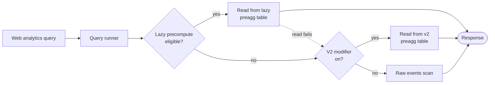
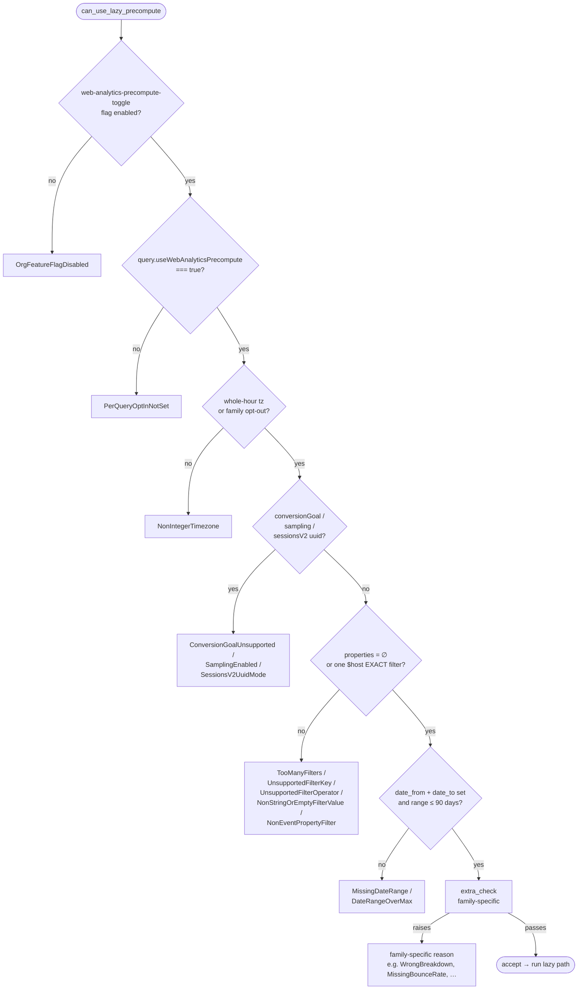

# Web analytics precomputation

PostHog web analytics has two parallel precomputation systems. They target the same problem (avoid scanning raw events on every dashboard load) but use different mechanisms and apply to different query shapes.

## The two systems

### v2 pre-aggregated tables

DAG-warmed ClickHouse tables (`web_pre_aggregated_stats`, `web_pre_aggregated_bounces`) that store hourly-rollup data computed in the background. Gated per-team by the `useWebAnalyticsPreAggregatedTables` modifier plus the `SETTINGS_WEB_ANALYTICS_PRE_AGGREGATED_TABLES` feature flag.

- **Owned by**: web analytics team
- **Population**: scheduled Dagster jobs in `products/web_analytics/dags/`
- **Coverage**: stats table queries, web overview (partial)
- **Adoption**: limited — modifier rollout is small in production

### Lazy computation

The newer general-purpose framework at `products/analytics_platform/backend/lazy_computation/`. Computes precomputed buckets on first read, caches them in a dedicated CH table per query family, and serves subsequent reads from the cache. Gated per-org by the `web-analytics-precompute-toggle` PostHog feature flag (evaluated against the team's organization).

- **Owned by**: web analytics team, riding on the analytics_platform framework
- **Population**: synchronous, on first read miss; subsequent reads hit the cache
- **Coverage**: `web_overview_query`, `web_stats_table_query` (subset of breakdowns), the PATHS (`WebStatsBreakdown.PAGE` + `includeBounceRate`) tile of `web_stats_table_query`, and `web_vitals_path_breakdown_query`. See the [Family quick reference](#family-quick-reference) below.
- **Adoption**: org feature flag gates further rollout

## When to use which

Both systems can coexist. The runner tries each in order; if both miss or are disabled the runner falls through to a raw events scan.

| You want…                                                             | Use                                                 |
| --------------------------------------------------------------------- | --------------------------------------------------- |
| A new query family where the cache shape is bounded and stable        | lazy computation                                    |
| Coverage of an existing query family that v2 already handles          | v2 if a team already has v2 enabled; otherwise lazy |
| Per-team custom precompute logic (uncommon)                           | lazy computation                                    |
| Background warming on a schedule                                      | v2                                                  |
| First-read latency budget that includes a precompute cost (~1.3x raw) | lazy computation accepts this; v2 doesn't have it   |

## How it works

### Runner dispatch order

Every web analytics runner that supports precompute checks lazy first, then v2, then falls back to raw. The exact set of checks differs per runner, but the dispatch order is uniform.



A lazy _read_ failure deliberately falls through to v2/raw rather than surfacing the error — the caller never sees worse than the raw path. A lazy _gate rejection_ short-circuits before any work happens (no INSERT, no read).

### Lazy precompute INSERT-on-read

The lazy precompute framework (`products/analytics_platform/backend/lazy_computation/`) hashes the runner's INSERT placeholders into a `query_hash` and looks up READY `PreaggregationJob` rows for the requested `(team, query_hash, window)`. A miss triggers an INSERT to materialize the window's aggregate state into a family-specific table; a hit just returns the existing `job_id`s. Either way, the runner then reads the metric via `*MergeIf` aggregates filtered to its requested period.

```mermaid
sequenceDiagram
    participant R as Query Runner
    participant G as Eligibility Gate
    participant F as lazy_computation framework
    participant CH as ClickHouse
    R->>G: can_use_lazy_precompute(runner)
    alt gate rejects
        G-->>R: False → fall through to v2/raw
    else gate accepts
        G-->>R: True
        R->>F: ensure_precomputed(team, insert_query, window, ttl, table)
        F->>F: hash placeholders → query_hash
        F->>CH: SELECT PreaggregationJob WHERE query_hash=? AND covers window
        alt READY job exists
            CH-->>F: existing job_ids
        else miss or expired
            F->>CH: INSERT INTO &lt;family&gt;_preaggregated SELECT … (state aggregates)
            F->>F: create PreaggregationJob row, status=READY
            CH-->>F: new job_id
        end
        F-->>R: LazyComputationResult(job_ids, ready=True)
        R->>CH: SELECT *MergeIf(state_col, period_filter)<br/>WHERE team_id=? AND job_id IN (…)
        CH-->>R: aggregated rows
        R-->>R: build response, set usedPreAggregatedTables=True
    end
```

The `PreaggregationJob` row is the source-of-truth for "is this window cached?" The TTL (`LAZY_TTL_SECONDS`, varies by window recency) lives on the job row, not on the ClickHouse data — the data is dropped via `ttl_only_drop_parts` partitioned by `expires_at`.

### Eligibility gate

`can_use_lazy_precompute(runner)` is the gate every family calls. Shared checks live in [`products/web_analytics/backend/hogql_queries/web_analytics_lazy_precompute.py`](backend/hogql_queries/web_analytics_lazy_precompute.py) (used by overview + stats + vitals_paths) and [`web_lazy_precompute_common.py`](backend/hogql_queries/web_lazy_precompute_common.py) (used by stats_paths). Each family layers its own `extra_check` on top.



The shared rollout gate is conservative on purpose — it refuses anything that would either materialize incorrect rows (timezone, conversion goals, sampling) or blow up the precompute footprint (date range, fan-out filters). When the gate refuses, the runner silently falls through to v2/raw — there is no user-visible degradation, only a missed cache opportunity. Rejection reasons are emitted as `web_analytics_lazy_precompute_rejected_total{family, reason}` Prometheus counter increments and a structured `INFO` log line, both keyed on the `LazyPrecomputeIneligible` subclass name.

The shape of the gate (sub-hour timezone, no v2 UUID sessions, ≤1 filter, ≤90 days) was driven by a survey of historical query traffic — see [`evaluating-web-analytics-performance`](skills/evaluating-web-analytics-performance/SKILL.md) for the methodology.

### Family quick reference

| Family       | Read tag                      | Bucket        | Compare period | Sessions join? | Read mechanism  | Source                                                                                             |
| ------------ | ----------------------------- | ------------- | -------------- | -------------- | --------------- | -------------------------------------------------------------------------------------------------- |
| overview     | `web_overview_lazy_query`     | UTC hourly    | full           | yes (24h pad)  | `sync_execute`  | [`web_overview_lazy_precompute.py`](backend/hogql_queries/web_overview_lazy_precompute.py)         |
| stats        | `web_stats_lazy_query`        | UTC hourly    | capped         | yes (24h pad)  | HogQL paginator | [`web_stats_lazy_precompute.py`](backend/hogql_queries/web_stats_lazy_precompute.py)               |
| stats_paths  | `web_stats_paths_lazy_query`  | UTC hourly    | budget-aware   | yes (24h pad)  | `sync_execute`  | [`web_stats_paths_lazy_precompute.py`](backend/hogql_queries/web_stats_paths_lazy_precompute.py)   |
| vitals_paths | `web_vitals_paths_lazy_query` | team-tz daily | none           | no             | HogQL direct    | [`web_vitals_paths_lazy_precompute.py`](backend/hogql_queries/web_vitals_paths_lazy_precompute.py) |

The "compare period" column describes how each family handles the dashboard's compare-to-previous filter: **full** (precompute the previous window too, read both), **capped** (cap `prev_range_end` to avoid `job_id` collision, clear `previous_*` if the cap collapses the window), **budget-aware** (skip previous when `ensure_duration_ms` blows a per-request budget), **none** (the family doesn't support compare at all).

### Session attribution and bucket alignment

Every web-analytics lazy family that joins the sessions table — `web_overview`, `web_stats`, `web_stats_paths` — bucketizes by **session start** at **UTC-hour granularity**. The INSERT groups events by `session_id`, then attributes the resulting session row to a single bucket via `toStartOfHour(min(session.$start_timestamp))`. The outer `HAVING` clause keeps only sessions whose start hour falls inside the job's `[time_window_min, time_window_max)` window.

The alternative — bucketing by `events.timestamp` — was rejected because session-shaped metrics (`$session_duration`, `$is_bounce`, per-session pageview counts) collapse cleanly only when every event of a session is summarised into one row. Bucketing by event timestamp would either split one session across multiple buckets (breaking the per-session aggregates) or require a session→hour join at read time (defeating the point of precomputing).

UTC-hour granularity over team-tz hour is a deliberate trade-off: every team can share one set of materialised rows for the same window, since the read converts the team-local range to UTC before filtering bucket boundaries. The cost is a 30-minute alignment error for half-hour-offset timezones, which the eligibility gate refuses outright via `is_integer_timezone`. The vitals_paths family bucketizes by team-tz day instead — see its section for the trade-off rationale — because it has no session join and only consumes day-aligned date ranges.

Sessions that straddle a bucket boundary are handled by the **24h forward pad** on the event-scan window (`SESSION_FORWARD_PAD_MINUTES`); see the [overview family's dedicated subsection](#sessions-that-straddle-bucket-boundaries) below for the full derivation.

## Lazy computation for web overview

`WebOverviewQueryRunner._calculate` runs three checks in order:

1. **Lazy precompute** (`can_use_lazy_precompute` + `execute_lazy_precomputed_read`) — the path described below.
2. **v2 pre-agg** (`get_pre_aggregated_response`) — the legacy path; falls through unless the team modifier is on.
3. **Raw events scan** — the original path.

### Schema

`web_overview_preaggregated` (sharded by `sipHash64(job_id)`, partitioned by `toYYYYMMDD(expires_at)`, `ReplicatedReplacingMergeTree` with `computed_at` as the version column). Five aggregate state columns matching the runner's metric tuple:

- `uniq_users_state AggregateFunction(uniq, UUID)` — unique persons (HLL ~99%)
- `uniq_sessions_state AggregateFunction(uniq, String)` — unique sessions (HLL ~99%)
- `sum_pageviews_state AggregateFunction(sum, Int64)` — pageviews/screens
- `avg_duration_state AggregateFunction(avg, Float64)` — average session duration (seconds)
- `avg_bounce_state AggregateFunction(avg, Int64)` — bounce rate (0/1 per session)

Partition key on `expires_at` rather than `time_window_start` so `ttl_only_drop_parts=1` can drop expired parts atomically.

### Bucketing and timezones

Buckets are **UTC hourly**. The read converts the team's local request window to UTC and filters bucket boundaries on hour edges. This means:

- **Whole-hour-offset timezones** (UTC, PT, ET, JST, etc. — the vast majority of teams) read exact-to-the-hour data.
- **Half-hour-offset timezones** (IST `+5:30`, Newfoundland `-3:30`, Nepal `+5:45`, Iran `+3:30`) cannot be served correctly by UTC hourly buckets — the `can_use_lazy_precompute` gate refuses them via `is_integer_timezone()`. They fall through to v2/raw.

### Sessions that straddle bucket boundaries

The framework chunks the precompute span into **daily UTC jobs**. Each job's INSERT scans `[time_window_min, time_window_max)` for events, groups by `session_id`, and emits one hourly bucket row per session, keyed on `toStartOfHour(min(session.$start_timestamp))`.

A session that starts at 23:30 UTC with an event at 00:15 UTC the next day spans two daily jobs. Without help, the first job would only see the 23:30 event and miscount that session's pageviews.

To fix this, the INSERT widens the event scan forward by `SESSION_FORWARD_PAD_MINUTES` (currently 24 h) past the job's `[time_window_min, time_window_max)` window. The `HAVING` clause keeps each session attributed to its actual start hour — over-scan adds INSERT cost but cannot produce duplicate rows in any bucket. Forward-only is sufficient because the HAVING keeps only sessions whose `min(session.$start_timestamp)` falls inside the window; every event of such a session has `timestamp >= time_window_min`, so backward scanning never picks anything that survives HAVING.

The 24 h pad matches the JS SDK's hard `SESSION_LENGTH_LIMIT` and covers effectively the whole session population. Sessions exceeding 24 h are documented as undercounted on cross-boundary days. The long-term fix is to drive the INSERT from `raw_sessions` (bounded by the embedded UUIDv7 timestamp), which removes the pad entirely.

### Eligibility gate

`can_use_lazy_precompute(runner)` in `web_overview_lazy_precompute.py`. Inherits every shared refusal listed in the [eligibility flowchart](#eligibility-gate) above; web overview adds no family-specific rejections of its own.

When the gate returns False the runner silently falls through to v2 / raw. Rejection reasons are emitted as `web_analytics_lazy_precompute_rejected_total{family, reason}` Prometheus counter increments (label values match the `LazyPrecomputeIneligible` subclass name) plus a structured `INFO` log.

### TTL schedule

Different freshness per how recent the data is:

| Window    | TTL    | Rationale                                       |
| --------- | ------ | ----------------------------------------------- |
| Today     | 15 min | Dashboard refresh feels current                 |
| Yesterday | 1 hr   | Recently-stabilized data, occasional re-compute |
| Last 7d   | 1 day  | Stable enough that hourly recompute is wasteful |
| Older     | 7 days | Functionally static                             |

Stored via the `LAZY_TTL_SECONDS` dict; consumed by `lazy_computation_executor.parse_ttl_schedule` against the team's timezone.

### Read path

The read is a single `sync_execute` call (not HogQL — see "Why bypass HogQL" below). It computes the 5 metric pairs (current + previous period) via `*MergeIf` aggregates filtered by the team-tz date range converted to UTC. Settings:

- `load_balancing="in_order"` — paired with the INSERT side's same setting for read-your-writes via Approach E in [CONSISTENCY.md](../../products/analytics_platform/backend/lazy_computation/CONSISTENCY.md).
- `optimize_skip_unused_shards=1` — `job_id IN (...)` + sharding-by-`sipHash64(job_id)` lets ClickHouse prune to the right shards.

Result is built into the standard `WebOverviewQueryResponse` via `_build_response_from_row`, with `usedPreAggregatedTables=True`.

#### Why bypass HogQL

HogQL `HogQLGlobalSettings` is `extra="forbid"`, so we couldn't get arbitrary CH settings (originally `select_sequential_consistency=1`, since dropped) through `execute_hogql_query`. The read query shape is stable enough that `sync_execute` with parameterized values is appropriate. The team_id WHERE clause is enforced manually (the HogQL printer's auto-injected `team_id_guard_for_table` is not applied for sync_execute).

If we later move back to HogQL (after the consistency story is settled), the HogQL table registration at `posthog/hogql/database/schema/web_overview_preaggregated.py` is still present and ready.

### Observability

- **Read query**: tagged `query_type="web_overview_lazy_query"` in `system.query_log.log_comment`.
- **INSERT query**: tagged `query_type="web_overview_lazy_insert"` (via the framework's `query_type` kwarg).
- **Failures**: `web_overview_lazy_precompute_failed_total{error_type}` Prometheus counter (bounded by Python exception class).
- **Cache warmer**: the DAG at `products/web_analytics/dags/cache_warming.py` recognizes both `web_overview_query` and `web_overview_lazy_query`.
- **Adoption / latency**: see [`evaluating-web-analytics-performance`](skills/evaluating-web-analytics-performance/SKILL.md) or query `system.query_log` directly.

### Known limitations / open issues

1. **`error_type` Prometheus label is too coarse** — `ServerException` from CH could mean quorum / memory / schema. Should bucket by CH error code.
2. **UUID session mode rejected**, not handled. Re-typing `uniq_sessions_state` to `(uniq, UUID)` would lift this; tracked as a follow-up.
3. **Empty `*MergeIf` rows are treated as legitimate empty windows.** Empty `sync_execute` result on this query shape is almost always a driver/transport error rather than "no data"; should be treated as failure + fall through.
4. **HogQL `top_level_settings`** on `WebOverviewPreaggregatedTable` is currently unused (read bypasses HogQL); kept as a hook if we re-route through HogQL later.

## Lazy computation for the stats table

`WebStatsTableQueryRunner._calculate` checks lazy precompute first, then v2, then raw. Lazy serves a subset of breakdowns where the precomputed shape (one row per `(time_window_start, breakdown_value)` with `uniq_users_state` + `sum_pageviews_state`) is a faithful representation of the raw query.

### Schema

`web_stats_preaggregated` (sharded by `sipHash64(job_id)`, partitioned by `toYYYYMMDD(expires_at)`, ReplacingMergeTree with `computed_at` as the version column). One row per `(team_id, job_id, time_window_start, breakdown_by, breakdown_value)`:

- `breakdown_by String` — names which breakdown the row was computed for (`InitialChannelType`, `Browser`, `Country`, …). Lets several breakdowns coexist in the same table without ambiguity.
- `breakdown_value String` — the decoded value. Tuple/float breakdowns (REGION, CITY, VIEWPORT, TIMEZONE) are JSON-encoded into the column and decoded back to their native shape on read.
- `uniq_users_state AggregateFunction(uniq, UUID)` — persons in the bucket.
- `sum_pageviews_state AggregateFunction(sum, Int64)` — pageview/screen count.

### Supported breakdowns

The family-specific `extra_check` rejects breakdowns the precompute table can't represent. The current allowlist (in `web_stats_lazy_precompute.SUPPORTED_BREAKDOWNS`) covers low-cardinality dimensions that fit well within the read budget: channel type, referring domain, every UTM dimension and the source-medium-campaign concat, browser, OS, viewport, device type, country, region, city, timezone. Path-shaped breakdowns (PAGE/INITIAL_PAGE/EXIT_PAGE/PREVIOUS_PAGE/FRUSTRATION_METRICS/LANGUAGE) and the `EXIT_CLICK` URL breakdown route to the dedicated paths runner or stay on the raw path.

The extra check also rejects:

- `query.includeBounceRate`, `query.includeAvgTimeOnPage`, or `query.includeScrollDepth` — those columns aren't materialized in the stats table (the paths runner owns the bounce variant).
- `orderBy` fields the lazy read can't produce — only `VISITORS` and `VIEWS` survive the gate. Refusing other fields prevents the in-Python sort from silently rewriting to `visitors` and diverging from the raw path's ordering.

### Read path

HogQL via the runner's paginator (`runner.paginator.execute_hogql_query`). The read template projects `uniqMergeIf` / `sumMergeIf` across current and previous periods, with a `sum(...) OVER ()` window function carrying the `fill_total` denominator onto every paginated row. ORDER BY / LIMIT / OFFSET are mutated into the AST from the runner's query so pagination happens SQL-side, not in Python.

Modifiers are copied from the runner with `convertToProjectTimezone=False` forced — the printer would otherwise wrap `time_window_start` in `toTimeZone(..., team_tz)`, which breaks the direct comparison against the UTC `cur_start` / `cur_end` constants the runner builds.

### Compare-period handling (capped)

Stats caps `prev_range_end = min(prev_range_end, time_range_start)` to prevent overlap between current and previous job ids. If the cap collapses the previous window (e.g., "today vs. earlier today" on a non-UTC-boundary day), the runner clears `previous_start_utc` / `previous_end_utc` to `None` so the read's `*MergeIf(..., prev_*)` returns 0 instead of comparing against a corrupted range.

### Observability

- **Read query**: tagged `query_type="web_stats_lazy_query"`.
- **INSERT query**: tagged `query_type=f"web_stats_{breakdownBy}_lazy_insert"` — per-breakdown labels so a hot-breakdown can be isolated in `system.query_log` without re-grouping by JSON-extracted fields.
- **Failures**: `web_stats_lazy_precompute_failed_total{error_type}` Prometheus counter.
- **Cache warmer**: `web_stats_lazy_query` is in the warmer DAG allowlist.

## Lazy computation for the PATHS tile

`WebStatsTableQueryRunner._calculate` adds a fourth check: lazy precompute first for the `WebStatsBreakdown.PAGE` + `includeBounceRate` combination only. Other breakdowns and other column combinations fall through to the existing v2/raw paths.

### Schema

`web_stats_paths_preaggregated` (sharded by `sipHash64(job_id)`, partitioned by `toYYYYMMDD(expires_at)`, ReplacingMergeTree with `computed_at` as the version column). One row per `(team_id, job_id, time_window_start, breakdown_value)`:

- `breakdown_value String` — pathname, optionally prefixed with `$host` when the query has `includeHost`.
- `uniq_users_state AggregateFunction(uniq, UUID)` — persons that touched this pathname.
- `sum_pageviews_state AggregateFunction(sum, Int64)` — pageview/screen events on this pathname.
- `avg_bounce_state AggregateFunction(avg, Nullable(Float64))` — `if(pathname == entry_pathname, is_bounce, NULL)` averaged across rows. `avg`'s null-skip semantics make this equivalent to "bounce rate of sessions that entered on this pathname" — matching the v2 `PATH_BOUNCE_QUERY` join semantic without a JOIN at read time.

The state is `Nullable(Float64)` so the `if(..., NULL)` expression in the INSERT round-trips into the column without an explicit `toNullable` coercion.

### Eligibility gate

`can_use_lazy_precompute(runner)` in `web_stats_paths_lazy_precompute.py`. Shares the common gate (`web_lazy_precompute_common.py`) — same org flag, same timezone / sampling / UUID-mode / filter rules. Adds PATHS-specific refusals:

- `query.breakdownBy != WebStatsBreakdown.PAGE` and `!= INITIAL_PAGE`
- `query.includeBounceRate` is False (the lazy table is purpose-built for bounce-augmented paths)
- `query.includeAvgTimeOnPage` is True (not yet wired)
- `query.includeScrollDepth` is True (not yet wired)
- `orderBy` outside `{VISITORS, VIEWS, BOUNCE_RATE}` (the in-Python sort would silently rewrite to `visitors` otherwise)

### Read path

Single `sync_execute` over `web_stats_paths_preaggregated` with `uniqMergeIf` / `sumMergeIf` / `avgMergeIf` covering both current and previous periods. The runner builds the standard `WebStatsTableQueryResponse` (breakdown_value + visitor/views/bounce-rate tuples + ui_fill_fraction + cross_sell). Sorting, paging, and fill-fraction are computed in Python over the materialized result set, matching `PathBounceStrategy` defaults (visitors DESC, then breakdown_value ASC; `WebAnalyticsOrderByFields` overrides honored for VISITORS / VIEWS / BOUNCE_RATE).

### Compare-period handling (budget-aware)

The PATHS precompute INSERT is expensive (one row per session per pathname). If the current-period `ensure_precomputed` already took more than `ENSURE_BUDGET_MS` wall-clock, the previous-period ensure is skipped and the previous metrics return as 0 — the runner emits `web_stats_paths_lazy_precompute_compare_budget_exceeded` so adoption tracking can see the trade. This trades comparison fidelity for end-to-end response latency on the slow first read.

### Known follow-ups

- INITIAL_PAGE + bounce (entry-pathname tab) reuses the same precompute table by feeding the entry breakdown into both sides of the `equals(breakdown_value, entry_breakdown_value)` bounce attribution — see `_breakdown_value_expr` and `_entry_breakdown_value_expr`.
- `usedLazyPrecompute` is set on the response; the frontend's `PreAggregatedBadge` already keys off `usedPreAggregatedTables` so users see the badge without further wiring. Distinguishing lazy from v2 in the UI is a separate follow-up.

## Lazy computation for the web vitals path-breakdown tile

`WebVitalsPathBreakdownQueryRunner._calculate` follows the same gate-then-fallthrough shape as web overview:

1. **Lazy precompute** (`can_use_lazy_precompute` + `execute_lazy_precomputed_read`) — short-circuits when eligible and returns immediately.
2. **Raw events scan** — the original `quantile(p)(toFloat(properties.$web_vitals_*_value))` per path.

### Schema

`web_vitals_paths_preaggregated` (sharded by `sipHash64(job_id)`, partitioned by `toYYYYMMDD(expires_at)`, `ReplicatedReplacingMergeTree` with `computed_at` as the version column). One row per `(team, job, day, path)`, four state columns — one per Web Vitals metric:

- `inp_quantiles_state AggregateFunction(quantiles(0.75, 0.90, 0.99), Float64)`
- `lcp_quantiles_state AggregateFunction(quantiles(0.75, 0.90, 0.99), Float64)`
- `cls_quantiles_state AggregateFunction(quantiles(0.75, 0.90, 0.99), Float64)`
- `fcp_quantiles_state AggregateFunction(quantiles(0.75, 0.90, 0.99), Float64)`

Each state holds one reservoir covering all three percentiles. Reads pick the queried percentile via `arrayElement(quantilesMergeIf(0.75, 0.90, 0.99)(state, range_filter), pct_index)`. Same reservoir algorithm as the raw `quantile(p)` — exact when unsaturated, within sampling noise once it is.

Four columns vs. a metric discriminator: ARRAY JOIN would fan one event into four rows, but the new ClickHouse analyzer rejects bare `events.properties` references inside the ARRAY JOIN source array (the source array is resolved before the FROM alias scope). Four columns let the INSERT stay a single `FROM events GROUP BY (day, path)`, no fan-out, and each metric tab reads exactly one column.

### Bucketing and timezones

**Daily, team-tz aligned.** Bucket key is `toStartOfDay(timestamp, team_tz)` — start of the team's local day. The underlying Unix timestamp stored in `time_window_start` is the UTC instant of that local midnight, so reads filter against the team-tz date range converted to UTC and get exact alignment.

This differs from web overview / web stats / paths which use UTC-hourly buckets:

- The path-breakdown tile only consumes day-aligned date ranges from the dashboard filter, so a daily bucket is sufficient and ~24× smaller than hourly.
- Bucketing in the team's tz means **half-hour-offset timezones** (IST +5:30, Newfoundland -3:30, Nepal +5:45, Iran +3:30) are supported too — this runner opts out of the shared `is_integer_timezone` gate.
- A UTC-daily INSERT job typically writes into TWO team-tz day buckets (events in the first hours of UTC day N belong to team-tz day N-1 for non-UTC teams). The `ReplacingMergeTree` key `(team_id, job_id, time_window_start, path)` keeps the rows distinct per job; reads merge them via `quantilesMergeIf` for full team-tz day coverage.

No session join in the raw query, so no `SESSION_FORWARD_PAD_MINUTES` — each event maps to exactly one (team-tz day, path) bucket.

### Read

Mirrors the raw query's outer shape:

```sql
SELECT multiIf(value <= good, 'good', value <= needs_improvements, 'needs_improvements', 'poor') AS band, path, value
FROM (
    SELECT path,
           arrayElement(quantilesMergeIf(0.75, 0.90, 0.99)(<metric>_quantiles_state, time_filter), pct_index) AS value
    FROM posthog.web_vitals_paths_preaggregated
    WHERE team_id = ? AND job_id IN (...)
    GROUP BY path HAVING value >= 0
)
ORDER BY value ASC, path ASC
LIMIT 20 BY band
```

The runner re-partitions the resulting `(band, path, value)` tuples into the `good` / `needs_improvements` / `poor` arrays the response expects.

### Eligibility gate

`can_use_lazy_precompute` in `products/web_analytics/backend/hogql_queries/web_vitals_paths_lazy_precompute.py` delegates to the shared gate with `require_integer_timezone=False` (see "Bucketing and timezones" above). The shared gate rejects: org feature flag off, per-query opt-in not set, conversion goal, sampling enabled, `sessionsV2JoinMode=uuid`, more than one property filter, anything other than a `$host` exact-equals filter, missing date range, and date range over 90 days. The vitals runner also adds a day-alignment check that refuses sub-day filters.

### Observability

- **Read query**: tagged `query_type="web_vitals_paths_lazy_query"`.
- **INSERT query**: tagged `query_type="web_vitals_paths_lazy_insert"`.
- **Failures**: `web_vitals_paths_lazy_precompute_failed_total{error_type}` Prometheus counter.
- **Cache warmer**: `web_vitals_paths_lazy_query` is in the warmer DAG allowlist in `products/web_analytics/dags/cache_warming.py`.

### Known limitations

1. **`WebVitalsQuery` (line-chart tile) is not covered.** That query wraps a `TrendsQuery` and dispatches through `TrendsQueryRunner`; lazy precompute for it would need a different shape and is deferred.
2. **Adding a metric** (e.g. TTFB) is a schema change — add the column to `web_vitals_paths_preaggregated`, the HogQL table registration, the INSERT template, and the `_METRIC_STATE_COLUMN` map.
3. **Bands are computed in ClickHouse from the runtime thresholds**, not stored — so a threshold change is free on the read side.

## Adding lazy computation to another web analytics query family

Reference implementations: `web_overview_lazy_precompute.py` (the canonical shape), `web_stats_paths_lazy_precompute.py` (extra eligibility + non-trivial response shape), `web_vitals_paths_lazy_precompute.py` (team-tz bucketing).

Roughly:

1. **Schema** — new CH table under `posthog/clickhouse/preaggregation/`. ReplacingMergeTree with `(team_id, job_id, time_window_start, …)` ORDER BY, sharded by `sipHash64(job_id)`, partitioned by `toYYYYMMDD(expires_at)`. Register in `posthog/clickhouse/schema.py` test fixtures.
2. **Migration** — `posthog/clickhouse/migrations/0XXX_<name>.py`. Sharded + distributed CREATE on `NodeRole.DATA`.
3. **HogQL table** — `posthog/hogql/database/schema/<name>.py`. Register in `posthog/hogql/database/database.py`.
4. **`LazyComputationTable` enum** — add a value in `products/analytics_platform/backend/lazy_computation/lazy_computation_executor.py`.
5. **Insert query** — HogQL template using `{time_window_min}` / `{time_window_max}` placeholders. Add a session-boundary pad if the query has session-level joins (see `SESSION_FORWARD_PAD_MINUTES`); skip it if the query has no session join (see vitals_paths).
6. **Read** — `sync_execute` with parameterized SQL and `settings={"load_balancing": "in_order", "optimize_skip_unused_shards": 1}` for the consistency story; or HogQL `execute_hogql_query` when you need modifier control (`convertToProjectTimezone=False`) or SQL-side pagination (`runner.paginator.execute_hogql_query` + AST mutation). Filter by `team_id` AND `job_id IN (...)` in the WHERE clause either way.
7. **Runner integration** — add a `can_use_*` gate and an `execute_*_read` orchestrator; short-circuit in `_calculate` before the v2/raw fallthrough. Reject any query shape the precompute table can't faithfully represent — silent fall-through is the only safe degradation.
8. **Tests** — round-trip (lazy == raw) parameterized over team timezones, gate fallthrough for each disqualifying condition, half-hour-offset fallthrough (unless the family opts out), cache hit (second call doesn't create new jobs).
9. **Cache warmer** — add the new `query_type` to the warmer DAG's allowlist in `products/web_analytics/dags/cache_warming.py`.

## Related code

- [`products/web_analytics/backend/hogql_queries/web_overview.py`](backend/hogql_queries/web_overview.py) — overview runner
- [`products/web_analytics/backend/hogql_queries/web_overview_lazy_precompute.py`](backend/hogql_queries/web_overview_lazy_precompute.py) — overview lazy path
- `products/web_analytics/backend/hogql_queries/web_overview_pre_aggregated.py` — overview v2 path
- [`products/web_analytics/backend/hogql_queries/stats_table.py`](backend/hogql_queries/stats_table.py) — stats table runner
- [`products/web_analytics/backend/hogql_queries/web_stats_lazy_precompute.py`](backend/hogql_queries/web_stats_lazy_precompute.py) — stats lazy path
- [`products/web_analytics/backend/hogql_queries/web_stats_paths_lazy_precompute.py`](backend/hogql_queries/web_stats_paths_lazy_precompute.py) — PATHS lazy path
- [`products/web_analytics/backend/hogql_queries/web_analytics_lazy_precompute.py`](backend/hogql_queries/web_analytics_lazy_precompute.py) — shared eligibility gate (overview + stats + vitals_paths)
- [`products/web_analytics/backend/hogql_queries/web_lazy_precompute_common.py`](backend/hogql_queries/web_lazy_precompute_common.py) — shared eligibility gate (stats_paths)
- [`products/web_analytics/backend/hogql_queries/web_vitals_path_breakdown.py`](backend/hogql_queries/web_vitals_path_breakdown.py) — vitals runner
- [`products/web_analytics/backend/hogql_queries/web_vitals_paths_lazy_precompute.py`](backend/hogql_queries/web_vitals_paths_lazy_precompute.py) — vitals lazy path
- `posthog/clickhouse/preaggregation/web_overview_preaggregated_sql.py` — overview schema
- `posthog/clickhouse/preaggregation/web_stats_preaggregated_sql.py` — stats schema
- `posthog/clickhouse/preaggregation/web_stats_paths_preaggregated_sql.py` — PATHS schema
- `posthog/clickhouse/preaggregation/web_vitals_paths_preaggregated_sql.py` — vitals schema
- [`products/analytics_platform/backend/lazy_computation/`](../analytics_platform/backend/lazy_computation/) — framework + CONSISTENCY.md + README
- [`skills/evaluating-web-analytics-performance/SKILL.md`](skills/evaluating-web-analytics-performance/SKILL.md) — query-log playbook for verifying rollouts and attributing tail latency
