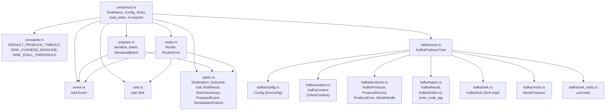
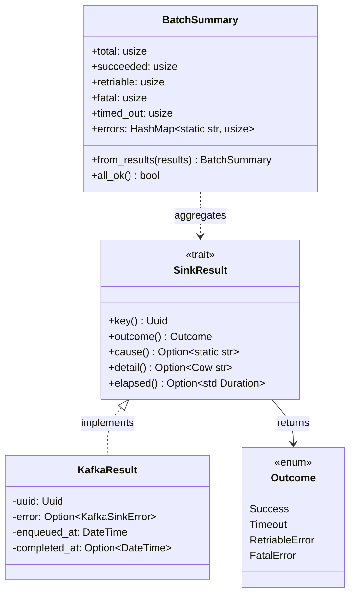

# v1/sinks design

Architecture and design choices in the `v1::sinks` module —
the destination-agnostic event publishing layer for PostHog capture v1.

## Overview

The sinks module decouples capture's request-handling pipeline from the
specifics of _where_ events are published.
Today the only backend is Kafka (via rdkafka); the trait boundaries are
drawn so that future backends (WarpStream, S3, etc.) slot in without
touching request-path code.

### Endpoint paths

v1 capture endpoints follow the naming scheme
`/i/v<version>/<scope>/<payload>/`:

| Endpoint | Path | Status |
|---|---|---|
| Analytics events | `/i/v1/analytics/events/` | First v1 endpoint |

As additional capture domains migrate to v1 (e.g. AI, replay),
they register their own paths under the same scheme.

```text
                           ┌─────────────┐
                           │  HTTP layer  │
                           └──────┬───────┘
                                  │  Vec<WrappedEvent>
                                  ▼
                           ┌──────────────┐
                           │serialize_batch│─ scatter-gather (prepare.rs)
                           └──────┬────────┘
                                  │  Vec<PreparedEvent>
                                  ▼
                           ┌─────────────┐
                           │   Router     │─── resolves SinkName
                           └──────┬───────┘
                       ┌──────────┼──────────┐
                       ▼          ▼          ▼
                   ┌────────┐ ┌────────┐ ┌────────┐
                   │KafkaSink│ │KafkaSink│ │ Future │
                   │ (msk)  │ │(msk_alt)│ │  Sink  │
                   └────┬───┘ └────┬───┘ └────────┘
                        │          │
                        ▼          ▼
                    ┌────────┐ ┌────────┐
                    │Producer│ │Producer│
                    │ (msk)  │ │(msk_alt)
                    └────────┘ └────────┘
```

Key properties:

- **Storage-agnostic contracts** — `Sink`, `Event`, `SinkResult` know
  nothing about Kafka.
- **Multi-sink** — the `Router` maps named sinks to concrete
  implementations, supporting concurrent dual-writes (e.g. MSK +
  WarpStream during a migration).
- **Per-event results** — `publish_batch` returns one `Box<dyn SinkResult>`
  per published event, correlating outcomes back to request events by UUID.
- **Hoisted serialization** — events are serialized into storage-agnostic
  `PreparedEvent`s by `serialize_batch` (`prepare.rs`) _before_ any sink is
  touched. Sinks consume `&[PreparedEvent]`, never raw `Event` trait objects.
  This isolates CPU-bound encoding from sink I/O, lets the same prepared
  batch fan out to multiple sinks without re-encoding, and enables the
  scatter-gather parallelism described in [section 2a](#2a-serialize_batch-scatter-gather).
- **Owned-payload API** — `Event::serialize()` returns `bytes::Bytes` and
  `partition_key()` returns a fresh `String`, keeping the trait simple and
  cheap to move into spawned tasks.

---

## Module layout



Two layers:

- **Top-level abstractions** (`sink.rs`, `event.rs`, `types.rs`,
  `router.rs`) — backend-agnostic traits and routing. Know nothing about
  Kafka.
- **`kafka/`** — implements those traits against rdkafka. All
  Kafka-specific logic is contained here.

`mod.rs` re-exports the public API:

```rust
pub use event::Event;
pub use kafka::KafkaSink;
pub use prepare::{serialize_batch, SerializedBatch};
pub use router::{Router, RouterError};
pub use sink::Sink;
pub use types::{Destination, Outcome, PreparedEvent, SerializationFailure, SinkResult};
```

---

## 1. Sink trait and Router

### Sink

`trait Sink` (`sink.rs`) is the backend-agnostic publishing interface:

```rust
#[async_trait]
pub trait Sink: Send + Sync {
    fn name(&self) -> SinkName;

    async fn publish_batch(
        &self,
        ctx: &RequestContext,
        events: &[PreparedEvent],
    ) -> Vec<Box<dyn SinkResult>>;

    async fn flush(&self) -> anyhow::Result<()>;
}
```

Each `Sink` owns its identity (`name`), accepts a batch of
already-serialized `PreparedEvent`s, and returns one `Box<dyn SinkResult>`
per event it attempts. Events that never reach the sink — filtered by
`should_publish()` or routed to `Destination::Drop` during
`serialize_batch` — are simply absent from the input slice. A
`Destination` with no configured topic still produces no result entry.

`KafkaSink<P: KafkaProducerTrait>` is currently the only implementation.
It is generic over the producer trait so tests inject `MockProducer`
without touching real Kafka.

### Router

`Router` (`router.rs`) owns the mapping from `SinkName` to concrete
`Box<dyn Sink>` instances and provides the caller-facing publish API:

```rust
pub struct Router {
    default: SinkName,
    sinks: HashMap<SinkName, Box<dyn Sink>>,
}
```

| Method | Purpose |
|---|---|
| `publish_batch(sink, ctx, events)` | Look up sink by name, delegate to `Sink::publish_batch` |
| `publish(sink, ctx, event)` | Convenience wrapper for single events |
| `default_sink()` | Returns the first sink from the `CAPTURE_V1_SINKS` CSV |
| `available_sinks()` | Lists all configured sink names |
| `flush()` | Flushes all sinks concurrently via `FuturesUnordered` |

The `Sink` trait intentionally takes no `SinkName` parameter — the
Router resolves the target before calling into the sink. This keeps
`Sink` implementations stateless with respect to routing and makes the
single-sink case zero-cost.

`RouterError::SinkNotFound` is returned when a caller requests a sink
name that was not configured. This is a caller bug, not a per-event error.

```text
  Caller ──publish_batch(SinkName, ctx, events)──▶ Router
                                                     │
                                              lookup by name
                                                     │
                                                     ▼
                                            HashMap<SinkName, Sink>
                                                     │
                                         publish_batch(ctx, events)
                                                     │
                                                     ▼
                                                 KafkaSink
                                                     │
                                         Vec<Box<dyn SinkResult>>
                                                     │
                                                     ▼
  Caller ◀───────────Ok(results)─────────────── Router
```

---

## 2. Event abstraction

`trait Event` (`event.rs`) decouples the sink from any specific capture
endpoint, `CaptureMode`, or event schema:

```rust
pub trait Event: Send + Sync {
    fn uuid(&self) -> Uuid;
    fn should_publish(&self) -> bool;
    fn destination(&self) -> &Destination;
    fn headers(&self, ctx: &RequestContext) -> CapturedEventHeaders;
    fn partition_key(&self, ctx: &RequestContext) -> String;
    fn serialize(&self, ctx: &RequestContext) -> anyhow::Result<bytes::Bytes>;
}
```

`headers` receives the request `RequestContext` so each `Event` implementation
can combine batch-scoped fields (token, now, historical_migration) with
event-scoped fields into a single `CapturedEventHeaders`
(`common_types`). The sink converts the returned struct to its
transport-specific format via `From<CapturedEventHeaders> for
OwnedHeaders`.

The analytics capture endpoint's `WrappedEvent` implements this trait
(see [section 10](#10-analytics-event-serialization)).
Other capture endpoints (e.g. session replay, exceptions) provide
their own `Event` implementations without changing any sink code.

### Context split

Trait methods take `&RequestContext` — the mode-agnostic request context
(token, IP, timing, raw query string) shared by every future capture mode.
The analytics endpoint wraps it in `analytics::Context { req, query }`,
which `Deref`s to `RequestContext`, so the typed `Query` stays an
analytics-only concern while the sink layer remains capture-mode-agnostic.

### Owned-return serialization

`serialize(ctx)` returns `bytes::Bytes` and `partition_key(ctx)` returns a
fresh owned `String`. `Bytes` is zero-copy to construct from a `Vec<u8>`
and cheap (refcounted) to clone, so a `PreparedEvent` can be moved into a
tokio task and fanned out to multiple sinks without re-encoding.
The owned contract needs no shared mutable buffers, which is what makes
the scatter-gather prep loop safe to parallelize.

`WrappedEvent::serialize` pre-sizes its buffer via
`Vec::with_capacity(data.len() + 512)` to minimize reallocations
for typical payloads, then returns `Bytes::from(buf)`.

### Skip mechanisms

Callers have two orthogonal ways to prevent an event from being produced:

| Mechanism | Where set | Effect |
|---|---|---|
| `should_publish() == false` | Pipeline validation (e.g. `EventResult != Ok`) | Silently skipped, no `SinkResult` returned |
| `Destination::Drop` | Routing logic (e.g. quota limiter) | `topic_for()` returns `None`, event skipped |

### Header construction

Each `Event` implementation builds the full `CapturedEventHeaders`
struct per event, combining batch-scoped context (token, now,
historical_migration) with event-scoped fields (distinct_id, uuid,
timestamp, session_id, etc.):

```text
  ┌──────────────────────────────────────────────┐
  │ event.headers(ctx: &RequestContext)          │
  │                                              │
  │   CapturedEventHeaders {                     │
  │     token,                     ◄─ from ctx   │
  │     now,                       ◄─ from ctx   │
  │     historical_migration,      ◄─ from ctx   │
  │     distinct_id,               ◄─ from event │
  │     event,                     ◄─ from event │
  │     uuid,                      ◄─ from event │
  │     timestamp,                 ◄─ from event │
  │     session_id?,               ◄─ from event │
  │     force_disable_*?,          ◄─ from event │
  │     skip_heatmap_processing?,  ◄─ from event │
  │     dlq_reason/step/timestamp? ◄─ from event │
  │   }                                          │
  └──────────────────┬───────────────────────────┘
                     │
                     ▼
  ┌──────────────────────────────────────────────┐
  │ let headers: OwnedHeaders = headers.into();  │
  │   (From impl in common_types)                │
  └──────────────────────────────────────────────┘
```

The sink converts `CapturedEventHeaders` to `OwnedHeaders` via the
`From` impl in `common_types`. There is no separate merge function —
a single structured type flows from event to transport.

---

## 2a. serialize_batch (scatter-gather)

`serialize_batch` (`prepare.rs`) is the mode-agnostic step that turns a
`Vec<E: Event>` into a `SerializedBatch` _before_ the router/sink layer.
It is generic over the `Event` impl, so analytics, replay, and AI capture
modes share one implementation.

```rust
pub async fn serialize_batch<E: Event + Send + Sync + 'static>(
    events: Vec<E>,
    ctx: &RequestContext,
    scatter_gather_threshold: usize,
) -> (Vec<E>, SerializedBatch);

pub struct SerializedBatch {
    pub prepared: Vec<PreparedEvent>,        // publishable, in input order
    pub failures: Vec<Box<dyn SinkResult>>,  // SerializationFailure per failed event
}
```

The caller gets its `Vec<E>` back so it can still build the per-event HTTP
response after publishing (the prepared events alone don't carry the
original request event). Recovery uses `Arc::try_unwrap` after the spawned
tasks finish — see "Ownership" below.

### PreparedEvent

```rust
pub struct PreparedEvent {
    pub uuid: Uuid,
    pub destination: Destination,
    pub payload: bytes::Bytes,
    pub headers: CapturedEventHeaders,
    pub partition_key: String,  // raw; the sink decides whether to null it
}
```

Storage-agnostic and fully owned. It carries everything a sink needs to
produce a record, so the sink does no serialization and holds no reference
back into the request. `Bytes` makes it cheap to clone across a dual-write.

### Sequential vs parallel

The threshold is configurable via `CAPTURE_V1_SCATTER_GATHER_MIN_BATCH`
(default 8). Set to 0 to force sequential serialization for all batch
sizes (useful for modes like replay where batches are always single large events).

```text
  scatter_gather_threshold == 0  OR  events.len() < threshold
    └── serialize inline on the request task (no spawn overhead)

  events.len() >= threshold  (threshold > 0)
    └── Arc<Vec<E>> + Arc<RequestContext>
        └── JoinSet of tokio tasks (spawn, not spawn_blocking), one per event index
            └── each task: catch_unwind(prepare_one(&events[i], &ctx))
        └── collect by index → preserves input order
```

Small batches stay inline because a `JoinSet` of tokio tasks costs more
than the serialization itself for a handful of events. Large batches fan
out across the async worker pool to cut tail latency on big payloads. We
use `spawn` (not `spawn_blocking`) to match v0's `send_batch`: per-event
serialize is short CPU work, so concurrent execution is naturally bounded
by `worker_threads` (~num_cpus) and excess events queue cheaply, rather
than spawning one blocking-pool task per event and risking saturation of
the shared `spawn_blocking` pool on very large batches. Both paths produce
identical output (ordering, skips, failures)
— verified by parity tests in `prepare.rs`.

### Panic isolation

Each event is serialized inside `std::panic::catch_unwind`. A panic in one
event's `serialize` becomes a `SerializationFailure { is_panic: true }`
for that event only; the rest of the batch is unaffected. Regular `Err`
returns become `SerializationFailure::from_error`. Both are fatal
(non-retriable) — re-running the same bytes would panic/err again.

### Ownership (Arc::try_unwrap)

`spawn` requires `'static`, so the parallel path wraps the events
in `Arc<Vec<E>>` and tasks borrow by index. After the `JoinSet` drains,
every task has dropped its `Arc` clone, so `Arc::try_unwrap` reclaims the
sole-owner `Vec<E>` and hands it back to the caller. This is why
`serialize_batch` can be parallel yet still return owned events.

### Metrics

| Metric | Type | Labels | When |
|---|---|---|---|
| `capture_v1_serialize_duration_seconds` | histogram | `batch_size` | Per-batch serialize wall-time (sequential or parallel) |
| `capture_v1_serialize_failed_total` | counter | — | Per event that failed to serialize |
| `capture_v1_serialize_panic_total` | counter | — | Per event whose `serialize` panicked |

These are sink- and product-agnostic (serialization happens before any
sink is chosen). Per-mode faceting comes from the Kubernetes deployment
(`capture-analytics` / `-replay` / `-ai`) via the `namespace` label
injected by the metrics pipeline.

---

## 3. SinkResult and outcome model

### The SinkResult trait

`trait SinkResult` (`types.rs`) defines a backend-agnostic interface for
inspecting per-event publish outcomes:

```rust
pub trait SinkResult: Send + Sync {
    fn key(&self) -> Uuid;                        // event UUID — correlation key
    fn outcome(&self) -> Outcome;                 // Success | Timeout | RetriableError | FatalError
    fn cause(&self) -> Option<&'static str>;      // low-cardinality metric tag
    fn detail(&self) -> Option<Cow<'_, str>>;     // human-readable error detail
    fn elapsed(&self) -> Option<Duration>;        // enqueue-to-ack latency (std::time::Duration)
}
```

`publish_batch` returns `Vec<Box<dyn SinkResult>>` — one entry per
published event. The trait-object approach keeps the `Sink` trait fully
backend-agnostic: callers never need to know which backend produced a
result. The per-event heap allocation is a deliberate trade-off for
simplicity; at current batch sizes the cost is negligible compared to
Kafka I/O.

Two types implement `SinkResult`: `KafkaResult` (sink-level produce
outcomes) and `SerializationFailure` (pre-sink serialize failures from
`serialize_batch`). `process_batch` concatenates both into one
`Vec<Box<dyn SinkResult>>` before correlating outcomes back to events.

### Outcome

```rust
pub enum Outcome {
    Success,
    Timeout,
    RetriableError,
    FatalError,
}
```

### KafkaResult

`KafkaResult` (`kafka/types.rs`) is the Kafka-specific implementation:

```rust
pub struct KafkaResult {
    uuid: Uuid,
    error: Option<KafkaSinkError>,
    enqueued_at: DateTime<Utc>,
    completed_at: Option<DateTime<Utc>>,
}
```

Outcome is derived from the error — `None` means `Success`, otherwise
`KafkaSinkError::outcome()` maps to the appropriate `Outcome` variant.

### KafkaSinkError

Captures every failure mode within a single configured sink:

| Variant | Outcome | When |
|---|---|---|
| `SinkUnavailable` | `RetriableError` | Producer health gate failed |
| `Produce(ProduceError)` | Depends on `ProduceError::is_retriable()` | rdkafka send or delivery error |
| `Timeout` | `Timeout` | Ack not received within `produce_timeout` |
| `TaskPanicked` | `RetriableError` | Ack task panicked (should not happen with `FuturesUnordered`) |

Serialization failures are no longer a sink concern — they are produced by
`serialize_batch` as `SerializationFailure` (see
[section 2a](#2a-serialize_batch-scatter-gather)) before any sink runs.

### BatchSummary

`BatchSummary::from_results` aggregates a `&[Box<dyn SinkResult>]` into
counts used for log-level selection, error counters, and health heartbeat
decisions:

```rust
pub struct BatchSummary {
    pub total: usize,
    pub succeeded: usize,
    pub retriable: usize,
    pub fatal: usize,
    pub timed_out: usize,
    pub errors: HashMap<&'static str, usize>,  // cause tag → count
}
```



---

## 4. Three-phase publish pipeline

`KafkaSink::publish_batch` (`kafka/sink.rs`) processes events in three
phases, returning a `Vec<Box<dyn SinkResult>>` where each entry
corresponds 1:1 to a published event.

```text
  ┌──────────────────────────────────────────────────────────────────┐
  │ Pre-flight: health gate                                         │
  │                                                                 │
  │   producer.is_ready()?                                          │
  │   ├── not ready → reject ALL publishable as SinkUnavailable     │
  │   └── ready → proceed                                           │
  └──────────────────────────┬───────────────────────────────────────┘
                             │
  ┌──────────────────────────▼───────────────────────────────────────┐
  │ Phase 1: Enqueue (sequential, per-partition ordering preserved)  │
  │                                                                 │
  │   input: &[PreparedEvent] (already serialized by serialize_batch)│
  │   for each prepared event:                                      │
  │     ├── topic_for(destination)? → skip if Drop/None             │
  │     ├── payload: prepared.payload (Bytes, no re-encode)         │
  │     ├── effective_partition_key(prepared.partition_key, dest)?  │
  │     ├── CapturedEventHeaders → OwnedHeaders (via From)          │
  │     └── producer.send(ProduceRecord)                            │
  │           ├── Ok(ack_future) → push to FuturesUnordered         │
  │           ├── Err(QueueFull) + retries left → sleep, retry      │
  │           └── Err(final) → results.push(KafkaResult err)        │
  └──────────────────────────┬───────────────────────────────────────┘
                             │
  ┌──────────────────────────▼───────────────────────────────────────┐
  │ Phase 2: Drain acks (concurrent, bounded by produce_timeout)    │
  │                                                                 │
  │   deadline = now + produce_timeout                              │
  │                                                                 │
  │   loop:                                                         │
  │     timeout_at(deadline, pending.next())                        │
  │     ├── Ok(ack resolved)  → results.push(ok or err + completed) │
  │     ├── Ok(None)          → all drained, break                  │
  │     └── Err(deadline)     → break to Phase 3                    │
  └──────────────────────────┬───────────────────────────────────────┘
                             │
  ┌──────────────────────────▼───────────────────────────────────────┐
  │ Phase 3: Sweep timed-out keys                                   │
  │                                                                 │
  │   enqueued_keys ∖ resolved_keys = timed_out                     │
  │   for each: results.push(KafkaResult::Timeout)                  │
  │                                                                 │
  │   (dropping remaining FuturesUnordered is safe — they are       │
  │    oneshot::Receivers; the message still completes in            │
  │    librdkafka via message.timeout.ms)                           │
  └──────────────────────────┬───────────────────────────────────────┘
                             │
  ┌──────────────────────────▼───────────────────────────────────────┐
  │ Post-batch: summarize, log, emit metrics, health heartbeat      │
  │                                                                 │
  │   BatchSummary::from_results(&results)                          │
  │   log at DEBUG (all ok) / WARN (partial) / ERROR (full failure) │
  │   emit capture_v1_kafka_produce_errors_total per error tag      │
  │   if succeeded > 0 → handle.report_healthy()                    │
  └──────────────────────────┬───────────────────────────────────────┘
                             │
                             ▼
                     Vec<Box<dyn SinkResult>>
```

### Phase 1 — Enqueue

Events arrive already serialized as `PreparedEvent`s, so Phase 1 does no
encoding — it reads `prepared.payload` (`Bytes`) directly. Events are sent
sequentially to preserve per-partition ordering.

If `producer.send()` returns `QueueFull`, the event is failed immediately
as a retriable error. Backpressure is handled by librdkafka's internal
queue and the client-level retry mechanism, not an app-level sleep loop.

`effective_partition_key()` (`kafka/sink.rs`) decides whether the
prepared key should be nulled. Prepared events always carry a key;
the sink nulls it when
`force_disable_person_processing` is set and the destination is
`AnalyticsMain` or `Overflow`. In that case `None` is passed to rdkafka
so it round-robins; passing `Some("")` would hash to a single
deterministic partition via murmur2, creating a hot partition.

### Phase 2 — Drain

A `FuturesUnordered` stream is drained under a per-sink `produce_timeout`
deadline using `tokio::time::timeout_at`. Each resolved future yields
either a success or an ack-level error, both stamped with `completed_at`
for latency measurement.

`FuturesUnordered` is chosen over `JoinSet` because the ack futures are
`DeliveryFuture` (oneshot receivers) — pure I/O waits with no CPU work.
Polling them inline in a single task is strictly cheaper than spawning
real tokio tasks.

#### Single batch deadline vs per-event deadline (head-of-line coupling)

The deadline is **per batch**, not per event: `deadline = now +
produce_timeout` is computed once, after the whole batch is enqueued, and
every event in the batch shares it. Because enqueue is fast and serial, the
last event's clock starts only marginally after the first's, so per-event
`sent_at` (recorded for the ack-latency histogram) and the shared deadline
stay close in practice.

A per-event deadline (`sent_at + produce_timeout`, now feasible since WS3a
threads `sent_at` through) would decouple a slow head-of-line event from the
rest of the batch. It is **deliberately deferred**: the current model is
simpler, matches v0, and `capture_v1_kafka_ack_duration_seconds` (per-event,
including `outcome="timeout"`) now makes any head-of-line coupling directly
observable. Revisit only if load-test tails (WS7) show the shared deadline
materially penalizing fast events behind a slow one.

### Phase 3 — Sweep

Any keys in `enqueued_keys` not present in `resolved_keys` after the
deadline are recorded as `KafkaSinkError::Timeout`.

Dropping the remaining `FuturesUnordered` items is safe: each is a
`oneshot::Receiver`. Dropping it means rdkafka's delivery callback
`send()` returns `Err` (silently ignored). The message still completes
in librdkafka (or times out via `message.timeout.ms`); we just stop
waiting for the ack.

### HTTP response mapping

The caller correlates results back to original events using
`SinkResult::key()` (the event UUID):

| Method | HTTP response use |
|---|---|
| `key()` | Match result to request event by UUID |
| `outcome()` | Map to HTTP status (Success → 2xx, Retriable → 503, Fatal → 4xx) |
| `cause()` | Optional error code in response body |
| `detail()` | Optional human-readable error message |
| `elapsed()` | Optional latency metadata |

---

## 5. Configuration and multi-sink loading

### SinkName

Each sink is identified by a `SinkName` enum variant with a corresponding
env var prefix:

| Variant | `as_str()` | `env_prefix()` | `lifecycle_tag()` |
|---|---|---|---|
| `Msk` | `msk` | `CAPTURE_V1_SINK_MSK_` | `v1-sink-msk` |
| `MskAlt` | `msk_alt` | `CAPTURE_V1_SINK_MSK_ALT_` | `v1-sink-msk_alt` |
| `Ws` | `ws` | `CAPTURE_V1_SINK_WS_` | `v1-sink-ws` |

Active sinks are declared via a CSV env var:

```bash
CAPTURE_V1_SINKS=msk,ws
```

The first entry becomes the default sink for single-write mode.

### Two-pass key split

`load_sink_config` strips the sink prefix from env keys and splits them
into two maps by the `KAFKA_` sub-prefix:

| Sub-prefix | Destination | Example |
|---|---|---|
| `KAFKA_*` | `kafka::config::Config` (Envconfig) | `KAFKA_HOSTS` → field `hosts` |
| everything else | Sink-level config | `PRODUCE_TIMEOUT_MS` → `produce_timeout` |

This makes the transport-specific config composable: a future S3
sink would use an `S3_` sub-prefix alongside `PRODUCE_TIMEOUT_MS`.

```text
  Environment variables
  ─────────────────────
        │
        ▼
  CAPTURE_V1_SINKS CSV ──▶ load_sinks_from()
        │                         │
        │                    per SinkName
        ▼                         ▼
  ["msk", "ws"]           load_sink_config(name, env)
                                  │
                    ┌─────────────┼──────────────┐
                    │ KAFKA_* keys               │ sink-level keys
                    ▼                            ▼
            kafka::config::Config         produce_timeout, etc.
                    │                            │
                    └──────────┬─────────────────┘
                               ▼
                        Config { produce_timeout, kafka }
                               │
                               ▼
                   Sinks { default, configs: HashMap }
```

### Config structs

```rust
/// Composite per-sink configuration (sinks/mod.rs).
pub struct Config {
    pub produce_timeout: Duration,
    pub kafka: kafka::config::Config,
}

/// Parsed set of v1 sink configs.
pub struct Sinks {
    pub default: SinkName,
    pub configs: HashMap<SinkName, Config>,
}
```

### kafka::config::Config fields

The Kafka-specific config is loaded via `Envconfig::init_from_hashmap`.
Sensible prod defaults are set for every field so a minimal deployment
only needs to specify hosts and topics.

| Field | Default | rdkafka property | Notes |
|---|---|---|---|
| `hosts` | _(required)_ | `bootstrap.servers` | Comma-separated broker list |
| `tls` | `false` | `security.protocol` | `ssl` when true |
| `client_id` | `""` | `client.id` | Set only when non-empty |
| `linger_ms` | `20` | `linger.ms` | Batch accumulation window |
| `queue_mib` | `400` | `queue.buffering.max.kbytes` | Converted: MiB × 1024 → KiB |
| `message_timeout_ms` | `30000` | `message.timeout.ms` | ~6 retry cycles at 5s socket timeout |
| `message_max_bytes` | `1000000` | `message.max.bytes` | Per-message size limit |
| `compression_codec` | `lz4` | `compression.codec` | `none\|gzip\|snappy\|lz4\|zstd` |
| `acks` | `all` | `acks` | `0\|1\|-1\|all` |
| `enable_idempotence` | `false` | `enable.idempotence` | |
| `batch_num_messages` | `10000` | `batch.num.messages` | |
| `batch_size` | `1000000` | `batch.size` | Bytes |
| `metadata_refresh_interval_ms` | `5000` | `topic.metadata.refresh.interval.ms` | Fast leader discovery on failover |
| `metadata_max_age_ms` | `15000` | `metadata.max.age.ms` | Must be ≥ 3× refresh interval |
| `socket_timeout_ms` | `5000` | `socket.timeout.ms` | Fast dead-broker detection |
| `statistics_interval_ms` | `10000` | `statistics.interval.ms` | Drives health heartbeat |
| `partitioner` | `murmur2_random` | `partitioner` | v0 parity (python-kafka compat) |
| `max_retries` | `4` | `message.send.max.retries` | Tuned for MSK failover |
| `max_in_flight_requests` | `1000000` | `max.in.flight.requests.per.connection` | |
| `sticky_partitioning_linger_ms` | `10` | `sticky.partitioning.linger.ms` | Keyless message distribution |
| `broker_address_family` | `""` | `broker.address.family` | Empty = librdkafka default; `v4`/`v6`/`any` |
| `log_connection_close` | `true` | `log.connection.close` | Log broker connection close events |
| `queue_buffering_max_messages` | `100000` | `queue.buffering.max.messages` | Max messages buffered in producer queue |
| `retry_backoff_max_ms` | `1000` | `retry.backoff.max.ms` | Upper bound on exponential retry backoff |
| `socket_send_buffer_bytes` | `0` | `socket.send.buffer.bytes` | TCP send buffer size; 0 = OS default |
| `socket_receive_buffer_bytes` | `0` | `socket.receive.buffer.bytes` | TCP receive buffer size; 0 = OS default |
| `topic_main` | _(required)_ | — | Analytics main topic |
| `topic_historical` | _(required)_ | — | Historical migration topic |
| `topic_overflow` | _(required)_ | — | Overflow topic |
| `topic_dlq` | _(required)_ | — | Dead letter queue topic |
| `topic_exception` | _(required)_ | — | Error tracking events topic |
| `topic_heatmap` | _(required)_ | — | Heatmap ingestion topic |
| `topic_client_ingestion_warning` | _(required)_ | — | Client ingestion warning topic |

Topic resolution is handled by `Config::topic_for(&Destination)`:

| Destination | Topic |
|---|---|
| `AnalyticsMain` | `topic_main` |
| `AnalyticsHistorical` | `topic_historical` |
| `Overflow` | `topic_overflow` |
| `Dlq` | `topic_dlq` |
| `ExceptionErrorTracking` | `topic_exception` |
| `HeatmapMain` | `topic_heatmap` |
| `ClientIngestionWarning` | `topic_client_ingestion_warning` |
| `Custom(t)` | `t` (passthrough) |
| `Drop` | `None` (skip) |

### Validation

`Config::validate()` (sink-level) enforces:

- `produce_timeout >= message_timeout_ms` — prevents ghost deliveries
  where librdkafka delivers a message after the application has already
  timed out and reported failure.
- Delegates to `kafka::Config::validate()`.

`kafka::Config::validate()` enforces:

- Non-empty `hosts`
- `queue_mib > 0`
- `acks` ∈ `{0, 1, -1, all}`
- `compression_codec` ∈ `{none, gzip, snappy, lz4, zstd}`
- `statistics_interval_ms > 0` (0 disables stats, breaking health heartbeat)
- `metadata_max_age_ms >= 3× metadata_refresh_interval_ms`

`Sinks::validate()` ensures at least one sink is configured and
delegates to each `Config::validate()`.

### Multi-producer support

The `SinkName` enum + `HashMap<SinkName, Config>` pattern supports
concurrent dual-writes to multiple Kafka clusters (e.g. MSK + WarpStream
during a migration). Each sink gets its own `KafkaProducer`, independent
config, and independent health tracking. The caller selects which sink(s)
to write to per batch via the `Router`.

---

## 6. Kafka producer

### KafkaProducerTrait

```rust
pub trait KafkaProducerTrait: Send + Sync {
    type Ack: Future<Output = Result<(), ProduceError>> + Send;

    fn send<'a>(&self, record: ProduceRecord<'a>)
        -> Result<Self::Ack, (ProduceError, ProduceRecord<'a>)>;
    fn flush(&self, timeout: Duration) -> Result<(), KafkaError>;
    fn is_ready(&self) -> bool;
    fn sink_name(&self) -> SinkName;
}
```

This trait abstracts the Kafka producer for testability. `KafkaProducer`
is the real implementation wrapping `FutureProducer<KafkaContext>`;
`MockProducer` is the test implementation (see [section 11](#11-testing)).

### KafkaProducer

Constructed by `KafkaProducer::new(sink, &KafkaConfig, handle, capture_mode)`:

1. Builds a `ClientConfig` from `kafka::config::Config` fields,
   mapping `queue_mib` to `queue.buffering.max.kbytes` (MiB → KiB).
2. Creates `FutureProducer<KafkaContext>` via `create_with_context`.
3. Performs an initial `fetch_metadata(None, 10s)` probe. On success,
   calls `handle.report_healthy()`. On failure, logs an error and
   increments `capture_v1_kafka_client_errors_total` with tag
   `metadata_fetch_failed` — but still returns the producer (it may
   recover via background metadata refresh).

### ProduceRecord and SendHandle

```rust
pub struct ProduceRecord<'a> {
    pub topic: &'a str,
    pub key: Option<&'a str>,
    pub payload: &'a [u8],
    pub headers: OwnedHeaders,
}
```

`send()` converts this to a `FutureRecord` and calls `send_result()`.
On success it returns a `SendHandle` wrapping rdkafka's `DeliveryFuture`.
On failure it returns the `ProduceRecord` back to the caller (enabling
the QueueFull retry loop without reallocating the message).

`SendHandle` implements `Future` and maps rdkafka delivery outcomes:

- Channel closed → `ProduceError::DeliveryCancelled` (retriable)
- Kafka error → `ProduceError::Kafka { code }` or
  `ProduceError::EventTooBig` for `MessageSizeTooLarge`

### ProduceError

```rust
pub enum ProduceError {
    EventTooBig { message: String },
    Kafka { code: RDKafkaErrorCode },
    DeliveryCancelled,
}
```

Retriability is computed by `ProduceError::is_retriable()` using
`is_fatal_kafka_error(code)`. Fatal (non-retriable) Kafka codes:
`MessageSizeTooLarge`, `InvalidMessageSize`, `InvalidMessage`.
Everything else is retriable.

---

## 7. Producer health monitoring

### Health primitive

`lifecycle::Handle` provides a heartbeat-based health model:

- `report_healthy()` — resets the liveness timer
- `is_healthy()` — returns `true` if a heartbeat arrived within the
  liveness deadline

There is no explicit `report_unhealthy()`. Unhealthy state is inferred
from **missed heartbeats** — if no source calls `report_healthy()` within
`SINK_LIVENESS_DEADLINE` (30s), the handle is considered stalled.

### Heartbeat sources

Three independent sources feed the same `Handle`:

| Source | When | Location |
|---|---|---|
| `KafkaProducer::new` | Initial metadata fetch succeeds | `producer.rs` |
| `KafkaContext::stats` | Any broker reports state `"UP"` | `context.rs` |
| `KafkaSink::publish_batch` | At least one event in the batch succeeded | `kafka/sink.rs` |

### Timing chain

From `constants.rs`, the worst-case detection sequence:

```text
  t=0s              t=10s             t=20s             t=30s    t=32s
  │                 │                 │                 │        │
  │  Last healthy   │  stats fires    │  stats fires    │        │
  │  heartbeat      │  (brokers down) │  (brokers down) │        │
  │                 │                 │                 │        │
  ├─────────────────┼─────────────────┼─────────────────┤        │
  │  publish_batch running for up to produce_timeout=30s│        │
  │  (0 successes → no heartbeat)                       │        │
  │                                                     │        │
  │                                         liveness    │        │
  │                                         deadline    │ health │
  │                                         expires ────┤ poll   │
  │                                                     │detects │
  │                                                     │ stall  │
  │                                                     │        │
  │                                                     │shutdown│
  └─────────────────────────────────────────────────────┴────────┘
```

1. Last successful heartbeat at t=0
2. `publish_batch` runs for up to `produce_timeout` (30s), returns with
   0 successes — no heartbeat
3. Stats callback fires every `statistics_interval_ms` (10s) but all
   brokers are down — no heartbeat
4. At t=30s `SINK_LIVENESS_DEADLINE` expires
5. Next health poll (within 2s) detects
   `stall_count >= SINK_STALL_THRESHOLD` (1)
6. Global shutdown triggered at ~t=32s

### Health gate

At the top of `publish_batch`, if `!producer.is_ready()` the entire batch
is rejected with `KafkaSinkError::SinkUnavailable` (retriable outcome).
This prevents queueing work against a producer that cannot reach its
brokers.

---

## 8. Observability

### Metrics

Metrics are organized into three tiers:

#### Client-level (KafkaContext)

Emitted from the rdkafka stats callback and error callback. These
reflect the health of the underlying Kafka client independent of any
request.

| Metric | Type | Labels | Source |
|---|---|---|---|
| `capture_v1_kafka_client_errors_total` | counter | `cluster`, `mode`, `error` | `error()` callback, all-brokers-down in `stats()`, metadata fetch failure |
| `capture_v1_kafka_producer_queue_depth` | gauge | `cluster`, `mode` | `stats()` |
| `capture_v1_kafka_producer_queue_bytes` | gauge | `cluster`, `mode` | `stats()` |
| `capture_v1_kafka_producer_queue_utilization` | gauge | `cluster`, `mode` | `stats()` (`msg_cnt / msg_max`) |
| `capture_v1_kafka_batch_size_bytes_avg` | gauge | `cluster`, `mode`, `topic` | `stats()` |
| `capture_v1_kafka_broker_connected` | gauge | `cluster`, `mode`, `broker` | `stats()` |
| `capture_v1_kafka_broker_rtt_us` | gauge | `cluster`, `mode`, `quantile`, `broker` | `stats()` (full window: `min`/`avg`/`max`/`stddev`/`p50`/`p90`/`p95`/`p99`) |
| `capture_v1_kafka_broker_int_latency_us` | gauge | `cluster`, `mode`, `quantile`, `broker` | `stats()` — time in producer internal queue (full window) |
| `capture_v1_kafka_broker_outbuf_latency_us` | gauge | `cluster`, `mode`, `quantile`, `broker` | `stats()` — time in broker output buffer (full window) |
| `capture_v1_kafka_broker_tx_errors_total` | counter | `cluster`, `mode`, `broker` | `stats()` via `.absolute()` |
| `capture_v1_kafka_broker_rx_errors_total` | counter | `cluster`, `mode`, `broker` | `stats()` via `.absolute()` |

Note: broker tx/rx error counters use `.absolute()` because librdkafka
reports cumulative values; the metrics library handles delta computation.

#### Request-path (KafkaSink::publish_batch)

Emitted per event or per batch during the publish flow. These carry
request-level context (`path`, `attempt`).

| Metric | Type | Labels | When |
|---|---|---|---|
| `capture_v1_kafka_publish_total` | counter | `mode`, `cluster`, `outcome`, `path`, `attempt` (capped at "6+"), `destination` | Every event outcome (success, error, timeout, reject) |
| `capture_v1_kafka_ack_duration_seconds` | histogram | `mode`, `cluster`, `outcome`, `path`, `attempt` (capped at "6+"), `destination` | Per-event broker-ack latency (successful send → ack resolution), including `outcome="timeout"` for acks that miss `produce_timeout` |
| `capture_v1_kafka_enqueue_duration_seconds` | histogram | `mode`, `cluster`, `path`, `attempt` (capped at "6+") | Per-batch enqueue wall-time (the `enqueue_events` call), isolated from broker-ack latency |

Serialization timing now lives in `capture_v1_serialize_duration_seconds`
(emitted by `serialize_batch`, see
[section 2a](#2a-serialize_batch-scatter-gather)) — it is no longer a
sink-path metric.

Cardinality note: the `destination` label is bounded at 9 values
(`Destination::as_tag()` collapses all `Custom(_)` topics to `custom`)
and the client-controlled `attempt` label is capped at `6+`, so
`capture_v1_kafka_publish_total` stays low-cardinality.

#### Related pipeline metrics (emitted upstream of the sink)

| Metric | Type | Labels | When |
|---|---|---|---|
| `capture_v1_event_adjustments_applied` | counter | `reason` (`future_timestamp_clamp`, `person_processing_disabled`) | An adjustment is applied to an accepted event. Counts adjustments, NOT unique events — one event can emit more than one reason. |
| `capture_v1_events_restricted` | counter | `action` | Non-drop event-restriction action applied |
| `capture_v1_batch_outcomes` | counter | `outcome`, `path` | One increment per request batch. `Warning` results count toward `all_ok` (the event was still accepted). |
| `capture_v1_decompression_errors_total` | counter | `encoding` | Streaming decompression failure |

#### Summary-level (post-batch)

| Metric | Type | Labels | When |
|---|---|---|---|
| `capture_v1_kafka_produce_errors_total` | counter | `cluster`, `mode`, `error` | One increment per distinct error tag in `BatchSummary.errors` |

#### Error tagging

All error-related metrics use stable, low-cardinality tags derived from:

- `error_code_tag()` — maps `RDKafkaErrorCode` variants to snake_case strings
  (e.g. `queue_full`, `message_size_too_large`, `all_brokers_down`)
- `KafkaSinkError::as_tag()` — sink-level tags
  (e.g. `sink_unavailable`, `timeout`, `task_panicked`)
- `ProduceError::as_tag()` — producer-level tags
  (e.g. `event_too_big`, `delivery_cancelled`)

### Structured logging

All sink-level log output uses `ctx_log!` macros which attach
request-scoped context (token, path, attempt) to the log line.

| Level | When | Location |
|---|---|---|
| `DEBUG` (via `ctx_log!`) | All events succeeded | `kafka/sink.rs` |
| `WARN` (via `ctx_log!`) | Partial batch failure | `kafka/sink.rs` |
| `ERROR` (via `ctx_log!`) | Full batch failure | `kafka/sink.rs` |
| `ERROR` (via `ctx_log!`) | Producer not ready | `kafka/sink.rs` |
| `error!` | rdkafka client error callback | `kafka/context.rs` |
| `error!` | All brokers down | `kafka/context.rs` |
| `info!` | Producer connected | `kafka/producer.rs` |
| `error!` | Initial metadata fetch failed | `kafka/producer.rs` |

---

## 9. Destination routing and partition key resolution

### Destination

The `Destination` enum (`types.rs`) represents the semantic routing
target for a processed event, _before_ any Kafka-specific topic
resolution:

```rust
pub enum Destination {
    AnalyticsMain,           // normal analytics events
    AnalyticsHistorical,     // historical migration imports
    Overflow,                // overflow-routed events
    Dlq,                     // dead letter queue (event restriction)
    ExceptionErrorTracking,  // $exception events → error tracking pipeline
    HeatmapMain,             // $$heatmap events → heatmap ingestion
    ClientIngestionWarning,  // $$client_ingestion_warning events
    Custom(String),          // custom topic passthrough
    Drop,                    // do not produce
}
```

`Destination::is_analytics_pipeline()` returns `true` for
`AnalyticsMain` and `AnalyticsHistorical` only. This gate controls
which events are subject to analytics-scoped restrictions, overflow
routing, and related pipeline logic.

Topic resolution happens inside `kafka::config::Config::topic_for()`,
keeping the Sink trait unaware of topic names.

### Partition key resolution

Partition key construction is split between the `Event` implementation
and the sink:

1. **`Event::partition_key(ctx)`** returns an owned key String, captured
   into `PreparedEvent.partition_key` by `serialize_batch`.
   For analytics events (`WrappedEvent`):

```text
  ┌───────────────────────────────────────────────────┐
  │ partition_key(ctx) -> String                       │
  │                                                    │
  │   cookieless_mode?                                 │
  │   ├── yes, capture_internal → "token:127.0.0.1"   │
  │   ├── yes, normal           → "token:client_ip"   │
  │   └── no                    → "token:distinct_id"  │
  └───────────────────────────────────────────────────┘
```

2. **`should_null_partition_key()`** (`kafka/sink.rs`) decides whether
   the prepared key should be nulled before sending to the producer:

```rust
fn should_null_partition_key(
    force_disable_person_processing: bool,
    destination: &Destination,
) -> bool
```

   If `force_disable_person_processing` is set and the destination is
   `AnalyticsMain` or `Overflow`, it returns `true` and the sink passes
   `None` to rdkafka. Otherwise the sink passes
   `Some(prepared.partition_key)`.

Key design choices:

- **`None` = round-robin.** `None` is passed to rdkafka, which
  round-robins across partitions. Passing `Some("")` would hash to a
  single deterministic partition via murmur2, creating a hot spot.
- **DLQ/Historical/Custom retain key** even when
  `force_disable_person_processing` is set — only Main and Overflow
  drop the key, matching v0 behavior.
- **Cookieless mode** uses `token:client_ip` as partition key instead
  of `token:distinct_id`, with IP redacted to `127.0.0.1` for
  `capture_internal` requests.

---

## 10. Analytics event serialization

The `v1::analytics::WrappedEvent` is the concrete `Event` implementation
for the analytics capture endpoint (`/i/v1/analytics/events/`). It
bridges the new v1 event schema (`Event`, `Options`, raw `properties`)
to the legacy `IngestionEvent` shape that downstream ingestion workers
expect.

### Data flow

```text
  ┌─────────────────────────┐
  │  Inbound v1 Request     │
  │                         │
  │  Batch {                │
  │    created_at,          │
  │    historical_migration,│
  │    batch: [Event, ...]  │
  │  }                      │
  └───────────┬─────────────┘
              │ parse + validate
              ▼
  ┌─────────────────────────┐
  │  WrappedEvent           │
  │                         │
  │  event: Event {         │      ┌───────────────────────┐
  │    event, uuid,         │      │  Event::Options       │
  │    distinct_id,         │      │    cookieless_mode     │
  │    timestamp,           │      │    disable_skew_adjust │
  │    session_id?,         │      │    product_tour_id     │
  │    window_id?,          │      │    process_person_prof │
  │    options ─────────────┼─────▶└───────────────────────┘
  │    properties (RawValue)│
  │  }                      │
  │  uuid: Uuid (pre-parsed)│
  │  adjusted_timestamp     │
  │  result: EventResult    │
  │  destination: Destination│
  │  force_disable_*        │
  └───────────┬─────────────┘
              │ serialize(ctx)
              ▼
  ┌──────────────────────────────┐
  │  IngestionEvent (Kafka msg)  │
  │                              │
  │  uuid, distinct_id, ip,     │
  │  token, event, timestamp,   │
  │  now, sent_at,              │
  │  is_cookieless_mode,        │
  │  historical_migration,      │
  │  data: IngestionData (JSON) │
  │    ├── event                 │
  │    ├── distinct_id           │
  │    ├── uuid                  │
  │    ├── timestamp (original)  │
  │    └── properties (merged)   │
  │        ├── original props    │
  │        ├── $session_id       │
  │        ├── $window_id        │
  │        ├── $cookieless_mode  │
  │        ├── $ignore_sent_at   │
  │        ├── $product_tour_id  │
  │        └── $process_person_* │
  └──────────────────────────────┘
```

### Property injection (surgery)

The v1 schema promotes `session_id`, `window_id`, and `Options` fields
to typed, top-level event fields. Legacy ingestion workers expect these
inside `event.properties` under `$`-prefixed keys.

Rather than deserializing the entire properties blob (which is forwarded
as opaque `Box<RawValue>`), `build_property_injections` performs
string-level JSON surgery:

1. Build a comma-separated fragment of `"$key":value` pairs for
   non-`None` option fields.
2. If the fragment is non-empty, splice it into the raw JSON object
   just before the closing `}`.
3. Validate the result via `RawValue::from_string`.

This avoids a full `serde_json::Value` round-trip and preserves the
original property ordering and formatting.

| v1 field | Injected property key | Notes |
|---|---|---|
| `session_id` | `$session_id` | |
| `window_id` | `$window_id` | |
| `options.cookieless_mode` | `$cookieless_mode` | |
| `options.disable_skew_correction` | `$ignore_sent_at` | Legacy rename (alias: `disable_skew_adjustment`) |
| `options.product_tour_id` | `$product_tour_id` | |
| `options.process_person_profile` | `$process_person_profile` | |

### IngestionEvent / IngestionData

`IngestionEvent` is the Kafka message payload, field-order-compatible
with `common_types::CapturedEvent` so downstream deserializers work
unchanged.

`IngestionData` is the double-encoded `data` field within
`IngestionEvent`. It carries the event name, distinct_id, uuid,
original (un-adjusted) timestamp, and the merged properties blob.

Fields intentionally omitted vs the legacy `RawEvent`:

| Omitted field | Reason |
|---|---|
| `token` | v1 uses Authorization header; downstream handles absence |
| `offset` | Dead field; Node.js ingestion parses but never reads it |
| `$set`/`$set_once` (top-level) | Legacy Python SDK cruft; v1 schema sends these inside `properties` |

### IP redaction

`capture_internal` requests (PostHog's own telemetry) have their IP
redacted to `127.0.0.1` in both `serialize` (the `ip` field on
`IngestionEvent`) and `partition_key` (cookieless mode).

---

## 11. Testing

### KafkaProducerTrait enables mock injection

`KafkaSink<P: KafkaProducerTrait>` is generic over the producer. Tests
instantiate `KafkaSink<MockProducer>` to exercise the full publish
pipeline without real Kafka.

### MockProducer

Builder-style API for configuring failure scenarios:

| Method | Effect |
|---|---|
| `with_send_error(fn)` | Every `send()` returns `Err(fn())` |
| `with_send_error_count(n)` | First `n` sends fail, then succeed |
| `with_ack_error(fn)` | Ack futures resolve to `Err(fn())` |
| `with_ack_delay(duration)` | Ack futures sleep before resolving |
| `with_not_ready()` | `is_ready()` returns `false` |

Sent records are captured as `OwnedProduceRecord` (owned copies of
`ProduceRecord`) and inspectable via:

| Method | Purpose |
|---|---|
| `record_count()` | Number of records sent |
| `with_records(\|recs\| ...)` | Inspect captured records under lock |
| `clear()` | Reset captured records |

### Test infrastructure (sink_tests.rs)

`FakeEvent` implements `Event` with configurable destination, publish
flag, partition key, payload, and headers. Serialize-failure scenarios
(errors, panics) are covered in `prepare.rs` tests, not the sink — the
sink only ever sees already-prepared events.

`TestHarness` / `HarnessBuilder` wrap sink construction with a
`lifecycle::Manager` so tests can verify health heartbeat interactions.
Builder options include:

| Builder method | Controls |
|---|---|
| `produce_timeout(d)` | Per-sink ack deadline |
| `send_error(fn)` | Inject send-path errors |
| `send_error_count(n)` | Limit send errors to first `n` |
| `ack_error(fn)` | Inject ack-path errors |
| `ack_delay(d)` | Simulate slow acks / timeouts |
| `not_ready()` | Producer health gate fails |
| `with_liveness(deadline, poll)` | Custom liveness timing for health tests |

### Analytics event serialization tests

`v1::analytics::types` has a comprehensive test suite validating:

- **Round-trip parity**: `WrappedEvent::serialize` output
  deserializes as `common_types::CapturedEvent` + `RawEvent`, verifying
  field-by-field compatibility with legacy capture.
- **Property injection**: all option fields are correctly injected into
  properties with `$`-prefixed keys.
- **IP redaction**: `capture_internal` → `127.0.0.1`.
- **Partition key × destination × person-processing matrix**: key
  presence/absence for all combinations.
- **Header completeness**: distinct_id, event, uuid, timestamp,
  session_id, force_disable_*, DLQ headers.
