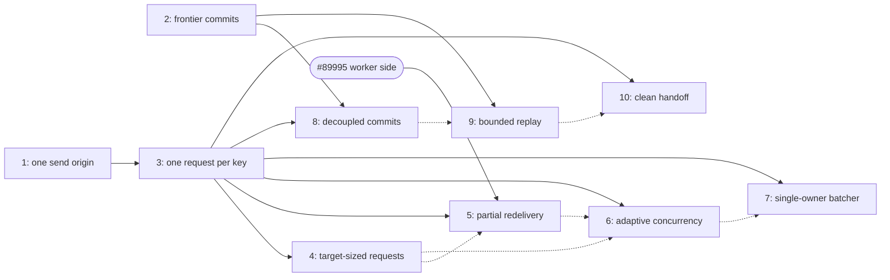

# Driver-model implementation plan

Status: **draft, for discussion**.

This plan implements the [driver-model redesign](https://github.com/PostHog/posthog/blob/pl/ingestion/consumer-redesign-doc/rust/ingestion-consumer/docs/driver-model.md) ([#89277](https://github.com/PostHog/posthog/pull/89277)) in small steps.
Each step is one PR.

Implementation reference: [Jose's `kafka-consumer-loop` branch](https://github.com/PostHog/posthog/compare/master...jose-sequeira/kafka-consumer-loop). It is a source of tested shared primitives, not a stack to merge whole: its first commit extracts the Kafka consumer config builder, while its second also includes primitives scheduled for later cycles. Reuse the config extraction and the cycle-2 ledger representation deliberately; leave the accumulator, budget, partition-driver, commit-manager, and drain work to their named cycles below.

## Starting point

The plan starts from current master.
Master already contains two parts of the design:

- The routing key is the opaque Kafka message key ([#90282](https://github.com/PostHog/posthog/pull/90282)). A message without a key gets a synthetic per-message key.
- Each worker has one long-lived ordered gRPC stream ([#85238](https://github.com/PostHog/posthog/pull/85238), [#90790](https://github.com/PostHog/posthog/pull/90790)). The stream runner keeps an un-acked ledger, resolves acks in send order, applies an ack watchdog, and fences on failure.

An assignment epoch also exists.
A rebalance increments it, and every sub-batch carries it.

These components stay as they are: the stream runners, the P2C (power-of-two-choices) router, the aperture, the worker registry, the commit sentinel, the commit monitor, and the key-order sentinel.

## Initial PR stacks

Both stacks start from this plan branch ([#91468](https://github.com/PostHog/posthog/pull/91468)), so the reviewed design and implementation history stay together. Within a stack, each PR is based on the preceding PR.

| Stack | Branch sequence | Scope |
| --- | --- | --- |
| Cycle 1 | `c1-delete-eager-flush` | Change 1. |
| Cycle 2 | `c2-common-ledger` -> `c2-ledger-shadow` -> `c2-ledger-active` -> `c2-ledger-cleanup` | Changes 2 through 5, one PR per plan step. |
| Cycle 3 | `c3-demux-groups` -> `c3-batcher` -> `c3-scheduler-seam` -> `c3-key-table` -> `c3-scheduler-switch` | Changes 6 through 10, one PR per plan step. |

The stacks are independent: cycle 2 can begin without cycle 1, and cycle 3 needs only cycle 1 and the crate from change 2. The merge gates remain part of the plan: change 4 cannot merge until change 3 has soaked with a zero mismatch counter, and change 5 cannot merge until change 4 is stable on every lane. Draft PRs may be prepared earlier, but they must not collapse those gates.

## The cycle model

Work proceeds in cycles.
Each cycle delivers one outcome: a property of the system that holds from then on.
A cycle has five phases:

1. **Prepare**: structure changes that extract the seams: the interfaces that later changes swap behind. No behavior change.
2. **Implement**: build the new component, fully tested, not selected.
3. **Verify**: prove the new component against production before it takes over. A verify change adds observation only: a shadow comparison, a gauge, a dry-run report. Verification with no new code is a soak — a watch period in production with no code change — with a stated exit criterion, not a PR.
4. **Switchover**: config selects the new component. Canary one lane, then all lanes. The config is the rollback.
5. **Cleanup**: one deletion removes the old component and the switch.

Rules:

- Each change is one PR.
- Prepare, implement, verify, and cleanup changes do not change behavior. The e2e tests must pass without edits.
- Only a switchover may change behavior. Some do not (a switchover with identical output is still staged and reversible).
- Every cycle names its verify evidence: the metrics to read and the exit criterion.
- Old code is deleted in cleanup, never edited.
- Dead code is deleted before a seam is extracted around it. A cleanup of a switch that never shipped can open a cycle (change 1).
- A structural outcome with no behavior change needs no switchover. Review and the e2e tests control its risk. The table labels such a change Structure (change 19).
- A cycle's cleanup lands only after its switchover is stable on all lanes.
- Swap the smallest piece that removes the most complexity. Components that already match the target design are not rebuilt.
- A change must not alter the meaning of an existing metric. Metrics of deleted machinery are deleted with it.
- The commit sentinel and the key-order sentinel stay enabled through every cycle.

Cycle 1 lands first: one fast change that removes complexity, preserves behavior, and depends on nothing else.
After that, the cycles run in order, with two exceptions.
Cycle 3 does not depend on cycle 2, so it can proceed while cycle 2 soaks.
Cycle 4 needs only cycle 3's switchover, so it can proceed while cycle 3's cleanup soaks.
Cycle 8 needs cycles 2 and 3.
The numbered order is one valid schedule, not the only one: the [cycle dependency graph](#cycle-dependencies) at the end shows the full ordering freedom.

The swap unit in cycle 3 is the **scheduler**: the decision core that says which runs may go to a worker now, and where.
That is where the complexity concentrates — the pins, the stash, and the flush interplay.
Packing follows at once (cycle 4): the performance win depends only on the key-table scheduler, not on the event loop, decoupled commits, or the budget.
The request time budget follows packing (cycle 5): its enforcement precondition is the one-outstanding-request-per-key rule ([#89995](https://github.com/PostHog/posthog/pull/89995)), and its budget sizes against the packed request size.
The governor follows (cycle 6): it needs the scheduler's ready queue for its growth signal, and it comes after packing and the time budget, so RTT (request round-trip time) tunes once, against the final request shape.
The single-owner event loop follows as its own outcome (cycle 7), once the scheduler is simple.

Each change ends with its interface impact: the types it adds, modifies, or removes.
A change that adds metrics lists their names.

| # | Cycle | Phase | Change |
| --- | --- | --- | --- |
| 1 | 1 one send origin | Cleanup | Delete the dead eager flush |
| 2 | 2 frontier commits | Implement | Add the common Kafka consumer crate and offset ledger |
| 3 | 2 frontier commits | Verify | Run the ledger in shadow mode |
| 4 | 2 frontier commits | Switchover | Commit from the ledger frontier |
| 5 | 2 frontier commits | Cleanup | Delete the old commit computation |
| 6 | 3 one request per key | Prepare | Demux polls into groups |
| 7 | 3 one request per key | Prepare | Encapsulate the worker batcher |
| 8 | 3 one request per key | Prepare | Extract the scheduler seam |
| 9 | 3 one request per key | Implement | Build the key-table scheduler |
| 10 | 3 one request per key | Switchover | Switch to the key-table scheduler |
| 11 | 3 one request per key | Cleanup | Delete the old scheduler |
| 12 | 4 target-sized requests | Implement | Add the packer |
| 13 | 4 target-sized requests | Switchover | Set the packing targets |
| 14 | 5 partial redelivery | Implement | Add partial settlement and the request time budget |
| 15 | 5 partial redelivery | Switchover | Set the request time budgets |
| 16 | 6 adaptive concurrency | Implement | Add the governor |
| 17 | 6 adaptive concurrency | Switchover | Enable RTT adaptation |
| 18 | 6 adaptive concurrency | Cleanup | Remove the fixed per-worker cap |
| 19 | 7 single-owner batcher | Structure | Collapse the batcher into one event loop |
| 20 | 7 single-owner batcher | Cleanup | Remove the stream fences |
| 21 | 8 decoupled commits | Switchover | Switch completion to group granularity |
| 22 | 8 decoupled commits | Cleanup | Delete the per-poll completion path |
| 23 | 9 bounded replay | Implement | Add the budget accounting |
| 24 | 9 bounded replay | Switchover | Enable the budget |
| 25 | 9 bounded replay | Cleanup | Remove the in-flight admission cap |
| 26 | 10 clean handoff | Prepare | Add revoke and drained markers |
| 27 | 10 clean handoff | Implement | Build the drain |
| 28 | 10 clean handoff | Switchover | Enable the drain |
| 29 | 10 clean handoff | Cleanup | Delete the no-drain path |

## Cycle 1: one send origin

Outcome: the eager send path is gone.
This cycle has no switchover: the eager flush was never enabled.

**Verify:** the e2e suite. The change preserves behavior. The stash gauges (`ingestion_consumer_dispatcher_stashed_*`) must not change shape after the eager deletion.

### 1. Delete the dead eager flush (cleanup)

**Task:** Remove the eager deferred flush. The flag that enables it is off everywhere.

**Goal:** One send origin fewer before change 8 extracts the scheduler seam.

- `DISPATCHER_EAGER_DEFERRED_FLUSH` is default off, and no deployment sets it. Confirm against a fresh charts checkout and the live deployments before this ships.
- The completion-time flush already does all the draining in production. Behavior does not change.
- Carrying the eager path through the seam extraction would preserve code that does not run.

**Interfaces:**

- Remove `EagerFlush`, `run_eager_flush_loop`, `send_eager_flush`, and `DISPATCHER_EAGER_DEFERRED_FLUSH`.
- Modify `Dispatcher`: remove `set_eager_flush_sender`, `release_next_groups`, `eager_flush_*`, `take_eager_accepted`, and the eager pending and accepted accounting.

## Cycle 2: commits come from the frontier

Outcome: commit contiguity is a property of a data structure, not of completion order.

**Verify:** change 3 compares the frontier with every real commit on all lanes.
Exit criterion: `ingestion_consumer_ledger_mismatch_total` stays zero across deploys and rebalances, and `ingestion_consumer_ledger_uncommitted_offsets` returns toward zero when a lane is idle — the ring drains.

### 2. Add the common Kafka consumer crate and offset ledger (implement)

**Task:** Create `rust/common/kafka-consumer` and add `ledger.rs` with a per-partition offset ring. Do not wire it into a consumer yet.

**Goal:** Make commit contiguity a reusable property of a data structure, not a feature of the ingestion consumer.

- Start from the config extraction in [Jose's branch](https://github.com/PostHog/posthog/compare/master...jose-sequeira/kafka-consumer-loop): move the current consumer config builder unchanged into `common-kafka-consumer`, retain its fixture coverage, and make `ingestion-consumer` depend on it.
- Copy only the cycle-2 domain primitives from Jose's second commit into the new crate: the offset wrapper and the charge carried by a ledger slot. Adapt its `OffsetLedger` representation to this plan's `complete`, non-mutating `frontier`, and consuming `take_frontier` contract: Jose's current `complete` advances and removes the prefix, so it cannot be copied unchanged into the shadow comparison.
- Do not take `Accumulator`, `Budget`, `PartitionDriver`, `PartitionManager`, or `CommitManager`; those implement later cycles and would make this PR cross several plan boundaries. The ledger module must not depend on `rdkafka`, `ingestion-consumer`, or service-specific metrics. The shared config module may retain its `rdkafka` dependency.

- One ledger per partition. The ledger is a dense ring of delivered offsets.
- Each slot records: complete or not, event count, byte count. The counts serve the budget in change 23.
- The byte count is the payload plus the key plus every header key and value: the bytes the process holds for the message. Today's `CONSUMER_BATCH_SIZE_KB` counts the payload only; the budget is a memory bound, so it counts what is retained.
- Operations: `charge` adds a delivered offset. `complete` marks an offset done. `frontier` returns one past the highest contiguous done offset and does not mutate. `take_frontier` consumes the done prefix below the frontier.
- The frontier is in Kafka's committed-offset representation: the next offset to read, not the last offset processed. The current commit path already commits in this representation (the poll's max offset plus one), so the frontier is commit-ready as returned — no call site adds or subtracts one.
- The read/consume split matters: the comparison read is idempotent and cannot consume state by accident. Consumption happens at commit points in every mode, so the ring holds only uncommitted offsets.
- Completions can arrive in any order. The frontier moves only over completed slots.
- Kafka can deliver offsets with gaps: transaction markers occupy offsets that consumers never receive, and compaction keeps offsets while removing records. Our ingestion topics have neither today, and the commit sentinel treats a gap as a real skip (see the caveat on `CommitSentinel`).
- The ledger still defines contiguity over delivered offsets, not offset arithmetic. A legitimate gap can then never block the frontier.
- The sentinel's gap alert and the ledger's gap handling cannot both stand. Once the frontier owns commits (change 4), a commit that walks over a legitimate gap is correct, and the sentinel would report it as a skip. The ledger therefore counts each gap it walked over (`ingestion_consumer_ledger_gaps_total`), and the sentinel's gap alert retires in change 5. Until then the alert stays, because the ingestion topics have no legitimate gaps today and a gap is still a real skip.
- Add property tests: out-of-order completion, monotonic frontier, `frontier` idempotence, the ring drains after `take_frontier`, offset gaps, ring capacity.

**Interfaces:**

- Add workspace crate `common-kafka-consumer`, exporting the shared config builder, `Offset`, `Charge`, and `OffsetLedger`.
- Add `OffsetLedger` in `ledger.rs`: `charge`, `complete`, `frontier` (non-mutating), `take_frontier` (consuming). No runtime callers yet. The name avoids a clash with the stream runner's internal un-acked ledger.
- Modify `ingestion-consumer` to import the moved config builder from the common crate.

### 3. Run the ledger in shadow mode (verify)

**Task:** Wire the ledger next to the commit path. Compare its frontier with each real commit. Do not change what the consumer commits.

**Goal:** Prove the ledger against production traffic before it owns the commits.

- New config: the ledger mode, `off`, `shadow`, or `active`. This change ships `shadow`. Change 4 ships `active`.
- Charge every delivered offset into its partition ledger during `collect_batch`.
- When a poll completes, mark all its offsets complete.
- At each commit, compare the partition's `frontier` — the non-mutating read — with the offset the current path commits. Both are next-to-read offsets, so with oldest-first completion the two must be equal, with no offset arithmetic in the comparison.
- After the comparison, call `take_frontier` at the same commit point. The ledger drains identically in shadow and active modes. Without this, the shadow ring grows without bound.
- On a mismatch: increment a counter and log the partition with both offsets. Do not block the commit.
- On revoke, drop the partition's ledger. This mirrors the commit sentinel's `forget_partitions`.
- Soak on all lanes until the cycle's exit criterion is met.

**Interfaces:**

- Modify `Config`: add the ledger mode.
- Modify `IngestionConsumer`: own one `OffsetLedger` per partition. Charge in `collect_batch`, complete on poll completion, compare in `commit_offsets`.
- Modify the revoke path (`SentinelContext`): drop revoked partitions' ledgers.

**Metrics:**

- Add `ingestion_consumer_ledger_mismatch_total` (counter): frontier vs committed offset disagreement.
- Add `ingestion_consumer_ledger_uncommitted_offsets` (gauge, per partition): ring depth. It must fall at commit points. A value that only grows is a drain bug (a leak).
- Add `ingestion_consumer_ledger_gaps_total` (counter): offset gaps the ledger walked over. Expected to stay at zero on the ingestion topics; a non-zero value is the signal the sentinel's gap alert gave before change 5 retires it.

### 4. Commit from the ledger frontier (switchover)

**Task:** Set the ledger mode to `active`. The frontier becomes the committed offset. Keep oldest-first completion.

**Goal:** The frontier produces the same commits as the old code, and change 3 already proved that.

- Commit each partition's frontier instead of the poll's max offset plus one. Both are next-to-read offsets: with oldest-first completion, the committed value does not change.
- The ledger calls do not change: both modes already charge, complete, compare, and consume at the same points (change 3). This switchover changes only which value the consumer commits.
- With oldest-first completion, the output is identical to the old path.
- The commit sentinel stays on and checks contiguity and monotonicity.
- Rollback is the config switch back to `shadow`.

**Interfaces:**

- Modify `Config`: default the ledger mode to `active`.
- Modify `IngestionConsumer::commit_offsets`: read the committed offset from the ledger. The old computation survives as the shadow comparison until change 5.

### 5. Delete the old commit computation (cleanup)

**Task:** Remove the old commit computation after `active` is stable on all lanes.

**Goal:** The frontier is the only commit source.

- Remove the old per-poll commit computation and the shadow comparison.

**Interfaces:**

- Modify `IngestionConsumer::commit_offsets`: frontier only.
- Modify `Config`: remove the ledger mode.
- Remove `ingestion_consumer_ledger_mismatch_total`. The comparison it counts is gone; the commit sentinel remains the invariant check.

## Cycle 3: at most one request per key is in flight

Outcome: the scheduler sends at most one request per key at a time, and that alone preserves per-key order. Pins, the stash, and the flush paths are gone.

**Verify:** the deterministic seam tests in change 9 script arrivals, settlements, and failures.
A production shadow is impossible here: the scheduler's decisions change which sends exist, so state diverges immediately.
The canary in change 10 is the production proof.
Exit criterion: zero key-order sentinel violations, `ingestion_consumer_transport_duration_seconds` and the `ingestion_consumer_messages_processed_total` rate unchanged, and the no-progress watchdog quiet.

### 6. Demux polls into groups (prepare)

**Task:** Change `collect_batch` to output groups. A group is one poll's consecutive messages for one routing key on one partition.

**Goal:** Create the accumulator shape from the design doc.

- Group messages per partition first, then per routing key. Keep offset order inside each group.
- The dispatcher flattens the groups back into one message list. Sub-batch assembly does not change.
- Change 7 submits them to the batcher as the accumulator.
- The group is the seam vocabulary between the consumer loop and the batcher, so it lives in `common-kafka-consumer`, generic over the key and the message body. The crate's demux knows no routing key of its own: a keyless message is one group on its own, and the dispatcher keeps naming such a group with its synthetic per-message key.

**Interfaces:**

- Add `Partition` to the crate's `types.rs`, and `Group` and `Accumulator` in `accumulator.rs`: a group is a partition, an optional key, and its offsets and messages in offset order; the accumulator is the demux that builds one poll's groups.
- Modify `CollectedBatch`: carries `Vec<Group>` instead of a flat message list.
- Modify `Dispatcher::assign_and_send`: takes groups and flattens them. The demux moves to the collect path; the dispatcher keeps only the routing-key naming.

### 7. Encapsulate the worker batcher (prepare)

**Task:** Put today's dispatch orchestration behind one boundary. The consumer loop and the batcher exchange plain values.

**Goal:** The dispatch concurrency becomes an implementation detail behind one interface.

- Interface in: one accumulator per poll — the poll's demuxed groups, submitted on the consumer loop in poll order.
- Interface out: one completion event per group, with its partition, its assignment epoch, its offsets, and its accepted count.
- This is the design doc's boundary: accumulators in, completions out. It is the final shape and does not change again.
- No batch identity crosses the boundary. The facade creates an internal batch id per accumulator for the old machinery and the wire request. The consumer correlates completions by partition and offset — the same key the ledger uses.
- The facade breaks each resolved send into its groups. The send resolution in `scatter` already carries them (`routing_keys` and `key_offsets` on `PendingSubBatch`), and a send is all-or-nothing.
- Only orchestration moves inside the boundary: assignment, scatter with its send resolution, and the deferred flush.
- `GrpcTransport`, `Router`, and `WorkerRegistry` keep their construction and ownership in `main.rs`. The batcher takes shared handles. Readiness gating, discovery reconciliation, the reaper, and the debug endpoints do not change.
- The facade replicates today's behavior exactly, including the oldest-first flush pacing. This is code motion — moving code without changing it — not redesign.
- The consumer loop keeps: poll collection, commits, the sentinels, and the admission cap. It tracks each poll's offset spans and completes the poll when completions cover them, so completion and commit behavior do not change.
- The no-progress watchdog moves with the flush: the stall deadline lives in the batcher's flush driver, and only there. The clock suspends while a send is in flight and resets when messages land, exactly as today — a consumer-side completions-only timer cannot see the difference between a wedged flush and a slow send, and would fail drains that today survive. The batcher reports a stall (and the other fatal orchestration failures: shutdown while deferred work is unroutable, a batch with no usable workers) on an error channel beside the completions; the consumer fails the process on the first message, keeping the failure decision in the loop. Every later cycle keeps this bail until cycle 10 adds the per-partition stall deadline.
- Each completion carries the assignment epoch read once at submit, and `submit` returns it. The consumer correlates a completion to a poll by epoch plus partition and offset — within one epoch, poll spans are disjoint per partition — and discards and counts a completion that matches no in-flight poll. The epoch already exists on master. Carrying it on the completion from this change closes the window a partition-ownership check leaves open: a partition revoked, reassigned, and replayed while a group is out has two polls holding the same offsets, and the old incarnation's completion must not land in the new poll (nor, later, in its new ledger).
- Changes 8 and 9 extract the scheduler seam inside this boundary.

**Interfaces:**

- Submit the `Accumulator` from change 6 as one poll's groups, in poll order.
- Add `Batcher` in `batcher.rs`: `submit(Accumulator)` in (returning the stamped assignment epoch), a channel of `GroupCompletion` plus an error channel out. It owns `Dispatcher` and the send tasks, and holds shared handles to `GrpcTransport`, `Router`, and `WorkerRegistry`, plus a lifecycle handle and the deferred-flush timeout for its flush driver. It creates batch ids internally.
- Add `GroupCompletion` in the crate's `types.rs`: partition, assignment epoch, offsets, accepted count. No batch id and no messages: the batcher keeps the bodies for retry, and the ledger needs only the offsets.
- Add `AssignmentEpoch` to the crate: the named home of the assignment generation. `main.rs` creates it, the rebalance context bumps it, and the transport and the batcher read it — one counter, one bump site, two readers.
- Modify `IngestionConsumer`: drop `scatter` and `flush_deferred` — they move into the batcher. Keep collect, commit, and the admission cap. Correlate completions to polls by epoch, partition, and offset.
- Modify `main.rs`: construct one `Batcher` from the existing transport, registry, and router. The consumer no longer sees the dispatcher.
- Internalize `Dispatcher`'s resolve methods (`on_sub_batch_*`, `defer_failed`): only the batcher calls them in production code. The methods stay public because the e2e suite drives them directly, and that suite must pass unedited.

**Metrics:**

- Add `ingestion_consumer_group_completions_total` (counter) and its accepted-message sum, `ingestion_consumer_group_completion_accepted_messages_total`. Cross-check: the sum tracks `ingestion_consumer_messages_processed_total`.
- Add `ingestion_consumer_stale_group_completions_total` (counter): completions discarded because no in-flight poll matched.

### 8. Extract the scheduler seam (prepare)

**Task:** Move every ordering and placement decision inside the batcher behind one interface. Keep the current semantics.

**Goal:** Isolate the decision core from the plumbing, so the smallest valuable piece can swap.

- The scheduler decides which runs may go to a worker now, and where. Nothing else in the batcher decides that.
- Interface in: events. A group arrives. A request settles, with success or failure. A retry deadline fires.
- Interface out: dispatches. One dispatch is one run of one key on one worker.
- The first implementation preserves today's semantics: pins, the stash, deferral on drain, and the flush pacing. This is code motion from `assign`, `flush_deferred`, and `on_sub_batch_resolved`.
- The plumbing (tasks, channels, the mutex) stays as it is. Only the decisions move.
- The seam is event-shaped, by design: each call is one event, runs to completion, does no I/O, takes no locks, and returns its effects as data (the dispatches). This shape is what later makes change 19 mechanical: the seam's handlers become the loop's select arms.
- The seam makes today's implicit ordering rules explicit and reviewable in one place.

**Interfaces:**

- Add the `Scheduler` trait in `scheduler.rs`: `on_groups`, `on_settled`, `on_deadline` in; `Vec<Dispatch>` out.
- Add `Dispatch`: one run of one key, with the chosen worker.
- Add `PinStashScheduler`: the current semantics, moved out of `Dispatcher::assign`, `flush_deferred`, and `on_sub_batch_resolved`. It owns `PinTable` and `Stash` unchanged.
- Modify `Dispatcher`: shrinks to plumbing — the lock, in-flight load, metrics, and seam calls.

### 9. Build the key-table scheduler (implement)

**Task:** Write the target scheduler as a second implementation of the seam. Do not select it.

**Goal:** The replacement for the ordering core exists, fully tested, before any behavior changes.

- The key table: one FIFO queue per key. A key is runnable when it has queued work and no outstanding request.
- On arrival: enqueue, and dispatch one contiguous run when the key is runnable. Dispatch marks the key outstanding.
- On settlement: clear the flag. Success dispatches the key's next run. Failure returns the run to the front of its queue, then clears the flag — requeue before release, in one seam call.
- A parked-retry deadline covers the keys no settlement can release: unroutable groups, and keys behind a failed send.
- Placement is stateless: the existing P2C and aperture pick a worker per dispatch. There are no pins.
- The seam is events in, dispatches out. Test the scheduler deterministically: script arrivals, settlements, and failures. Assert per-key order.

**Interfaces:**

- Add `KeyTableScheduler` and `KeyTable` in `key_table.rs`: per-key FIFO, outstanding flag, parked list. Implements `Scheduler`. Tests only, no production callers.

**Metrics:**

- Add, emitted when selected: `ingestion_consumer_key_table_keys`, `ingestion_consumer_key_table_queued_messages`, `ingestion_consumer_key_table_outstanding_keys`, `ingestion_consumer_key_table_parked_keys` (gauges), and `ingestion_consumer_parked_retries_total` (counter).

### 10. Switch to the key-table scheduler (switchover)

**Task:** Select the key-table scheduler with config. Canary one lane, then roll out.

**Goal:** At most one in-flight request per key replaces pins, the stash, and the flush paths.

- The switch changes the ordering rule and nothing else. Placement, transport, and completion accounting do not change in this PR.
- At most one outstanding request per key preserves per-key order. Nothing else does, and nothing else must.
- This is proposal 2 of the design doc: sticky pins are removed. Measure worker key-cache locality before and after (open question 3).
- Watch the cycle's exit metrics, and the key-table gauges for queue growth.
- Rollback is the config switch back to the old scheduler.

**Interfaces:**

- Modify `Config`: add the scheduler selection.
- Modify the batcher construction: select `KeyTableScheduler` or `PinStashScheduler`.
- No interface shapes change.

### 11. Delete the old scheduler (cleanup)

**Task:** Remove the old scheduler implementation after change 10 is stable on all lanes.

**Goal:** The old concurrency goes in one deletion, not in edits.

- Removes: the pin table, the stash, the completion-time flush, and the scheduler switch.
- The plan never edits this machinery. It is isolated in change 8, bypassed in change 10, and deleted here.

**Interfaces:**

- Remove `PinStashScheduler`, `PinTable`, `Stash`, and `sticky_pin_for`.
- Remove the scheduler selection from `Config`.
- Modify `Dispatcher`: remove the dead resolve plumbing (`clears_deferral`, `send_failed`, the flush driver).
- Remove the pin and stash metrics (`ingestion_consumer_dispatcher_pins_total`, `ingestion_consumer_dispatcher_stashed_*`, the deferral counters). The key-table gauges replace them.

## Cycle 4: workers receive target-sized requests

Outcome: request size tracks target T, and a request forms only when there is work to fill it. No cleanup: body splitting stays as a defence.
This cycle sits directly after the scheduler on purpose: the win depends only on the key-table scheduler.
It needs cycle 3's switchover on all lanes, and can proceed while cycle 3's cleanup soaks.
A scheduler rollback also reverts packing: the packer exists only in the key-table scheduler.

**Verify:** with the pack budget at zero, the packer emits on arrival and the e2e suite passes unchanged.
Exit criterion after the targets: the request-size histograms center near T, and `ingestion_lag_ms` does not regress.

### 12. Add the packer (implement)

**Task:** Add the packer to the scheduler, with target size T and `PACK_LATENCY_BUDGET`. Ship with the pack budget at zero: send-on-arrival, behavior unchanged.

**Goal:** The packing machinery exists before it changes any request.

- Check the worker side first: a packed request spans polls and keys. Confirm the worker's `concurrentBatches` accounting and the meaning of `batch_id` still hold.
- Pack runs from multiple runnable keys into one request near T. T counts events and bytes.
- Emit immediately when the ready work can fill the free stream slots with near-T requests. Otherwise arm the pack deadline. The governor (cycle 6) replaces the slots with permits.
- When the deadline expires, emit partial requests. The deadline also bounds the wait when held groups keep polls open: packing adds latency, never a deadlock.
- Router order inside a pass: fill open requests on healthy workers first, then pick a worker with P2C from the aperture slice. Partition affinity is a tie-breaker only.

**Interfaces:**

- Add `Packer` inside `KeyTableScheduler`.
- Modify `Dispatch`: one request may carry runs from several keys.
- Modify `Config`: add T and `PACK_LATENCY_BUDGET`, default zero. The worker proto does not change.

**Metrics:**

- Add `ingestion_consumer_request_events` and `ingestion_consumer_request_bytes` (histograms): the size of each sent request.
- Add `ingestion_consumer_pack_emits_total` (counter, reason `arrival`, `full`, or `deadline`).

### 13. Set the packing targets (switchover)

**Task:** Set T and the pack budget per lane.

**Goal:** Workers receive target-sized requests.

- A charts values PR sets the targets lane by lane.
- Watch the request-size histograms, worker occupancy, and end-to-end latency. Rollback is a pack budget of zero.

**Interfaces:**

- None in this repository. Config values only.

## Cycle 5: a slow request redelivers only its remainder

Outcome: a worker stops a request at the consumer's time budget, acks the finished prefix, and only the remainder redelivers.
Today one slow message holds every message behind it until the ack watchdog fences the whole stream, and everything unacked replays with duplicate work.
This budget is time per request. It is not B, the uncommitted-work budget of cycle 9.

It needs [#89995](https://github.com/PostHog/posthog/pull/89995) merged on the worker side (`soft_budget_ms` on the wire, the `PARTIAL` ack).
It needs cycle 3: one outstanding request per key is [#89995](https://github.com/PostHog/posthog/pull/89995)'s stated enforcement precondition.
It sizes the budget against cycle 4's request size. Its cap on request RTT matters for cycle 6: set `REQUEST_LATENCY_BUDGET` below the soft budget, or the governor never shrinks.

**Verify:** a generous budget on one lane enforces rarely and exercises the real partial-ack path at negligible volume.
Exit criterion: partial acks resolve and their remainders redeliver in order, zero key-order sentinel violations, and ack-watchdog teardowns (`ingestion_consumer_worker_stream_teardowns_total`) fall.

### 14. Add partial settlement and the request time budget (implement)

**Task:** Teach the transport the `PARTIAL` ack and the scheduler a partial settlement. Ship with no budget set: absent means unlimited, today's behavior.

**Goal:** Partial redelivery exists as one settlement arm, not a new path.

- The stream runner parses `PARTIAL` and resolves the send with the accepted index list, instead of fencing it as busy.
- The scheduler's partial arm is the failure arm plus a completed prefix: complete each key's finished prefix as group completions, return the remainder to the front of its queue, and keep the key blocked until the redelivery settles.
- The prototype against the old machinery ([#91480](https://github.com/PostHog/posthog/pull/91480)) showed the cost of doing this earlier: concurrent polls and per-batch accounting push partial handling through the deferral paths. Behind the key table it is one `on_settled` arm.
- Stamp `soft_budget_ms` on each request from config. Unset sends no budget.

**Interfaces:**

- Modify the ack handling in `grpc_transport.rs`: parse `PARTIAL`; resolve with the accepted indexes.
- Modify the settlement types and `KeyTableScheduler::on_settled`: add the partial arm.
- Modify `Config`: add the soft budget per request, default unset.

**Metrics:**

- Add `ingestion_consumer_request_budget_partials_total` (counter) and `ingestion_consumer_request_budget_timed_out_messages_total` (counter). The names match the wire: a `PARTIAL` ack with a `timed_out` index list.

### 15. Set the request time budgets (switchover)

**Task:** Set the soft budget per lane: first generous, then real.

**Goal:** A slow request costs a partial redelivery, not a fenced stream and a full replay.

- A charts values PR sets the budget lane by lane. The generous stage is the cycle's verify.
- Watch the partial and timed-out counters, the key-order sentinel, and stream teardowns.
- Rollback is unsetting the values.

**Interfaces:**

- None in this repository. Config values only.

## Cycle 6: concurrency adapts to worker health

Outcome: request RTT governs the number of requests in flight.
It needs cycle 4: packing makes request sizes uniform, so the RTT signal tunes against comparable requests.
It comes after cycle 5, so the governor tunes once, against budget-capped RTT: set `REQUEST_LATENCY_BUDGET` below the soft budget, or it never shrinks.
The growth signal — ready work waiting on permits — comes from the key-table scheduler's ready queue.

**Verify:** with adaptation off, change 16 reports the decisions it would make.
Exit criterion: `ingestion_consumer_governor_adjustments_total` shows shrink signals under induced worker latency and stays quiet under normal load.

### 16. Add the governor (implement)

**Task:** Add the permit pool and the RTT EWMA (an exponentially weighted moving average). Ship with adaptation off: permits mirror the current per-worker cap.

**Goal:** The governor exists and observes before it constrains.

- The governor gates the pack pass: a dispatch takes a permit, and a settlement returns it. The integration surface is thin, and change 19 later moves the calls into the event loop unchanged.
- Grow the pool by one when ready work waits, no permit is free, and RTT is within budget.
- Shrink the pool by one when the RTT EWMA exceeds `REQUEST_LATENCY_BUDGET`.
- With adaptation off, compute and report every decision without applying it. The signal is verifiable before it constrains.
- Bound the pool with a configured minimum and maximum.
- Keep the 503 backoff in the transport. Exclude 503 waits from the RTT signal.
- Cap each stream channel at `DEPTH_MAX`.

**Interfaces:**

- Add `Governor` in the batcher: the permit pool and the RTT EWMA, adaptation off.
- Modify `Config`: add `REQUEST_LATENCY_BUDGET`, the permit bounds, and `DEPTH_MAX`.

**Metrics:**

- Add `ingestion_consumer_governor_permits` (gauge) and `ingestion_consumer_request_rtt_seconds` (gauge, the EWMA).
- Add `ingestion_consumer_governor_adjustments_total` (counter, direction `grow` or `shrink`). With adaptation off, it counts would-be decisions.

### 17. Enable RTT adaptation (switchover)

**Task:** Turn adaptation on. Request RTT governs the permit pool.

**Goal:** Concurrency shrinks when the worker pool is unhealthy.

- Canary one lane. Watch the permit gauge, the RTT EWMA, and throughput under induced worker latency.
- Rollback is the adaptation switch.

**Interfaces:**

- Modify `Config`: enable adaptation.

### 18. Remove the fixed per-worker cap (cleanup)

**Task:** Remove the per-worker `max_unacked` cap after adaptation is stable on all lanes.

**Goal:** Governor permits are the only in-flight bound.

**Interfaces:**

- Modify `GrpcTransport`: remove the per-worker cap and its config. Stream channels keep `DEPTH_MAX`.

## Cycle 7: the batcher is one single-owner event loop

Outcome: one task owns all batcher state. The mutex and the callback structure are gone.
This is a deliberate structural outcome, not routine cleanup: it is the largest single concurrency simplification in the plan.

**Verify:** the e2e suite and review. The change is behavior-identical, and the consumer-facing metrics must not move.

### 19. Collapse the batcher into one event loop (structure)

**Task:** Move the scheduler and its plumbing into one single-owner task.

**Goal:** Remove the mutex and the callback structure.

- The seam's events become the loop's events: accumulators, settlements, deadlines. The scheduler is already event-shaped, so the loop owns it directly.
- State becomes task-local. The worker-health snapshot stays the only shared read.
- This is the batcher event loop of the design doc. The decisions it drives are already simple (cycle 3), so the transformation is mechanical, but it lands as its own reviewed change.
- No config switch: the change is behavior-identical, and running two plumbing implementations side by side would cost more than it protects. Review and the e2e suite control the risk.

**Interfaces:**

- Modify `Batcher`: one single-owner task replaces the lock, the resolve callbacks, and the per-send tasks. `Dispatcher` dissolves into the loop and is removed.
- Keep `Scheduler` and `Governor` as the loop's components. The consumer-facing interface does not change.

### 20. Remove the stream fences (cleanup)

**Task:** Delete `FenceGuard` and the fence-settle loop from `grpc_transport.rs`.

**Goal:** Keep only the failure logic the new invariant needs.

- Fences go only after the batcher is single-owner. Change 11 makes requeue-before-release a scheduler invariant; change 19 makes it mechanical: one task performs settlement, requeue, and the next dispatch, so no window exists for a newer send to overtake a failure.
- A stream failure returns each request's messages to the key table. That is sufficient.
- This change is deferrable. With one send origin, fences are redundant protection; their only cost is the code.
- Keep: retry classification, busy (503) handling, the ack watchdog, and ack-prefix resolution.

**Interfaces:**

- Remove `FenceGuard` from `transport.rs` and `Fence` with its settle loop from `grpc_transport.rs`.
- Modify `SendError`: drop the fence-guard field.
- Keep `TransportError` and the `WorkerStreamRunner` reconnect logic.
- Remove `ingestion_consumer_worker_stream_fenced_sub_batches_total`. Stream teardowns stay counted.

## Cycle 8: a stalled key stalls only its partition

Outcome: commits advance per partition as groups complete. Needs cycles 2 and 3.

**Verify:** the commit sentinel checks every commit, and `ingestion_consumer_ledger_uncommitted_offsets` shows per-partition frontier lag.
Exit criterion at the canary: zero sentinel violations, and a stalled partition no longer moves the commit rate of other partitions.

### 21. Switch completion to group granularity (switchover)

**Task:** Add a completion granularity, `poll` or `group`. At `group` granularity, mark the ledger per group and stop waiting for whole polls.

**Goal:** A stalled key stalls only its own partition. Other partitions continue to commit.

- The granularity names the unit that completes. `poll`: a poll completes as a whole, oldest first — today's behavior. `group`: each group completes on its own, in any order.
- Cycles 2 and 3 are the prerequisites. Commits come from the frontier, and the old flush, whose per-key order depended on oldest-first completion, is gone. Only commits depend on completion order now, and the frontier gates those.
- At `group` granularity, mark each group's offsets in the ledger when its completion event arrives. Do not aggregate per poll before commits.
- The frontier gates each partition's commit.
- Keep `max_in_flight_batches` as the bound on outstanding work. A poll's slot frees when all its groups are accepted.
- Behavior change: commit timing decouples across partitions and polls. Replay exposure stays inside the admission cap.
- Rollback is the switch back to `poll`.

**Interfaces:**

- Modify `Config`: add the completion granularity.
- Modify `IngestionConsumer::process`: at `group` granularity, select over `GroupCompletion` events. The per-poll path stays for rollback.

### 22. Delete the per-poll completion path (cleanup)

**Task:** Remove the per-poll completion path after `group` granularity is stable on all lanes.

**Goal:** Group completions are the only completion signal.

**Interfaces:**

- Remove the ordered `InFlightBatch` queue, the per-poll aggregation from change 7, and the completion granularity from `Config`.

## Cycle 9: replay exposure is bounded by B

Outcome: uncommitted work never exceeds the budget, in events and bytes. The in-flight admission cap is gone.

**Verify:** change 23's gauges run on all lanes with the budget unset.
Exit criterion: `ingestion_consumer_budget_outstanding_events` tracks the admission cap's occupancy, and the pause gauge stays flat at zero.

### 23. Add the budget accounting (implement)

**Task:** Track uncommitted work in events and bytes. Ship with no budget set: the admission cap still governs alone.

**Goal:** The budget exists and reports before it constrains.

- Charge each message on poll. The ledger slots already carry the costs (change 2).
- Refund the charge when the commit that covers the message is issued.
- Gauge the outstanding charge per partition and in total.
- New config: the budget in events and in bytes, and the low watermark as a fraction of the budget (default 0.8). Unset means no constraint.

**Interfaces:**

- Modify `Config`: add the budget, default unset.
- Modify `IngestionConsumer`: track charge and refund through `OffsetLedger`. No polling change while the budget is unset.

**Metrics:**

- Add `ingestion_consumer_budget_outstanding_events` and `ingestion_consumer_budget_outstanding_bytes` (gauges).
- Add `ingestion_consumer_budget_paused` (gauge, 0 or 1) and `ingestion_consumer_budget_pauses_total` (counter). Both stay flat until change 24.

### 24. Enable the budget (switchover)

**Task:** Set the budget per lane. Pause the poll at the limit and resume on refund.

**Goal:** Replay exposure is bounded directly.

- A charts values PR sets the budget lane by lane. The admission cap and the budget both bound work during the transition.
- Derive the first values from the current config: events near the batch size times the cap, bytes from the byte bound. The effective bound then does not change at the switchover.
- Pause the assignment when the outstanding charge reaches the budget on either axis. Resume only when it is back at or under the low watermark on both axes. A pause purges librdkafka's fetch queue and a resume refetches it, so a gate that reopens on the first refund refetches on every crossing.
- Do not stop polling while paused. A paused consumer still serves rebalance callbacks and keeps `max.poll.interval.ms` alive; an unpolled one does neither. When a partition is assigned while the gate is closed, pause it too: an assignment resets librdkafka's pause flags.
- Watch the pause gauge and `ingestion_lag_ms`. Rollback is unsetting the values.

**Interfaces:**

- None in this repository. Config values only.

### 25. Remove the in-flight admission cap (cleanup)

**Task:** Remove `max_in_flight_batches` after the budget is stable on all lanes.

**Goal:** The budget is the only admission bound.

- Only admission control goes. The collection bounds — batch size and batch timeout — stay: they shape one poll, not the amount of admitted work.

**Interfaces:**

- Remove `max_in_flight_batches` from `Config` and the admission bookkeeping from `IngestionConsumer`.
- Remove `ingestion_consumer_in_flight_batches`. The budget gauges replace it.

## Cycle 10: partitions hand off cleanly

Outcome: a revocation drains in bounded time, and a wedged partition fails the process instead of hanging. Needs cycle 3.
Until this cycle, revocation keeps today's behavior: no drain, uncommitted work replays on the new owner, and the old owner's in-flight sends finish as duplicate work. Nothing in cycles 1 to 9 changes that.

**Verify:** rebalance tests with the drain on, then the canary rebalance in change 28.
rdkafka's `MockCluster` runs cooperative rebalances with no broker container, so the drain ordering is testable in the crate. The mock coordinator delays the first join by 3 s and every later round by `session.timeout.ms` minus one second, so test consumers need a session timeout above 3 s.
Exit criterion: `ingestion_consumer_drain_duration_seconds` stays inside the deadline, and `ingestion_consumer_drain_dropped_messages_total` matches the expected replay volume.

### 26. Add revoke and drained markers (prepare)

**Task:** Extend the batcher boundary with a revoke marker in and a drained marker out. Nothing consumes them yet.

**Goal:** The boundary carries the drain protocol before any drain logic exists.

**Interfaces:**

- Modify `Batcher`: add the marker types to the submit and completion channels. `GroupCompletion` does not change shape.

### 27. Build the drain (implement)

**Task:** Implement the drain sequence from section 4 of the design doc, behind a config switch that ships off.

**Goal:** The drain exists and is tested. Off means today's behavior: replay without drain.

- rdkafka runs the rebalance callback inside `poll`, on the task that awaits `recv()`: the consumer loop's own task. The callback must not wait for the drain, because the loop that would end the drain is the one blocked in the callback. On revoke the callback only reports; the loop hands the partitions back later with `incremental_unassign`, which librdkafka allows outside the callback. On assign the callback still calls `incremental_assign` at once; an assignment has nothing to wait for.
- On revoke, send the in-band marker to the batcher, after earlier accumulators.
- The batcher drops queued unsent work for the partition. Kafka replays it for the next owner.
- Wait only for requests in flight. Send the drained marker after the final completion.
- The loop issues one final commit and refunds the remaining charge per partition. It hands the partitions back once every partition in the revoke set has drained, with one `incremental_unassign` carrying the list the callback received. A subset counts as the whole answer, and librdkafka re-revokes the rest in a later round.
- While a revoke waits for the hand-back, librdkafka pauses every assigned partition, not only the revoked ones. The drain window is a pod-wide fetch pause, bounded by the request timeout. Set the rebalance timeout (`max.poll.interval.ms`) above the request timeout, and keep polling through the wait so the callbacks and the liveness clock keep running.
- A lost assignment skips the final commit. When `assignment_lost()` is true at the revoke (the session or `max.poll.interval.ms` expired) or the callback reports an error, the broker has fenced the generation and the commit would fail. Drop the partition's ledger, refund its charge, hand it back at once, and still send the marker so the batcher clears its queues. Completions for it die by epoch.
- Closing the consumer revokes the whole assignment through the same callback, and rdkafka's `Drop` polls until the close completes. A deferred hand-back there never comes and the drop spins forever. A `closing` flag makes the callback answer inline; set it before any path that drops the consumer, the clean shutdown and the fatal-error exit alike.
- Shutdown is a drain of every assigned partition: a revoke marker per partition through the same path, the final commit per drained marker, then one synchronous commit of every partition's last attempted offset, then close. A drain cut short by the graceful-shutdown deadline replays its un-acked tail, bounded by B.
- Empty assign events arrive after a hand-back and at the end of a rebalance round. They are no-ops.
- Check completions against the assignment epoch. The epoch already exists on master and rides on `GroupCompletion` since change 7.
- Add a stall deadline per partition, reset only when its frontier moves. Outside a rebalance, an expired deadline fails the process. A partition being drained stands down: its wait is bounded by the request timeout. Replay is at most B.

**Interfaces:**

- Modify `KeyTableScheduler`: drop queued work per partition on the revoke marker.
- Modify `IngestionConsumer` and `OffsetLedger`: the final commit, the refund of abandoned charge, and the stall deadline.
- Modify `SentinelContext`: override `rebalance` so a revoke reports without unassigning, with the `closing` flag and the lost-assignment path above.
- Modify `Config`: add the drain switch, default off.

**Metrics:**

- Add `ingestion_consumer_drain_duration_seconds` (histogram) and `ingestion_consumer_drain_dropped_messages_total` (counter): drain time and replay volume per revocation.
- Add `ingestion_consumer_partition_stalls_total` (counter): stall-deadline expiries.

### 28. Enable the drain (switchover)

**Task:** Turn the drain on. Canary one lane through a rebalance.

**Goal:** Rebalances hand partitions off with a bounded drain.

- Watch the cycle's exit metrics and the drained markers. Rollback is the switch.

**Interfaces:**

- Modify `Config`: enable the drain.

### 29. Delete the no-drain path (cleanup)

**Task:** Remove the no-drain revoke path after the drain is stable on all lanes.

**Goal:** The drain is the only revoke behavior.

**Interfaces:**

- Remove the no-drain path and the drain switch from `Config`. Keep the epoch checks.

## Monitoring

The steady-state dashboard after the migration:

- Delivery: `ingestion_lag_ms`, the `ingestion_consumer_messages_processed_total` rate, and the two sentinel violation counters, which must stay at zero.
- Commits: `ingestion_consumer_ledger_uncommitted_offsets` per partition (frontier lag, and the ring-leak detector) and the `ingestion_consumer_offset_commits_total` rate.
- Scheduling: the key-table gauges and `ingestion_consumer_parked_retries_total`.
- Admission: the budget gauges and `ingestion_consumer_budget_paused`.
- Requests: the request-size histograms, `ingestion_consumer_transport_duration_seconds`, `ingestion_consumer_governor_permits`, `ingestion_consumer_request_rtt_seconds`, and `ingestion_consumer_request_budget_partials_total`.
- Rebalance: `ingestion_consumer_drain_duration_seconds` and `ingestion_consumer_drain_dropped_messages_total`.

The budget occupancy and the request-size histograms are also the worker-autoscaling signals from section 5 of the design doc.

## Cycle dependencies

The cycles do not have to run linearly.
A solid arrow is a hard dependency.
A dashed arrow is an ordering preference: its reason is stated in the target cycle's intro, and breaking it costs retuning or a larger diff, not correctness.

What the graph permits:

- Cycles 1 and 2 start in parallel. Neither depends on the other.
- After cycle 3, four tracks can run side by side: the request track (4, then 5, then 6), the collapse (7), decoupled commits (8, once cycle 2 is done), and the drain (10).
- Cycle 9 hard-depends only on cycle 2. The dashed edge from cycle 8 exists because group-level completion makes the refunds fine-grained before the admission cap is removed.
- The dashed edges into cycle 6 are the tune-once argument: packing makes request sizes uniform, and the time budget caps RTT, so the governor tunes against the final distribution.
- The dashed edge into cycle 7 saves a move: the loop takes the scheduler, packer, and governor in one transformation instead of re-homing components later.
- The dashed edge into cycle 10 covers one detail: the drain refunds budget charge, which exists after cycle 9. Without cycle 9 the drain refunds nothing and still works.

## Later work

- The keyless lane: today an unkeyed message gets a synthetic per-message key and its own group. A separate keyless lane per partition can remove that overhead.
- Partition affinity as a packing hint (open question 6). Measure frontier coupling first.
