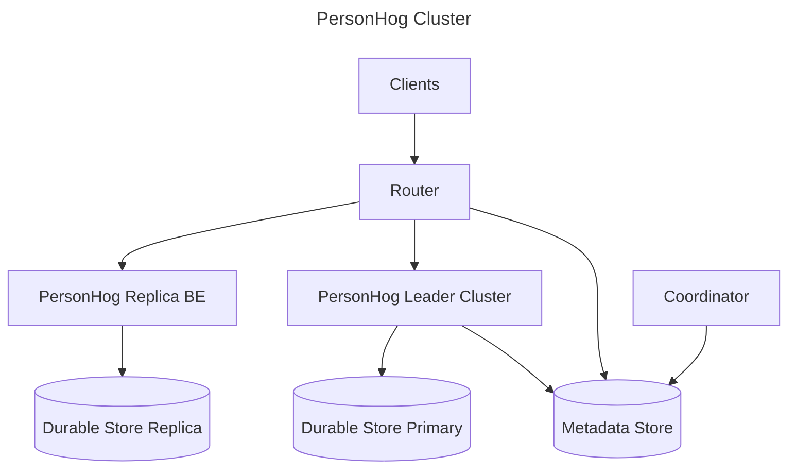

# Personhog Context Document

A living document to provide context around the architecture of the Personhog cluster.

This document lays out the overall cluster architecture and defines the responsibilities of each piece of the architecture. It should avoid getting into the implementation details of the different services.

Context for the implementation details and current state of each service lives in the README.md in the root of the respective service's folder, e.g more context on personhog-replica lives at posthog/rust/personhog-replica/README.md

## Personhog Cluster

The personhog cluster is composed of the following pieces:

- personhog-router
- personhog-replica
- personhog-leader cluster
- personhog-coordinator + metdata store

Basic Architecture Diagram

### Router/Frontend (FE)

- responsible for routing requests to the correct personhog pod
- serves as a single entry point into all things person/personhog
- no state or dependencies are needed for the router to route a request to a personhog-replica pod
- stateful/protocol enabled routing to decide which personhog-leader pod should serve an incoming request

### Personhog-replica Backend (BE)

- responsible for handling eventually consistent person reads, strong reads and writes to non-cached tables
- isolates all the simple data access patterns from the stateful personhog-leader BE
- gRPC service
- creates a request path that is cheaper and easier to scale/operate for clients that don't need strong consistent reads/writes to the cached tables on personhog-leader BEs

### Personhog-leader Backend Cluster

- responsible for providing a more efficient, but durable write path for data in the persons table
- serves requests that need strong consistent reads/writes against data in the persons table
- stateful API that caches person data on it
- cached data allows for incredibly fast/efficient person writes; we can only update properties that have actually changed on the person rather than re-writing the entire person row
- distribute cache across pods using a virtual node (vNode) schem to minimize shuffling needed to be done when the number of pods in the system changes
- provides durability for the single point of failure caches on pods through a distributed changelog that gets sinked into a durable store

### Coordinator + Metadata store

- responsible for handling vNode ownership:
- implements a handoff protocol that facilitates the following system changes:
- N + 1 pods in system (scaling up)
- N - 1 pods in system (scaling down)
- N -> M pods (deployment handoff)
- crashed pods/corrupted disks
- ensures handoffs do not introduce split brain invariant or cause service interruptions amongst the different actors in the distributed system
