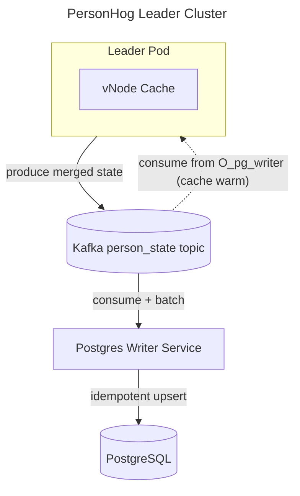
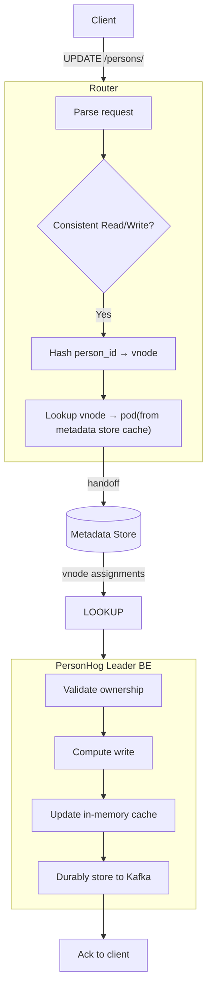

## personhog-leader cluster

### Requirements

- provides API contract allowing strong consistent reads/writes to person state
- enables faster/more efficient writes to person properties than writing directly to Postgres
- durably stores any write that a personhog client has received a status OK for
- new service versions can be deployed without service disruptions or inconsistent writes
- pods can scale up and down without service disruptions or inconsistent writes
- crashed pods can be recovered from with minimal downtime

### To Implement

### Known Implementation Details

#### Efficient Writes

- stateful API that caches person data on pods
- API can receive a list of property updates and only update/writes the changed property fields, doesn't replace the entire property field

TBD:

- what technology to use for the cache? how does a pod recover from a crash/restore its cache? how long does that take? does every pod crash result in service disruption? for how long?

#### Durability

- with writes going to the cache, the head of application state now lives in the cache (single point of failure), not in Postgres (durable store). we need durability
- after each person write to the cache and before we ack to client, we emit a message to kafka (acting as a distributed log)
- the head of our application state can always be materialized through replaying Kafka messages onto the outdated PG state
- a separate PG writer service consumes messages from the kafka topic and batch write to PG
- maintains a committed offset per partition, i.e. O_pg_writer(P)
- this offset is the boundary:
- below the offset: state is durably in Postgres
- at or above the offset: state is PG + the changes in our distributed log (the kafka topic)
TBD:
- new pods can warm their caches/materialize state by seeding from PG then applying messages from kafka changelog past the indicated offset O_pg_writer(P) (could change depending on caching/embedded store choice)

#### vNode ownership

TBD

#### Request Path

