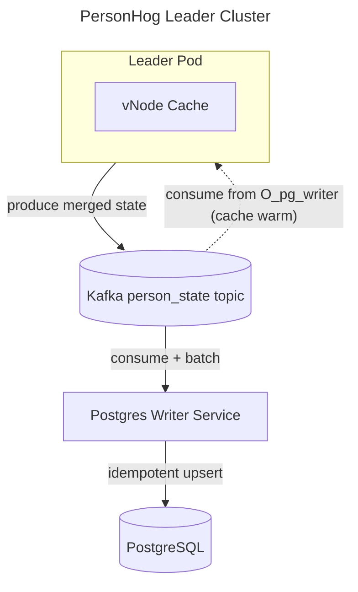
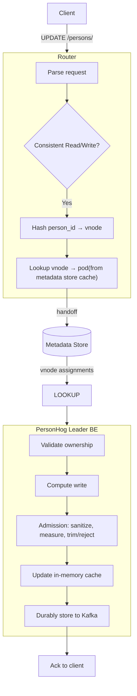

## personhog-leader cluster

### Requirements

- provides API contract allowing strong consistent reads/writes to person state
- enables faster/more efficient writes to person properties than writing directly to Postgres
- durably stores any write that a personhog client has received a status OK for
- new service versions can be deployed without service disruptions or inconsistent writes
- pods can scale up and down without service disruptions or inconsistent writes
- crashed pods can be recovered from with minimal downtime

### To Implement

### Known Implementation Details

#### Efficient Writes

- stateful API that caches person data on pods
- API can receive a list of property updates and only update/writes the changed property fields, doesn't replace the entire property field

TBD:

- what technology to use for the cache? how does a pod recover from a crash/restore its cache? how long does that take? does every pod crash result in service disruption? for how long?

#### Durability

- with writes going to the cache, the head of application state now lives in the cache (single point of failure), not in Postgres (durable store). we need durability
- after each person write to the cache and before we ack to client, we emit a message to kafka (acting as a distributed log)
- the head of our application state can always be materialized through replaying Kafka messages onto the outdated PG state
- a separate PG writer service consumes messages from the kafka topic and batch write to PG
- maintains a committed offset per partition, i.e. O_pg_writer(P)
- this offset is the boundary:
- below the offset: state is durably in Postgres
- at or above the offset: state is PG + the changes in our distributed log (the kafka topic)

#### Admission

Every record the leader produces to the changelog must be applyable by the
writer's upsert verbatim: the changelog is the source of truth, Postgres is a
downstream consumer of it, and a record the writer cannot apply would leave
acked state that never lands (the writer halts rather than skip, since every
later snapshot for a person builds on the same state). Admission enforces
this before the ack, under the per-person lock, on the merged result of each
update:

1. **Sanitize** (`personhog_common::properties::sanitize_for_jsonb`): NUL
   (`\u0000`) becomes `\u{FFFD}` in every string, matching the Node
   pipeline's `sanitizeJsonbValue` — Postgres jsonb refuses NUL. Floats
   beyond ±1e307 are clamped: Postgres renders jsonb numerics in expanded
   decimal, and serde_json cannot parse expansions of ~1e308+, so larger
   values would apply but never load back.
2. **Measure** (`jsonb_column_size`): an exact reimplementation of
   `pg_column_size` for JSONB, welded byte-equal to a live Postgres by
   `personhog-common/tests/jsonb_size_pg.rs`. Above the threshold (the
   `check_properties_size` ceiling), non-protected properties are trimmed
   alphabetically to the target; if protected properties alone cannot fit,
   the update is rejected with `INVALID_ARGUMENT` carrying sizes, never
   values. `PropertySizeLimits::new` refuses inverted configuration at
   startup.
3. **Assert** (`assert_writeable`): identity fields that originate from
   earlier state (uuid parses, team_id fits the column's integer,
   created_at within sane bounds) — corrupt state must never reach the
   changelog.

Trims and rejections emit `person_properties_size_violation` ingestion
warnings (`src/warnings.rs`), throttled per (team, type) to match the Node
pipeline's limiter. The writer-side weld
(`personhog-writer/tests/admission_weld.rs`) runs hostile property fixtures
through these exact functions and the writer's real statement against live
Postgres, asserting byte-exact round-trips.

#### Cache warming on partition handoff

When a partition moves between leader pods, the new owner repopulates
its cache by replaying the slice of `personhog_updates` that the
writer has not yet persisted to PG. The warming pipeline lives in
`src/warming.rs` and is invoked by `LeaderHandoffHandler::warm_partition`
when the handoff reaches the `Warming` phase (see
`personhog-coordination`'s README for the full
`Freezing → Draining → Warming → Complete` protocol).

**Pre-conditions established by the protocol:**

- `Freezing` collected freeze quorum from every router → no router
  forwards to the old owner anymore.
- `Draining` waited for the old owner's in-flight handlers to complete
  and produced `PodDrainedAck` → no producer can append to this
  partition's Kafka log.

By the time `Warming` runs, the partition's HWM is therefore stable
and warming can consume to a known endpoint without racing producers.

**The pipeline:**

1. Query the writer's consumer group's committed offset
   (`O_pg_writer(P)`) via a short-lived OffsetFetch consumer. Anything
   at or after this offset still needs to be in cache; anything below
   is already durable in PG.
2. Resolve the start offset: `committed_offset - lookback_offsets`,
   clamped to the partition's earliest available offset. The lookback
   is a configurable safety margin against momentary races between
   the writer's commit and our read of it.
3. `assign()` (not `subscribe()`) the warming consumer to the
   partition at the resolved start offset and consume until HWM.
4. Buffer decoded records locally; only commit them to the cache
   after the entire range warms successfully via
   `PartitionedCache::install_warmed_partition`, which builds the
   populated `PersonCache` first and publishes it via a single
   `DashMap::insert`. Any decode/IO failure mid-range aborts warming
   with no observable cache mutation, preventing a partial cache from
   silently masking PG fallback reads.

**Configurable knobs** (env vars, see `src/config.rs`):

- `WRITER_CONSUMER_GROUP` — group whose committed offset bounds the
  warming range.
- `WARM_LOOKBACK_OFFSETS` — safety margin to rewind past the writer's
  commit.
- `WARM_COMMITTED_OFFSETS_TIMEOUT_SECS`, `WARM_FETCH_WATERMARKS_TIMEOUT_SECS`,
  `WARM_RECV_TIMEOUT_SECS` — Kafka call timeouts.
- `WARM_RETRY_MAX_ATTEMPTS`, `WARM_RETRY_INITIAL_BACKOFF_MS`,
  `WARM_RETRY_MAX_BACKOFF_MS` — retry policy for transient Kafka
  metadata failures.

The synchronous rdkafka calls (`committed_offsets`, `fetch_watermarks`)
run on the blocking pool via `tokio::task::spawn_blocking` so a slow
broker can't park the runtime thread.

#### vNode ownership

The pod participates in `personhog-coordination`'s handoff protocol
via `LeaderHandoffHandler` (see `src/coordination/mod.rs`):

- `drain_partition_inflight` (Draining): fences the partition against
  new writes (`InflightTracker::fence` — fenced writes are refused with
  `FAILED_PRECONDITION`), *then* waits for the per-partition counter to
  drop to zero, then writes `PodDrainedAck`. Fencing before waiting is
  what makes "counter reached zero" final: without the fence a write
  admitted after the wait could advance the Kafka HWM past the point
  warming snapshots. Combined with the produce path's sync-await on
  Kafka delivery, this gives the protocol the guarantee that
  "no in-flight" implies "every acked write durable in Kafka."
  Reads are never fenced — until cutover the frozen cache state is
  still the latest.
- `warm_partition` (Warming): see the section above. Also lifts any
  fence left over from a previous ownership of the same partition.
- `release_partition` (Complete): lifts the write fence and drops the
  partition's cache slot via `PartitionedCache::drop_partition` once
  the routing table has flipped to the new owner.
- `resume_partition` (handoff cancelled): a handoff deleted before
  `Complete` while this pod still owns the partition is a
  cancellation — lifts the write fence so the partition serves writes
  again.

#### Request Path

