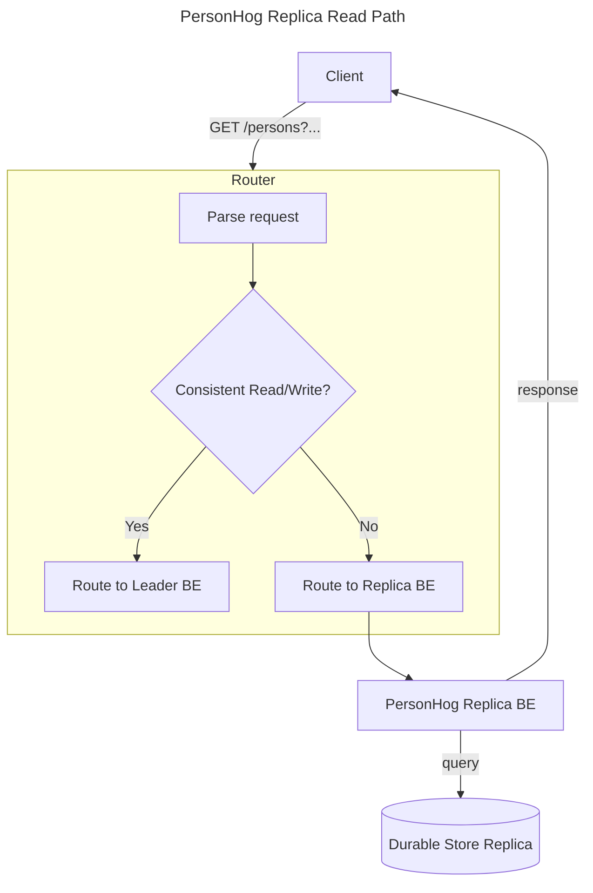

### personhog-replica cluster

### Requirements

- provides an API contract for eventual person reads, strong reads to non-persons tables, writes to non-persons tables
- provides a cheap, quickly scalable, operationally simple request path for simple data access patterns
- gRPC service

### Known Implementation Details

