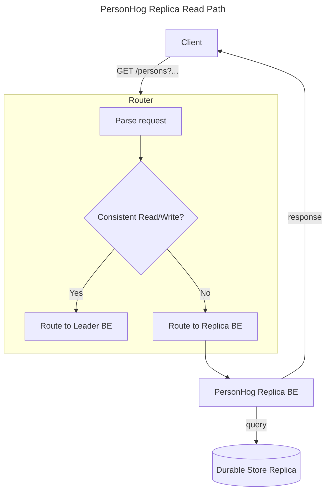

### personhog-replica cluster

### Requirements

- provides an API contract for eventual person reads, strong reads to non-persons tables, writes to non-persons tables
- provides a cheap, quickly scalable, operationally simple request path for simple data access patterns
- gRPC service

### Person deletes

`DeletePersons` hard-deletes person and distinct-id rows unless the request asks for `DELETE_PERSONS_MODE_TOMBSTONE`.
A tombstone keeps the rows with `is_deleted = true`, the version bumped by one, and person properties scrubbed, and the response reports the versions written so the caller can publish ClickHouse tombstones at exactly those versions.
The row's version counter survives, so a later create on the same key revives it above its own ClickHouse tombstone instead of restarting at version 0.
The tombstone cleanup drain (`DeleteTombstonedPersons`) removes the rows later, once their ClickHouse history is gone.
`DeletePersonsBatchForTeam` always hard-deletes, tombstoned rows included: it serves team teardown, where no sweep would ever clean the tombstones up.
Hard deletes remove tombstoned rows too, so a caller that stops asking for tombstones leaves nothing behind.

### Known Implementation Details

```mermaid
---
title: PersonHog Replica Read Path
---
graph TB
    C[Client] -->|"GET /persons?..."| R

    subgraph R[Router]
        direction TB
        PARSE[Parse request] --> DECIDE{Consistent Read/Write?}
        DECIDE -->|"Yes"| LEADER[Route to Leader BE]
        DECIDE -->|"No"| REPLICA[Route to Replica BE]
    end

    REPLICA --> RP1[PersonHog Replica BE]

    RP1 -->|query| PG[(Durable Store Replica)]
    RP1 -->|response| C
```
