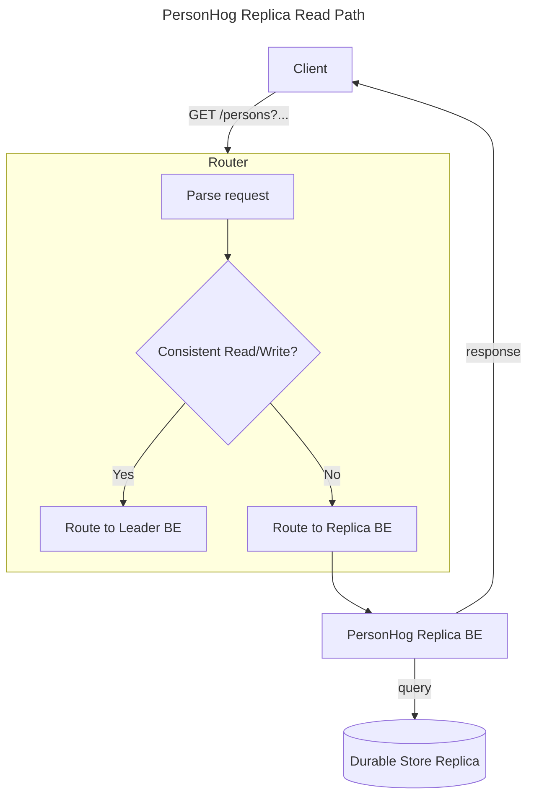

### personhog-replica cluster

### Requirements

- provides an API contract for eventual person reads, strong reads to non-persons tables, writes to non-persons tables
- provides a cheap, quickly scalable, operationally simple request path for simple data access patterns
- gRPC service

### Person deletes

`DeletePersons` and `DeletePersonsBatchForTeam` hard-delete person and distinct-id rows by default.
Set `PERSON_DELETE_TOMBSTONE=true` to switch to tombstones: the rows stay with `is_deleted = true`, the version bumped by one, and person properties scrubbed.
A tombstone keeps the row's version counter, so a later create on the same key revives it above its own ClickHouse tombstone instead of restarting at version 0.
Hard deletes still remove tombstoned rows, so disabling the flag or tearing a team down leaves nothing behind.

### Known Implementation Details

```mermaid
---
title: PersonHog Replica Read Path
---
graph TB
    C[Client] -->|"GET /persons?..."| R

    subgraph R[Router]
        direction TB
        PARSE[Parse request] --> DECIDE{Consistent Read/Write?}
        DECIDE -->|"Yes"| LEADER[Route to Leader BE]
        DECIDE -->|"No"| REPLICA[Route to Replica BE]
    end

    REPLICA --> RP1[PersonHog Replica BE]

    RP1 -->|query| PG[(Durable Store Replica)]
    RP1 -->|response| C
```
