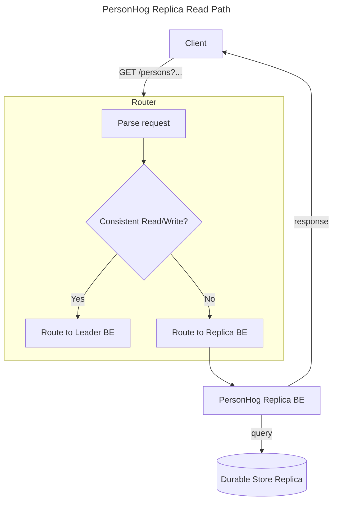

### personhog-replica cluster

### Requirements

- provides an API contract for eventual person reads, strong reads to non-persons tables, writes to non-persons tables
- provides a cheap, quickly scalable, operationally simple request path for simple data access patterns
- gRPC service

### Person deletes

`DeletePersons` hard-deletes person and distinct-id rows by default.
Set `PERSON_DELETE_TOMBSTONE=true` to switch it to tombstones: the rows stay with `is_deleted = true`, the version is bumped by one, and person properties are scrubbed.
A tombstone keeps the row's version counter, so a later create on the same key revives it above its own ClickHouse tombstone instead of restarting at version 0.
The tombstone cleanup drain (`DeleteTombstonedPersons`) removes the rows later, once their ClickHouse history is gone.
`DeletePersonsBatchForTeam` always hard-deletes, tombstoned rows included: it serves team teardown, where no sweep would ever clean the tombstones up.
Hard deletes still remove tombstoned rows, so turning the flag off leaves nothing behind.

### Known Implementation Details

```mermaid
---
title: PersonHog Replica Read Path
---
graph TB
    C[Client] -->|"GET /persons?..."| R

    subgraph R[Router]
        direction TB
        PARSE[Parse request] --> DECIDE{Consistent Read/Write?}
        DECIDE -->|"Yes"| LEADER[Route to Leader BE]
        DECIDE -->|"No"| REPLICA[Route to Replica BE]
    end

    REPLICA --> RP1[PersonHog Replica BE]

    RP1 -->|query| PG[(Durable Store Replica)]
    RP1 -->|response| C
```
