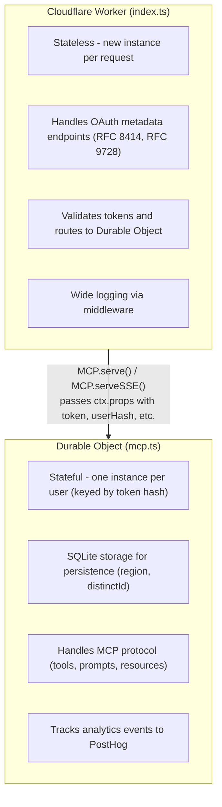
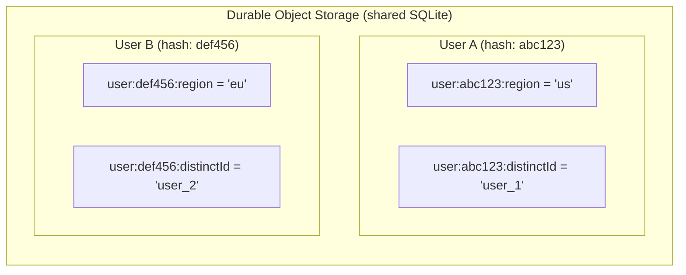
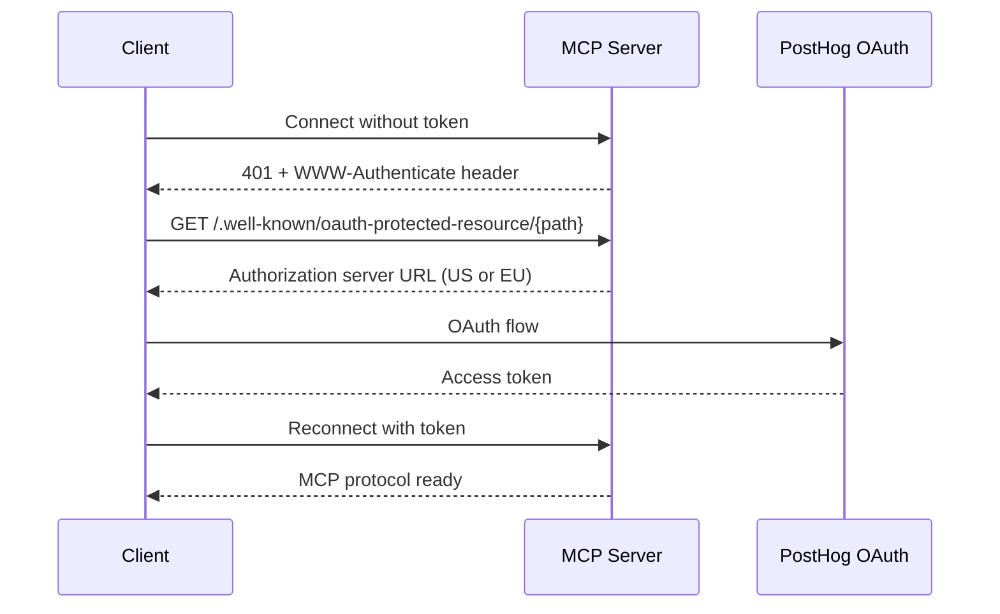

# MCP Integration Architecture

This directory contains the Cloudflare Workers implementation of PostHog's MCP (Model Context Protocol) server.

## Overview

The implementation uses two Cloudflare primitives:

1. **Worker** (`index.ts`) - Stateless request router
2. **Durable Object** (`mcp.ts`) - Stateful MCP protocol handler



## File Structure

```txt
src/integrations/mcp/
├── index.ts          # Worker entry point and request router
├── mcp.ts            # Durable Object class (MCP protocol handler)
├── README.md         # This file
└── utils/
    ├── client.ts     # PostHog analytics client
    ├── formatResponse.ts
    ├── handleToolError.ts
    └── logging.ts    # Wide logging middleware
```

## Key Concepts

### Worker → Durable Object Communication

The Worker passes request context to the Durable Object via `ctx.props`:

```typescript
// In Worker (index.ts)
Object.assign(ctx.props, {
  apiToken: token,
  userHash: hash(token),
  sessionId: sessionId,
  features: features,
  region: regionParam,
})

// Then route to Durable Object
MCP.serve('/mcp').fetch(request, env, ctx)
```

The Durable Object accesses this via `this.props`:

```typescript
// In Durable Object (mcp.ts)
get requestProperties(): RequestProperties {
    return this.props as RequestProperties
}
```

### Per-User State via Durable Objects

Durable Objects provide a single shared SQLite storage instance (`this.ctx.storage`). To achieve per-user isolation within this shared storage, we use a **namespaced key pattern**:



The `DurableObjectCache` handles this namespacing automatically:

```typescript
// In DurableObjectCache (src/lib/cache/DurableObjectCache.ts)
private getScopedKey(key: string): string {
    return `user:${this.userHash}:${key}`
}

// When mcp.ts calls:
await this.cache.set('region', 'us')

// It actually stores:
await this.storage.put('user:abc123:region', 'us')
```

The `userHash` is a PBKDF2 hash of the API token (see `src/lib/utils/helper-functions.ts`), ensuring:

- **Isolation**: Users can't access each other's cached data (different prefix)
- **Persistence**: Region and distinctId survive across requests
- **Deterministic**: Same token always produces the same hash/prefix
- **Secure**: Tokens can't be reversed from the hash

### Wide Logging Pattern

Instead of scattered log statements, we accumulate data into a single log object and emit once at the end:

```typescript
const log = new RequestLogger()
log.extend({ route: url.pathname })
log.extend({ region: effectiveRegion })
// ... handle request ...
log.emit(response.status) // Single log with all data + duration
```

This produces one structured JSON log per request, making it easier to query in observability tools.

## OAuth Flow

The server implements RFC 9728 (OAuth Protected Resource Metadata) and RFC 8414 (OAuth Authorization Server Metadata):



## Wrangler Configuration

The Durable Object binding is configured in `wrangler.jsonc`:

```jsonc
{
  "durable_objects": {
    "bindings": [
      {
        "class_name": "MCP",
        "name": "MCP_OBJECT",
      },
    ],
  },
  "migrations": [
    { "new_sqlite_classes": ["MyMCP"], "tag": "v1" },
    { "renamed_classes": [{ "from": "MyMCP", "to": "MCP" }], "tag": "v2" },
  ],
}
```

The `MCP` class must be exported from the Worker entry point for Wrangler to find it.
