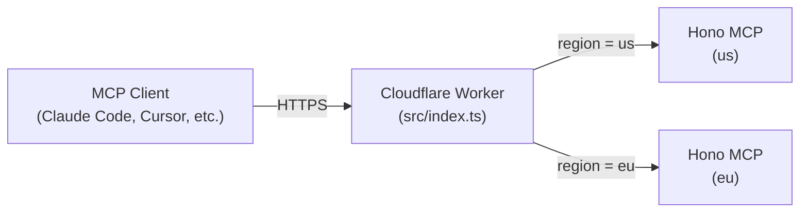

# MCP Server Architecture

PostHog's MCP server runs as a long-lived Node/Hono service. A thin Cloudflare
Worker sits in front of it as a region-aware reverse proxy.

## Overview


```mermaid
flowchart LR
    Client["MCP Client<br/>(Claude Code, Cursor, etc.)"]
    CF["Cloudflare Worker<br/>(src/index.ts)"]
    HonoUS["Hono MCP<br/>(us)"]
    HonoEU["Hono MCP<br/>(eu)"]

    Client -->|"HTTPS"| CF
    CF -->|"region = us"| HonoUS
    CF -->|"region = eu"| HonoEU
```

### Cloudflare Worker (`src/index.ts`)

Stateless reverse proxy. Its only responsibilities:

1. **Region detection** — figure out whether this request belongs in US or EU.
2. **Forward** — replay the request unchanged at the matching Hono backend.

All MCP protocol handling, OAuth metadata, auth gating, static asset serving,
and analytics happen in Hono.

### Hono MCP server (`src/hono/*`)

The full MCP server — tool catalog, OAuth metadata endpoints, request lifecycle,
analytics, Redis-backed session state, UI app resources. Deployed per region
(`mcp.us.posthog.com`, `mcp.eu.posthog.com`).

## Region detection

The Worker picks a region in this order:

1. **Hostname.** `mcp-eu.posthog.com` → `eu`. This subdomain exists as a
   workaround for [Claude Code's OAuth bug](https://github.com/anthropics/claude-code/issues/2267)
   — Claude Code ignores the `authorization_servers` field from the OAuth
   protected-resource metadata and instead fetches
   `/.well-known/oauth-authorization-server` directly. Routing EU users to a
   distinct subdomain lets us redirect that direct probe at the right
   authorization server.
2. **Query param.** `?region=us` or `?region=eu`.
3. **Token probe.** When the request has an `Authorization: Bearer phx_…/pha_…`
   header, the Worker calls `/api/users/@me` against both `us.posthog.com` and
   `eu.posthog.com` in parallel and uses whichever 2xx's. The result is cached
   in the `MCP_KV` namespace for 7 days, keyed by the PBKDF2 hash of the token.
4. **Default.** `us`.

## Proxying

Once the region is resolved, the Worker rewrites the request URL's host /
protocol / port to point at the Hono backend (`https://mcp.us.posthog.com` or
`https://mcp.eu.posthog.com`) and re-issues the request via `fetch()`. The
request body, headers, and path stay intact, including streamable-HTTP
responses for `/mcp`.

The `MCP_HONO_URL` env var overrides the per-region target — used by
`wrangler dev` to send everything at a locally-running Hono instance.

## Wrangler configuration

The Worker config is intentionally minimal:

```jsonc
{
    "name": "mcp1",
    "main": "src/index.ts",
    "compatibility_date": "2025-03-10",
    "compatibility_flags": ["nodejs_compat"],
    "kv_namespaces": [{ "binding": "MCP_KV", "id": "…" }],
    "observability": { … },
}
```

No Durable Objects, no static assets, no migrations — the Worker holds no
state of its own beyond the region cache in `MCP_KV`.

## Logging

`src/lib/logging.ts` provides a wide-log middleware that accumulates per-request
data and emits a single structured JSON line at the end. The proxy logs the
method, pathname, resolved region, region-detection source (`hostname` /
`query` / `token` / `default`), and the chosen Hono target.
