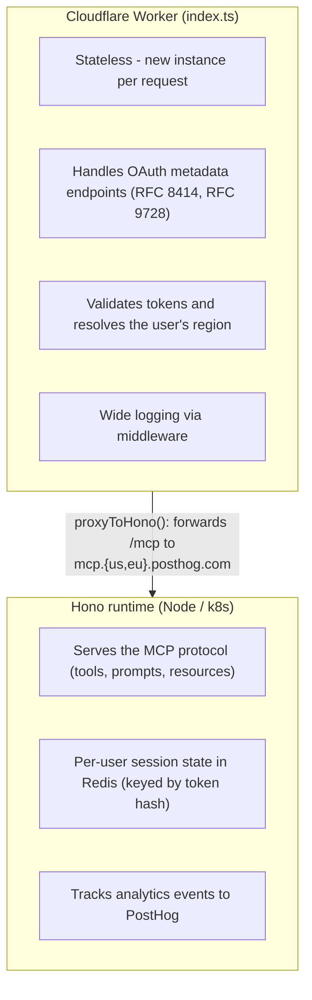
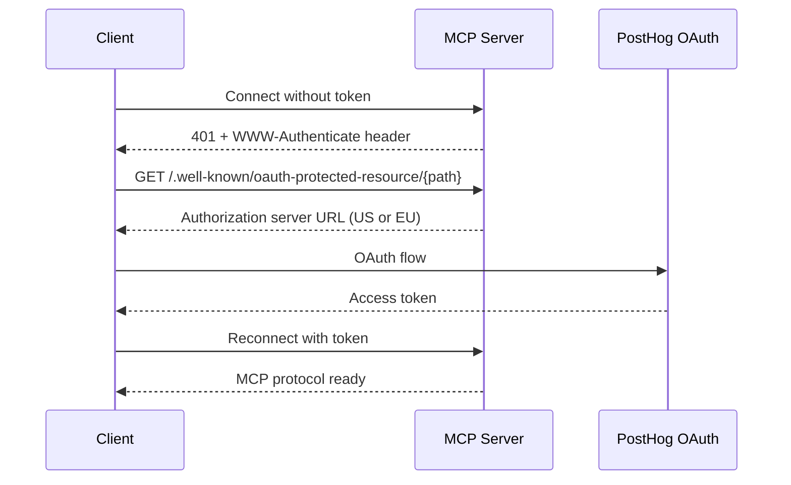

# MCP Integration Architecture

This directory contains PostHog's MCP (Model Context Protocol) server. The protocol is served by the **Hono runtime** (Node, deployed to our k8s clusters). A thin **Cloudflare Worker** sits in front of it as a stateless edge router that terminates OAuth, validates tokens, and proxies `/mcp` traffic to the regional Hono deployment.

## Overview


```mermaid
flowchart TB
    subgraph Worker["Cloudflare Worker (index.ts)"]
        W1["Stateless - new instance per request"]
        W2["Handles OAuth metadata endpoints (RFC 8414, RFC 9728)"]
        W3["Validates tokens and resolves the user's region"]
        W4["Wide logging via middleware"]
    end

    subgraph Hono["Hono runtime (Node / k8s)"]
        H1["Serves the MCP protocol (tools, prompts, resources)"]
        H2["Per-user session state in Redis (keyed by token hash)"]
        H3["Tracks analytics events to PostHog"]
    end

    Worker -->|"proxyToHono(): forwards /mcp to<br/>mcp.{us,eu}.posthog.com"| Hono
```

The Worker no longer serves the protocol itself — an earlier iteration ran a stateful Cloudflare Durable Object (`mcp.ts`) for this, but that has been removed in favor of always proxying to Hono.

## File Structure

```txt
src/
├── index.ts          # Worker entry point: OAuth, routing, /mcp proxy
├── proxy.ts          # Region resolution + reverse proxy to the Hono runtime
├── hono/             # The Hono runtime that actually serves the MCP protocol
└── lib/              # Shared helpers (caching, analytics, logging, …)
```

## Key Concepts

### Worker → Hono communication

The Worker resolves the caller's region (from cache/KV or by probing both regions) and reverse-proxies the request to the matching Hono deployment:

```typescript
// In Worker (index.ts)
if (url.pathname.startsWith('/mcp')) {
  const region = await resolveProxyRegion(token, ctx.props.userHash, env.MCP_KV)
  return proxyToHono(request, region)
}
```

`RequestProperties` (the parsed headers and query params for a request) is defined in `src/lib/request-properties.ts` and shared by both runtimes.

### Per-User State

The Hono runtime keeps per-user session state (active project/organization, region, distinctId) in Redis, namespaced by `userHash` — a PBKDF2 hash of the API token (see `src/lib/utils`), ensuring:

- **Isolation**: Users can't access each other's cached data (different prefix)
- **Persistence**: Region and distinctId survive across requests
- **Deterministic**: Same token always produces the same hash/prefix
- **Secure**: Tokens can't be reversed from the hash

### Wide Logging Pattern

Instead of scattered log statements, we accumulate data into a single log object and emit once at the end:

```typescript
const log = new RequestLogger()
log.extend({ route: url.pathname })
log.extend({ region: effectiveRegion })
// ... handle request ...
log.emit(response.status) // Single log with all data + duration
```

This produces one structured JSON log per request, making it easier to query in observability tools.

### Tracking and observability

There are three independent layers that emit signals about each MCP request:

1. **PostHog analytics events** — `$mcp_tool_call` and friends, captured for product analytics.
2. **Outbound API headers** — propagated when the MCP server calls PostHog's Django backend, so backend log lines and OTLP spans can correlate with the originating MCP request.
3. **Wide structured logs** — single JSON record per request from the Worker itself (see [Wide Logging Pattern](#wide-logging-pattern) above).

#### `$mcp_tool_call` event paths

The canonical event is `$mcp_tool_call`.
The legacy unprefixed `mcp_tool_call` alias is no longer emitted — the transition shim that dual-emitted it through the cutover has been removed (only pre-2026-06-16 history remains under that name).
The path that fires depends on the server mode and on the `mcp-posthog-analytics-sdk` feature flag:

- **`hono/analytics.ts`** — homegrown PostHog capture. Used by the exec-mode wrapper to emit events for inner tool calls. Properties use the bare form: `mcp_session_id`, `mcp_conversation_id`, `mcp_client_name`, etc.
- **`lib/mcpcat.ts`** — legacy MCPcat SDK path. Same bare property names.
- **`lib/posthog-mcp-analytics.ts`** — the [`@posthog/mcp-analytics`](https://github.com/PostHog/mcp-analytics) SDK. Property names are `$`-prefixed (`$mcp_session_id`, `$mcp_conversation_id`, …). This is the path most live traffic flows through today.

Adding a new property to events means wiring it into the `McpCatIdentityProvider` interface and the property-builder in **all three** emitters, then sourcing the value on `requestProperties` (or pulling it from another DO-level source).

#### Three correlation identifiers

Three identifiers travel with each request, each with a different lifecycle and a different consumer:

| Identifier                                          | Source                                                                                                                                                                                                                                                                                     | Where it lands                                                                                                                                                                                                             |
| --------------------------------------------------- | ------------------------------------------------------------------------------------------------------------------------------------------------------------------------------------------------------------------------------------------------------------------------------------------ | -------------------------------------------------------------------------------------------------------------------------------------------------------------------------------------------------------------------------- |
| **`sessionId`** (wrapper-app hint)                  | `?sessionId=` query param, set by integrators (setup wizard, sandbox, etc.)                                                                                                                                                                                                                | Resolved to a UUIDv7 via `SessionManager.getSessionUuid()` and stamped as `$session_id` / `$ai_session_id` on events — drives Session Replay and AI observability grouping. Only set when a wrapper supplies it.           |
| **`mcpSessionId`** (transport session)              | `Mcp-Session-Id` HTTP header, server-minted on initialize per the [Streamable-HTTP MCP spec](https://modelcontextprotocol.io/specification/2025-06-18/basic/transports#streamable-http) and echoed by clients on every subsequent request                                                  | Stamped on `mcp_tool_call` events as `mcp_session_id` / `$mcp_session_id`, and forwarded to Django as `X-Posthog-Mcp-Session-Id` so backend structlog contextvars + OTLP span attributes (`mcp.session_id`) can correlate. |
| **`mcpConversationId`** (agent-echoed conversation) | The `conversation_id` arg [injected into tool schemas](https://github.com/PostHog/mcp-analytics/pull/14) by `@posthog/mcp-analytics` when `enableConversationId: true`. The SDK mints a UUID and asks the agent to echo it on subsequent calls, so it persists across transport reconnects | Same plumbing as `mcpSessionId` — stamped on events and forwarded to Django as `X-Posthog-Mcp-Conversation-Id`.                                                                                                            |

Crucially, **`sessionId` and `mcpSessionId` are different concepts** and will not match for the same request. The wrapper-app `sessionId` is only set for a small fraction of traffic (mostly integrator-driven flows); the transport `mcpSessionId` is on essentially every authenticated request after initialize.

#### Forwarding session and conversation IDs to Django

When the Worker calls PostHog's Django backend (any `ApiClient.fetch`), the outbound request carries:

- `X-Posthog-Mcp-Session-Id: <mcpSessionId>` — when set on `ApiClient.config`
- `X-Posthog-Mcp-Conversation-Id: <mcpConversationId>` — when set on `ApiClient.config`

On the Django side, `per_request_logging_context_middleware` reads both headers (sanitized through the existing `sanitize_header_value` helper), binds them to structlog contextvars (`mcp_session_id`, `mcp_conversation_id`), and sets them on the current OTLP span as `mcp.session_id` / `mcp.conversation_id`.

The headers are caller-asserted — anyone can spoof them on a request — so backend consumers should treat them as correlation hints, not authoritative identifiers.

This is **attribute-based correlation, not distributed-trace span linkage** — the Worker emits no OTLP itself and forwards no `traceparent`, so the Django-rooted span is not a child of any Worker-side span. Tracing backends can correlate after the fact by querying on the attribute, but won't render a cross-service trace tree until Worker-side OTLP export ships.

## OAuth Flow

The server implements RFC 9728 (OAuth Protected Resource Metadata) and RFC 8414 (OAuth Authorization Server Metadata):


```mermaid
sequenceDiagram
    participant Client
    participant MCP as MCP Server
    participant PostHog as PostHog OAuth

    Client->>MCP: Connect without token
    MCP-->>Client: 401 + WWW-Authenticate header
    Client->>MCP: GET /.well-known/oauth-protected-resource/{path}
    MCP-->>Client: Authorization server URL (US or EU)
    Client->>PostHog: OAuth flow
    PostHog-->>Client: Access token
    Client->>MCP: Reconnect with token
    MCP-->>Client: MCP protocol ready
```

## Wrangler Configuration

The Worker no longer binds a Durable Object — `/mcp` is proxied to the Hono runtime. The historical DO migrations remain in `wrangler.jsonc` as tombstones, with a final `deleted_classes` migration that retires the class (and its per-user SQLite storage) in Cloudflare:

```jsonc
{
  "migrations": [
    { "new_sqlite_classes": ["MyMCP"], "tag": "v1" },
    { "renamed_classes": [{ "from": "MyMCP", "to": "MCP" }], "tag": "v2" },
    { "deleted_classes": ["MCP"], "tag": "v3" },
  ],
}
```
